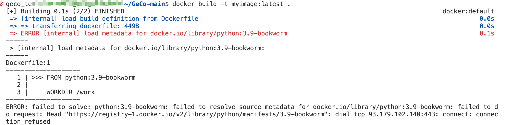

# docker

- [ ] 服务器拉取不了 docker 镜像

Error response from daemon: Get "https://registry-1.docker.io/v2/": net/http: request canceled while waiting for connection (Client.Timeout exceeded while awaiting headers)

- [ ] 服务器也 build 不了镜像

- [ ] 问题描述

说实话，我真的炸裂，现在是想要一个 docker 能够跑通自己的程序，为了增加可移植性，想创建一个 docker 的镜像，本来想着直接拉取一个基础的镜像，然后更改，比如 [这个链接](https://www.zhihu.com/question/486938264/answer/2665791940) ，结果呢，服务器代理出问题，拉取不下来；

那就想着本地拉取然后上传服务器，拉取是可以的，但是镜像是镜像，容器是容器，拉取下来的容器需要实例化为镜像，也是需要 run 一个，结果本地没有 cuda，报错 宿主机硬件不够的意思，不行；

实在不行，就[自己写 dockerfile](https://blog.csdn.net/A24kk42__/article/details/131970979) 把，卡到了构建镜像 docker build 一步，又双叒报错了，仔细看都是服务器代理的问题。

该怎么办，心烦意乱，还是问问同学，怎么回事。问了

（1）本地网络有代理，不代表服务器也有带俩

（2）本地下载下来，去上传到本地，那就不下有 cuda 的

心态，每个人都会遇到问题，没有人都在解决问题

