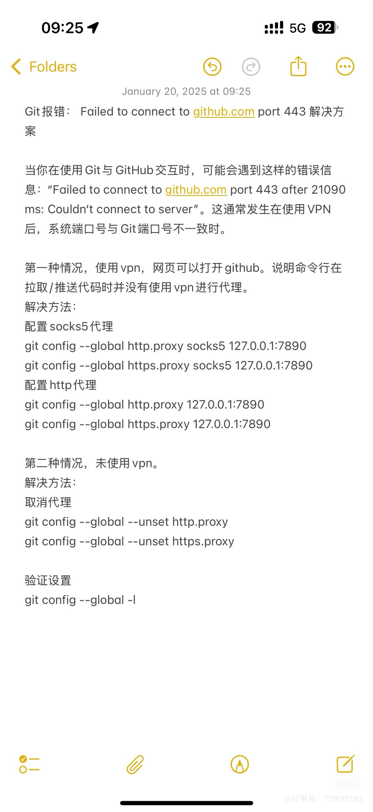

# github
## 线上和本地不同步问题

> Git: fatal: unable to access 'https://github.com/dearRongerr/Rongerr.github.io.git/': Failure when receiving data from the peer

先将远程分支的更改合并到本地分支，然后再推送。请按照以下步骤操作：

- 拉取远程分支的更改并合并到本地分支：

 ```bash
   git pull origin main --rebase
 ```

- 解决任何可能的冲突。如果有冲突，Git 会提示你解决冲突。解决冲突后，继续执行以下命令：

 ```bash
   git rebase --continue
 ```

- 最后，推送本地分支到远程仓库：


```bash
git push -u origin main
```

## Couldn't connect to server

> Git: fatal: unable to access 'https://github.com/dearRongerr/Rongerr.github.io.git/': Failed to connect to github.com port 443 after 75002 ms: Couldn't connect to server

- 网络问题，关代理，如果还不能解决：
- （第一种情况）使用 vpn，网页可以打开github，这种情况说明命令行在拉取、推送代码时没有使用 vpn 打开代理，解决方法：

配置 socks5 代理、配置http代理

```bash
git config --global http.proxy socks5 127.0.0.1:7890
git config --global https.proxy socks5 127.0.0.1:7890
git config --global http.proxy 127.0.0.1:7890
git config --global https.proxy 127.0.0.1:7890
```

- （第二种情况）如果未使用 vpn，此时解决方法，取消代理，终端输入：

```bash
git config --global --unset http.proxy
git config --global --unset https.proxy
```





## 安装 github 上的库

setup.py


## 不小心误点连接远程仓库

终端：`rm -rf .git`  删除.git文件
