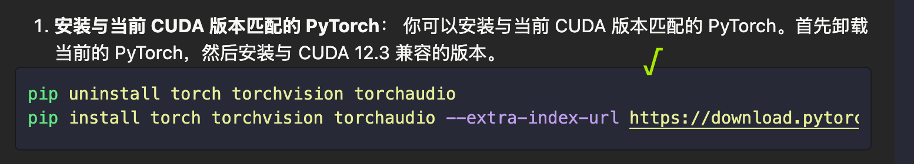

# python

```python
    File "/home/student2023/xiehr2023/GeCo-main/geco_test/lib/python3.9/site-packages/torch/utils/cpp_extension.py", line 552, in build_extensions
      _check_cuda_version(compiler_name, compiler_version)
    File "/home/student2023/xiehr2023/GeCo-main/geco_test/lib/python3.9/site-packages/torch/utils/cpp_extension.py", line 447, in _check_cuda_version
      raise RuntimeError(CUDA_MISMATCH_MESSAGE.format(cuda_str_version, torch.version.cuda))
  RuntimeError:
  The detected CUDA version (12.3) mismatches the version that was used to compile
  PyTorch (11.8). Please make sure to use the same CUDA versions.
  
  [end of output]
```



```python
pip uninstall torch torchvision torchaudio
pip install torch torchvision torchaudio --extra-index-url https://download.pytorch.org/whl/cu123
```


