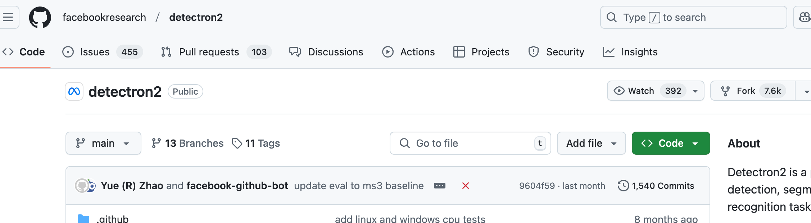
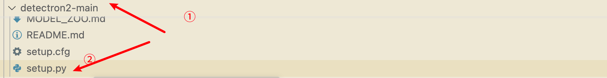

# python

## cuda 与 pytorch 版本不兼容

```python
    File "/home/student2023/xiehr2023/GeCo-main/geco_test/lib/python3.9/site-packages/torch/utils/cpp_extension.py", line 552, in build_extensions
      _check_cuda_version(compiler_name, compiler_version)
    File "/home/student2023/xiehr2023/GeCo-main/geco_test/lib/python3.9/site-packages/torch/utils/cpp_extension.py", line 447, in _check_cuda_version
      raise RuntimeError(CUDA_MISMATCH_MESSAGE.format(cuda_str_version, torch.version.cuda))
  RuntimeError:
  The detected CUDA version (12.3) mismatches the version that was used to compile
  PyTorch (11.8). Please make sure to use the same CUDA versions.
  
  [end of output]
```


```python
pip uninstall torch torchvision torchaudio
pip install torch torchvision torchaudio --extra-index-url https://download.pytorch.org/whl/cu123
```


## 从 github 上安装 python 库

本地使用 git 安装

第一步，安装 git

```bash
apt-get update
apt-get install -y git
```

🟢 第二步，克隆远程仓库到本地：

```bash
git clone https://github.com/facebookresearch/detectron2.git
```
第三步，进入目录（github 上的根目录）并安装

```bash
cd detectron2
```

> 
>

```bash
python setup.py install
```

补充：如果 zip 下载下来的，需要进入



[另外一种安装。](https://detectron2.readthedocs.io/en/latest/tutorials/install.html)

```bash
python -m pip install 'git+https://github.com/facebookresearch/detectron2.git'
```

