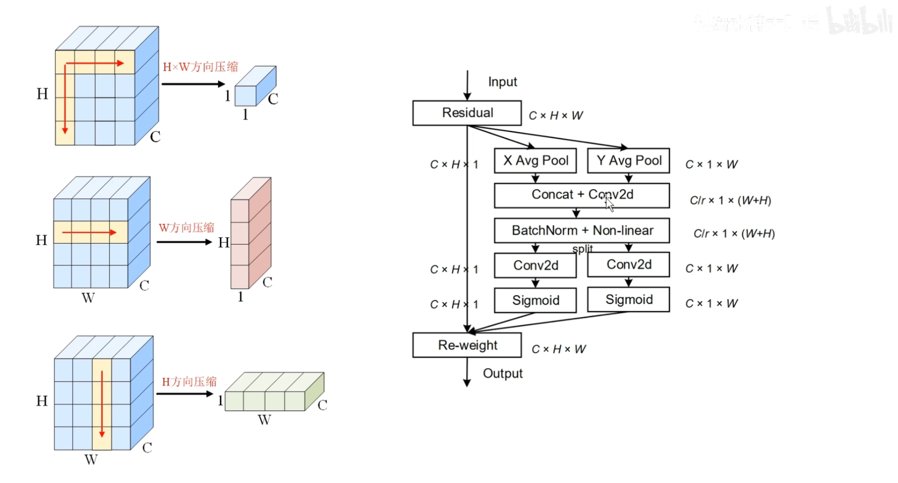

# 一些感悟

- 基本组件
- （并行 Pool）MaxPool 提取到最重要的特征，丢失次要信息，AvgPool 补充
- 级联并联卷积
- 融合通道信息、空间信息（CBAM 卷积块block注意力模块module）

> 

- MLP （H×W×2 → H×W×1）降维，聚合空间特征
- SKNets(selective kernels)

> 

- 坐标注意力，位置信息嵌入到空间信息，两个方向感知特征图，输入特征沿着空间方向的长程依赖

- （三分支注意力）模块图、计算流程图、有颜色的模块图，公式，代码

## 计算流程图

**SENet**

**CBAM** 

**改自 CBAM** 

**SKNet**

- 坐标注意力一定要试试

双重注意力网络（DANet

