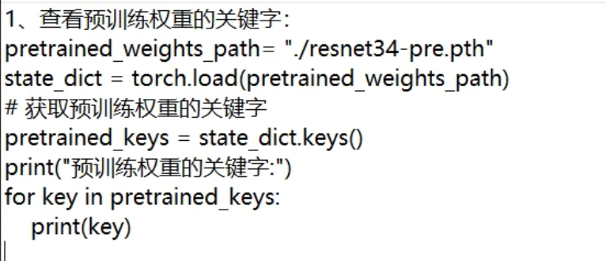
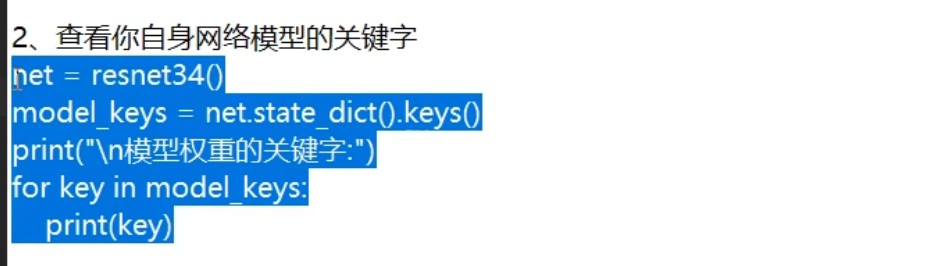
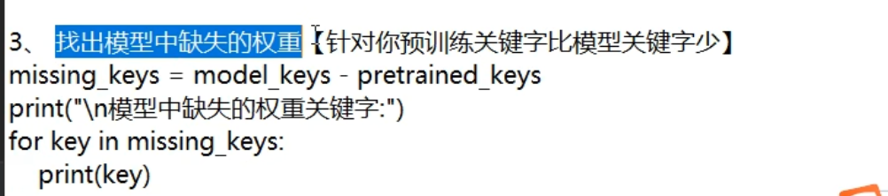
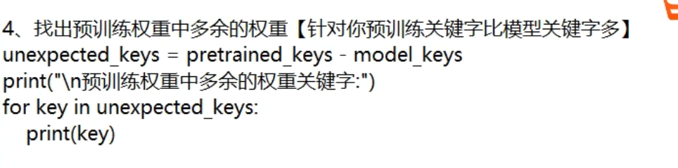
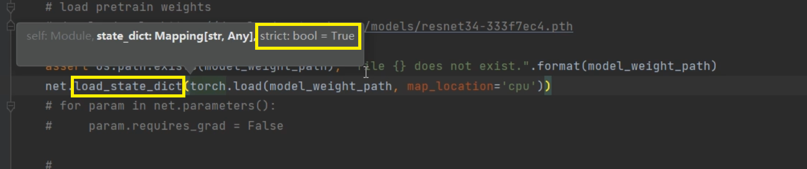
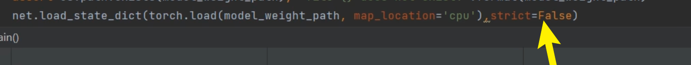
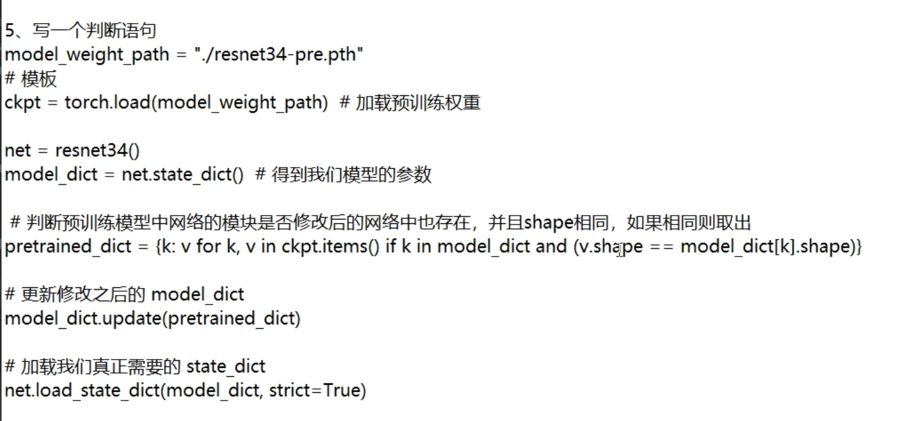
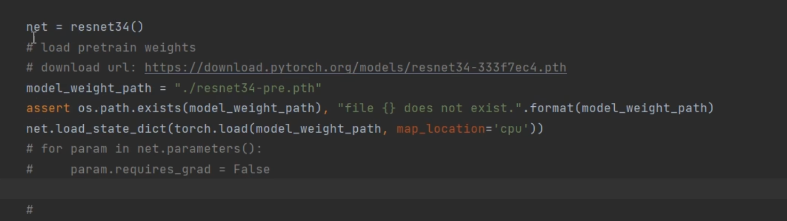
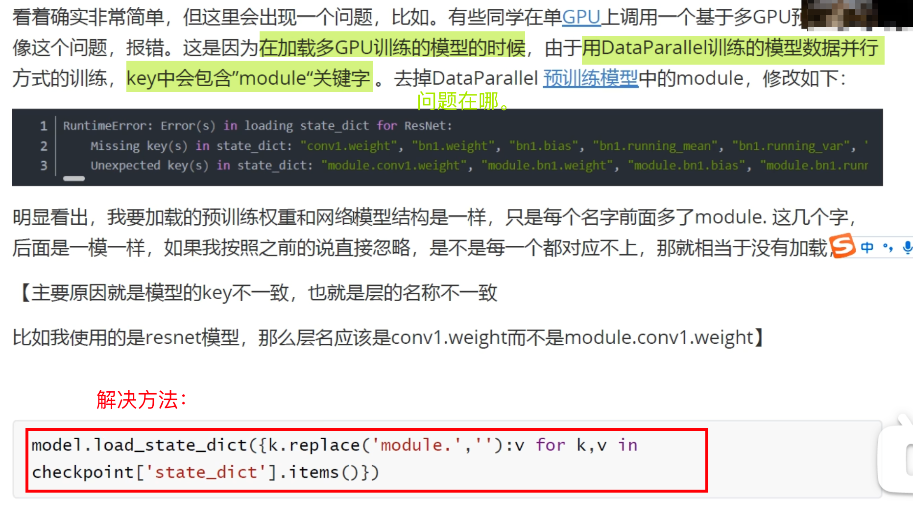

# 预训练权重

问题在于不能一一对应：

`load_state_dict` 中的 `strict = True`

## 解决办法1

`torch.load_state_dict`，加参数，`strict=False`

## 解决方法 2

加判断语句

`model_dict`  是自己改的

`ckpt` 原始的

- 在哪儿改？

找到源码中 加载预训练权重的地方 ，修改为上面的判断语句代码

## 单 GPU 和多 GPU

 把 `module.` 替换成 `''` 空，保证名字是一致的，可以加载预训练权重。