#  复现SegRNN

> 一些链接：
>
> [时序预测篇-SegRNN代码解读](https://zhuanlan.zhihu.com/p/688583267)
>
> [https://github.com/lss-1138/SegRNN/issues?q=is%3Aissue%20state%3Aclosed](https://github.com/lss-1138/SegRNN/issues?q=is%3Aissue%20state%3Aclosed)
>
> [https://github.com/lss-1138/SegRNN](https://github.com/lss-1138/SegRNN)

项目复述逐字稿，留着讲组会用

Hello 大家好，今天我给大家讲 SegRNN 的论文以及对应的代码，我这次有好好的准备，大家可以好好听，然后我们可以随时讨论哈哈哈；

## pre

首先，我们从 github 上克隆下来的项目到了本地，首先按照作者的 readme 一步步配置虚拟环境按照 requirements 安装库，运行。以我拿到的这个 SegRNN 项目为例，看到的是 Shell 脚本调用的 python，我看过的很多深度学习的项目都是用的 args 也就是命令行参数来给 python 传相应的参数，而是用的 shell 脚本，可以把 要通过命令行传给 python 的参数，可以直接在脚本中定义好，通过脚本传。

## 带参数的 python 文件调试

==那这个时候，怎么调试 python 呢？==

我们来看到这个 shell 脚本调用 python 的方法

一般 shell 脚本是存储在 scripts 文件夹下的，以 .sh 结尾的文件。好来看到这个 shell 脚本调用 python 的命名是 `python -u run_longExp.py`  ，`-u` 表示直接修改python 文件传入参数的意思，这里我想说一下，我所讲的内容，都是我根据自己调试这个项目以及遇到的内容学习到的，所以讲的不对的地方一定要告诉我，我们一起讨论。

 

好，回到正题，现在我们就要修改 shell 调用 python 文件的方法，具体来说就是改成：`python -m debugpy --listen 5998 --wait-for-client run_longExp.py`


现在我来一个个解释这行命令的意思：

`-m debugpy` 的意思就是调用 `debugpy` ，就是调用 `python 调试程序`，对 python 进行调试，注意 `debugpy` 是 python 的一个库，所以我们在使用这个的命令的时候，首先就是 `pip install debugpy`

`-listen 5998` 的意思的监听 `5998` 端口，也就是把 `python` 的调试程序连接到 `5998` 端口，然后调试，当然你设置成别的也就是可以的，

==那我们怎么选择端口呢？==

在命令行终端，运行以下代码，查看设备的空闲端口，然后你随便选一个，在 python 调试的`launch.json`的文件中修改

```
for port in {5000..6000}; do
    (echo > /dev/tcp/localhost/$port) >/dev/null 2>&1 || echo "$port is free"
done
```

==那怎么找到 python 调试文件的 配置文件呢？==

在VSCode按`Command+Shift+P`, 输入`Debug: Add Configuration` 即可打开 `launch.json`，当然了你也可以在 vscode 旁边的小虫子，点 `新建 launch.json`

找到以后，添加以下配置，注意是在 `configration` 的关键字下修改。

```
{
	"version": "0.2.0",
	"configurations": [
		{
			"name": "[这里更换为任意名称]",
			"type": "python",
			"request": "attach",
			"connect": {
				"host": "localhost",
				"port": 5998
			}
		}
	]
}
```

这是我的 launch.json文件的完整样子：

```
{
    // 使用 IntelliSense 了解相关属性。 
    // 悬停以查看现有属性的描述。
    // 欲了解更多信息，请访问: https://go.microsoft.com/fwlink/?linkid=830387
    "version": "0.2.0",
    "configurations": [
        
        {
            "name": "[这里更换为任意名称]",
            "type": "python",
            "request": "attach",
            "connect": {
                "host": "localhost",
                "port": 5998
            }
        },
        {
            "type": "bashdb",
            "request": "launch",
            "name": "Bash-Debug (type in script name)",
            "cwd": "${workspaceFolder}",
            "program": "${command:AskForScriptName}",
            "args": []
        },
        {
            "type": "bashdb",
            "request": "launch",
            "name": "Bash-Debug (select script from list of sh files)",
            "cwd": "${workspaceFolder}",
            "program": "${command:SelectScriptName}",
            "args": []
        },
        {
            "type": "bashdb",
            "request": "launch",
            "name": "Bash-Debug (hardcoded script name)",
            "cwd": "${workspaceFolder}",
            "program": "${workspaceFolder}/path/to/script.sh",
            "args": []
        },
        {
            "type": "bashdb",
            "request": "launch",
            "name": "Bash-Debug (simplest configuration)",
            "program": "${file}"
        }
    ]
}
```

想说明的是，我这里还配置了，脚本的调试，分别是：

`"Bash-Debug (type in script name)"`  表示通过输入脚本名称启动调试

`"Bash-Debug (select script from list of sh files)",` 通过脚本列表选择调试文件，等等，就不说了，因为我也不是特别明白，这里的配置主要是对 shell 脚本的调试，配置了这个，那么 shell 脚本也就可以调试了。

好了，现在关于 `--listen` 参数讲完了，讲下一个参数  `--wait-for-client`

这个的意思是说，我们在启动脚本的时候，要等待连接调试程序，才能正常调试，意思就是 运行脚本以后，点一下左边的小虫子，选择 我们配置的 调试器，就是我们设置的 name，就选我们有监听窗口的那个。

这样我们在 调用的python `run_longExp.py` 上，打断点并运行脚本，就可以调试了。

🟢 还有另一种方法，就是直接把脚本文件丢给 chatgpt说：请你根据这个脚本文件写一个可以用于调试配置，添加到 `launch.json`

类似：

```
       {
            "name": "Python: run_longExp.py",
            "type": "python",
            "request": "launch",
            "program": "${workspaceFolder}/run_longExp.py",
            "args": [
                "--model_id", "illness_60_24",
                "--is_training", "1" ,
                "--model", "SegRNN", 
                "--data", "custom",
                "--root_path", "./dataset/",
                "--data_path", "national_illness.csv",
                "--features", "M",
                "--seq_len", "60",
                "--pred_len", "24",
                "--d_model", "512",
                "--dropout", "0.0",
                "--rnn_type", "gru",
                "--dec_way", "pmf",
                "--seg_len", "12",
                "--loss", "mae",
                "--des", "test",
                "--itr", "1",
                "--train_epochs", "2",
                "--num_workers", "0"
            ],
            "console": "integratedTerminal",
            "justMyCode": true,
            "cwd": "${workspaceFolder}"
        },
```

这个叫以 启动模式调试文件，刚刚介绍的叫做 attach 附加模式。这种设置的好处是，直接选，直接调，超方便：

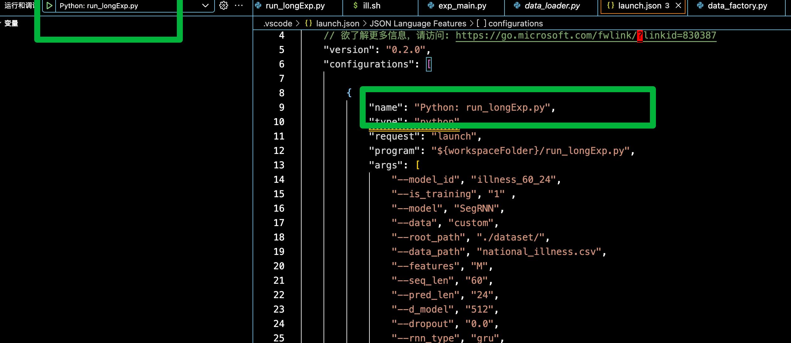

哦，对了，==怎么运行脚本文件==

在 vscode 的命令行就可以直接运行两种方法，一个是 `./你想运行的脚本文件的路径`，还有就是 `sh 你想运行的脚本文件的路径`，这两种方法，有点区别，但我还没有可以的区分。哦，对了，如果有的时候，可能需要先添加权限，才能正常的运行 shell 脚本，具体就是在运行脚本前执行 chang mode 添加 **执行权限**，具体的命令就是命令行直接输入： `chmod +x 脚本文件名称`

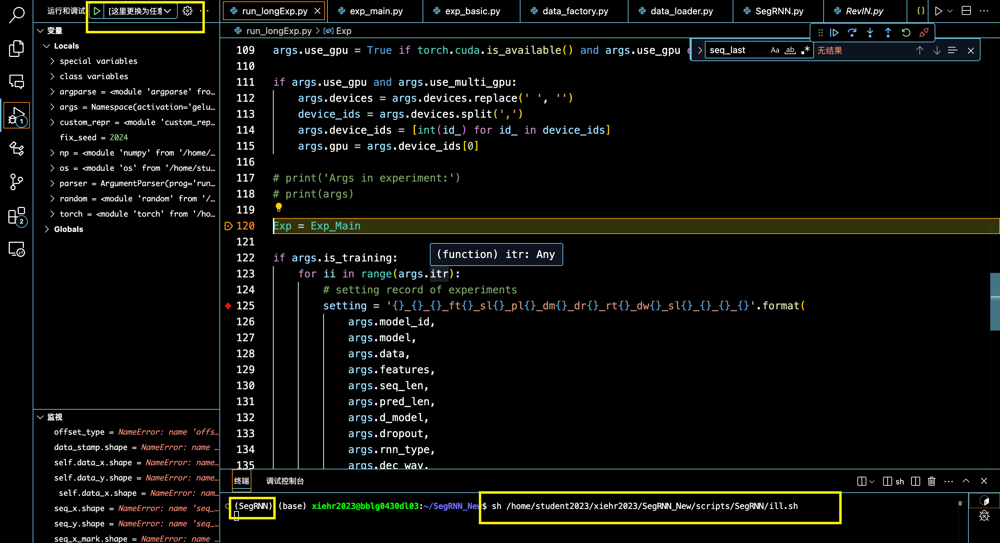


以上是第一部分的讲解：shell 调用的python，我们怎么进行调试。

现在我们终于可以调试 我们的项目了。开始。

## 调试项目文件

首先**第一个断点**，打到调用的 python 文件的开始，


我把这个  `run_longExp`文件，叫做**项目主文件**，主要包括的模型的迭代训练，整个项目的 python 参数设置，而等一下我们 会看到这个  `run_longExp.py` 会频繁调用 `exp_main.py`，我把它 叫 **模型主文件**，主要包含的东西就是，运行一次模型我们需要加载的训练集、验证集和测试集。

然后应该打的断点就是 `初始化init` 处，和`训练 forward 处、或者 train 处、或者调用的 model(x)处`。

`初始化 init` 处，可以让我们知道 文件之间的调用关系，因为越好的项目封装的越好，但是也越抽象，需要不断的捋明白类之间的调用关系，而类又封装到一个个 python 文件中。

forward 的地方，能让我们看到 数据流动以及变化，这是最重要的部分了。

还有一些你不明白的地方或者什么的，想打断点就打断点。好了，这是我想说的打断点的一下经验。

下面继续开始我的断点 ，我的第二个断点在：

```
Exp = Exp_Main
```

这个断点是我想打 init 断点 `exp = Exp(args)` 和 forward 断点 `exp.train(setting)` 时，遇到第一个比较不明白的地方，我不明白，因为我第一次看到这么做的。

==这里的逻辑是什么呢？==

这里其实是类的重命名，也是 `Exp_Main` 本身就是一个类，但是在项目主文件用这个类的时候，重命名了一下，后面在项目主文件用的时候，用的都是这一个重命名的类，然后用这个重命名的类，进行的实例化。

我现在想说一下，这个`Exp_Main`，是从哪里来的： from exp.exp_main import Exp_Main，是这句话。也就是 这个类 在 exp 文件夹下 exp_main.py 的 Exp_Main 类。记住这个`模型主文件 exp_main.py`，因为经常用。

然后没什么想说的了，进入下一个部分，类的 初始化 `exp = Exp(args)` 

哦，对，你看我这儿，我还在 setting 这打了一个记录点，就是我不明白的地方

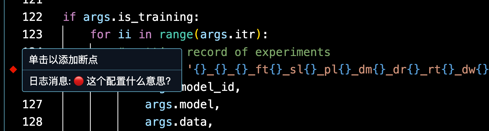

断点的类型还是挺多的，直接断点、记录点，条件断点，命中次数断点。记录点不停，就是打印信息。我有些断点之前不明白就是普通断点，明白了就变成了记录点，不想停了但是做个标记，然后不明白的地方也标记一下，也弄成记录点。后面再看。

好，继续回到，`exp = Exp(args)  # set experiments`

==点，步进。==

步进就是一步步执行，会进入到函数内部，逐过程就是逐步执行，不会进入调用的函数，然后还有继续执行，就是一直执行，直到遇到 下一个断点。


因为我已经实现标了一个记录点，然后步进 执行到这句，也触发了记录点。打印了信息。花括号包裹的部分，会自动替换成 python 程序的变量，输出到调试控制台。

想说明的就是，这里能停止，是因为步进到了这里，并不是因为打了记录点。

说完了。然后继续回到 项目的执行。

这里我们可以看到进入了 `Exp_Main`的 `init` 部分，我记这个就是打印一下路径，因为最开始看的时候，太乱了，各种调用，头都晕了。

这里就是说，我们从 项目主文件 run long exp.py，进入了 模型主文件 exp_main.py 模型的的init 和 train训练过程 都在这里了。

输出的意思就是说，我们现在到了 `exp` 文件夹下，`exp_main.py`的 `Exp_Main类` 的 init 方法。

这里有想说的地方，是因为python的继承的，你看这个 class Exp_Main 是继承的父类

==关于 python 的继承和多态想说明的是：==

~~我现在把类的重命名是理解为 多态（错！）~~，有理解更好的欢迎找我讨论，而类的继承一般就是 类的名称小括号里的东西 `class Exp_Main(Exp_Basic):`，或者你看类 init 方法下面的第一句 super 什么什么的`super(Exp_Main, self).__init__(args)`

然后，对于深度学习来说，一般是继承自 `nn.Module`的，而这里继承的是 `Exp_Basic` ，也就是也是一个自定义函数，那，话不多说，

**步进**，看看它到底是什么东西，诶，然后我们就看到了，Exp_Main有的，Exp_Basic都有，方法都是一样的，但是 Exp_Main 更全，相当于 Exp_Basic是一个模版

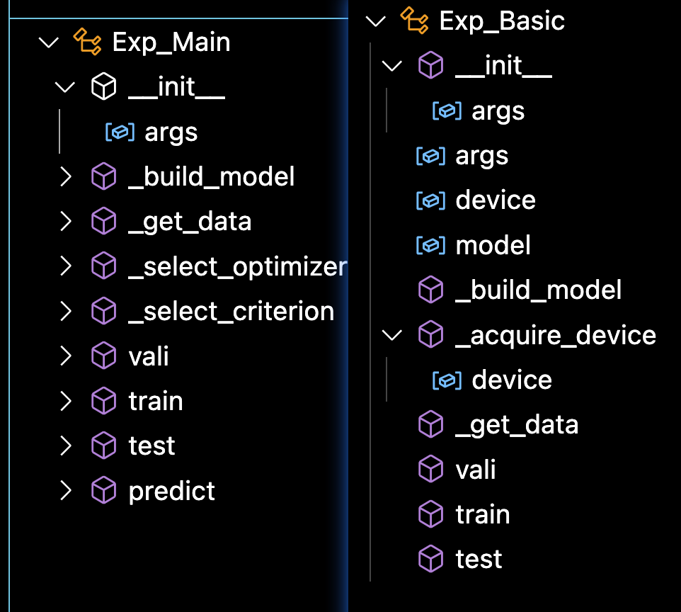

现在我们步进到了继承的父类文件，开始逐步执行这里，一步步的


到这里，想说的是，涉及到了 方法的重写，也就是 子类和父类中都有 这个 `self._build_model()`，但是 很明显父类中什么也没有，但是子类更全，方法重写是，先看子类的，子类没有重写，就执行父类，所以当逐步执行的时候，下一步，我们又返回到了 模型主文件的 `._build_model()`，方法。

既然回到了 模型主文件的 `build_model` 方法，那就看，首先定义了一个字典，通过字符串 所以到对应的类，因为索引到了类，我们才能继续操作呀，比如实例化，forward。

然后就到了 model 的定义

  `model = model_dict[self.args.model].Model(self.args).float()`

通过 `self.args.model` 参数去字典中 `model_dict` 中索引到类，然后调用这个类的额 `.Model()` 方法，`float` 不说了，就是转换数据类型

这里传入的参数，也就是 `self.args.model=SegRNN`，是个字符串，通过字典索引到了类，并且是自定义的类，并且，类是先 `init 初始化`，然后 forward 传入数据，进行数据的流动，所以这句应该是也是到了`某个 init` 中，那话不多说，==步进==，如我们所料，就是到了 SegRNN.py Model方法中的 init，


嗯，因为我之前也打了一个记录点，所以调试控制台有输出。现在我们现在的位置，models 文件下，SegRNN.py 的 Model 类中，并且调用的是 init 方法。


不信你就一个个点点看看：

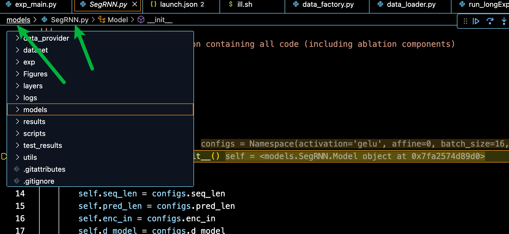

，你按住 command 也可以跳到定义的地方。一样的。

接下来就看这个 SegRNN 的 init 方法，直接点 ==继续==，跳到下一个断点，注意这行：


这行是 可逆实例化层，这里可以提前说一下，对于时间序列来说，有两种归一化，之前说过 BatchNorm 和 LayerNorm，一个按列归一化，一个按行归一化；对于时间序列来说分别进行了 全局归一化，就是整个 样本集维度的归一化，减均值除以方差，相当于不划分 batch 的归一化；==实例归一化 相当于 划分出来的 同一个样本内 同一个特征的归一化==。对于

## 标准化方法补充

用以下这几张图来直观的看一下：

**BatchNorm：** 


**LayerNorm**


**实例归一化**

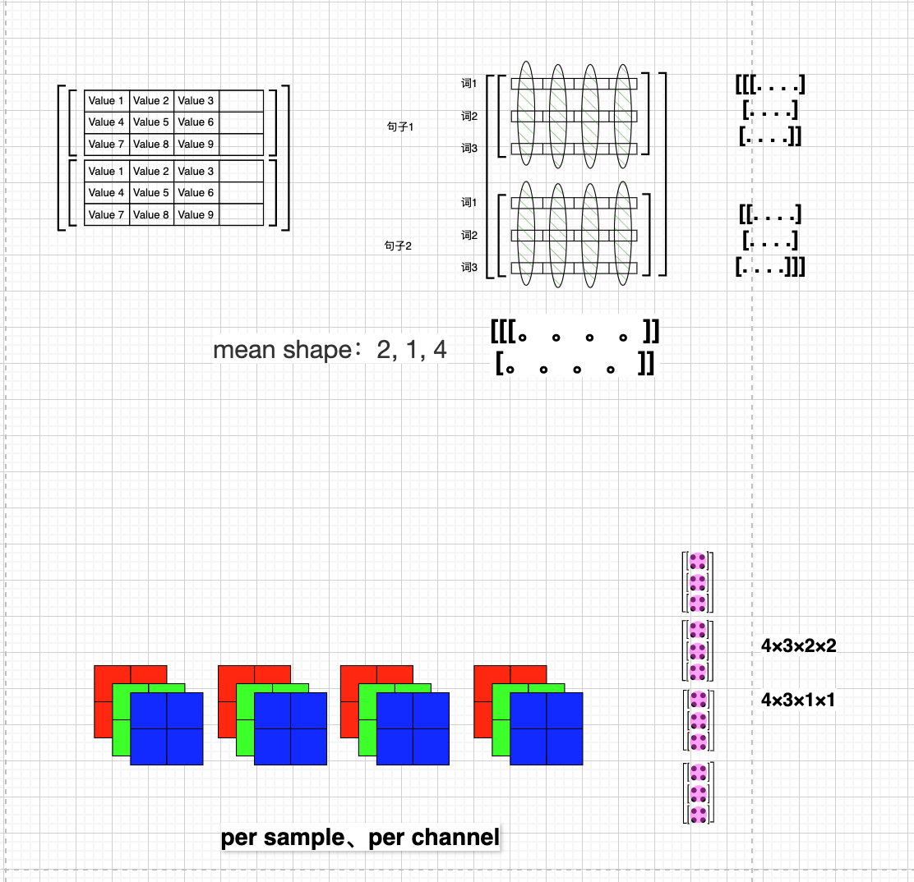 

除了，批归一化，层归一化，实例归一化，还想给大家补充一个 分组归一化，可以补充一个小点就是分组卷积。意思就是对图像中的通道分组，分别训练每一个组内的卷积核。传统卷积是一张3 通道图片对应一个好几个 3 通道的卷积核，对于分组来说，可能就是一张 4 通道的特征图，对前 2 个通道用一个卷积核，对后2个通道用一个卷积核，这样学的好处就是更精细的学习特征。组归一化的图：


哦，对，说到这个分组卷积，其实卷积还有膨胀卷积，深度可分离卷积，转置卷积，需要注意的是，所谓的转置卷积是指恢复原始图片的形状，并不是完全恢复原始图片等，好，能拓展的已经拓展完了。提一下深度可分离卷积就是 深度卷积和 逐点卷积。深度卷积就是一张图，有几个通道就用分成几个组，就用几个卷积核。逐点卷积就是 1×1 的卷积核，点对点的卷积。

## 卷积补充

诶，对还想说一点，就是 在做图像的时候，conv 层的定义是（inputchannel，outputchannel，kernelsize，padding，stride）

当我们看到 kernelsize=3，padding=1 的时候，就可以直接说是不变卷积，全称就是不变形状卷积。不变形状卷积还有 1×1 的卷积，也是不改变特征图大小的，只是改变通道数，用于升维和降维，对于图片来说，维度就是通道数。这些都是在 stride=1 的情况下。


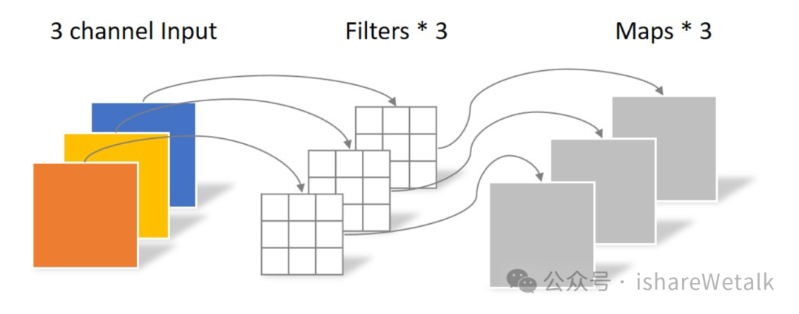

好，回到这个实例归一化。

## SegRNN init

继续调试我们的项目，==逐步==

我们在 SegRNN.py初始化好的 model，会返回给 `exp_main.py` 中的 model，这边我又打了一个记录点，打印了模型结构

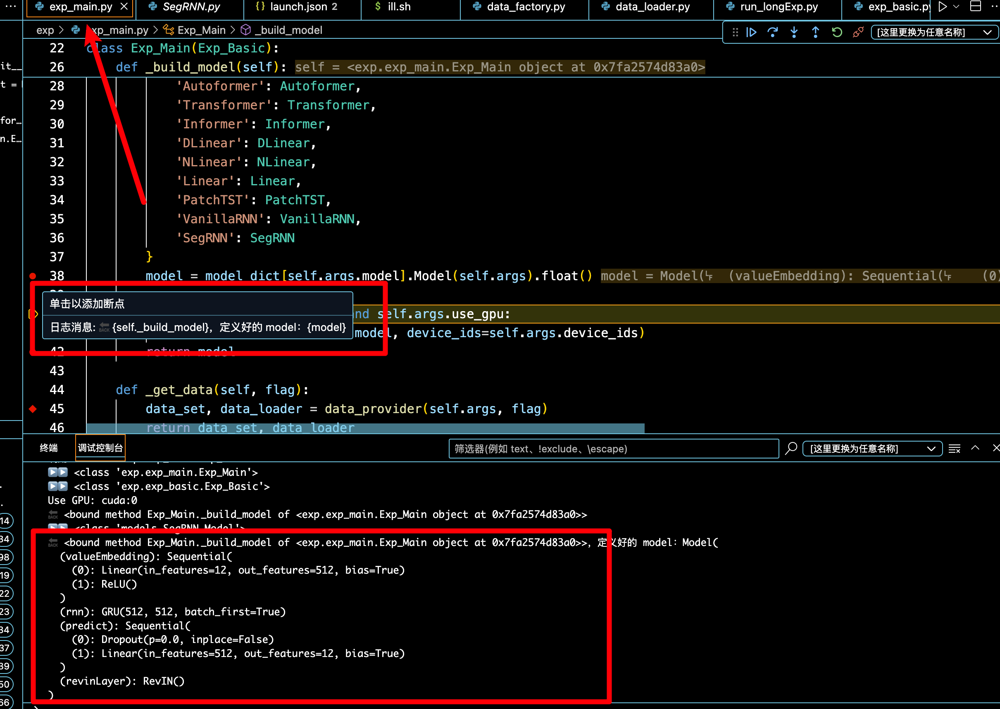 

我们定义的 SegRNN 的模型结构：有一个 valueEmbedding 层、RNN 层，本文的 RNN 层用的是 RNN 变体GRU ，还有一个预测层。后面我们在 SegRNN 的 forward 层中再详细的看每一步的执行过程。

好，我们一直逐步执行，然后我们回到了 项目主文件，可以看到初始化的模型，传给了 `exp`


好了，我们点 ==继续== ，来到模型的 训练阶段

## exp.train()


点击 ==步进==， 进入到 模型主文件 `train` 方法，开始模型的训练，首先加载数据集，训练集、验证集和测试集，我们只调试 train Data set 的加载，因为这些数据集的加载方法是一样的。

首先，训练集调用的自定义方法 `self._get_data`，


点击 ==步进== 看怎么获取的训练集，又看到 调用的 `data_provider` ，又是自定义的函数，继续  ==步进==

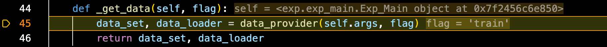

，步进会运行一步停一步，步进到这一步，同时触发 我提前打的记录点，调试控制台输出当前位置，看导航栏 也是一样的


这里没有调用了，我们==逐步执行==

因为我们的 flag 是 train，所以执行 else，逐步执行到 dataset，dataset 的加载 用的是一个 Data 类，鼠标悬停，发现是一个 自定义类 dataprovider 文件夹下，`data_loader.py`文件下的 `Dataset_Custom`类


，那==步进==

相当于` data_factor.py` 接收加载好的数据集

 `data_loader.py` 里面定义的具体类 的是 `真正的数据加载主文件`，里面是每个数据集具体的数据加载方法

在这个类中，前面都是一些数据加载的初始化，最后一句 `self.__read_data__()`，开始读数据集，那话不多说，==步进==

我的记录点记录的方式是，箭头表示调用，跳进了新的文件。调用了新的类。


来看具体的，首先 定义了一个 全局标准化，就是刚刚说的对所有的特征维度进行归一化，消除量纲的影响；

后面就是 pandas 读 csv 数据，cols 拿到所有的类名，然后就是重新排列一下列的顺序，后面按照 7,2,1 的顺序划分训练集、测试集和验证集，


具体来说，我们逐步执行完以后看左边的调试窗口，

## 调试窗口

这里插入一句，调试窗口怎么看。我们重点看这个 Locals 局部变量，就是我们这个 函数内部的变量，局部变量窗口，包含了这个类里面所有定义的 变量。

==全局变量窗口==，就是这个函数文件中定义的所有类，我们调用的所有官方的库、自定义的库、还有函数，这里的特殊变量就不是重点关注得了，因为封装的更抽象，一个下划线是受保护，两个下划线的隐私的，外部不可访问，总之过于抽象，就不看了吧。


总结来说，重点还是看 局部变量窗口，全局变量窗口，就看看我们定义了什么类，调用了什么函数等。

## 数据集划分

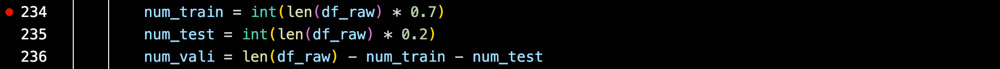

首先，按照 721 划分，理论上训练集时间步：676；验证集时间步：97；测试集时间步：193，用图来表示的话，就是：

也就是说 总共是 966 个数据点，8 个特征，具体处理的时候，时间戳特征单独处理，7 个特征一起处理。

而且，我们看这个 python 文件，在取训练集的时候，用的是 int（）取整方法取得 数据集长度的 0.7，测试集也是，为了不丢样本，验证集用的是减法，所以还是很严谨的

## border1s & border2s

这里先说明 border1s & border2s 的含义。后面再仔细的讲解 border1s & border2s 的具体实现方法。

首先 就是 我们的 border1s、border2s是分别定义了训练集、验证集、测试集的左边界和右边界；


border1 和 border2是根据 传进来的 `self.set_type`，来拿到对应的训练集、验证集或者测试集的 左右边界索引。我们这里的 `self.set_type=0`，这个又是怎么来的呢？

==鼠标 command，跳转==  ，可以看到是通过一个字典映射拿到的，根据我们传入的 `flag=train`，拿到了 左右边界索引 ，分别保存训练集的左边界索引和右边界索引。

我们已经知道 训练集时间步：676；验证集时间步：97；测试集时间步：193；本来应该是：

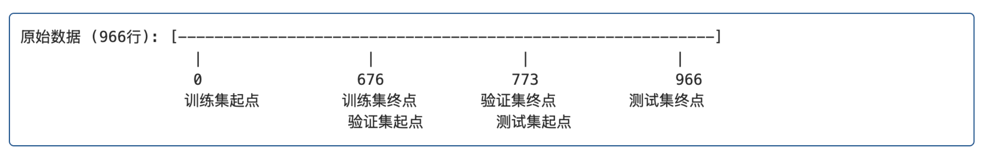 

这里想提前说明的是： python 索引的是一个左闭右开的区间，就是说 索引 0 到 676，能够索引到第 0 行，但是最后一个的索引是 第675 行，就能索引到 676 个时间步，所以后面讲的时候也不做过多区分。 

**下面 我们特地强调一下这里的数据集划分** 

==也就是说：==  本来训练集时间步是前0-676 个时间点，验证集是紧随其后的 97 个时间步，对应的索引应该是 676+97=773,测试集是是验证集 的结束索引时间步 773到后面紧随其后的 193 个时间步，也就是 773+193=966 ，刚好是数据集长度

==但是，==  实际上是， borders1 和 borders2的 定义在源码中是：


==也就是== 

用图来表示就是：


训练集时间步是前0-676 个时间点，验证集是 616 到 773 个时间点，测试集是713 到 966 个时间步

==为什么是这样的呢？==

这样做的意义是，为了保证每个样本都有 60 个时间步的输入序列和 24 个时间步的预测目标，具体来说，对于验证集的第一个时间步，如果让它构成一个完成的样本，就需要向前回退 60 个时间步，同样对于测试集的第一个时间步来说，让它构成一个样本，也需要回退 60 个时间步。

==也就是说，实际上，== 

训练集时间步有 676 个，验证集时间步有 $773-616=157 $个，或者就是 $97+60=157$ 个时间步；测试集 有 $253$ 个时间步。

当我们知道了数据集时间步的划分以后，现在我们讨论，==这些时间步能构成多少个样本？==，这个问题当代码执行到哪一步再说。

## self.features


这里是说 时间序列的3 种任务，

多变量预测多变量，多变量预测单变量，单变量预测单变量

具体来说，这里想额外说明的一点是，时间序列预测，我们日期特征的提取是通过 偏移来处理的，这个我们后面会说，对应到代码中可以看到 在使用多变量的时候，都是不拿第 0 列特征的，因为日期我们等会处理。

> 1. **`M` (多变量/Multiple variables)**：
>    - 当 self.features == 'M' 时，代码选择除第一列（通常是日期列）外的所有列作为特征
>    - cols_data = df_raw.columns[1:]获取除第一列外的所有列名
>    - df_data = df_raw[cols_data] 选择这些列作为模型输入数据
> 2. **`MS` (多变量到单变量预测/Multiple to Single)**：
>    - 与 `M` 模式相同的数据选择方式
>    - 使用所有特征列作为输入，但主要目的是预测目标变量
> 3. **`S` (单变量/Single variable)**：
>    - 当 self.features == 'S' 时，只选择目标列作为特征
>    - df_data = df_raw[[self.target]]仅选择由 self.target指定的列

举个实际的例子，来说明这三种预测：

> 假设我们有一个电力消耗数据集，包含如下列：
>
> [date,HUFL, HULL, MUFL, MULL, LUFL, LULL, OT]
>
> date 表示时间戳 放到第一列，目标列OT 放到最后一列，这是我们列重排的结果
>
> 如果我们设置：
>
> 1. **self.features = 'M'**：
>    - 所有列（除了 date都会被选中：`OT, HUFL, HULL, MUFL, MULL, LUFL, LULL`
>    - 模型将使用所有这些特征进行训练和预测
> 2. **`self.features = 'MS'`**：
>    - 同样选择所有列（除了 `date`）：`OT, HUFL, HULL, MUFL, MULL, LUFL, LULL`
>    - 通常用于利用多个特征来预测目标变量
> 3. **`self.features = 'S'` 且 `self.target = 'OT'`**：
>    - 只选择 `OT` 列
>    - 模型将只使用油温历史数据来预测未来油温值，不考虑其他变量

好了，下面看

## self.scale

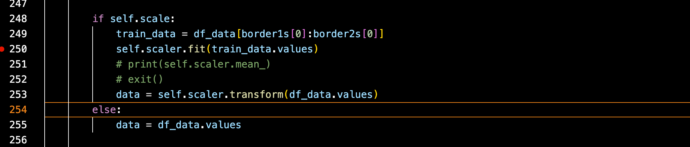

还记得我们刚开始定义的 `self.scaler = StandardScaler()` 全局数据标准化器嘛

现在开始拟合，注意这里拟合的时候，只用的是训练数据进行拟合，因为在真实情况中 验证集和测试集是观测不到的，所以这里的执行逻辑就是，先拿出 训练集数据，然后用训练集数据拟合 标准化器，然后用拟合好的标准化器来标准化全局数据。忽然觉得叫归一化不太合适，因为 是 减均值  除以 标准差的 标准化，并不是归一化。

## df_stamp

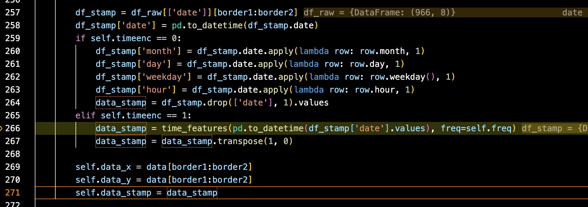

终于用到了我们的 border1，border2，就是处理我们现在想处理的数据集了，首先将我们先处理的 数据集时间戳拿出来，传给 `df_stamp` ，之前我们已经说过了，就是时间序列数据，日期有自己的特征构造方法，使用的的 `offset 偏移` 的概念

先看一下 我们这个原始的时间戳数据长啥样：

在调试窗口，局部变量窗口，悬停，即可查看。这里因为时间都是 `00:00:00` 所以省略了


这是我们正在调试使用的疾病数据集：

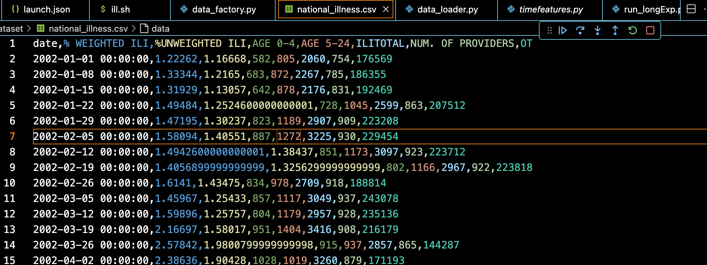 

标准的时间戳数据：年月日、时分秒

好了，我们主要来看怎么处理的这个时间，因为这里传进来 self.timeenc=1，所以执行 elif，并且又是 调用的 自定义函数 `time_features`

当你不知道这个函数是自定义的 还是 官方的，那就 按住 command+鼠标，跳进去看看，或者看看 `调试窗口`的 `全局变量窗口`的`函数变量`

稍微注意一下就是，我们传入进去的参数是 时间戳数据，以及 周期频率，`h` 表示小时。但其实对于这个疾病数据集来说，时间戳周期是 周，有点小问题，但影响不大。

```
data_stamp = time_features(pd.to_datetime(df_stamp['date'].values), freq=self.freq)
```

话不多说，==步进==，

 

看到又是一个调用，继续==步进==，而且是==同文件的 调用==。

我们先看一下这里，`<built-in function to_offset>` 表示的是指向 Pandas 库中 to_offset函数的引用。（也就是 内置函数）


好，继续回到源代码 

步进到 `time_features_from_frequency_str` 函数内部，首先有一个 特征偏移字典

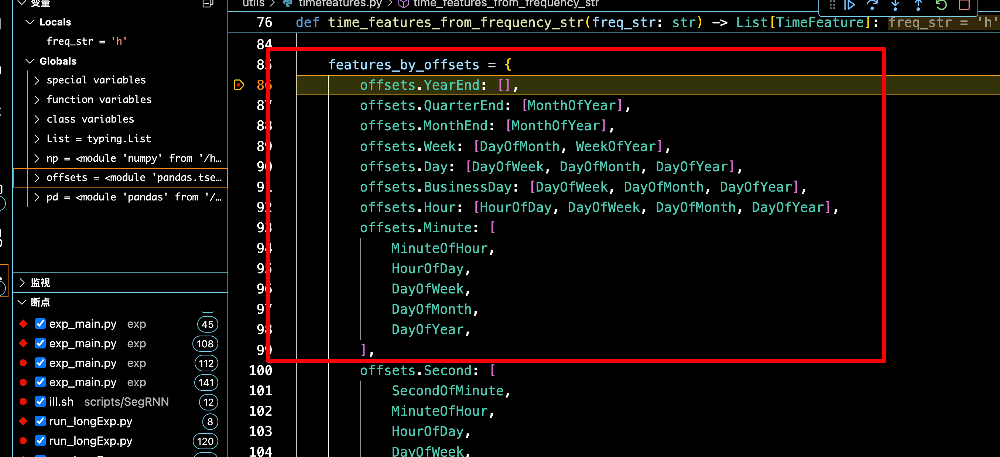

来到下面这行：


根据给定的时间频率字符串选择合适的时间特征

- `to_offset` 是 Pandas 中的函数，用于将频率字符串（如 'H'、'D'、'W' 等）转换为对应的偏移对象
- 比如我们这里，'H' 转换为  Hour  偏移对象，


- 这段 for 循环的作用就是根据 输入的 freq_str 也就是频率字符串，去偏移特征字典中 索引到特征类列表，最终返回类的实例
- **具体来说，**就是首先 `offset = to_offset(freq_str)`   根据传入的 `'H'` 字符串得到 `<Hour>` 对象 
- 然后遍历遍历字典的 键 和 值，如果 offset 也就是我们得到的 `<Hour>` 对象是遍历得到的 `offset_type`，也就是 字典的键，的实例，那么对应的字典的 值 ，`feature_classes` 就通过一个列表推导式，对得到的类会加一个括号 `cls()` ,表示返回类的实例。
- **再仔细重复一遍，**就是 `to_offset('H')`返回的是一个 `<Hour>`对象
- for循环遍历字典时，会发现这个对象是 `offsets.Hour` 的实例
- 从字典中查找对应 offsets.Hour的特征类列表：`[HourOfDay, DayOfWeek, DayOfMonth, DayOfYear]`
- 返回这些类的实例列表：`[HourOfDay(), DayOfWeek(), DayOfMonth(), DayOfYear()]`


接下来，继续看  `np.vstack`  这一行，


首先，`time_features_from_frequency_str(freq)` 返回的是 `[HourOfDay(), DayOfWeek(), DayOfMonth(), DayOfYear()]`

然后，根据得到的  `[HourOfDay(), DayOfWeek(), DayOfMonth(), DayOfYear()]` 对传入的 `dates` 进行处理，首先我们传入的 dates，是标准的日期，pandas 会自动解析出 年、月、日、小时，因为全是 0 点，所以省略了。


根具体来说的处理是：


点击步进 ，可以看到 index.day，自动摘出所有的日期，这里的的处理是 -1 /30 是为了归一化，因为我们的日期记号为 1 号到 31 号，对日期减1，变成 0~30，÷30，变成 0~1，－0.5 表示 中心化，最终的数据范围是 `-0.5~0.5`


- HourOfDay()：表示 一天中的第几个小时
- DayOfWeek()：表示一周中的星期几
- DayOfMonth()：表示一个月中的第几天
- DayOfYear()：表示一年中的第几天

处理逻辑都是差不多的，都中心化为 `-0.5~0.5`

返回的形状是 `[特征数, 日期数]` 也就是 `4 × 676`

这里 np.vstack 堆叠的是 列表，所以是 4 行 676 列，对应的后面是，有一个  transpose 操作，`data_stamp = data_stamp.transpose(1, 0)` ，变成 `676 ×4` 的格式

最终得到的数据和形状：

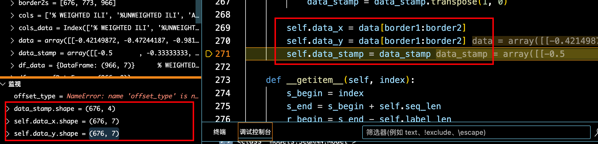

## self.data_x 

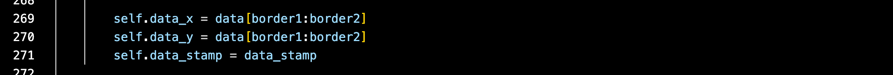

接下来就完成了 dataset 类的实现，得到了 训练集、验证集 或者测试集，这里两个变量的意思是，x 序列用来索引 输入序列，y 序列用来索引 预测序列，具体的用处在 `__getitem__` 方法中。同时 `self.` 定义的变量在类内相当于全局变量。

既然说到了 这个  `__getitem__` 方法，那就说明一下 这个魔法方法是怎么调用和实现的。

## （强调 1）时间序列样本构造的实现

上节课有跳过的部分，在进行 SegRNN 的 forward 过程之前，仔细讲讲==时间序列中时间步与样本构造的关系。==

这一部分主要涉及的源码是  `data_factor.py` 文件中 `data_provider` 函数中 重写的 Dataset 类和 dataloader。

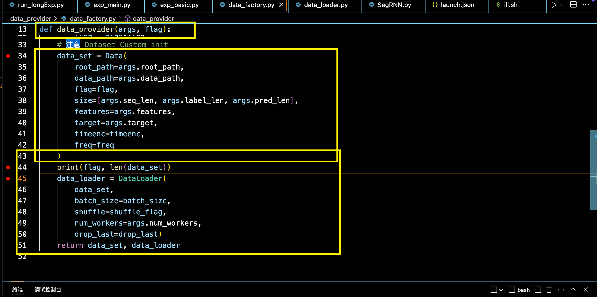

还有就是 dataloader.py中的 `Dataset_Custom`类 `class Dataset_Custom(Dataset):` ，这里的 init 方法、getitem 方法还有 len 方法都是需要着重注意的。


### 直观地理解

那就说一下这个时间序列的样本是怎么划分的，以及为什么要这样做。

对于一张二维数表，时间序列都是二维数表，行是每个时间点，列是每个时间点采集的数据，比如疾病感染人数，记录的 2002 年 1 月开始，到 2020 年 1 月结束，每周一采集数据，除了记录疾病感染人数，还可以记录一些与感染疾病人数的相关的比如当地天气什么的；

具体来说就是：

 

Y 目标列，时间序列数据与其他图像或者 NLP 任务不同的是，特征，在未来时间点，我们是不知道所有的特征的，完全都是未知的。

时间序列样本的构造：用于训练的时间步，记作 `sequence_length`，用于预测的时间步 `pred_length`，还有一个比较特殊的概念 `label_length` ，表示用于训练的时间步有多少用于指导预测，用一张图表示：


有几个 batch 我们就移动几个小时，构造几个 batch。


当然了，这里也有一个遗留问题，就是这样构造 batch的话，不就是按照特征的顺序喂给模型了吗，模型不就会依赖这个顺序了嘛，而一般我们在构建 Dataloader 的时候，会设置一个参数 `shuffle=True` ，也就是 会随机选取 batch 个索引 index，从这个索引开始选择 sequence length 个时间步以及后面的 predict length 进行封装，封装成一个样本。

在这个项目的 illness 数据集中，有 966 个时间点，每个时间点记录了 7 个特征，batch size=16，sequence length=60，feature=7，更具体来说时间序列的数据封装就是：

> 16 个独立的样本，每个样本有 60 个连续的时间步及对应的标签值，每个时间步有 7 个特征
>
> 所以就是因为样本是随机从训练集中采的，所以就假设随机采index的是 7、38、0、129等等等，一共 16 个（这就是 batchsize，表示一个 batch中容纳的样本数）
>
> 每个样本中连续的 60 个时间步，这个就很好理解了：
>
> (0)随机生成第 1 个 index=7，得到样本：从第 7 个时间开始.....跟着 60 个，后面紧跟着要预测的 24 个时间步，dataloader 读数据时都封装好了，会对应上的
>
> (1)随机生成第 2个 index=38，得到样本：从第  38 个时间开始.....
>
> (2)随机生成第 3个 index=0：从第 0个时间开始
>
> ......
>
> (15)随机生成第 16个 index=129：从第 129 个时间开始

接下来来看具体的代码实现

 ==大前提：== 

 我们有一个 966×8（1+7）的时间序列数据集，1 表示时间戳特征，7 表示记录的特征。

### 样本的构成

这里样本的构成，就看 dataset 类中 重写的 len 方法。


这个 len 方法就是给出了样本数

==我们来看这个样本数是怎么计算的，== 

首先  这个 `self.data_x` 是怎么来的：  `self.data_x = data[border1:border2]`，通过 borders1 和 borders2 索引来的，具体来说，对于训练集有 676 个时间步，验证集 157 个时间步，测试集 253 个时间步，也就是分别对应着 训练集、验证集、测试集的 `len(self.data_x)` ，所以，len(训练集)、len(验证集)、len(测试集) 的也就是样本数 分别是 `676-60-24+1=593 、157-60-24+1=74、253-60-24+1=170` 个样本。

==再解释一下== 

就是 对于第一个样本的索引，应该从第一个时间步向后留出 60 个时间步，最后一个样本的索引应该从最后一个时间步向前留出 24 个预测时间步构成最后一个样本。中间留下的就是有效索引。也是样本数，但是我们索引一般都是从 0 开始，中间留下的有效索引不是从 0 开始的。所以，为了从 0 开始，那么就把第一个时间步作为第一个样本的索引， ==那么后面最后一个样本的索引就应该==   从 `676 个时间步-60 个输入序列时间步-24 个预测时间步+1=593索引，也就是最后一个时间步的索引。` 

就是下面这张图展示的。


### `Dataset_Custom.__init__` 

再具体的，我们来看这个 `Dataset_Custom` 类

- 首先就是，数据主文件中，以下代码是调用了  `Dataset_Custom` 类的 init 方法，其中这个 init 方法又调用了类中魔法方法的  `__read_data__`

```
    data_set = Data(
        root_path=args.root_path,
        data_path=args.data_path,
        flag=flag,
        size=[args.seq_len, args.label_len, args.pred_len],
        features=args.features,
        target=args.target,
        timeenc=timeenc,
        freq=freq
    )
```

- 想要说明的一点是，这个 ==自定义的dataset 类== 是 继承了 pytorch 官方定义的 Dataset 类，并重写了  init 方法、getitem 方法和 len 方法。getitem 魔法方法可以使得实例化以后的对象使用索引调用，而 len 方法，在使用 `len(实例化的对象)` 时 调用。

这里 `__read_data__`的讲解，前面讲了一半：也就是这一部分


### `Dataset_Custom.__len__` 

然后，我们继续看数据主文件的下一行

```
print(flag, len(data_set))
```

调用了 自定义 Dataset 类的 len 方法，也就是重写的 pytorch Dataset 类的 len 方法，这个 len 方法就是给出了样本数

```
    def __len__(self):
        return len(self.data_x) - self.seq_len - self.pred_len + 1
```

我们来看这个样本数是怎么计算的，首先  这个 `self.data_x` 是怎么来的：  `self.data_x = data[border1:border2]`，通过 borders1 和 borders2 索引来的，具体来说，对于训练集有 676 个时间步，验证集 157 个时间步，测试集 253 个时间步，也就是分别对应着 训练集、验证集、测试集的 `len(self.data_x)` ，所以，len(训练集)、len(验证集)、len(测试集) 的也就是样本数 分别是 `676-60-24+1=593 、157-60-24+1=74、253-60-24+1=170` 个样本。

在解释一下，就是 对于第一个样本的索引，应该从第一个时间步向后留出 60 个时间步，最后一个样本的索引应该从最后一个时间步向前留出 24 个预测时间步构成最后一个样本。中间留下的就是有效索引。也是样本数，但是我们索引一般都是从 0 开始，中间留下的有效索引不是从 0 开始的。所以，为了从 0 开始，那么就把第一个时间步作为第一个样本的索引，==那么后面最后一个样本的索引就应该...==

或者说，如果把第一个时间步作为第一个样本的索引，==那么，最后一个样本的索引就应该== 从 `676 个时间步-60 个输入序列时间步-24 个预测时间步+1=593索引，也就是最后一个时间步的索引。` 就是下面这张图展示的。


接下来继续看 数据主文件中的  dataloader 方法：

```
    data_loader = DataLoader(
        data_set,
        batch_size=batch_size,
        shuffle=shuffle_flag,
        num_workers=args.num_workers,
        drop_last=drop_last)
```

### getitem

这里的 `Dataloader` 用的是 `pytorch` 自带的`Dataloader` 类。

我们知道 实例化的类加==中括号[索引 index]== 会自动调用 `getitem` 方法，就是类似这样：`obj = MyClass([1, 2, 3])，print(obj[1])`  ，其中 `MyClass([1, 2, 3])` 会自动调用 `init` 方法，而 实例化的类  `obj[1]` 就会调用 `getitem` 方法。

这里想说明的是，Dataloader 也会自动调用 Dataset 的 getitem 方法，那调用  getitem 方法就得有索引，==索引怎么来的？== 是通过 `shuffle` 生成的，如果 shuffle=True，就会自动生成 batchsize 个随机索引，并将这些索引 传递给 getitem，然后得到随机样本，封装成 dataloader，随机索引的范围是通过 Dataset 类的 len 方法限制的。如果 shuffle=false 的话，就按顺序选batchsize 个样本。

接下来，我们仔细看这个  `__getitem__` 方法，只需要一个参数 index 即可。

```
    def __getitem__(self, index):
        s_begin = index
        s_end = s_begin + self.seq_len
        r_begin = s_end - self.label_len
        r_end = r_begin + self.label_len + self.pred_len

        seq_x = self.data_x[s_begin:s_end]
        seq_y = self.data_y[r_begin:r_end]
        seq_x_mark = self.data_stamp[s_begin:s_end]
        seq_y_mark = self.data_stamp[r_begin:r_end]

        return seq_x, seq_y, seq_x_mark, seq_y_mark
```

现在我们就假设随机抽取训练集的样本，训练集的样本数是 593 个，dataloader 在生成随机索引时会限制在 len(dataset)中，我们设置的 batchsize 为 16，也我们假设生成的 16 个随机索引分别是  [0,23, 105, 67, 198, 54,..., 593]（总计16个索引），如果 shuffle=False 的话，就是按顺序取前 16 个索引也就是 0~15。得到的每个索引，根据每个索引得到样本，向后的 60 个时间步作为输入序列，因为 label_sequence=0，所以紧接着的 24 个时间步是预测序列；假设我们生成的随机索引为： 23，也就是 `index=23` 就会调用 `dataset` 的 `getitem` 方法。

`s_begin` 输入序列起始点；`s_end` 输入序列结束点；`r_begin`标签序列起点；`r_end` 标签+预测序列终点；


输入序列起点 `=index`

输入序列终点 `=index+seq_len`

预测序列起点 `=index+seq_len-label_len`

预测序列终点 `=index+seq_len+pred_len`  这里省略了 `-label_len+label_len`

然后

```
        seq_x = self.data_x[s_begin:s_end]
        seq_y = self.data_y[r_begin:r_end]
        seq_x_mark = self.data_stamp[s_begin:s_end]
        seq_y_mark = self.data_stamp[r_begin:r_end]

        return seq_x, seq_y, seq_x_mark, seq_y_mark
```

根据输入序列索引和预测序列索引，来得到 输入特征序列和预测特征序列、输入时间戳特征序列和预测时间戳特征序列

疾病数据集：966×8（7 个特征+1 个时间戳，所以一共 8 列）

对于单个样本的 `seq_x = self.seq_len × 7，seq_y = (label_len + pred_len) × 7`，`seq_x_mark = self.seq_len × 4 , seq_y_mark = self.seq_len × 4`

dataloader 封装了 `batchsize` 个 `seq_x, seq_y, seq_x_mark, seq_y_mark`


### 滑动窗口和样本堆叠

时间序列数据的滑动窗口是在 `__getitem__` 方法中通过索引切片实现的：

- 窗口起点：每个索引 index 代表一个滑动窗口的起始位置 

- 窗口划分：
  - 输入窗口：`[index:index+seq_len]` (60个时间步)
  - 预测窗口：`[index+seq_len-label_len:index+pred_len]` (24（`label_len+pred_len`）个时间步)
  - 样本重叠：
    - 由于索引在`0到(len(data_x)-seq_len-pred_len)`之间，相邻索引的窗口会有大量重叠
    - 例如，索引0和索引1的输入窗口共享59个时间步

用图来理解就是这样的


总结：DataLoader 通过调用 Dataset 的 `__getitem__` 方法获取单个样本，然后将它们堆叠成批次。样本的实际结构和滑动窗口逻辑由 Dataset 实现，DataLoader 只负责组装和批处理。

```python
  data_set = Data(
        root_path=args.root_path, # './dataset/'
        data_path=args.data_path, # 'national_illness.csv'
        flag=flag, # flag = 'train'
        size=[args.seq_len, args.label_len, args.pred_len], # 60,0,24 args.label_len？ =0；解释：args.label_len 的解释：这个参数通常在编码器-解码器架构中使用，表示解码器输入中已知的标签长度。在这个例子中它是0，表示解码器没有已知标签作为输入（只依赖编码器的输出进行预测）
        features=args.features, # 'M'
        target=args.target, # 'OT'
        timeenc=timeenc, # timeenc = 1
        freq=freq # freq="h"
    ) # 打断点，跳到 Dataset_Custom init 、、为什么这里能读到数据。答：data_set》Data》data_dict》Dataset_Custom》from data_provider.data_loader import Dataset_ETT_hour, Dataset_ETT_minute, Dataset_Custom, Dataset_Pred--》Dataset_Custom init
    print(flag, len(data_set))
    data_loader = DataLoader(
        data_set,
        batch_size=batch_size, # 16
        shuffle=shuffle_flag, # True
        num_workers=args.num_workers, # 10
        drop_last=drop_last) # True
    return data_set, data_loader
```

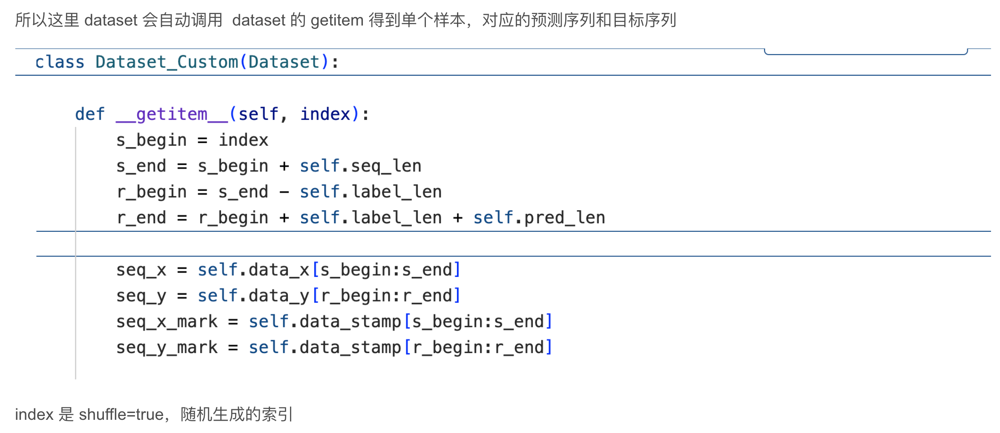 

## len(data_set)

这里有一个问题需要注意一下，就是我们在打印训练集的时候，明明时间长度是 676，为什么 `len(data_set)=593` 

  

是因为，Dataset_Custom类，重写了 len 方法，这里的 len 计算方法是 `676-60-24+1=593`  为什么这样计算？


解释：这是因为 我们训练集有 676 个时间步，不代表有 676 个训练样本，一个训练样本要有 60 个时间步对应的预测时间步是紧随其后的 24 个时间步，也就是用 60 个历史时间步来预测未来的 24 个时间步，这样构成一个样本，所以 676 个时间步，最后一个样本的索引应该预留出 60+24 个时间步。也就是 676 个时间步 构成 593 个训练样本。同样的，按照这个逻辑，验证集有 ==97-60-24+1=14，== ，测试集：==193-60-24+1=110？==

这里产生问题了，是因为，


这里还没有执行完，应该 `Data（）`会自动调用 ，这个 `Dataset_Custom` 类的  `__getitem__` 方法 


## 模型训练迭代

时间步和样本：


模型迭代训练：


## SegRNN forward

### 编码器

我们就看SegRNN 的编码器部分，也就是主要是这部分：

```
    def forward(self, x):

        # b:batch_size c:channel_size s:seq_len s:seq_len
        # d:d_model w:seg_len n:seg_num_x m:seg_num_y
        batch_size = x.size(0)

        # normalization and permute     b,s,c -> b,c,s
        if self.revin:
            x = self.revinLayer(x, 'norm').permute(0, 2, 1)
        else:
            seq_last = x[:, -1:, :].detach()
            x = (x - seq_last).permute(0, 2, 1) # b,c,s

        # segment and embedding    b,c,s -> bc,n,w -> bc,n,d
        x = self.valueEmbedding(x.reshape(-1, self.seg_num_x, self.seg_len))

        # encoding
        if self.rnn_type == "lstm":
            _, (hn, cn) = self.rnn(x)
        else:
            _, hn = self.rnn(x) # bc,n,d  1,bc,d
```

先说一下这里的思想，然后对应到代码也会很好理解：

这里的流程图：


首先，16 batchsize，60`sequendce_length`，7 个特征的通俗解释

- 16 个独立的样本，每个样本有 60 个连续的时间步及对应的标签值，每个时间步有 7个特征

- 所以就是因为样本是随机从训练集中采的，所以就假设采的是

- 样本 1，样本 6，样本 109，样本 334，样本 354等等等，一共 16 个（这就是 batchsize，表示一个 batch中容纳的样本数）

接下来，每个样本中连续的 60 个时间步，这个就很好理解了，但是这 60 个连续的时间步：

- 16 个独立的样本，每个样本有 60 个连续的时间步及对应的标签值，每个时间步有 7 个特征

- 所以就是因为样本是随机从训练集中采的，所以就假设随机采index的是 7、38、0、129等等等，一共 16 个（这就是 batchsize，表示一个 batch中容纳的样本数）

- 每个样本中连续的 60 个时间步，这个就很好理解了：

- (0)随机生成第 1 个 index=7，得到样本：从第 7 个时间开始.....跟着 60 个，后面紧跟着要预测的 24 个时间步，dataloader 读数据时都封装好了，会对应上的

- (1)随机生成第 2个 index=38，得到样本：从第  38 个时间开始.....

- (2)随机生成第 3个 index=0：从第 0个时间开始

- ......

- (15)随机生成第 16个 index=129：从第 129 个时间开始


```
x = self.revinLayer(x, 'norm').permute(0, 2, 1)
```

在进行转置之前进行了可逆实例标准化，也就是对训练样本内的特征进行实例标准化，目的是为了消除分布偏移，用一个例子来解释，就是：


好处是：==消除绝对水平和尺度的影响==，让模型专注于学习序列的==相对变化模式==

对于两次标准化更直观的例子：


### 交换维度

在进行完标准化以后，进行 permute，交换第1 维度和 2 维度，对应就是：

接下来 16x60x7 --》 16×7×60

就是：

（0）样本 1：特征 1[60个连续的时间步]，特征 2，特征 3,,,,,特征 7

（1）样本 6：特征 1，特征 2，特征 3,,,,,特征 7

（2）样本109：特征 1，特征 2，特征 3,,,,,特征 7

......

（15）样本 334：特征 1，特征 2，特征 3,,,,,特征 7

每个特征分别有 60 个连续的时间步

接下来呢，又开始对于这 60 个时间步，分段，分成 5 段，每段 12 个

然后呢，就把分出来的 段，12 维 统统喂到 linear 中，嵌入到 512 维，用的一个嵌入空间，所以嵌入时使用权值矩阵是一样的，毕竟得在同一个准则下才有可比性，这一步就是学习了每一个小段内，时间之间的相关关系

对应的源代码就是：

```
x = self.valueEmbedding(x.reshape(-1, self.seg_num_x, self.seg_len))
```

==这个代码的写法其实不太好理解，==

-1 就是 16×7=112，它把样本batch 维度和特征维度，混到一起写，reshape 成（-1，seg_num_x,seg_dim）

（0）样本 1-特征 1 ：【12】【12】【12】【12】【12】

（0）样本 1-特征 2 ：【12】【12】【12】【12】【12】

....

（0）样本 1-特征 7 ：【12】【12】【12】【12】【12】

---

（1）样本 6-特征 1 ：【12】【12】【12】【12】【12】

（1）样本 6-特征 2 ：【12】【12】【12】【12】【12】

....

（1）样本 6-特征 7 ：【12】【12】【12】【12】【12】

---

（15）样本 334-特征 1 ：【12】【12】【12】【12】【12】

（15）样本 334-特征 2 ：【12】【12】【12】【12】【12】

....

（15）样本 334-特征 7 ：【12】【12】【12】【12】【12】

----

也就是 112 条序列、、、 112×5×12

```
Sequential(
  (0): Linear(in_features=12, out_features=512, bias=True)
  (1): ReLU()
)
```


==linear 就是把所有的 12 全部嵌入到 512 维==

112×5×512

（0）样本 1-特征 1 ：【512】【512】【512】【512】【512】→ 5步GRU → hn[0,0]

（0）样本 1-特征 2 ：【512】【512】【512】【512】【512】→ 5步GRU → hn[0,1]

....

（0）样本 1-特征 7 ：【512】【512】【512】【512】【512】→ 5步GRU → hn[0,6]

---

（1）样本 6-特征 1 ：【512】【512】【512】【512】【512】→ 5步GRU → hn[0,7]

（1）样本 6-特征 2 ：【512】【512】【512】【512】【512】→ 5步GRU → hn[0,8]

....

（1）样本 6-特征 7 ：【512】【512】【512】【512】【512】

---

（15）样本 334-特征 1 ：【512】【512】【512】【512】【512】

（15）样本 334-特征 2 ：【512】【512】【512】【512】【512】

....

（15）样本 334-特征 7 ：【512】【512】【512】【512】【512】→ 5步GRU → hn[0,111]

---


补充一下：


### 传统 GRU


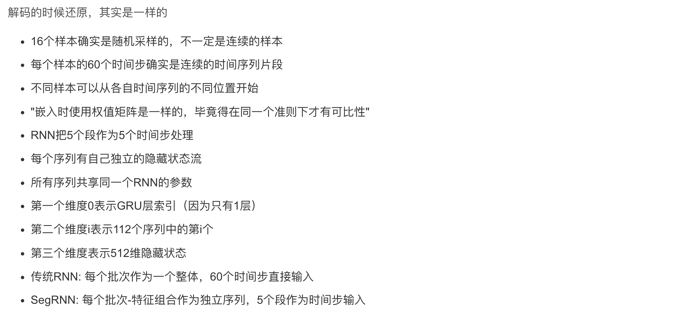

整个 forward 过程的图解：

```
输入: x [16, 60, 7]
(16个批次，每个60个时间步，每步7个特征)
            │
            ▼
┌──────────────────────────────┐
│      RevIN 标准化 + 维度置换     │
│   x = revinLayer(x, 'norm')   │
│      .permute(0, 2, 1)       │
└──────────────┬───────────────┘
               │
               ▼
          x [16, 7, 60]
(16个批次，7个特征，每个特征60个时间步)
            │
            ▼
┌──────────────────────────────┐
│         重塑为分段格式          │
│ x.reshape(-1, seg_num_x, seg_len) │
└──────────────┬───────────────┘
               │
               ▼
          x [112, 5, 12]
(112个序列=16批次×7特征，每个分5段，每段12步)
            │
            ▼
┌──────────────────────────────┐
│          段值嵌入             │
│     x = valueEmbedding(x)     │
│  (Linear: 12 → 512 + ReLU)    │
└──────────────┬───────────────┘
               │
               ▼
          x [112, 5, 512]
(112个序列，5个段，每段表示为512维向量)
            │
            ▼
┌──────────────────────────────┐
│           GRU 编码            │
│      _, hn = self.rnn(x)      │
└──────────────┬───────────────┘
               │
               ▼
          hn [1, 112, 512]
(1层GRU，112个序列的最终隐藏状态)
            │
            ▼
┌────────────────┬─────────────┐
│    RMF 解码     │    PMF 解码   │
└────────┬───────┴──────┬──────┘
         │              │
┌────────▼───────┐  ┌───▼──────────┐
│  循环多步预测    │  │  并行多步预测   │
│(逐段自回归预测)  │  │(一次性预测所有段)│
└────────┬───────┘  └───┬──────────┘
         │              │
         │       ┌──────▼─────────┐
         │       │  位置和通道嵌入   │
         │       │   组合成条件     │
         │       └──────┬─────────┘
         │              │
         │       ┌──────▼─────────┐
         │       │ pos_emb [224, 1, 512] │
         │       │ (224=16×7×2)   │
         │       └──────┬─────────┘
         │              │
         │       ┌──────▼─────────┐
         │       │   条件GRU解码    │
         │       │ _, hy = rnn(pos_emb, hn) │
         │       └──────┬─────────┘
         │              │
         │       ┌──────▼─────────┐
         │       │ hy [1, 224, 512] │
         │       └──────┬─────────┘
         │              │
┌────────▼───────┐ ┌────▼──────────┐
│ 预测 + 堆叠各段  │ │     预测       │
└────────┬───────┘ │ y = predict(hy) │
         │         └────┬───────────┘
         │              │
         └──────┬───────┘
                │
                ▼
           y [16, 7, 24]
 (预测结果: 16个批次，7个特征，预测24个时间步)
                │
                ▼
┌───────────────────────────────┐
│      维度置换 + RevIN反标准化    │
│   y = revinLayer(y.permute(0, 2, 1), 'denorm')   │
└───────────────┬───────────────┘
                │
                ▼
       最终输出 y [16, 24, 7]
(16个批次，预测未来24个时间步，每步7个特征)
```

### 解码过程

关于 SegRNN 的两个核心创新点

（1）分段编码

（2）并行解码

接下来我们来看并行解码过程，因为是一次解码，所以需要位置编码，来看这个位置编码的定义，有段的编码和通道特征编码，经过拼接构成了完整的位置编码。


具体来说，self.pos_emb.shape = 2 × 256；

其中，`self.seg_num_y = self.pred_len // self.seg_len = 24 //12`，24 是预测步长，12 是分段步长，也就是 预测的 y 分成 2 段，每段 12 个步长，用 256 维的向量表示 1 个位置，2 个位置，就是 2 个 256 维的向量，得到每个段的位置编码；

由于每个段是用 7 个特征表示的，所以还需要表示特征位置编码，`self.channel_emb.shape = 7×256` 也就是 第0 特征位置是一个256 维的向量表示，第 1 特征是一个 256 维的向量表示，以此类推得到 通道位置编码，接下来继续看位置编码怎么加到序列上的。


看注释，预测的2 段位置编码，是 2×256 的，第 0 维扩一维，变成 1×2×256 的，在第一维重复 7 次（也就是特征数），最后变成 7×2×256 维度的；

通道位置编码是 7×256 的，第 1 维扩 1 维，变成 7×1×256 的，第 1 维重复 预测时间步分段次数，变成 7×2×256 的

然后，在最后一维 也就是dim=-1进行拼接（torch.cat），变成 7×2×512 的形状

然后 view 维度转换（这个维度转换是保持内存不变的意思，和 permute、transpose 都是维度变换函数，有点区别，我也不太明白，总之就是维度变换），view 成`（-1,1,512` 的，也就是合并 ==预测时间步分段位置编码  和 通道位置编码== 变成 形状为 `14×1×512` 的。

最后就是 repeat，第 0 维重复 batchsize 次，最终的 `pos_emb` 也就是 16×14=224 ，也就是 224×1×512

> - self.pos_emb.unsqueeze(0).repeat(self.enc_in, 1, 1)：将位置编码扩展为 (enc_in, seg_num_y, d_model // 2) 的形状。
> - self.channel_emb.unsqueeze(1).repeat(1, self.seg_num_y, 1)：将通道编码扩展为 (enc_in, seg_num_y, d_model // 2) 的形状。
> - -torch.cat([...], dim=-1)：将位置编码和通道编码在最后一个维度上拼接，得到形状为 (enc_in, seg_num_y, d_model) 的编码。
> - .view(-1, 1, self.d_model).repeat(batch_size, 1, 1)：将编码展平并扩展为 (batch_size * enc_in * seg_num_y, 1, d_model) 的形状。

位置编码的作用是为每个预测段（segment）添加唯一的位置信息，使模型能够区分不同位置的元素。这对于捕捉序列中的时间依赖性和顺序信息非常重要。

接下来 进行论文的这一部分：


也就是源码中的这一句：


- 然后，将位置编码 pos_emb 输入到 RNN 中，并使用之前的隐藏状态 hn 进行==初始化；== 

==位置编码 pos_emb：== 

- `pos_emb` 是一个形状为 `(batch_size * self.enc_in * self.seg_num_y, 1, self.d_model)` 的张量，包含了位置编码信息。==【224,1,512】==

==隐藏状态 hn 的处理：== 

- `hn` 是编码阶段生成的隐藏状态，形状为 `(1, batch_size * self.enc_in, self.d_model)`。 ==【1,112,512】==

- `hn.repeat(1, 1, self.seg_num_y)`：将 hn 在最后一个维度上重复 `self.seg_num_y` 次，得到形状为 `(1, batch_size * self.enc_in, self.d_model * self.seg_num_y)` 的张量。==【1,112,1024】==
- `.view(1, -1, self.d_model)`：将张量重新调整形状为 `(1, batch_size * self.enc_in * self.seg_num_y, self.d_model)`。==【1,224,512】==

==RNN 的调用：== 

- self.rnn(pos_emb, hn)：将位置编码 pos_emb 和隐藏状态 hn 输入到 RNN 中。
- _, hy：RNN 的输出，其中 _ 是输出序列，hy 是最后的隐藏状态。

<u>这一步的实际意义是什么？</u> 

（1）本来只用 h_n 作为解码的初始状态，现在加入了位置信息，可以进行并行解码，

（2）hy 通过 RNN（循环神经网络）处理位置编码（pos_emb）后得到的隐藏状态

（3）hy 的实际意义在于，它包含了通过 RNN 处理后的序列信息，并且可以用于进一步的预测或解码操作

### 预测 self.predict

```
 # 1,bcm,d -> 1,bcm,w -> b,c,s
            y = self.predict(hy).view(-1, self.enc_in, self.pred_len)
```

首先 self.predict，其实就是一个线性映射层，将 512 维映射到 12 维。这个 12 维是什么？是解码阶段，60 个时间步分成 5 段每段的时间步 步长 12 步，这里的 12 维对应的就是 预测时间步步长 24 步，分成 2 段，每段 12 步。


也就是前面 `RNN` 的调用：

- `self.rnn(pos_emb, hn)：`将位置编码 pos_emb 和隐藏状态 hn 输入到 RNN 中。

- `_, hy`：RNN 的输出，其中 _ 是输出序列，hy 是最后的隐藏状态。
- 使用 `hy` 进行预测：
- `y = self.predict(hy).view(-1, self.enc_in, self.pred_len)`：使用隐藏状态 hy 进行预测，并将预测结果调整为形状为 `(batch_size, self.enc_in, self.pred_len)` 的张量。（16×7×24）

```
        if self.revin:
            y = self.revinLayer(y.permute(0, 2, 1), 'denorm')
```

最后，反实例标准化，因为之前进行了实例标准化，现在把还原回去。形状变成 `16×24×7`.

对应源码：

```
    def _denormalize(self, x):
        if self.affine:
            x = x - self.affine_bias
            x = x / (self.affine_weight + self.eps*self.eps)
        x = x * self.stdev
        if self.subtract_last:
            x = x + self.last
        else:
            x = x + self.mean
        return x
```

最重要的两步：`x = x * self.stdev`  和 `x = x + self.mean`

以上就是 SegRNN 的源码实现的理解。


