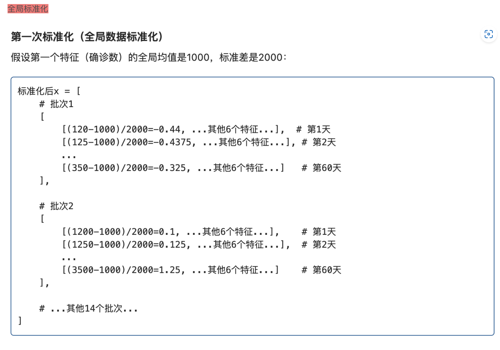
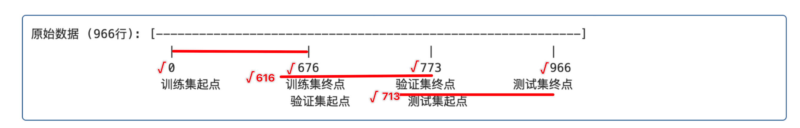
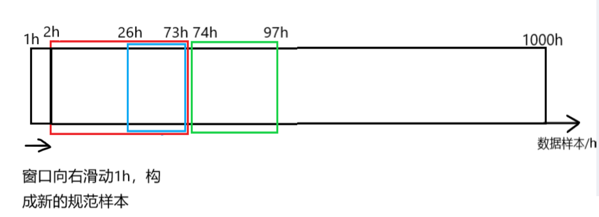

# 复现 SegRNN_v2

这里主要再次理清了 时间序列数据集的加载过程。

- [x] 时间序列任务的定义
- [x] 时间序列样本的加载

## `Exp = Exp_Main`

- 在上节课的讲解中，已经讲的部分有如何调试使用 shell 脚本调用的 python 文件，介绍了两种方法，总之都是修改 launch.json文件。
- 然后介绍了类的重命名 `Exp = Exp_Main` 、从这个类  `exp = Exp(args)`  的初始化，所涉到的东西有，类的继承 `class Exp_Main(Exp_Basic)`、子类重写父类的方法 `self.model = self._build_model().to(self.device)`  ，如果 子类重写那么优先调用子类重写的方法

## SegRNN init

- 接着介绍了，字典定义的通过字符串实例化类 `'SegRNN': SegRNN` ，调用`.Model()`类的 init 方法 `model = model_dict[self.args.model].Model(self.args).float()`
- init中主要实现的是 SegRNN 的初始化，

### RevIN

这里想着重说明的是  可逆实例标准化

```
self.revinLayer = RevIN(self.enc_in, affine=False, subtract_last=False)
```

在时间序列中，会涉及到两种归一化，一种是全局归一化，一种是实例归一化。

其实归一化的说法也不是十分准确，因为这里的归一化都是  减 $\mu$ 除以 标准差 $\sigma$ ，Norm 更准确的理解理解是 标准化。不过影响不大。

- 其中全局标准化主要的作用是 ==消除量纲的影响==，可以理解为不划分 batch 的标准化
- 可逆实例标准化就是对训练样本内的特征进行实例标准化，目的是为了==消除分布偏移==，用一个例子来解释，就是：


好处是：==消除绝对水平和尺度的影响==，让模型专注于学习序列的==相对变化模式==

- 对于两次标准化更直观的例子：





- 同时顺着 实例标准化给大家补充了批标准化、层标准化、分组标准化，从分组标准化又拓展到了分组卷积，从分组卷积又扩展了卷积的几种方式，膨胀卷积、分组卷积、转置卷积、深度可分离卷积、逐点卷积等，然后回到我们自己的项目

- 将 SegRNN 初始化好的模型，传给 model，并在调试控制台打印了 model

```
(valueEmbedding): Sequential(
    (0): Linear(in_features=12, out_features=512, bias=True)
    (1): ReLU()
  )
  (rnn): GRU(512, 512, batch_first=True)
  (predict): Sequential(
    (0): Dropout(p=0.0, inplace=False)
    (1): Linear(in_features=512, out_features=12, bias=True)
  )
  (revinLayer): RevIN()
)
```

- 可以看到 SegRNN 的主要构成包括一个 值嵌入层、RNN 层，预测层和 可逆实例标准化层。在 forward 中，数据会通过这些层进行数据流动

## `exp.train(setting)` 

- 接下来进行，模型的训练 `exp.train(setting)` ，调用类的 `.train`方法，首先加载训练集、验证集、测试集，数据集加载的方式是一样的

## `self._get_data → data_provider` 

- 以训练集为例 `train_data, train_loader = self._get_data(flag='train')`，首先调用内部方法 `self._getdata`，==步进==， `data_set, data_loader = data_provider(self.args, flag)`，接着调用`data_provider` 方法，这个方法是在 py文件的开头进行导入的 `from data_provider.data_factory import data_provider`，方法的位置在 `data_provider` 文件夹下，`data_factory.py`文件中，定义的 `data_provider` 函数。

- 继续 ==步进==， 通过 `args.data` 索引 数据字典，得到重命名以后的类，这里传入的 `args.data = custom` ，在数据字典中 索引到类是 `Dataset_Custom`，这里想说明的一点是，在这个项目中重写了 pytorch 官方 dataset 类的 init 方法、len 方法、getitem 方法，使得这个数据集的加载更适合处理 时间序列任务。
- 接下来是 `timeenc = 0 if args.embed != 'timeF' else 1`  时间戳的建模方法。后面会有具体的时间戳数据建模过程。这里的 `timeenc=1`
- 接着根据传入的 flag 设置一些加载数据集相关的参数，包括 `shuffle_flag = True` 是否随机选取样本、最后一组样本如果没有构成一个完成的 batch 时候是否舍弃 `drop_last = True`、 `batch_size = args.batch_size` 一个 batch的大小、以及 时间戳数据记录频率 `freq = args.freq`

- 看到下面的源代码，这一部分 ==步进==

```
    data_set = Data(
        root_path=args.root_path,
        data_path=args.data_path,
        flag=flag,
        size=[args.seq_len, args.label_len, args.pred_len],
        features=args.features,
        target=args.target,
        timeenc=timeenc,
        freq=freq
    )
```


## `Dataset_Custom`

- 进入 `Dataset_Custom` 中的 init 方法，加载数据，首先又是一些参数初始化


- 在这个调试的项目中，回溯窗口是 60，预测窗口是 24，也就是使用未来 60 个时间步的8 个特征，预测未来 24 个时间步的疾病感染人数。
- 关于这里的 8 个特征，想说明的是（其实是 1+7 个特征，时间戳特征单独处理，7 个特征的处理就是两个标准化，一种是全局标准化一种是实例标准化）
- 在进行一些参数初始化以后，调用 魔方方法`self.__read_data__()`读取数据。

###  `self.__read_data__()`

####  `self.scaler`

- 首先是一个全局标准化器 `self.scaler = StandardScaler()`
- 接着根据上面初始化的文件路径，读数据

```
       df_raw = pd.read_csv(os.path.join(self.root_path,
                                          self.data_path))
```

#### 列重排

- 然后进行列重排，变成标准的 第0 列是 日期，中间是特征，最后一列是 目标列

```
        cols = list(df_raw.columns)
        cols.remove(self.target)
        cols.remove('date')
        df_raw = df_raw[['date'] + cols + [self.target]]
```

#### 划分数据集

- 接下来按照 721 的比例划分数据集，涉及到取整操作，以及为了防止丢失时间步，验证集的 10% 是用的减法。具体的数值，整个数据集是 966 个数据点，8 个特征，也就是 966×8，按照 721 划分，得到，训练集时间步：676；验证集时间步：97；测试集时间步：193 

```
        num_train = int(len(df_raw) * 0.7)
        num_test = int(len(df_raw) * 0.2)
        num_vali = len(df_raw) - num_train - num_test
```

#### `border1s&border2s`

- 接下来

```
        border1s = [0, num_train - self.seq_len, len(df_raw) - num_test - self.seq_len]
        border2s = [num_train, num_train + num_vali, len(df_raw)]
```

- border1s 和 border2s 分别定义了测试集、验证集、训练集的左右边界。
- 原文的时间步划分，应该是 数据行0-676是训练集，676 到 676+97=773 是验证集，966-193=773 ，也就是索引 773-966是测试集，用图来表示，就是这样的：  

 

- 但实际上看，左右边界的定义，左边界都减去了一个 回溯窗口长度，也就是 `self.seq_len = 60` 

- ==也就是== 

  用图来表示就是：

  

  （1）训练集时间步是前0-676 个时间点

  （2）验证集是 616 到 773 个时间点

  （3）测试集是713 到 966 个时间步

- ==为什么是这样的呢？==

这样做的意义是，为了保证每个样本都有 60 个时间步的输入序列和 24 个时间步的预测目标，具体来说，对于验证集的第一个时间步，如果让它构成一个完成的样本，就需要向前回退 60 个时间步，同样对于测试集的第一个时间步来说，让它构成一个样本，也需要回退 60 个时间步。

- ==也就是说，实际上，== 

（1）训练集时间步有 $676$ 个

（2）验证集时间步有 $773-616=157 $个，或者就是 $97+60=157$ 个时间步；

（3）测试集 有 $253$ 个时间步，就是 `len(df_raw)` - `len(df_raw) - num_test - self.seq_len`。$193+60=253$ 

以上，解释好实际用的左右边界以后，

接下来继续看源代码

#### border1&border2

```
       border1 = border1s[self.set_type]
       border2 = border2s[self.set_type]
```

- 这个 border1和border2就是保存单个数据集的左右边界，比如现在我们传进来的 `flag=train`
- 根据前面初始化阶段定义的 数据集类型映射字典  `type_map = {'train': 0, 'val': 1, 'test': 2}` 然后用字符串 `flag=train`索引到 `self.set_type = type_map[flag]=0`

#### self.features

```
        if self.features == 'M' or self.features == 'MS':
            cols_data = df_raw.columns[1:]
            df_data = df_raw[cols_data]
        elif self.features == 'S':
            df_data = df_raw[[self.target]]
```

- 继续看源代码，到 self.feature的部分

- 这里是说 时间序列的3 种任务，多变量预测多变量，多变量预测单变量，单变量预测单变量

- 具体来说，这里想额外说明的一点是，时间序列预测，我们日期特征的提取是通过 偏移来处理的，这个我们后面会说，对应到代码中可以看到 在使用多变量的时候，都是不拿第 0 列特征的，因为日期我们等会处理。

> 1. **`M` (多变量/Multiple variables)**：
>    - 当 self.features == 'M' 时，代码选择除第一列（通常是日期列）外的所有列作为特征
>    - cols_data = df_raw.columns[1:]获取除第一列外的所有列名
>    - df_data = df_raw[cols_data] 选择这些列作为模型输入数据
> 2. **`MS` (多变量到单变量预测/Multiple to Single)**：
>    - 与 `M` 模式相同的数据选择方式
>    - 使用所有特征列作为输入，但主要目的是预测目标变量
> 3. **`S` (单变量/Single variable)**：
>    - 当 self.features == 'S' 时，只选择目标列作为特征
>    - df_data = df_raw[[self.target]]仅选择由 self.target指定的列

- 举个实际的例子，来说明这三种预测：

> 假设我们有一个电力消耗数据集，包含如下列：
>
> [date,HUFL, HULL, MUFL, MULL, LUFL, LULL, OT]
>
> date 表示时间戳 放到第一列，目标列OT 放到最后一列，这是我们列重排的结果
>
> 如果我们设置：
>
> 1. **self.features = 'M'**：
>    - 所有列（除了 date都会被选中：`OT, HUFL, HULL, MUFL, MULL, LUFL, LULL`
>    - 模型将使用所有这些特征进行训练和预测
> 2. **`self.features = 'MS'`**：
>    - 同样选择所有列（除了 `date`）：`OT, HUFL, HULL, MUFL, MULL, LUFL, LULL`
>    - 通常用于利用多个特征来预测目标变量
> 3. **`self.features = 'S'` 且 `self.target = 'OT'`**：
>    - 只选择 `OT` 列
>    - 模型将只使用油温历史数据来预测未来油温值，不考虑其他变量

#### self.scale

- 接下来看到源代码的全局标准化部分：

```
        if self.scale:
            train_data = df_data[border1s[0]:border2s[0]]
            self.scaler.fit(train_data.values)
            # print(self.scaler.mean_)
            # exit()
            data = self.scaler.transform(df_data.values)
        else:
            data = df_data.values
```

- 还记得我们刚开始定义的 `self.scaler = StandardScaler()` 全局数据标准化器嘛

- 现在开始拟合，注意这里拟合的时候，只用的是训练数据进行拟合，因为在真实情况中 验证集和测试集是观测不到的，所以这里的执行逻辑就是，先拿出 训练集数据，然后用训练集数据拟合 标准化器，然后用拟合好的标准化器来标准化全局数据。


#### df_stamp

- 接下来是时间戳特征的处理：

```
        df_stamp = df_raw[['date']][border1:border2]
        df_stamp['date'] = pd.to_datetime(df_stamp.date)
```

- 看到 `df_stamp = df_raw[['date']][border1:border2]`  终于用到了我们的 border1，border2，就是处理我们现在想处理的数据集了，首先将我们先处理的 数据集时间戳拿出来，传给 `df_stamp` 
- `df_stamp['date'] = pd.to_datetime(df_stamp.date)` 调用 pandas 将日期数据转换成标准的时间日期数据
- 在执行完这一句后，看到调试窗口，==鼠标悬停==，查看 时间戳数据框数据 `df_stamp`


```
if self.timeenc == 0:
            df_stamp['month'] = df_stamp.date.apply(lambda row: row.month, 1)
            df_stamp['day'] = df_stamp.date.apply(lambda row: row.day, 1)
            df_stamp['weekday'] = df_stamp.date.apply(lambda row: row.weekday(), 1)
            df_stamp['hour'] = df_stamp.date.apply(lambda row: row.hour, 1)
            data_stamp = df_stamp.drop(['date'], 1).values
        elif self.timeenc == 1:
            data_stamp = time_features(pd.to_datetime(df_stamp['date'].values), freq=self.freq)
            data_stamp = data_stamp.transpose(1, 0)
```

- 时间戳特征的建模，我们这里 `self.timeenc = 1`，所以执行 `elif`

```
data_stamp = time_features(pd.to_datetime(df_stamp['date'].values), freq=self.freq)
```

- 这里的时间戳特征建模 又调用了 自定义的函数  `time_features`，
- 需要的参数有 时间戳数据框 ，也就是 `pd.to_datetime(df_stamp['date'].values)`，
- 还有 时间戳数据记录周期 `freq=self.freq`，时间戳数据框是我们上面拿到的，
- 这里的 时间戳数据记录频率 `freq=self.freq="H"` ，传进来的参数是 "H"，但其实对于这个疾病数据集来说，时间戳周期是 周，有点小问题，但影响不大。

##### time_features

接下来，我们 ==步进== ，看这个时间戳数据是怎么建模的。


- 看到又是一个调用，继续==步进==，而且是==同文件的 调用==。

###### `time_features_from_frequency_str`

- ==步进== 到 `time_features_from_frequency_str` 函数内部，首先有一个 特征偏移字典


- 来到下面这行：


- 根据给定的时间频率字符串选择合适的时间特征
- 我们先看一下调试窗口这里，`<built-in function to_offset>` 表示的是指向 Pandas 库中 to_offset函数的引用。（也就是 内置函数）


- `to_offset` 是 Pandas 中的函数，用于将频率字符串（如 'H'、'D'、'W' 等）转换为对应的偏移对象
- 比如我们这里，'H' 转换为  Hour  偏移对象，


- 这段 for 循环的作用就是根据 输入的 `freq_str`  也就是频率字符串，去`偏移特征字典`中 索引到特征类列表，最终返回类的实例
- **具体来说，**就是首先 `offset = to_offset(freq_str)`   根据传入的 `'H'` 字符串得到 `<Hour>` 对象 
- 然后遍历遍历字典的 键 和 值，如果 offset 也就是我们得到的 `<Hour>` 对象是遍历得到的 `offset_type`，也就是 字典的键，的实例，那么对应的字典的 值 ，`feature_classes` 就通过一个列表推导式，对得到的类会加一个括号 `cls()` ,表示返回类的实例。
- **再仔细重复一遍，**就是 `to_offset('H')`返回的是一个 `<Hour>`对象
- for循环遍历字典时，会发现这个对象是 `offsets.Hour` 的实例
- 从字典中查找对应 `offsets.Hour`的特征类列表：`[HourOfDay, DayOfWeek, DayOfMonth, DayOfYear]` 
- 返回这些类的实例列表：`[HourOfDay(), DayOfWeek(), DayOfMonth(), DayOfYear()]`

##### 返回 time_feature

接下来，继续看  `np.vstack`  这一行，


- 首先，`time_features_from_frequency_str(freq)` 返回的是 `[HourOfDay(), DayOfWeek(), DayOfMonth(), DayOfYear()]`

- 然后，根据得到的  `[HourOfDay(), DayOfWeek(), DayOfMonth(), DayOfYear()]` 对传入的 `dates` 进行处理
- 首先我们传入的 dates，是标准的日期，pandas 会自动解析出 年、月、日、小时，因为全是 0 点，所以省略了。


- 具体来说的处理是：


- 点击步进 ，可以看到 `index.day`，自动摘出所有的日期，这里的的处理是 -1 /30 是为了归一化，因为我们的日期记号为 1 号到 31 号，对日期减1，变成 0~30，÷30，变成 0~1，－0.5 表示 中心化，最终的数据范围是 `-0.5~0.5`


- HourOfDay()：表示 一天中的第几个小时
- DayOfWeek()：表示一周中的星期几
- DayOfMonth()：表示一个月中的第几天
- DayOfYear()：表示一年中的第几天

处理逻辑都是差不多的，都中心化为 `-0.5~0.5`

返回的形状是 `[特征数, 日期数]` 也就是 `4 × 676`

#### 返回  `data_stamp`

这里 np.vstack 堆叠的是 列表，所以是 4 行 676 列，对应的后面是，有一个  transpose 操作，`data_stamp = data_stamp.transpose(1, 0)` ，变成 `676 ×4` 的格式

- 最终得到的数据和形状：


### 总结

- 经过以上这一大串，终于完成了 `自定义Dataset类`的初始化 `Dataset_Custom(Dataset)`，具体来说就是调用了 `init` 方法，同时 `init` 方法中，又调用了 `read_data方法`

## 返回 data_provider函数

- 接下来回到这里：

```
print(flag, len(data_set))
```

- 打印训练数据集样本数。点击步进，调用重写的 len 函数

### 调用 len

- 前面我们关于这个时间步的变化有

#### （1）第一步

721 划分数据集，得到这张图：


**也就是说理论上，训练集时间步：676；验证集时间步：97；测试集时间步：193**

#### （2）第二步

为了保证验证集第一个时间步和测试集的第一个时间步可以构成一个样本，回溯了 60 个时间步，得到：


**但实际上使用的训练集时间步有 676 个；验证集时间步157 个；测试集时间步有 253 个** 

#### （3）第三步

接下来是就是这么些个时间步能构成多少个样本？

- 一个完整的样本，应该是包含 60 个历史输入序列和紧随其后的 24 个预测时间步，这样封装成一个完整的样本，并且样本的开始索引是随机的，保证模型训练不会依赖时间步开始的顺序。

### 继续 len

- 看到源码，样本的计算：

```
   def __len__(self):
        return len(self.data_x) - self.seq_len - self.pred_len + 1
```

- 首先  这个 `self.data_x` 是怎么来的：  `self.data_x = data[border1:border2]`，通过 border1 和 border2 索引来的
- 具体来说，对于训练集的 676 个时间步，验证集 157 个时间步，测试集 253 个时间步，也就是分别对应着 训练集、验证集、测试集的 `len(self.data_x)` 
- 所以，len(训练集)、len(验证集)、len(测试集) 的也就是==样本数== 分别是 `676-60-24+1=593 、157-60-24+1=74、253-60-24+1=170` 个样本。


 执行完以后，终端输出训练集样本数：


**我记得我最开始看这个的时候，我会有一个疑问就是索引会不会超出范围？**  所以这里想着重说一下这个问题

> 其实是不会的。
>
> 首先训练集时间步索引是 0~676，验证集时间步索引 616~773，测试集时间步索引 713~966
>
> 对于训练集来说，最小的 index=0，对应的可以拿到一个样本 `0~60,61~84` 封装成一个完整的样本；那最大索引是多少呢？那就只能从 索引 676 开始，预留出 60+24 个时间步，也就是 676-60-24=592 索引，所以其实训练集有效索引范围是 0~592，也就是 593 个样本。那从 0~592 个有效索引值 中随机选取 样本的 index 是一定不会超出范围的；验证集测试集是一样的道理。
>
> 而且，之前 我们把验证集时间步、测试集时间步向多回溯了 60 个输入序列，这样就保证了，原始的验证集开始的第一个时间步也能用于预测，而不会损失任何一个时间步的信息。就是保证了每个时间步都有可能作为输入序列，也有可能作为预测序列。

- 接下来进入 dataloader 的，也就是数据集的封装（上图有显示代码）
- 这里的 `Dataloader` 用的是 `pytorch` 自带的`Dataloader` 类。
- 我们知道 实例化的类加==中括号[索引 index]== 会自动调用 `getitem` 方法，就是类似这样：`obj = MyClass([1, 2, 3])，print(obj[1])`  ，其中 `MyClass([1, 2, 3])` 会自动调用 `init` 方法，而 实例化的类  `obj[1]` 就会调用 `getitem` 方法。
- 这里想说明的是，Dataloader 也会自动调用 Dataset 的 getitem 方法，那调用  getitem 方法就得有索引，==索引怎么来的？== 是通过 `shuffle` 生成的，如果 shuffle=True，就会自动生成 batchsize 个随机索引，并将这些索引 传递给 getitem，然后得到随机样本，封装成 dataloader，随机索引的范围是通过 Dataset 类的 len 方法限制的。如果 shuffle=false 的话，就按顺序选batchsize 个样本。
- 接下来，我们仔细看这个  `__getitem__` 方法，只需要一个参数 index 即可。

```
    def __getitem__(self, index):
        s_begin = index
        s_end = s_begin + self.seq_len
        r_begin = s_end - self.label_len
        r_end = r_begin + self.label_len + self.pred_len

        seq_x = self.data_x[s_begin:s_end]
        seq_y = self.data_y[r_begin:r_end]
        seq_x_mark = self.data_stamp[s_begin:s_end]
        seq_y_mark = self.data_stamp[r_begin:r_end]

        return seq_x, seq_y, seq_x_mark, seq_y_mark
```

- 现在我们就假设随机抽取训练集的样本
- 训练集的样本数是 593 个
- dataloader 在生成随机索引时会限制在 len(dataset)中，我们设置的 batchsize 为 16，假设生成的 16 个随机索引分别是  [0,23, 105, 67, 198, 54,..., 593]（总计16个索引），这里有两个边界值，也就是能够选取的最小的时间步索引是 0 ，最大的时间步索引是 593
- 如果 shuffle=False 的话，就是按顺序取前 16 个索引也就是 0~15。
- 得到每个索引，根据每个索引得到样本，向后的 60 个时间步作为输入序列，因为 label_sequence=0，所以紧接着的 24 个时间步是预测序列
- 假设我们生成的随机索引为： 23，也就是 `index=23` 就会调用 `dataset` 的 `getitem` 方法。


- `s_begin` 输入序列起始点；`s_end` 输入序列结束点；`r_begin`标签序列起点；`r_end` 标签+预测序列终点；

（1）输入序列起点 `=index`

（2）输入序列终点 `=index+seq_len`

（3）预测序列起点 `=index+seq_len-label_len`

（4）预测序列终点 `=index+seq_len+pred_len`  这里省略了 `-label_len+label_len`

然后，

```
        seq_x = self.data_x[s_begin:s_end]
        seq_y = self.data_y[r_begin:r_end]
        seq_x_mark = self.data_stamp[s_begin:s_end]
        seq_y_mark = self.data_stamp[r_begin:r_end]

        return seq_x, seq_y, seq_x_mark, seq_y_mark
```

- 根据输入序列索引和预测序列索引，来得到 输入特征序列和预测特征序列、输入时间戳特征序列和预测时间戳特征序列

- 疾病数据集：966×8（7 个特征+1 个时间戳，所以一共 8 列）

- 对于单个样本的 `seq_x = self.seq_len × 7，seq_y = (label_len + pred_len) × 7`，`seq_x_mark = self.seq_len × 4 , seq_y_mark = self.seq_len × 4`

- dataloader 封装了 `batchsize` 个 `seq_x, seq_y, seq_x_mark, seq_y_mark`


当我们执行完了以上源码以后，从哪儿来的，回哪里去

- 首先 `data_provider`返回的`return data_set, data_loader`
- `_get_data`调用的 `data_provider` ，所以 `data_provider`返回的结果 返回给 `def _get_data(self, flag)` 的 `return data_set, data_loader`
- 最终返回给 `train_data, train_loader = self._get_data(flag='train')`

后面验证集和测试集的加载同理。后面比较重要的就是 SegRNN 的 forward 调用，也就是论文的核心思想。

## 时间序列样本

> 以上是代码层面的理解，接下来想说明的就是时间序列数据的封装方式。对于不同的任务，数据的组织形式是不一样的，所以这次直接的理解时间序列样本的构成。

对于一张二维数表，时间序列都是二维数表，行是每个时间点，列是每个时间点采集的数据，比如疾病感染人数，记录的 2002 年 1 月开始，到 2020 年 1 月结束，每周一采集数据，除了记录疾病感染人数，还可以记录一些与感染疾病人数的相关的比如当地天气什么的；

具体来说就是：

 

Y 目标列，时间序列数据与其他图像或者 NLP 任务不同的是，特征，在未来时间点，我们是不知道所有的特征的，完全都是未知的。

时间序列样本的构造：用于训练的时间步，记作 `sequence_length`，用于预测的时间步 `pred_length`，还有一个比较特殊的概念 `label_length` ，表示用于训练的时间步有多少用于指导预测，用一张图表示：


有几个 batch 我们就移动几个小时，构造几个 batch。




当然了，这里也有一个遗留问题，就是这样构造 batch的话，不就是按照特征的顺序喂给模型了吗，模型不就会依赖这个顺序了嘛，而一般我们在构建 Dataloader 的时候，会设置一个参数 `shuffle=True` ，也就是 会随机选取 batch 个索引 index，从这个索引开始选择 sequence length 个时间步以及后面的 predict length 进行封装，封装成一个样本。

966×8（1+7）的时间序列数据集，1 表示时间戳特征，7 表示记录的特征。

在这个项目的 illness 数据集中，有 966 个时间点，每个时间点记录了 7 个特征，batch size=16，sequence length=60，feature=7，更具体来说时间序列的数据封装就是：

> 16 个独立的样本，每个样本有 60 个连续的时间步及对应的标签值，每个时间步有 7 个特征
>
> 所以就是因为样本是随机从训练集中采的，所以就假设随机采index的是 7、38、0、129等等等，一共 16 个（这就是 batchsize，表示一个 batch中容纳的样本数）
>
> 每个样本中连续的 60 个时间步，这个就很好理解了：
>
> (0)随机生成第 1 个 index=7，得到样本：从第 7 个时间开始.....跟着 60 个，后面紧跟着要预测的 24 个时间步，dataloader 读数据时都封装好了，会对应上的
>
> (1)随机生成第 2个 index=38，得到样本：从第  38 个时间开始.....
>
> (2)随机生成第 3个 index=0：从第 0个时间开始
>
> ......
>
> (15)随机生成第 16个 index=129：从第 129 个时间开始

### 滑动窗口与样本堆叠

时间序列数据的滑动窗口是在 `__getitem__` 方法中通过索引切片实现的：

- 窗口起点：每个索引 index 代表一个滑动窗口的起始位置 

- 窗口划分：
  - 输入窗口：`[index:index+seq_len]` (60个时间步)
  - 预测窗口：`[index+seq_len-label_len:index+pred_len]` (24（`label_len+pred_len`）个时间步)
  - 样本重叠：
    - 由于索引在`0到(len(data_x)-seq_len-pred_len)`之间，相邻索引的窗口会有大量重叠
    - 例如，索引0和索引1的输入窗口共享59个时间步

用图来理解就是这样的


总结：DataLoader 通过调用 Dataset 的 `__getitem__` 方法获取单个样本，然后将它们堆叠成批次。样本的实际结构和滑动窗口逻辑由 Dataset 实现，DataLoader 只负责组装和批处理