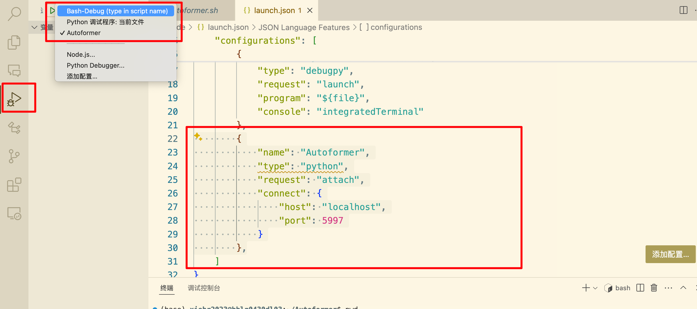
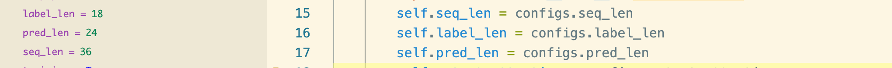
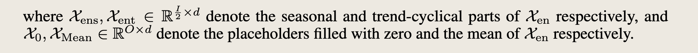
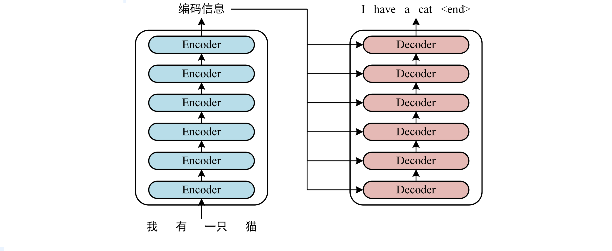

# Autoformer

## github 源码主页

Autoformer (NeurIPS 2021) 自动成型机 (NeurIPS 2021)

Autoformer: Decomposition Transformers with Auto-Correlation for Long-Term Series Forecasting
Autoformer：用于长期序列预测的具有自相关的分解变压器

Time series forecasting is a critical demand for real applications. Enlighted by the classic time series analysis and stochastic process theory, we propose the Autoformer as a general series forecasting model [[paper](https://arxiv.org/abs/2106.13008)]. **Autoformer goes beyond the Transformer family and achieves the series-wise connection for the first time.**
时间序列预测是实际应用的关键需求。受经典时间序列分析和随机过程理论的启发，我们提出了 Autoformer 作为通用序列预测模型 [[论文](https://arxiv.org/abs/2106.13008)]。Autoformer**超越了 Transformer 家族，首次实现了序列连接。**

In long-term forecasting, Autoformer achieves SOTA, with a **38% relative improvement** on six benchmarks, covering five practical applications: **energy, traffic, economics, weather and disease**.
在长期预测中，Autoformer 实现了 SOTA，在六个基准上**相对提升了 38%** ，涵盖了**能源、交通、经济、天气和疾病**五个实际应用。

**News** (2023.08) Autoformer has been included in [Hugging Face](https://huggingface.co/models?search=autoformer). See [blog](https://huggingface.co/blog/autoformer).
🚩**新闻**(2023.08) Autoformer 已包含在[Hugging Face](https://huggingface.co/models?search=autoformer)中。查看[博客](https://huggingface.co/blog/autoformer)。

🚩**News** (2023.06) The extension version of Autoformer ([Interpretable weather forecasting for worldwide stations with a unified deep model](https://www.nature.com/articles/s42256-023-00667-9)) has been published in Nature Machine Intelligence as the [Cover Article](https://www.nature.com/natmachintell/volumes/5/issues/6).
🚩**新闻**(2023.06) Autoformer 的扩展版本 ([使用统一深度模型为全球站点提供可解释的天气预报](https://www.nature.com/articles/s42256-023-00667-9)) 在《自然机器智能》杂志上作为[封面文章](https://www.nature.com/natmachintell/volumes/5/issues/6)发表。

🚩**News** (2023.02) Autoformer has been included in our [[Time-Series-Library\]](https://github.com/thuml/Time-Series-Library), which covers long- and short-term forecasting, imputation, anomaly detection, and classification.
🚩**新闻**(2023.02) Autoformer 已包含在我们的[[时间序列库\]](https://github.com/thuml/Time-Series-Library)中，它涵盖长期和短期预测、归纳、异常检测和分类。

🚩**News** (2022.02-2022.03) Autoformer has been deployed in [2022 Winter Olympics](https://en.wikipedia.org/wiki/2022_Winter_Olympics) to provide weather forecasting for competition venues, including wind speed and temperature.
🚩**新闻**（2022.02-2022.03）Autoformer 已部署在[2022 年冬奥会，](https://en.wikipedia.org/wiki/2022_Winter_Olympics)为比赛场馆提供天气预报，包括风速、温度等。

## 准备

### git clone

 

克隆远程仓库的方法：

（1）HTTPS，在把本地仓库的代码 push 到远程仓库的时候，需要验证用户名和密码

（2）SSH，git 开头的是 SSH 协议，这种方式在推送的时候，不需要验证用户名和密码，但是需要在 github 上添加SSH公钥的配置（推荐）

（3）zip download

我这里使用了 SSH 配置：

 

服务器直接 git clone 是很慢。所以本地 git clone，然后再上传服务器。

 

本地下载好以后，使用 FileZilla上传到远程服务器

  

down到本地以后，删除 .git文件，取消连接着远程仓库

 

 

### readme

下载数据集

设置数据集路径

 

### 调试配置

新建配置文件

 


修改配置文件

  


修改配置文件

```
        {
            "name": "Autoformer",
            "type": "python",
            "request": "attach",
            "connect": {
                "host": "localhost",
                "port": 5997
            }
        },
```

修改 sh 文件

```
python -m debugpy --listen 5997 --wait-for-client run.py \
```

### 新建 python 虚拟环境

本实验所需要的实验环境

> Install Python 3.6, PyTorch 1.9.0.

参考命令

```
conda create -n dave python==3.8
conda activate dave
conda install pytorch==2.1.2 torchvision==0.16.2 torchaudio==2.1.2 pytorch-cuda=11.8 -c pytorch -c nvidia
conda install numpy
conda install scikit-image
conda install scikit-learn
conda install tqdm
conda install pycocotools
```

激活、退出：

```
# To activate this environment, use               
#     $ conda activate Autoformer
#
# To deactivate an active environment, use
#
#     $ conda deactivate
```

用 requirements.txt 安装需要的库

```
conda create -n SegRNN python=3.8
conda activate SegRNN
pip install -r requirements.txt
```

启动 sh 文件：

```
sh run_main.sh
```

**适用于本实验的所有命令 :**

```python
conda create -n Autoformer python=3.6
conda activate Autoformer
```


```python
conda env list
conda actiavte 环境名
conda deactivate
```


[pytorch 官网](https://pytorch.org/)查看所需命令

 


```
conda install pytorch==1.9.0 torchvision==0.10.0 torchaudio==0.9.0 cudatoolkit=10.2 -c pytorch
```

### requirements

```
pip install -r requirements.txt
```

或者：

```
conda create -n Autoformer python=3.6
conda activate Autoformer
conda install pytorch==1.9.0 torchvision==0.10.0 torchaudio==0.9.0 cudatoolkit=10.2 -c pytorch
conda install pandas
conda install scikit-learn
conda install debugpy
conda install matplotlib
conda install reformer_pytorch
```

配置好以后，成功进入调试：

  


## 开始调试

代码相似度极高。

**Autoformer init：36（18）-》24**



setting:

```
ili_36_24_Autoformer_custom_ftM_sl36_ll18_pl24_dm512_nh8_el2_dl1_df2048_fc3_ebtimeF_dtTrue_Exp_0
```

model_id  36 预测 24 步长（label=18）、AutoFormer 模型，自定义数据集，预测多变量，输入序列 36，标签序列 18，预测序列 24，嵌入维度 512，注意力头数 8，2层编码层，1 层解码层，

```
df2048_fc3_ebtimeF_dtTrue_Exp_0
         		args.d_ff,
                args.factor,
                args.embed,
                args.distil,
                args.des, ii)
```

**Autoformer model**

```python
Model(
  (decomp): series_decomp(
    (moving_avg): moving_avg(
      (avg): AvgPool1d(kernel_size=(25,), stride=(1,), padding=(0,))
    )
  )
  (enc_embedding): DataEmbedding_wo_pos(
    (value_embedding): TokenEmbedding(
      (tokenConv): Conv1d(7, 512, kernel_size=(3,), stride=(1,), padding=(1,), bias=False, padding_mode=circular)
    )
    (position_embedding): PositionalEmbedding()
    (temporal_embedding): TimeFeatureEmbedding(
      (embed): Linear(in_features=4, out_features=512, bias=False)
    )
    (dropout): Dropout(p=0.05, inplace=False)
  )
  (dec_embedding): DataEmbedding_wo_pos(
    (value_embedding): TokenEmbedding(
      (tokenConv): Conv1d(7, 512, kernel_size=(3,), stride=(1,), padding=(1,), bias=False, padding_mode=circular)
    )
    (position_embedding): PositionalEmbedding()
    (temporal_embedding): TimeFeatureEmbedding(
      (embed): Linear(in_features=4, out_features=512, bias=False)
    )
    (dropout): Dropout(p=0.05, inplace=False)
  )
  (encoder): Encoder(
    (attn_layers): ModuleList(
      (0): EncoderLayer(
        (attention): AutoCorrelationLayer(
          (inner_correlation): AutoCorrelation(
            (dropout): Dropout(p=0.05, inplace=False)
          )
          (query_projection): Linear(in_features=512, out_features=512, bias=True)
          (key_projection): Linear(in_features=512, out_features=512, bias=True)
          (value_projection): Linear(in_features=512, out_features=512, bias=True)
          (out_projection): Linear(in_features=512, out_features=512, bias=True)
        )
        (conv1): Conv1d(512, 2048, kernel_size=(1,), stride=(1,), bias=False)
        (conv2): Conv1d(2048, 512, kernel_size=(1,), stride=(1,), bias=False)
        (decomp1): series_decomp(
          (moving_avg): moving_avg(
            (avg): AvgPool1d(kernel_size=(25,), stride=(1,), padding=(0,))
          )
        )
        (decomp2): series_decomp(
          (moving_avg): moving_avg(
            (avg): AvgPool1d(kernel_size=(25,), stride=(1,), padding=(0,))
          )
        )
        (dropout): Dropout(p=0.05, inplace=False)
      )
      (1): EncoderLayer(
        (attention): AutoCorrelationLayer(
          (inner_correlation): AutoCorrelation(
            (dropout): Dropout(p=0.05, inplace=False)
          )
          (query_projection): Linear(in_features=512, out_features=512, bias=True)
          (key_projection): Linear(in_features=512, out_features=512, bias=True)
          (value_projection): Linear(in_features=512, out_features=512, bias=True)
          (out_projection): Linear(in_features=512, out_features=512, bias=True)
        )
        (conv1): Conv1d(512, 2048, kernel_size=(1,), stride=(1,), bias=False)
        (conv2): Conv1d(2048, 512, kernel_size=(1,), stride=(1,), bias=False)
        (decomp1): series_decomp(
          (moving_avg): moving_avg(
            (avg): AvgPool1d(kernel_size=(25,), stride=(1,), padding=(0,))
          )
        )
        (decomp2): series_decomp(
          (moving_avg): moving_avg(
            (avg): AvgPool1d(kernel_size=(25,), stride=(1,), padding=(0,))
          )
        )
        (dropout): Dropout(p=0.05, inplace=False)
      )
    )
    (norm): my_Layernorm(
      (layernorm): LayerNorm((512,), eps=1e-05, elementwise_affine=True)
    )
  )
  (decoder): Decoder(
    (layers): ModuleList(
      (0): DecoderLayer(
        (self_attention): AutoCorrelationLayer(
          (inner_correlation): AutoCorrelation(
            (dropout): Dropout(p=0.05, inplace=False)
          )
          (query_projection): Linear(in_features=512, out_features=512, bias=True)
          (key_projection): Linear(in_features=512, out_features=512, bias=True)
          (value_projection): Linear(in_features=512, out_features=512, bias=True)
          (out_projection): Linear(in_features=512, out_features=512, bias=True)
        )
        (cross_attention): AutoCorrelationLayer(
          (inner_correlation): AutoCorrelation(
            (dropout): Dropout(p=0.05, inplace=False)
          )
          (query_projection): Linear(in_features=512, out_features=512, bias=True)
          (key_projection): Linear(in_features=512, out_features=512, bias=True)
          (value_projection): Linear(in_features=512, out_features=512, bias=True)
          (out_projection): Linear(in_features=512, out_features=512, bias=True)
        )
        (conv1): Conv1d(512, 2048, kernel_size=(1,), stride=(1,), bias=False)
        (conv2): Conv1d(2048, 512, kernel_size=(1,), stride=(1,), bias=False)
        (decomp1): series_decomp(
          (moving_avg): moving_avg(
            (avg): AvgPool1d(kernel_size=(25,), stride=(1,), padding=(0,))
          )
        )
        (decomp2): series_decomp(
          (moving_avg): moving_avg(
            (avg): AvgPool1d(kernel_size=(25,), stride=(1,), padding=(0,))
          )
        )
        (decomp3): series_decomp(
          (moving_avg): moving_avg(
            (avg): AvgPool1d(kernel_size=(25,), stride=(1,), padding=(0,))
          )
        )
        (dropout): Dropout(p=0.05, inplace=False)
        (projection): Conv1d(512, 7, kernel_size=(3,), stride=(1,), padding=(1,), bias=False, padding_mode=circular)
      )
    )
    (norm): my_Layernorm(
      (layernorm): LayerNorm((512,), eps=1e-05, elementwise_affine=True)
    )
    (projection): Linear(in_features=512, out_features=7, bias=True)
  )
)
```


数据集的加载是完全一样的。


### encoder embedding

目的：结合时间特征，将 数据特征嵌入到指定维度

```python
enc_out = self.enc_embedding(x_enc, x_mark_enc)
```


```python
self.enc_embedding = DataEmbedding_wo_pos(configs.enc_in, configs.d_model, configs.embed, configs.freq,configs.dropout)
```


**流程图**

```python
输入:
x_enc [B, L, D]        x_mark_enc [B, L, time_features]
    |                        |
    v                        v
+-----------------------------------------------+
|           Model.forward()调用                  |
|      self.enc_embedding(x_enc, x_mark_enc)    |
+-----------------------------------------------+
            |                |
            v                v
+------------------------+  +---------------------------+
| TokenEmbedding (值嵌入) |  | TemporalEmbedding (时间嵌入)|
+------------------------+  +---------------------------+
| 输入: x [B, L, D]      |  | 输入: x_mark [B, L, time_f]|
|                        |  |                           |
| 操作:                  |  | 操作:                     |
| 1.转置: [B, D, L]      |  | 1.转换为long类型          |
| 2.1D卷积: D -> d_model |  | 2.提取时间特征:           |
| 3.转置回: [B, L, d_model]|  |   - month_x (x[:,:,0])   |
|                        |  |   - day_x (x[:,:,1])      |
| 输出: [B, L, d_model]  |  |   - weekday_x (x[:,:,2])  |
|                        |  |   - hour_x (x[:,:,3])     |
+------------------------+  |   - minute_x (可选)       |
            |               |                           |
            |               | 3.查表获取各时间特征的嵌入  |
            |               | 4.将所有时间嵌入相加       |
            |               |                           |
            |               | 输出: [B, L, d_model]     |
            |               +---------------------------+
            |                        |
            +------------+------------+
                         v
            +---------------------------+
            | 相加并应用Dropout         |
            | value_emb + temporal_emb |
            +---------------------------+
                         |
                         v
                  输出: enc_out
                 [B, L, d_model]
```


1. **值嵌入 (TokenEmbedding)**:
   - 通过卷积操作将原始特征 [B, L, D] 映射到更高维度表示 [B, L, d_model]
   - 使用循环填充的1D卷积捕获局部特征模式
2. **时间嵌入 (TemporalEmbedding)**:
   - 将时间标记 [B, L, time_features] 转换为 [B, L, d_model] 的嵌入向量
   - 分别为月、日、星期、小时等时间特征查表获取嵌入，然后相加
   - 时间嵌入帮助模型识别时间模式(季节性、每日/每周周期等)
3. **组合嵌入**:
   - 将值嵌入和时间嵌入相加，形成最终编码器输入 [B, L, d_model]
   - 注意此版本不包含位置嵌入(DataEmbedding_wo_pos)

这种多重嵌入方式使模型能同时利用时间序列的值信息和时间特征信息，为后续的注意力机制和时间序列建模提供丰富的上下文。

## 模型定义


### 编码器 解码器部分


## 训练过程，形状变换

（1）

代码：

 

逐字讲解：

model 训练从 exp_main.py的 train 函数开始，epoch 表示整个训练集迭代几次，for batchx、batchy、batch x mark、batch y mark 一个批次一个批次的训练，第一个 for 训练的 epoch 是我们自己可以设置的，第二个 for 训练的 iteration 迭代次数是 `数据集长度 ➗ batch size`

接下来，调用 `self._predict` 方法进行预测，这里 predict 函数需要的参数 batchx、batchy、batch x mark、batch y mark 形状分别是 `batch_x = [32,36,7], batch_y = [32,42(18+24),7],batch_x_mark=[32,36,4],batch_y_mark = [32,42,4]`

32 表示 一个 batch 样本的个数；

36 表示每个样本的时间步，也可以说是回溯窗口的大小，或者叫输入序列的长度

7 表示 illness 数据集的特征数

batchy 的 42 表示 18 的 label length，是取的 原始输入序列的 二分之一，这个在论文中有说

 

编码器的输入 是 `I times d`  $I$ 表示 输入序列长度，在这里例子就是 36，$d$ 是特征数，这里的特征数，都去掉了时间戳，也就是 7

解码器的输入是 `二分之 I + O`，`二分之 I `表示 输入序列长度的一半，`O` 表示预测步长，也就是输出序列的长度

batch x mark，batch y mark 就是处理的时间戳特征了，包含一天的第几个小时，一个月的第几天，一周的第几天，一个月的第几天，就是我们之前讲过的 SegRNN，这里处理还涉及了 归一化 和中心化，不再重复啦。

---

**好了，接下来进入 预测部分，==步进==，也就是 predict 函数** 

首先，构造完整的解码器输入，具体的操作是，切片 batch y 中的预测步长，填充 0，并与 之前的 label length 进行拼接。也就是这两行代码

```python
# decoder input 
# 创建解码器输入的零张量部分，用于预测未来时间步
# batch_y[B, label_len+pred_len, D] -> 切片 -> [B, pred_len, D] -> 创建相同形状全零张量 -> dec_inp[B, pred_len, D]
dec_inp = torch.zeros_like(batch_y[:, -self.args.pred_len:, :]).float()

# 将历史数据(标签序列)与零张量连接，形成完整的解码器输入，并移动到指定设备
# [B, label_len, D] + [B, pred_len, D] -> torch.cat沿维度1拼接 -> [B, label_len+pred_len, D] -> to(device) -> 在GPU上的dec_inp
dec_inp = torch.cat([batch_y[:, :self.args.label_len, :], dec_inp], dim=1).float().to(self.device)
```

构造的完整解码器的输入，形状还是 32,42,7。

（这里的代码并不是那么重要，所以就不粘贴了，占地方）接下来是一个内部方法 run model，类似 forward，但因为不是一个具体的模型，所以就叫 run model了，类内调用了这个函数，才会执行，这里没有调用，进入下一步，判断是否采用了自动精度训练，我也不明白，大概是模型加速把，总之是 false，执行 else。

```python
else:
    # 使用普通精度执行模型计算
    # _run_model() -> outputs[B, label_len+pred_len, D]
    outputs = _run_model()
```

调用的内部方法 `_run_model()`，步进，进入到 run model 内部。


首先，这里的 self.model 是 `Exp_Basic`中的 `build_model` 定义来的，而且`exp_main` ， `Basic` 的子类 重写了 父类的方法，并通过字典，键是字符串，值的类，索引进行类的初始化，这个也是 SegRNN 中介绍过的。总之，这里的 `self.model` 是 `Autoformer` 


**点击步进，进入 Autoformer 的 forward 中。一个 batch 中样本的处理** 

----

### Autoformer  forward

首先，这里Autoformer  forward 接收的参数：

```python
def forward(self, x_enc, x_mark_enc, x_dec, x_mark_dec,
            enc_self_mask=None, 
            dec_self_mask=None, 
            dec_enc_mask=None):
```

必须传入的参数 是  `x_enc, x_mark_enc, x_dec, x_mark_dec` 我们这里就是 `batch x，batch y，batch x mark，batch y mark`，且形状分别是 `[32,36,7]、[32,42,7]、[32,36,4]、[32,42,4]`

可选参数是 Transformer 中的 3 个 mask，默认是 None。解释一下 Transformer 中的三个 mask 分别是什么：

> 三个mask机制，分别指的是
>
> - 第一个 编码端输⼊ 由于padding字符的mask，为了⼀个batchsize中，所有长度不相同的样本，能构成⼀个矩阵，所以有pad字符，但是在后⾯进⾏inputencoder的⾃注意⼒计算时，pad字符不能影响计算结果，所以需要mask；
> - 第⼆个mask是解码端的mask，这个mask是涉及到因果的mask，因为Transformer是⼀个⾃回归模型，在进⾏运算时，为了并⾏计算，我们是把inputs和outputs⼀起喂给模型的，inputs直接给模型没事，但是outputs在得到最后的输出时，不能借助未来信息，只能是当前时刻及其之前时刻的输出，所以需要⼀个mask机制，这个mask是⼀个上三角矩阵，保证在预测当前输出时，不会借助未来信息。
> - 第三个mask，是编码器和解码器的交互注意⼒，编码器的输出作为key和value，解码器的输出作为query，因为⽬标序列 每个样本的长度是不⼀样的，同时原序列的样本长度也是不⼀样的，⽽且⼀对之间 长度也是不⼀样的，所以需要⼀个mask 将原序列中某个单词某个位置 跟 ⽬标序列中 某个位置 如果它们之间 有⼀个pad的话 说明是⽆效字符，得到这样的掩码矩阵。
>
> 编码器以及 编码器和解码器的 mask 是为了保证长度的对齐，解码器的 mask 是为了在预测时 避免看到未来的信息

回到 Autoformer 这里，看这个模型是怎么处理，输入数据和输出数据，以及模型的创新是怎么实现的。

首先，看到下面这几行代码。


这几行代码的目的是为了解码器的输入的初始化，编码器阶段是用不到。

---

### 序列分解

**看论文 输入序列的趋势序列和季节趋势是怎么提取的。** 

本文将时间序列分解为 趋势序列和季节向量


趋势向量反映了数据的长期变化趋势和季节趋势。并且论文中提到 对于未来序列进行分解是不现实的，因为未来的所有序列都是不知道的。因此，为了解决这个问题，原文提出了 序列分解模块，思想是 从预测的中间隐藏变量中 逐步提取 长期稳定的趋势 。

具体的做法，使用移动平均来平滑周期性波动来突出长期趋势。

文中也给出了公式：


公式的解释：对于长度 为 L 的输入序列 X ，形状是 L×d，使用平均池化进行移动平均，并且使用填充操作保持序列长度不变。后面用一个 SeriesDecomp(X)来表示 上面的过程，简化一下记号。

**论文中的模型结构图也有画出这部分**


首先 箭头指的地方时 直观地显示了 输入序列 趋势序列 和 季节序列是怎么来的。输入序列 的 趋势序列 是对 输入序列 去均值；季节信息，也就是周期波动信息是 输入序列 - 均值 ，这个周期波动信息 是围绕 0 进行波动的。基于对输入序列的分解的认识，对于解码器 趋势序列 和 季节序列的 初始化也是很有道理的。

图片的下半部分，是解码器的输入，显示了 预测序列 趋势序列和季节序列的初始化，其中趋势序列使用输入序列的均值进行初始化，季节波动信息用 0 来初始化

---

**接下来，看代码中，对预测序列 的 趋势序列 和 季节序列的提取。**

首先 有 历史数据 x_enc [B, L, D]的，预测和标签数据 x_dec [B, L+P, D]，接着进行时间序列分解 将历史序列分解为季节性和趋势两个成分

```python
seasonal_init, trend_init = self.decomp(x_enc)
```

得到 趋势初始值：历史序列均值，季节性初始值：全零张量

基于 输入序列的 序列分解结果，构造 解码器的输入，具体来说：

- 输出序列 趋势输入= 历史趋势末尾 + 趋势初始值

- 输出序列 季节性输入 = 历史季节性末尾 + 季节性初始值(零)

也就是源码中的这几行：

```python
mean = torch.mean(x_enc, dim=1).unsqueeze(1).repeat(1, self.pred_len, 1)
zeros = torch.zeros([x_dec.shape[0], self.pred_len, x_dec.shape[2]], device=x_enc.device) 
trend_init = torch.cat([trend_init[:, -self.label_len:, :], mean], dim=1)
seasonal_init = torch.cat([seasonal_init[:, -self.label_len:, :], zeros], dim=1)
```

 这个模型的结构简单来说是 利用 **编码器**处理历史数据，**解码器**利用编码器输出和组装的初始输入生成预测，就是一个很标准的 Transformer 处理数据的架构。我们得到的最终输出是 趋势和季节性预测相加，因为有 label length，所以对于输出 是 提取末尾 pred_len 长度作为最终预测结果

Autoformer 的核心思想就是 将时间序列分解为不同频率成分并分别建模，再组合生成最终预测。

**先有个大体的印象，后面看到代码 详细的讲解。**

---

在进行后面的Encoder 和 Decoder之前，**先看 趋势项 和 季节项 的具体实现方法。** 有点复杂，但是一步步来。

▶️ 首先是调用 的   self.decomp

```python
seasonal_init, trend_init = self.decomp(x_enc)
```

▶️ 而 self.decomp 又是 初始化 series_decomp 类

```python
self.decomp = series_decomp(kernel_size)
```

▶️ 看到 series_decomp 类的定义

```python
class series_decomp(nn.Module):
```

🟢 类的定义

```python
class series_decomp(nn.Module):
    """
    Series decomposition block
    """
    def __init__(self, kernel_size):
        super(series_decomp, self).__init__()
        self.moving_avg = moving_avg(kernel_size, stride=1)

    def forward(self, x):

        # 计算移动平均，提取序列趋势分量
        # x 形状[B, L, D] -> moving_mean形状[B, L, D]
        #  moving_avg内部会进行填充，保证输出形状与输入相同
        moving_mean = self.moving_avg(x)

        # 通过原始序列减去趋势分量，得到残差(季节性分量)，逐元素减法操作
        # x形状[B, L, D] - moving_mean形状[B, L, D] -> res形状[B, L, D]
        res = x - moving_mean

        # 返回季节性分量和趋势分量，均保持原始形状[B, L, D]
        # 第一个返回值res是季节性分量，第二个返回值moving_mean是趋势分量
        return res, moving_mean
```

▶️ 类内 调用 `moving_avg` 


▶️ 看到 `moving_avg` 类的定义

```python
class moving_avg(nn.Module):
```

🟢 `moving_avg` 定义

```python
class moving_avg(nn.Module):
    """
    Moving average block to highlight the trend of time series
    """
    def __init__(self, kernel_size, stride):
        super(moving_avg, self).__init__()
        self.kernel_size = kernel_size
        self.avg = nn.AvgPool1d(kernel_size=kernel_size, stride=stride, padding=0)

    def forward(self, x):
        # padding on the both ends of time series

        # 提取第一个时间步并重复，用于前端填充
        #  [B, L, D] -> [B, 1, D] -> [B, (kernel_size-1)//2, D]
        front = x[:, 0:1, :].repeat(1, (self.kernel_size - 1) // 2, 1) 

        # 提取最后一个时间步并重复，用于后端填充
        # [B, L, D] -> [B, 1, D] -> [B, (kernel_size-1)//2, D]
        end = x[:, -1:, :].repeat(1, (self.kernel_size - 1) // 2, 1)

        # 连接填充部分与原序列
        # [B, (k-1)//2, D] + [B, L, D] + [B, (k-1)//2, D] -> [B, L+(k-1), D]
        x = torch.cat([front, x, end], dim=1)

        # 转置并应用一维平均池化
        # [B, L+(k-1), D] -> [B, D, L+(k-1)] -> [B, D, L]
        # 池化窗口大小为kernel_size，步长为1，输出长度为(L+(k-1)-k+1)=L （length + 2P - K + 1）
        x = self.avg(x.permute(0, 2, 1))

        # 转置回原始维度顺序 [B, D, L] -> [B, L, D]
        x = x.permute(0, 2, 1)
        return x
```

总结：就是 3 次调用：

```python
seasonal_init, trend_init = self.decomp(x_enc)

self.decomp = series_decomp(kernel_size)

class series_decomp(nn.Module):
    def __init__(self, kernel_size):
        super(series_decomp, self).__init__()
        self.moving_avg = moving_avg(kernel_size, stride=1)
        
    def forward(self, x):
        moving_mean = self.moving_avg(x)

class moving_avg(nn.Module):
     def forward(self, x):
        front = x[:, 0:1, :].repeat(1, (self.kernel_size - 1) // 2, 1) 
        end = x[:, -1:, :].repeat(1, (self.kernel_size - 1) // 2, 1)
        x = torch.cat([front, x, end], dim=1)
        x = self.avg(x.permute(0, 2, 1))
        x = x.permute(0, 2, 1)
        return x	
```

用一张图表示 Autoformer 序列分解的的过程，这个分解过程将原始序列 x_enc 分解为两个相同形状 [B,L,D] 的张量：趋势成分和季节性成分：

```
                    输入: x_enc [B, L, D]
                          |
                          v
            +---------------------------+
            | Model.forward()           |
            | 调用: self.decomp(x_enc)  |
            +---------------------------+
                          |
                          v
            +---------------------------+
            | series_decomp(kernel_size)|
            | self.decomp实例           |
            +---------------------------+
                          |
                          v
            +---------------------------+
            | series_decomp.forward(x)  |
            | 1. 调用移动平均计算趋势   |
            | 2. 原序列减去趋势得到季节性|
            +---------------------------+
                          |
                  +-------+-------+
                  |               |
                  v               v
    +---------------------------+  +---------------------------+
    | moving_avg.forward(x)     |  | 季节性计算                |
    | 步骤:                     |  | res = x - moving_mean     |
    | 1.前后填充序列           |  |                           |
    | 2.应用平均池化           |  |                           |
    | 3.返回趋势分量           |  |                           |
    +---------------------------+  +---------------------------+
                  |               |
                  v               v
             趋势分量        季节性分量
          trend_init [B,L,D]  seasonal_init [B,L,D]
                  |               |
                  +       +       +
                          |
                          v
                返回到Model.forward()
                进行后续处理
```

讲图 逐字稿：

（1）**Model.forward()** 调用 self.decomp(x_enc)进行序列分解

（2）**series_decomp.forward(x)**

> 包含两个主要步骤:
>
> - 调用 self.moving_avg(x)计算移动平均，得到趋势分量
> - 计算原序列与趋势分量的差值，得到季节性分量

（3）**moving_avg.forward(x)**

> 执行移动平均计算:
>
> - 通过重复首尾元素进行序列填充
>
> ```python
> front = x[:, 0:1, :].repeat(1, (self.kernel_size - 1) // 2, 1) 
> end = x[:, -1:, :].repeat(1, (self.kernel_size - 1) // 2, 1)
>  x = torch.cat([front, x, end], dim=1)
> ```
>
> - 应用一维平均池化操作
>
> ```
> x = self.avg(x.permute(0, 2, 1))
> ```
>
> **说明 为什么填充，是为了 保证序列在平均池化后 长度不变**
>
> - 返回平滑后的趋势分量
>
> 这部分的形状变化： 
>
>  

现在开始 返回 **moving_avg.forward(x)** 是利用 1D 平均池化 得到 趋势序列，将结果返回给 **series_decomp** ，也就是这句代码 `moving_mean = self.moving_avg(x)`，得到趋势序列以后，永远序列减趋势序列 `res = x - moving_mean` ，得到季节分量，也就是周期性信息。具体的代码：


最终 将结果 返回给 Autoformer forward 中的 seasonal_init, trend_init


并且 用这两个 init 初始化 解码器的输入。

这里得注意一下，对于 标签序列，也就是 输入序列的趋势信息的提取用的是 1D平均池化，而对预测 predict length 的趋势信息初始化 就直接用的 输入序列的均值

```python
mean = torch.mean(x_enc, dim=1).unsqueeze(1).repeat(1, self.pred_len, 1)
```

周期性趋势也是，label length 的季节趋势是 残差，也就是 原始序列 减去 趋势序列，而 predict length 的 季节趋势就是直接初始化为 0 了。

```python
zeros = torch.zeros([x_dec.shape[0], self.pred_len, x_dec.shape[2]], device=x_enc.device) 
```

这里是 小小的区别，小小的注意。

好了 这部分，序列分解说完了，代码讲了，原文讲了，公式对应上了，图也说了。原文 `Series decomposition block`  就过啦

  

序列分解 over

---

### model inputs

下面开始 模型的输入，先从论文开始讲解：

 

模型的输入部分，模型的输入包括编码器的输入和解码器的输入。具体来说，

编码器的输入是过去 $I$ 个时间步，文中给出的符号表示 $\mathcal{X}^{I \times d}$ ，$I$ 表示时间步长，$d$ 表示每个时间步的特征数。

解码器的输入包括了 季节性序列 和 趋势性序列，具体的符号表示分别是 $\mathcal{X}_{des}$  和 $\mathcal{X}_{det}$    形状是一样的：$(\frac{I}{2}+O)$  、$\frac{I}{2}$ 是 label length 的长度，取的是原始输入序列长度的 一半。O 是 预测步长 predict length。d 同样是每个时间步的特征数。接下来，我们来看公式是怎么表示的：


$\mathcal{X}_{ens}、\mathcal{X}_{ent}$  分别表示 从 原始 输入序列 $\mathcal{X}_{en}$ 分解出的季节成分和趋势成分，截取出后半部分 $\frac{I}{2}:I$ 作为 label length，与长度为 predict  length 的时间步进行拼接，用 0 填充的长度为 predict length的向量记作 $\mathcal{X}_0$ ，用输入时间序列时间步均值填充的长度为 predict length 的向量记作 $\mathcal{X}_{mean}$

然后，$\mathcal{X}_{ens}$ 与 $\mathcal{X}_0$ 进行 concat 得到 解码器季节成分的初始值  $\mathcal{X}_{des}$

 对应着的 $\mathcal{X}_{ent}$ 与 $\mathcal{X}_{mean}$ concat 得到解码器趋势成分的初始值 $\mathcal{X}_{mean}$

**再强调一下，这里所涉及的向量的记号和形状：** 

- 编码器的输入是 过去 $I$ 个时间步，表示 $\mathcal{X}^{I \times d}$ ，$I$ 表示时间步长，$d$ 表示每个时间步的特征数。
- 解码器季节成分的输入是 $\mathcal{X}_{des} ^{(\frac{I}{2}+O)\times d}$ 、解码器趋势成分的输入是 $\mathcal{X}_{det} ^{(\frac{I}{2}+O)\times d}$ 
- 涉及到的中间变量，$\mathcal{X}^{\frac{I}{2} \times d}_{ens}$ ，$\mathcal{X}^{\frac{I}{2} \times d}_{ent}$ 可以理解为标签序列的季节成分和趋势成分，就是从输入序列分解的季节成分和趋势成分中截取的后半段。
- 预测序列季节成分的初始值是 $\mathcal{X}_0 ^{O \times d}$ ，趋势成分初始值是 $\mathcal{X}^{O \times d} _{Mean}$

也就是论文中模型结构图的：


具体到代码，就是 autoformer forward的前 5 行，其中 self.decomp是我们刚刚仔细讲过的 序列分解模块 Series decomposition block：


这部分代码比较好理解，就这样，以上部分完成了对原文 model inputs 部分的讲解，代码，论文，图，公式都讲了。




### Encoder

**接下来进入论文的 Encoder 部分**  

会同样按照，论文、图、公式、代码一一对应的逻辑进行讲解

**首先，Autoformer 遵循原始 Transformer 的结构，** 


编码器，解码器，编码器接收的 input 是 word embedding + positional embedding，然后通过自注意力机制和前馈神经网络。解码器接收的 输入是 output，预测部分，同样是 word embedding+positional embedding，然后分别经过解码器输入的 自注意力机制，以及和编码器输出 的 交叉注意力，最后经过 全连接层，得到最终的输出。

首先强调一下关于Transformer 为什么是注意力机制和全连接层的设计？

> 首先，Transformer 在 NLP中接收的数据格式 是 [B,L,D]，batch size，一个 batch 中有多少个句子，一个句子中有几个词 L，每个词的嵌入D，也就是每个词用长度为多少的向量表示
>
> 最直观的讲解，就是 注意力机制进行 L 层面的交互，前馈神经网络进行 D 层面的交互。
>
> **L 层面也就是注意到了 词与词之间的交互，D 层面就是词与词之间特征的交互** 
>
> > 在L层面（单词层面）进行交互，计算每个单词对其他单词的注意力权重，捕捉词与词之间的关系；
> >
> > 在D层面（即单词嵌入的特征层面）进行交互，对每个单词的嵌入向量进行非线性变换，捕捉词与词之间的特征交互 
>
> **对应到时间序列中**
>
> 1️⃣ 标准 ==输入== 格式也是 BLD，具体的解释： 
>
> > B = 32 (批量大小，32个时间序列样本)
> > L = 36 (每个样本有36个时间步，如过去36天的数据)
> > D = 7 (每个时间步有7个特征，如对于股票可能包括开盘价、收盘价、最高价、最低价、交易量等)
>
> 2️⃣ ==处理==   注意力机制
>
> 编码器中，注意力在所有36个时间步之间建立连接
> 解码器中，注意力既在预测序列内部建立连接，也与编码器输出建立连接
>
> 时间步之间的建模 可以 发现股票价格每周五可能下跌，或者每月初可能上涨的模式
>
> 3️⃣ ==处理==  前馈全连接层
>
> 处理每个时间步内7个特征之间的关系
>
> 例如，交易量与价格变动的关系，或开盘价与收盘价的关系

诶，说起这个，关于用现实例子理解这些模型，

**首先，卷积是什么意思？** 

假如我们要认识一个人A，B 是 A 的直接朋友，形成了B 对 A 的第一次认识，B 就相当于卷积核了，那直接认识 A的肯定不止一个人，还有B1，B2，B3...等，每个人对形成了对 A 的第一次认识，父母认识 A更关注生活层面，学校中直接认识的 A 更关于为人处事部分，工作中直接认识的 A 更关于 A 的生产性。这里直接认识 A 的B1，B2，B3...就是每一层中 卷积核的个数。除了直接认识 A 的，还有通过直接认识 A 的人B 认识 A，这波人叫 C，那还有通过 C 认识 A 的，那 C 又认识 D，D 又通过 C 认识 A。除了别人认识 A，A 自己也有对自己的认识。

**Transformer是什么意思？**

除了刚刚说的 注意力机制和前馈全连接层的理解，还有 Encoder 、Decoder 、多头注意力机制的理解。

- [x] Encoder&Decoder 的交互怎么理解？

首先，整体上的这个图：



编码器相当于甲方，解码器相当于乙方，甲方有需求，自己公司内部一级一级沟通，从最开始的想法最终形成方法交给最后一个人，这个人去和乙公司沟通，乙公司又有很多个部分，每个部分分别完成甲公司提出的方案的一部分，这一个过程中需要不断的与甲公司手拿最终方案的人不断沟通，最终乙公司完成方案。

- [x] 多头注意力机制怎么理解

对于 BLD 的序列，首先明白的是，那个维度分多头了，是 D 维度分成 num head维度和 head dim，其中 num head × head dim = embedding dim（D），相当于什么意思，一个人学知识（B =1），L 是要学的几本书，D 是每本书有几个章节，一般是一个老师教我们学一整本书，但多头注意力机制的意思是，一本书的几个章节，分开，比如第一个老师教第一章和第二章，第二个老师教第三章和第四章，最后两张第三个老师教，这样学习的时候，同样是一个学期，一个老师只需要关注两章的内容，对于课程节奏的把握知识理解的更透彻，效果会比一个老师教一整本书的内容要好一些。

B=3，就是班里的 3 个人，每个人这学期都要上这几本课，同样的 LD。

> 最后一个 linear 层，应该是为了还原原始维度的。

#### 论文

**好了，扩展的远了，回到论文中Encoder 部分** 


原文中说，首先编码器更专注季节部分的建模，编码器的输出包含过去的季节性信息，并将作为交叉信息帮助解码器细化预测结果，假设有 N 个编码器，则第 i 层编码器的总体方程可以表示为 $\mathcal{X}_{en}^l = Encoder(\mathcal{X}_{en}^{l-1})$ ，就是说 第 $l$ 层编码器接收 第 $l-1$ 层编码器的输出作为输入，具体的细节是原文的公式(3)

**下面对 公式 3 进行讲解**

首先，等号左边，下划线表示忽略掉季节成分，只关注季节成分。

$\mathcal{X}_{en}^l = \mathcal{S}_{en}^{l,2},l \in {1,...,N}$  表示 第 $l$ 层编码器的输出。

- 初始值，也就是编码器的输入是 $\mathcal{X}_{en}^0$ 是 输入时间序列的 $\mathcal{X}_{en}$ 的 word embedding

- [ ]  $\mathcal{S}_{en}^{l,i},i \in {1,2}$ 表示 第 $l$层中 第 i 个序列分解模块之后的季节性成分，然后公式中的 Auto-correlation 后面再说，这是本文的一个创新点。（ps，后面要重点看这个是什么意思。）

> （我最开始看见这里的疑问，不用讲，忽略掉即可）先看公式等号的左边， $\mathcal{S}_{en}^{l,1}$ 首先，下标 $en$ 就是表示 编码器，$l$ 表示第几个编码器，那这个 $1$是什么意思？

**原文和公式说了，接下来来看代码，Encoder 是怎么实现的。**

#### Encoder Embedding

==首先，构造 Encoder 的输入== ，编码器嵌入。


具体怎么做的看autoformer 的 init 部分：


看到这边调用的 `DataEmbedding_wo_pos` 这个类，其中具体地 valueEmbedding 和TemporaryEmbedding 又分别在 init 中显示调用了 `TokenEmbedding` 类和 `TemporalEmbedding` 类


##### 类图

嵌入部分的调用关系用流程图来表示：


首先，跟大家说这个图怎么画，首先在调试的过程中，看到调用相关的代码，就粘贴给 gpt，然后让 gpt 画。这个图就是 gpt 给我画的，它用的 mermaid ，生成代码，然后我粘贴到我的 markdown 文档中，我用的 markdown 编辑器是 Typora，可以解析 mermaid，用在线mermaid 也可以显示出图。直接搜 在线 mermaid。或者跟 gpt 说，用简单的流程图画，不用 mermaid，都能帮你把自己的代码理清楚。

mermaid 画出的类调用图，一个类用三行表示，第一行 类名、第二行，init 部分的定义、第三行类中方法的定义

**好了，现在开始讲图，** 

可以看到 `DataEmbedding_wo_pos` 类 的 init 分别调用了 `TokenEmbedding`类、`PositionalEmbedding`类和 `TemporalEmbedding`类，同时还定义了一个 dropout 层。

🔵 调用 `tokenEmbedding`类，init 部分是使用一个 `nn.Conv1d` 初始化了一个卷积层，传给 `self.tokenConv` ，后面在 这个类中的 forward 方法中用。


通俗点说，这里的 tokenEmbedding 就是通过一个1D 卷积实现的，具体的形状变化注释中也给出了。

> 怎么生成注释？
>
> 首先把代码粘给 gpt，然后，跟它说：`为每行代码 添加 两行注释，一行说明这行代码的目的，一行说明 形状的变化和操作 形状->操作->形状的格式，操作的格式类似 DecoderLayer.forward 显示出调用的什么类名.方法`

🔵 接下来看 位置编码 Positional Embedding，由于这里没有用，就不说了。

🔵 最后，时间戳编码，


注意这里的时间戳编码是有一个判断的，经过调试，我们这里调用的是 `TimeFeatureEmbedding` 类。

也就是说什么意思，这个图画的有问题，不过意思也是对的，就不深究了。

接下来，我们跳到 `TimeFeatureEmbedding` 这个类的定义。

 

就是通过一个线性层，将 时间戳特征嵌入到指定维度。

首先，嵌入到指定维度是因为高维向量表示特征更精细。

其次，我们这里使用的是疾病数据集，是小时的，所以维度 4，表示的的是，小时-天，天-周，天-月，天-年。这一部分也说过很多次了，再说一次，加深印象。

具体来说输入的 `x_mark.shape=32,36,4 → nn.Linear → 32,36,512`

接下来，总结一下这里的嵌入。首先 本文用到的所有嵌入都定义在了  `Embed.py`文件中


而这个文件中，又定义了所有的嵌入类，又有 8 个。

> 题外话，这个怎么看，是 vscode 的大纲视图，找出来，就能看到了
>
> 
>
> 大纲视图中，立方体表示定义的函数，小树杈的东西是类，类中有小立方体，是类中定义的函数，类中定义的函数，也就是小立方体中，折叠的部分是 使用这个函数或者类所需要的初始化参数。方括号+小立方体包括的部分是 类中调用的类的对象名，比如这里：
>
> 
>
> 以这个 TemporalEmbedding 类为例， 这个TemporalEmbedding 类中有两个方法方法，分别是 init 和 forward。
>
> init 折叠的部分是 初始化这个类所需要的参数， forward 折叠的部分是调用这个时所需要的参数，其中 init 部分还实例化了 5 个对象，对象名分别是 mintue_embed、hour_embed、weekday_embed、day_embed、month_embed，但是这里具体实例化的哪个类。这里是没有显示的，得点进去自己看，可以看到这个对象其实都是实例化的Embed 这个类，很明显是一个自定义的，想看还得步进看具体实例化的哪个类。

以上完成了 Encoder Input 的 Embedding 部分，分别进行了 token Embedding 和 TemporaryEmbedding来对历史时间步特征进行嵌入和时间特征进行嵌入。

汇总这里的维度形状变化：

```python
# x [B, L, D] → permute → [B, D, L] → 卷积 → [B, d_model, L] → transpose → [B, L, d_model]
# x_mark [B, L, d_inp] → 线性层变换(时间特征整体映射) → [B, L, d_model]
# [B, L, d_model] + [B, L, d_model] → [B, L, d_model]
```

**接下来想给大家说的是， 1D 卷积怎么进行的 tokenEmbedding：** 

小小的点，小小的注意。

接收的标准输入是 BLD

- 首先进行的是 permute，将想要嵌入的维度`D` 移到中间，然后进行 1D 卷积，嵌入到 `d_model`  （ `Embedding dim`），对应到 1D 卷积中，就是输入通道是 D，输出通道是 `d_model`


- 为什么这么做？因为卷积最开始主要用于图像，图像的标准格式是 BCHW，图像中的 HW 就表示图像的特征，只不过是用 2D的矩阵 表示的，而且这个 2D 矩阵保存了位置信息，不能随意展平。那此时，C 也就可以理解为每个像素的特征数。比如每个像素用彩色的 RGB 三个元素表示。
- 所以我们这里的时间序列中的 1D 卷积，也仿照图像中卷积的定义，每个时间步的特征数放到中间，表示输入通道数，然后将每个时间步的特征，映射到输出维度大小，这里表示为 `Embedding dim`，也就是 `d_model`。

用一张图来表示，(这里其实很像 SegRNN 的视角转换)：


而 时间戳特征的 nn.Linear就是直接对最后一个维度进行嵌入了

`x_mark [B, L, d_inp] → 线性层变换(时间特征整体映射) → [B, L, d_model]`

pytorch中常用的是维度变换函数 permute、transpose、view 都是直接写维度变换。

带着走一遍代码。

#### Encoder forward

**行了，嵌入讲完了，接下来，进入正式的 Encoder 的部分的数据流动。**

（终于）


从 Autoformer forward 的 self.encoder 进入。

在步进之前看一眼怎么初始化的。非常复杂：


来直接看图吧，具体怎么复杂。

##### 类图


首先图中清楚的展示了，就图来说：

 

通过 Autoformer 定义的 model 中，定义了这个 Encoder 类，传给了 self.encoder 。

接着看这个 Encoder 类的定义，这个 Encoder 的初始化调用了EncoderLayer类，传给了 layers（就是EncoderLayer类的实例化对象）。

对应到代码：


接着，Encoder 类调用了 EncoderLayer 类，那接下来就看 EncoderLayer 的定义：


看图以及代码：


（看代码）：红框是上面讲的，`Encoder` 的初始化需要调用 `EncoderLayer` 类

第一个红框表示，`EncoderLayer` 中的 `init` 初始化中又调用了 `AutoCorrelationLayer` 类，并且传入了  `EncoderLayer` 初始化过程中所需要的参数 ，去 `EncoderLayer` 这个类。


结合 图 和 代码，这部分就可以理解了。

 

主要的复杂点就是初始化一个类的同时又需要初始化另一个类，初始化另一个类又需要初始化类。好好看看是可以理解的。

后面还有 AutoCorrelationLayer 的初始化，又要调用 AutoCorrelation 类


理解的逻辑是一样的。

首先代码 Autoformer forward Encoder的初始化过程中，给出了每个类初始化所需要的传入参数


而上面 mermaid 画的图，展示了每个类中 init 中具体调用的类和实例化的对象名。以及除了 init 方法外，还有类中可以调用的方法，比如 AutoCorrelation中，除了 init、forward 以外，还有 `time_delay_agg_training`  和 `time_delay_agg_inference` 


这部分调用关系希望我讲明白了，再用一张图说明一下：


就是说在我们在 Encoder forward 中传入到的x，会传入到 EncoderLayer 中的 forward 中进行处理，而   EncoderLayer forward 中又调用了 AutoCorrelation Layer 中的 forward，然后呢，AutoCorrelation Layer 中的 forward又调用了 AutoCorrelation的 forward，最后AutoCorrelation又调用了自己 AutoCorrelation time delay agg tranning 或者 inference。

（谁懂啊。当初逐步调试的时候，步进一个又步进一个，都找不到头 T_T），为什么说这部分调用不好理解，是因为按理说，forward 中有调用，去 init 中找。

具体来说，Autoformer 的 forward 中调用了 `self.encoder` ，在 init 中找到了


那按住 command，跳进Encoder 的定义，不管是 init 还是 forward 中都没有显示的说明 attn_layer是调用的什么。


所以最开始步进这里的时候，就很晕。其实这里所有的初始化以及调用都在最最开始的  Autoformer 的 self.encoder的初始化中给了。在后面定义的类中，按住 command 不能跳到类的定义。得从头开始。当然了，步进就不用管这些了。自己就跳来跳去了。

**好了 以上完成了 self.encoder的初始化，刚刚是对 编码器所接收的输入进行嵌入，这里是模型的定义**

基于以上的认识，接下来进入 forward 中，看数据的流动过程。

#### EncoderLayer

首先，从 ⬇️ 开始步进。

```python
 enc_out, attns = self.encoder(enc_out, attn_mask=enc_self_mask)
```

如我们所料，步进到了 Encoder 类的 forward：


继续步进，一步步执行：


条件判断执行 else，跳到

> - [x] 每一步的现实意义在做什么
> - [x] 形状变化、调用关系


EncoderLayer 的 forward 中调用了自相关机制（自相关机制=AutoCorrelation Layer + AutoCorrelation），这是本文的创新点，后面再说。论文中也是说了后面再说，作者设计了这个模块就就是代替了原始 Transformer 的 self attention 的计算，你看这个命名，虽然调用的是AutoCorrelation Layer，但是变量命名时，仍然是 self.attention 也就可以理解为作者是改进了原始 Transformer 中的自注意力机制。

因此我们这里在调试 Encoder 的具体过程时，暂时不步进到 self.attention的具体的执行过程中。

单个 Encoder 的执行就是 执行一次 EncoderLayer，有几个 Encoder就执行几次 EncoderLayer。

现在说明这个 EncoderLayer 的执行过程：

```
def forward(self, x, attn_mask=None)
```

首先 EncoderLayer 接收的输入是 x，mask 是可选参数。

输入`x`形状为[B, L, d_model]

```
       new_x, attn = self.attention(
            x, x, x,
            attn_mask=attn_mask
        )
```

接下来进行 Encoder 部分的自注意力机制的计算，这里实际调用的是作者的创新模块，自相关层。后面不再区分叫法。

自注意力机制==接收==的参数 qkv都等于 x，因为是自注意力机制，形状是一样的 [B, L, d_model]。

这里的 `attn_mask=None`

自注意力机制返回的 变量有 `new_x`, `attn`，形状分别是

new_x`[B, L, d_model]`和注意力权重attn`[B, n_heads, L, L]`

这里的 new_x 意思是 有了对其他时间步权重的 x，attn 存的是两两时间步之间的注意力得分。（当然了，这是原始 自注意力机制 $softmax(\frac{QK^T}{\sqrt{d_k}})V$ 的计算，论文实现的这里面是啥再说）

```python
x = x + self.dropout(new_x)
```

接下来，单个 Encoder 的输出 是 `dropout(new_x)` ，再经过残差连接。这里就是<span id="原始 Transformer 架构">原始 Transformer 架构</span>【见[附录](#附录)】中的东西，也就是经过自注意力机制以后进行 残差连接和归一化。

```python
x, _ = self.decomp1(x)
```

接下来，是序列分解


序列分解的第一个返回值是季节成分，第二个返回值是使用移动平均得到趋势性成分

在 Encoder 中使用的序列分解时，不要趋势成分，只留下季节成分

接收的参数 x 是要分解的原始序列，形状是 [B, L, d_model]

返回的参数 x 是分解以后的季节成分，形状依然是 [B, L, d_model]

 

这部分代码就是原文公式 3 的第一行公式。

把代码贴到这里再体会一下：


对第 `l-1` 层 Encoder 的输出进行自相关机制的计算，得到的输出与原始的 x 进行残差连接，最后对残差连接以后的输出进行趋势分解，同时只保留 季节成分，忽略掉趋势成分。

**接下来，进行公式 3 的第二行公式所对应的代码讲解：** 

```python
y = x
```

下一句，新建 x 的副本，保存成 y，后面都对 x 的副本 也就是这个 y 操作，x 先放着不用，后面用于 FFN 以后的 残差连接。

那具体这里的 FFN 是怎么做的呢？

看到代码


不看dropout 和激活层，因为这两个操作并不会改变输入张量的形状，接下来看到FFN 是由两个 1d 卷积也就是conv1d 实现的。


接下来，再看 Encoder 的 init 部分，这两个 1d 卷积是怎么定义的，诶，就是一个先升维后降维的操作，就完成了 FFN。

就是说 self.conv1是将单个时间步嵌入维度 `d_model`升维到 `d_ff`；接下来 self.conv2就是将 `d_ff` 又恢复成原始形状 `d_model`。多说一句，好像没意义，其实有意义，第二次恢复的 `d_model` 其实是精细化的学习了 特征与特征之间的相关关系，并返回给了 `d_model` 中进行保存。

看到代码：


关于这里，我有以下几点想说：

第一点，升维的操作，经过 conv1d 以后，相当于进行了全连接，也就是相当于nn.Linear的作用，那写过代码的都是到，nn.Linear以后进行激活，目的是为了增加模型的非线性表达能力，这点李沐的书上也提到过。这里就仿照着 conv1d 的输出也加上了激活函数。加的所有 dropout 都是为了防止过拟合，随机失活一些节点。

> 标准前馈神经网络的设计模式：线性变换→非线性激活→线性变换；
>
> 在Transformer原始设计中，FFN部分表示为：
>
> ```
> FFN(x) = max(0, xW₁ + b₁)W₂ + b₂
> ```
>
> ReLU 激活函数和两个 nn.Linear

第二点，前面已经说过，1d 卷积升维降维指的是通道维度，也就是 dim=1，所以这里进行 1d 卷积之前也是进行了 transpose。

~~第三点，为什么这里是 conv1d，而不是 nn.Linear，因为时间序列要保持时间步的前后关系，所以用 conv1d，类似滑动窗口，沿着时间步的前后顺序逐步滑动，每次移动 stride 个步长。~~ （我理解的不对）功能上就是一样的，只是数据的组织形式不同，不用刻意的区分。

第四点，这里的 d_ff 前馈神经网络的嵌入是 2048。

> d_ff通常设置为d_model的4倍，对于d_model=512的情况，d_ff就是2048。这也是Transformer原始论文中的设置。增大中间层维度可以提高模型的表达能力。

第五点，self.conv2d的输出，在进行形状变换`transpose`的目的是为了恢复成时间序列的标准数据格式。

> 将数据格式从卷积友好的`[B, C, L]`转回到Transformer架构通用的`[B, L, D]`格式

再次直观地说明这一部分就是这样的：

```
# 第一步：转置使特征维度成为通道维度
y.transpose(-1, 1)  # [B, L, d_model] -> [B, d_model, L]

# 第二步：应用第一个卷积扩展通道维度
self.conv1(...)  # [B, d_model, L] -> [B, d_ff, L]

# 第三步：应用第二个卷积恢复原始通道维度
self.conv2(...)  # [B, d_ff, L] -> [B, d_model, L]

# 第四步：转置回原始序列格式
(...).transpose(-1, 1)  # [B, d_model, L] -> [B, L, d_model]
```

**后记：** 

> - [x] <span id="为什么Conv2之后没有进行激活函数的应用">产生的疑问</span>：[为什么Conv2之后没有进行激活函数的应用](#附录) 
>
> 直观的理解我的疑问：
>
> **现有设计 (第二层无激活)：**
>
> ```
> y = Conv1 -> ReLU -> Dropout -> Conv2 -> Dropout
> ```
>
> **替代设计 (两层都有激活)** 
>
> ```
> y = Conv1 -> ReLU -> Dropout -> Conv2 -> ReLU -> Dropout
> ```
>
> - [x] 为什么是 conv1d，而不是 nn.Linear
>
> 没啥必要了，主要是在数据组织和计算效率方面有差异，Autoformer选择Conv1D而非Linear，是基于架构一致性、计算效率和未来扩展性（设置 kernel size 以后可以捕捉时间步之间的局部相关性）的考虑，功能上是完全一样的。
>
> - [x] 打印了单个 EncoderLayer的模型参数
>
>  

最后还有一句，将原始特征x与变换后的特征y相加，再次应用序列分解提取季节性部分

```python
# 将原始特征x与变换后的特征y相加，再次应用序列分解提取季节性部分
# (x + y)[B, L, d_model] -> 序列分解 -> 输出res[B, L, d_model]和未使用的趋势分量_[B, L, d_model]
res, _ = self.decomp2(x + y)
```

**到了这一步，其实代码该讲的也讲完了，更重要的在于开始思考，为什么这样设计？**

- 粘贴自 gpt 的答案贴在附录中了，解释得挺好的，还有和传统 Transformer 的对比
- （我理解的部分自己复述）使得编码器在逐层编码的过程中，更关注高频的季节成分，所以每次传进编码器的是，抛弃了趋势成分的季节成分。

编码器中关于季节成分、趋势成分的理解：

```
输入 x [B,L,D] (混合季节性和趋势)
  ↓
自注意力处理
  ↓
残差连接 x + dropout(new_x) (仍含混合成分)
  ↓
序列分解1 
  ↓          ↘
季节性分量x    趋势分量 (丢弃)
  ↓
前馈网络处理 (Conv1D → ReLU → Conv1D)
  ↓
前馈输出 y (季节性特征)
  ↓
季节性分量x + 前馈输出y (混合季节性)
  ↓
序列分解2
  ↓          ↘
季节性分量res  趋势分量 (丢弃)
  ↓
输出到下一层 res (纯季节性)
```

最后记下两句话把：

- 频率域分析：从频率角度看，趋势对应低频成分，季节性对应高频成分，分开处理有助于提取各自的特点。
- 编码器：专注于捕获周期性和季节性模式（高频成分）
- 虽然在编码器层内部丢弃了趋势信息，但Autoformer并没有完全忽略趋势。
- 通过在每一层都丢弃趋势成分，模型能够在多层堆叠过程中持续关注季节性变化，而不被趋势变化干扰。
- 解码器中单独累积趋势，避免趋势预测对季节性预测的干扰
- 渐进式分解架构
- 每层都应用序列分解，逐步提炼季节性特征，多层堆叠可以捕获不同尺度的季节性模式

行了，上面关于编码器的部分讲的差不多了

**公式** 


最开始上标的 1 和 2 不明白，现在也明白了，可以理解为 1 是自注意力机制的输出，只保留的季节成分；2 是经过前馈网的输出，只保留了季节成分。

这些自注意力机制 和 前馈网 后面都有残差连接。这中间还有 dropout、激活等。

**代码**

```python
def forward(self, x, attn_mask=None):

    new_x, attn = self.attention(
        x, x, x,
        attn_mask=attn_mask
    )
    x = x + self.dropout(new_x)
    x, _ = self.decomp1(x)
    y = x


    y = self.dropout(self.activation(self.conv1(y.transpose(-1, 1))))
    y = self.dropout(self.conv2(y).transpose(-1, 1))
    res, _ = self.decomp2(x + y)
    
    return res, attn
```

再来看一眼**文中模型结构图**：

 

可以看到 都是一一对应的。

对，还有一个，原文堆叠 Encoder 的层数=2。

----

### Decoder

**下面进入解码器部分，禁用所有断点，只保留调用解码的部分：** 


启动命令：

```bash
(base) $ conda env list

# conda environments:
#
base                 * /home/student2023/xiehr2023/miniconda3
Autoformer             /home/student2023/xiehr2023/miniconda3/envs/Autoformer
SegRNN                 /home/student2023/xiehr2023/miniconda3/envs/SegRNN
timesNet               /home/student2023/xiehr2023/miniconda3/envs/timesNet

(base) $ conda activate Autoformer
(Autoformer) $ sh scripts/ILI_script/Autoformer.sh
```

在步进代码之前，先看mermaid 画的类图，看清解码器的调用流程：  

#### 类图


下面开始讲图。

**Mode init** 

首先，从第一框开始，model 就是指的 Autoformer，首先 Autoformer 的 init 部分有 输入序列长度，sequence length；标签序列的长度 label length，标签序列用于指导预测，本文截取输入序列长度的一半；预测序列长度 predict length，因为本文设置的标签序列，所以解码器实际的输出时间步是 label length+predict length，所以预测的部分，还要把 label length 截掉。attention 暂时不看，我也不明白有啥用，大概就是一个初始化吧。

然后就是序列分解函数，分解季节成分和趋势成分。趋势成分是低频成分，表示时间序列长期稳定的趋势，用的是移动平均，在代码实现中，具体用的是 1D 平均池化。季节成分是高频成分，表示周期性信息，分解中的做法是 原始序列减去季节成分。res = 原始序列 `x` - 趋势成分 `move_average`

下面是两个嵌入层，目的是进行 token Embedding 和 temporal Embedding，将原始时间步特征嵌入到指定维度，更精细的表示特征。举个例子：时间步特征[32,36,7] → [32,36,512]   [32,42,7] →[32,42,512] ；（时间步）时间特征[32,36,4] → [32,36,512]   [32,42,4] →[32,42,512] 

接下来就是 Encoder 和 Decoder，其中 Encoder 会堆叠 EncoderLayer，Decoder 堆叠 DecoderLayer，

其中 EncoderLayer 堆叠了 2 层，结合图和代码，看单层 EncoderLayer 和 DecoderLayer 的 相同与不同。

（1）Decoder 比 Encoder 多了一个线性层 `nn.Linear` （遵循了标准 Transformer 架构）

（2）DecoderLayer 调用了两次 自相关层，这是因为 Decoder 中进行两种注意力机制的运算，自注意力机制和交叉注意机制，并且再次说明，自注意力层、交叉注意力层、FFN 以后，会进行残差连接。

（3）DecoderLayer 进行了三次序列分解，猜测，分别是在自注意机制、交叉注意力机制以及 FFN 以后，分别进行分解

（4）同时在 DecoderLayer 中，应该尤其注意 趋势成分是怎么处理的，因为 EncoderLayer 中，忽略掉了趋势成分。

（5）接下来共同调用的 自相关层，单个自相关层、以及序列分解是完全一样的。


```python
self.encoder = Encoder(
    [
        EncoderLayer(
            AutoCorrelationLayer(
                AutoCorrelation(False, configs.factor, attention_dropout=configs.dropout,
                                output_attention=configs.output_attention),
                configs.d_model, configs.n_heads),
            configs.d_model,
            configs.d_ff,
            moving_avg=configs.moving_avg,
            dropout=configs.dropout,
            activation=configs.activation
        ) for l in range(configs.e_layers)
    ],
    norm_layer=my_Layernorm(configs.d_model)
)
# Decoder
self.decoder = Decoder(
    [
        DecoderLayer(
            AutoCorrelationLayer(
                AutoCorrelation(True, configs.factor, attention_dropout=configs.dropout,
                                output_attention=False),
                configs.d_model, configs.n_heads),
            AutoCorrelationLayer(
                AutoCorrelation(False, configs.factor, attention_dropout=configs.dropout,
                                output_attention=False),
                configs.d_model, configs.n_heads),
            configs.d_model,
            configs.c_out,
            configs.d_ff,
            moving_avg=configs.moving_avg,
            dropout=configs.dropout,
            activation=configs.activation,
        )
        for l in range(configs.d_layers)
    ],
    norm_layer=my_Layernorm(configs.d_model),
    projection=nn.Linear(configs.d_model, configs.c_out, bias=True)
)
```

 说着说着就远了

#### 论文

继续按照论文、公式、代码、图的逻辑进行讲解

看论文把。


一句一句看吧：

🟢   

> 
>
> 解码器
>
> 解码器包含两个部分，表示趋势成分的累积结构 和 季节成分堆叠的自相关机制
>
> 每个的DecoderLayer 包含了内部自相关机制(自注意力机制)和编码器和解码器相关机制(交叉注意力机制)，目的是为了  ① 细化预测 并且 ② 充分利用历史的季节信息

🟢 

 

> 注意，模型提取潜在的趋势信息，在解码器中，通过中间的隐藏变量。
>
> （注意，在解码器中，模型 通过中间的隐藏变量 提取潜在的趋势信息）
>
> 这种机制 使得Autoformer 逐步 优化 趋势预测 并且 消除 干扰信息
>
> 以便在自相关机制中 发现 基于周期的依赖关系。
>
> > 我：（就是说 隐藏的中间变量预测趋势信息，在自相关机制中 预测季节信息）
>
> 假设 解码器 有 M 层，结合来自编码器的潜在变量 $\mathcal{X}_{en}^N$ （我：应该是编码器的最后一层输出），第 l 层解码器的方程可以表示为 $ \mathcal{X}_{de}^{l} = Decoder(\mathcal{X}_{de}^{l-1},\mathcal{X}_{en}^N)$ （我：第 $l$ 层解码器的输入，接收来自==上一层解码器的输出==  和 ==最后一层编码器的输出== 作为输入）

🟢 单个 DecoderLayer 的过程，可以概括如下：

 

符号解释

 

- $\mathcal{X}_{de}^l = \mathcal{S}_{de}^{l,3},l \in \{1,...,M\}$ 表示第 $l$ 层解码层的输出，M 是 DecoderLayer 的层数

> - [ ] 3 是啥？

- $\mathcal{X}_{de}^0$ 是对原始解码器输入 $\mathcal{X}_{des}$  的嵌入 （ $\mathcal{X}_{des}$ → 嵌入层 →  $\mathcal{X}_{de}^0$） 

> (outputs)（就是原始数据表示、Transformer 结构右侧解码器的输入（真服了，为了怕自己忘，用着这么多解释T.T））

- $\mathcal{T}_{de}^0 = \mathcal{X}_{det}$ 用于累积==（所以就是趋势分量是累加来的）==    

> 真晕啊，都啥符号啊。真服了。翻把。毕竟符号是统一的。
>
> 找到了！
>
>  
>
> - de 解码器 、s 季节分量、t 趋势分量
> - $\mathcal{X}$ 原始数据，未经嵌入
> - 上标 0 表示初始值
> - s 成分（季节成分）的初始化是 0 填充的、t 成分（趋势成分）的初始化是 均值填充的
> - $\mathcal{T}$ 表示趋势分量，（Trend）
> - $\mathcal{S}$ 表示 季节分量，（Season）
>
> > 不错，命名还挺讲究的。来自我的超高评价，害，研究这个的，哪有几个精神美丽的，干活了。

- $\mathcal{S}_{de}^{l,i}$ 、$\mathcal{T}_{de}^{l,i}$ $   i  \in \{1,2,3\}$ 分别表示 第$l$ 层的DecoderLayer 中，第 $i$ 次序列分解快之后得到的季节成分和趋势成分。($l$ 表示 $l$ 层，编码器解码器中同理)
-  $\mathcal{W}_{l,i} , i\in \{1,2,3\}$  表示 对 第 $i$ 个提取的趋势分量 $\mathcal{T}_{de}^{l,i}$ 的 线性投影。（W 是什么的缩写？）

🟢

 

最终的预测结果 是对两个分解成分的加和，公式表示为 $\mathcal{W}_\mathcal{S} * \mathcal{X}_{de}^M + \mathcal{T}_{de}^M$ 

- 这里的 $\mathcal{W}$ 都表示线性投影。
- $\mathcal{W}_\mathcal{S}$ 将 最后一层 解码器的输出 投影到目标维度

>  

我：这个公式  $\mathcal{X}_{de}^{l} = \mathcal{S}_{de}^{l,3}$ 也就是表示了 解码器中数据的的流动也是季节成分。

#### 代码

**好了，论文看完了，现在看代码。**

- 从 Autoformer forward 出发


- 进入 Decoder forward

 

- Decoder 的初始化


其中 `d_layers = 1` （全局搜索）

包括了一层 DecoderLayer、自注意力机制、交叉注意力机制，最后的投影层是为了把嵌入维度 还原为 原始维度。

#### DecoderLayer  forward

- 步进，果然进入了 DecoderLayer 的 forward

 

- 逐步步进执行，果然进入了 AutoCorrelationLayer 的 forward

 

接下来就是 qkv 的计算，这行关键，会步进到具体的 AutoCorrelation的计算。看维度，可以看到这里还用的<span id="返回理解多头注意力机制">[多头注意力机制](#跳到理解多头注意力机制)</span>。  

 

- 步进，果然 跳到了 AutoCorrelation-forward

 

**其实，跳进来没用，因为暂时不看自相关机制的计算，这是本文的创新。逐步跳出，看 DecoderLayer 的处理。**

两个注意力计算，三个趋势分解，一个还原维度的线性层。

**DecoderLayer代码执行的流程图**  

```markdown
┌─────────────────────────┐
│ 输入序列 x [B,L,d_model] │
└──────────────┬──────────┘
               ↓
┌─────────────────────────┐
│     自注意力 + 残差连接    │    x = x + dropout(self_attention(x,x,x))
└──────────────┬──────────┘
               ↓
┌─────────────────────────┐
│       序列分解 1         │    x, trend1 = decomp1(x)
└──────┬──────────────────┘
       │                  ↘
       │                   trend1 [B,L,d_model] → 保存
       ↓
┌─────────────────────────┐
│ 交叉注意力(编码器输出)     │    x = x + dropout(cross_attention(x,cross,cross))
└──────────────┬──────────┘
               ↓
┌─────────────────────────┐
│       序列分解 2         │    x, trend2 = decomp2(x)
└──────┬──────────────────┘
       │                  ↘
       │                   trend2 [B,L,d_model] → 保存
       ↓
┌─────────────────────────┐
│        前馈网络          │
│  y=x (复制操作)          │
│  卷积1 + 激活 + Dropout  │    y = dropout(activation(conv1(y.transpose)))
│  卷积2 + Dropout        │    y = dropout(conv2(y).transpose)
└──────────────┬──────────┘
               ↓
┌─────────────────────────┐
│ 残差连接 (x + y)         │
└──────────────┬──────────┘
               ↓
┌─────────────────────────┐
│       序列分解 3         │    x, trend3 = decomp3(x + y)
└──────┬──────────────────┘
       │                  ↘
       │                   trend3 [B,L,d_model] → 保存
       ↓
       │
       │    ┌───────────────────────────────────┐
       │    │   合并趋势: trend1 + trend2 + trend3 │
       │    └───────────────┬───────────────────┘
       │                    ↓
       │    ┌───────────────────────────────────┐
       │    │   趋势投影 (维度调整)               │    residual_trend = projection(residual_trend)
       │    └───────────────┬───────────────────┘
       │                    ↓
       │                    │
┌──────┴────────┐  ┌────────┴─────────┐
│ 季节性输出 x   │  │ 趋势输出         │
│ [B,L,d_model] │  │ [B,L,c_out]      │
└───────────────┘  └──────────────────┘
```


- [x] 为什么只对趋势成分进行投影？（答：都投影了，只是位置不同）

> 通过投影层将趋势维度从d_model调整为c_out(输出特征维度)
>
> 首先，需要明确，趋势成分和季节成分最后都需要 从 `d_model` 还原为 `feature dim` 也就是原始的数据维度，但是这里趋势成分和季节成分还原的位置不同，方式不同。
>
> **第一个还原位置**
>
> ① 首先明确 Decoder 调用 DecoderLayer 进行单个解码器的处理
>
> ```python
> # 返回季节性成分(不进行投影)和投影后的趋势成分
> return x, residual_trend
> # x: [B, L, d_model], residual_trend: [B, L, c_out]
> ```
>
> 单个 DecoderLayer 返回的季节成分和趋势成分的维度就是不一样的
>
> ② 季节成分在 Decoder 中还原维度，通过 if 判断
>
> ```python
>         # 如果存在投影层，则对输出进行投影处理
>         # x[B, L, d_model] -> Linear -> x[B, L, c_out]
>         if self.projection is not None:
>             x = self.projection(x)
> ```
>
> - [x] 那具体什么时候触发呢？每次 DecoderLayer 执行完？还是所有 DecoderLayer 最终执行完？ 回答：后者，理由：
>
> ```python
> def forward(self, x, cross, x_mask=None, cross_mask=None, trend=None):
>     # 遍历每个解码器层，处理输入序列x和交叉序列cross
>     # x[B, L, d_model] -> DecoderLayer.forward -> x[B, L, d_model], residual_trend[B, L, c_out]
>     for layer in self.layers:
>         # 调用解码器层的前向传播方法，更新x和残差趋势
>         # x[B, L, d_model], cross[B, L, d_model] -> DecoderLayer.forward -> x[B, L, d_model], residual_trend[B, L, c_out]
>         x, residual_trend = layer(x, cross, x_mask=x_mask, cross_mask=cross_mask)
>         # 更新趋势信息，将残差趋势添加到当前趋势
>         # trend[B, L, c_out] + residual_trend[B, L, c_out] -> trend[B, L, c_out]
>         trend = trend + residual_trend
> 
>     # 如果存在归一化层，则对输出进行归一化处理
>     # x[B, L, d_model] -> LayerNorm -> x[B, L, d_model]
>     if self.norm is not None:
>         x = self.norm(x)
> 
>     # 如果存在投影层，则对输出进行投影处理
>     # x[B, L, d_model] -> Linear -> x[B, L, c_out]
>     if self.projection is not None:
>         x = self.projection(x)
> ```
>
> for 循环是为循环 DecoderLayer，DecoderLayer 执行完了，就是最后的处理了。

#### 数据流动图

> ③ 趋势成分 在每次 DecoderLayer  forward 的最后就会进行还原维度
>
> 
>
> **画图直观理解 Decoder 和 DecoderLayer 中关于季节成分和趋势成分的理解**
>
> ```python
> ┌─────────────────────────────────────────────────────────────────────┐
> │                         Decoder.forward                              │
> └────────────────────────────────┬────────────────────────────────────┘
>                                  ↓
> ┌──────────────────────────────────────────────────────────────────────────────┐
> │  输入: x[B,L,d_model], cross[B,L,d_model], trend[B,L,c_out], masks            │
> └────────────────────────────────┬─────────────────────────────────────────────┘
>                                  ↓
> 
> ┌───────────────────────────────────── DecoderLayer 1 ─────────────────────────────────────┐
> │  ┌─────────────────────────┐                                                              │
> │  │ 输入序列 x [B,L,d_model] │                                                              │
> │  └──────────────┬──────────┘                                                              │
> │                 ↓                                                                         │
> │  ┌─────────────────────────┐                                                              │
> │  │   自注意力 + 残差连接     │    x = x + dropout(self_attention(x,x,x))                    │
> │  └──────────────┬──────────┘                                                              │
> │                 ↓                                                                         │
> │  ┌─────────────────────────┐                                                              │
> │  │       序列分解 1         │    x, trend1 = decomp1(x)                                    │
> │  └──────┬──────────────────┘                                                              │
> │         │                  ↘                                                              │
> │         │                   trend1 [B,L,d_model] → 保存                                    │
> │         ↓                                                                                 │
> │  ┌─────────────────────────┐                                                              │
> │  │ 交叉注意力(编码器输出)     │    x = x + dropout(cross_attention(x,cross,cross))          │
> │  └──────────────┬──────────┘                                                              │
> │                 ↓                                                                         │
> │  ┌─────────────────────────┐                                                              │
> │  │       序列分解 2         │    x, trend2 = decomp2(x)                                    │
> │  └──────┬──────────────────┘                                                              │
> │         │                  ↘                                                              │
> │         │                   trend2 [B,L,d_model] → 保存                                    │
> │         ↓                                                                                 │
> │  ┌─────────────────────────┐                                                              │
> │  │        前馈网络          │                                                              │
> │  │  y=x (复制操作)          │                                                              │
> │  │  卷积1 + 激活 + Dropout  │    y = dropout(activation(conv1(y.transpose)))              │
> │  │  卷积2 + Dropout        │    y = dropout(conv2(y).transpose)                          │
> │  └──────────────┬──────────┘                                                              │
> │                 ↓                                                                         │
> │  ┌─────────────────────────┐                                                              │
> │  │ 残差连接 (x + y)         │                                                              │
> │  └──────────────┬──────────┘                                                              │
> │                 ↓                                                                         │
> │  ┌─────────────────────────┐                                                              │
> │  │       序列分解 3         │    x, trend3 = decomp3(x + y)                                │
> │  └──────┬──────────────────┘                                                              │
> │         │                  ↘                                                              │
> │         │                   trend3 [B,L,d_model] → 保存                                    │
> │         │                                                                                 │
> │         │    ┌─────────────────────────────────────┐                                      │
> │         │    │ 累加趋势: trend1 + trend2 + trend3   │     [B,L,d_model]                    │
> │         │    └───────────────┬─────────────────────┘                                      │
> │         │                    ↓                                                            │
> │         │    ┌─────────────────────────────────────┐                                      │
> │         │    │ 趋势投影: 卷积(kernel=3,padding=1)    │     [B,L,d_model] → [B,L,c_out]      │
> │         │    └───────────────┬─────────────────────┘                                      │
> │         │                    ↓                                                            │
> │  ┌──────┴────────┐    ┌──────┴───────────┐                                                │
> │  │ 季节性输出 x   │    │ 趋势输出 residual_trend │                                         │
> │  │ [B,L,d_model] │    │ [B,L,c_out]       │                                                │
> │  └───────┬───────┘    └──────────┬────────┘                                                │
> └──────────┼─────────────────────┬─┴────────────────────────────────────────────────────────┘
>            │                     ↓
>            │             ┌────────────────────┐
>            │             │ Decoder中累积趋势   │     trend += residual_trend
>            │             │ [B,L,c_out]        │     [B,L,c_out] += [B,L,c_out]
>            │             └─────────┬──────────┘
>            ↓                       ↓
> ┌────────────────────┐    ┌────────────────────┐
> │  x传入下一层        │    │  trend传入下一层    │
> │  [B,L,d_model]     │    │  [B,L,c_out]       │
> └────────┬───────────┘    └──────────┬─────────┘
>          ↓                           ↓
> ┌────────────────────────────────────────────────────────────────────┐
> │                         DecoderLayer 2                             │
> │                          (重复流程)                                 │
> └────────┬───────────────────────────────────┬────────────────────────┘
>          ↓                                   ↓
>          .                                   .
>          .                                   .
>          ↓                                   ↓
> ┌────────────────────────────────────────────────────────────────────┐
> │                         DecoderLayer N                             │
> │                          (重复流程)                                 │
> └────────┬───────────────────────────────────┬────────────────────────┘
>          ↓                                   ↓
> ┌────────────────────┐             ┌────────────────────┐
> │  最终季节性 x       │             │  累积趋势 trend     │
> │  [B,L,d_model]     │             │  [B,L,c_out]       │
> └────────┬───────────┘             └──────────┬─────────┘
>          ↓                                    │
> ┌────────────────────┐                        │
> │ 归一化(如果存在)    │                        │
> │ [B,L,d_model]      │                        │
> └────────┬───────────┘                        │
>          ↓                                    │
> ┌────────────────────┐                        │
> │ 投影(如果存在)      │     [B,L,d_model] → [B,L,c_out]
> │ [B,L,c_out]        │                        │
> └────────┬───────────┘                        │
>          ↓                                    ↓
> ┌────────────────────┐             ┌────────────────────┐
> │  Decoder季节性输出  │             │  Decoder趋势输出   │
> │  [B,L,c_out]       │             │  [B,L,c_out]       │
> └────────────────────┘             └────────────────────┘
> ```
>
> **第二个 还原操作**
>
> ```python
> # 解码器层内的趋势投影（使用卷积）
> self.projection = nn.Conv1d(in_channels=d_model, out_channels=c_out, kernel_size=3, 
>                            stride=1, padding=1, padding_mode='circular', bias=False)
> 
> # Decoder类中的季节性投影（通常是线性层）
> self.projection = nn.Linear(d_model, c_out) if projection else None
> ```
>
> 趋势使用卷积投影有以下优势：（趋势的初始化本来使用的是平均池化，这里的 1D 卷积就相当于全连接，只是不同的数据组织方式）
>
> - 可以捕获局部时间依赖关系（kernel_size=3）
> - 使用循环填充（circular padding）适合处理时间序列的周期性
> - 可以平滑处理趋势变化，减少噪声

- [x] 单个 DecoderLayer 返回的是 纯季节性成分 x[B,L,d_model] 和 转换后的趋势成分 residual_trend[B,L,c_out]

> 🟢 **形状变化理解：**
>
> **🔵 季节性成分:**
>
> ▶️ **DecoderLayer内部:**
>
> - 始终保持形状 [B,L,d_model]
> - 经过多个子模块处理(自注意力、交叉注意力、前馈网络)，但维度不变
> - 输出到Decoder时仍为 [B,L,d_model]
>
> **▶️ Decoder最终处理:** 
>
> - 通过所有DecoderLayer后仍为 [B,L,d_model]
> - 经过可选的归一化层，维度不变
> - 经过可选的投影层后，变为 [B,L,c_out]
>
> 🔵 **趋势成分:**
>
> ▶️ **DecoderLayer内部趋势提取:**
>
> 三个趋势分量(trend1/2/3)都是 [B,L,d_model]
>
> 三个趋势累加后仍为 [B,L,d_model]
>
> 经过投影层后，变为 [B,L,c_out]
>
> ▶️ **Decoder中的趋势累积:**
>
> Decoder输入的初始趋势trend为 [B,L,c_out]
>
> 每个DecoderLayer输出的residual_trend为 [B,L,c_out]
>
> 累积后的趋势维度保持 [B,L,c_out]
>
> **🌈各层间的数据传递** 
>
> 🫧 **季节性成分传递:**
>
> 季节性成分x在各DecoderLayer之间传递
>
> 每个DecoderLayer处理后的季节性成分作为下一层的输入
>
> 最后一层的季节性成分输出后经过归一化和投影
>
> 🫧 **趋势成分传递:** 
>
> DecoderLayer内部提取的三个趋势成分在层内累加和投影
>
> 每个DecoderLayer提供一个趋势贡献residual_trend
>
> ==Decoder维护一个累积趋势trend，垂直累积各层的贡献==
>
> 最终累积后的趋势不需要额外处理，直接作为输出
>
> 🐋 **DecoderLayer的输入输出:**
>
> **输入:** 季节性成分`x[B,L,d_model]`和编码器输出`cross[B,L,d_model]`
>
> **输出:** 处理后的季节性成分`x[B,L,d_model]`和趋势贡献`residual_trend[B,L,c_out]`

- [x] [<span id="返回编码器的输出作为 K 和 V，解码器的输入作为 Q">编码器的输出作为 K 和 V，解码器的输入作为 Q</span>](#编码器的输出作为 K 和 V，解码器的输入作为 Q)

目标序列生成查询，对照源序列

- [x] 对比编码器的设计

> 与编码器的关键区别
>
> - 趋势处理方式: 
>
> 编码器: 丢弃趋势成分，只保留季节性
>
> 解码器: 保存并累积趋势成分，最终与季节性分开输出
>
> - 分解次数:
>
> 编码器: 两次分解(注意力后和前馈网络后)
>
> 解码器: 三次分解(自注意力后、交叉注意力后和前馈网络后)
>
> - 趋势累积:
>
> 编码器: 无趋势累积
>
> 解码器: 三个阶段的趋势相加，形成完整趋势表示
>
> - 输出维度:
>
> 编码器: 输出保持d_model维度
>
> 解码器: 对趋势成分进行投影，调整为c_out维度
> 这种设计体现了Autoformer对时间序列分解的精心处理，通过在解码器中累积趋势信息，结合编码器提取的季节性特征，最终能够实现高质量的时间序列预测。

- [x] 问：为什么要这样设计？

> 问题描述：
>
> 趋势成分：在每个解码器层内部就进行投影，并且各层的投影结果被累积
>
> 季节性成分：保持原始维度通过所有解码器层，只在最后进行一次统一投影

我的理解：季节是一个高频成分，保持高维表示能够更好的表示特征。趋势成分是一个低频成分，不管是卷积或者是 DecoderLayer 最后的 conv 都可以达到平滑噪声的作用，使得网络能够更加关注长期稳定的趋势

> **对哦~得到 gpt 的肯定。okay，go。它的补充：** 
>
> Autoformer的设计理念确实围绕着对时间序列数据中不同频率成分的差异化处理
>
> **🔵 季节性成分（高频）的处理策略**
>
> **保持高维表示**
>
> - 季节性成分在DecoderLayer中始终保持d_model维度（通常较高）
> - 只在Decoder的最后阶段才投影到c_out维度
> - 这种设计允许模型使用丰富的特征空间来表达复杂的周期性模式
>
> **注意力机制的优势**
>
> - 自注意力和交叉注意力特别适合捕获不同时间点之间的周期性关系
> - 季节性成分经过多次注意力处理，可以识别复杂的重复模式
>
> **多层渐进式处理** 
>
> - 每层DecoderLayer都对季节性进行进一步精炼
> - 通过层层传递，允许模型学习到层次化的季节模式（如日内模式、周内模式、月内模式）
>
> 🔵 **趋势成分（低频）的处理策略**
>
> **早期降维和平滑处理**
>
> - 趋势成分在每个DecoderLayer内就通过卷积（kernel_size=3）进行投影
>   卷积的本质是一种平滑操作，能够过滤掉高频噪声
> - 循环填充（padding_mode='circular'）适合处理周期性时间序列
>   累积机制的意义
>
> **不同层捕获的趋势通过简单累加的方式组合**
>
> - 趋势使用较低的维度（c_out）就足以表达
> - 趋势本质上是低频、平滑的成分，特征复杂度低于季节性

- [x] [为什么季节成分和趋势成分](#跳到为什么季节成分和趋势成分)<a id="返回为什么季节成分和趋势成分"></a>，一个用nn.Linear一个用 nn.conv1D？

补充：趋势成分卷积时用到的[<span id="返回循环填充">循环填充</span>](#循环填充)

自己的话：kernel size=3，平滑趋势，考虑局部上下文，过滤噪声；（会有一步形状变化，但因为卷积核参数共享，可以识别相同的周期变化）

季节成分使用 nn.Linear，保留高频成分和快速变化的部分。

- 季节性成分（高频、复杂变化）：使用线性投影保留精细结构
- 趋势成分（低频、平滑变化）：使用卷积投影引入平滑效果和局部上下文

**最后的一点关于查漏补缺**

Decoder 对应论文中的这里：


公式中，

 

- [x] 这里的 $\mathcal{W}_{l,}$ 是什么意思？

首先需要明确，各个的形状

$\mathcal{T}_{de}^{l}、\mathcal{T}_{de}^{l-1} \in \mathbb{R}^{B \times L \times c_{out}}$

$\mathcal{T}_{de}^{l,1} 、\mathcal{T}_{de}^{l,2}、\mathcal{T}_{de}^{l,3}\in \mathbb{R}^{B \times L \times d_{model}}$

**→**   $\mathcal{W}_{l,1}、\mathcal{W}_{l,2}、\mathcal{W}_{l,3}$ 分别是调整维度所用到的变换矩阵

## 汇总 Autoformer forward

1


2 

```mermaid
classDiagram
    class Model {
        +int seq_len
        +int label_len
        +int pred_len
        +bool output_attention
        +series_decomp decomp
        +DataEmbedding_wo_pos enc_embedding
        +DataEmbedding_wo_pos dec_embedding
        +Encoder encoder
        +Decoder decoder
        +forward(x_enc, x_mark_enc, x_dec, x_mark_dec, enc_self_mask, dec_self_mask, dec_enc_mask)
    }
    
    class series_decomp {
        +moving_avg moving_avg
        +forward(x) res, moving_mean
    }
    
    class moving_avg {
        +int kernel_size
        +AvgPool1d avg
        +forward(x)
    }
    
    class DataEmbedding_wo_pos {
        +TokenEmbedding value_embedding
        +TemporalEmbedding|TimeFeatureEmbedding temporal_embedding
        +Dropout dropout
        +forward(x, x_mark)
        +__init__(c_in, d_model, embed_type, freq, dropout)
    }
    
    class TokenEmbedding {
        +Conv1d tokenConv
        +forward(x)
    }
    
    class TemporalEmbedding {
        +Embedding minute_embed
        +Embedding hour_embed
        +Embedding weekday_embed
        +Embedding day_embed
        +Embedding month_embed
        +forward(x)
    }
    
    class TimeFeatureEmbedding {
        +Linear embed
        +forward(x)
    }
    
    class Encoder {
        +List~EncoderLayer~ layers
        +my_Layernorm norm_layer
        +forward(x, attn_mask)
    }
    
    class EncoderLayer {
        +AutoCorrelationLayer attention
        +Conv1d conv1
        +Conv1d conv2
        +series_decomp decomp1
        +series_decomp decomp2
        +Dropout dropout
        +activation
        +forward(x, attn_mask)
    }
    
    class AutoCorrelationLayer {
        +AutoCorrelation attention
        +Linear query_projection
        +Linear key_projection
        +Linear value_projection
        +Linear out_projection
        +forward(queries, keys, values, attn_mask)
    }
    
    class AutoCorrelation {
        +bool mask_flag
        +int factor
        +float scale
        +Dropout dropout
        +bool output_attention
        +time_delay_agg_training(values, corr)
        +time_delay_agg_inference(values, corr)
        +forward(queries, keys, values, attn_mask)
    }
    
    class Decoder {
        +List~DecoderLayer~ layers
        +my_Layernorm norm_layer
        +Linear projection
        +forward(x, enc_out, x_mask, cross_mask, trend)
    }
    
    class DecoderLayer {
        +AutoCorrelationLayer self_attention
        +AutoCorrelationLayer cross_attention
        +Conv1d conv1
        +Conv1d conv2
        +series_decomp decomp1
        +series_decomp decomp2
        +series_decomp decomp3
        +Dropout dropout
        +activation
        +forward(x, enc_out, x_mask, cross_mask, trend)
    }
    
    %% Model中的组件实例化关系
    Model *-- "1" series_decomp : 创建decomp
    Model *-- "1" DataEmbedding_wo_pos : 创建enc_embedding
    Model *-- "1" DataEmbedding_wo_pos : 创建dec_embedding
    Model *-- "1" Encoder : 创建encoder
    Model *-- "1" Decoder : 创建decoder
    
    %% DataEmbedding_wo_pos内部组件
    DataEmbedding_wo_pos *-- "1" TokenEmbedding : 创建value_embedding
    DataEmbedding_wo_pos *-- "1" TemporalEmbedding : 创建temporal_embedding(当embed_type!='timeF')
    DataEmbedding_wo_pos *-- "1" TimeFeatureEmbedding : 创建temporal_embedding(当embed_type='timeF')
    
    %% 其他组件关系
    series_decomp *-- "1" moving_avg
    Encoder *-- "e_layers" EncoderLayer
    EncoderLayer *-- "1" AutoCorrelationLayer
    EncoderLayer *-- "2" series_decomp : decomp1,decomp2
    AutoCorrelationLayer *-- "1" AutoCorrelation
    Decoder *-- "d_layers" DecoderLayer
    DecoderLayer *-- "2" AutoCorrelationLayer : self和cross注意力
    DecoderLayer *-- "3" series_decomp : decomp1,2,3
```





## <span id="附录">附录</span> 

原始 Transformer 架构

 [返回 正文位置：原始 Transformer 架构](#原始 Transformer 架构) 


- `d_model` 是嵌入维度，也就是 Embedding dim，D 是单个时间步观察的特征数。
- 得到 Embeddingdim 的操作，NLP 中一般叫 word embedding，这里叫 tokenEmbedding也还挺合理的，单个时间步就是单个 token。

### 疑问一 [为什么Conv2之后没有进行激活函数的应用](#为什么Conv2之后没有进行激活函数的应用)

（1）遵循原始Transformer的设计模式，在原始Transformer设计中，FFN的结构为：`FFN(x) = max(0, xW₁ + b₁)W₂ + b₂`，这相当于两个线性变换，中间有一个ReLU激活函数。第一个线性变换后应用激活函数，而第二个线性变换后不应用激活函数。Autoformer使用1D卷积替代线性变换，但保持了相同的激活函数模式。

（2）保持输出的线性特性，最后一层不使用激活函数可以保持输出的线性特性，这对于时间序列预测尤其重要。如果在第二个卷积层后应用激活函数：

- 对于ReLU：会导致负值被截断为零，限制模型表达负向趋势的能力
- 对于其他激活函数：会引入非线性变换，可能限制模型对线性趋势的建模能力
- 在时间序列建模中，保持一定的线性特性很重要，因为许多时间序列包含强线性趋势。最后一层不使用激活函数，可以使模型更好地捕捉这些线性趋势。

（3）总之，**第一个卷积层和激活函数**负责捕捉非线性特征，**第二个卷积层没有激活函数**，保持了一定的线性映射能力，这种设计在非线性表达能力和保持线性特性之间取得了平衡


### 疑问 2 为什么是 conv1d，而不是 nn.Linear

- 首先，必须明确的是，使用nn.Linear **不是** 为每个时间步创建单独的全连接层，而是对所有时间步应用相同的权重（权重共享）。

==例子：== 

<u>方式1：应用于整个序列（批量处理所有时间步）</u> 

假设输入x形状为[B, L, D]

```
linear_layer = nn.Linear(D, D_out)
output = linear_layer(x)  # 输出形状为[B, L, D_out]
```

**同一个线性层会应用到所有时间步，权重是共享的。这与kernel_size=1的Conv1D非常相似** 

- kernel_size=1的Conv1D在功能上类似于独立应用于每个时间步的全连接层，但它有一个关键区别：权重共享。使用卷积意味着同一组权重应用于所有时间步

<u>方式2：循环应用于每个时间步</u> 

```
# 假设输入x形状为[B, L, D]
linear_layer = nn.Linear(D, D_out)
outputs = []
for i in range(L):
    output_step = linear_layer(x[:, i, :])  # 输出形状为[B, D_out]
    outputs.append(output_step)
output = torch.stack(outputs, dim=1)  # 输出形状为[B, L, D_out]
```

这种方式也是使用同一个线性层，权重仍然是共享的。

其实这个疑问看回答其实也是大可不必的。看看就行了，想着看明白不大可能。

**在Autoformer中使用kernel_size=1的Conv1D时，它在功能上与方式1中的nn.Linear非常相似，主要区别在于：** 

1. **维度顺序**：
   - Conv1D期望输入形状为`[B, C, L]`（批次大小、通道数、序列长度）
   - Linear期望输入形状为`[B, L, D]`（批次大小、序列长度、特征维度）
2. **实现效率**：
   - Conv1D在GPU上对于序列数据有更优化的实现
   - 使用Conv1D可以避免reshape操作或循环处理时间步
3. **框架设计**：
   - 使用Conv1D与Autoformer的整体架构设计更一致
   - Conv1D提供了扩展到更大kernel_size的可能性

 


 

### 序列分解的现实意义

**Autoformer中序列分解的特殊性与意义** 

Autoformer中的序列分解（series_decomp）是该模型最具创新性的特点之一，它深刻体现了时间序列数据处理的特殊需求。让我详细解析这一设计的意义：

 🟢 **<u>时间序列的基本组成部分</u>** 

首先，时间序列数据通常可以分解为三个基本组成部分：
- **趋势（Trend）**：长期的变化方向，如经济增长的总体趋势
- **季节性（Seasonality）**：周期性的变化模式，如每年的季节性销售变化
- **残差（Residual）**：随机波动或噪声

传统时间序列分析方法（如ARIMA、指数平滑法）通常会先分解时间序列，再分别建模。

**<u>🟢 Autoformer的序列分解机制</u>**

Autoformer通过`series_decomp`将输入序列分解为季节性和趋势两个部分：

```python
res, moving_mean = self.decomp1(x)
```

这里：
- `res` 是季节性部分（短期周期性变化）
- `moving_mean` 是趋势部分（长期方向性变化）

关键点是，**Autoformer在多个位置使用序列分解，并有选择地丢弃趋势部分**。例如：

```python
# 将残差连接结果分解，仅保留季节性部分
res, _ = self.decomp2(x + y)
```

<u>🟢  **这种设计的深层意义**</u> 

（1）分离不同时间尺度的模式

趋势和季节性代表不同时间尺度的变化模式：
- 趋势反映长期变化（低频信号）
- 季节性反映短期周期变化（高频信号）

通过分离这两种模式，Autoformer可以：
- 让自注意力机制专注于捕获季节性模式，这更适合其擅长捕获的局部依赖关系
- 单独处理趋势部分，避免混合不同频率的信号导致的建模困难

**（2）渐进式分解架构** 

Autoformer采用"渐进式分解"（Progressive Decomposition）架构：
- 每一层都进行序列分解，逐步提取季节性特征
- 通过丢弃中间层的趋势信息，强制模型关注季节性模式
- 在解码器中，分别累积各层的趋势信息，形成最终趋势预测

这种架构解决了传统Transformer在长序列预测中的瓶颈：
- 传统Transformer在长期预测中往往存在"长期预测偏差积累"问题
- 分离趋势和季节性可以减轻这种偏差积累

**（3）增强季节性和周期性模式的学习** 

时间序列中的季节性模式（如每日、每周、每月或每年的周期性）是预测的重要依据。通过保留季节性部分：
- 模型可以更好地捕捉这些重复出现的模式
- 增强了对周期性行为的识别能力
- 降低了趋势变化对季节性模式识别的干扰

🟢 <u>**工程实现的巧妙之处**</u> 

从代码实现看，Autoformer的序列分解采用简单而有效的移动平均方法：
```python
# 计算移动平均，提取序列趋势分量
moving_mean = self.moving_avg(x)
# 通过原始序列减去趋势分量，得到残差(季节性分量)
res = x - moving_mean
```

这一简单操作在计算效率与效果之间取得了很好的平衡：
- 计算开销低，适合处理长序列
- 效果显著，能有效分离不同频率的信号

<u>**🟢 与传统Transformer的关键区别**</u> 

在传统Transformer中，残差连接直接将原始输入和处理后的输出相加：
```python
x = x + self.dropout(new_x)  # 传统Transformer
```

而Autoformer在相加后还进行了序列分解：
```python
x = x + self.dropout(new_x)
x, _ = self.decomp1(x)  # Autoformer的特殊处理
```

以及在前馈网络后：
```python
res, _ = self.decomp2(x + y)  # 传统Transformer只有 x = x + y
```

这一创新设计从根本上改变了信息在网络中的流动方式，使模型更适合时间序列预测任务。

**🟢 实际应用意义** 

在实际应用中，这种序列分解机制带来的好处包括：

1. **提高长期预测准确性**：通过分离趋势和季节性，减少长期预测中的误差积累
2. **增强可解释性**：分解后的趋势和季节性组件更容易理解和解释
3. **更好的泛化能力**：学习到的季节性模式可以更好地泛化到新的时间段
4. **减轻数据预处理负担**：模型内置的分解机制减少了数据预处理的需求

**🟢 结论** 

Autoformer中的序列分解不仅是一个技术细节，而是一个体现时间序列数据本质特性的关键设计。它使Autoformer能够有效区分和处理不同频率的信号，提高长期预测能力，并增强模型的可解释性。这一设计充分展示了如何将领域知识（时间序列分析）与深度学习架构（Transformer）有机结合，创造出更适合特定任务的模型架构。

### [<span id="跳到理解多头注意力机制">理解多头注意力机制</span>](#返回理解多头注意力机制)  

 

### [<span id="编码器的输出作为 K 和 V，解码器的输入作为 Q">编码器的输出作为 K 和 V，解码器的输入作为 Q</span>](#返回编码器的输出作为 K 和 V，解码器的输入作为 Q)

🟢 注意力机制本质上是一种软检索系统：

- Query（查询）：表达当前解码位置需要的信息类型
- Key（键）：表示源序列中各位置信息的"索引"
- Value（值）：表示源序列中各位置的实际内容

解码器通过其隐藏状态形成查询（Q），然后根据与编码器隐藏状态（K）的相关性，提取相应的编码器信息（V）。

🟢 在序列到序列学习中，交叉注意力实现了条件生成：

编码器：负责理解输入序列（如源语言文本或历史时间序列）

解码器：负责基于输入序列生成输出序列（如目标语言文本或未来时间序列）

解码器需要"有条件地"生成输出，这个条件就是编码器处理的输入序列，交叉注意力提供了这种条件机制。

🟢 在Autoformer这样的时间序列预测模型中，这种设计有其特殊意义：

编码器：处理历史时间序列，提取关键模式和特征

解码器：基于这些模式生成未来时间序列

交叉注意力让解码器能够在生成每个未来时间步时，选择性地关注历史序列中的相关模式，尤其是那些与当前预测位置相关的季节性或周期性模式。

### [<span id="循环填充">循环填充</span>](#返回循环填充)

适用：特别适合处理具有周期性特征的时间序列数据

本文使用循环填充的位置，对趋势成分还原原始维度的时候：

```python
self.projection = nn.Conv1d(in_channels=d_model, 
                            out_channels=c_out, 
                            kernel_size=3, 
                            stride=1, 
                            padding=1, 
                            padding_mode='circular', 
                            bias=False)
```

 区分几种填充方式

【主要观察，==a,b,c,d的左右== 】

（1）0 填充：零填充（默认，'zeros'）：用0值填充序列边界

```
原序列: [a, b, c, d]
填充后: [0, 0, a, b, c, d, 0, 0]
```

（2）重复填充：重复填充（'replicate'）：复制边界值

```
原序列: [a, b, c, d]
填充后: [a, a, a, b, c, d, d, d]
```

(3)循环填充（'circular'）：将序列视为循环结构

```
原序列: [a, b, c, d]
填充后: [c, d, a, b, c, d, a, b]
```


==为什么序列填充，使用时间序列==

将时间序列视为一个循环，序列末尾连接到序列开头，保持时间数据的周期性特性，不引入人为的值，只使用已有数据

**时间序列周期性的描述：**

- 年度周期：每年同一时间点的数据可能有相似模式
- 月度周期：每月可能有相似的模式（如月初、月中、月末）
- 周度周期：每周的工作日和周末模式往往类似
- 日内周期：每天内的活动模式（如早高峰、午休时间）

例子：

```
[周一, 周二, 周三, 周四, 周五, 周六, 周日]
```

**循环填充以后：**  

```
边界处理后：[周六, 周日, 周一, 周二, ..., 周日, 周一, 周二]
```

PyTorch中的循环填充实现会将序列视为环形结构：

- 对于需要在左侧填充的部分，从序列右端取值
- 对于需要在右侧填充的部分，从序列左端取值


### [为什么季节成分和趋势成分不同的还原维度方法](#返回为什么季节成分和趋势成分) <a id="跳到为什么季节成分和趋势成分"></a>

**首先，明确，季节成分 使用线性层投影**   

```python
# Decoder类中的投影
self.projection = projection  # 通常是nn.Linear(d_model, c_out)

# 使用时
if self.projection is not None:
    x = self.projection(x)  # x: [B, L, d_model] -> [B, L, c_out]
```


**趋势成分：使用卷积层（Conv1d）进行投影**

```python
# DecoderLayer类中的投影
self.projection = nn.Conv1d(in_channels=d_model, out_channels=c_out, 
                           kernel_size=3, stride=1, padding=1,
                           padding_mode='circular', bias=False)

# 使用时
residual_trend = self.projection(residual_trend.permute(0, 2, 1)).transpose(1, 2)
```


🔵 解释这么设计的理由：

季节成分作为高频成分，==不会平滑时间序列，保留了季节性的尖锐变化==

趋势成分作为低频成分，趋势本质上是==平滑==的

- 设置 **kernel size = 3**，考虑了局部上下文有助于维持这种平滑性
- 卷积操作（特别是kernel_size=3）能够平滑趋势，过滤掉不必要的高频扰动
- （参数共享）跨不同时间点的相同模式可以被相同的卷积核识别
