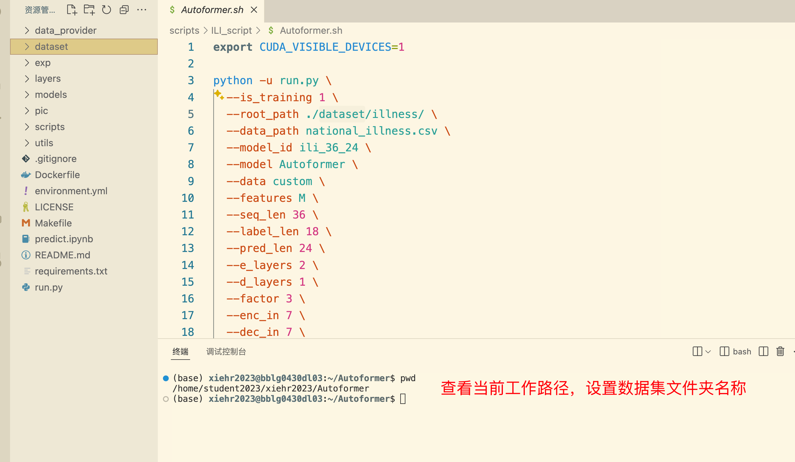
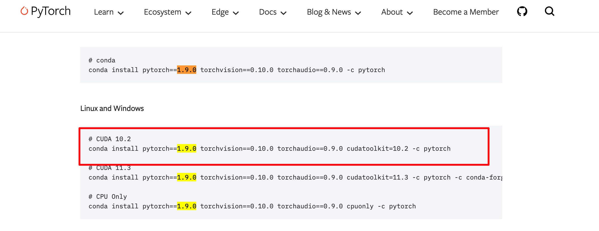

# Autoformer

## github 源码主页

Autoformer (NeurIPS 2021) 自动成型机 (NeurIPS 2021)

Autoformer: Decomposition Transformers with Auto-Correlation for Long-Term Series Forecasting
Autoformer：用于长期序列预测的具有自相关的分解变压器

Time series forecasting is a critical demand for real applications. Enlighted by the classic time series analysis and stochastic process theory, we propose the Autoformer as a general series forecasting model [[paper](https://arxiv.org/abs/2106.13008)]. **Autoformer goes beyond the Transformer family and achieves the series-wise connection for the first time.**
时间序列预测是实际应用的关键需求。受经典时间序列分析和随机过程理论的启发，我们提出了 Autoformer 作为通用序列预测模型 [[论文](https://arxiv.org/abs/2106.13008)]。Autoformer**超越了 Transformer 家族，首次实现了序列连接。**

In long-term forecasting, Autoformer achieves SOTA, with a **38% relative improvement** on six benchmarks, covering five practical applications: **energy, traffic, economics, weather and disease**.
在长期预测中，Autoformer 实现了 SOTA，在六个基准上**相对提升了 38%** ，涵盖了**能源、交通、经济、天气和疾病**五个实际应用。

**News** (2023.08) Autoformer has been included in [Hugging Face](https://huggingface.co/models?search=autoformer). See [blog](https://huggingface.co/blog/autoformer).
🚩**新闻**(2023.08) Autoformer 已包含在[Hugging Face](https://huggingface.co/models?search=autoformer)中。查看[博客](https://huggingface.co/blog/autoformer)。

🚩**News** (2023.06) The extension version of Autoformer ([Interpretable weather forecasting for worldwide stations with a unified deep model](https://www.nature.com/articles/s42256-023-00667-9)) has been published in Nature Machine Intelligence as the [Cover Article](https://www.nature.com/natmachintell/volumes/5/issues/6).
🚩**新闻**(2023.06) Autoformer 的扩展版本 ([使用统一深度模型为全球站点提供可解释的天气预报](https://www.nature.com/articles/s42256-023-00667-9)) 在《自然机器智能》杂志上作为[封面文章](https://www.nature.com/natmachintell/volumes/5/issues/6)发表。

🚩**News** (2023.02) Autoformer has been included in our [[Time-Series-Library\]](https://github.com/thuml/Time-Series-Library), which covers long- and short-term forecasting, imputation, anomaly detection, and classification.
🚩**新闻**(2023.02) Autoformer 已包含在我们的[[时间序列库\]](https://github.com/thuml/Time-Series-Library)中，它涵盖长期和短期预测、归纳、异常检测和分类。

🚩**News** (2022.02-2022.03) Autoformer has been deployed in [2022 Winter Olympics](https://en.wikipedia.org/wiki/2022_Winter_Olympics) to provide weather forecasting for competition venues, including wind speed and temperature.
🚩**新闻**（2022.02-2022.03）Autoformer 已部署在[2022 年冬奥会，](https://en.wikipedia.org/wiki/2022_Winter_Olympics)为比赛场馆提供天气预报，包括风速、温度等。

## 准备

### git clone


克隆远程仓库的方法：

（1）HTTPS，在把本地仓库的代码 push 到远程仓库的时候，需要验证用户名和密码

（2）SSH，git 开头的是 SSH 协议，这种方式在推送的时候，不需要验证用户名和密码，但是需要在 github 上添加SSH公钥的配置（推荐）

（3）zip download

我这里使用了 SSH 配置：


服务器直接 git clone 是很慢。所以本地 git clone，然后再上传服务器。


本地下载好以后，使用 FileZilla上传到远程服务器


down到本地以后，删除 .git文件，取消连接着远程仓库


### readme

下载数据集

设置数据集路径



### 调试配置

新建配置文件


修改配置文件

 

修改配置文件

```
        {
            "name": "Autoformer",
            "type": "python",
            "request": "attach",
            "connect": {
                "host": "localhost",
                "port": 5997
            }
        },
```

修改 sh 文件

```
python -m debugpy --listen 5997 --wait-for-client run.py \
```

### 新建 python 虚拟环境

本实验所需要的实验环境

> Install Python 3.6, PyTorch 1.9.0.

参考命令

```
conda create -n dave python==3.8
conda activate dave
conda install pytorch==2.1.2 torchvision==0.16.2 torchaudio==2.1.2 pytorch-cuda=11.8 -c pytorch -c nvidia
conda install numpy
conda install scikit-image
conda install scikit-learn
conda install tqdm
conda install pycocotools
```

激活、退出：

```
# To activate this environment, use               
#     $ conda activate Autoformer
#
# To deactivate an active environment, use
#
#     $ conda deactivate
```

用 requirements.txt 安装需要的库

```
conda create -n SegRNN python=3.8
conda activate SegRNN
pip install -r requirements.txt
```

启动 sh 文件：

```
sh run_main.sh
```

**适用于本实验的所有命令 :**

```
conda create -n Autoformer python=3.6
conda activate Autoformer
```

[pytorch 官网](https://pytorch.org/)查看所需命令

 



```
conda install pytorch==1.9.0 torchvision==0.10.0 torchaudio==0.9.0 cudatoolkit=10.2 -c pytorch
```

### requirements

```
pip install -r requirements.txt
```

或者：

```
conda create -n Autoformer python=3.6
conda activate Autoformer
conda install pytorch==1.9.0 torchvision==0.10.0 torchaudio==0.9.0 cudatoolkit=10.2 -c pytorch
conda install pandas
conda install scikit-learn
conda install debugpy
conda install matplotlib
conda install reformer_pytorch
```

配置好以后，成功进入调试：

  

## 开始调试

代码相似度极高。

**Autoformer init：36（18）-》24**


setting:

```
ili_36_24_Autoformer_custom_ftM_sl36_ll18_pl24_dm512_nh8_el2_dl1_df2048_fc3_ebtimeF_dtTrue_Exp_0
```

model_id  36 预测 24 步长（label=18）、AutoFormer 模型，自定义数据集，预测多变量，输入序列 36，标签序列 18，预测序列 24，嵌入维度 512，注意力头数 8，2层编码层，1 层解码层，

```
df2048_fc3_ebtimeF_dtTrue_Exp_0
         		args.d_ff,
                args.factor,
                args.embed,
                args.distil,
                args.des, ii)
```

**Autoformer model**

```python
Model(
  (decomp): series_decomp(
    (moving_avg): moving_avg(
      (avg): AvgPool1d(kernel_size=(25,), stride=(1,), padding=(0,))
    )
  )
  (enc_embedding): DataEmbedding_wo_pos(
    (value_embedding): TokenEmbedding(
      (tokenConv): Conv1d(7, 512, kernel_size=(3,), stride=(1,), padding=(1,), bias=False, padding_mode=circular)
    )
    (position_embedding): PositionalEmbedding()
    (temporal_embedding): TimeFeatureEmbedding(
      (embed): Linear(in_features=4, out_features=512, bias=False)
    )
    (dropout): Dropout(p=0.05, inplace=False)
  )
  (dec_embedding): DataEmbedding_wo_pos(
    (value_embedding): TokenEmbedding(
      (tokenConv): Conv1d(7, 512, kernel_size=(3,), stride=(1,), padding=(1,), bias=False, padding_mode=circular)
    )
    (position_embedding): PositionalEmbedding()
    (temporal_embedding): TimeFeatureEmbedding(
      (embed): Linear(in_features=4, out_features=512, bias=False)
    )
    (dropout): Dropout(p=0.05, inplace=False)
  )
  (encoder): Encoder(
    (attn_layers): ModuleList(
      (0): EncoderLayer(
        (attention): AutoCorrelationLayer(
          (inner_correlation): AutoCorrelation(
            (dropout): Dropout(p=0.05, inplace=False)
          )
          (query_projection): Linear(in_features=512, out_features=512, bias=True)
          (key_projection): Linear(in_features=512, out_features=512, bias=True)
          (value_projection): Linear(in_features=512, out_features=512, bias=True)
          (out_projection): Linear(in_features=512, out_features=512, bias=True)
        )
        (conv1): Conv1d(512, 2048, kernel_size=(1,), stride=(1,), bias=False)
        (conv2): Conv1d(2048, 512, kernel_size=(1,), stride=(1,), bias=False)
        (decomp1): series_decomp(
          (moving_avg): moving_avg(
            (avg): AvgPool1d(kernel_size=(25,), stride=(1,), padding=(0,))
          )
        )
        (decomp2): series_decomp(
          (moving_avg): moving_avg(
            (avg): AvgPool1d(kernel_size=(25,), stride=(1,), padding=(0,))
          )
        )
        (dropout): Dropout(p=0.05, inplace=False)
      )
      (1): EncoderLayer(
        (attention): AutoCorrelationLayer(
          (inner_correlation): AutoCorrelation(
            (dropout): Dropout(p=0.05, inplace=False)
          )
          (query_projection): Linear(in_features=512, out_features=512, bias=True)
          (key_projection): Linear(in_features=512, out_features=512, bias=True)
          (value_projection): Linear(in_features=512, out_features=512, bias=True)
          (out_projection): Linear(in_features=512, out_features=512, bias=True)
        )
        (conv1): Conv1d(512, 2048, kernel_size=(1,), stride=(1,), bias=False)
        (conv2): Conv1d(2048, 512, kernel_size=(1,), stride=(1,), bias=False)
        (decomp1): series_decomp(
          (moving_avg): moving_avg(
            (avg): AvgPool1d(kernel_size=(25,), stride=(1,), padding=(0,))
          )
        )
        (decomp2): series_decomp(
          (moving_avg): moving_avg(
            (avg): AvgPool1d(kernel_size=(25,), stride=(1,), padding=(0,))
          )
        )
        (dropout): Dropout(p=0.05, inplace=False)
      )
    )
    (norm): my_Layernorm(
      (layernorm): LayerNorm((512,), eps=1e-05, elementwise_affine=True)
    )
  )
  (decoder): Decoder(
    (layers): ModuleList(
      (0): DecoderLayer(
        (self_attention): AutoCorrelationLayer(
          (inner_correlation): AutoCorrelation(
            (dropout): Dropout(p=0.05, inplace=False)
          )
          (query_projection): Linear(in_features=512, out_features=512, bias=True)
          (key_projection): Linear(in_features=512, out_features=512, bias=True)
          (value_projection): Linear(in_features=512, out_features=512, bias=True)
          (out_projection): Linear(in_features=512, out_features=512, bias=True)
        )
        (cross_attention): AutoCorrelationLayer(
          (inner_correlation): AutoCorrelation(
            (dropout): Dropout(p=0.05, inplace=False)
          )
          (query_projection): Linear(in_features=512, out_features=512, bias=True)
          (key_projection): Linear(in_features=512, out_features=512, bias=True)
          (value_projection): Linear(in_features=512, out_features=512, bias=True)
          (out_projection): Linear(in_features=512, out_features=512, bias=True)
        )
        (conv1): Conv1d(512, 2048, kernel_size=(1,), stride=(1,), bias=False)
        (conv2): Conv1d(2048, 512, kernel_size=(1,), stride=(1,), bias=False)
        (decomp1): series_decomp(
          (moving_avg): moving_avg(
            (avg): AvgPool1d(kernel_size=(25,), stride=(1,), padding=(0,))
          )
        )
        (decomp2): series_decomp(
          (moving_avg): moving_avg(
            (avg): AvgPool1d(kernel_size=(25,), stride=(1,), padding=(0,))
          )
        )
        (decomp3): series_decomp(
          (moving_avg): moving_avg(
            (avg): AvgPool1d(kernel_size=(25,), stride=(1,), padding=(0,))
          )
        )
        (dropout): Dropout(p=0.05, inplace=False)
        (projection): Conv1d(512, 7, kernel_size=(3,), stride=(1,), padding=(1,), bias=False, padding_mode=circular)
      )
    )
    (norm): my_Layernorm(
      (layernorm): LayerNorm((512,), eps=1e-05, elementwise_affine=True)
    )
    (projection): Linear(in_features=512, out_features=7, bias=True)
  )
)
```


数据集的加载是完全一样的。

## forward 解读

1. **输入处理**：
   - 历史数据 x_enc [B, L, D]
   - 预测和标签数据 x_dec [B, L+P, D]
2. **时间序列分解**：
   - 将历史序列分解为季节性和趋势两个成分
3. **初始值准备**：
   - 趋势初始值：历史序列均值
   - 季节性初始值：全零张量
4. **解码器输入构建**：
   - 趋势输入：历史趋势末尾 + 趋势初始值
   - 季节性输入：历史季节性末尾 + 季节性初始值(零)
5. **编解码器处理**：
   - 编码器处理历史数据
   - 解码器利用编码器输出和组装的初始输入生成预测
6. **最终输出**：
   - 趋势和季节性预测相加
   - 提取末尾 pred_len 长度作为最终预测结果

这种设计体现了 Autoformer 的核心思想：将时间序列分解为不同频率成分并分别建模，再组合生成最终预测。

### 趋势项 和 季节项

```python
seasonal_init, trend_init = self.decomp(x_enc)
```

▶️

```python
self.decomp = series_decomp(kernel_size)
```

▶️

```python
class series_decomp(nn.Module):
```

🟢 类的定义

```python
class series_decomp(nn.Module):
    """
    Series decomposition block
    """
    def __init__(self, kernel_size):
        super(series_decomp, self).__init__()
        self.moving_avg = moving_avg(kernel_size, stride=1)

    def forward(self, x):

        # 计算移动平均，提取序列趋势分量
        # x 形状[B, L, D] -> moving_mean形状[B, L, D]
        #  moving_avg内部会进行填充，保证输出形状与输入相同
        moving_mean = self.moving_avg(x)

        # 通过原始序列减去趋势分量，得到残差(季节性分量)，逐元素减法操作
        # x形状[B, L, D] - moving_mean形状[B, L, D] -> res形状[B, L, D]
        res = x - moving_mean

        # 返回季节性分量和趋势分量，均保持原始形状[B, L, D]
        # 第一个返回值res是季节性分量，第二个返回值moving_mean是趋势分量
        return res, moving_mean
```

类内 调用 `moving_avg`


▶️

```python
class moving_avg(nn.Module):
```

🟢 `moving_avg` 定义

```python
class moving_avg(nn.Module):
    """
    Moving average block to highlight the trend of time series
    """
    def __init__(self, kernel_size, stride):
        super(moving_avg, self).__init__()
        self.kernel_size = kernel_size
        self.avg = nn.AvgPool1d(kernel_size=kernel_size, stride=stride, padding=0)

    def forward(self, x):
        # padding on the both ends of time series

        # 提取第一个时间步并重复，用于前端填充
        #  [B, L, D] -> [B, 1, D] -> [B, (kernel_size-1)//2, D]
        front = x[:, 0:1, :].repeat(1, (self.kernel_size - 1) // 2, 1) 

        # 提取最后一个时间步并重复，用于后端填充
        # [B, L, D] -> [B, 1, D] -> [B, (kernel_size-1)//2, D]
        end = x[:, -1:, :].repeat(1, (self.kernel_size - 1) // 2, 1)

        # 连接填充部分与原序列
        # [B, (k-1)//2, D] + [B, L, D] + [B, (k-1)//2, D] -> [B, L+(k-1), D]
        x = torch.cat([front, x, end], dim=1)

        # 转置并应用一维平均池化
        # [B, L+(k-1), D] -> [B, D, L+(k-1)] -> [B, D, L]
        # 池化窗口大小为kernel_size，步长为1，输出长度为(L+(k-1)-k+1)=L （length + 2P - K + 1）
        x = self.avg(x.permute(0, 2, 1))

        # 转置回原始维度顺序 [B, D, L] -> [B, L, D]
        x = x.permute(0, 2, 1)
        return x
```

总结：3 次调用：

```python
seasonal_init, trend_init = self.decomp(x_enc)

self.decomp = series_decomp(kernel_size)

class series_decomp(nn.Module):
    def __init__(self, kernel_size):
        super(series_decomp, self).__init__()
        self.moving_avg = moving_avg(kernel_size, stride=1)
        
    def forward(self, x):
        moving_mean = self.moving_avg(x)

class moving_avg(nn.Module):
     def forward(self, x):
        front = x[:, 0:1, :].repeat(1, (self.kernel_size - 1) // 2, 1) 
        end = x[:, -1:, :].repeat(1, (self.kernel_size - 1) // 2, 1)
        x = torch.cat([front, x, end], dim=1)
        x = self.avg(x.permute(0, 2, 1))
        x = x.permute(0, 2, 1)
        return x	
```


#### Autoformer序列分解流程图

```
                    输入: x_enc [B, L, D]
                          |
                          v
            +---------------------------+
            | Model.forward()           |
            | 调用: self.decomp(x_enc)  |
            +---------------------------+
                          |
                          v
            +---------------------------+
            | series_decomp(kernel_size)|
            | self.decomp实例           |
            +---------------------------+
                          |
                          v
            +---------------------------+
            | series_decomp.forward(x)  |
            | 1. 调用移动平均计算趋势   |
            | 2. 原序列减去趋势得到季节性|
            +---------------------------+
                          |
                  +-------+-------+
                  |               |
                  v               v
    +---------------------------+  +---------------------------+
    | moving_avg.forward(x)     |  | 季节性计算                |
    | 步骤:                     |  | res = x - moving_mean     |
    | 1.前后填充序列           |  |                           |
    | 2.应用平均池化           |  |                           |
    | 3.返回趋势分量           |  |                           |
    +---------------------------+  +---------------------------+
                  |               |
                  v               v
             趋势分量        季节性分量
          trend_init [B,L,D]  seasonal_init [B,L,D]
                  |               |
                  +       +       +
                          |
                          v
                返回到Model.forward()
                进行后续处理
```

1. **Model.forward()** 调用 self.decomp(x_enc)进行序列分解

2. **series_decomp.forward(x)**

   包含两个主要步骤:

   - 调用 self.moving_avg(x)计算移动平均，得到趋势分量
   - 计算原序列与趋势分量的差值，得到季节性分量

3. **moving_avg.forward(x)**

   执行移动平均计算:

   - 通过重复首尾元素进行序列填充
   - 应用一维平均池化操作
   - 返回平滑后的趋势分量

这个分解过程将原始序列 x_enc 分解为两个相同形状 [B,L,D] 的张量：趋势成分和季节性成分

### 编码器

目的：结合时间特征，将 数据特征嵌入到指定维度

```python
enc_out = self.enc_embedding(x_enc, x_mark_enc)
```


```python
self.enc_embedding = DataEmbedding_wo_pos(configs.enc_in, configs.d_model, configs.embed, configs.freq,configs.dropout)
```


**流程图**

```python
输入:
x_enc [B, L, D]        x_mark_enc [B, L, time_features]
    |                        |
    v                        v
+-----------------------------------------------+
|           Model.forward()调用                  |
|      self.enc_embedding(x_enc, x_mark_enc)    |
+-----------------------------------------------+
            |                |
            v                v
+------------------------+  +---------------------------+
| TokenEmbedding (值嵌入) |  | TemporalEmbedding (时间嵌入)|
+------------------------+  +---------------------------+
| 输入: x [B, L, D]      |  | 输入: x_mark [B, L, time_f]|
|                        |  |                           |
| 操作:                  |  | 操作:                     |
| 1.转置: [B, D, L]      |  | 1.转换为long类型          |
| 2.1D卷积: D -> d_model |  | 2.提取时间特征:           |
| 3.转置回: [B, L, d_model]|  |   - month_x (x[:,:,0])   |
|                        |  |   - day_x (x[:,:,1])      |
| 输出: [B, L, d_model]  |  |   - weekday_x (x[:,:,2])  |
|                        |  |   - hour_x (x[:,:,3])     |
+------------------------+  |   - minute_x (可选)       |
            |               |                           |
            |               | 3.查表获取各时间特征的嵌入  |
            |               | 4.将所有时间嵌入相加       |
            |               |                           |
            |               | 输出: [B, L, d_model]     |
            |               +---------------------------+
            |                        |
            +------------+------------+
                         v
            +---------------------------+
            | 相加并应用Dropout         |
            | value_emb + temporal_emb |
            +---------------------------+
                         |
                         v
                  输出: enc_out
                 [B, L, d_model]
```


1. **值嵌入 (TokenEmbedding)**:
   - 通过卷积操作将原始特征 [B, L, D] 映射到更高维度表示 [B, L, d_model]
   - 使用循环填充的1D卷积捕获局部特征模式
2. **时间嵌入 (TemporalEmbedding)**:
   - 将时间标记 [B, L, time_features] 转换为 [B, L, d_model] 的嵌入向量
   - 分别为月、日、星期、小时等时间特征查表获取嵌入，然后相加
   - 时间嵌入帮助模型识别时间模式(季节性、每日/每周周期等)
3. **组合嵌入**:
   - 将值嵌入和时间嵌入相加，形成最终编码器输入 [B, L, d_model]
   - 注意此版本不包含位置嵌入(DataEmbedding_wo_pos)

这种多重嵌入方式使模型能同时利用时间序列的值信息和时间特征信息，为后续的注意力机制和时间序列建模提供丰富的上下文。

## 模型定义


### 嵌入部分


### 编码器 解码器部分


## 训练过程，形状变换

（1）

代码：


逐字讲解：

model 训练从 exp_main.py的 train 函数开始，epoch 表示整个训练集迭代几次，for batchx、batchy、batch x mark、batch y mark 一个批次一个批次的训练，第一个 for 训练的 epoch 是我们自己可以设置的，第二个 for 训练的 iteration 迭代次数是 `数据集长度 ➗ batch size`

接下来，调用 `self._predict` 方法进行预测，这里 predict 函数需要的参数 batchx、batchy、batch x mark、batch y mark 形状分别是 `batch_x = [32,36,7], batch_y = [32,42(18+24),7],batch_x_mark=[32,36,4],batch_y_mark = [32,42,4]`

32 表示 一个 batch 样本的个数；

36 表示每个样本的时间步，也可以说是回溯窗口的大小，或者叫输入序列的长度

7 表示 illness 数据集的特征数

batchy 的 42 表示 18 的 label length，是取的 原始输入序列的 二分之一，这个在论文中有说


编码器的输入 是 `I times d`  $I$ 表示 输入序列长度，在这里例子就是 36，$d$ 是特征数，这里的特征数，都去掉了时间戳，也就是 7

解码器的输入是 `二分之 I + O`，`二分之 I `表示 输入序列长度的一半，`O` 表示预测步长，也就是输出序列的长度

batch x mark，batch y mark 就是处理的时间戳特征了，包含一天的第几个小时，一个月的第几天，一周的第几天，一个月的第几天，就是我们之前讲过的 SegRNN，这里处理还涉及了 归一化 和中心化，不再重复啦。

好了，接下来进入 预测部分，也就是 predict 函数