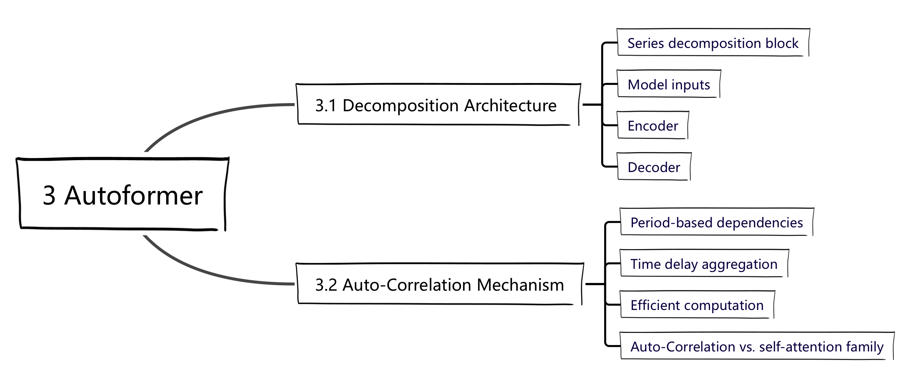
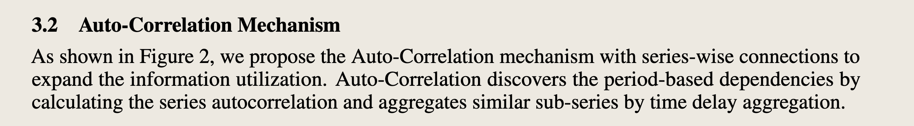
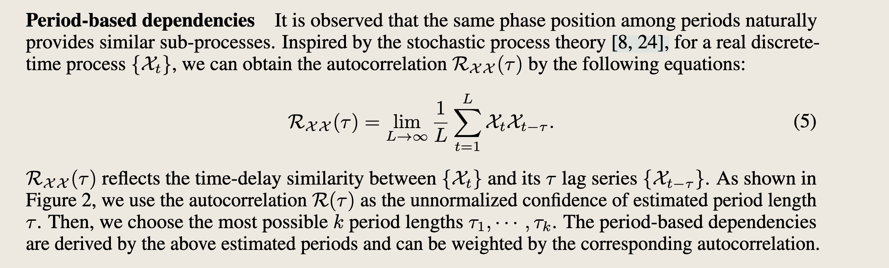
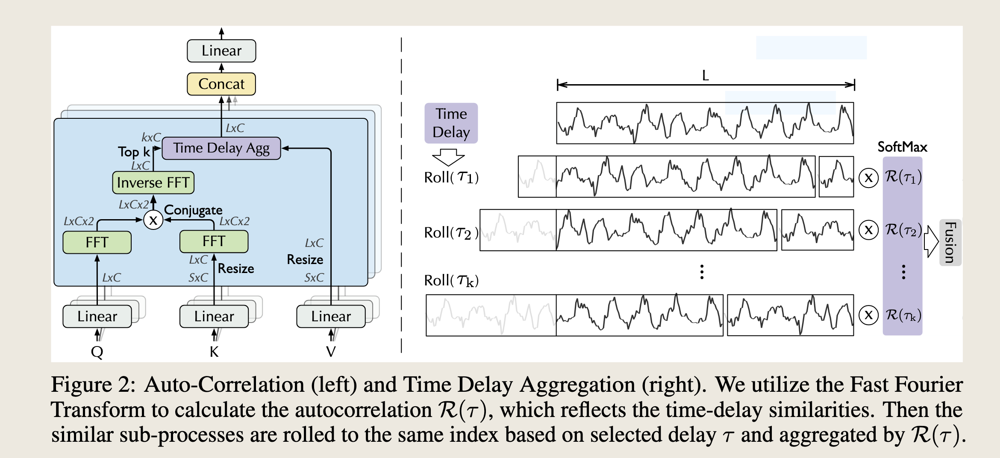
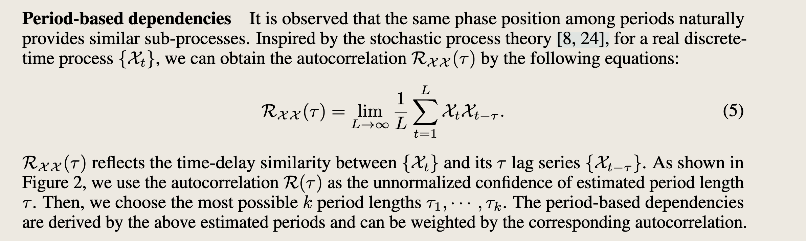

# (续) Autoformer

> 论文、公式、图、代码

**（0）回顾**

首先，进入原文自相关机制的部分，仔细观察原文，原文3.1的标题是分解架构，并由此展开序列分解模块、模型输入、编码器、解码器部分。这是十分合理的，因为本文的一个突出亮点就是将时间序列分解成高频的季节成分和低频的趋势成分，在编码器中的每层中的注意力和前馈网之后都进行了序列分解，使得高频成分逐层提取。在解码器中，每层中的自注意力、交叉注意力、前馈网以后，同样进行了序列分解，层内传递季节成分，趋势成分进行累加，所以第一部分的标题叫做序列分解。也是一个突出创新。

**(0-0) Autoformer部分的原文组织形式**

  

接下来进行第二个突出创新，改进原始Transformer 的注意力机制的计算。

**（1）自相关机制**



本文提出了 逐序列连接的自相关机制 来进行信息聚合。

自相关 通过计算序列的相关关系 发现 周期间的依赖关系，并且通过时间延迟聚合 聚合 相似的子序列

关键点：①自相关机制发现周期性的依赖关系 ② time delay aggregation 这里的 aggregate 聚合的是 模式相同的子序列。

**（2）基于周期的依赖关系**

 

 周期中，相同相位位置提供了相似的子过程

受随机过程理论的启发，对于真实的离散时间序列 $\{\mathcal{X}_t\}$ ，通过以下公式获得自相关关系 $\mathcal{R}_{\mathcal{XX}}(\mathcal{T})$ ：

$\mathcal{R}_{\mathcal{XX}}(\mathcal{T}) = \lim _{L \rightarrow \infty } \frac{1}{L} \sum_{t=1}^{L} \mathcal{X}_t \mathcal{X}_{t-\mathcal{T}}$

- $\mathcal{R}_{\mathcal{XX}}(\mathcal{T})$ 反映的是 $\{\mathcal{X}_t \}$  与 其 $\mathcal{T}$ 滞后序列 $\{\mathcal{X}_{t-\mathcal{T}}\}$ 之间的时间延迟相似性。 
-  我：$\mathcal{T}$  表示延迟时间步；$\mathcal{R}_{\mathcal{XX}}(\mathcal{T})$ 就是自相关系数

如图 2 所示，使用自相关系数 $\mathcal{R}_{\mathcal{XX}}(\mathcal{T})$ 作为估计周期长度 $\mathcal{T}$的置信度。（这里说准确的说法是 未归一化的置信度）

然后，选择$k$ 个最有可能的周期长度 $\mathcal{T}_1,.....,\mathcal{T}_k$

基于周期的依赖关系就是从这 $k$ 个最有可能的周期长度中导出，并且通过相应的自相关进行加权。

（3）原文图 2 



（3-1）多头注意力机制的维度转换

```python
BLD->BLHd->BHLd   \

					BHLS

BSD->BSHd->BHSd   /
```

首先，说明原始多头注意力机制，QKV 的构造，标准多头注意力机制的输入是 BLD→BLHd→BHLd（view 以后 permute）（ps，这里线性层的目的是将原始维度嵌入到 H*d?不管，不影响理解，后面再说）

```python
q = self.q_proj(q).view(batch_size, sequence_length, self.num_heads, self.head_dim).transpose(1, 2)

k = self.k_proj(k).view(batch_size, sequence_length, self.num_heads, self.head_dim).transpose(1, 2)

v = self.v_proj(v).view(batch_size, sequence_length, self.num_heads, self.head_dim).transpose(1, 2)
```

看到我们项目的代码

**🖇️ 当前位置：AutoCorrelation  forward**

首先是获取一些维度信息

**🖇️ 源码：保留查询向量的 B、L、H、E**

- [x] 问题：为什么标准多头注意力的输入是 BHLd 的，这里确实 BLHd 的，这里少了一步呀

> 是的。确实少了一步，只进行了 view，没有 transpose
>
> 答案在 AutoCorrelationLayer 的 forward 中，qkv 的处理。
>
> ```python
> queries = self.query_projection(queries).view(B, L, H, -1)
> keys = self.key_projection(keys).view(B, S, H, -1)
> values = self.value_projection(values).view(B, S, H, -1)
> ```
>
> 补充，这里的qkv 的建模`nn.Linear`是将 原始 `d_model`，嵌入到 `d_keys * n_heads` 

**🖇️ 源码：保留值向量的序列长度S和嵌入维度D**

> 蒽，一般 Transformer 也是分开查询向量和值向量的序列长度。Q 和 K 的向量长度可以不一致，但是嵌入维度必须是一致的。并且生成的 attn 的形状是 `BHLS` 的（`查询向量长度 × 值向量长度`）

- 🟢 源码：**接下来，一个序列对齐操作，标准对准查询序列**

⏩️ 如果查询时间步步长 > 键和值的时间步步长；处理键序列和值序列长度和查询序列长度对齐，键序列和值序列不够长的部分，填充 0

⏩️ 如果查询序列断了，截断键序列和值序列多的部分

```python
if L > S: 
    zeros = torch.zeros_like(queries[:, :(L - S), :]).float()
    values = torch.cat([values, zeros], dim=1)
    keys = torch.cat([keys, zeros], dim=1)
else:
    values = values[:, :L, :, :]
    keys = keys[:, :L, :, :]
```

> 强调，为什么这里处理的是 dim1，理由因为之前说过了，多头注意力机制传进来的 QKV，没有进行 transpose，所以数据格式是`[BLHd]`的

**源码讲解：** 

```python
# period-based dependencies

q_fft = torch.fft.rfft(queries.permute(0, 2, 3, 1).contiguous(), dim=-1)

k_fft = torch.fft.rfft(keys.permute(0, 2, 3, 1).contiguous(), dim=-1)

res = q_fft * torch.conj(k_fft)

corr = torch.fft.irfft(res, n=L, dim=-1)
```

**该部分是原论文，官方注释给的** 



现在看代码是怎么和论文对应的


