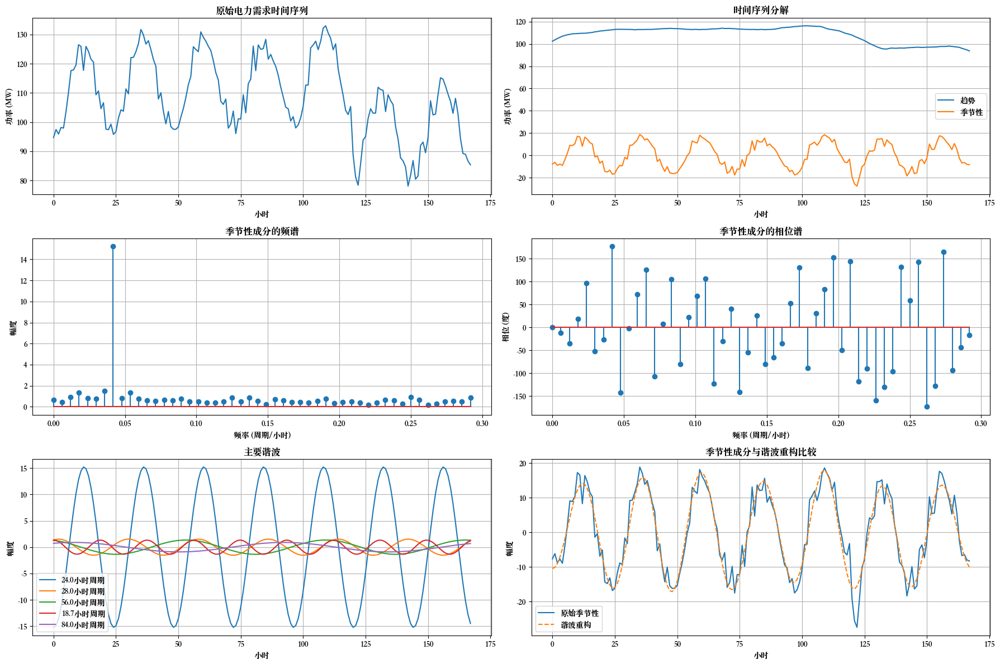

# AutoFormer 可视化结果

用一段代码演示 Autoformer 的过程，序列分解做的事：



还有对应的幅度谱、相位谱分解结果：

```python
主要谐波:
- 周期: 24.0小时, 幅度: 15.27, 相位: 175.7°
- 周期: 28.0小时, 幅度: 1.74, 相位: -5.5°
- 周期: 56.0小时, 幅度: 1.29, 相位: 19.1°
- 周期: 12.9小时, 幅度: 1.12, 相位: 32.7°
- 周期: 9.9小时, 幅度: 1.10, 相位: 25.4°
```

## 模拟数据

首先，创建一个模拟的一周电力需求数据，包括长期趋势、日内变化、工作日与周末变化以及噪声。

24×7=168小时


$$
 \text{power\_demand}(t) = \text{trend}(t) + \text{daily}(t) + \text{weekly}(t) + \text{noise}(t) 
$$


其中：

将长期趋势、日内变化、工作日与周末变化以及噪声叠加在一起，生成一个模拟的一周电力需求数据
$$
\text{trend}(t) = 100 + 0.05 \cdot t
$$

长期趋势是一个线性增长的趋势，初始值为 100，每小时增加 0.05。

$$
\text{daily}(t) = 15 \cdot \sin\left(\frac{2\pi t}{24} - \frac{\pi}{2}\right)
$$

日内变化： 24 小时周期的正弦波，幅度为 15，相位偏移为 -π/2。

$$
\text{weekly}(t) = \begin{cases} 10 & \text{if } t \mod 168 < 120 \ -10 & \text{if } t \mod 168 \geq 120 \end{cases}
$$

工作日与周末变化：（公司用电量）一个每周周期的变化，工作日增加 10，周末减少 10

关于这里为什么对 120 取余数：

> - t % 168 计算时间 t 在一周内的小时数（取余数）。
> - t % 168 < 120表示前 5 天的小时数（5 天 * 24 小时 = 120 小时），对应工作日。
> - t % 168 >= 120表示后 2 天的小时数（168 小时 - 120 小时 = 48 小时），对应周末。

$$
 \text{noise}(t) = \text{随机噪声，均值为0，标准差为3} 
$$


```python
hours = np.arange(168)
# 创建长期趋势
trend = 100 + 0.05 * hours
# 创建日内变化 (24小时周期)
daily = 15 * np.sin(2*np.pi*hours/24 - np.pi/2)
# 创建工作日vs周末变化 (一周周期)
weekly = np.zeros_like(hours)
for i in range(7):
    if i < 5:  # 工作日
        weekly[i*24:(i+1)*24] = 10
    else:      # 周末
        weekly[i*24:(i+1)*24] = -10
# 添加一些噪声
noise = 3 * np.random.randn(168)
```

## 结果分析

```python
主要谐波:
- 周期: 24.0小时, 幅度: 15.27, 相位: 175.7°
- 周期: 28.0小时, 幅度: 1.74, 相位: -5.5°
- 周期: 56.0小时, 幅度: 1.29, 相位: 19.1°
- 周期: 12.9小时, 幅度: 1.12, 相位: 32.7°
- 周期: 9.9小时, 幅度: 1.10, 相位: 25.4°
```

