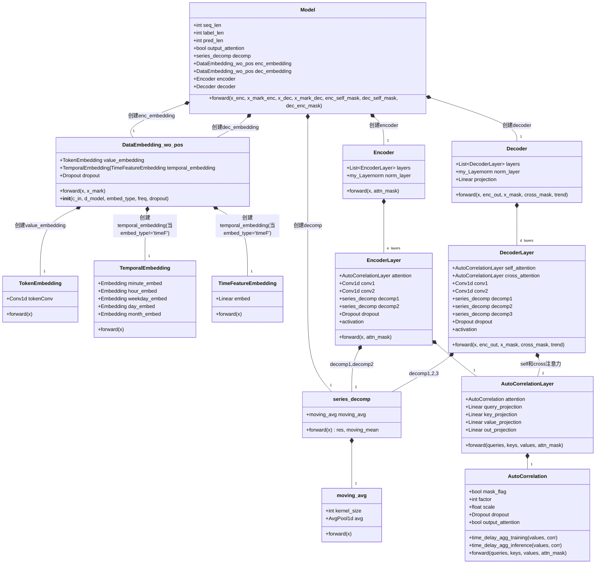
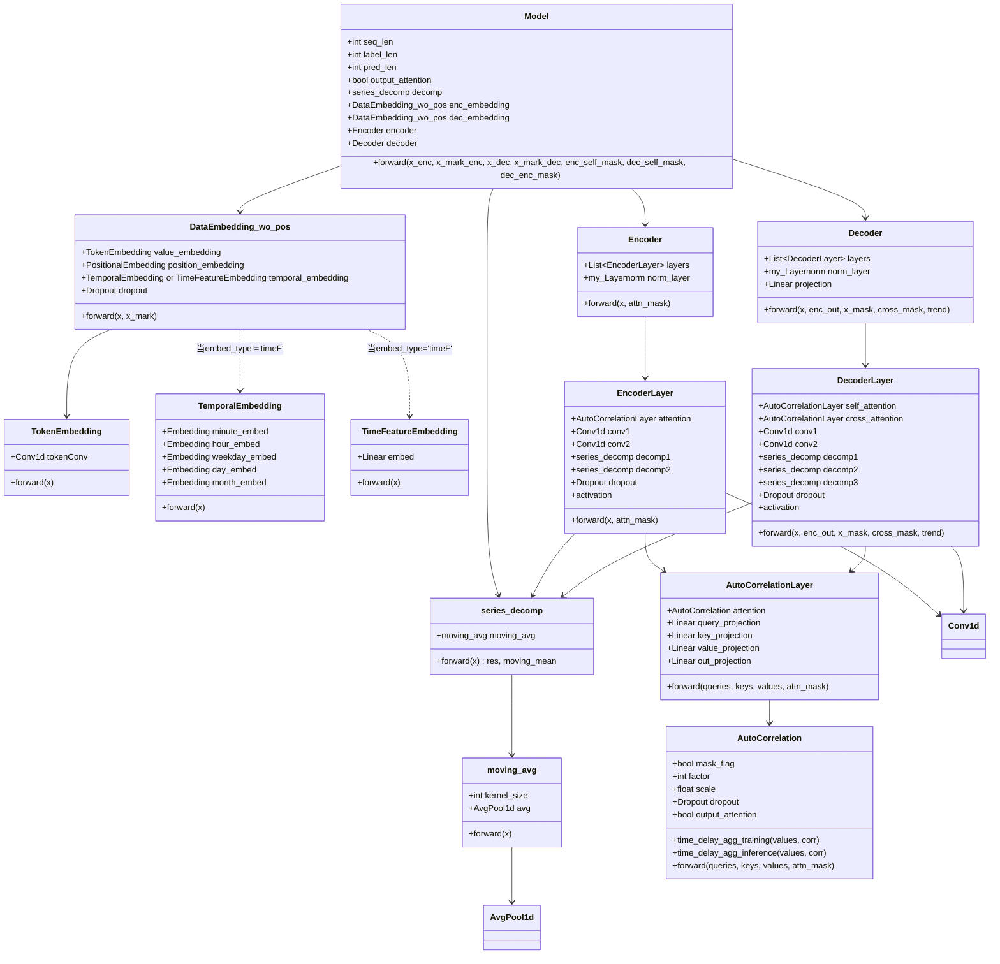
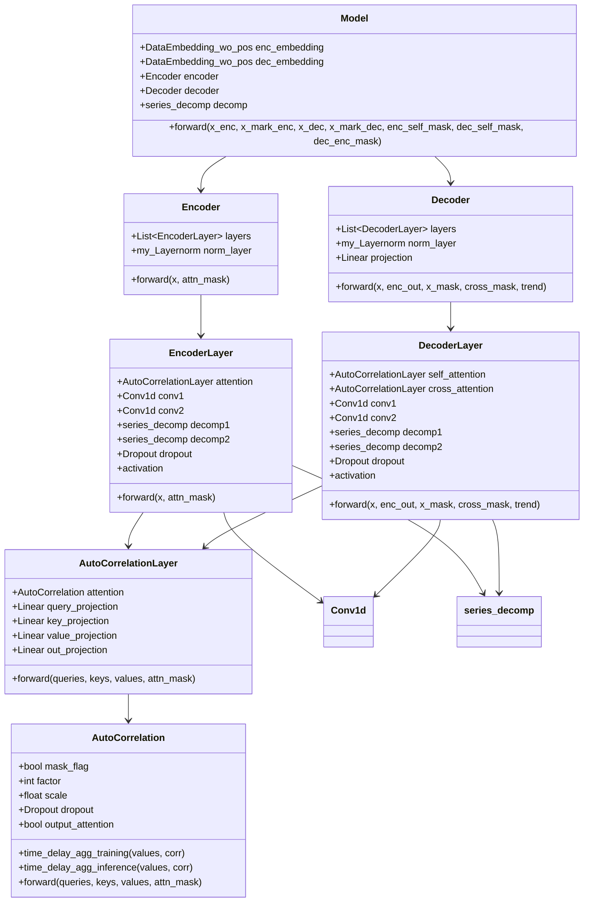
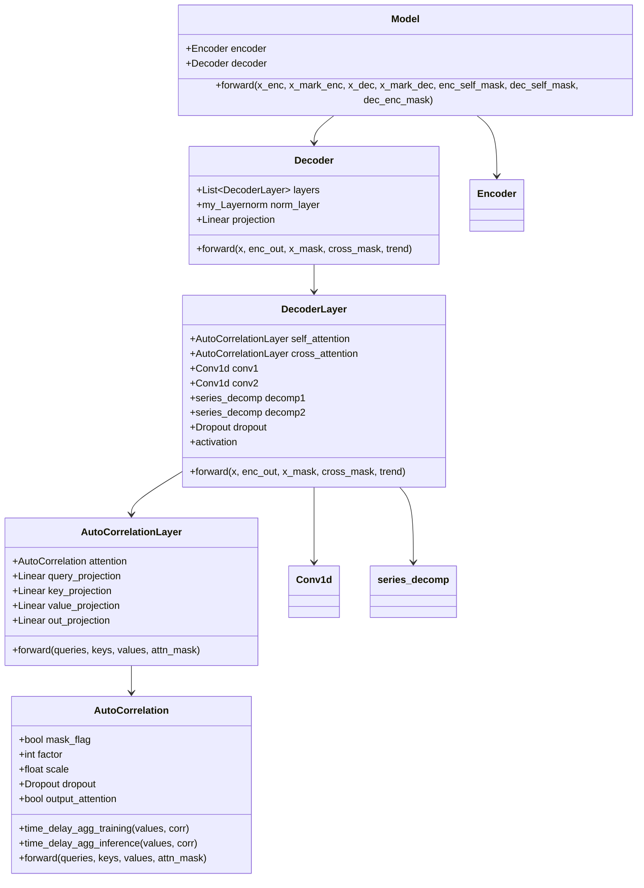

# 汇总复现调用图

## Autoformer

1

```mermaid
classDiagram
    class Model {
        +int seq_len
        +int label_len
        +int pred_len
        +bool output_attention
        +series_decomp decomp
        +DataEmbedding_wo_pos enc_embedding
        +DataEmbedding_wo_pos dec_embedding
        +Encoder encoder
        +Decoder decoder
        +forward(x_enc, x_mark_enc, x_dec, x_mark_dec, enc_self_mask, dec_self_mask, dec_enc_mask)
    }
    
    class series_decomp {
        +moving_avg moving_avg
        +forward(x) res, moving_mean
    }
    
    class moving_avg {
        +int kernel_size
        +AvgPool1d avg
        +forward(x)
    }
    
    class DataEmbedding_wo_pos {
        +TokenEmbedding value_embedding
        +TemporalEmbedding|TimeFeatureEmbedding temporal_embedding
        +Dropout dropout
        +forward(x, x_mark)
        +__init__(c_in, d_model, embed_type, freq, dropout)
    }
    
    class TokenEmbedding {
        +Conv1d tokenConv
        +forward(x)
    }
    
    class TemporalEmbedding {
        +Embedding minute_embed
        +Embedding hour_embed
        +Embedding weekday_embed
        +Embedding day_embed
        +Embedding month_embed
        +forward(x)
    }
    
    class TimeFeatureEmbedding {
        +Linear embed
        +forward(x)
    }
    
    class Encoder {
        +List~EncoderLayer~ layers
        +my_Layernorm norm_layer
        +forward(x, attn_mask)
    }
    
    class EncoderLayer {
        +AutoCorrelationLayer attention
        +Conv1d conv1
        +Conv1d conv2
        +series_decomp decomp1
        +series_decomp decomp2
        +Dropout dropout
        +activation
        +forward(x, attn_mask)
    }
    
    class AutoCorrelationLayer {
        +AutoCorrelation attention
        +Linear query_projection
        +Linear key_projection
        +Linear value_projection
        +Linear out_projection
        +forward(queries, keys, values, attn_mask)
    }
    
    class AutoCorrelation {
        +bool mask_flag
        +int factor
        +float scale
        +Dropout dropout
        +bool output_attention
        +time_delay_agg_training(values, corr)
        +time_delay_agg_inference(values, corr)
        +forward(queries, keys, values, attn_mask)
    }
    
    class Decoder {
        +List~DecoderLayer~ layers
        +my_Layernorm norm_layer
        +Linear projection
        +forward(x, enc_out, x_mask, cross_mask, trend)
    }
    
    class DecoderLayer {
        +AutoCorrelationLayer self_attention
        +AutoCorrelationLayer cross_attention
        +Conv1d conv1
        +Conv1d conv2
        +series_decomp decomp1
        +series_decomp decomp2
        +series_decomp decomp3
        +Dropout dropout
        +activation
        +forward(x, enc_out, x_mask, cross_mask, trend)
    }
    
    %% Model中的组件实例化关系
    Model *-- "1" series_decomp : 创建decomp
    Model *-- "1" DataEmbedding_wo_pos : 创建enc_embedding
    Model *-- "1" DataEmbedding_wo_pos : 创建dec_embedding
    Model *-- "1" Encoder : 创建encoder
    Model *-- "1" Decoder : 创建decoder
    
    %% DataEmbedding_wo_pos内部组件
    DataEmbedding_wo_pos *-- "1" TokenEmbedding : 创建value_embedding
    DataEmbedding_wo_pos *-- "1" TemporalEmbedding : 创建temporal_embedding(当embed_type!='timeF')
    DataEmbedding_wo_pos *-- "1" TimeFeatureEmbedding : 创建temporal_embedding(当embed_type='timeF')
    
    %% 其他组件关系
    series_decomp *-- "1" moving_avg
    Encoder *-- "e_layers" EncoderLayer
    EncoderLayer *-- "1" AutoCorrelationLayer
    EncoderLayer *-- "2" series_decomp : decomp1,decomp2
    AutoCorrelationLayer *-- "1" AutoCorrelation
    Decoder *-- "d_layers" DecoderLayer
    DecoderLayer *-- "2" AutoCorrelationLayer : self和cross注意力
    DecoderLayer *-- "3" series_decomp : decomp1,2,3
```

2

```mermaid
classDiagram
    class Model {
        +int seq_len
        +int label_len
        +int pred_len
        +bool output_attention
        +series_decomp decomp
        +DataEmbedding_wo_pos enc_embedding
        +DataEmbedding_wo_pos dec_embedding
        +Encoder encoder
        +Decoder decoder
        +forward(x_enc, x_mark_enc, x_dec, x_mark_dec, enc_self_mask, dec_self_mask, dec_enc_mask)
    }
    
    class series_decomp {
        +moving_avg moving_avg
        +forward(x) res, moving_mean
    }
    
    class moving_avg {
        +int kernel_size
        +AvgPool1d avg
        +forward(x)
    }
    
    class DataEmbedding_wo_pos {
        +TokenEmbedding value_embedding
        +PositionalEmbedding position_embedding
        +TemporalEmbedding or TimeFeatureEmbedding temporal_embedding  
        +Dropout dropout
        +forward(x, x_mark)
    }
    
    class TokenEmbedding {
        +Conv1d tokenConv
        +forward(x)
    }
    
    class TemporalEmbedding {
        +Embedding minute_embed
        +Embedding hour_embed
        +Embedding weekday_embed
        +Embedding day_embed
        +Embedding month_embed
        +forward(x)
    }
    
    class TimeFeatureEmbedding {
        +Linear embed
        +forward(x)
    }
    
    class Encoder {
        +List~EncoderLayer~ layers
        +my_Layernorm norm_layer
        +forward(x, attn_mask)
    }
    
    class EncoderLayer {
        +AutoCorrelationLayer attention
        +Conv1d conv1
        +Conv1d conv2
        +series_decomp decomp1
        +series_decomp decomp2
        +Dropout dropout
        +activation
        +forward(x, attn_mask)
    }
    
    class AutoCorrelationLayer {
        +AutoCorrelation attention
        +Linear query_projection
        +Linear key_projection
        +Linear value_projection
        +Linear out_projection
        +forward(queries, keys, values, attn_mask)
    }
    
    class AutoCorrelation {
        +bool mask_flag
        +int factor
        +float scale
        +Dropout dropout
        +bool output_attention
        +time_delay_agg_training(values, corr)
        +time_delay_agg_inference(values, corr)
        +forward(queries, keys, values, attn_mask)
    }
    
    class Decoder {
        +List~DecoderLayer~ layers
        +my_Layernorm norm_layer
        +Linear projection
        +forward(x, enc_out, x_mask, cross_mask, trend)
    }
    
    class DecoderLayer {
        +AutoCorrelationLayer self_attention
        +AutoCorrelationLayer cross_attention
        +Conv1d conv1
        +Conv1d conv2
        +series_decomp decomp1
        +series_decomp decomp2
        +series_decomp decomp3
        +Dropout dropout
        +activation
        +forward(x, enc_out, x_mask, cross_mask, trend)
    }
    
    %% 核心组件关系
    Model --> series_decomp
    Model --> DataEmbedding_wo_pos
    Model --> Encoder
    Model --> Decoder
    
    %% 嵌入层关系 - 修正为条件关系
    DataEmbedding_wo_pos --> TokenEmbedding
    DataEmbedding_wo_pos ..> TemporalEmbedding : 当embed_type!='timeF'
    DataEmbedding_wo_pos ..> TimeFeatureEmbedding : 当embed_type='timeF'
    
    %% 编码器组件关系
    Encoder --> EncoderLayer
    EncoderLayer --> AutoCorrelationLayer
    EncoderLayer --> Conv1d
    EncoderLayer --> series_decomp
    AutoCorrelationLayer --> AutoCorrelation
    
    %% 解码器组件关系
    Decoder --> DecoderLayer
    DecoderLayer --> AutoCorrelationLayer
    DecoderLayer --> Conv1d
    DecoderLayer --> series_decomp
    
    %% 序列分解关系
    series_decomp --> moving_avg
    moving_avg --> AvgPool1d
```

### Encoder&Decoder

```mermaid
classDiagram
    class Model {
        +DataEmbedding_wo_pos enc_embedding
        +DataEmbedding_wo_pos dec_embedding
        +Encoder encoder
        +Decoder decoder
        +series_decomp decomp
        +forward(x_enc, x_mark_enc, x_dec, x_mark_dec, enc_self_mask, dec_self_mask, dec_enc_mask)
    }
    
    class Encoder {
        +List~EncoderLayer~ layers
        +my_Layernorm norm_layer
        +forward(x, attn_mask)
    }
    
    class EncoderLayer {
        +AutoCorrelationLayer attention
        +Conv1d conv1
        +Conv1d conv2
        +series_decomp decomp1
        +series_decomp decomp2
        +Dropout dropout
        +activation
        +forward(x, attn_mask)
    }
    
    class AutoCorrelationLayer {
        +AutoCorrelation attention
        +Linear query_projection
        +Linear key_projection
        +Linear value_projection
        +Linear out_projection
        +forward(queries, keys, values, attn_mask)
    }
    
    class AutoCorrelation {
        +bool mask_flag
        +int factor
        +float scale
        +Dropout dropout
        +bool output_attention
        +time_delay_agg_training(values, corr)
        +time_delay_agg_inference(values, corr)
        +forward(queries, keys, values, attn_mask)
    }
    
    class Decoder {
        +List~DecoderLayer~ layers
        +my_Layernorm norm_layer
        +Linear projection
        +forward(x, enc_out, x_mask, cross_mask, trend)
    }
    
    class DecoderLayer {
        +AutoCorrelationLayer self_attention
        +AutoCorrelationLayer cross_attention
        +Conv1d conv1
        +Conv1d conv2
        +series_decomp decomp1
        +series_decomp decomp2
        +Dropout dropout
        +activation
        +forward(x, enc_out, x_mask, cross_mask, trend)
    }
    
    Model --> Encoder
    Model --> Decoder
    Encoder --> EncoderLayer
    EncoderLayer --> AutoCorrelationLayer
    EncoderLayer --> Conv1d
    EncoderLayer --> series_decomp
    AutoCorrelationLayer --> AutoCorrelation
    Decoder --> DecoderLayer
    DecoderLayer --> AutoCorrelationLayer
    DecoderLayer --> Conv1d
    DecoderLayer --> series_decomp
```

### 放大 Decoder

```mermaid
classDiagram
    class Model {
        +Encoder encoder
        +Decoder decoder
        +forward(x_enc, x_mark_enc, x_dec, x_mark_dec, enc_self_mask, dec_self_mask, dec_enc_mask)
    }
    
    class Decoder {
        +List~DecoderLayer~ layers
        +my_Layernorm norm_layer
        +Linear projection
        +forward(x, enc_out, x_mask, cross_mask, trend)
    }
    
    class DecoderLayer {
        +AutoCorrelationLayer self_attention
        +AutoCorrelationLayer cross_attention
        +Conv1d conv1
        +Conv1d conv2
        +series_decomp decomp1
        +series_decomp decomp2
        +Dropout dropout
        +activation
        +forward(x, enc_out, x_mask, cross_mask, trend)
    }
    
    class AutoCorrelationLayer {
        +AutoCorrelation attention
        +Linear query_projection
        +Linear key_projection
        +Linear value_projection
        +Linear out_projection
        +forward(queries, keys, values, attn_mask)
    }
    
    class AutoCorrelation {
        +bool mask_flag
        +int factor
        +float scale
        +Dropout dropout
        +bool output_attention
        +time_delay_agg_training(values, corr)
        +time_delay_agg_inference(values, corr)
        +forward(queries, keys, values, attn_mask)
    }
    
    Model --> Encoder
    Model --> Decoder
    Decoder --> DecoderLayer
    DecoderLayer --> AutoCorrelationLayer
    DecoderLayer --> Conv1d
    DecoderLayer --> series_decomp
    AutoCorrelationLayer --> AutoCorrelation
```

