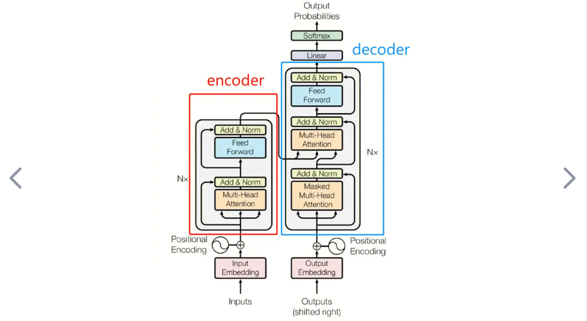
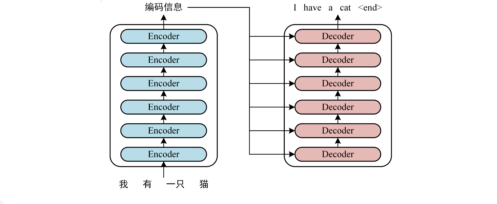

# 从现实生活的角度看 Transformer

原始 Transformer 的结构

编码器，解码器，编码器接收的 input 是 word embedding + positional embedding，然后通过自注意力机制和前馈神经网络。解码器接收的 输入是 output，预测部分，同样是 word embedding+positional embedding，然后分别经过解码器输入的 自注意力机制，以及和编码器输出 的 交叉注意力，最后经过 全连接层，得到最终的输出。

首先强调一下关于Transformer 为什么是注意力机制和全连接层的设计？

> 首先，Transformer 在 NLP中接收的数据格式 是 [B,L,D]，batch size，一个 batch 中有多少个句子，一个句子中有几个词 L，每个词的嵌入D，也就是每个词用长度为多少的向量表示
>
> 最直观的讲解，就是 注意力机制进行 L 层面的交互，前馈神经网络进行 D 层面的交互。
>
> **L 层面也就是注意到了 词与词之间的交互，D 层面就是词与词之间特征的交互** 
>
> > 在L层面（单词层面）进行交互，计算每个单词对其他单词的注意力权重，捕捉词与词之间的关系；
> >
> > 在D层面（即单词嵌入的特征层面）进行交互，对每个单词的嵌入向量进行非线性变换，捕捉词与词之间的特征交互 
>
> **对应到时间序列中**
>
> 1️⃣ 标准 ==输入== 格式也是 BLD，具体的解释： 
>
> > B = 32 (批量大小，32个时间序列样本)
> > L = 36 (每个样本有36个时间步，如过去36天的数据)
> > D = 7 (每个时间步有7个特征，如对于股票可能包括开盘价、收盘价、最高价、最低价、交易量等)
>
> 2️⃣ ==处理==   注意力机制
>
> 编码器中，注意力在所有36个时间步之间建立连接
> 解码器中，注意力既在预测序列内部建立连接，也与编码器输出建立连接
>
> 时间步之间的建模 可以 发现股票价格每周五可能下跌，或者每月初可能上涨的模式
>
> 3️⃣ ==处理==  前馈全连接层
>
> 处理每个时间步内7个特征之间的关系
>
> 例如，交易量与价格变动的关系，或开盘价与收盘价的关系

诶，说起这个，关于用现实例子理解这些模型，

**首先，卷积是什么意思？** 

假如我们要认识一个人A，B 是 A 的直接朋友，形成了B 对 A 的第一次认识，B 就相当于卷积核了，那直接认识 A的肯定不止一个人，还有B1，B2，B3...等，每个人对形成了对 A 的第一次认识，父母认识 A更关注生活层面，学校中直接认识的 A 更关于为人处事部分，工作中直接认识的 A 更关于 A 的生产性。这里直接认识 A 的B1，B2，B3...就是每一层中 卷积核的个数。除了直接认识 A 的，还有通过直接认识 A 的人B 认识 A，这波人叫 C，那还有通过 C 认识 A 的，那 C 又认识 D，D 又通过 C 认识 A。除了别人认识 A，A 自己也有对自己的认识。

**Transformer是什么意思？**

除了刚刚说的 注意力机制和前馈全连接层的理解，还有 Encoder 、Decoder 、多头注意力机制的理解。

- [x] Encoder&Decoder 的交互怎么理解？

首先，整体上的这个图：

编码器相当于甲方，解码器相当于乙方，甲方有需求，自己公司内部一级一级沟通，从最开始的想法最终形成方法交给最后一个人，这个人去和乙公司沟通，乙公司又有很多个部分，每个部分分别完成甲公司提出的方案的一部分，这一个过程中需要不断的与甲公司手拿最终方案的人不断沟通，最终乙公司完成方案。

- [x] 多头注意力机制怎么理解

对于 BLD 的序列，首先明白的是，那个维度分多头了，是 D 维度分成 num head维度和 head dim，其中 num head × head dim = embedding dim（D），相当于什么意思，一个人学知识（B =1），L 是要学的几本书，D 是每本书有几个章节，一般是一个老师教我们学一整本书，但多头注意力机制的意思是，一本书的几个章节，分开，比如第一个老师教第一章和第二章，第二个老师教第三章和第四章，最后两张第三个老师教，这样学习的时候，同样是一个学期，一个老师只需要关注两章的内容，对于课程节奏的把握知识理解的更透彻，效果会比一个老师教一整本书的内容要好一些。

B=3，就是班里的 3 个人，每个人这学期都要上这几本课，同样的 LD。

> 最后一个 linear 层，应该是为了还原原始维度的。