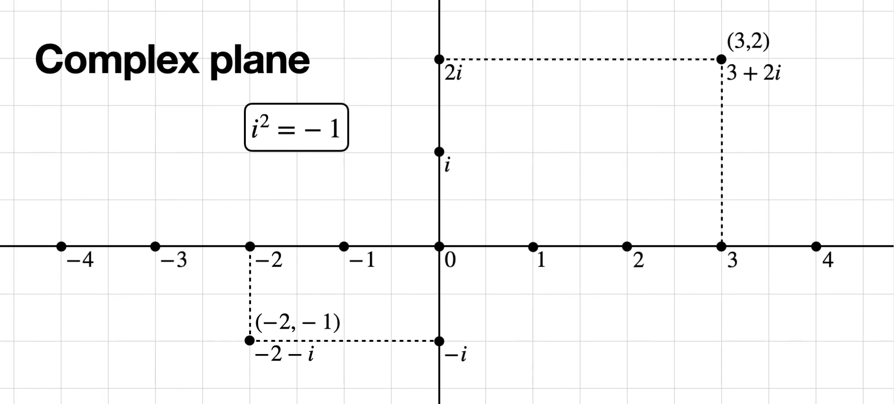
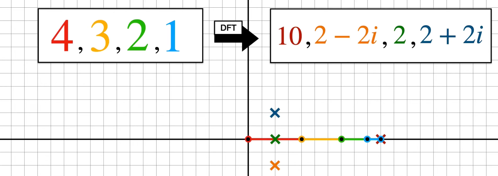
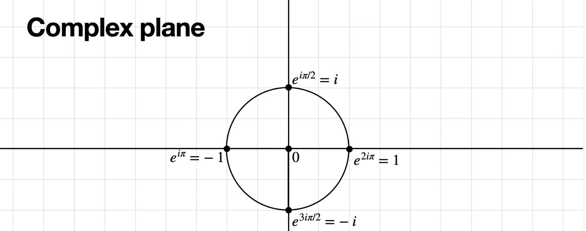
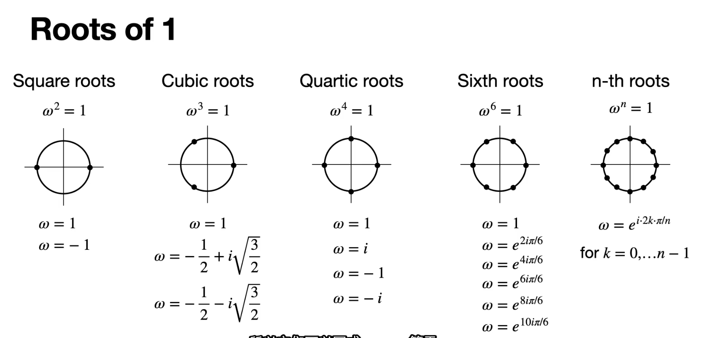

# 复平面旋转&DFT

## 离散傅里叶变换

[动画讲解离散傅里叶变换](https://www.bilibili.com/video/BV11R18Y2Ewb/?spm_id_from=333.999.0.0&vd_source=ddd7d236ab3e9b123c4086c415f4939e)

离散傅里叶变换公式：

-  $x_n$ 原始离散时间序列
- $\frac{2\pi}{N} \cdot k$  ：每次旋转的角度 = $k$ 个 $\frac{2\pi}{N}$
- $n$：每个时间点（从前往后）都要旋转

==复平面：== 

演示，将 原始序列[4,3,2,1]进行离散傅里叶变换：
$$
X_k= \sum_{n=0}^{N-1} x_n \cdot e^{-i\cdot(\frac{2\pi k}{N})n}
$$

- N=4 原始序列 4 个时间点，n 从 0 开始按时间点先后依次旋转
- 每个时间点旋转 $\frac{2\pi k}{N}$ 个角度，k=0,1,2,3
- k=0时，每个时间点，对应时间序列对应的线段，不旋转
- k=1时，旋转 90°
- k=2时，旋转 180°
- k=3时，旋转 270°

> - 1 个周期 = 时间序列长度
> - 2 个周期 = 时间序列长度
> - 3 个周期 = 时间序列长度
> - 4 个周期 = 时间序列长度 《===》一个周期一个点

- 旋转：顺时针旋转

顺时针旋转 90 度：

相对于初始位置，顺时针旋转 180 度

 

相对于初始位置，顺时针旋转 270 度

得到傅里叶变换：

 

以上是 4 个点的例子，现在举一个 6 个点的例子

公式，依然是 DFT
$$
X_k= \sum_{n=0}^{N-1} x_n \cdot e^{-i\cdot(\frac{2\pi k}{N})n}
$$

- 时间序列中有 6 个时间点
- 每次旋转  $\frac{2\pi k}{N}$ 个角度，其中，$\frac{2\pi }{N} = \frac{ 360° }{60°}= 60°$
- k=0，表示，==第一次遍历 时间序列中的所有时间点时，加和即可==。不转。
- k=1，第二次遍历时间序列中的时间点时，每个点依次，从前往后，顺时针旋转 $60°$  $《====》$ 周期长度=序列长度  $《====》$  因为 6 个点，每个点转 60 度，遍历完所有时间点，刚好转完一圈。
- k=2，第三次遍历时间序列中的所有时间点时，每个点依次再次旋转 $60 °$，相对于初始位置，旋转了 $120°$  $《===》$🔴序列长度 = 3 个周期长度  $《====》$ 6 个点，每个点转 120 度，遍历完所有时间点，🔴转完 3圈。
- k=3，第四次遍历时间序列中的所有时间点时，每个点依次再次旋转 $60 °$，相对于初始位置，旋转了 $180°$  $《===》$🔴序列长度 = 2个周期长度  $《====》$ 6 个点，每个点转 180 度，遍历完所有时间点，🔴转完 2 圈。
- k=4，第五次遍历时间序列中的所有时间点时，每个点依次再次旋转 $60 °$，相对于初始位置，旋转了 $240°$  $《===》$ 🔴序列长度 = 3个周期长度  $《====》$ 6 个点，每个点转 180 度，遍历完所有时间点，🔴转完 2 圈。
- k=5，第六次遍历时间序列中的所有时间点时，每个点依次再次旋转 $60 °$，相对于初始位置，旋转了 $300°$  $《===》$ 🔴序列长度 = 3个周期长度  $《====》$ 6 个点，每个点转 180 度，遍历完所有时间点，🔴转完 2 圈。
- 也就是说，$k$ 遍历在 $2 \pi$ 上，$n$ 遍历原始序列。$k$ 只是每个时间点旋转的角度。表示所有时间点在该频率上==的相关性？（响应值？）==

k=0，DFT 的第 1 个值，直接对所有元素加和

k=1，每个点转 60 度：

 

k=2，每个点顺时针旋转 120 度

 

每个点顺时针旋转 180 度

 

每个点旋转顺时针旋转 240 度

每个点旋转300 度

顺时针旋转 300 度，和旋转 60 度，十分相似，只是颠倒了，具体来说，实部是完全一样的，虚部是取反的。因为 $e^x = cosx+isinx$  ；第 0 个值是原始时间点加和的。

 

借助工具计算 DFT

- k=0，原始序列元素加和
- k=1，转 60 度，转一圈
- k=2，转 120 度，6 个点，转 3 圈
- k=3，转 180 度，在实数轴上移动，6 个点转2 圈
- k=4，转 240 度，相对于 120 度旋转来说，实数轴不变，虚数轴互为相反数
- k=5，转 300 度，相对于 60 度旋转来说，实数轴不变，虚部互为相反数

由，时域得到了频域 $===》[4,3,2,1]→[10,2-2i,2,2+2i]$

- k=0，元素加和
- k=1，转 90 度
- k=2，实数轴上，180 度
- k=3，转 270 度，相对于 k=1，实数部分不变，虚数部分互为相反数

那么，如果有频域，$[10,2-2i,2,2+2i] $ 怎么得到 时域？ $[4,3,2,1]$

- DFT 顺时针旋转，逆离散傅里叶变换，那就逆时针旋转

在复平面表示：

 

- 首先，第 0 个值，频域元素加和

  

- 顺时针旋转 90 度，依然是按照频域元素顺序，依次旋转

- 再次，每个点依次旋转 180 度

 

顺时针，每个点，相对于初始位置，旋转 270 度，都是从初始位置开始旋转，一次旋转完角度

 

问题，为什么，是 [16,12,8,4] 不是 [4,3,2,1] ？

 

答案：除以 序列长度 ，这里是 4.

傅里叶变换，顺时针旋转， $\frac{2\pi}{N}$

逆傅里叶变换，逆时针旋转，也是$\frac{2\pi}{N}$，最后还要除以序列长度 $N$

复平面与 $e^x$ ，这一步的转换，其实是从 $(cos\theta,sin\theta)$ 直接用了 $e^{i\theta}$ 表示

类似的，复平面坐标点，全部用指数表示

 
$$
e^{i\theta} = cos\theta + isin\theta
$$
具体来说：

- $1 = e^{i2\pi} = cos2\pi + isin2\pi = 1$
- $i = e^{i\frac{\pi}{2}} = cos\frac{\pi}{2} + isin\frac{\pi}{2} = i$
- $-1 = e^{i\pi} = cos\pi + isin \pi = -1$
- $-i = e^{i\frac{3\pi}{2}} = cos\frac{3\pi}{2} + isin\frac{3\pi}{2} = -i$

接下来，对 1 进行分解，具体来说：

- $x^2=1$
- $x^3=1$
- $x^4=1$
- $x^5=1$

因为讨论的是三角函数，所以用 $\omega$ 

这里其实，我觉得应该这么解释

- $\omega^2 = 1 ===>$   转1个 $\omega$ 转一圈 $=1$
- $\omega^3 = 1 ===>$ 转3个 $\omega$ 转一圈 $=1 ===>$  得到对应的角，进行相应的复数表示，比如这里 $\omega=120°$ ，$x$ 轴正方向开始找点，120°标一个，再一个120°，再标一个。（模长=1，角度＝120°）
- $\omega^4 = 1 ===>$ 转4个 $\omega$ 转一圈 $=1$
- $\omega^5 = 1 ===>$ 转5个 $\omega$ 转一圈 $=1$
- $\omega^6 = 1 ===>$ 转6个 $\omega$ 转一圈 $=1$
- ......
- $\omega^n = 1 ===>$ 转n个 $\omega$ 转一圈 $=1$ 

==单位根== 

- $\omega = 120°$ 是角，也是复数表示，也是 指数
- 复数： $\omega = -\frac{1}{2} + i \sqrt{\frac{3}{2}}$
- ※ 指数：$\omega = e^{i\frac{2\pi k}{N}}$ 这里划分成 3 个，也就是 3 个样本点，所以 $N=3$，这是第一次旋转，所以，$k=1$ 所以指数表示 $\omega = e^{i \frac{2 \pi}{3}}$

基于以上认识，重新看 DFT

符号说明

- DFT 的结果 $X_k$
- $x_n$ ： 我们正在旋转的杆的长度
- $e^{-i(2\pi\frac{k}{N}n)}$ ： 这个指数，就表示了旋转角度，表示的是单位根的旋转角度，因为乘以了 $x_n$ 所以有长度
- $\sum_{n=0}^{N-1}$ : 求和表示 所有杆的串联

 

$e^{-i(2\pi\frac{k}{N}n)}$ 的更具体一点

-  $(2\pi\frac{k}{N}n)$ ： 表示，旋转的角度。并且主要是 $2\pi\frac{k}{N}$ ，$n$ 的意思是，表示对所有杆旋转

原始序列中的点，旋转 $e^{-i(2\pi\frac{k}{N}n)}$ ，得到  $X_k$ 的图形化过程：

对于遍历一次序列，所有时间点，旋转的角度是不变的。

 

离散傅里叶变化和离散傅里叶逆变换：

 

$e^{-i}$ 表示 顺时针旋转，$e^i$ 表示逆时针旋转 

旋转角度 $\frac{2 \pi k}{N}$ 

最后，特别注意一下，逆傅里叶变换需要除以 序列长度 $N$

当然了，也有表示 $\frac{1}{\sqrt{N}}$

 

==傅里叶变换的矩阵表示：==

还是从 [4,3,2,1]开始：

 

用单位根矩阵表示，DFT

 

关于矩阵详细展开：

- 行表示 $\frac{2\pi k}{N}$ 频率，分别与 原始序列 $x_0，x_1，x_2，......,x_{N-1}$ 的相关性

逆傅里叶变换的矩阵形式：

## 离散傅里叶变换中的序列周期规律

[离散傅里叶变换中的序列周期规律](https://www.bilibili.com/video/BV12aypYxEAB/?vd_source=ddd7d236ab3e9b123c4086c415f4939e)

首先，回忆$[4,3,2,1]$离散傅里叶变换的过程

在复平面中讨论，依次画出 4,3,2,1 的线段，标出第一个点，也就是 `10`

然后，顺时针，依次旋转 90 度，先转第一条线段 `4` ，转动 4 的时候，会带着转 3,2,1，但是转的是 4 的右端点

 

接着转，第二条边的右端点

  

 

然后转第三条边的右端点，转动 90 度，最终转第四条边

 

记录得到最终的位置。

离散傅里叶变换和逆离散傅里叶变换

 

---

接下来，讨论周期序列：

==对这个序列进行离散傅里叶变换：==  

 

 ==仅观察 0 值和非 0 值==  

 

接下来的问题：

==周期=4 的时间序列 重复 3 次== 

 

首先观察第一个周期为 4 序列的离散傅里叶变换：

 

- 270°+90°=360°，所以转动270°时，与90°的实部相同，虚部互为相反数

==那么此时3 个 周期为 4 的离散傅里叶变换呢？== 

 

直观上说，是 上面得到的，一个周期为 4 的离散傅里叶变换，但其实不是的，而是`×3`，3 个时间序列的重复模式。而其他部分填充 0，得到重复 3 次的离散傅里叶变换

 

再次看一下，这里有区别

 

这里是重复 3 次，周期 为 4 的原始时间序列

得到的离散傅里叶变换是，分成 4 块，（每块内第一个元素不为 0，其余两个元素=0）

- 每次旋转的角度变了：$\frac{2 \pi k}{N}$

==分析为什么是这样的？==

> 直观上说，是 上面得到的，一个周期为 4 的离散傅里叶变换，但其实不是的，而是`×3`，3 个时间序列的重复模式。而其他部分填充 0，得到重复 3 次的离散傅里叶变换

- 原始时间序列，在对应频率上的分量，包含角度（ $e^{-i\frac{2 \pi k n}{N} }$ ）和模长 $x_n$  。
-  $e^{-i}$ 表示 顺时针旋转

- 其实不是很懂这个 n的含义，第 0个，第 1 个，...，每个线段转角就是转角，乘 n 干啥。

> 我懂这个 n 了，首先，分析，这几条线段是依次旋转的。
>
> 具体来说，假如基本旋转单元是 60°，一共 6 条线段（一定要满足 $\frac{2 \pi }{N}$ ），
>
> 现在复述原始时间序列在旋转 60 度时，每条线段的旋转情况。
>
> 第一条线段转 60 度，第一条线段转的时候，带着第二条、第三条、第四条...线段也转了 60 度
>
> 接下来转第二条线段，第二条线段在第一条线段的基础上转，开始转，第二条线段转 60 度，相对于起始位置转了 120 度，同时带动了第三条和第四条等其余几条线段转 60 度，接下来，第三条线段在第二条线段的基础上再转 60 度，相对于其实转了 180 度....
>
> 所以，对于特定频率 $k$ 来说，每条线段都会转 $\frac{2 \pi k}{N} n$
>
> 具体地，$x_0$ 转 $e^{-\frac{2 \pi k}{N} \cdot 0}$
>
> $x_1$ 转  $e^{-\frac{2 \pi k}{N} \cdot 1}$  ，一个  $\frac{2 \pi k}{N}$ 
>
> $x_2$ 转  $e^{-\frac{2 \pi k}{N} \cdot 2}$ ，2 个 $\frac{2 \pi k}{N}$
>
> $x_3$ 转 $e^{-\frac{2 \pi k}{N} \cdot 3}$ ，3 个 $\frac{2 \pi k}{N}$

接下来，一个个计算，这个具有周期性质的时间序列的傅里叶变换：

第一个元素：

> 同样在实数轴上画出线段，然后元素加和放到 DFT 的第一个位置

接下来，讨论DFT 中的第二个元素，也就是每天线段旋转 $\frac{2 \pi}{N}$ ，$N=12$ ，也就是每条线段依次旋转 60 度。

 

 

 

第三个周期同理，每条线段，时间点对应的长度依次转 60°，同时在第二次旋转的基础上，旋转，也就是相对于第一次旋转

- 第一个周期旋转 30 度，4 个时间点，4 条线段，所以 4 条线段中的最后一条线段转了 $30×4=120°$
- 第二个周期在第一个周期的基础上旋转，也就是把第一个周期的所有转过的，已经完成的形状，再转 120°，然后拼到第一个周期旋转的后面。
- 同理，第三个周期也是，对于第二个周期旋转好的图形转 120 度，相对于第一个周期转好的形状，旋转 240 度。

得到：

所以 DFT 的第二个数=0

第三个数，同理。第一条线段转 $\frac{2 \pi}{N}k$，这里 $k=2$，对应的每条线段，转 从编号 0 开始，转 $\frac{2 \pi}{N}k n$ 记的是每条线段的累积旋转角度

 

现在讨论下一个点为什么不是 0

 

这里 $k=3$， 也就是说 第一条线段 旋转 $\frac{2 \pi k }{N} = 30°×3=90°$ 

