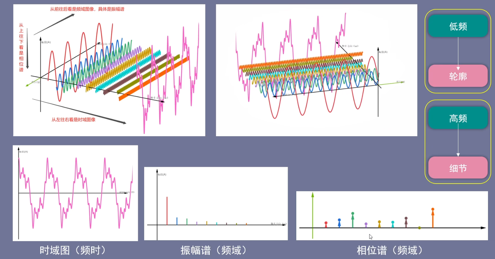

# 直观理解傅里叶变换

[直观理解傅里叶变换](https://www.bilibili.com/video/BV1uY411z7uk?spm_id_from=333.788.recommend_more_video.0&vd_source=99384b2db3076f120ee34966bff31479)

时域、频域转换只涉及三个图：时域图、振幅谱、相位谱

 

傅里叶级数领域，认为，波 最基本的物质单位 是 三角函数；

各种复杂的基本信号都是三角函数的叠加。更基本的，是正弦三角函数的叠加。

正弦波、余弦波都是正弦信号，只是认为相差 $\frac{\pi}{2}$ 的相位对应的 傅里叶级数也是既可以展开为只含有正弦波的，也可以展开为只含有余弦波的。

先将时域信号通过傅里叶变换转换为频域信号

从前向后观察，得到**时域图**

振幅谱：

从前往后观察，得到振幅谱，上下振幅保留单侧

相位谱：

从上往下观察，去掉相同的部分，得到相位谱，翻转相位谱的目的是为了便于观察

相位： $ A sin(2 \pi f \cdot x + \phi)$ ，其中 $\phi$ 就是相位谱

 

总结：

- 从前往后观察是 频域图像，也就是振幅谱  $ A sin(2 \pi f \cdot x + \phi)$ 也就是 $A$ 
- 从左往右观察是时域图像，从左往右观察并相加
- 从上往下看是相位谱 $\phi_0$  初相位
- 还有一点需要强调，低频波描述轮廓，代表长期趋势；高频波描述细节。

对应到离散傅里叶变换

$$ X_k = \sum_{n=0}^{N-1} x_t e^{-i\frac{2\pi k n}{N}} \quad n=0,1,2,3...,N-1$$

其中，$k= 0,1,2,3...,N-1$ 也是这个范围，同时需要注意的是 一般是固定一个 $k$，然后所有时间点 $x_0,x_1,x_2,x_3,.....,x_{N-1}$ 朝着 固定的 $k$ 频率进行相关性计算，或者叫投影。

- [ ] 其实关于这个 k 与频率 f 的关系，我也不清楚

> $e^{-i\frac{2\pi k n}{N}} = cos\frac{2\pi k n}{N} - isin\frac{2\pi k n}{N}$
>
> $\omega_0 = \frac{2\pi}{N} = 2 \pi f$
>
> 所以，具体来说，也许，$\omega_k = \frac{2\pi k}{N} = 2 \pi f$
>
> 也就是说 $f=\frac{k}{N}$
>
> $\omega_k = \frac{2\pi k}{N}$ 表示 原始 时间序列 与该 频率的相关性？
>
> **还有这种转几圈的问题我也不明白。** 
>
> k=1，表示原始时间序列 $T=N$  ；$N$个时间点构成一个周期
>
> k=2，表示 $T = \frac{N}{2}$ ？因为 可以看成  $\frac{2 \pi}{\frac{N}{2}}$
>
> k=3，表示当前时间序列数据构成 3 个周期
>
> **还有，DFT 与振幅谱、相位谱的关系 我也不明白**
>
> $ X_k = \sum_{n=0}^{N-1} x_t e^{-i\frac{2\pi k n}{N}} \quad n=0,1,2,3...,N-1$
>
> $e^{-i\frac{2\pi k n}{N}} = cos\frac{2\pi k n}{N} - isin\frac{2\pi k n}{N}$
>
> 所以 $ X_k = \sum_{n=0}^{N-1} x_t (cos\frac{2\pi k n}{N} - isin\frac{2\pi k n}{N}) $
>
> $ \quad = \sum_{n=0}^{N-1} x_t cos\frac{2\pi k n}{N} - i x_t sin\frac{2\pi k n}{N}) $
>
> 振幅： $x_t$
>
> 角度：$\frac{2\pi k n}{N}$ 

