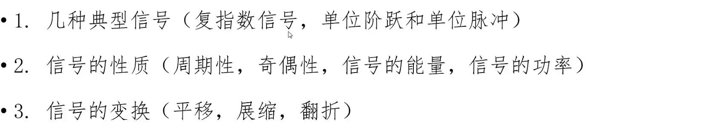

# 信号的合成与分解

> **傅里叶级数的三角形式、指数形式、相位、频谱**
>
> 傅里叶的三角函数：
>
> 正交基：$\cos1\omega x,\sin1\omega x,\cos2\omega x,\sin2\omega x,\cos3\omega x,\sin3\omega x,...,$
>
> 傅里叶的指数函数形式：
>
> 正交基：$\{e^{-jn\omega t},...,e^{-j2\omega t},e^{-j\omega t},e^{j0\omega t},e^{j\omega t},e^{j2\omega t},...e^{jn\omega t}\}$

[数字信号处理_信号的合成与分解](https://www.bilibili.com/video/BV1QG4y127B1?spm_id_from=333.788.videopod.sections&vd_source=ddd7d236ab3e9b123c4086c415f4939e)

复数形式：$a+bi$

复指数形式：$\sqrt{a^2+b^2}(cos\theta+i sin\theta)$ 

其中，

$cos\theta = \frac{a}{\sqrt{a^2+b^2}}$  

$sin\theta = \frac{ b }{ \sqrt{a^2 + b^2} } $  


- 尤其注意这里内积的 ==负号== 

 

## **向量的合成与分解**  


==红色是想要表示的向量。==  


## 信号的合成与分解

  

傅里叶变换的思想，将复杂的周期信号变成一系列简单三角函数的线性表示。

> 这个思想怎么这么像 泰勒展开，将任意一个函数展开成一系列幂函数求和。泰勒展开从导数角度逐点模仿。那，傅里叶变换呢？怎么用更通俗的语言描述？

**函数内积**：加法变积分运算


## 三角函数正交基

**三角函数集的正交性**


**结论：**

- 任意两个不同函数内积=0
- 相同函数内积 $\neq 0$ 


## 周期信号 **傅里叶级数** 


- 正交基是：

$\{1,\cos x,\sin x,\cos 2x,\sin 2x,...,\cos nx,\sin nx\}$ 

最大周期是 $2\pi$，  最大周期内 、正交基中的其余函数、重复整数次，如$1,2,3,4,....n$。就是正交基函数前面的系数。

> 理解（为了怕自己以后想不起来，重复无数次，不厌其烦🥲）：
>
> - $\cos x,\sin x$  最大周期 $2\pi$
> - $\cos 2x,\sin 2x$ 周期$=\pi$ ，最大周期 $2\pi$ 内重复 2 次
> - $\cos 3x,\sin 3x$ 周期$=\frac{2\pi}{3}$ ，最大周期 $2\pi$ 内重复 3 次
> - ...
> - $\cos nx,\sin nx$ 周期$=\frac{2\pi}{n}$ ，最大周期 $2\pi$ 内重复 $n$ 次 

- 傅里叶级数用的是：

$\cos1\omega x,\sin1\omega x,\cos2\omega x,\sin2\omega x,\cos3\omega x,\sin3\omega x,...,$

最大周期，就是要展开的周期信号的周期 $T$ ，前面已经记 $\omega = \frac{2\pi}{T}$

- $\cos1\omega x,\sin1\omega x$ 最大周期 $T$

- $\cos2\omega x,\sin2\omega x$ 周期$=\frac{T}{2}$ ，最大周期 $T$ 内重复 $2$ 次

- $\cos3\omega x,\sin3\omega x$ 周期$=\frac{T}{3}$ ，最大周期 $T$ 内重复 $3$ 次

>  目前，就是感觉，傅里叶级数就是说把给定一组时间序列数据
>
> 这组时间序列数据是1个周期的可能性？是这么描述吗？
>
> 这组时间序列数据是2个周期的可能性，这组时间序列数据是3个周期的可能性，这组时间序列数据是4个周期的可能性，.......
>
> 或者说：
>
> 这组时间序列数据是2个周期的话，相关性，每个时间点与对应周期的三角函数的响应值的相关性？
>
> 这么描述：$f(t)$是想要分解的时间序列数据，要分解到这组时间序列数据构成 1 个周期，2 个周期，3个周期的标准正余弦函数上，也就是说三角函数正交基说的是 这组时间序列数据分解到哪个频率的 3 个函数上，遍历所有的可能性（$1 \sim \infty$ DFT是 $n=1 \sim N-1$）。确定一个三角函数不仅需要频率，还有振幅和初始相位，三角函数的标准形式 $A\sin(\omega x+\phi)$
>
> 有了 $\omega$以后，还要找振幅 $A$ 和初始相位 $\phi$ 具体的就是正交基求 $a_n$ 和 $b_n$了
>
> 串起来了，都串起来了，系数的含义。
>
> 后面还应该注意，为什么复指数形式更好，因为频率、相位、振幅都直观地显示了。

- 将原始周期信号表示成：直流分量、正弦信号、余弦信号线性组合的方式

 

- 正余弦信号分别记为，1 次谐波、2 次谐波、3 次 谐波，意思就是频率分别是，$1\omega$、$2\omega$、$3\omega$ ，这里的频率说的是角频率  $\rightarrow$ 这个复杂的周期信号与简单的1次谐波、2次谐波的相关性🔴
- 这里的角频率可以一直取到无穷大

傅里叶计数的几何意义


- $系数$表示信号在对应频率上的$坐标$

==实例：方波信号的分解==

 

各种奇奇怪怪的周期信号分解成正弦信号和余弦信号的线性组合

 例子中 $T_0 = 4$ 的周期信号，其中 $T_1 = 1$ 

可以分解为直流分量，1 次谐波的余弦分量，3 次谐波的余弦分量还有 5 次谐波，7 次谐波


- 观察这个方波信号的分解：没有正弦分量 表示 这个方波信号在正弦奇函数上的投影=0，
- 同时，这个函数，并不是所有的余弦谐波分量都有，只有奇数项

可视化分解出的直流分量和谐波分量

 

同时，随着谐波分量的增加，合成信号越来越逼近原信号。

- 下图中，阶跃处有尖点表示吉布斯现象，与狄利克雷条件有关，暂时不管


- 同时应当注意的是，周期信号使用傅里叶级数进行信号的合成与分解
- 对于非周期信号使用傅里叶变换进行 信号的合成与分解
- 这里我有一个问题

> **谐波分量？** 
>
> > 最大周期，就是要展开的周期信号的周期 $T$ ，前面已经记 $\omega = \frac{2\pi}{T}$
> >
> > - $\cos1\omega x,\sin1\omega x$ 最大周期 $T$
> >
> > - $\cos2\omega x,\sin2\omega x$ 周期$=\frac{T}{2}$ ，最大周期 $T$ 内重复 $2$ 次
> >
> > - $\cos3\omega x,\sin3\omega x$ 周期$=\frac{T}{3}$ ，最大周期 $T$ 内重复 $3$ 次
>
> 感觉 这里的理解，还是得再加深一下。


## 幅度谱和相位谱


- 首先，给出时域上的波形，看不到具体的内容，只能大致上看出是一个周期信号，周期大致看出=4，通过周期信号的自相关，可以准确的判读出周期信号的周期
- 周期信号周期=4，此时根据计算 $\omega_0 = \frac{2\pi}{T}=\frac{\pi}{2}$ 表示==基波==频率 = $\frac{\pi}{2}$
- 通过傅里叶级数得到具体的余弦谱和正弦谱，但实际上并没有余弦谱和正弦谱的说法
- 通过上图右图，可以看出信号含有的正弦信息和余弦信息：
- 还有直流分量 $0.5$、1 次谐波的余弦分量，1 次谐波的正弦分量，还有一个 5 次谐波的余弦分量，同时它的振幅是0.127，同时在这里的正弦谱和余弦谱的表示上也十分清晰的
- 但是，在实际应用中，并没有余弦谱和正弦谱的概念，问题就在为什么傅里叶级数给出的也是正余弦函数的分解，相位谱怎么来？双边谱，幅度谱？

> 回答，首先，图中显示的直流分量 0.5放在了余弦谱上，那为什么不放在正弦谱上上？或者将直流分量平均分配在正弦函数 和 余弦函数上？也就是说这里直流分量就出现了歧义，不符合严谨的特性。所以，频谱分析为了严谨，不用余弦谱和正弦谱，用的是幅度谱和相位谱，有了 sinx 和 cosx 用辅助角公式即可得到幅度和相位

## 幅度谱和相位谱


- 通过辅助角变换，周期信号的分解可以统一变成余弦函数的表现形式

 

- 看这个实例，将相同频率的谐波利用辅助角公式统一用余弦函数表示，得到幅度谱和相位谱
- 看图，或者看傅里叶级数的辅助角形式：直流分量=0.5，1 次谐波的分量$=\sqrt{2}$ ，5 次谐波分量对应的 幅值 =0.127，同时在 1 次谐波分量上有一个 $-\frac{\pi}{4}$的滞后相位

以上详细说明了幅度谱和相位谱。

## 双边谱

- 双边谱就是借助欧拉公式，将傅里叶级数余弦函数表示的辅助角形式转换为 $e$ 的复指数形式


- 将余弦信号表示单边谱变成复指数形式表示双边谱
- 区别&联系
- 双边谱的 幅值，由 单边谱的幅值 减半，对称到负频率上
- 相位大小不变，频率进行奇对称

举例子：

 

- 单边谱和双边谱 本质是一样的，但是表达形式是不同的

单边谱：


- 这里的单边谱是余弦函数的分解形式，在一次谐波上有幅值，5 次谐波上有幅值
- 相位谱：在 1 次谐波上有滞后

对应的表达式：

 

- 接下来将两个余弦变成复指数相加 除以 2 的形式，得到幅度谱，同时幅度谱产生了正负两种频率，对应的幅度减半，并且是偶对称的

 

表达式：

 

相位在正频率上有一个滞后的 45°，负频率上也有一个==滞后的== 45°，并且是奇对称的，所以有一个==超前== 45 度的相位。

### 🔵 如何理解 双边谱的负频率

简单说就是旋转方向不同，正方向是逆时针旋转，对应的，反方向是顺时针旋转。

从下面的图也可以看出来


- [ ] 这个 谐波 $k \omega t$ ，就有点意思

 

复指数表示形式：


## 复指数函数正交基

统一了直流分量 $k=0$ 


- [ ] 这里，这个负号？

## 傅里叶级数的复指数形式

级数讨论的是周期函数，变换是非周期函数


- 在每个正交基上的投影就是系数，同样用内积之比进行计算

### 为什么在计算内积的时候用负号？

==与复数相关：==


 


- 复数模长的计算= 复数 × 它的共轭复数，也就是是说，复数内积的计算是复数与其共轭复数相乘。

- 实部不变，虚部部分相反。

==更详细的说明，为什么是负号：== 


## 从几何的角度理解 $i^2 = -1$


## $\sin(\omega t)$的双边谱


一定要牢记，可以从几何旋转的角度理解虚数单位 j

具体的 $j$ 写成幅角-模长形式：$j = 1 \cdot e^{j \frac{\pi}{2}}$  

- $1$ 表示模长
- $j$ 表示逆时针、正方向旋转
- $\frac{\pi}{2}$ 表示旋转角度
- 几何解释：旋转 90°的单位矢量

同理

 $-j$ 写成幅角-模长形式：$j = 1 \cdot e^{-j \frac{\pi}{2}}$  

- $1$ 表示模长
- ==$-j$ 表示顺时针、反方向旋转==，DFT 用的方向
- $\frac{\pi}{2}$ 表示旋转角度
- 几何解释：旋转 -90°的单位矢量

🔵 代入虚数单位的复指数形式：


结果解读：

- 幅度值都等于 $\frac{1}{2}$ → 在一次谐波上的分量都是 $\frac{1}{2}$
- 同时在 $k\Omega t = 1\Omega t $ 的频率上 有 $-\frac{\pi}{2}$ 的相位滞后
- 在 $-k\Omega t = -1\Omega t $ 的频率上 有 $\frac{\pi}{2}$ 的相位超前

由此绘制出幅度谱和相位谱：

 

- （幅度谱）在 $1 \Omega t$ 和 $- 1 \Omega t$ 分别有 $\frac{1}{2}$  的幅度值
- （相位谱）在  $- 1 \Omega t$ 上有一个 $\frac{\pi}{2}$ 的超前
- （相位谱）在  $1 \Omega t$ 上有一个 $- \frac{\pi}{2}$ 的滞后

## 方波信号的合成与分解实例

 

首先数学上的推导：

 

- 采用复指数分解
- 将周期信号 $x_t$ 分解到正交基函数上，表示为正交基函数的线性组合
- 原始周期信号在正交基函数上的投影用，内积计算
- 标红色的：表示复数的内积，涉及到共轭复数。
- 其中，相同正交基的内积=T，$\int_{-\frac{T}{2}}^{\frac{T}{2}} dt = T$ 是必然的。对常数积分，结果=区间长度

接下来，求直流分量：

 

接下来，$k \neq 0$


积分出来的结果，代入欧拉公式，变成只有正弦函数的。但是画图的时候用的是余弦函数画图，所以还是要转化成余弦函数，变成单边谱。具体的就是 $系数×2$ 变成单边谱


这句

 

得注意一下。原始信号的周期有了，那么基波频率 $\Omega$ 就有了 → $k\Omega n$  投影的谐波频率也有了

这里是傅里叶级数的具体步骤：（其中拟合的谐波分量个数可以自己设定） 


因为公式中拟合的谐波理论上来说是无穷多个。这里需要与后面的DFT 的变换拟合谐波数量需要作区分。

> 目前的理解：
>
> - 周期信号，用的是级数，可以分解出无穷多个谐波
> - 非周期信号，用的是变换，分解出的谐波是  $\frac{采样频率}{2}$


得到系数以后，可以绘制单边谱了


这里需要注意，双边谱转换为单边谱

==双边谱的 谐波模长需要 × 2，直流分量不需要 ×2==

$ak\_cos$ ： 也只是 单边谱 $\cos$ 对应的 幅值

 

图中得到了单边谱的幅度值，解读幅度谱：

- 直流分量 = 0.5

 

- $ak\_cos$ 的值与单边谱一一对应
- $k\Omega n$  第 0 个原始是直流分量
- $1\Omega n$  1 次谐波分量是 0.6366
- $2\Omega n$   偶次谐波是没有的
- $3\Omega n$  
- $4\Omega n$
- $5\Omega n$
- $6\Omega n$
- $7\Omega n$  7 次谐波分量是 $-0.0909$

**演示分解出来的信号** 

首先 直流分量的绘制，$c_0$ × 序列长度：


然后就是绘制谐波分量：

 

- 1 次谐波分量
- 2 次谐波分量
- ...
- 这是分解谐波个数=7，所以一共 7 次谐波分量

- [ ] （why？）这里我的问题是，为什么啊？为什么想分解几条谐波分量就能分解几条谐波分量

分解为 13 条谐波分量

 

分解完谐波分量以后，再合成：

 

100 次谐波分量及合成：

 

中间发白的是因为没有偶数次谐波分量 $\cos k \Omega n$ ，$k$等于偶数时，全部等于$0$，这个从单边幅度谱中也可以看出来。

## 欧拉公式的图像化解释


其实我不懂，为什么这里的 $T=6$ 

复指数信号的周期，在几何图形中对应这什么？

n=2，表示绘制 2 个周期

但确实，有了时间序列周期，就有了基波频率，基波频率对应到几何图形上又是什么？

$t = 0:0.1:(n*T)$  确实就是总的时间序列长度

这里的三维坐标，分别表示：$f = e^{i\Omega k t} = e^{i\Omega  t}$  也就是说画的是基波频率的欧拉公式（k=1）

> 猜想，如果绘制的是 k=2，2 次谐波的欧拉公式，其余都不变，会发生什么？
>
> 那其实，基频，也可以叫 1 次谐波

- x 轴 绘制的是 时间 $t$
- y 轴绘制的是 $img(f)$ 虚部部分
- z 轴绘制的是 $real(f)$ 实部部分

- [x] 应该自己用 python 实现一下。

画的一个买家秀：


 


- 是把，看出来了吧，

```python
# 参数设置
T = 6  # 周期
omega = (2 * np.pi) / T  # 角频率
n = 2  # 周期个数
t = np.arange(0, n * T + 0.1, 0.1)  # 时间序列，从0到n*T，步长为0.1

# 计算复指数信号
f = np.exp(2j * omega * t)  # 注意这里使用2j
real_part = np.real(f)  # 实部
imag_part = np.imag(f)  # 虚部
```

- 这里的基础参数不变，只改这里，`f = np.exp(2j * omega * t)  # 注意这里使用2j` 一个用 `1j * omega * t`  一个用 `2j * omega * t`
- 上面的特殊点 $\frac{T}{4}$、$\frac{T}{2}$、$\frac{3T}{4}$、$T$ 也很好看。都反映了 原始周期与 1 次谐波、2 次谐波完成周期的关系

- 区别就在于，本来是 一个周期 T=6 内完成一个周期，改成 2 次谐波 `2j * omega * t` ，就是  原始周期 T=6 内完成2个周期，那如果这样的话，也是可以理解，为什么周期的傅里叶 级数，可以分解 $\infty$ 次的谐波。下面这里画 50 次谐波分量，意思就是 `50j * omega * t` ，也就是原始 T=6 内，完成 50 个周期。

```python
# 计算复指数信号
f = np.exp(50j * omega * t)  # 注意这里使用的谐波频率
```

还有一点 j 前面加 1

- 既可以表示为 1 次谐波也可以叫基波频率（理解错了再改，先这么理解）
- 必须要加 1，1 不可以省略，要不然 python 不认识 j 是虚数单位。

 


## 典型信号

 

