# 复指数&复平面

## ==复平面：== 

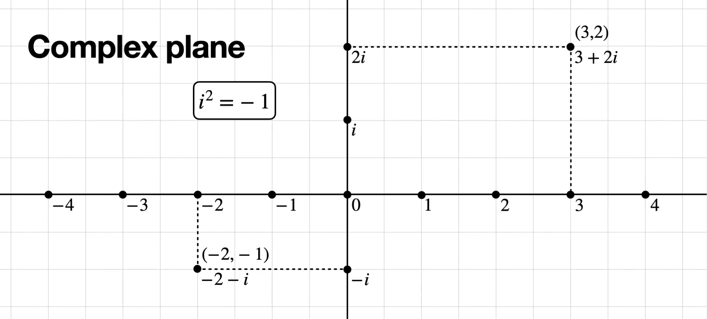

傅里叶变换，顺时针旋转， $\frac{2\pi}{N}$

逆傅里叶变换，逆时针旋转，也是$\frac{2\pi}{N}$，最后还要除以序列长度 $N$

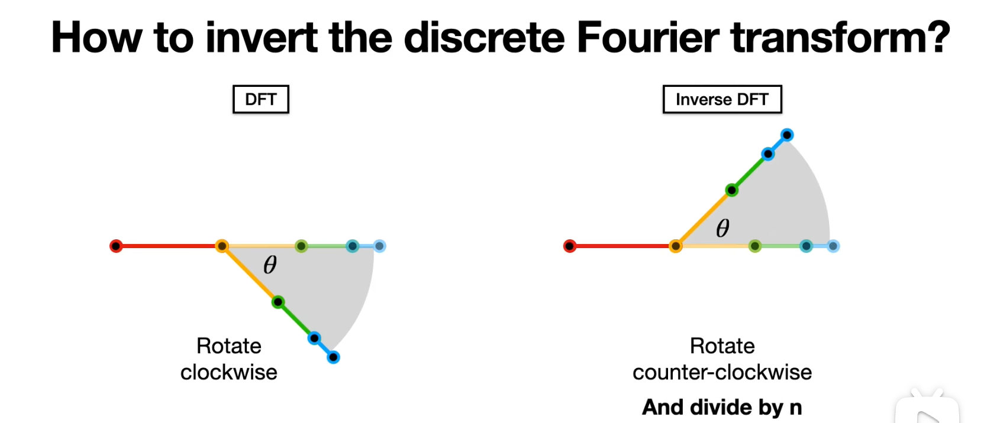

复平面与 $e^x$ ，这一步的转换，其实是从 $(cos\theta,sin\theta)$ 直接用了 $e^{i\theta}$ 表示

## ==复指数表示复平面== 

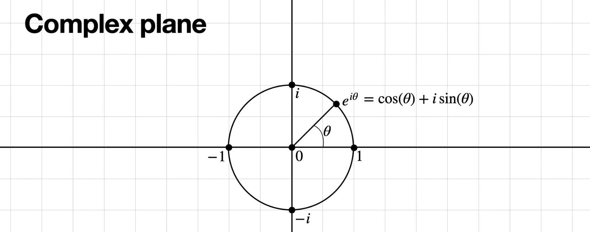

类似的，复平面坐标点，全部用指数表示

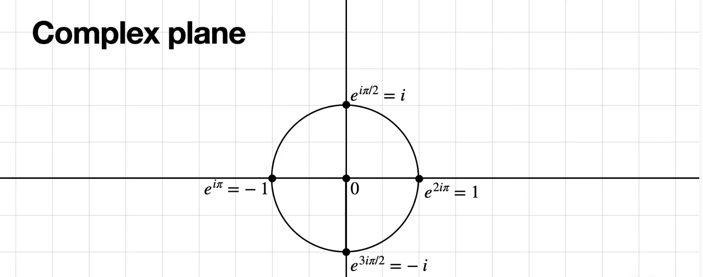 
$$
e^{i\theta} = cos\theta + isin\theta
$$
具体来说：

规定 逆时针旋转为正方向。

> 也正是因为如此，傅里叶的复指数的复数，因为傅里叶旋转用的是 顺时针。 

- $1 = e^{i2\pi} = cos2\pi + isin2\pi = 1$
- $i = e^{i\frac{\pi}{2}} = cos\frac{\pi}{2} + isin\frac{\pi}{2} = i$
- $-1 = e^{i\pi} = cos\pi + isin \pi = -1$
- $-i = e^{i\frac{3\pi}{2}} = cos\frac{3\pi}{2} + isin\frac{3\pi}{2} = -i$

> 这里，你别记这个数了，从几何的角度理解
>
> - $e^{i2\pi} = e^{i0\pi}=e^{i2\pi n} = 1$
>
> 表示在复平面单位圆的起点位置
>
> - $i = e^{i\frac{\pi}{2}} = e^{i(\frac{\pi}{2}+2n\pi)}$
>
> 表示单位圆半径从起点逆时针旋转 90°，到达 $i$
>
> - $-1 = e^{i\pi}=e^{i(\pi+2n\pi)}$
>
>  $e^{i\pi}$表示单位圆半径从起点逆时针旋转 180°，到达 $-1$
>
> $e^{-i\pi}$  表示单位圆半径从起点反方向旋转 180°，到达 $-1$
>
> - $-i = e^{i\frac{3\pi}{2}} = e^{-i\frac{\pi}{2}} = -i = e^{i\frac{3\pi}{2}} = e^{i(-\frac{\pi}{2}+2n\pi)}$
>
> $e^{i\frac{3\pi}{2}}$表示单位圆半径从起点逆时针旋转 270°，到达 $-1$
>
> $e^{-i\frac{\pi}{2}}$  表示单位圆半径从起点反方向旋转 90°，到达 $-1$
>
> - 怕我以后搞反，这里特地用了反方向旋转，其实就是顺时针旋转
> - 注意一下，这里 $n=0,\pm 1,\pm 2,\pm 3,...$

==单位根== 

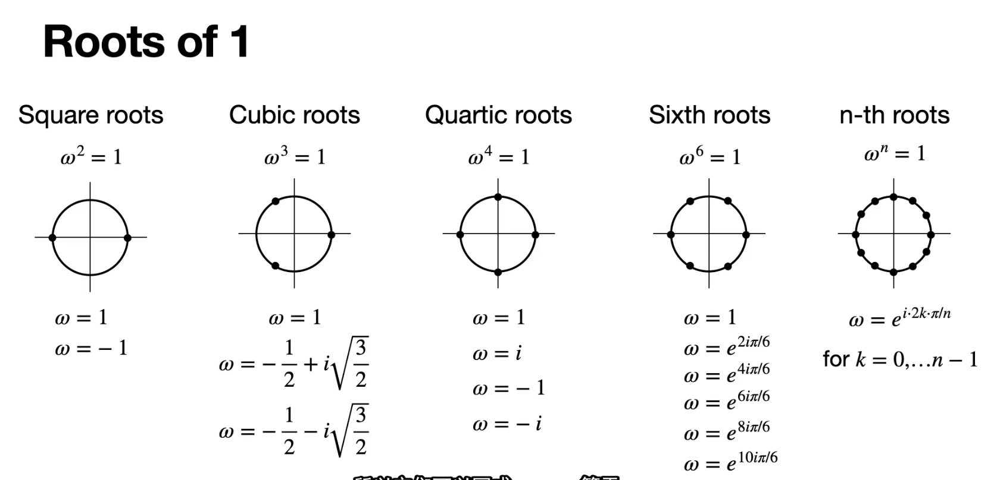

- $\omega = 120°$ 是角，也是复数表示，也是 指数
- 复数： $\omega = -\frac{1}{2} + i \sqrt{\frac{3}{2}}$
- ※ 指数：$\omega = e^{i\frac{2\pi k}{N}}$ 这里划分成 3 个，也就是 3 个样本点，所以 $N=3$，这是第一次旋转，所以，$k=1$ 所以指数表示 $\omega = e^{i \frac{2 \pi}{3}}$

## 复指数的周期性

$e^{ix}$ 周期 $T=2\pi$

**复指数的一般形式**  $e^{i\Omega t}$ ==周期== $T=\frac{2\pi}{\Omega}$

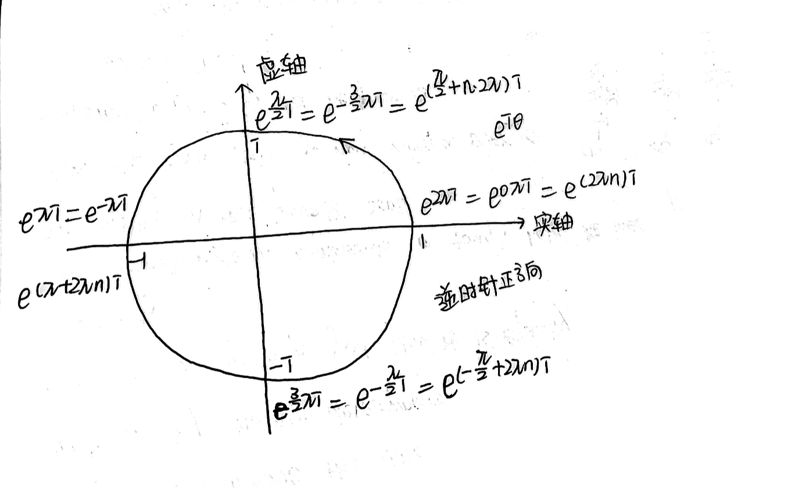

- 这里的 $n= \pm 1、\pm 2、\pm 3,......$

- $e^{i}$ 指数部分 $＞0$ ：表示逆时针旋转，是正方向。
- $e^{ix} \& e^{-ix}$ ：实部不变，虚部互为相反数

> **解释：** 
>
> - $e^{ix} = \cos x + i \sin x$
> - $e^{-ix} = \cos x - i \sin x$

- [x]  $T=N、T=\frac{N}{2}、T=\frac{N}{3}、T=\frac{N}{4}$ ？跟  $\omega 、T$ ？

> - 这里的 $N$ 表示原始时间序列的长度 
> - $\omega = 2\pi f = \frac{2 \pi}{T}$ 
>
> **把记号区分一下就好。** 
>
> $\Omega = \frac{2\pi}{N}$  所以 这个叫基波的角频率，$T=N$ 后面依次，$N/2、N/3、......$
>
> 这里变化的是 $k$，想要讨论的是基波、谐波
>
>  $\Omega = \frac{2\pi}{N}$   → $T=N$
>
> $2\Omega = \frac{2\pi}{N/2}$   → $T=N/2$
>
> $3\Omega = \frac{2\pi}{N/3}$   → $T=N/3$
>
> $4\Omega = \frac{2\pi}{N/4}$   → $T=N/4$
>
> (1)$X_k = \sum_{n=0}^{N-1} x_n e^{-i\frac{2 \pi k n}{N}}$
>
> (2) $\quad = \sum_{n=0}^{N-1} x_n e^{-i \Omega kn}$
>
> (3)$X_k = w^{kn}x_n$ ，$kn=0 \sim N-1$ 

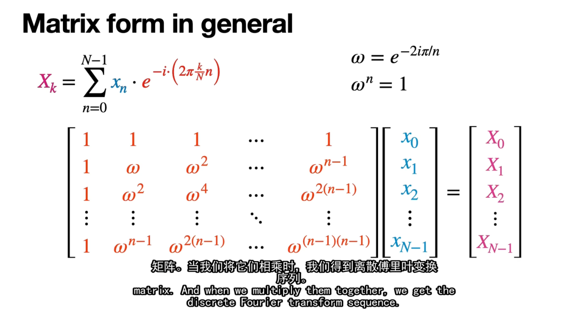 

- 关于这里的周期性特别的强调一下，尤其是和三角函数的形式作对比：

==最大周期 与 正交基==  

- 对于任意周期 $T$ 的含义进行傅里叶变换，用到的正交基，在一个周期内、也就是最大周期内的积分$=0$ ，这句话适用于三角函数正交基，也适用于复指数正交基→复指数正交基的证明

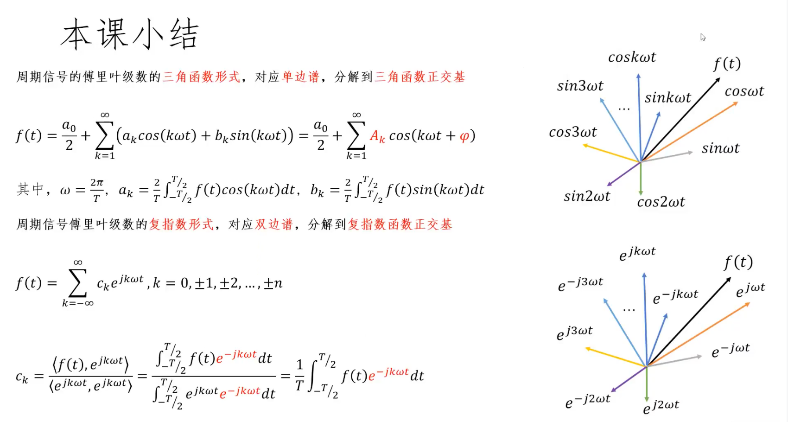 

##   周期为什么是 $2\pi$

**🌺 它是基本正弦函数 $\sin(x)$ 的一个完整周期** 

🌺 **它是所有 $\sin(nx)$ 函数的周期公倍数** 

**🌺 它构成了一个完整的正交系统** 

**<u>解释周期公倍数：</u>** 

对于任意正整数 $n$，$\sin(nx)$ 的周期是 $\frac{2\pi}{n}$。当我们取 $[0,2\pi]$ 作为积分区间时：

- $\sin(1x)$ 在此区间完成 1 个完整周期
- $\sin(2x)$ 在此区间完成 2 个完整周期
- $\sin(3x)$ 在此区间完成 3 个完整周期

这意味着，对于任何整数 $n$，$\sin(nx)$ 在 $[0,2\pi]$ 区间内包含整数个完整周期。

> 对于 $sin(nx)$ 来说， $2\pi$  是基本的最大周期。

- [x] **正交性的数学原理** 

当我们计算积分 $\int_0^{2\pi} \sin(nx)\sin(mx) dx$ 时，我们可以使用三角恒等式：

$$\sin(nx)\sin(mx) = \frac{1}{2}[\cos((n-m)x) - \cos((n+m)x)]$$

所以积分变为：

$$\int_0^{2\pi} \sin(nx)\sin(mx) dx = \frac{1}{2}\int_0^{2\pi} [\cos((n-m)x) - \cos((n+m)x)] dx$$

对于任何非零整数 $k$，$\int_0^{2\pi} \cos(kx) dx = 0$（因为余弦函数在完整周期上的积分为零）。

当 $n \neq m$ 时，$(n-m)$ 和 $(n+m)$ 都是非零整数，所以两项积分都等于零，最终结果是零。

- [x] **函数空间的完备性** 

$[0,2\pi]$ 区间上的三角函数系统 $\{1, \sin(x), \sin(2x), ..., \cos(x), \cos(2x), ...\}$ 构成了平方可积函数空间的一个完备正交基。这意味着任何在此区间上的平方可积函数都可以表示为这些基函数的线性组合。

- [x] **实际例子说明** 

让我们通过一个具体例子来理解：考虑 $\sin(2x)$ 和 $\sin(3x)$。

- $\sin(2x)$ 的周期是 $\pi$
- $\sin(3x)$ 的周期是 $\frac{2\pi}{3}$

如果我们只在一个函数的周期上积分，比如 $[0,\pi]$，另一个函数在此区间不会完成整数个周期，正交性可能不成立。但在 $[0,2\pi]$ 上：

- $\sin(2x)$ 完成了 2 个完整周期
- $\sin(3x)$ 完成了 3 个完整周期

这种情况下，两个函数的乘积在正负区域"恰好平衡"，使积分为零。

- [x] **总结** 

$[0,2\pi]$ 积分区间的选择不是基于单个函数的周期，而是基于建立一个完整正交系统的需要。这个特殊区间确保了:

- 所有 $\sin(nx)$ 函数在此区间上包含整数个周期
- 不同频率的正弦函数在此区间上正交
- 三角函数系统在此区间上构成完备正交基

## $\Omega 、\omega$ 与周期 $T$

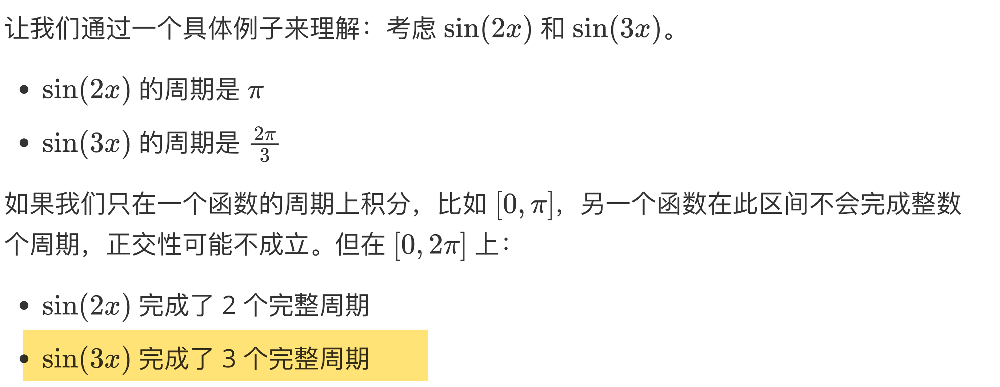

## 复指数正交基

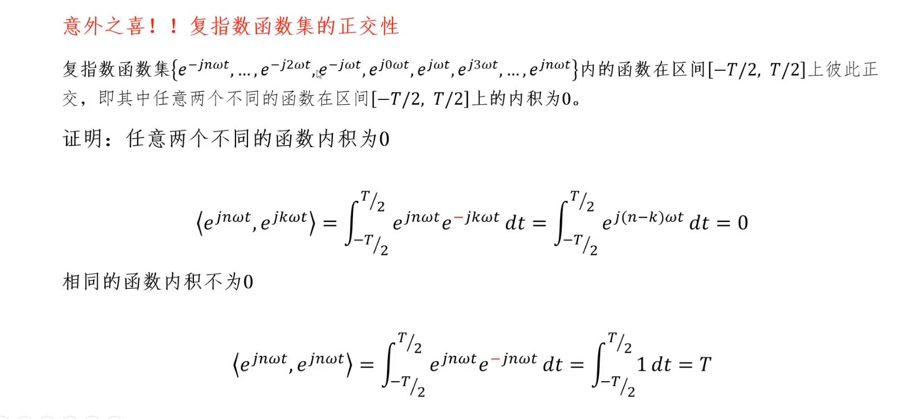 

特别想强调的是，**为什么两个不同函数内积=0**

借助最大周期来理解，这里的 T 是最大周期，一个周期内的积分$=0$，所以$=0$

怎么理解这里的最大周期？

$e^{j(n-k)\omega t}$ 的周期 ：

$ e^{j(n-k)\omega t} 的 周期 =\frac{2 \pi}{(n-k)\omega}$

其中，这里的傅里叶变换中： $\omega = \frac{2 \pi}{N}$     $N$表示原始序列长度，这里将原始序列长度记为 $T$ ，所以 $\omega = \frac{2 \pi}{T}$ 

所以 $e^{j(n-k)\omega t} 的 周期 = \frac{N}{n-k} =\frac{T}{n-k}$ 

也就是说

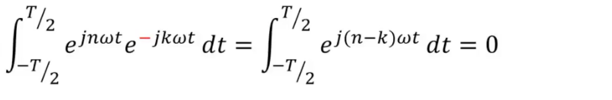 

这里积分内 复指数的 $周期 =\frac{T}{n-k}$ 

也就是说，在 $t \in (-\frac{T}{2},\frac{T}{2})$ 中，$e^{j(n-k)\omega t}$ 完成了 $n-k$ 次周期

也就是说 $T$ 是所有  $e^{j(n-k)\omega t}$ 的最大周期，所以周期内积分 $= 0$

 

