# FS、FT、DTFS、DTFT

课件

[连续时间周期信号的傅里叶级数](../pdf_files/5_1_FS.pdf)

[连续时间非周期信号的傅里叶变换](../pdf_files/5_2_FT.pdf)

[离散时间周期信号的傅里叶变换](../pdf_files/5_3_DTFS.pdf)

[离散时间非周期信号的傅里叶变换](../pdf_files/5_4_DTFT.pdf)

==目录：== 

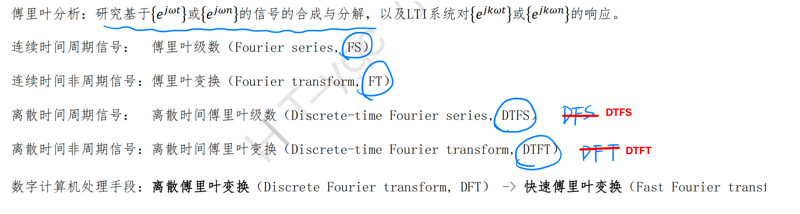

目标都是：原始信号表示为一系列单位圆上的正交基表示 $x(t)=... ...$

- 在正交基上的强度，用内积计算

==FS==   连续时间周期信号的傅里叶级数

【时域→频域】

$$x(t) = \sum_{k=-\infty}^{\infty}F(k\omega_0)e^{jk\omega_0 t}$$

其中：【频域→时域】

 $F(k\omega_0) = \frac{1}{T}\int_{-\frac{T}{2}}^{\frac{T}{2}} x(t)e^{-jk\omega_0t}dt$

==FT==  连续时间非周期信号的傅里叶级数

$$x(t) = \frac{1}{2\pi}\int_{-\infty}^{\infty}F(\omega)e^{j\omega t}d\omega $$ 

其中，

$ F(\omega) = \int_{-\infty}^{\infty}x(t)e^{-j\omega t}dt  $

==DTFS==  离散时间周期信号的傅里叶级数

$$x[n] = \sum_{k=0}^{N_0 - 1} F(k\Omega_0)e^{jk\Omega_0 n}$$ 

$ F(k\Omega_0)= \frac{1}{N_0}\sum_{n=0}^{N_0 - 1}x[n]e^{-jk\Omega_0 n}$

==DTFT== 离散时间周期信号的傅里叶变换 $\rightarrow FFT$

$x[n] = \frac{1}{2\pi}\int_0^{2\pi}F(\Omega)e^{j\Omega n} d\Omega$ 

$F(\Omega) = \sum_{n=-\infty}^{\infty}x[n]e^{-j\Omega n}$

## FS

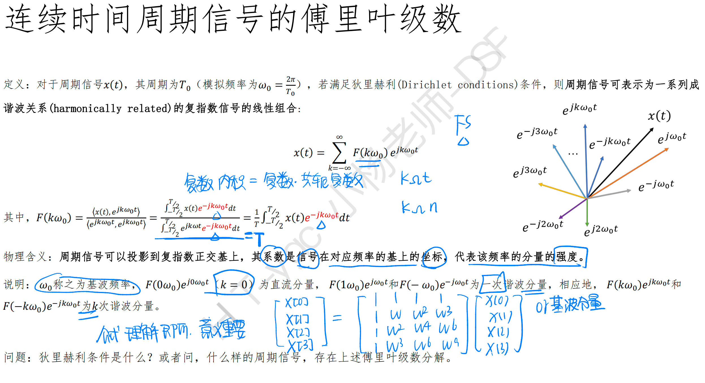

吉布斯现象：

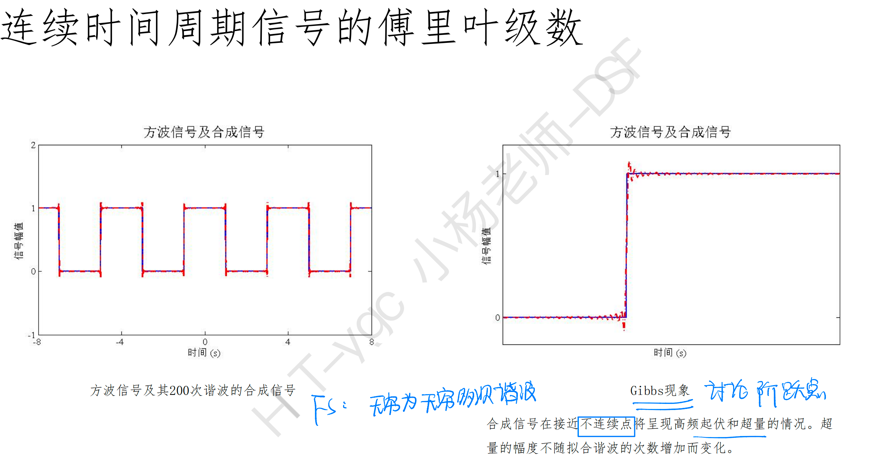 

## FT

对比FS

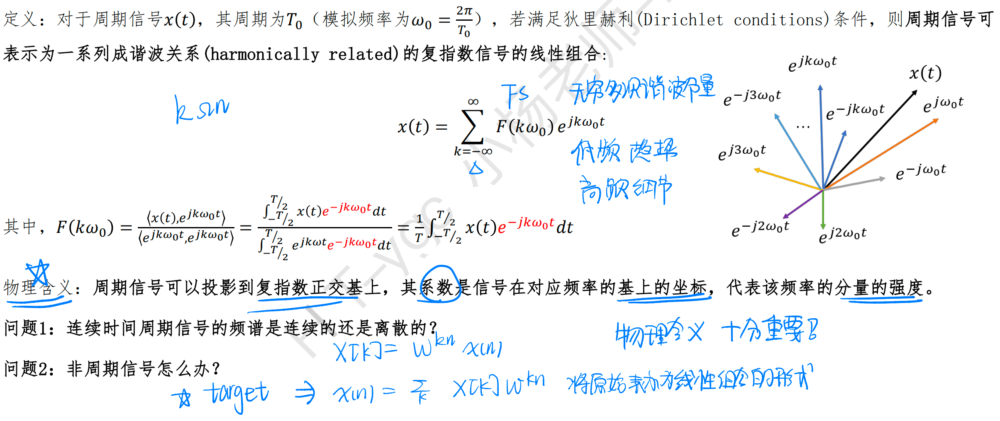 

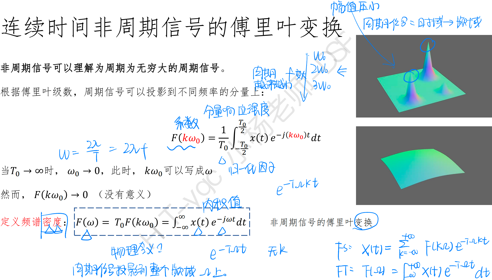 

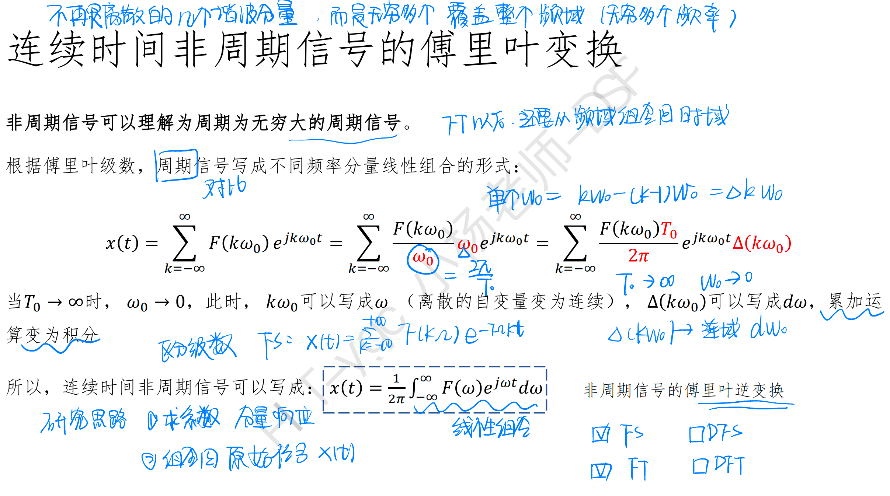 

### FS实例：方波信号

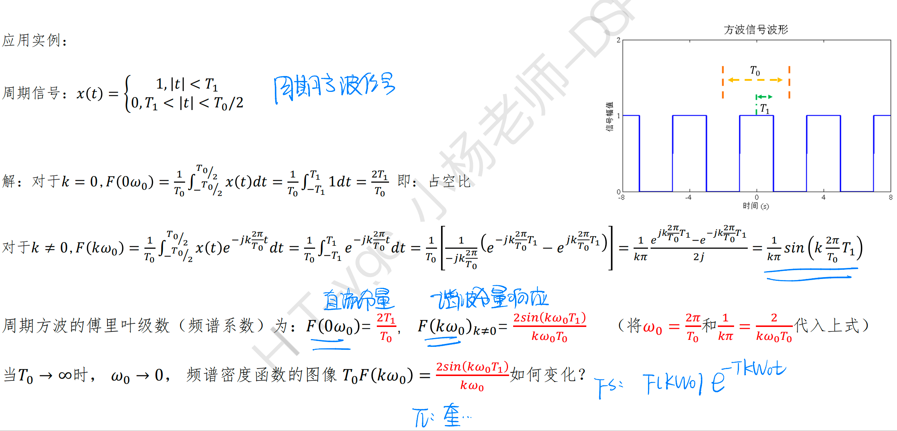 

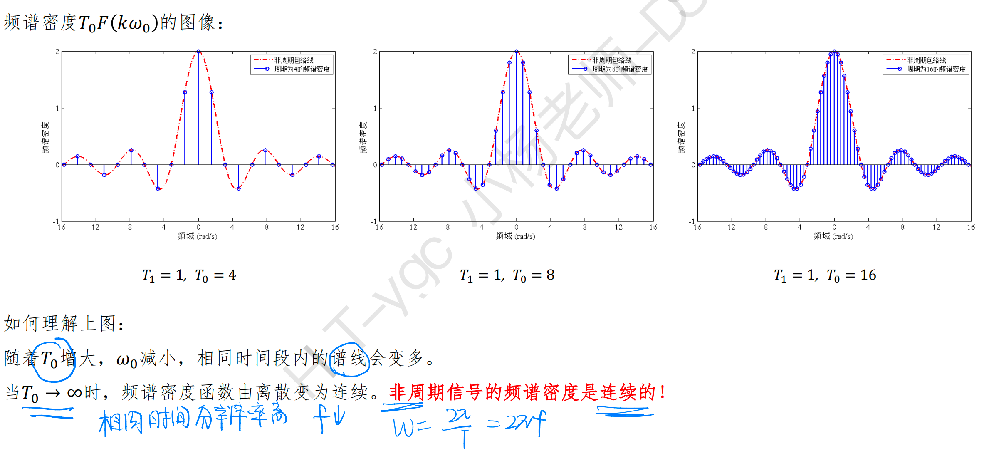 

## DTFS

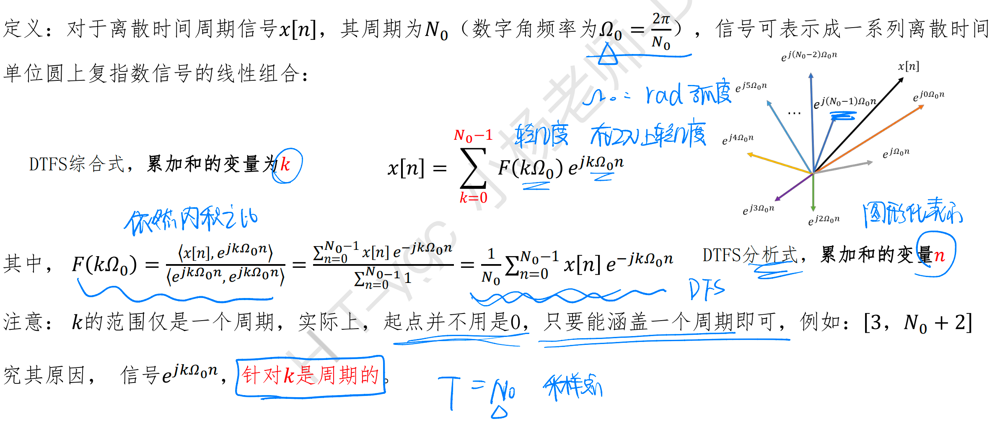 

### 实例

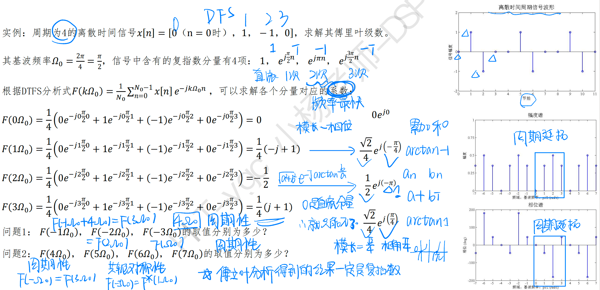 

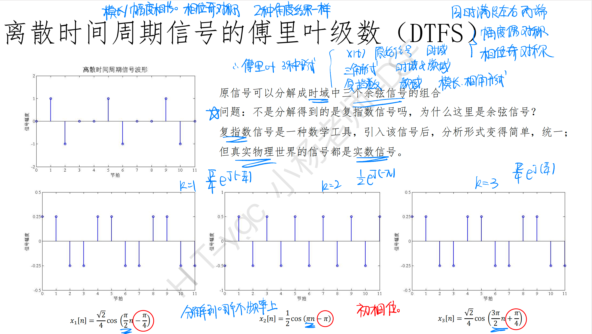 

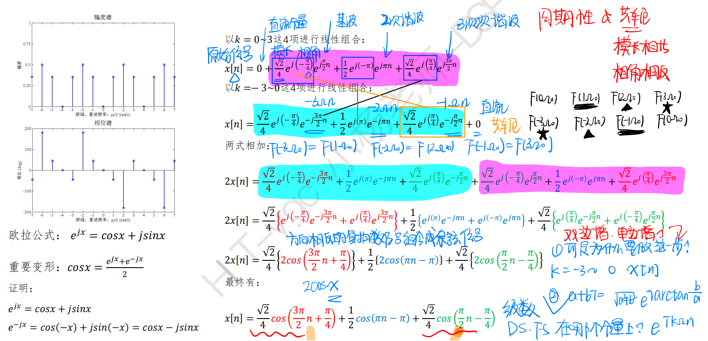 

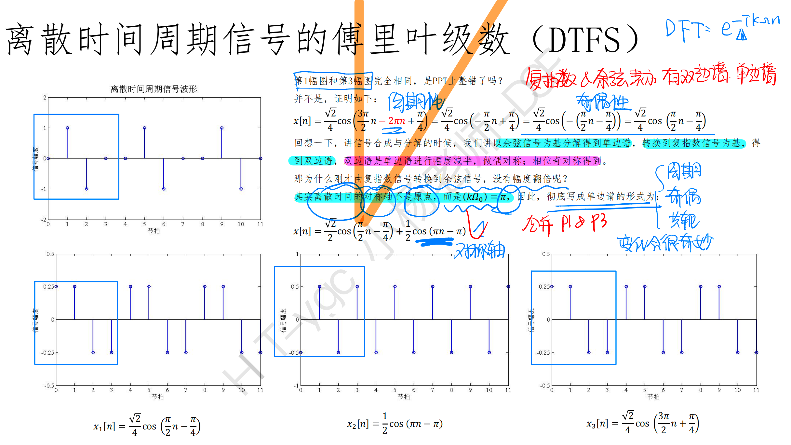 

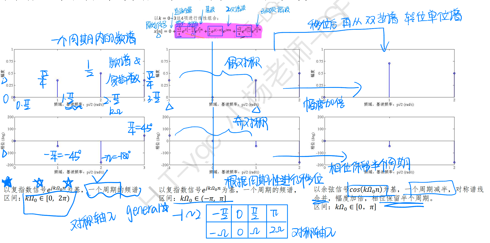

