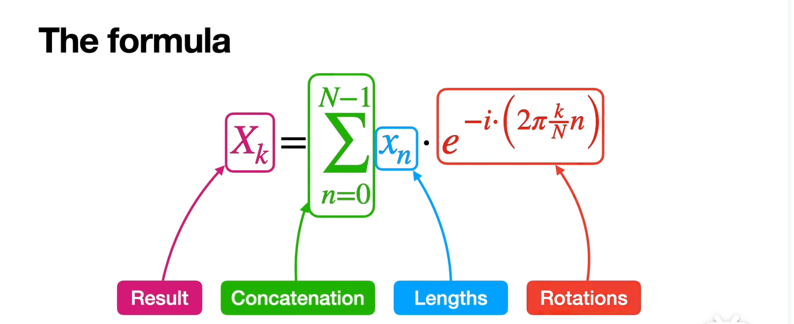

# Fourier级数

- [x] 傅里叶级数
- [x] 傅里叶变换

- [ ] 离散傅里叶变换
- [ ] 快速傅里叶变换

## 三角函数形式

🟢  case1：周期= $2 \pi$

> 周期为 $2\pi$的函数展开式

$$f(t) = \frac{a_0}{2} + \sum_{n=1}^{+ \infty} a_n cosnt + b_nsinnt$$

$$\left\{
\begin{aligned}
a_0 & =\frac{1}{\pi}\int_{-\pi}^{\pi}f(t)\mathrm{d}t, \\
a_n & =\frac{1}{\pi}\int_{-\pi}^{\pi}f(t)\cos\mathrm{n}t\mathrm{d}t, \\
b_n & =\frac{1}{\pi}\int_{-\pi}^{\pi}f(t)\sin\mathrm{n}t\mathrm{d}t
\end{aligned}\right.$$

🟢 case2：周期=2T

$t=?x = 2\pi \frac{x}{2T} = \pi \frac{x}{T}$

$$f(x)=\frac{a_0}{2} + \sum_{n=1}^{+ \infty} a_n cosn\pi\frac{x}{T} + b_nsinn\pi\frac{x}{T}$$

> $dt = \frac{\pi}{T}dx$
>
> $t \in (-\pi,\pi)  → x \in (-T,T)$

$$\left\{
\begin{aligned}
a_0 & =\frac{1}{T}\int_{-T}^{T}f(x)\mathrm{d}x, \\
a_n & =\frac{1}{T}\int_{-T}^{T}f(x)\cos\mathrm{n}\pi \frac{x}{T}\mathrm{d}x, \\
b_n & =\frac{1}{T}\int_{-T}^{T}f(x)\sin\mathrm{n}\pi \frac{x}{T}\mathrm{d}x
\end{aligned}\right.$$

🟢 case3：周期=T

$t=?x = 2\pi \frac{x}{T} =\omega x$    (令 $\omega = \frac{2\pi}{T} $)

> $dt = \frac{2\pi}{T}dx$
>
> $t \in (-\pi,\pi)  → x \in (-\frac{T}{2},\frac{T}{2})$

$f(x)=\frac{a_0}{2} + \sum_{n=1}^{+ \infty} a_n cos n2\pi\frac{x}{T} + b_nsin n2\pi\frac{x}{T}$ 

==更常用的形式：==

$$f(x)=\frac{a_0}{2} + \sum_{n=1}^{+ \infty} a_n cos n \omega x + b_nsin n \omega x$$ 

$$\left\{
\begin{aligned}
a_0 & =\frac{2}{T}\int_{-\frac{T}{2}}^{\frac{T}{2}}f(x)\mathrm{d}x, \\
a_n & =\frac{2}{T}\int_{-\frac{T}{2}}^{\frac{T}{2}}f(x)\cos\mathrm{n}\omega x\mathrm{d}x, \\
b_n & =\frac{2}{T}\int_{-\frac{T}{2}}^{\frac{T}{2}}f(x)\sin\mathrm{n}\omega x\mathrm{d}x
\end{aligned}\right.$$

特别的，$\omega_0=\frac{2\pi}{T}$ 记作基频，周期最长，最低频

## 指数形式

$$
\left\{
\begin{aligned}
e^{ix}=cosx+isinx, \\
e^{-ix}=cosx-isinx, \\
\end{aligned}\right.
$$

$$
\left\{
\begin{aligned}
cosn\omega x = \frac{e^{in\omega x}+e^{-in\omega x}}{2}, \\
i sin n\omega x = \frac{e^{in\omega x}-e^{-in\omega x}}{2}, \\
\end{aligned}\right.
$$

$f(x)=\frac{a_0}{2} + \sum_{n=1}^{+ \infty} a_n cos n \omega x + b_nsin n \omega x$

$\quad =\frac{a_0}{2} + \sum_{n=1}^{+ \infty} a_n \frac{e^{in\omega x}+e^{-in\omega x}}{2} - i b_n\frac{e^{in\omega x}-e^{-in\omega x}}{2}$

$\quad =\frac{a_0}{2} + \sum_{n=1}^{+ \infty} \frac{a_n - i b_n}{2} e^{in\omega x}+ \frac{a_n + i b_n}{2} e^{-in\omega x}$

记系数分别为：

$c_0 = \frac{a_0}{2} = \frac{1}{T}\int_{-\frac{T}{2}}^{\frac{T}{2}}f(x)\mathrm{d}x \quad (n=0)$  

$c_n = \frac{a_n - i b_n}{2} = \frac{\frac{2}{T}\int_{-\frac{T}{2}}^{\frac{T}{2}}f(x)\cos\mathrm{n}\omega x\mathrm{d}x-i\frac{2}{T}\int_{-\frac{T}{2}}^{\frac{T}{2}}f(x)\sin\mathrm{n}\omega x\mathrm{d}x}{2}$

$ \quad = \frac{\int_{-\frac{T}{2}}^{\frac{T}{2}}f(x)\cos\mathrm{n}\omega x\mathrm{d}x-if(x)\sin\mathrm{n}\omega x\mathrm{d}x}{T}$

$ \quad = \frac{\int_{-\frac{T}{2}}^{\frac{T}{2}}f(x)(\cos\mathrm{n}\omega x-i\sin\mathrm{n}\omega x)\mathrm{d}x}{T}$

$ \quad = \frac{\int_{-\frac{T}{2}}^{\frac{T}{2}} f(x) e^ {- \mathrm{n}\omega x} \mathrm{d}x}{T}$

$ \quad = \frac{1}{T} \int_{-\frac{T}{2}}^{\frac{T}{2}} f(x) e^{- \mathrm{n}\omega x }\mathrm{d} x \quad (n=1,2,3,4... ...)$

$c_{-n} = \frac{a_n + i b_n}{2} = \frac{\frac{2}{T}\int_{-\frac{T}{2}}^{\frac{T}{2}}f(x)\cos\mathrm{n}\omega x\mathrm{d}x + i\frac{2}{T}\int_{-\frac{T}{2}}^{\frac{T}{2}}f(x)\sin\mathrm{n}\omega x\mathrm{d}x}{2}$

$ \quad = \frac{1}{T} \int_{-\frac{T}{2}}^{\frac{T}{2}} f(x) e^{\mathrm{n}\omega x }\mathrm{d} x \quad (n=1,2,3,4... ...)$

汇总 $c_0,c_n,c_{-n}$ 

可得：

$c_n = \frac{1}{T} \int_{-\frac{T}{2}}^{\frac{T}{2}} f(x) e^{- \mathrm{n}\omega x }\mathrm{d} x \quad (n=0,\pm 1,\pm 2,\pm 3,\pm 4... ...)$

最终得到，傅里叶级数的指数形式：

$$f(x)=\sum_{n= - \infty}^{\infty} c_n e^{i n \omega x }$$

$$c_n = \frac{1}{T} \int_{-\frac{T}{2}}^{\frac{T}{2}} f(x) e^{- \mathrm{n}\omega x }\mathrm{d} x \quad (n=0,\pm 1,\pm 2,\pm 3,\pm 4... ...)$$

傅里叶级数的指数形式，可以清楚地展示出幅角和模长，这是三角函数形式展示不直观的。

----

==中间的补充：== 

> 关于「傅里叶级数的指数形式，可以清楚地展示出幅角和模长 」的解释：

这里用的是离散傅里叶变换了。

> 📢 注意区别：
>
> - 傅里叶级数是展开周期函数
> - 傅里叶变换是对于非周期函数

复平面与 $e^x$ ，这一步的转换，其实是从 $(cos\theta,sin\theta)$ 直接用了 $e^{i\theta}$ 表示

类似的，复平面坐标点，全部用指数表示

 
$$
e^{i\theta} = cos\theta + isin\theta
$$
具体来说：

- $1 = e^{i2\pi} = cos2\pi + isin2\pi = 1$
- $i = e^{i\frac{\pi}{2}} = cos\frac{\pi}{2} + isin\frac{\pi}{2} = i$
- $-1 = e^{i\pi} = cos\pi + isin \pi = -1$
- $-i = e^{i\frac{3\pi}{2}} = cos\frac{3\pi}{2} + isin\frac{3\pi}{2} = -i$

接下来，对 1 进行分解，具体来说：

- $x^2=1$
- $x^3=1$
- $x^4=1$
- $x^5=1$

因为讨论的是三角函数，所以用 $\omega$ 

这里其实，我觉得应该这么解释

- $\omega^2 = 1 ===>$   转1个 $\omega$ 转一圈 $=1$
- $\omega^3 = 1 ===>$ 转3个 $\omega$ 转一圈 $=1 ===>$  得到对应的角，进行相应的复数表示，比如这里 $\omega=120°$ ，$x$ 轴正方向开始找点，120°标一个，再一个120°，再标一个。（模长=1，角度＝120°）
- $\omega^4 = 1 ===>$ 转4个 $\omega$ 转一圈 $=1$
- $\omega^5 = 1 ===>$ 转5个 $\omega$ 转一圈 $=1$
- $\omega^6 = 1 ===>$ 转6个 $\omega$ 转一圈 $=1$
- ......
- $\omega^n = 1 ===>$ 转n个 $\omega$ 转一圈 $=1$ 

==单位根== 

- $\omega = 120°$ 是角，也是复数表示，也是 指数
- 复数： $\omega = -\frac{1}{2} + i \sqrt{\frac{3}{2}}$
- ※ 指数：$\omega = e^{i\frac{2\pi k}{N}}$ 这里划分成 3 个，也就是 3 个样本点，所以 $N=3$，这是第一次旋转，所以，$k=1$ 所以指数表示 $\omega = e^{i \frac{2 \pi}{3}}$

基于以上认识，重新看 DFT

符号说明

- DFT 的结果 $X_k$

- $x_n$ ： 我们正在旋转的杆的长度

- $e^{-i(2\pi\frac{k}{N}n)}$ ： 这个指数，就表示了旋转角度，表示的是单位根的旋转角度，因为乘以了 $x_n$ 所以有长度

  > 其中，$e^{-i}$ 表示顺时针旋转
  >
  > $2\pi \frac{k}{N}n$ 表示时间序列的 $n$ 点与频率 $\frac{k}{N}$ 的相关性
  >
  > 复指数项，被称为 旋转因子或单位旋转矢量
  >
  > - [ ] 忽然很好奇，角频率 $\omega$ 到底是什么。

- $\sum_{n=0}^{N-1}$ : 求和表示 所有杆的串联

## 物理意义

基于以上理解，扩充一些更细致的理解

==cos 形式== 可以只用 正弦函数 或者余弦函数

    

 

==指数形式==

==指数形式==  指数形式也证明过了

==系数之间的关系：== 

代入来代入去可得，（以 $a_n $ 和 $b_n$ 为基准）：

## 从傅里叶级数 →傅里叶变换

- 傅里叶级数是对周期为T的确定性信号做展开，而傅里叶变换将周期推广到无穷，能对具有任意长度的信号做展开
- **连续周期信号 ---> 傅里叶级数**；**连续非周期信号 ---> 傅里叶变换。**

 

==最最核心的：==   

## Add

最常用的傅里叶级数形式：

 

  

  

### 傅里叶级数推导

从无到有

 

==基频&谐波== 

 

 

 

==由三角函数推导指数形式：==

再看一遍三角函数：

 

==欧拉公式==

 

 

==全部散开的 指数型 傅里叶级数==   

 

---

reference

[傅里叶级数公式推导](https://zhuanlan.zhihu.com/p/5721100917)

[数值分析-最佳三角逼近&Fourier变换&三角插值](https://zhuanlan.zhihu.com/p/5721100917)

[(很多漂亮的图)如何理解傅立叶级数公式？](https://www.zhihu.com/question/19714540/answer/334686351)

[傅里叶系列（一）傅里叶级数的推导](https://zhuanlan.zhihu.com/p/5721100917)

[https://www.tup.com.cn/upload/books/yz/079859-01.pdf](https://www.tup.com.cn/upload/books/yz/079859-01.pdf)

[纯干货数学推导 傅里叶级数与傅里叶变换 Part5\_从傅里叶级数推导傅里叶变换](https://www.bilibili.com/video/BV1jt411U7Bp?spm_id_from=333.788.videopod.sections&vd_source=99384b2db3076f120ee34966bff31479)

