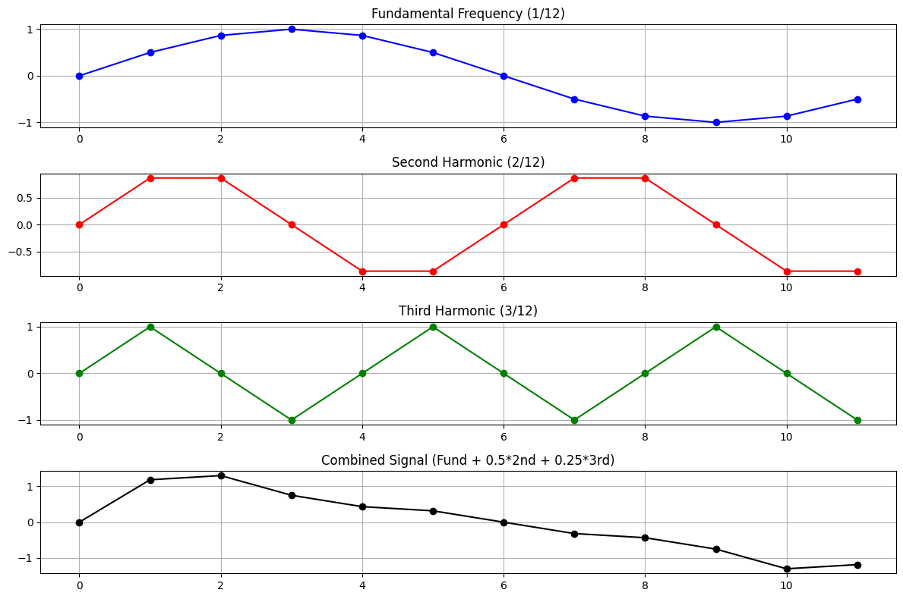
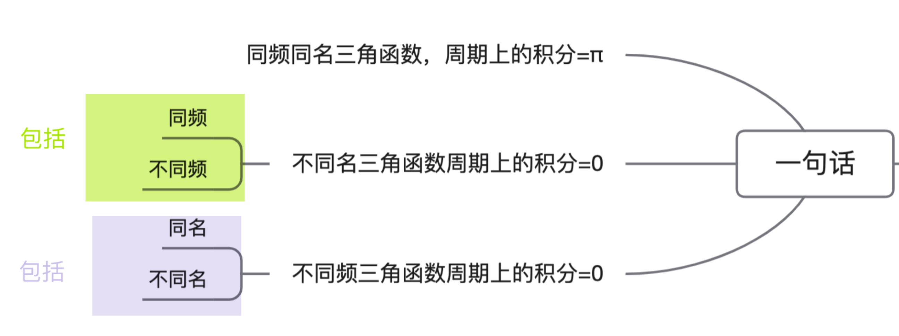
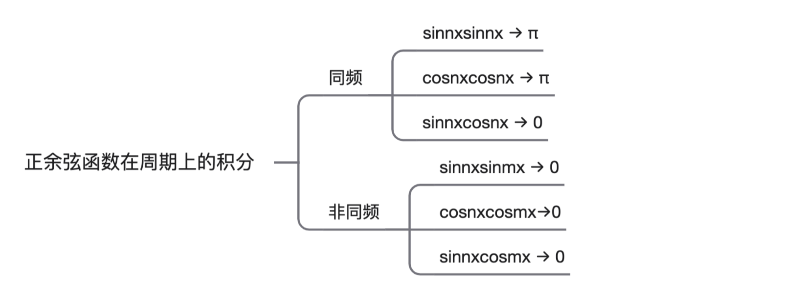
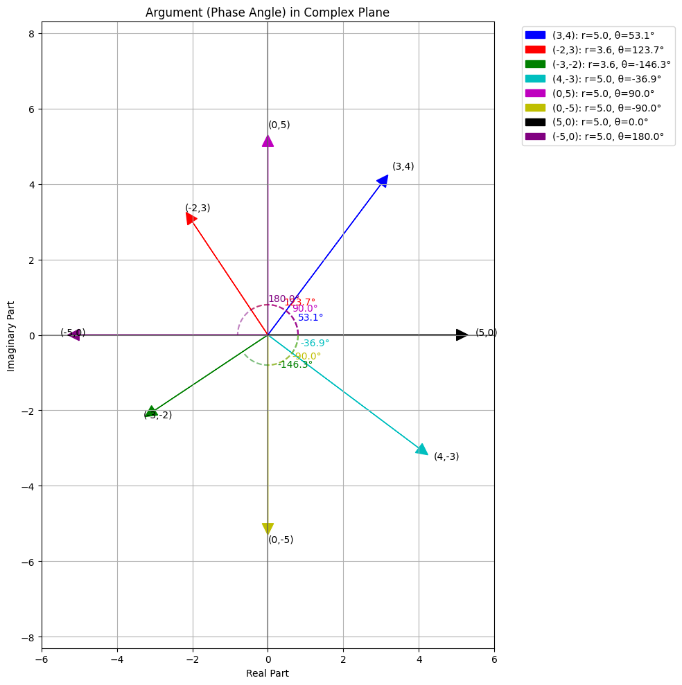
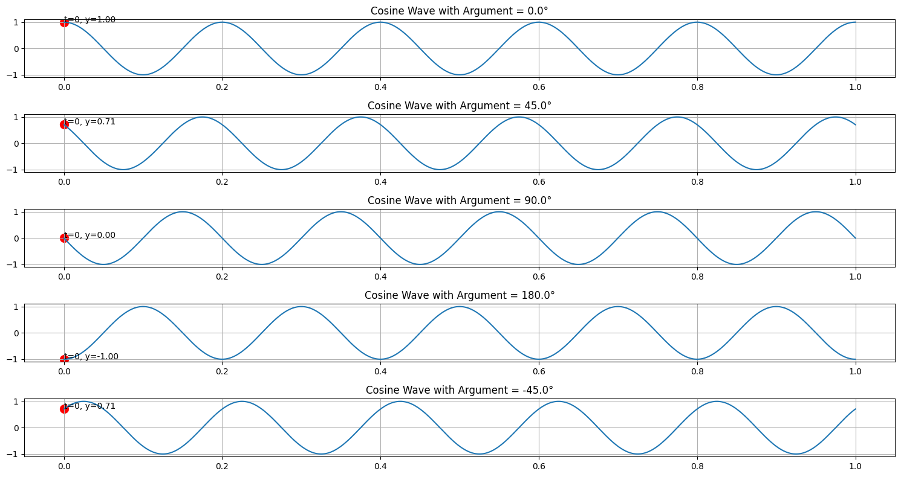

# Fourier基础知识 

[TOC]


## K1：基频和谐波

> - 基频是频率最低的分量，基频对应的周期是最长的
>
> - 谐波频率更高，周期更短
>
>   1	基频在12个点中完成1个完整周期
>   2	第二谐波在12个点中完成2个完整周期，每个周期6个点
>   3	第三谐波在12个点中完成3个完整周期，每个周期4个点

**Fundamental Frequency (1/12):**
[0.0, 0.5, 0.87, 1.0, 0.87, 0.5, 0.0, -0.5, -0.87, -1.0, -0.87, -0.5]
**Second Harmonic (2/12):**
[==0.0, 0.87, 0.87, 0.0, -0.87, -0.87,== -0.0, 0.87, 0.87, 0.0, -0.87, -0.87]
**Third Harmonic (3/12):**
[==0.0, 1.0, 0.0, -1.0==, -0.0, 1.0, 0.0, -1.0, ==-0.0, 1.0, 0.0, -1.0==]



## K2：正交基

**正交基的第一句**：任何向量都可以唯一地表示为这组基向量的线性组合

**正交基的第二句**：正余弦函数在其周期上的积分


- [x] **非同频正余弦三角函数在周期上的积分：** 

$$\int_0^{2\pi} \sin(nx)\sin(mx) dx = 0 \quad \text{当} n \neq m$$ 

 $$\int_0^{2\pi} \cos(nx)\cos(mx) dx = 0 \quad \text{当} n \neq m$$ 

$$\int_0^{2\pi} \sin(nx)\cos(mx) dx = 0 \quad \text{对所有} n, m$$ 

- [x] **同频正余弦函数在周期上的积分**  

 $$\int_0^{2\pi} \sin^2(nx) dx = \pi, \quad \text{当 } n > 0$$ 

$$\int_0^{2\pi} \cos^2(nx) dx = \pi, \quad \text{当 } n > 0$$

 $$\int_0^{2\pi} \cos^2(0x) dx = \int_0^{2\pi} 1 dx = 2\pi \quad \text{(常数项特例)}$$

结论以及文字游戏：



 

**正交基的第三句**：将任何周期函数分解为正弦和余弦函数的和 ➡️ 傅里叶级数

$$f(x) = a_0 + \sum_{n=1}^{\infty} [a_n \cos(nx) + b_n \sin(nx)]$$

$$a_0 = \frac{1}{2\pi}\int_0^{2\pi} f(x) dx$$ 

$$a_n = \frac{1}{\pi}\int_0^{2\pi} f(x)\cos(nx) dx$$ 

$$b_n = \frac{1}{\pi}\int_0^{2\pi} f(x)\sin(nx) dx$$

**正交基第四句的前提**：傅里叶级数适用于周期函数。对于非周期函数，需要傅里叶变换

- [ ] **正交基第四句**：傅里叶变换

- [ ] 当周期趋于无穷大时，傅里叶级数中的离散频率变成连续频率，求和变成积分，得到傅里叶变换

$$F(\omega) = \int_{-\infty}^{\infty} f(t)e^{-i\omega t}dt$$

$e^{-i\omega t} = \cos(\omega t) - i\sin(\omega t)$


- [ ] **正交基第五句**：**DFT & FFT** ||  **离散傅里叶变化 & 快速傅里叶变换**

$$X[k] = \sum_{n=0}^{N-1} x[n]e^{-i2\pi kn/N}$$


---

- [x] **正交基 第二句 & 第三句 一起理解** 

$$f(x) = a_0 + \sum_{n=1}^{\infty} [a_n \cos(nx) + b_n \sin(nx)]$$

$a_0 = \frac{1}{2\pi}\int_0^{2\pi} f(x) dx$

$a_n = \frac{1}{\pi}\int_0^{2\pi} f(x)\cos(nx) dx$

$b_n = \frac{1}{\pi}\int_0^{2\pi} f(x)\sin(nx) dx$

$\int_0^{2\pi} \sin(nx)\sin(mx) dx = \pi\delta_{nm}$

$\int_0^{2\pi} \cos(nx)\cos(mx) dx = \pi\delta_{nm}$

$\int_0^{2\pi} \sin(nx)\cos(mx) dx = 0$

其中$\delta_{nm}$是克罗内克函数。


##  Q 周期为什么是 $2\pi$

**🌺 它是基本正弦函数 $\sin(x)$ 的一个完整周期** 

🌺 **它是所有 $\sin(nx)$ 函数的周期公倍数** 

**🌺 它构成了一个完整的正交系统** 

**<u>解释周期公倍数：</u>** 

对于任意正整数 $n$，$\sin(nx)$ 的周期是 $\frac{2\pi}{n}$。当我们取 $[0,2\pi]$ 作为积分区间时：

- $\sin(1x)$ 在此区间完成 1 个完整周期
- $\sin(2x)$ 在此区间完成 2 个完整周期
- $\sin(3x)$ 在此区间完成 3 个完整周期

这意味着，对于任何整数 $n$，$\sin(nx)$ 在 $[0,2\pi]$ 区间内包含整数个完整周期。

> 对于 $sin(nx)$ 来说， $2\pi$  是基本的最大周期。

- [x] **正交性的数学原理** 

当我们计算积分 $\int_0^{2\pi} \sin(nx)\sin(mx) dx$ 时，我们可以使用三角恒等式：

$$\sin(nx)\sin(mx) = \frac{1}{2}[\cos((n-m)x) - \cos((n+m)x)]$$

所以积分变为：

$$\int_0^{2\pi} \sin(nx)\sin(mx) dx = \frac{1}{2}\int_0^{2\pi} [\cos((n-m)x) - \cos((n+m)x)] dx$$

对于任何非零整数 $k$，$\int_0^{2\pi} \cos(kx) dx = 0$（因为余弦函数在完整周期上的积分为零）。

当 $n \neq m$ 时，$(n-m)$ 和 $(n+m)$ 都是非零整数，所以两项积分都等于零，最终结果是零。

- [x] **函数空间的完备性** 

$[0,2\pi]$ 区间上的三角函数系统 $\{1, \sin(x), \sin(2x), ..., \cos(x), \cos(2x), ...\}$ 构成了平方可积函数空间的一个完备正交基。这意味着任何在此区间上的平方可积函数都可以表示为这些基函数的线性组合。

- [x] **实际例子说明** 

让我们通过一个具体例子来理解：考虑 $\sin(2x)$ 和 $\sin(3x)$。

- $\sin(2x)$ 的周期是 $\pi$
- $\sin(3x)$ 的周期是 $\frac{2\pi}{3}$

如果我们只在一个函数的周期上积分，比如 $[0,\pi]$，另一个函数在此区间不会完成整数个周期，正交性可能不成立。但在 $[0,2\pi]$ 上：

- $\sin(2x)$ 完成了 2 个完整周期
- $\sin(3x)$ 完成了 3 个完整周期

这种情况下，两个函数的乘积在正负区域"恰好平衡"，使积分为零。

- [x] **总结** 

$[0,2\pi]$ 积分区间的选择不是基于单个函数的周期，而是基于建立一个完整正交系统的需要。这个特殊区间确保了:

- 所有 $\sin(nx)$ 函数在此区间上包含整数个周期
- 不同频率的正弦函数在此区间上正交
- 三角函数系统在此区间上构成完备正交基

## Q 高频和低频、波形变换、振荡

> 周期长的，频率低；周期短的，频率高。
>
> ∴ 低频波，周期长（低频，就是 f 值小，周期长，就是 T 值大）
>
> 低频波，周期长，波形变换缓慢，一次完整的振荡需要较长的时间。

## Q 三角函数基础

> $A \sin(\omega t+\phi)$
>
> - $A$ 振幅
> - $\omega$  角频率
> - $\phi$ 初始相位，$t=0$ 时，三角函数波的位置
> - $T = \frac{1}{f}$、$T=\frac{2\pi}{\omega}$ 
> - 从三角函数的表达式上， $\omega$ 与频率成正比，可以直接下结论，$\omega$ 越大，越高频，可以非常直观的看出来
>
> ```
> x = 1.0 * np.sin(2 * np.pi * 5 * t / N)   # 5Hz成分 - 中频
> x += 0.5 * np.sin(2 * np.pi * 10 * t / N)  # 10Hz成分 - 较高频
> x += 0.25 * np.sin(2 * np.pi * 20 * t / N) # 20Hz成分 - 最高频
> ```


## K3 傅里叶级数 & 傅里叶变换

- [ ] **问题：**$$F(\omega) = \int_{-\infty}^{\infty} f(t)e^{-i\omega t}dt$$

概念上的转变：从离散傅里叶级数到连续傅里叶变换

> 要解决这个问题，就得知道 🟩  **补充：傅里叶级数**
>
> **🌺 三角形式的傅里叶级数**：
> $$f(x) = a_0 + \sum_{n=1}^{\infty} [a_n \cos(nx) + b_n \sin(nx)]$$
>
> 🌺 **复指数形式的傅里叶级数**： 
> $$f(t) = \sum_{n=-\infty}^{\infty} c_n e^{i\omega_0 nt}$$
>
> - [x] 等价性的证明。
>
> **🟦 三角形式的傅里叶级数**： 
>
> $$f(x) = a_0 + \sum_{n=1}^{\infty} [a_n \cos(nx) + b_n \sin(nx)]$$
>
> **🟦 复指数形式的傅里叶级数**：
>
> 对于周期为 $T$ 的函数 $f(t)$，其傅里叶级数表示为：
>
> $$f(t) = \sum_{n=-\infty}^{\infty} c_n e^{i\omega_0 nt}$$
>
> 其中 $\omega_0 = \frac{2\pi}{T}$ 是基频，系数 $c_n$ 由以下公式给出：
>
> $$c_n = \frac{1}{T} \int_{-T/2}^{T/2} f(t) e^{-i\omega_0 nt} dt$$
>
> 这里每个频率分量是 $\omega_n = n\omega_0$，是基频 $\omega_0$ 的整数倍，所以是离散的频率值。
>
> 🟪 要证明等价，欧拉公式牢记于心：$e^{i\theta} = \cos(\theta) + i\sin(\theta)$

## Q  Re & Im

- **Re** - 来自拉丁语 "**Re**alis Pars"，意为"实际部分"
- **Im** - 来自拉丁语 "**Im**aginaria Pars"，意为"虚构部分"

**eg：**以复数 $z = a + bi$ 为例：

- 实部：$\text{Re}[z] = a$
- 虚部：$\text{Im}[z] = b$

**eg：在傅里叶分析中的应用**

在傅里叶分析中，复系数 $c_n$ 包含了信号的两类信息：

- $\text{Re}[c_n]$ (实部) - 与余弦分量相关，表示信号的"偶对称"部分
- $\text{Im}[c_n]$ (虚部) - 与正弦分量相关，表示信号的"奇对称"部分

当我们将复指数形式转换为三角形式时，这种分解变得尤为重要：

- 余弦系数 $a_n = 2\text{Re}[c_n]$
- 正弦系数 $b_n = -2\text{Im}[c_n]$

**eg：从几何角度理解实部和虚部：**

- **实部** (Re): 复数在实轴上的投影


（1）表示"水平"分量

（2）与余弦函数相关联（余弦在0处取最大值）

- **虚部** (Im): 复数在虚轴上的投影

（1）表示"垂直"分量

（2）与正弦函数相关联（正弦在0处取值为0）

## K4 复数

复数的模和相角 、复平面、极坐标系

- [x] 对于任意复数 $c = a + bi$：

- **模** $|c| = \sqrt{a^2 + b^2}$：表示复数在复平面上距离原点的距离
- **相角** $\theta = \tan^{-1}(b/a)$：表示复数在复平面上与正实轴的夹角

- [x] （完整表达信息）复数能同时编码两类信息：


- **幅度信息**：通过 $|c_n|$（复数的模）
- **相位信息**：通过 $\arg(c_n)$（复数的辐角）

这使得一个复数 $c_n$ 可以完整描述信号中频率为 $n\omega_0$ 的分量的幅度和相位。

- [x]  复数可以用极坐标形式表示：$c = |c|e^{i\theta}$ （转了多少度，多长。）

- [x] 复平台表示：

任何复数 $c = a + bi$ 都可以在复平面上表示为一个点 $(a, b)$：

- $a$ 是实部，对应横坐标（实轴）
- $b$ 是虚部，对应纵坐标（虚轴）

如图所示：复平面上的相角表示



初始相位、振幅、频率




## K5 直角坐标系、复平面、极坐标

直角坐标与极坐标的关系

复平面上的点可以用两种方式表示：

1. **直角坐标** $(a, b)$：通过实部和虚部定义点的位置
2. **极坐标** $(r, \theta)$：通过到原点的距离(模)和与正实轴的夹角(相角)定义点的位置

这两种表示之间的关系是：

- $a = r\cos\theta$
- $b = r\sin\theta$

反过来：

- $r = \sqrt{a^2 + b^2}$
- $\theta = \tan^{-1}(b/a)$（当 $a > 0$ 时）

## K6欧拉公式

$e^{ix} = cosx+isinx$

##  K7 三角函数与复指数 

$$cosx = \frac{e^{ix}+e^{-ix}}{2}$$

$$ isinx = \frac{e^{ix}- e^{-ix}}{2}$$


