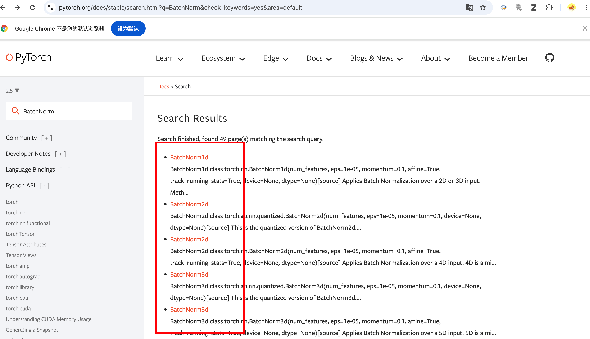
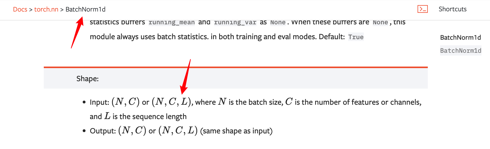

# 5种归一化方法

[45、五种归一化的原理与PyTorch逐行手写实现讲解(BatchNorm/LayerNorm/InsNorm/GroupNorm/WeightNorm)](https://www.bilibili.com/video/BV1Pq4y1a7pH?spm_id_from=333.788.videopod.sections&vd_source=ddd7d236ab3e9b123c4086c415f4939e)


## BatchNorm

> 批归一化、通道级别的归一化

### 官网api，BatchNorm1D & 2D



BatchNorm1D的输入：NCL，用于NLP



BatchNorm2D的输入是四维的，用于图像


一个是三维tensor作为输入

一个是四维tensor作为输入

### BatchNorm1D

 

- 首先，位于torch.nn模块下，是一个class，所以要用的话，需要实例化
- 接下来，看实例化需要接收的参数：
  - num features：输入张量的特征维度，或者通道的数目，或者embedding的大小
  - eps：5种归一化都需要的eps，分母数值稳定性，让分母加上一个微小的量，使得除法能够正常进行，默认1e-05
  - momentum：动量
    - 批归一化在计算均值和方差的时候，momentum通常需要跟track_running_sate联合起来理解，也就是说我们的统计量 通常是通过滑动平均计算出来了，而不是单一时刻的mini batch，是一个累计的过程，为了提高估计的准确度
  - affine：
    - 也就是 gamma & beta，也就是再做完归一化以后，也可以加一个映射，将其映射到一个新的分布上，做一个rescale和recenter

官网定义：


（解释官网定义）均值和标准差是经过整个mini_batch

> 一句话说明 BatchNorm：per channel across mini-batch
>
> 贯穿整个mini batch计算统计量，每个通道单独去算的
>
> gamma 和 beta 是可学习的向量，维度都是C，默认的情况下 $\gamma = 1、\beta=0 $
>
> 标准差用的是有偏估计，也就是计算的标准差是 $\frac{1}{n}$，强调这句话的目的是 ，在计算方差的时候，要用 $\mathrm{unbiased=False}$，这里用得是有偏估计
>
> 在默认情况下，在训练中，会不断的记录历史的均值和方差，并且使用0.1的动量，来做移动的估计，当训练结束以后，用最后一个时刻的估计量来做 inference
>
> 也可以设置 track running states等于false，就是不要记录历史的移动的值

以上是api的介绍

接下来 自己写一个BatchNorm 更好的理解

- [x] NLP的标准数据格式：inputx = torch.randn(batch_size,times_steps,embedding_dim) # $N*L*C$

- [x] 实例化，接收的输入（特征维度，是否进行仿射变换）：batch_norm_op = torch.nn.BatchNorm1d(embedding_dim,affine=False)

- [x] batchnorm的forward函数 接收的数据集格式是 BDN  b表示batch size；D表示model dim；N表示序列长度（符号表示方法的不同

  `bn_y = batch_norm_op(inputx.transpose(-1,-2)).transpose(-1,-2)`

  

```python
import torch

batch_size = 2
times_steps = 3
embedding_dim = 4

inputx = torch.randn(batch_size,times_steps,embedding_dim) # N*L*C

# 1. 实现batch_norm并验证API

## 调用 batch_norm API
batch_norm_op = torch.nn.BatchNorm1d(embedding_dim,affine=False)
bn_y = batch_norm_op(inputx.transpose(-1,-2)).transpose(-1,-2)

## 手写batch_norm
bn_mean = inputx.mean(dim=(0,1),keepdim=True)
bn_std = inputx.std(dim=(0,1),unbiased=False,keepdim=True)
verify_bn_y = (inputx - bn_mean)/(bn_std+1e-5)
print(bn_y)
print(verify_bn_y)
print(torch.allclose(bn_y,verify_bn_y))
```

输出：

```python
tensor([[[-0.3771,  1.7863, -1.0572,  0.2856],
         [-0.7956, -0.0363, -0.7429, -0.1670],
         [ 2.0838,  0.7039,  1.1345,  0.7286]],

        [[-0.5775, -0.3680, -1.1160, -1.3169],
         [ 0.3298, -1.0699,  1.2153, -1.0909],
         [-0.6634, -1.0160,  0.5663,  1.5606]]])
tensor([[[-0.3771,  1.7863, -1.0572,  0.2856],
         [-0.7956, -0.0363, -0.7429, -0.1670],
         [ 2.0838,  0.7039,  1.1345,  0.7286]],

        [[-0.5775, -0.3680, -1.1160, -1.3169],
         [ 0.3298, -1.0699,  1.2153, -1.0909],
         [-0.6634, -1.0160,  0.5663,  1.5606]]])
True
```

解释：去看图解BN&LN

需要强调：

- 在batch和长度这一维计算统计量
- 计算标准差的时候，用的是有偏估计，设置unbiased=false


## LayerNorm


层归一化的概括：per sample、per Layer，对单一样本、每一个层 单独计算，不需要考虑minibatch

LayerNorm最典型的使用场景：NLP

把网络中 每一次 每一个时刻 当成一层

每个时刻 embedding dim计算均值和方差 

- [x] 为什么nlp中使用LN？

应为nlp中，不同句子长度是不一样的，也就是说 对于每个batch中的 或者 句子中 词数是不一样的；或者测试时，句子的长度可能训练时也没见过，而BatchNorm是across batch的，所以最好抱枕batch内部L是固定的

一句话：句子中词的数量并不一样

### 语言描述实际意义：

#### for nlp：

- [x] LayerNorm对 每个词进行归一化  bnd   dim=2？  （有几个词就有得到几个均值和方差，然后进行归一化）b×n×1

举数学例子：2个句子、每个句子3个词，每个词的维度4，那么我们得到6个均值和方差，所以归一化后的维度  2×3×1

$\rightarrow$

$\rightarrow$

$\rightarrow$

$\rightarrow$

$\rightarrow$

$\rightarrow$

- [x] BatchNorm 对词的特征维归一化 bnd dim=0,1  1×1×d（有几个特征维度，就会得到几个均值和方差）  $\downarrow$ $\downarrow$ $\downarrow$ $\downarrow$ $\downarrow$ $\downarrow$

2×3×4 得到 1×1×4 也就是4个均值，细节也不用扣这么细，直接keepdim=true

#### for cv：

- [ ] LayerNorm  bchw 看做。。 ；c 依然是独立的词，表达不同的语义；

- [x] BatchNorm 把 通道 作nlp中的独立 词、token，对于高度和宽度以及空间分布 不做区分 可以理解为 bc(hw)，类比到nlp，一个通道的信息，由长度为h*w的向量表示，保留通道信息，沿着样本维度进行归一化，其实也是引入了其他样本的噪声   bchw  $ \rightarrow$  b×c×hw  dim=0,2,3

数学小例子：4张图，3通道，2×2的图，BN以后，得到 3个均值和方差 

4×3×2×2 $\rightarrow$ 1×3×1×1

BatchNorm的api中，需要的数据格式是NCL，而不是常用的NLC，可能原因就是bn通常用在cv

#### cv nlp bn ln

- [x] 大概是 理解为

- bn（得到均值向量）

 4张图，每张图片 3个通道特征，每个通道 由4个元素表达（2×2）（得到3个均值）（cv&bn）

2个句子，每个句子3个词，4维度（得到4个均值）（nlp&bn）

- ln

- [ ] 4张图，3个通道特征

### 官方api


LayerNorm只有一个api

同样也是一个class，如果要去实例化的话，只需要指定一下 被归一化的形状，以及是否需要进行缩放变换

也就是说接收的输入：

- normalized_shape：被归一化的形状
- elementwise_affine：是否需要进行缩放变换

接下来看定义：


- 这里的均值和方差是在最后一个维度计算的（over the last dimension）对于 over across minibatch
- D就是 我们要传入的 normalized shape
- 在nlp中 通常只需要传入标量就好了，就是计算最后的embedding的维度

### 代码实现

```python
import torch

batch_size = 2
times_steps = 3
embedding_dim = 4

inputx = torch.randn(batch_size,times_steps,embedding_dim) # N*L*C
# 2. 实现layer_norm 并验证api

## 调用 layer_norm API
layer_norm_op = torch.nn.LayerNorm(embedding_dim,elementwise_affine=False)
ln_y = layer_norm_op(inputx)

## 手写layer_norm
ln_mean = inputx.mean(dim=-1,keepdim=True)
ln_std = inputx.std(dim=-1,keepdim=True,unbiased=False)
verify_bn_y = (inputx - ln_mean)/(ln_std + 1e-05)
# print(ln_mean.shape) torch.Size([2, 3, 1])
# print(ln_std.shape)  torch.Size([2, 3, 1])
# print(ln_y.shape)   torch.Size([2, 3, 4])
# print(verify_bn_y.shape)    torch.Size([2, 3, 4])
# print(torch.allclose(ln_y,verify_bn_y)) True
```


==bn（得到均值向量）==

 4张图，每张图片 3个通道特征，每个通道 由4个元素表达（2×2）（得到3个均值）（cv&bn）

> 4322→1311

2个句子，每个句子3个词，4维度（得到4个均值）（nlp&bn）

> 234→114

==ln(得到均值矩阵)==

对于LN 一定要明白：per smaple、per layer

对于CV per sample就是一张图片

对于NLP per layer 就是一个词

4张图，每张图片 3个通道特征，每个通道 由4个元素表达（2×2）（得到4个均值 per sample）

> 4322 →4111

2个句子，每个句子3个词，4维度（得到6个均值）（nlp&bn）

> （234→231）

## 代码实现 BN、LN&NLP&CV

nlp&BN&LN

```python
import torch

batch_size = 2
times_steps = 3
embedding_dim = 4

inputx = torch.randn(batch_size,times_steps,embedding_dim) # N*L*C

# 1. 实现batch_norm并验证API

## 调用 batch_norm API
batch_norm_op = torch.nn.BatchNorm1d(embedding_dim,affine=False)
bn_y = batch_norm_op(inputx.transpose(-1,-2)).transpose(-1,-2)

## 手写batch_norm
bn_mean = inputx.mean(dim=(0,1),keepdim=True)
bn_std = inputx.std(dim=(0,1),unbiased=False,keepdim=True)
verify_bn_y = (inputx - bn_mean)/(bn_std+1e-5)
# print(bn_mean.shape) torch.Size([1, 1, 4])
# print(bn_std.shape) torch.Size([1, 1, 4])
# print(bn_y.shape)   torch.Size([2, 3, 4])
# print(verify_bn_y.shape)    torch.Size([2, 3, 4])
# print(torch.allclose(bn_y,verify_bn_y)) True

# 2. 实现layer_norm 并验证api

## 调用 layer_norm API
layer_norm_op = torch.nn.LayerNorm(embedding_dim,elementwise_affine=False)
ln_y = layer_norm_op(inputx)

## 手写layer_norm
ln_mean = inputx.mean(dim=-1,keepdim=True)
ln_std = inputx.std(dim=-1,keepdim=True,unbiased=False)
verify_bn_y = (inputx - ln_mean)/(ln_std + 1e-05)
# print(ln_mean.shape) torch.Size([2, 3, 1])
# print(ln_std.shape)  torch.Size([2, 3, 1])
# print(ln_y.shape)   torch.Size([2, 3, 4])
# print(verify_bn_y.shape)    torch.Size([2, 3, 4])
# print(torch.allclose(ln_y,verify_bn_y)) True
```

CV&BN&LN

```python
import torch

batch_size = 4
channels = 3
h,w = 2,2

inputx = torch.randn(batch_size,channels,h,w) # BCHW 只要维度是正确的，数字可以随便生成

# 1. 实现batch_norm并验证API

## 调用 batch_norm API
batch_norm_op = torch.nn.BatchNorm2d(channels,affine=False)
bn_y = batch_norm_op(inputx) # torch.Size([4, 3, 2, 2])

## 手写batch_norm
bn_mean = inputx.mean(dim=(0,2,3),keepdim=True) # torch.Size([1, 3, 1, 1])
bn_std = inputx.std(dim=(0,2,3),unbiased=False,keepdim=True) # torch.Size([1, 3, 1, 1])
verify_bn_y = (inputx - bn_mean)/(bn_std+1e-5) # torch.Size([4, 3, 2, 2])

# print(bn_mean.shape) 
# print(bn_std.shape) 
# print(bn_y.shape)   
# print(verify_bn_y.shape)    
# print(torch.allclose(bn_y,verify_bn_y))
'''
    torch.Size([1, 3, 1, 1])
    torch.Size([1, 3, 1, 1])
    torch.Size([4, 3, 2, 2])
    torch.Size([4, 3, 2, 2])
    True
'''
# 2. 实现layer_norm 并验证api

## 调用 layer_norm API
layer_norm_op = torch.nn.LayerNorm((channels,h,w),elementwise_affine=False)
ln_y = layer_norm_op(inputx)  # torch.Size([4, 3, 2, 2])

## 手写layer_norm
ln_mean = inputx.mean(dim=(1,2,3),keepdim=True)  # torch.Size([4, 1, 1, 1])
ln_std = inputx.std(dim=(1,2,3),keepdim=True,unbiased=False)  # torch.Size([4, 1, 1, 1])
verify_bn_y = (inputx - ln_mean)/(ln_std + 1e-05)   # torch.Size([4, 3, 2, 2])
print(ln_mean.shape)
print(ln_std.shape)
print(ln_y.shape)
print(verify_bn_y.shape)
print(torch.allclose(ln_y,verify_bn_y))
'''
    torch.Size([4, 1, 1, 1])
    torch.Size([4, 1, 1, 1])
    torch.Size([4, 3, 2, 2])
    torch.Size([4, 3, 2, 2])
    True
'''
```

纯享版：

for 句子

```python
import torch

batch_size = 2
times_steps = 3
embedding_dim = 4

inputx = torch.randn(batch_size,times_steps,embedding_dim) # N*L*C

# 1. 实现batch_norm并验证API

## 调用 batch_norm API
batch_norm_op = torch.nn.BatchNorm1d(embedding_dim,affine=False)
bn_y = batch_norm_op(inputx.transpose(-1,-2)).transpose(-1,-2)

## 手写batch_norm
bn_mean = inputx.mean(dim=(0,1),keepdim=True)
bn_std = inputx.std(dim=(0,1),unbiased=False,keepdim=True)
verify_bn_y = (inputx - bn_mean)/(bn_std+1e-5)
print(torch.allclose(bn_y,verify_bn_y)) 

# 2. 实现layer_norm 并验证api

## 调用 layer_norm API
layer_norm_op = torch.nn.LayerNorm(embedding_dim,elementwise_affine=False)
ln_y = layer_norm_op(inputx)

## 手写layer_norm
ln_mean = inputx.mean(dim=-1,keepdim=True)
ln_std = inputx.std(dim=-1,keepdim=True,unbiased=False)
verify_bn_y = (inputx - ln_mean)/(ln_std + 1e-05)
print(torch.allclose(ln_y,verify_bn_y)) 
```

for  图片

```python
import torch

batch_size = 4
channels = 3
h,w = 2,2

inputx = torch.randn(batch_size,channels,h,w) # BCHW 只要维度是正确的，数字可以随便生成

# 1. 实现batch_norm并验证API
## 调用 batch_norm API
batch_norm_op = torch.nn.BatchNorm2d(channels,affine=False)
bn_y = batch_norm_op(inputx) 

## 手写batch_norm
bn_mean = inputx.mean(dim=(0,2,3),keepdim=True) 
bn_std = inputx.std(dim=(0,2,3),unbiased=False,keepdim=True) 
verify_bn_y = (inputx - bn_mean)/(bn_std+1e-5)
print(torch.allclose(bn_y,verify_bn_y))


# 2. 实现layer_norm 并验证api

## 调用 layer_norm API
layer_norm_op = torch.nn.LayerNorm((channels,h,w),elementwise_affine=False)
ln_y = layer_norm_op(inputx) 

## 手写layer_norm
ln_mean = inputx.mean(dim=(1,2,3),keepdim=True) 
ln_std = inputx.std(dim=(1,2,3),keepdim=True,unbiased=False)  
verify_bn_y = (inputx - ln_mean)/(ln_std + 1e-05)  
print(torch.allclose(ln_y,verify_bn_y))

```

## Instance Norm


实例归一化，通常用在 风格迁移上

per sample、per channel

这时计算均值和标准差的时候，是对每一个样本的、每一个维度

<u>官网api</u>


- 是一个class
- `num_features`：要实现一个Instance Norm的话，需要传入特征维度或者说 通道维度（model dim 可以理解为 channel），因为 我们要逐样本，逐通道的进行归一化
- `affine`：也可以进行仿射变换，但大部分情况下，是设置为false的，一般是直接归一化即可


### INSTANCE1D

代码实现需要注意，接收的输入数据格式是什么样的，输出的数据格式又是什么样的，看官网api


NCL

for nlp：嵌入维度放到中间、词数滞后

for cv：**INSTANCE2D** ：bchw 不变

就很类似BatchNorm

所以会有两次转置

### 图示

#### for NLP


#### for CV


### 代码实现

#### For nlp InstanceNorm1d

```python
# 3. 实现instance_norm并验证API

## 调用ins_norm并验证API
ins_norm_op = torch.nn.InstanceNorm1d(embedding_dim)
in_y = ins_norm_op(inputx.transpose(-1,-2)).transpose(-1,-2)

## 手写ins_norm
in_mean = inputx.mean(dim=1,keepdim=True)
in_std = inputx.std(dim=1,keepdim=True,unbiased=False)
verify_in_y = (inputx - in_mean)/(in_std+1e-5)
print(torch.allclose(in_y,verify_in_y))
```

解释：

- [x] inputx.shape = torch.Size([2, 3, 4])
- [x] in_y.shape = torch.Size([2, 3, 4])
- [x] in_mean.shape = torch.Size([2, 1, 4])

#### For cv InstanceNorm2d

```python
# 3. 实现instance_norm并验证API

## 调用ins_norm并验证API
ins_norm_op = torch.nn. (channels)
in_y = ins_norm_op(inputx.transpose(-1,-2)).transpose(-1,-2)
# print(inputx.shape) torch.Size([4, 3, 2, 2])
## 手写ins_norm
in_mean = inputx.mean(dim=(2,3),keepdim=True)
# dim=(2,3) print(in_mean.shape) torch.Size([4, 3, 1, 1])
#dim=1  print(in_mean.shape) torch.Size([4, 1, 2, 2])
in_std = inputx.std(dim=(2,3),keepdim=True,unbiased=False)
verify_in_y = (inputx - in_mean)/(in_std+1e-5)
print(torch.allclose(in_y,verify_in_y))
```

- [x] dim=(2,3) || in_mean = inputx.mean(dim=(2,3),keepdim=True)