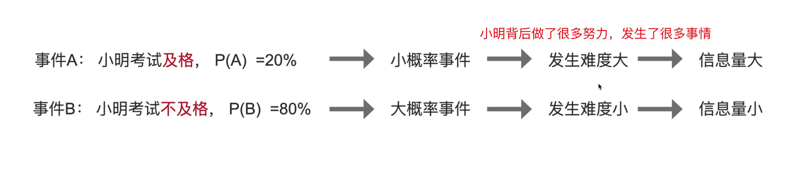
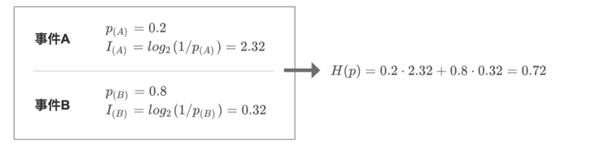
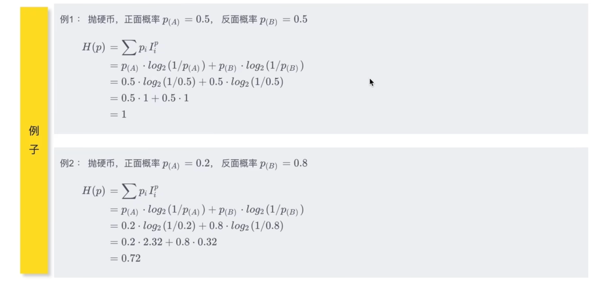
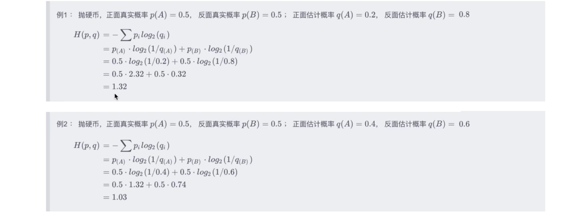

# KL divergence

[信息量 ｜熵 ｜ 交叉熵 ｜KL散度 （相对熵）｜交叉熵损失函数](https://www.bilibili.com/video/BV1L8411X7ZZ/?spm_id_from=333.337.search-card.all.click&vd_source=ddd7d236ab3e9b123c4086c415f4939e)

## 	1 前言

**信息量** 

$I(x) = \log_2{\frac{1}{p(x)}} = -\log_2{p(x)}$ 

**熵**

$H(P)=\sum p_iI_i^p=-\sum p_i \log_2(p_i)$

**交叉熵**

$H(p,q) = \sum p_i I_i^q = -\sum p_i log_2(q_i)$

**相对熵（KL散度）**

$D_{KL}(p||q) = \sum p_i \log_2 \frac{p_i}{q_i}$

**交叉熵损失函数（Cross Entropy Loss）**

$H(p,q) = -\log_2 (q_{class})$

逐步递进，后面的概念建立在前面的概念基础之上

## 	2 信息量

信息量 Amount of Information

**定义：**

事件包含的信息量大小（事件发生的难度有多大）

- 小概率事件，它发生的难度比较大，所以有较大的信息量
- 大概率事件，它发生的难度比较小，所以有较小的信息量

**例子：**

**性质：**

对于独立事件A、B：$P(AB)=P(A)P(B)$

两个事件同时发生的信息量 等于 两个事件的信息量 相加 ：$I(AB)=I(A)+I(B)$

**信息量公式：**

$I(x):= \log_2(\frac{1}{p(x)})=-log_2(p(x))$

-  `:=`  表示 `定义为` ，是一种人为定义
- `=`  是数学意义上的 `左边 = 右边`
-  `I`  : `information`
- 公式怎么设计的？

> （1）$p(x)$ ：表示事件发生的概率，取值范围： $0 \leq p(x) \leq 1$
>
> （2）概率 $p(x)$ 和 信息量 $I(x)$  是 负相关的 $\rightarrow$ $I(x):=\frac{1}{p(x)}$
>
> （3）两个事件同时发生的信息量 等于 两个 事件的信息量相加 $I(AB)=I(A)+I(B)$
>
> > $I(AB)=log_2\frac{1}{P(AB)}=log_2\frac{1}{P(A)P(B)}=log_2\frac{1}{P(A)}+log_2\frac{1}{P(B)} = I(A)+I(B)$
> >
> > 信息量的定义：log以2为底概率分之一
>
> （4）以2为底，是转换到二进制下表示复杂度（以e为底、以10为底都可以，只是以2为底更优）

**计算信息量的例子：**

信息量的定义：log以2为底概率分之一

## 	3 熵

熵 Entropy

**定义：**

1、概率分布的信息量期望

2、系统整体的信息量

系统整体由所有可能发生的事件构成

例子：抛硬币，正面和反面 构成一个系统

**公式：**

$H(P)=\sum p_i I_i = \sum p_i \log_2 \frac{1}{p_i} = -\sum p_i \log_2 p_i$

计算实例：

**作用：**

用来评估 概率模型 的不确定程度

- 不确定性越大，熵越大
- 不确定性越小，熵越小

图示：

- 概率完全相等时，我们完全不确定哪个会发生
- 对于 第二张图，第三个事件的概率高一些，所以更有可能发生，也就是说 这个系统的熵小一些

**例子：**

从例子中可以得出结论：（例1 系统的熵 > 例2 的熵）

- 若概率密度均匀，产生的随机变量不确定性就更高，则熵的值就更大
- 若概率密度聚拢，产生的随机变量不确定性就更低，则熵的值就更小

**总结：**

如果一个系统中只有两个事件A、B，且事件A发生的概率P(A)，事件B发生的概率 P(B)，那么这个系统的熵：

H(P) = P(A)I(A)+P(B)I(B)

 $= P(A)log_2\frac{1}{P(A)} + P(B)log_2\frac{1}{P(B)}$

$H(P)=\sum_{i=1}^nP_iI(i)$   $\sum_iP_i = 1$

## 	4 交叉熵

交叉熵 cross entropy  

==定义：==

假设 真实概率分布为 p，预测概率分布为 q，则预测概率分布q 对 真实概率分布p的平均信息量的估计，叫做交叉熵

- （预测概率分布 也叫 估计概率分布）

==公式：==

$H(p,q)=\sum p_iI_i^q=-\sum p_i \log_2(q_i)$

$H(p,q) = \sum p_iI(q_i)$

==例子：==

由例子的结果，观察可知：

（1）预估爱侣分布 与 真实概率分布 越接近，交叉熵越小

（2）交叉熵的值 总是大于 熵的值 （根据 吉布斯不等式）

（3）对于例子中，$P(A)=P(B)=\frac{1}{2}$

熵 $H(P)=1$

但是计算出来的 交叉熵 $H(p,q)>H(p)$

==补充：吉布斯不等式==

若 $\sum_{i=1}^np_i=\sum_{i=1}^nq_i=1$，且 $p_i，q_i \in (0,1]$，则有：

$-\sum_{i=1}^np_ilogp_i\leq-\sum_{i=1}^np_ilogq_i$

等号成立，当且仅当 $p_i =q_i \ {\forall} i$

> 真实概率的熵 永远 小于等于 交叉熵

## 	5 KL散度（相对熵）

相对熵 Relative Entropy、KL散度 （KL divergence、Kullback-Leibler divergence）

==作用：== 

用于衡量2个概率分布之间的差异

根据后面的公式，两个分布之间的差异，就是两个分布信息量的差

==公式：==

$D_{KL}(p||q) = \sum p_i (I_q-I_p)$  、 $I_q - I_p$  为信息量之差

$=\sum p_i(log_2\frac{1}{q_i}-log_2\frac{1}{p_i})$

$=\sum p_ilog_2\frac{1}{q_i}-p_ilog_2\frac{1}{p_i}$

$=H(p,q)-H(p)$  （所以叫 相对熵、或者 $H(p)=H(p,p)$）

$= \sum p_i log_2\frac{p_i}{q_i}$  (常用的展开式)

- $p和q的交叉熵 - p的熵$

==重要性质：==

（1）$D(p||q)$ 与 $D(q||p)$ 不一样，即 $D(p||q) \neq D(q||p)$

> - $D(p||q)$  表示 以$p$为基准（$p$为真实概率分布），估计概率分布 $q$ 与 真实概率分布 $p$之间的差距
> - $D(q||p)$ 表示 以$q$为基准（$q$为真实概率分布），估计概率分布$p$与真实概率分布$q$之间的差距
> - 前面的分布作为 真实概率分布，计算`真实分布与估计分布之间的交叉熵-真实分布的信息熵`

（2）$KL散度的值 \geq 0$    $\iff$ $D_{KL}(p||q) \geq 0$

> 吉布斯不等式说明：
>
> 
>
> 所以   $D_{KL}(p||q) \geq 0$
>
> 特别的，当分布 $q$与分布$p$完全一样时，$D(p||q)=0$
>
> 真实概率p的熵 $\leq$  p和q的交叉熵
>
> 所以 $D_{KL}(p||q)=H(p,q)-H(p) \geq 0$

## 	6 交叉熵损失函数

交叉熵损失函数 Cross Entropy Loss

由上可知，KL散度$D(p||q)$ 表示 预测分布q 与真实分布p 之间的差距，所以 我们可以直接将 损失函数 定义为 KL散度：$Loss = D(p||q)$

==损失函数 = KL散度==

并且我们希望 模型的预测分布q 与 真实分布p 完全相同，即：损失函数 $Loss=D(p||q)=0$

损失函数：

$Loss = D(p||q)=H(p,q)-H(p)$

- p与q的交叉熵 - p的信息熵
- p是真实分布
- $D(p||q)=H(p,q)-H(p)=\sum p_i log_2(\frac{1}{q_i})-\sum p_ilog_2\frac{1}{p_i}$

对于分类问题：

- 交叉熵损失函数一般用于分类问题，分类问题一般是一个单点分布
- $\iff$ 等价于 真实类别 概率 = 1，其他类别概率 = 0

真实分布是一个单点分布，真实类别的概率为1，其他类别的概率为0，类似如下：

|     类别 | class1     |  class2    |    class3  |   class4   |
| ---- | ---- | ---- | ---- | ---- |
|  概率    |  0    |   0   |   1   |  0    |

- $p_{class1} = p_{class2} = p_{class4} = 0$
- $\log2(\frac{1}{p_{classs3}}) = 0 $ 
- 所以，$H(p)=\sum p_i I(p_i) = \sum p_i log_2{\frac{1}{p_i}}=0$

> 推导：
>
> 首先有 损失：
>
> $Loss = D(p||q)=H(p,q)-H(p) = \sum p_i log_2(\frac{1}{q_i})-\sum p_ilog_2\frac{1}{p_i}$
>
> 由，$H(p)=0$
>
> ∴ $Loss = H(p,q)-H(p) = H(p,q)$
>
> 由 $H(p,q)$ 是交叉熵，所以损失函数 又称为 交叉熵损失函数：
>
>  $Cross\_Entropy\_Loss = H(p,q) = \sum p_i log_2\frac{1}{q_i}$
