# RNN

ref：[【29、PyTorch RNN的原理及其手写复现】](https://www.bilibili.com/video/BV13i4y1R7jB/?share_source=copy_web&vd_source=5cbbeafd6fa2338b041c25f100ea6483)

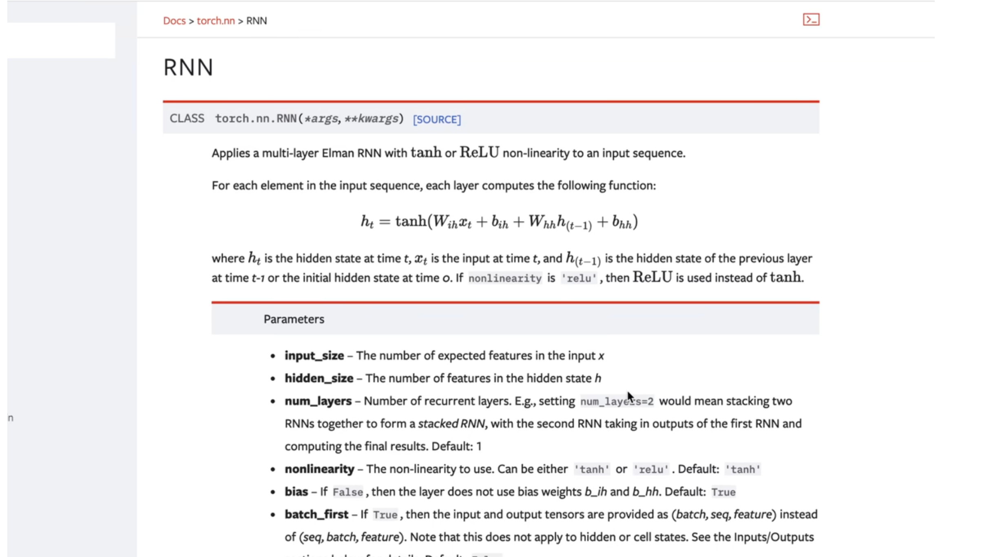

topic：

（1）不同类型的RNN的图示以及应用场景的图示

（2）介绍pytorch中RNN的api的使用

（3）通过代码验证 RNN 内部是如何计算的，通过代码来 验证 pytorch的RNN的api 并对比结果

## k1 记忆单元分类


- [x] 什么是记忆单元？

记忆单元就是 存储的 过去的历史信息

- [x] 什么是循环神经网络？

所谓循环神经网络 就是说，在对序列进行建模的时候，在算每一时刻的表征的时候，一般考虑过去的 历史信息。这个历史信息 就是通过 记忆单元 保存的。然后每个时刻 我们都会从 记忆单元中 获取 过去的 历史信息，然后辅助当前时刻 做预测。

- [x] 记忆单元分类

关于记忆单元 一般有三类

1. RNN
2. LSTM
3. GRU 

> 一类 比如说 RNN，比如说 Simple RNN，简单的RNN 结构，等下实现的也是 简单的RNN结构
>
> 另外两种是 GRU和LSTM，这两种网络的记忆性会更强一点；计算复杂度也会更高一点；使用频率也会更高一点，就是说 现在很多的实际应用中，我们基本使用的是LSTM或者GRU；但是它们都是RNN的一个变体，所以RNN是基础；

## 	k2 模型的分类

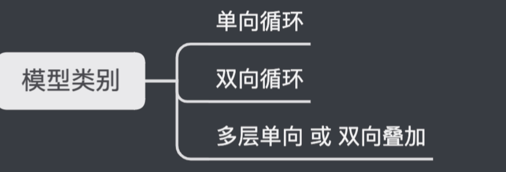

（1）单向循环

> 循环神经网络也可分为单向循环，所谓单向循环就是，当前时刻的预测 只跟 过去有关，从左到右 递归的计算。

（2）双向循环

> 双向循环，双向循环就是说 不只有 从左到右的 也有 从右到左的，就是说有两条链，另外一条链，在计算当前时刻的预测的时候 会考虑 未来信息。

（3）多个单向 、 多个双向

> 这个就是双向循环；那还可以把 多个单向 或者说 多个双向 叠加起来，也就是deep RNN 深度循环神经网络


（1）单向的循环神经网络


可以分为三层：

1. 最下面一层是 input layer，也就是输入层；
2. 中间是隐含层；
3. 最后是输出层；

> 下面的输入层每一个神经元 可以看做 每一个时刻；
>
> 也就是说 每一个时刻 不仅跟当前时刻的输入有关，还跟上一时刻的记忆单元有关；
>
> 并且在单向循环神经网络 中 始终是 从左到右的；
>
> 就是说当前时刻的预测 只跟 过去的记忆单元 有关，跟未来的 是无关的；

（2）双向的循环神经网络


1. 有两条链
2. 分为4个部分：  **input layer、output layer、forward layer、backward layer**
3. **（forward layer）**  forward layer是从左到右的循环 ，意思就是说 在 forward layer的输出中，它的输出不仅跟当前输入有关 也跟过去的记忆单元有关；
4. **（backward layer）**  backward layer当中，它的当前时刻的输出 不仅跟当前时刻的输入有关，还跟未来时刻的记忆单元有关，所以是 从右到左的 递归运算的。
5. **（将forward和backward结合）**起来有什么好处呢？ 就是说 既能看到过去 又能看到未来

## 	k3 语音识别模型性能比较


> 这张表格 来自某篇论文，这张表格 很好的 展示了 RNN、LSTM、 双向 单向、MLP、以及是否delay等 在参数数量相等的情况下 在语音识别上的表现；可以看到 第二列 第三列 分别是训练误差和测试误差；
>

 通过表格 可以看到 不同的模型在 语音识别 这种 序列建模，序列分类这个任务上的表现


（1）第一行是MLP，MLP就是简单的DNN 是no window的（什么意思？）

> 我们把语音 分成很多帧，比方说一帧是 15毫秒 或者 20毫秒，对于每一帧 提取一个特征 比如说 傅里叶变换 得到一个频谱特征，然后 我们对每一帧 进行单独建模，所谓 no window就是 我们不考虑 周围的帧，只考虑 当前这个15毫秒，然后 我们 把它送入 DNN中，来去 进行一个 预测 分类，这样做的话 它的 训练误差 和测试误差 大概都是在 40% 左右；


（2）（10 frame window、stride）

> 第二行 MLP 10帧作为一个窗 意思是 我们现在 同样还是MLP，但是 现在MLP的 输入 不仅是 只有一帧的特征，而是把 每10帧 放到一起，那么这里是否有stride，就是说 这10帧 到底有没有交叠 并没有介绍，总之 第二行这个 输入 比 第一行 覆盖的 时间窗口 会更大一点 ；
>
> 那么这样可以看到 这个误差，显著的从 46% 降到 32%，这个结果说明 在语音识别 这个序列建模 任务中，当我们把 上下文特征 一起考虑的话 效果会 更好；这是第二行。

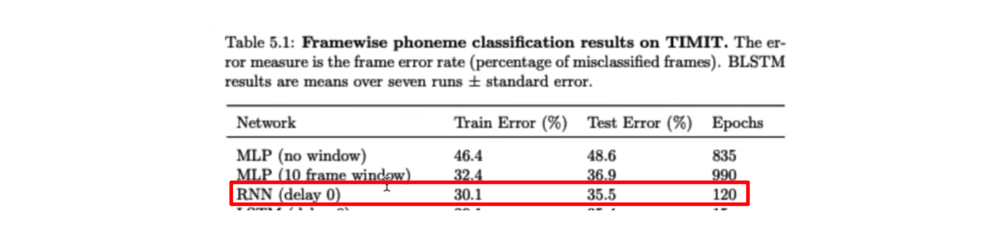

**（3）delay**

第三行，将MLP换成了 循环神经网络，一个简单的RNN 模型，并且括号 delay 0，等下会解释 什么叫delay，这里的意思就说，就是说 把 每一帧特征 像 第一幅图一样，比如说

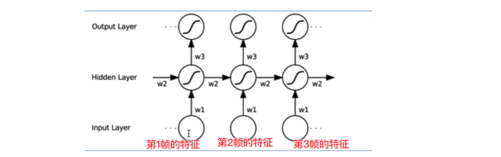

这里是第一帧的特征，这里是第二帧的特征，这里是第三帧的特征，我们把每一帧的特征 送入到RNN中，通过中间的隐含层 对历史信息 进行更新，这样的网络 错误率也是相比MLP 更进一步，看到训练误差到30%，测试误差是35%，相比于上面 10帧的MLP，效果更好。

**（4）LSTM**

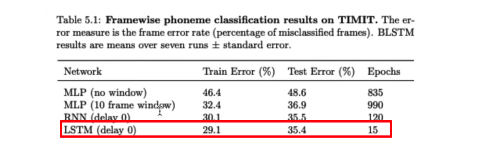

- 接下来 如果我们把RNN，替换成LSTM，效果更进一步
- 都是delay 0


**（5）LSTM+backwards**

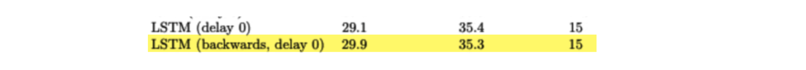

再下面一步，还是LSTM，只是把输入 翻转过来，也就是把input序列倒过来，再输入到网络中，误差是差不多的，所以 仅仅是一条链的话，不论是正向识别，还是反向识别 其实效果是差不多的

**（6）RNN delay 3**


对输入进行改造，首先可以看到 同样是用 RNN网络，这里 对它 进行 delay 三帧，然后可以看到 它的效果 相比于原本的 RNN 从30% 降低到 29%，测试误差 也是从 35% 降低到 34%；

- [x] 那么这个 delay 3 帧是什么意思呢？


delay 3 帧的意思就是说，当 喂入 三帧 作为 输入的时候，前面 这三个输出，先不要，

就是说 先拿 三帧输入 送入到网络中 让它先对记忆单元 去 更新三步 ，然后到第四步（帧）的 输入的时候，才 把 输出拿出来， 作为 第一帧的预测值，这个就是delay 3的意思

- [x] 为什么 delay 3 帧效果有效？

如果 不做delay的话 ，在 输入 第一帧的 特征的时候，它的预测的输出 只能 看到当前的第一帧，范围就很小；

但是当 delay 三帧的时候 预测第一帧的输出 其实就看到了 三帧，它看到了 第一帧、第二帧、第三帧 都进入了 记忆单元中；

以上就是 delay RNN的结构；

- [x] 再次解释 delay

 delay 能够在 短暂 的 牺牲 时延的情况下，提高精度，看到更宽的上下文

> 有 delay 的话，在预测第一帧的输出的时候 肯定会 稍微 延迟一点，因为 如果 不做 delay的话，我们就直接 算一步就好了，如果delay 三帧的话，那在预测第一帧的输出的时候，需要计算 三步，所以肯定会有 一定时延的。但是这个时延 确实能够 使得 预测的效果更好，因为它看到的上下文 会 更宽一点；以上是delay的意思。

**（7）B** 

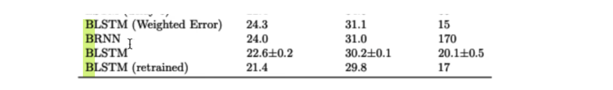

**双向的LSTM、RNN**


-  RNN delay三帧 和LSTM delay 五帧 效果都有不同程度的增加；
- 双向的结果比delay 和 单向的 效果都要好；
- 训练集 错误率从29%降低到24%；
- 测试集错误率也是明显降低；

<u>双向、delay</u> 

- 表示 看到了未来的信息；
- 当 delay三帧的话，在预测第一帧的输出的时候 其实是看到了第二帧、第三帧、第四帧  指的是 看到了未来的三帧的
- 当预测 第二帧的输出的时候 同样 看到第三帧、第四帧、第五帧
- 虽然也看到了未来的信息，但看到未来的信息还是不够长；

- 如果把单向 换成双向的网络的话，那么整个未来的特征 和 过去的 特征，网络都能看到，这就是说双向的范围 更大一点；

> - 单向delay 3：输出第一帧看到的是 输入第一帧、第二帧、第三帧
>
> - 双向delaye 3：输出第一帧，看到的是第一帧、第二帧、第三帧+第四帧、第五帧、第六帧 

<u>双向的缺点</u>

需要完全的 把整个输入特征序列 送入到网络中 ，最后才能得到输出

> 而单向带时延的情况就不需要把整个特征 都算出来 才能预测第一帧，只要有三帧了，就可以预测第一帧了；
>
> 所以单向带时延的，响应速度会更快；
>
> 双向的响应速度肯定是最慢的；
>
> 所以在速度 和效果上 需要 取得一个比较好的平衡 才能满足具体的业务需求。

## 	k4 循环神经网络的优缺点

**一、优点**

> （1）权重共享可以处理变长序列
>
> （2）模型的大小 与 序列长度无关
>
> （3）计算量与序列长度呈现线性关系
>
> （4）考虑历史信息
>
> （5）便于流式输出
>
> （6）权重时不变

**二、缺点**

> （1）串行计算速度慢
>
> （2）无法获取太长的历史信息

**第一点**

优点可以处理变长序列

> 这个是DNN和CNN处理不了的，比如DNN，输入的特征是固定的，而CNN的不仅和kernel size有关，还跟输入的通道数有关，所以如果CNN 输入通道数有变化的话 还需要重新搭建一个网络，而RNN 是可以处理变长序列的

- [x] 为什么RNN 能处理变长序列呢？


原因是因为，可以看到图中 有一个w

> 也就是 权重，这个w在每个时刻 都是相等的，正是因为 所有的权重，在每一个时刻都是相等的；不论是 输入 跟既有单元的连接，还是历史信息 跟当前的神经元的连接 它的权重都是固定的，正是因为 权重 在每一时刻 共享，所以 RNN 能够处理变长序列；

一旦去掉了 <u>权重 共享</u> 这个归纳偏置的话，就是说，如果每一时刻 都有一个 不一样的 w的话，这个时候 就不能处理 变长序列了，就类似 position embedding 一样，只要遇到了 长度 比训练集大的，那就处理不了了（也不是，三角变换）；

**第二点**


第二点，模型的大小 与 序列长度无关，这里说的是 模型的大小，是说模型的参数数量 与 长度无关，模型的全部参数 和序列长度 都是无关的，只输入特征 和输入通道数 以及RNN的隐含单元有关

**第三点**


第三个优点就是 RNN的计算量 跟 序列长度 呈线性增长，类比Transformer，在原本的Transformer中 最大的一个 诟病的地方 就是 计算复杂度 跟序列长度 是呈一个平方关系的，但是在RNN中，计算量 是跟长度 呈现 线性增长的；

> 举例子：
>
> 当 序列长度 为2的 时候，计算量 可能就是2t
>
> （t指的是时间？模型 固有的计算量）
>
> 当序列长度为3 的时候，计算量 就是3t，就不是说 从 4变成9，呈现 平方关系。
>
> 在RNN中 呈现 线性关系；这是跟 Transformer 在计算量上 一个明显的区别。

**第四点**


相比DNN而言，RNN是可以考虑到 历史信息的，因为有链式的结构，可以通过隐含层 来积累 历史信息；

**第五点**

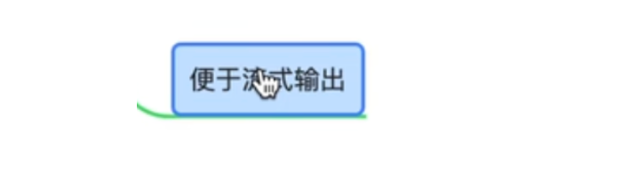

流式 输出，可以看到：

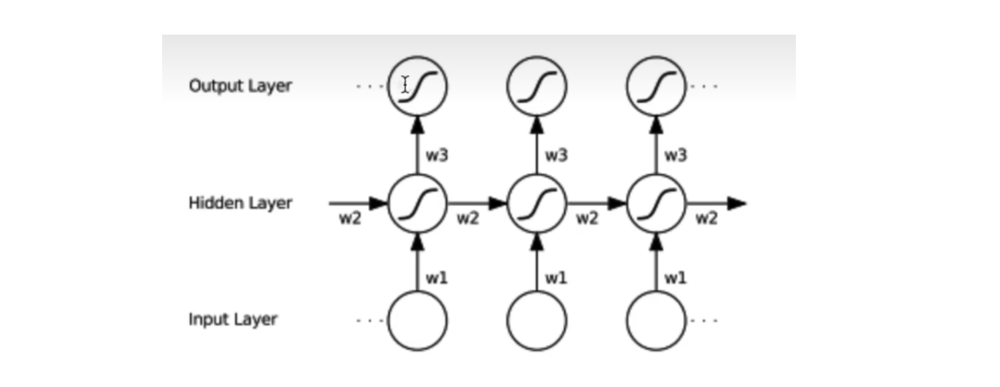

- [x] 流式输出是什么？

每 计算一步，都可以得到 一个输出，这个输出 可以直接 送给 用户，这就是 流式 的意思。

> 但是对于 Transformer而言的话，由于它是考虑到全局的信息 计算一个 全局的self attention，所以就不能单步 的计算 每一步的 输出，这就是 Transformer的一个缺点，不能直接的 应用到 流式的场景；
>
> 但是在循环神经网络中，只要每算一次 递归运算，就可以得到一个输出，这个 输出就可以直接返回给用户，这就是流式的，也就是 不需要 把 整个序列 都算完 才返回给用户，而是说 每算出一个 时刻 都可以返回给用户

**第六点**


权重时不变

> 权重是 时不变的，正是因为RNN 权重 时不变，所以RNN 可以处理 变长序列；

**二、缺点**


- [x] 为什么说 串行计算慢

因为 在算 每一时刻的时候 都需要等 上一时刻的历史信息，等上一时刻的算出来 才能算 下一时刻，是一个 串行的过程，比较慢

- [x] 怎么理解 RNN 也是无法获取太长的历史信息

也就是说 由于梯度消失的问题，导致RNN无法 从当前时刻 获取很久远的信息

> RNN 由于梯度消失的问题，无法获得太长的历史信息。
>
> 这一点正是Transformer的优点。
>
> Transformer的归纳偏置 是比较弱的，是通过一个 全局的self attention，来计算 两两位置之间的一个相关性，所以Transformer是可以上下去捕捉 很长的历史关联性的。

## 	k5 RNN 的应用场景


**（1）生成任务**

生成任务，比如歌词生成、对联生成、像GPT一样写小说

生成任务，如果用一幅图来表示：


1、如图表示RNN在诗歌、语音、符号生成中的表示

2、这类任务可以看成one to many的过程，也就是说 只要给了 一个输入，或者一个很短的 输入，RNN就可以利用自己的 递归机制 不断的预测 新的输出，就比如 给出 一两句话，RNN 写出一段话 或者 一篇文章，就是 one to many，RNN在生成任务上的应用

**（2）情感分类**

RNN也能做情感分类

> 比如说很古老的一个情感分类任务，对影评进行分类，判断一句话是正向情感还是负向情感，对于一个情感分类任务，可以看成many to one的任务

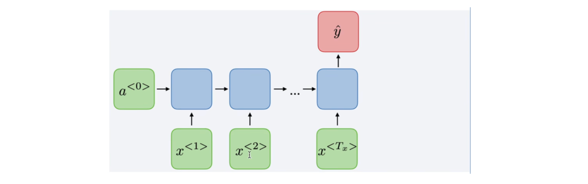

输入是一段话或者说一篇文章，但是输出 只有一个，只需要对一段话预测一个类别就好了，这个就是many to one的任务，典型的应用场景就是去情感分类


many to many的任务：

- 词法识别
- 机器翻译

词法识别就是识别当前这个词是名词还是动词，当前这个单词多音字等等

机器翻译，在Transformer中是应用比较多的；

但是这两种 many  to many的模型结构还是有一些区别的，可以看到下面两幅图：

（一）词法识别


- 识别一句话中，每个字的拼音是什么，或者识别每个词的词性，这种就是many to many

- 属于直进直出的many to many

（二）机器翻译


- sequence to sequence 结构；
- 有编码器，有解码器，中间依靠注意力机制，来帮助解码器预测每一时刻的输出，也是many to many；
- 常见的应用场景：机器翻译、语音合成等


语言模型 RNNLM；

总之就是

- one to one
- Many to one
- many to many

## k6  RNN框图

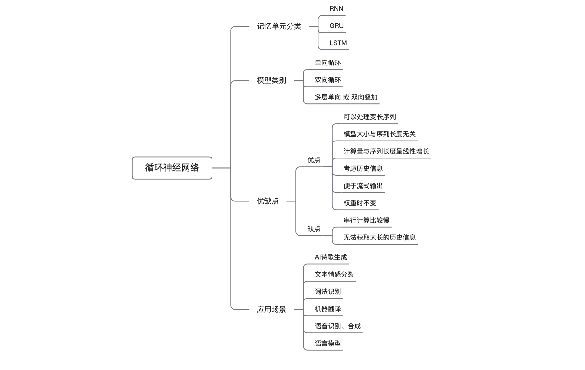

## torch.nn.RNN


- 可以用来构造一层 或者多层 简单的RNN结构； 

- RNN还有另外一种结构：激活函数，可以用tanh激活函数 或者 ReLU激活函数，使得RNN有更强的非线性建模能力；

- [x] RNN 计算公式是什么呢？

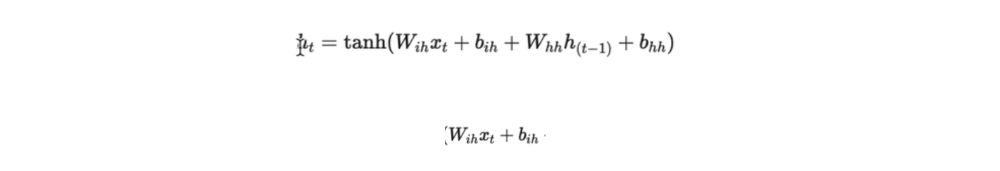

- 每一时刻的输出，或者说每一时刻的状态

- 在简单RNN中，输出是等于状态的， $h_t$也就是 $t$ 时刻的输出；

- 或者说 t 时刻RNN的状态 等于 tanh函数，就是非线性激活函数，里面分别是 $W_{ih}×x_t$ 再加上 $b_{ih}$，那么这里的$x_t$，就是当前时刻的输入，然后$w_{ih}$，就是在这个RNN中，它对输入的权重矩阵，就是 会用这个矩阵 来对权重 做一个映射，然后整体上，这个东西 可以看做 linear层，有权重 还有 偏置，$b_{ih}$，就是关于 权重的一个偏置

- 后面 还有一项，跟 历史状态有关的，跟 $h_{t-1}$ 有关的
- 也就是说，需要将 上一时刻的 输出 或者说 上一时刻的隐含状态 拿过来，然后对它进行一个 映射，用 $w_{hh}$ 的权重 来进行相乘，来进行映射，然后再加上一个偏置
- 总体而言 就是说 每一时刻的输出 或者说 隐含状态 不光跟当前时刻 的 输入 $x_t$ 有关，同时也跟上一时刻的记忆单元  $h_{t-1}$有关，并且都是线性组合的关系，最后通过一个非线性激活函数就能得到当前时刻的隐含状态；


- [x] 解释：

$h_t$ 是 $t$时刻的隐含状态

$x_t$是 t 时刻的输入

 $h_{t-1}$是  $t-1$时刻的隐含状态

$h_0$ 表示初始时刻的隐含状态

pytorch中也提供了两种 非线性激活函数：tanh和relu激活函数，默认用tanh激活函数

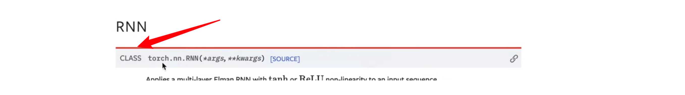

- 这是一个 class
- 在用RNN时候，首先要 实例化 这个class
- 实例化 class以后，得到RNN的一个模型
- 然后 再把 输入 喂入到 模型中，而不直接把 输入 喂入到模型中；
- 一般所有模型的 class，都需要 先进行一个实例化，然后才能得到一个layer；

- [x] 实例化RNN所需要的参数


- 第一个参数是 `input_size`,也就是 输入特征的大小，也就是 `x` 的特征的维度

- 第二个参数是 `hidden_size`，`hidden_size`决定了 $h_t$的大小，就是每一时刻的 $h_t$就是一个向量，对于单一样本而言，每一时刻 $h_t$就是一个向量，那么这个向量长度是多少呢？就是由 `hidden_size` 来决定

- 第三个参数 就是 `num_layers`，就是说 这个RNN，可以默认实例化的时候 只有一层，但是也可以改变 `num_layers`的值，变成多层，堆叠起来的结构，之前在介绍的时候也讲过，可以堆叠起来，单向的可以堆叠，双向的 也可 堆叠

- 第四个参数 就是 非线性激活函数，这里默认是`tanh`函数，也可以改成 `ReLu`函数
- 第五个是`bias` 一般会加上 这两个bias
- 第六个参数是 `batch first`，这个需要注意一下，这个参数就决定了 输入和输出的格式

> - 如果设置 `batch first=true`的话：
>
> 提供的输入张量 和 输出张量的 格式就是 `batch × sequence length×feature` 这样的格式
>
> 默认是`false`的，如果是 `false`的情况下：
>
> 需要保证 输入的格式是 `sequence length`，也就是序列长度 在第一个维度，`batch size`在第二个维度，`feature size`在第三个维度

- 第七个参数 `dropout`
- 最后一个参数`bidirectional`，最后一个参数 表示 双向的意思

> 也就是把这个参数设置为 `true`的话，就可以构建一个双向的RNN结构；
>
> 既然是 双向RNN结构，输出的特征大小就是`2×feature size`，就是2倍的`feature size`；

<u>双向结构图</u>

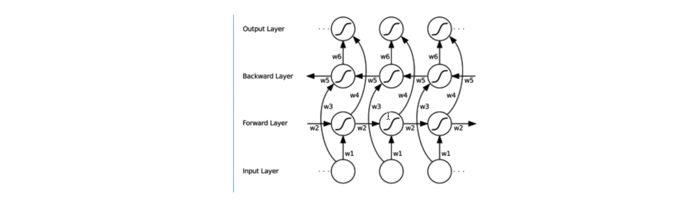

- 这幅图 就是 双向的，一旦把RNN设置成 双向的话，最终的输出 是由`forward输出`和`backward输出`一起拼起来的，所以这个 输出状态是 二倍的 `hidden size`，可以指定 `concat`和`sum`，一般用 `concat` 更多一点

- 也就是说 如果 设置 `hidden size是16`的话，那么 `output layer`大小，就是32，如果是双向的话

以上是RNN实例化的参数讲解；

- 当实例化完以后，就得到了RNN层
- 然后就可以 提供 输入 和 初始的隐含状态，来去递归的算出 每一时刻的 输入 所对应的输出是什么；

当实例化完 一个RNN，就可以 提供 `input` 和 $h_0$，来给出真正的输入序列：

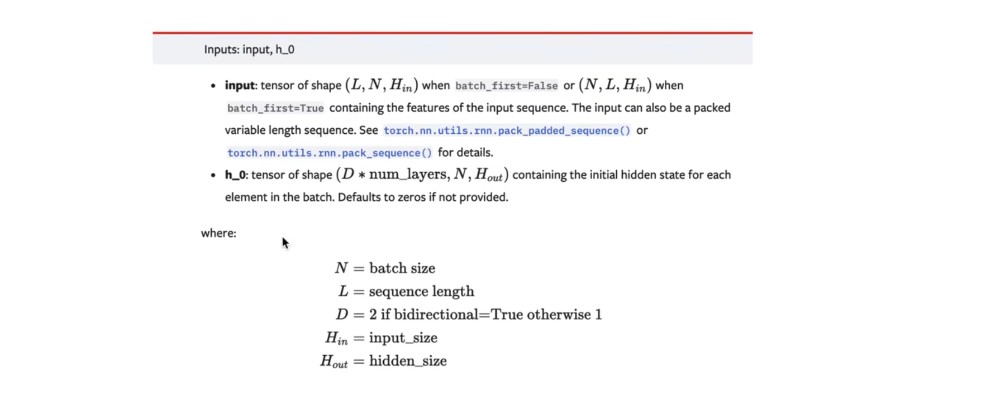

- [x] 解释input

输入一般是三维的：


如果设置的`batch size first等于true`的话，那对应的输入格式就是 `batch size×sequence length×hidden size`；

反之 如果`没有设置batch size等于true`的话，提供的格式就是 `sequence length×batch size×hidden size`


- [x] 解释 $h_0$

- $h_0$的格式是 ($d×{num\_layers}$， $N$，$H_{out}$ )
-  $h_0$ 是 初始状态，只有 这一个时刻，所以这里不需要考虑 `sequence_length` 这个维度

- [x] 那这里也是 三个维度，为什么呢？

因为  RNN 可以是 多层 也可以是 双向，所以第一个维度 其实就是 是否是 双向  跟 多层 这两个因素 决定的；

`case1：`如果模型是一层，并且是单向的话，那么第一个维度 就是 1 ；

`case2：`如果是 有两层，并且是 单向的话，那么就是 1×2；

`case3：`如果是双向 并且是 两层的话，那就是 2×2=4；

所以这里的 第一个维度 $d \times num\_layers$ 由是否双向 以及 层数有关

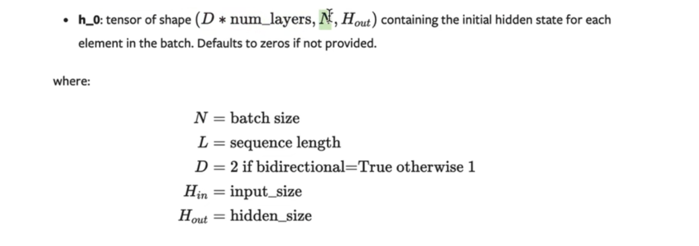

第二个维度 $N$，就是 `batch size`，每个样本 都可以 设置一个 初始状态

第三个维度 $H_{out}$ 就是 `hidden size`的大小，因为 初始状态 就是一个向量,第三维 就是 向量的长度

## 	代码示例

> 这个RNN 是一个 class
>
> 所以，首先实例化一个单向单层的RNN

step1：import  torch.nn as nn

step2：实例化 nn.RNN

step3：传入 实例化参数；

> - input_size=4
>
> - hidden_size也可以 随便写一个 hidden_size=3 
>
> - num_layers可以传入1
> - batch first设置成true
> - 定义为`single_rnn`

```python
import torch
import torch.nn as nn
# 1.单向、单层RNN
single_rnn = nn.RNN(input_size=4,hidden_size=3,num_layers=1,batch_first=True)
```

以上是 单层单向RNN，接下来构建一个输入

输入的维度一般是 `batch_size×sequence length×输入特征`

输入特征就是RNN实例化时的 `input size=4，batch size=1，sequence length=2，特征维度=4`

以上构建好了input序列，分别是： `batch_size × sequence length×输入特征`

```python
input = torch.randn(1,2,4) 
# batch_size*sequence_length*feature_size
```

把这个`input`作为 `single_rnn`的输入；

也可以不传入$h_0$,它默认以$0$向量填充


同时也可以看看 官网 api 输出是什么


输出是两个值，一个是整个的，所有时刻的输出；

另外一个输出的量就是最后一个时刻的状态，要定义变量接收输出

```python
output,h_n = single_rnn(input)
```

这样整个输出就算完了，接下来看一下$output$和 $h_n$

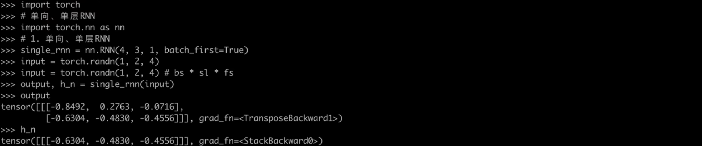

结果解读：

