# LSTM

## RNNCELL


RNNCELL，可以理解为 单步 的迭代

因为所有的循环神经网络 都是有很多步去迭代，最终把每一步的状态 取出来作为输出

这里的RNNCELL，也就是说 多个，每个时刻的计算 就是一个RNNCELL，然后把 多个RNNCELL 连起来 ，其实就构成了 一个RNN，所以 无论是RNN也好，还是 GRU也好，还是 LSTM也好，它们 都有各自的CELL，然后每个CELL，其实就是一个 单步的运算，可以理解为 单个时刻的运算，下面 有一个例子


代码解释：

- 首先实例化 RNNCELL
- RNNCELL的 `input size`和`hidden size`分别为10和20
- 定义 `input` 的训练特征，`batch size`是3，然后 `时间长度`是6，然后`特征维度`是10
- 定义初始的 `hidden state`[`hx`]
- 用RNNCELL做每一次迭代

所以定义一个 for循环，然后 每一步调用RNNCELL实例化的操作，算出每一时刻的隐含状态 `hx=rnn(input[i],hx)`  ，定义 $h_x$接收输出结果

- RNNCELL 就是 单步 的计算，包括 GRUCELL 和LSTMCELL，都是单步的
-  RNN 就是把多个RNNCELL 连起来 ，所以是多步的

## LSTM 官方 api


LSTM 原理可见[博客](https://colah.github.io/posts/2015-08-Understanding-LSTMs/)：


### & RNN

- LSTM比RNN多了几个门
- RNN比较简单 ： 输入 + 隐含状态，只有这两个状态

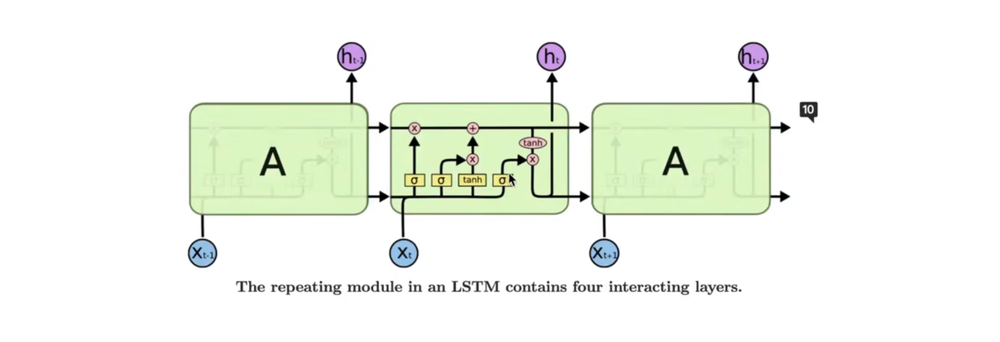

在LSTM中，多了一些门：

（1）输入门

（2）输出门

（3）遗忘门

（4）记忆单元

### LSTM 图示


图片理解：

最上面的横线，长得像传送带的东西，是一个细胞单元，或者说细胞状态

整个LSTM就是靠这个细胞状态，来不断的 更新 历史信息的

### LSTM 有哪些门？

对照官方 api：


1. `i`就是 输入门
2. `f`就是遗忘门
3. `g`就是细胞
4. `o`就是输出门
5. `c`成为`cell`，叫细胞单元，或者叫 细胞状态
6. `h`就是`LSTM`的隐含状态，或者说 输出。因为模型最终输出的是 $h_t$

### `api` 对应到图、数学公式

图示：


图示 & 符号：

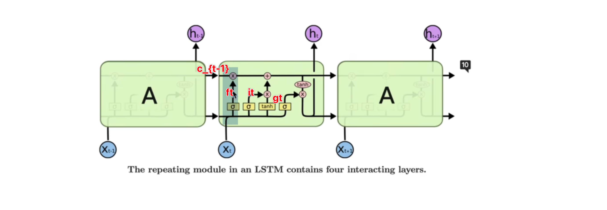

（1）遗忘门：$f_t \odot c_{t-1}$ 

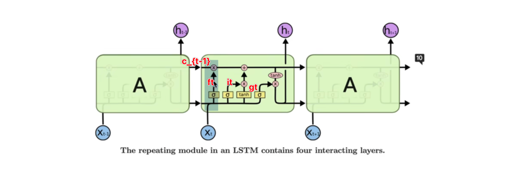

 `step1：`遗忘门的输出(得到经过遗忘门的筛选信息 ) $f_t$ 

**遗忘门的输出 $f_t$ 怎么计算的？**

> $x_t$ 跟历史的输出进行交互，然后经过 $\sigma$线性函数，得到 $f_t$

`step2：`遗忘门的输出跟上一时刻的  $c_{t-1}$ 相乘，对应的数学公式：

$$f_t \odot c_{t-1}$$

（2）输入门 $i_t$ 、细胞 $g_t$


如图框：

1. 同样 $x_t$跟过往的 $x_{t-1}$进行交互，然后经过一个 $\sigma$函数，得到输入门 $i_t$
2. 然后 $x_t$ 跟上一时刻的 $x_{t-1}$，经过  $\tanh$激活函数 ，得到的是 $g_t$，称作细胞
3. $g_t$ 跟输入门相乘，相当于对当前的输入信息进行筛选

公式：

$$g_t \odot i_t$$

（3）最新细胞状态的 $c_t$ 

① 把信息$g_t \odot i_t$加到目前最新的 $c_t$ 上

② 最新的 $c_t$是上一时刻 $c_t$乘遗忘门$f_t$，得到新的 $c_t$

也就是说该丢掉的信息丢掉了再加上输入门 ，更新细胞状态，这个过程对应的公式表示：

$$c_t = f_t \odot c_{t-1} + i_t \odot g_t$$

（4）输出门 $\ o_t$


最后一根线叫做 输出门

同样是 $x_t$跟$h_{t-1}$，进行交互，经过sigmoid函数，得到$o_t$，就是输出门，最终的输出 ： $o_t × \tanh (c_t)$，数学公式表达：

$$h_t = o_t \odot \tanh(c_t)$$


$h_t$ 跟每一时刻的输入进行交互的，也就是线性组合

$c_t$不断对 历史信息进行一个 更新

通过遗忘门、输入门，不断对 $c_t$进行一个 更新

以上是LSTM的公式 和 结构，再来看一遍数学公式：

$$i_t = \sigma(W_{ii}x_t+b_{ii}+W_{hi}h_{t-1}+b_{hi})$$

$$f_t = \sigma(W_{if}x_t + b_{if}+W_{hf}h_{t-1}+b_{hf})$$

$$g_t = \tanh(W_{ig}x_t + b_{ig}+W_{hg}h_{t-1}+b_{hg})$$

$$o_t = \sigma(W_{io}x_t+b_{io}+W_{ho}h_{t-1}+b_{ho})$$

$$c_t = f_t \odot c_{t-1}+i_t \odot g_t$$

$$h_t = o_t \odot \tanh(c_t)$$

补充：

（1）但从公式来说，$i、f、g、o$ 需要的就是 $x_t$ 和 $h_{t-1}$当前时刻的输入和历史信息

（2）对比 RNN 的公式：

$$h_t = \tanh(x_tW_{ih}^T+b_{ih}+h_{t-1}W_{hh}^T+b_{hh})$$

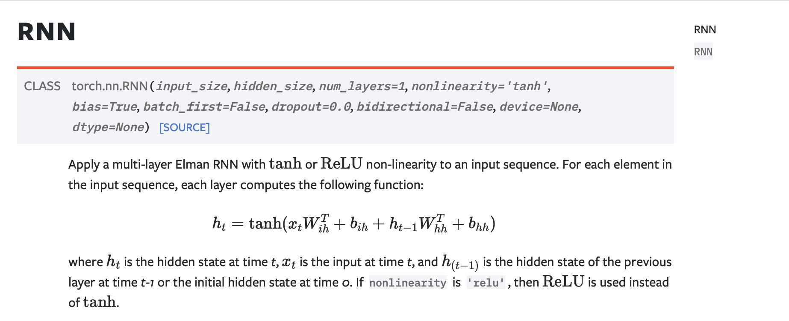

单从公式来说，RNN 历史信息的保存仅通过 当前时刻的输入 $x_t$ 和 上一时刻的历史信息 $h_{t-1}$

（3）再放一遍公式，体会：


（4）LSTM 多了一个细胞状态，问题：为什么 LSTM 要设置细胞状态，为什么要这么设计公式更新细胞状态和隐藏状态？

（5）查阅资料

[ref](https://blog.csdn.net/qq_29053993/article/details/90547382)：LSTM

> 0、核心是 细胞门（对比 RNN 这个是比较好理解的。可是为什么要有细胞门呢？）
>
> 
>
> 1、忘记一些信息
>
> 遗忘门的作用是 **决定丢弃什么信息**
>
> 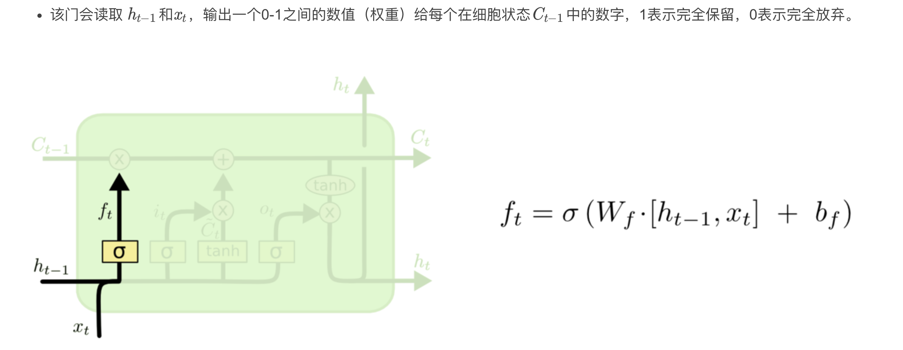
>
> 2、新东西加入 细胞状态
>
> 输入门 & 不知道怎么称呼合适的东西（学名：$\tilde{C}_t$）
>
> 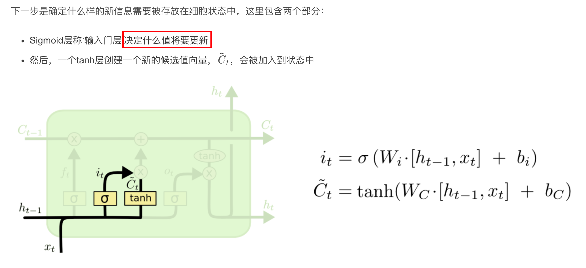
>
> $\sigma$ 函数 和 $\tanh$ 函数有什么区别？为什么 $\sigma$函数就起了那样的作用，$\tanh$函数又起了这样的作用？
>
> 3、
>
> 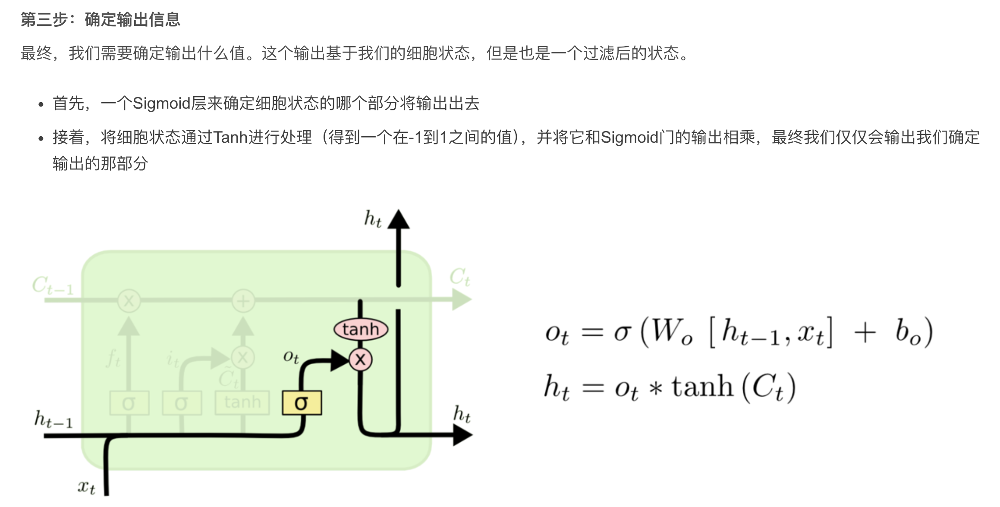
>
> 

（6）RNN、LSTM、GRU通用网络框架


（7）RNN & LSTM 的应用例子（帮助理解）：

RNN 就足够：

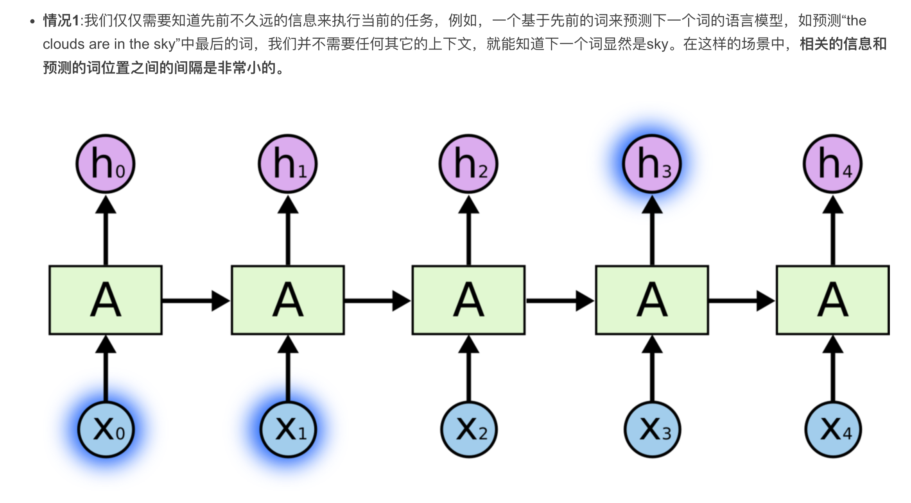

LSTM 才可以（间隔太大）：


（9）[LSTM 的理解](https://www.jianshu.com/p/4b4701beba92)：

输入：$x_t$ 、$h_{t-1}$、$c_{t-1}$

中间：$i、f、g、o$

输出：$c_t$、$h_t$

**一、忘记门** $f$

- 要丢弃什么信息

LSTM的第一步是决定我们要从细胞状态中丢弃什么信息。

<u>怎么实现的？</u>

该决定由被称为"忘记门"的$\ Sigmoid$层实现

<u>具体怎么实现？</u> 

查看`ht-1(前一个输出)`和`xt(当前输入)`，并为单元格状态`Ct-1(上一个状态)`中的每个数字输出`0`和`1`之间的数字。

<u>为什么用 sigmoid 函数，输出代表什么意思？</u>

`1`代表完全保留，而`0`代表彻底删除，所以用 `sigmoid 函数`

<u>图示</u>


二、$i_t$、$g_t$

- 要保留什么信息？

就是决定我们要在细胞状态中存储什么信息

这部分分为两步：

1、首先，称为"输入门层"的Sigmoid层决定了将更新哪些值

2、接下来一个tanh层创建候选向量Ct，该向量将会被加到细胞的状态中

在下一步中，我们将结合这两个向量来创建更新值。


图示：


这里的 $\tilde{C}_t$ 和 $g_t$  是一个东西，学名：候选向量

问题：$\tanh$ 输出的含义是什么？

类似 sigmoid 的输出 `0 表示遗忘，1 表示记住`

三、更新细胞状态得到 $c_t$

更新上一个状态值$C_{t−1}$了，将其更新为$C_t$

将上一个状态值乘以$f_t$，以此表达期待忘记的部分 $ \iff f_t \odot c_{t-1}$

之后将得到的值加上 $i_t∗\tilde{C}_t$  $\iff + i_t \odot \tilde{C}_t$

这个得到的是新的候选值 $C_t$， 按照我们决定更新每个状态值的多少来衡量，最终的公式：

$$c_t = f_t \odot c_{t-1} + i_t \odot g_t $$

以上得到了 第一个 输出 $c_t$，现在开始第二个输出 $h_t$

四、输出什么

最后需要决定要输出什么

此输出将基于细胞状态，但 是一个过滤版本。  $tanh(C_t)$

- 首先，经过一个sigmoid层，决定了要输出的细胞状态的哪些部分  $o_t = \sigma(f(h_{t-1},x_t))$
- 然后，将单元格状态通过tanh（将值规范化到-1和1之间），并将其乘以Sigmoid门的输出   $h_t = o_t \odot \tanh(c_t)$

至此就输出了决定的那些部分


把公式精简一下：


输入：$x_t$、$h_{t-1}$

操作：(这里的符号是参照官网 api 的)

$f_t = \sigma(f(x_t,h_{t-1})) \iff \sigma(W_f[x_t,h_{t-1}]+b_f)$

$i_t = \sigma(f(x_t,h_{t-1})) \iff \sigma(W_i[x_t,h_{t-1}]+b_i)$

$g_t = \sigma(f(x_t,h_{t-1})) \iff \sigma(W_g[x_t,h_{t-1}]+b_g)$

$o_t = \sigma(f(x_t,h_{t-1})) \iff \sigma(W_o[x_t,h_{t-1}]+b_o)$

$f$ 代表仿射变换 $Wx+b$

输出：$c_t、h_t$（这个图示，画得太细，反而晕乎）

$c_t = f_t \odot c_{t-1} + i_t \odot g_t$

理解：

1、$f_t$ 指示 要忘记的历史信息（白话：$更新历史信息$，该记住的记住，该忘记的忘记，忘记多少也表达了记住多少，需要看参照）

2、$i_t$ 保留多少输入信息，为输入信息加权；

$g_t$ 表示输入信息，最后得到的是要记住多少输入信息

3、最后同时存到 $c_t$ 中

$h_t = \tanh({c_t}) \odot o_t$

理解：

最后，需要决定输出什么

输出基于细胞状态，是过滤版本

step1：首先，通过sigmoid层，决定要输出的细胞状态的哪些部分

step2：然后，将单元格状态通过tanh（将值规范化到-1和1之间）

step3：并将其乘以Sigmoid门的输出，至此输出决定的那些部分

以上是关于 LSTM 内部的计算理解

### 	torch.nn.LSTM

与 RNN 对比：

> 在参数相同的条件下，LSTM的序列建模能力是强于RNN的，所以比较大的序列建模任务都是用 LSTM做

pytorch 的官方 api：`torch.nn.LSTM`


- 这是一个class，是一个类
- 要用的话

（1）首先进行实例化，得到一个算子

（2）喂入输入序列，输入序列经过LSTM网络，得到的 每个输入状态的输出，最后将得到状态的输出： $h_t$

（3）每一时刻的 $h_t$ 组合起来的输出序列

**<u>明确 LSTM 的公式：</u>**

首先，` LSTM核心：细胞状态`

一共涉及的东西：$f、i、g、o、h、c$

输入：$x_t、h_{t-1}$

公式：

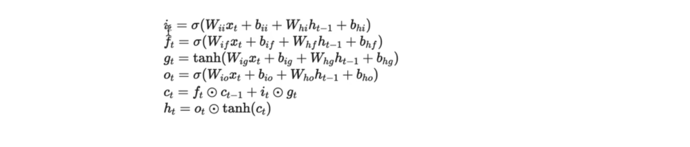

$f_t=\sigma(w_f[x_t,h_{t-1}]+b_f)$ 

$i_t = \sigma(w_i[x_t,h_{t-1}]+b_i)$

$g_t = \tanh(w_g[x_t,h_{t-1}]+b_g)$

$o_t = \sigma(w_o[x_t,h_{t-1}]+b_o) $

$c_t = f_t \odot c_{t-1} + i_t \odot g_t$

$h_t = o_t \odot \tanh(c_t)$

四个门，分别是$i、f、g、o$

这里有四个门：

（1）其中有三个门非线性激活函数都是 `sigmoid`

（2）$g_t$的激活函数是 tanh函数

<u>其实这四个门的运算有很大的相似性</u>

> 有 四个 $W$
>
> 并且四个$W$都是跟$x_t$进行一个矩阵相乘
>
> 同样的 $W_{hi} 、W_{hf}$右边的四个$W$，也是跟 $h_{t-1}$，进行矩阵相乘
>
> 所以虽然看上去有4个$W_i$，但是可以把 这个 四个 $W_i$叠起来
>
> 比方说 每个$W_i$是$2$行，那么$4$个$W_i$，就可以 叠成$8$行


然后再跟 $x_t$ 进行一个相乘，就是把 这个 $四个 W乘以x$

$W×x$ 组合起来，一起算

同样这里的$W乘以h(W×h)$也是一样的

由于都是 乘以 同一个$h$

同样把 四个 $W$堆叠起来，$stack$堆叠来，算完了 再$split$


如图，还有$4$个$b_i$和$b_h$，输入 $linear$的偏置 和上一时刻 隐含状态线性层的偏置

同样这里 $4$个偏置，$4$个$b_i$ 就是直接加，不需要联合算

同样这里的$b_h$，也是$4$个偏置

维度都是跟$i_t、 f_t$ 维度是一样的，得到的 $i、f、g、o$以后，就可以算出当前时刻细胞的状态 $c_t$

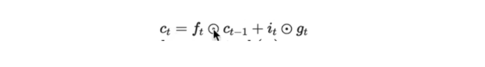

About $c_t$ ：

（1）$c_t= f_t×c_{t-1}$，中间的乘是逐元素的乘，不是矩阵乘法

（2）默认$f_t$跟$c_{t-1}$维度是一样的，同一位置上的元素两两相乘

（3）同样 $i_t$和$g_t$也是一样，同一位置的两两元素 相乘

（4）乘完以后元素再加起来，得到$c_t$

$c_t$ 是当前时刻的细胞状态，就是上面的黑线，这黑线是 LSTM 的创新

??? question "（作者咋想的，要加条黑线，还有这些门的设计，why？）"

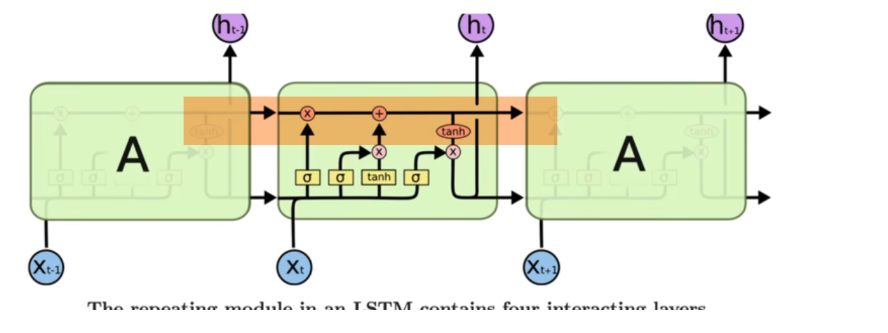

整个LSTM就是靠黑线，来不断对历史信息 进行筛选和更新，得到$c_t$以后，最终 得到 $h_t$

$c_t=f_t \odot c_{t-1} + i_t \odot g_t $

$h_t = o_t \odot \tanh{c_t}$

> $c_t = f_t \odot c_{t-1} + i_t \odot g_t$
>
> $= \sigma{(W_f{[x_t,h_{t-1}]}+b_f)} \odot c_{t-1} + \sigma(W_i[x_t,h_{t-1}]+b_i) \odot \tanh(W_g[x_t,h_{t-1}]+b_g)$
>
> 
>
> $h_t = o_t \odot \tanh{c_t}$
>
> $h_t = \sigma (W_o[x_t,h_{t-1}]+b_o) \odot \tanh{c_t}$
>
> 
>
> **对比RNN 的公式：**
>
> $h_t = \tanh(W_h[x_t,h_{t-1}]+b_h)$
>
> $=\tanh(x_tW_{ih}^T+b_{ih}+h_{t-1}W_{hh}^T+b_{hh})$
>
> 

$c_t$ 也是为了最终 $h_t$ 的输出

整个LSTM的输出就是 $h_t$

ht：由$输出门×细胞状态 (经过 激活函数 \tanh函数)$，所得到的值，就是$h_t$，$h_t$就是LSTM的输出

**<u>初始状态</u>**

**（1）LSTM中的初始状态有 2 个**

RNN有初始状态，同样在LSTM网络中，也有初始状态，但是LSTM 中的初始状态，有两个。

<u>**（2）需要提供什么初始状态？**</u> 

> 从公式里找初始状态，哪些符号以 $t-1$为下标的，只要以$t-1$为下标的就是说需要提供初始状态，也就是说需要提供这些量的初始值
>
>  从$t$从$1$开始，带$t-1$下标的，需要提供$t_0$，所以一定有初始状态
>
> 从公式来看 一共有两个带 $t-1$ 下标的

$f_t,i_t,o_t = \sigma(W[x_t,h_{t-1}]+b)$

$g_t = \tanh(W[x_t,h_{t-1}]+b)$

$c_t = f_t \odot c_{t-1} + i_t \odot g_t$

$h_t = o_t \odot \tanh{c_t}$

> 分别是$h_{t-1}$，$c_{t-1}$
>
> 也就是说 在$t=1$时刻的时候，需要提供$h_0$、$c_0$，来算出$t=1$时刻的$h_1$和$c_1$
>
> LSTM网络，相比于简单的RNN网络，初始状态就多了 $c_0$

**<u>ReCall RNN</u>**


<u>(1) RNN的公式更简单，$h_t$是$x_t$跟$h_{t-1}$的线性组合</u>

$h_t = \tanh{(W_h[x_t,h_{t-1}]+b_h)}$

<u>(2)RNN需要的初始状态只有 $h_0$</u> 

> 从RNN的公式中可以看出来，只有一个符号，就是$h$下标是$t-1$，也就是说 去算RNN的网络的时候，需要提供 $h_0$作为初始状态，因为如果要算$h_1$的话，我们必须要有$h_0$，所以必须要提供$h_0$，当然框架已经默认提供了$h_0$等于一个全0的向量

**<u>VS LSTM</u>**


$i_t,f_t,o_t = \sigma(W[x_t,h_{t-1}]+b)$

$g_t = \tanh(W[x_t,h_{t-1}]+b)$

$c_t = f_t \odot c_{t-1} + i_t \odot g_t$

$h_t = o_t \odot \tanh{c_t}$

- 在LSTM中，根据公式可以看到必须要提供$h_0$和$c_0$
- LSTM相比于RNN又多了一个初始状态，不仅有$h_0$，还有$c_0$
- 在框架中，同样提供了 默认的值：全0

> **<u>补充：</u>**
>
> 我们也可以不用全$0$ 的默认值，也可以用其他的值，自己构造$h_0$和$c_0$
>
> 此时，$h_0$和$c_0$，可能是从某一个输入映射来的，这种初始化方法也叫`Meta learning`，即我们的初始值 都是靠学来的
>
> 可以让初始状态，不是完全随机的，可以设置为与输入有关，或者跟 condition有关
>

**LSTM 初始化需要的参数**


需要实例化LSTM的参数：

- `input_size`：输入序列特征的大小
- `hidden_size` ：  ① LSTM网络 $h$的大小 ② `hidden_size` 也是$c$的大小
-  `num_layers` ：层数，构建多层的LSTM，多层堆叠起来，前一层的输出$h_t$，是作为下一层LSTM的输入$x_t$
- `bias`：决定了$b_i$和$b_h$是否可以丢弃
- `batch_first`：① 在pytorch中，默认的是`batch`是放在中间一维的  ② 可以把`batch_firs`t设置成`true`，此时 `batch` 就在 第一维
- `dropout` 以及 双向  `bidirectional` 

① 如果要构建双向的话，有`forward layer`和`backward layer`

② 最后的状态是由`forward layer`和`backward layer`拼接起来的状态

-  `proj_size`  ：最后一个参数，这个参数相当于LSTM网络的变体：LSTMP

## LSTM和LSTMP的原理与源码实现

**<u>LSTM & LSTMP</u>**

作用：为了减小LSTM的参数和计算量

> 因为LSTM的计算量是比较大的，LSTMP通过对$h_t$进行压缩，$h_t$的维度会变小，整个网络的参数量和运算量 都会变小，有论文表明通过对 $h_t$ 进行压缩，性能损失不是很大，所以在具体地实验中，可以尝试LSTMP

- [x] 实例化 LSTM 需要传入的参数 $\uparrow$
- [ ] LSTM input parameters $\downarrow$
- [ ] LSTM output $\downarrow$ 

**<u>LSTM input parameters</u>** 

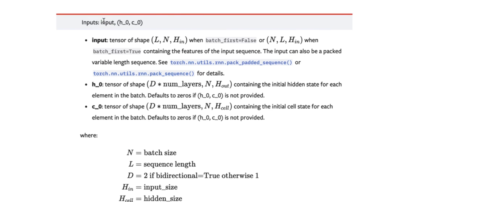

1️⃣ `input`

格式：如果是 batch first=true的话： `batch size×sequence length×input size`。

2️⃣ `(h_0，c_0)`

格式：元组

为什么是元组的形式？

> 为了跟RNN的api保持一致
>
> RNN的api输入就是两个量，LSTM是RNN一个特殊的变体，所以虽然有两个初始状态，用两个更合乎常理，但还是用元组的形式组合起来
>
> 两个初始状态分别是 `h_0`和`c_0`
>
> 就是所有带 t-1 下标的，这些符号都需要提供一个初始值

**<u>LSTM output</u>**


虽然是输出 `c_n`，但是 `h_n = o_n × tanh(c_n)`，`h_n` 与 `c_n` 是由 `c_n` 计算来的，即使说 `c_n` 是中间结果也可以，但 `c_n` 是 LSTM 的核心

`Outputs：output,(h_n,c_n)`

- `output`：整个模型序列的输出，`shape= batch size×sequence length×hidden size`，output 反应整个序列的状态输出；

-  `(h_n,c_n)` ：元组形式，`h_n`和`c_n`，表示最后一个时刻的`隐含状态`和`细胞状态`

思考：`output,(h_n,c_n)`有什么作用？

> 1️⃣ `output`
>
> `output`是一个`many to many`的建模
>
> 输入是一个序列，输出也是一个序列，保留序列中的每个元素，比方说，对一个文本的多音字进行预测，或者说词性进行预测，都是 `many to many`的任务，需要每一时刻的输出
>
> 2️⃣ `h_n`
>
> `h_n`是一个`many to one`的任务
>
> 比方说输入一段话到LSTM网络中，最终只取最后一个时刻的状态，并且希望最后一个时刻的状态，就能去表征整句话的特征，然后再对最后一个状态进行分类，或者进行 `sequence embedding`，这个是 `many to one`的任务，就可以用到`h_n`

以上：

- [x] 实例化 LSTM 需要的传入参数
- [x] LSTM 算子的 input parameters
- [x] LSTM 的 outputs

**<u>RECall BiRNN</u>** 

```python
# step3 手写一个 bidirectional_rnn_forward函数，实现双向RNN的计算原理
def bidirectional_rnn_forward(input,
                              weight_ih,
                              weight_hh,
                              bias_ih,
                              bias_hh,
                              h_prev,
                              weight_ih_reverse,
                              weight_hh_reverse,
                              bias_ih_reverse,
                              bias_hh_reverse,
                              h_prev_reverse):
    bs,T,input_size = input.shape
    h_dim = weight_ih.shape[0]
    h_out = torch.zeros(bs,T,h_dim*2) # 初始化一个输出（状态）矩阵，注意双向是两倍的特征大小

    forward_output = rnn_forward(input,
                                 weight_ih,
                                 weight_hh,
                                 bias_ih,
                                 bias_hh,
                                 h_prev)[0]  # forward layer
    backward_output = rnn_forward(torch.flip(input,[1]),
                                  weight_ih_reverse,
                                  weight_hh_reverse,
                                  bias_ih_reverse, bias_hh_reverse,
                                  h_prev_reverse)[0] # backward layer

    # 将input按照时间的顺序翻转
    h_out[:,:,:h_dim] = forward_output
    h_out[:,:,h_dim:] = torch.flip(backward_output,[1]) #需要再翻转一下 才能和forward output拼接

    
    h_n = torch.zeros(bs,2,h_dim)  # 要最后的状态连接

    h_n[:,0,:] = forward_output[:,-1,:]
    h_n[:,1,:] = backward_output[:,-1,:]

    h_n = h_n.transpose(0,1)

    return h_out,h_n
    # return h_out,h_out[:,-1,:].reshape((bs,2,h_dim)).transpose(0,1)

# 验证一下 bidirectional_rnn_forward的正确性
bi_rnn = nn.RNN(input_size,
                hidden_size,
                batch_first=True,
                bidirectional=True)
h_prev = torch.zeros((2,bs,hidden_size))
bi_rnn_output,bi_state_finall = bi_rnn(input,h_prev)

for k,v in bi_rnn.named_parameters():
    print(k,v)
```

- 有`forward layer`还有`backward layer`

```python
    forward_output = rnn_forward(input,
                                 weight_ih,
                                 weight_hh,
                                 bias_ih,
                                 bias_hh,
                                 h_prev)[0]  # forward layer
    backward_output = rnn_forward(torch.flip(input,[1]),
                                  weight_ih_reverse,
                                  weight_hh_reverse,
                                  bias_ih_reverse, bias_hh_reverse,
                                  h_prev_reverse)[0] # backward layer
```

主要看`backward layer`

首先对输入进行一个翻转 `torch.flip(input,[1])` ，按照时间维度进行翻转，同样喂入到RNN forward函数中，有各种翻转

再把`forward output`和`backward output`拼起来，在特征维度上拼起来 就构成了 `h_out`，也就是双向RNN网络

```python
    # 将input按照时间的顺序翻转
    h_out[:,:,:h_dim] = forward_output
    h_out[:,:,h_dim:] = torch.flip(backward_output,[1])
    #需要再翻转一下 才能和forward output拼接

    h_n = torch.zeros(bs,2,h_dim)  # 要最后的状态连接
    h_n[:,0,:] = forward_output[:,-1,:]
    h_n[:,1,:] = backward_output[:,-1,:]
    h_n = h_n.transpose(0,1)
    return h_out,h_n
```

双向GRU和 双向 LSTM 原理也是一样的

**实现 LSTM**

调用官方 api

```python
# 实现LSTM和LSTMP的源码
```

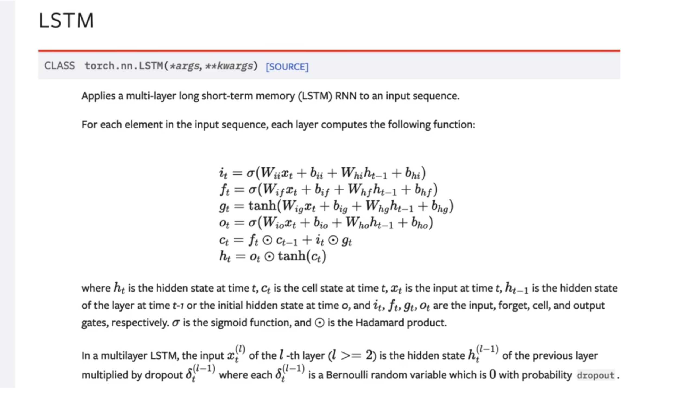

**第 1 步：定义常量** 

- batch size
- 时间：T
- 输入特征大小：i_size
- h_size：hidden size网络细胞状态的大小

```python
# 定义常量
bs,T,i_size,h_size = 2,3,4,5
```

`projection size` 也就是投影的大小（暂跳）

```python
# proj_size
```

**第 2 步：构建输入 input**

喂入到LSTM网络的特征序列

用正态分布初始化 torch.randn 输入

```python
input = torch.randn(bs,T,i_size) #输入序列
```

**第 3 步：初始化初始状态：`c_0、h_0`**

除了输入序列，还需要初始化两个初始状态，分别是`c_0`和`h_0`

**c_0**

假设只考虑一层，`c_0`的初始状态就是 `batch size×hidden size`

```
c0 = torch.randn(bs,h_size)
```

> 因为`c`本身就是一个向量，向量长度就是 `hidden_size`
>
> 考虑到 `batch`维度，所以写成 `batch size×hidden size`
>
> 以上，初始化 `c_0` 
>

```python
c0 = torch.randn(bs,h_size) # 初始值 不需要参与训练
```


**h_0**

`c_0` 不需要训练，`h_0`也是一样的，就是提供了`h`的初始值

写 `batch_size ×hidden_size`

先写 `hidden_size`，暂时不考虑考虑`projection size`

```
h0 = torch.randn(bs,h_size)
```

以上，定义好了三个基本的量：输入 `input` 和初始值`(c_0,h_0)`


**第 4 步：调用官方LSTM API，实例化**

```python
# 调用官方LSTM API
```

官方api就是`nn.LSTM`

```python
nn.LSTM()
```
实例化需要传入的参数


传入的参数顺序分别是 input size、hidden size、batch first

projection size暂时不用

- `input_size` 就是 `i_size`
- `hidden_size`就是`h_size`
- `batch_first`设置成 `true`

以上实例化了简单的LSTM layer，定义：`lstm_layer`

```python
lstm_layer = nn.LSTM(i_size,h_size,batch_size=True)
```

**第 5 步：`LSTM` 算子 `input parameters`**

在定义好LSTM layer以后，把`输入`和`初始状态`分别传入到LSTM layer中

**具体怎么传入参数?**

去看api


从`api`可以看到，`inputs`是 `input`和`一个元组`

在元组中，需要传入`h0`和`c0`

所以代码写`input`，然后再写`一个元组`

```python
lstm_layer(input,())
```

元组分别传入 `h0` 和`c0`

```python
lstm_layer(input,(h0,c0))
```

那维度是多少呢？官方文档：


`h0`的维度是`D*num_layers×N×H_out`

`c0`也是一样的，首先初始化 `N×H_out`

```python
output,(h_finall,c_finall) = lstm_layer(input,
                                        (h0.unsqueeze(0),c0.unsqueeze(0)))
```

演示的是单向的LSTM网络，是一层的，所以前面的数字在初始化时省掉了

现在先扩一下，扩成 三维

对`h0`调用`unsqueeze`函数，在第0维扩一维

`c0`也同样扩维，变成三维张量，第0维是1

以上是单层单向LSTM 算子，可以得到输出

```python
# 定义常量
bs,T,i_size,h_size = 2,3,4,5
# proj_size
input = torch.randn(bs,T,i_size) # 输入序列
c0 = torch.randn(bs,h_size)  # 初始值不需要训练
h0 = torch.randn(bs,h_size)
# 调用官方LSTM API
lstm_layer = nn.LSTM(i_size,h_size,batch_first=True)
output,(h_finall,c_finall) = lstm_layer(input,
                                (h0.unsqueeze(0),c0.unsqueeze(0)))

for k,v in lstm_layer.named_parameters():
    print(k,v.shape)
```

**第 6 步：输出 `Outputs:output,(h_n,c_n)`**


这里写输出：

```python
# 调用官方LSTM api
lstm_layer = nn.LSTM(i_size,
                     h_size,
                     batch_first=True)
output,(hn,cn) = lstm_layer(input,
                            (h0.unsqueeze(0),c0.unsqueeze(0)))
```

以上调用好了api，接下来打印output

```python
print(output)
```

改名字，定义`h_finall`和`c_finall`，表示最后一个时刻的隐含状态和细胞状态

```python
output,(h_finall,c_finall) = lstm_layer(input,
                                        (h0.unsqueeze(0),c0.unsqueeze(0)))
```

**第 7 步：打印LSTM 模型参数**

官方 api 实现 LSTM，可以调用 LSTM layer 的 `named_parameter` 函数，打印权重和名字，查看 LSTM 模型参数

```python
for k,v in named_parameters():
    print(k,v)
```


可以看到LSTM的参数名以及具体的张量：

- `weight_ih_l0` 对应公式里的 $W_{ii}$ $W_{if}$  $W_{ig}$ $W_{io}$  四个 $W_i$放到了一个 `weight_ih`里面
- `weight_hh_l0` 这个参数是公式的 四个 $W_{hi}$  $W_{hf}$ $W_{hg}$ $W_{ho}$ $W_h$拼起来的
- `bias_ih_l0` 
- `bias_hh_l0`

最后两个偏置项，同样是拼起来的，这样直接看张量不清晰，接下来看shape


可以看到这个`LSTM layer`中一共有4个参数；

<font color="0000FF">第一个参数 </font> 是 `weight_ih_l0` ： 20×4

**为什么是 20×4呢？** 

> - `20`是`hidden_size`，就是`5`这个维度，然后把`4`个`W`拼起来
>
> 本来每一个是`5`行，现在拼成了`20`行，`20`就是`5×4`
>
> - `4`是 `input_size`，因为这个`w_ih`是跟 `input` 相乘的，是对`input`进行线性变换的参数


解释这里的权重：

$T=3，input\_size = 4，hidden\_size = 5$

$4(4×1) \stackrel{5×4}{\rightarrow} 5(5×1)$

$∴ weight\_ih = 5 × 4 堆叠 4 个 → 20×4$


<font color="0000FF">第二个参数 </font>  `weight_hh_l0` 参数是 `20×5`的

> - `20` 是 `4×5` 来的
> - `5` 是`weight_hh`是跟`上一时刻的隐含状态`进行线性变换的，维度是`5`  
> -  $∴ 1 个 weight\_hh shape = 5 × 5$
>
> > 隐藏层是`linear`层：`y=wx+b`
> >
> > `w`的维度就是`hidden size×input size`
> >
> > 这里的`hidden_size`就是5，`input_size`是4

<font color="0000FF">第三个、第四个参数：</font>两个`bias`

> `bias_ih`和`bias_hh` 都是`20`，`20`是 `4×5`来的，就是有`4`个`bias`（`4`个`bi`和`4`个`bh`），把这四个拼起来，每一个长度都是20的

以上是LSTM不带projection的实现

```python
import torch
import torch.nn as nn
import torch.nn.functional as F

# 定义常量
bs,T,i_size,h_size = 2,3,4,5
input = torch.randn(bs,T,i_size) # 输入序列
c0 = torch.randn(bs,h_size)  # 初始值不需要训练
h0 = torch.randn(bs,h_size)

# 调用官方LSTM API
lstm_layer = nn.LSTM(i_size,h_size,batch_first=True)
output,(h_finall,c_finall) = lstm_layer(input,(h0.unsqueeze(0),c0.unsqueeze(0)))

for k,v in lstm_layer.named_parameters():
    print(k,v.shape)
```

OUT：

```python
weight_ih_l0 torch.Size([20, 4])
weight_hh_l0 torch.Size([20, 5])
bias_ih_l0 torch.Size([20])
bias_hh_l0 torch.Size([20])
```

可以根据这些参数，来自己写一个LSTM模型

## 自定义 LSTM 实现

```python
# 自己写一个LSTM模型
```

根据`上面的参数、h0、c0、input`，可以自己写一个LSTM

```python
def lstm_forward():
	pass
```

**<u>第 1 步：函数签名</u>** 

**首先思考这个 LSTM 模型，需要哪些输入呢？**

第一个：需要传入的 `input`

第二个： 元组形式的 `initial states`

第三个： 权重和偏置，包括`W_ih、W_hh、b_ih、b_hh`

以上是`LSTM forward`的签名

```python
def lstm_forward(input,
                 initial_states,
                 w_ih,
                 w_hh,
                 b_ih,
                 b_hh):
```

如果带 projection的话，后面还需要再加参数

**第 2 步：拆解`initial states`： `h0`和`c0`**

```python
h0,c0 = initial_states  # 初始状态
```

**第 3 步：拆解  `input.shape`**

通过`input shape`得到`batch size、时间T，input size`

得到`时间T`，进行`for循环`，不断的迭代，不断的运算

```python
bs,T,i_size = input.shape
```

以上是`input_size` 

还有`h_size`

**`h_size`怎么得到呢？**

> `h_size`根据 `W` 的维度 来确定
>
> 比如`weight_ih`，除以`4`就好了，因为是`4`个 `W` 拼起来的

```python
h_size = w_ih.shape[0]//4
```

第`0`维除以`4`，就是每一维的`hidden_size`

**第 4 步：for 循环初始化**

把`h0`和`c0`换名字：`prev_h` 和 `prev_c`

因为会在 `for`循环中，不断的更新 `prev_h`和`prev_c`

```python
prev_h = h0
prev_c = c0
```

把每一时刻的`h`和`c`当做下一时刻的 `prev_h`和`prev_c`

**第 5 步：output size**

另外还有一个 `size` 叫做 `output size`，也就是 `输出的状态大小` 就是 `hidden size`

```python
output_size = h_size
```

以上是初始化output

在写神经网络或者循环神经网络：

（1）首先初始化矩阵；

（2）然后对矩阵进行填充，`矩阵的大小`跟`输入特征大小`是一样的

输入序列大小：`bs×T×input_size`

- `batch size`和 `T` 维度是不变
- 然后特征维度 `input size` 改成 `output size` 

以上完成 `output` 的初始化

```python
output = torch.zeros(bs,T,output_size) # 输出序列
```

**第 6 步：for 循环**

完成初始化以后，接下来对时间进行遍历

LSTM就是`每一时刻`都在对`上一时刻`的$c$和 $h$进行更新，`for循环`实现这个过程，对每一时刻进行运算，循环的步数就是大`T`步

```python
for t in range(T):
```

在每一个循环的开始：

- 需要拿到当前这一时刻的$x$，可以通过$input$拿

> 因为$input$这个维度就是 `batch size×T×input size`，当前时刻的输入拿到 `t` 这一维度就好，就是当前时刻的输入向量

```python
x = input[:,t,:]  # 当前时刻的输入向量
```

接下来，根据公式进行计算：


$weight_{ih} = [w_{ii},w_{if},w_{ig},w_{io}]'$

- $\mathrm{w_{ii}}$ ： 5 × 4 
- $\mathrm{weight_{ih}}$ ：20×4

**<u>公式的代码实现逻辑：</u>**

- 首先计算 $W × x$，再计算 $W × h$

先把 `大的一块` 算出来

> 拼起来的`W`分别与`x`和`h`进行一个相乘，考虑到 `batch`，需要运用的带batch的矩阵相乘；

- 明确 `W_ih`和`W_hh`的维度是什么：

```python
w_ih #  
w_hh
```

- `w ih` 是 **`4倍的hidden size`× `input size`**

- `w hh` 是 **`4倍的hidden size× hidden size`**

以上 是两个权重的维度

```python
w_ih  # [4*h_size,i_size]
w_hh  # [4*h_size,h_size]
```

- 计算 $w_{ih} \cdot x$


**思考：**  $x$的维度是多少呢？ `batch size×input size`

```python
x = input[:,t,:]  # 当前时刻的输入向量，[bs,i_size]
```

分析：

🐾 $x$ 是`带 batch`的，但是$w$是`不带batch`的

🐾  所以首先要对 `w` 扩维度，把 `batch` 维度扩出来，`batch`维放在开始，所以扩 0维

```python
w_ih.unsqueeze(0)  # [4*h_size,i_size]
w_hh  # [4*h_size,h_size]
```

需要`batch size(bs)`个，所以用`.tile函数`对第`0`维复制`bs倍`，后面两个维度`不变`，把这个变量叫做 `batch_w_ih`

```python
batch_w_ih = w_ih.unsqueeze(0).tile(bs,1,1) # [bs,4*h_size,i_size]
```

以上实现了权重的扩维，变成了 三维

同样`w hh`也是 一样的，先扩一个 `batch维度`，然后`tile复制`一下，定义为`batch_w_hh`

```python
batch_w_hh = w_hh.unsqueeze(0).tile(bs,1,1)
```

维度变成了 $\mathrm{bs × 4倍的hidden\_size × hidden\_size}$

```python
batch_w_ih = w_ih.unsqueeze(0).tile(bs,1,1) # [bs,4*h_size,i_size]
batch_w_hh = w_hh.unsqueeze(0).tile(bs,1,1) # [bs,4*h_size,h_size]
```

以上对权重进行 扩维，扩维以后：

- 当前的 `batch_w_ih形状`是 $\mathrm{bs × 4倍的hidden\ size×input\ size}$
- 当前的 `输入向量 x` 的形状是 ： $\mathrm{batch\  size×input\ size}$

让这两个矩阵进行 `bmm` 的相乘，也就是`batch matrix multiplication`

- 那就要保持 `batch` 这个维度是相同的
- 后面的两个维度 要满足 矩阵乘法的基本规则：`第一个矩阵的列数 ＝ 第二个矩阵的 行数`

所以要对 `x`  进行扩维，同样对`x`的 `第三维` 增加一个维度

```python
x.unsqueeze(-1)
```

计算 `w_times_x`：调用一下 `torch.bmm函数`：

- 首先传入 `batch w ih`

```python
w_times_x = torch.bmm(batch_w_ih,)
```

- 然后传入 `x`，并对 `x`进行扩维

> 在`-1维` 扩一维 ，变成 $\mathrm{batch\ size × input\ size ×1}$

- 得到乘法的结果 `w_times_x` ： 

```python
w_times_x = torch.bmm(batch_w_ih,x.unsqueeze(-1))  # [bs,4*h_size,1]
```

**相乘 以后的维度是多少呢？** 

- 相乘以后的维度： $\mathrm{batch\ size× 4倍的hidden\ size × 1}$
-  最后的`1`维度 不要，把 `1` 这个维度去掉：

```python
w_times_x = w_times_x.squeeze(-1) # [bs,4*h_size]
```

以上 把 `1` 这个维度去掉了，形状是 `batch size × 4倍的hidden size`

以上是 `w times x` 的计算过程


实现完 `w_times_x`，具体来说就是 $W_{ii}x_t$ 、 $W_{if}x_t$ 、 $W_{ig}x_t$ 、 $W_{io}x_t$

还有 `w_times_h`，就是LSTM网络中后四项


实现思路是一样的，复制下来改成

-  `w_hh`

- `prev_h`

- 因为是跟 `h_{t-1}` 进行 线性组合，所以也要写成  `h_prev`
- 同样也要把 `维度` 变成 `二维`的

```python
w_times_h = torch.bmm(batch_w_hh,h_prev.unsqueeze(-1))  
# [bs,4*h_size,1]
w_times_h = w_times_h.squeeze(-1) # [bs,4*h_size]
```

以上算出 `w_times_h`

最后把名称改成 `h_prev`更好，因为是跟上一时刻的 `hidden state` 进行线性组合

```python
w_times_h_prev = torch.bmm(batch_w_hh,h_prev.unsqueeze(-1))  
# [bs,4*h_size,1]
w_times_h_prev = w_times_h.squeeze(-1) # [bs,4*h_size]
```

**<u>接下来，分别算出 输入门、遗忘门、cell和输出门</u>**

也就是 `i、f、g、o`


```
# 分别计算输入门(i)、遗忘门(f)、cell门(g)、输出门(o)
```

<u>首先计算$i_t$，根据公式：</u>

$i_t = \sigma(W_{ii}x_t + b_{ii} + W_{hi}h_{t-1}+b_{ii})$

`i_t` 是  $Wx$的第一部分结果+$b$+$Wh$的第一部分结果+$b$

（1）首先 `w_times_x`的第一部分结果取出来

（2） `w_times_x`的结果是 `batch size ×4倍的hidden size`

-  `batch size`这一维度全部拿出来
- `hidden size`这一维 只拿第一部分的 `hidden size`

 `w_times_x` 是一个大的拼起来的结果，目前只需要取前 $\frac{1}{4}$：

```python
i_t = w_times_x[:,:h_size]+
```

后面 `w_times_h_prev`也是取前 $\frac{1}{4}$ ：

```python
i_t = w_times_x[:,:h_size]+w_times_h_prev[:,:h_size]+
```

还有两个偏置$b_{ih}$和$b_{hh}$也是一样的，只取 前  $\frac{1}{4}$ ：

```python
i_t = w_times_x[:,:h_size]+w_times_h_prev[:,:h_size]+b_ih[:h_size]+b_hh[:h_size]
```

最后还有非线性激活函数  $\sigma$，在前面加上 `torch.sigmoid`


以上是 $i_t$

输入门的计算= `w乘以x的前四分之一部分`， `w乘以h prev也是前四分之一部分`，然后`两个bias`加起来，经过一个 `非线性激活函数 sigmoid` 就得到 输入门


<u>接下来 遗忘门</u> 

遗忘门也是类似的，同样也是 sigmoid，直接复制

但是遗忘门不是前四分之一

```python
i_t = torch.sigmoid(w_times_x[:,:h_size]+w_times_h_prev[:,:h_size]+b_ih[:h_size]+b_hh[:h_size])

i_t = torch.sigmoid(w_times_x[:,:h_size]+w_times_h_prev[:,:h_size]+b_ih[:h_size]+b_hh[:h_size])
```

而是`前四分之一` 到`二分之一`的部分：

```python
w_times_x[:,h_size:2*h_size]
```

即，

```python
f_t = torch.sigmoid(w_times_x[:,h_size:2*h_size]+w_times_h_prev[:,h_size:2*h_size]+b_ih[h_size:2*h_size]+b_hh[h_size:2*h_size])
```

`hidden  size` 到 `2倍的hidden size`

以上是遗忘门

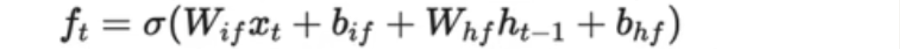

<u>接下来，细胞门 $g_t $：</u> 

细胞门$g_t$也是类似的，只不过当前 `sigmoid` 替换成了`tanh函数`

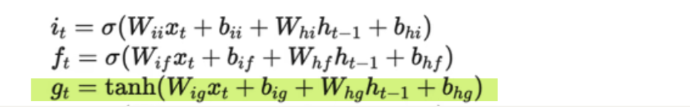

所以继续复制下来 ，再改，就可以计算出细胞状态 $g_t$ ：

```python
g_t = torch.tanh(w_times_x[:,2*h_size:3*h_size]+w_times_h_prev[:,2*h_size:3*h_size]+b_ih[2*h_size:3*h_size]+b_hh[2*h_size:3*h_size])
```

gt是`二倍的hidden size` 到 `三倍的 hidden size`这个区间

同样后面的偏置也是一样的

换一个区间，然后 非线性激活函数改成 `tanh函数`

<u>最后是$o_t$， 输出门：</u>

- `tanh函数` 换成 `sigmoid函数`

- 最后区间是最后的四分之一，可以写成 `3倍的hidden size`到`4倍的hidden size`

```python
o_t = torch.sigmoid(w_times_x[:,3*h_size:4*h_size]+w_times_h_prev[:,3*h_size:4*h_size]+b_ih[3*h_size:4*h_size]+b_hh[3*h_size:4*h_size])
```

- 或者直接 `w_times_x[:,3*h_size:]`  ：`3`倍的 `hidden size`，`4`可以省略

以上是所有的 `i、f、g、o`

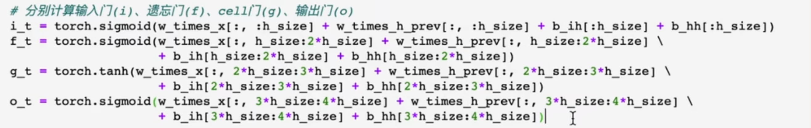


写完了 $i、f、g、o$，接下来写细胞状态 $c_t、 h_t$

$c_t$怎么写呢？

> $c_t$ 直接是元素相乘，实现的时候不用 $c_t$，用$\mathrm{prev_c}$
>
> 因为现在用 `for循环`迭代
>
> 要保证下一时刻$\mathrm{prev_c}$的量是存在的，用$\mathrm{prev_c}$表示$c_t$
>
> 那$prev_c$= $f_t× c_{t-1}加上 i_t×g_t \iff f_t×prev_ c + i_t× g_t$
>
> 以上是对 $prev_c$ 的更新

```python
prev_c = f_t * prev_c + i_t * g_t
```

有了 `prev_c`以后就能计算 `prev_h`


- $prev_h$ 就是当前时刻 LSTM的输出 

- 按照公式 就是 $输出门 × tanh 细胞状态$

```python
prev_h = o_t * torch.tanh(prev_c)
```

以上是对 $c$和 $h$ 的更新

有了 $h$以后，就可以对`输出矩阵`也更新一下，把每一时刻的隐藏层状态存储，存到 `output 矩阵`中：

```python
output[:,t,:] = prev_h
```

以上是所有自定义 LSTM 函数的实现

现在返回：

- 第一个返回值是 输出序列
- 第二个返回值是两个状态 构成的元组，这两个状态分别是 `最后一个时刻的输出` 和  `最后一个时刻的细胞状态`

```python
return output,(prev_h,prev_c)
```


以上是不带 projection的自定义LSTM

接下来测试

测试就是把 `LSTM layer`的`4`个参数取出来，然后喂入到自定义 LSTM函数中，然后对比结果

（1）实例化LSTM 算子，传入`input parameters`

首先把函数签名复制下来：


- `input`还是`input`
- `initial state`就是`h0`和`c0`，就是之前初始化的`h0`和`c0`

```python
lstm_forward(input,(h0,c0),w_ih,w_hh,b_ih,b_hh)
```

- `w_ih`就用之前pytorch中实例化的`lstm layer`的参数拿出来


就是`lstm_layer.参数`


即，

```
lstm_forward(input,(h0,c0),lstm_layer.weight_ih_l0,w_hh,b_ih,b_hh)
```

`w_hh`也是一样的，后面还有两个偏置，最后实例化的自定义 LSTM 函数：

```python
lstm_forward(input,
             (h0,c0),
             lstm_layer.weight_ih_l0,
             lstm_layer.weight_hh_l0,
             lstm_layer.bias_ih_l0,
             lstm_layer.bias_hh_l0)
```

实例化好自定义 LSTM 算子以后，定义变量接收输出

复制前面的变量名，加后缀 custom

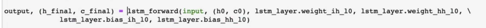

加后缀 custom，表示自定义的LSTM

```python
output_custom,(h_finall_custom,c_finall_custom) = lstm_forward(
    input,
    (h0,c0),      
    lstm_layer.weight_ih_l0,
    lstm_layer.weight_hh_l0,
    lstm_layer.bias_ih_l0,
    lstm_layer.bias_hh_l0)
```

接下来对比前面的 `output` 和自定义实现的 `output_custom`，查看是不是一致用`torch.allclose()`

```python
print(torch.allclose(output,output_custom))
print(torch.allclose(h_finall,h_finall_custom))
print(torch.allclose(c_finall,c_finall_custom))
```

输出三个True

## LSTM 全部代码

```python
import torch
import torch.nn as nn
import torch.nn.functional as F
```

```python
# 定义常量
bs,T,i_size,h_size = 2,3,4,5
# proj_size
input = torch.randn(bs,T,i_size) # 输入序列
c0 = torch.randn(bs,h_size)  # 初始值不需要训练
h0 = torch.randn(bs,h_size)
```

```python
# 调用官方LSTM API
lstm_layer = nn.LSTM(i_size,h_size,batch_first=True)
output,(h_finall,c_finall) = lstm_layer(input,(h0.unsqueeze(0),c0.unsqueeze(0)))

for k,v in lstm_layer.named_parameters():
    print(k,v.shape)
```

OUT：

```
weight_ih_l0 torch.Size([20, 4])
weight_hh_l0 torch.Size([20, 5])
bias_ih_l0 torch.Size([20])
bias_hh_l0 torch.Size([20])
```


```python
# 自己写一个LSTM
def lstm_forward(input,initial_states,w_ih,w_hh,b_ih,b_hh):
    # 以上写好了 函数签名
    h0,c0 = initial_states #初始状态
    bs,T,i_size = input.shape
    h_size = w_ih.shape[0] // 4

    prev_h = h0
    prev_c = c0
    batch_w_ih = w_ih.unsqueeze(0).tile(bs,1,1)
    batch_w_hh = w_hh.unsqueeze(0).tile(bs,1,1)

    output_size = h_size
    output = torch.zeros(bs,T,output_size) # 输出序列

    for t in range(T):
        x = input[:,t,:]  # 当前时刻的输入向量，[bs,i_size]

        w_times_x = torch.bmm(batch_w_ih,x.unsqueeze(-1))  #[bs,4*h_size,1]
        w_times_x = w_times_x.squeeze(-1)  # [bs,4*h_size]

        w_times_h_prev = torch.bmm(batch_w_hh,prev_h.unsqueeze(-1))  #[bs,4*h_size,1]
        w_times_h_prev = w_times_h_prev.squeeze(-1)  # [bs,4*h_size]

        # 分别计算 输入门(i)，遗忘门(f)，cell门(g)，输出门(o)
        i_t = torch.sigmoid(w_times_x[:,:h_size] + w_times_h_prev[:,:h_size]+b_ih[:h_size]+b_hh[:h_size])
        f_t = torch.sigmoid(w_times_x[:,h_size:2*h_size] + w_times_h_prev[:,h_size:2*h_size]+
                            b_ih[h_size:2*h_size]+b_hh[h_size:2*h_size])
        g_t = torch.tanh(w_times_x[:,2*h_size:3*h_size] + w_times_h_prev[:,2*h_size:3*h_size]+
                            b_ih[2*h_size:3*h_size]+b_hh[2*h_size:3*h_size])
        o_t = torch.sigmoid(w_times_x[:,3*h_size:4*h_size] + w_times_h_prev[:,3*h_size:4*h_size]+
                            b_ih[3*h_size:4*h_size]+b_hh[3*h_size:4*h_size])


        prev_c = f_t * prev_c + i_t * g_t
        prev_h = o_t * torch.tanh(prev_c)

        output[:,t,:] = prev_h

    return output,(prev_h,prev_c)

output_custom,(h_finall_custom,c_finall_custom) = lstm_forward(input,(h0,c0),lstm_layer.weight_ih_l0,
                                                               lstm_layer.weight_hh_l0,
                                                               lstm_layer.bias_ih_l0,lstm_layer.bias_hh_l0)

```

```python
print(torch.allclose(output,output_custom))
print(torch.allclose(h_finall,h_finall_custom))
print(torch.allclose(c_finall,c_finall_custom))
```

OUT：

```
True
True
True
```

## LSTMP

要解决的问题：

- 什么是 `projection`呢
- 如果要写 `projection`，需要怎么改造？

### 官方 api实现 LSTMP

注意看参数变化

调用官方 api 需要加一个量 `proj_size`

`proj size` 等于多少呢？


一般 `projection size`比`hidden size`小

即要对`hidden state`进行压缩， 压缩肯定是要往小的维度压缩

如果`hidden size`等于`5`的话，那`projection size`就设置成`3`，比`hidden size`小一点就好，以上实现了 `projection layer`

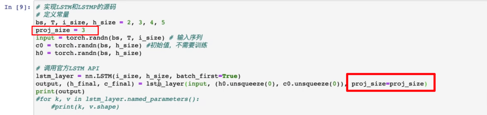

现在再来看 `lstm layer`的参数输出

传入`proj size`以后，还要改变`h0`

> 因为如果`LSTM`带了`projection`的话
>
> 则`h`实际上是要压缩的，维度不再是`h_size`；而是`projection_size`，所以 `h_0`也要改一下	

`projection`的作用实际上就是对 `h0`进行一个压缩，接下来查看模型参数：


相比于`lstm`，`lstmp`多了一个结果：`weight_hr_l0` ， 这个参数就是对 `hidden state` 进行压缩

`hidden state`的大小实际变成了`3`，不再是`5`

接下来，打印`output.shape`和`h_finall.shape`、`c_finall.shape`


可以看到`lstmp`的`output shape`是`2×2×3`的，不是 `2×3×5` ，因为对输出进行了压缩

`h_finall`和`c_finall`分别是 `1×2×3` 和 `1×2×5`的

可以看到 `h_finall`的大小也变成了`3`，但是`c`的大小仍然是`5`

> 理由：只对输出进行了压缩，不会对细胞状态进行压缩

以上是projection的原理，

### 自定义 LSTMP 代码实现

接下来修改自定义函数：

多了一个`projection`参数，所以签名中加入`w_hr` 并且设置默认为`None`

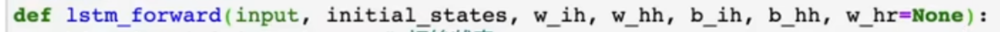

- 如果是`None`的话，就是一个普通的`lstm`
- 如果不是`None` 就是带有`projection`的

新加入参数以后，后续需要做哪些修改呢？

首先对`output size`做一个判断，如果有`projection size`，`output size` 就不是 `h size`

```python
if w_hr is not None:
```

要判断，首先需要找到`projection size`，简写为`p_size`：

```python
p_size,_ = w_hr.shape[0]
```

它是`w_hr`的第`0`维


红框就是`projection size`，然后 `output size`等于 `p_size`

```python
output_size = p_size
```

如果 `else`的话，`output size`就等于 `h size`

```python
else:
    output_size = h_size
```

全部的代码：


以上是引入`projection`以后做的改变

另外 `w_hr`，同样要引入`batch`的维度 


同样引入`batch`的维度，但是这时候，形状就是 `bs×p_size ×h_size`


这是对`output size`做的变更

> 因为引入了`projection`，所以`output`大小是变小了

那么接下来要变更哪里呢？

- 现在引入了`projection`之后，这里的`hidden_size`是变小的，已经变成了 `projection_size`
- 也就是说 `w_times_h_prev`大小仍然是：`bs×4倍的hidden size`

<u>但它是怎么得到呢？</u>

- 它是 $batch\_w\_hh$ (`bs×4倍的hidden size再乘以p size`)，再跟 $prev\_h$ `(p_size`)进行相乘，然后`p_size`这个维度就消掉了
- 最终，得到 $\mathrm{batch\_size × 4*hidden\_size}$ 


- `batch_w_hh.shape = torch.Size([2, 20, 3])`
- `prev_h.shape = torch.Size([2, 3])`
- `w_times_h_prev.shape = torch.Size([2, 20, 1])` 

- `h_size = 5`
- `bs = 2`
- `proj_size = 3`

如果引入了 `projection`，需要在得到的`prev_h`这里，进行压缩


现在 `prev_h`这里，大小是 `bs×h_size`

但输出的`h` 要是 `p_size`的，所以 要进行一个压缩

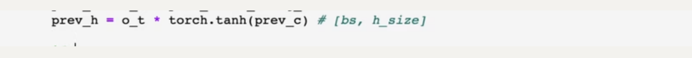

同样，如果 `w_hr`不是`None`的话，就要做`projection`，要对 `prev_h`进行一个压缩

压缩原理仍然是用，矩阵相乘的算法

用压缩矩阵 `w_hr`跟`prev_h`相乘，需要对 `prev_h`进行扩一维，最后一个维度扩一维

```python
if w_hr is not None:# 做projection
    prev_h = torch.bmm(batch_w_hr,prev_h.unsqueeze(-1))
```

这样 `prev_h`的维度就变成了 `bs×p_size×1`

把这个`1`，最后再去掉

```python
if w_hr is not None:# 做projection
    prev_h = torch.bmm(batch_w_hr,prev_h.unsqueeze(-1)) 
    # [bs,p_size,1]
    prev_h = prev_h.squeeze(-1) # bs× p_size
```

以上实现了`projection`

 `lstm projection`的原理，会对输出状态进行一个压缩，然后整个 `output`的维度就变小了，另外引入`projection`，整个计算量都是变小的


- batch_w_hh：`batch size× 4倍的hidden size× hidden size`

   → 变成了 `4倍的hidden_size × p_size`

- 所以它的参数数目是降低的，运算量是降低的

- 另外  `prev_c`的维度是`没有变`得，仍然是 `hidden_size`

- 但是`prev_h`的维度是`降低`的

以上在自定义的 `lstm forward` 引入了 `projection`

接下来继续测试，并且把 `weight_hr_l0`传入进来，得到`带有projection的自定义函数`

接下来进行测试，查看结果是否一致。

`lstmp` 简单来说：

> - 对输出的状态，也就是`prev_h`进行压缩，使得整个LSTM网络，运算量和参数量都有减小
> - 主要是`w_hh` 权重的维度是有降低的，运算量也是减少的

### LSTMP的全部代码

```python
# 定义常量
bs,T,i_size,h_size = 2,3,4,5
proj_size = 3
input = torch.randn(bs,T,i_size) # 输入序列
c0 = torch.randn(bs,h_size)  # 初始值不需要训练
h0 = torch.randn(bs,proj_size)
```

```python
# 调用官方LSTM API
lstm_layer = nn.LSTM(i_size,h_size,batch_first=True,proj_size = proj_size)
output,(h_finall,c_finall) = lstm_layer(input,(h0.unsqueeze(0),c0.unsqueeze(0)))

print(output.shape,h_finall.shape,c_finall.shape)

for k,v in lstm_layer.named_parameters():
    print(k,v.shape)
```

```
torch.Size([2, 3, 3]) torch.Size([1, 2, 3]) torch.Size([1, 2, 5])
weight_ih_l0 torch.Size([20, 4])
weight_hh_l0 torch.Size([20, 3])
bias_ih_l0 torch.Size([20])
bias_hh_l0 torch.Size([20])
weight_hr_l0 torch.Size([3, 5])
```

```python
# 自己写一个LSTM
def lstm_forward(input,initial_states,w_ih,w_hh,b_ih,b_hh,w_hr=None):
    # 以上写好了 函数签名
    h0,c0 = initial_states #初始状态
    bs,T,i_size = input.shape
    h_size = w_ih.shape[0] // 4

    prev_h = h0
    prev_c = c0
    batch_w_ih = w_ih.unsqueeze(0).tile(bs,1,1)
    batch_w_hh = w_hh.unsqueeze(0).tile(bs,1,1)

    if w_hr is not None:
        p_size = w_hr.shape[0]
        output_size = p_size
        batch_w_hr = w_hr.unsqueeze(0).tile(bs,1,1)  # [bs,p_size,h_size]
    else:
        output_size = h_size

    output = torch.zeros(bs,T,output_size) # 输出序列

    for t in range(T):
        x = input[:,t,:]  # 当前时刻的输入向量，[bs,i_size]

        w_times_x = torch.bmm(batch_w_ih,x.unsqueeze(-1))  #[bs,4*h_size,1]
        w_times_x = w_times_x.squeeze(-1)  # [bs,4*h_size]

        w_times_h_prev = torch.bmm(batch_w_hh,prev_h.unsqueeze(-1))  #[bs,4*h_size,1]
        w_times_h_prev = w_times_h_prev.squeeze(-1)  # [bs,4*h_size]

        # 分别计算 输入门(i)，遗忘门(f)，cell门(g)，输出门(o)
        i_t = torch.sigmoid(w_times_x[:,:h_size] + w_times_h_prev[:,:h_size]+b_ih[:h_size]+b_hh[:h_size])
        f_t = torch.sigmoid(w_times_x[:,h_size:2*h_size] + w_times_h_prev[:,h_size:2*h_size]+
                            b_ih[h_size:2*h_size]+b_hh[h_size:2*h_size])
        g_t = torch.tanh(w_times_x[:,2*h_size:3*h_size] + w_times_h_prev[:,2*h_size:3*h_size]+
                            b_ih[2*h_size:3*h_size]+b_hh[2*h_size:3*h_size])
        o_t = torch.sigmoid(w_times_x[:,3*h_size:4*h_size] + w_times_h_prev[:,3*h_size:4*h_size]+
                            b_ih[3*h_size:4*h_size]+b_hh[3*h_size:4*h_size])


        prev_c = f_t * prev_c + i_t * g_t
        prev_h = o_t * torch.tanh(prev_c)

        if w_hr is not None: # 做projection
            prev_h = torch.bmm(batch_w_hr,prev_h.unsqueeze(-1)) # [bs,p_size,1]
            prev_h = prev_h.squeeze(-1) # bs× p_size
             

        output[:,t,:] = prev_h

    return output,(prev_h,prev_c)

output_custom,(h_finall_custom,c_finall_custom) = lstm_forward(input,(h0,c0),lstm_layer.weight_ih_l0,
                                                               lstm_layer.weight_hh_l0,
                                                               lstm_layer.bias_ih_l0,lstm_layer.bias_hh_l0,
                                                               lstm_layer.weight_hr_l0)

```

```python
print(torch.allclose(output,output_custom))
print(torch.allclose(h_finall,h_finall_custom))
print(torch.allclose(c_finall,c_finall_custom))
```

```
True
True
True
```

