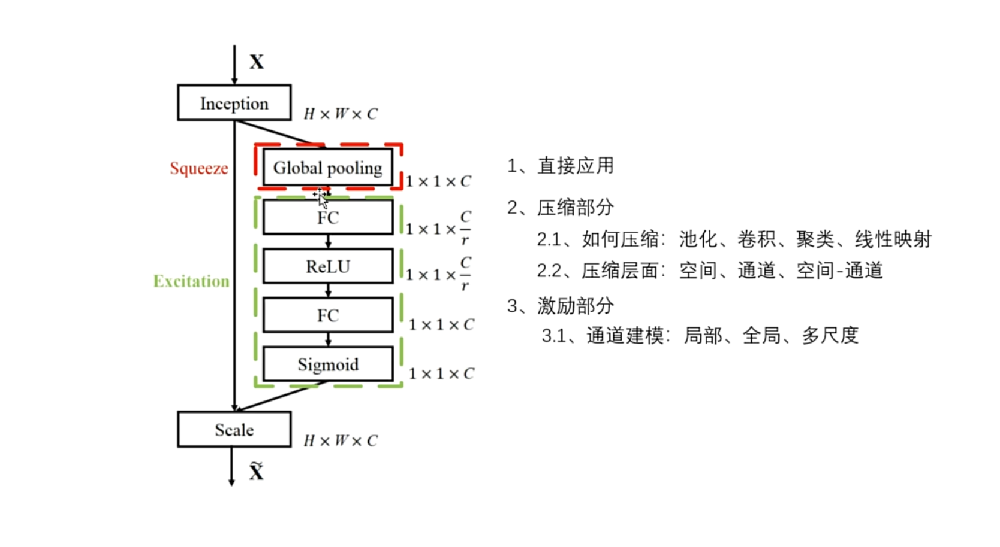
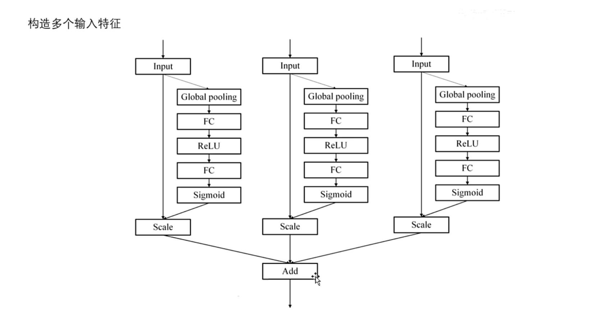

# SENet

通道注意力

谷歌学术引用超2万次

深度学习在大量数据的基础上\在高维的向量空间来进行计算,从而来挖掘数据潜在的最重要的一个特征

 

- 例如可以学习一个模型,来识别小狗和小猫,这个模型一定是掌握了猫狗最重要的特征,这样才能够将它们区分开
- 或者是学习一个模型,来预测未来的天气状况,模型通过分析重要的特征,掌握数据的变化规律
- 通道注意力的提出就是为了帮助模型去强调一些重要的特征,忽略掉一些不重要的特征
- 例如要强调这个小猫的胡子特征\眼睛特征,这都是小猫的独特之处
- 通道注意力,可以把 看中的某个指标  权重加大,不感兴趣的地方减小,甚至忽略掉它

通道注意力的理论基础,分为两个步骤,压缩和激励

前提:给定图像,表示先进行变换,这个变换可以是简单的卷积操作,或者是一个网络,它输出的维度是一个H×W×C的特征,HW分别是图片的高和宽,C是通道的数量或者说是特征的数量

 

(1)压缩:作者在这个空间方向上即H×W这个层面上进行压缩,将原本H×W大小的图片,压缩到1×1的大小,变成1×1×C的向量,在每一个特征对应的空间图上,都进行压缩,这里的压缩使用的是平均池化,当压缩完成之后,就进入到了第二个阶段

(2)激励:首先通过两层的全连接层,来学习通道和通道之间的相关性,这两层全连接先降维,从C降到$\frac{C}{r}$ ,再升维

> 先降维再升维的目的是为了提高计算效率
>
> r 是降维的倍数,再通过两层全连接之后,再通过Sigmoid的门控机制,来生成权重表示

- sigmoid会把每个数值映射到0~1之间的范围内,一个天然的权重生成器
- 还有一点需要注意,Sigmoid函数是没有参数的,如果输入不变的话,它生成的权重也是不会变化的,所以为了增强表达能力,通常和全连接层一块使用
- 两层全连接层的另外一个作用:为了参数化门控机制,最后将得到的权重,与输入的特征图进行相乘,通道对应相乘,每一个通道都有对应的权重,与之相乘,(广播操作), 得到输出

随手补充

两层全连接的好处:

(1)减少参数

(2)参数化门控机制

**流程图** 

   

(1)输入X,通过网络进行特征提取,然后在空间层面上通过平均池化操作,压缩为一个$1×1×C$的一个向量表示,然后进入到绿色框(激励的阶段)

(2)首先通过两层的全连接网络,(FC-ReLU-FC),先降维到 $\frac{C}{r}$ ,然后再升维到 $1×1×C$ ,为了提取通道间的依赖性关系

(3)然后两层全连接网络之后,再接 Sigmoid 函数生成权重表示,然后将生成的权重与之前的输入进行相乘,对不同的通道进行强调 或者抑制,这就是通道注意力

随手补充:拓展

多尺度通道建模\空间建模\通道空间交互建模

学习通道注意力,不能只学SENet,要好好学别人的论文是怎么应用通道注意力的,怎么把它迁移到其他领域中去的,学习改进学习迁移

## 拓展

 

(1)最简单的思路:串联

一个模块后面紧接着通道注意力

(2)压缩层面:

作者在压缩部分,也就是在空间层面 $H × W$ ,应用平均池化操作,获得 $1×1×C$ 的通道描述符表示

==有两个可以改进的方向== 

- ① 压缩操作如何压缩
- ② 是否可以在其他层面进行压缩

① 压缩操作

> 平均池化\最大池化\卷积,都可以起到压缩的作用,还可以使用聚类算法,或者使用线性层,映射到低维向量

②压缩层面

> 在这个H方向或者W方向上,单独运用池化操作
>
> 除了空间层面,还能在C方向,通道方向上单独应用池化操作
>
> 空间(H×W)和通道(C/特征)都能够运用池化操作,还能在空间和通道层面,联合应用池化操作(eg.$W×C$/$H×C$)

③ 激励层面:

作者使用的是两层的全连接网络,先降维到 $\frac{C}{r}$ ,再升级到通道 $C$,学习所有通道之间的相关性

改进:(通道建模)

(1)通道方向的卷积,进行局部通道建模(?)

(2)在通道上执行注意力,进行全局性建模

(3)卷积和注意力一块使用,同时建模局部和全局的通道相关性

(4)使用多个不同大小的卷积,建模多尺度通道相关性

---

以上是压缩和激励(对单个输入的所有通道,进行加权),是模型层面,下面是输入输出层面

构造多个输入,对多个输入分别进行加权,来获得多尺度的特征

(1)最直观的想法,多个SENet,通道注意力,并行,各自没有交集,仅从输出层面上进行相加

 

03:36 那么最直观的想法呢就是这个样子
03:38 
03:42 他们对吧
03:45 
03:48 那么这样肯定不行呀
03:50 因为毫无创新点
03:51 那我们应该怎么改进呢
03:54 首先看这张图呃
03:56 那么最直观的想法呢
03:58 嗯首先呢我们要知道多个输入的关系是什么
04:02 Input 1input
04:03 2input3的它们之间的关系是什么
04:05 那么一般来说呢它们是同一种信息的不同表达
04:09 你呢可以既可以通过三个不同的全连接层
04:12 来得到三个不同的表示
04:14 或者呢通过三个不同大小的卷积层
04:17 来获得三种不同尺度的信息
04:20 他们绝对是同一种信息的不同表达
04:23 这样才更加的有意义
04:25 那么其次在压缩阶段呃
04:29 大家看这个红框框标注的部分
04:31 我们照猫画虎将三个输入呢进行相加
04:35 然后融合了这么多尺度信息之后呢
04:39 再通过一个拳击磁化操作
04:41 来获得一个通道描述符
04:43 表示将其压缩为11乘C
04:46 那么第三步在激励阶段
04:49 我们继续照猫画虎
04:51 也是通过两层的全连接层
04:53 来建立通道之间的一个关系
04:55 但是这里需要注意
04:58 在第一个全连接层呢
04:59 我们先将C降维到二分之C
05:02 那么在第二个全连接层呢
05:04 我们就不能仅仅的恢复到C了
05:07 为什么
05:07 因为我们有三个输入
05:08 这意味着要产生三个权重才行
05:11 所以在第二个全连接层
05:13 我们需要将它升为到3C
05:15 然后再在通道上进行一个分割操作
05:19 平均分割为三份
05:21 然后分别通过SIGMOID函数来生成一个权重表示
05:25 然后将权重与对应的三个输入分别进行相乘
05:29 最后呢再通过一个加权和
05:32 来得到最后的一个输出
05:35 今天讲的货太干了
05:36 也不知道有几个同学还能听到这里
05:38 如果听到这里的小伙伴呢
05:40 嗯可以扣个六来支持一下大队长
05:43 然后如果大家正处于科研入门
05:46 或者想idea的一个阶段
05:47 可以到我的工房内了解一下新书
05:50 绝对是市面上最干货的资料
05:52 大家一定不会失望的