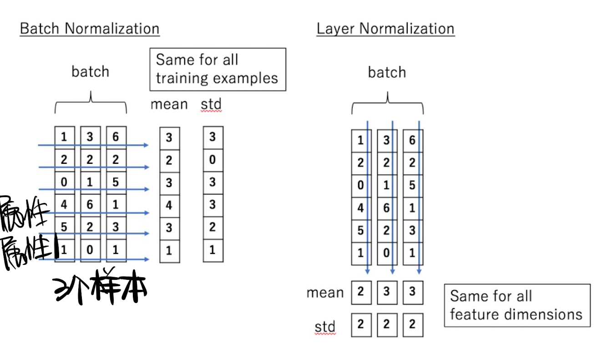
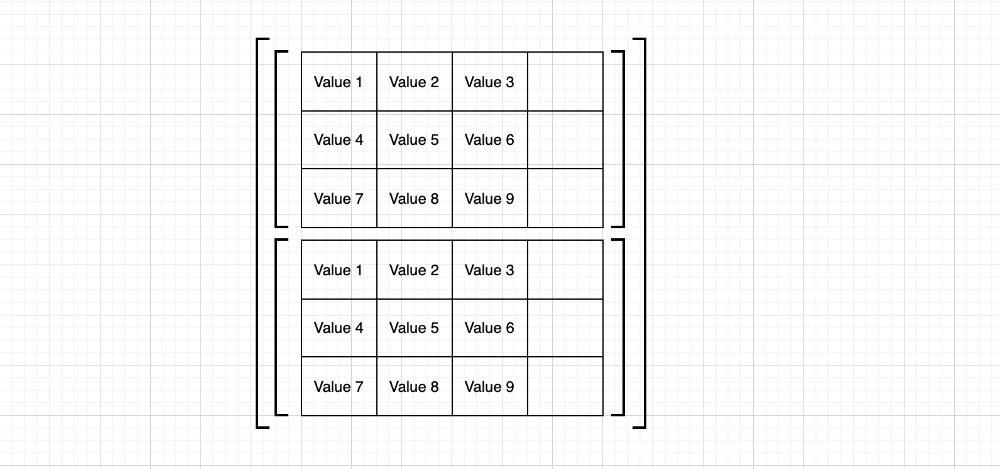

# 图解LayerNorm & BatchNorm





## BatchNorm1D、NLP

b=2，n=3，d=4

- [x] 理解 3维张量、4维张量：

$\begin{cases}
矩阵法:2个3×4的矩阵 \\  \\
抽屉法:一直划分同一个方向，直到最后一个维度，画另一个方向
\end{cases}$

> 都是横排和竖排的数字排列，不同维度的张量表示不同的分组

### 怎么理解nlp中的三维张量？

- [x] 矩阵法：

2个3×4的矩阵，图解：



- [x] 抽屉法

（第一次真正开始理解多维张量是好朋友拿抽屉给我举得例子，四维张量就是抽屉里面还有抽屉）

要点：一直沿同一个方向划分，直到最后一维换方向

2×3×4


：逻辑理顺了，感觉自己做这些东西蠢蠢的......但是，我记性不好，总忘......笨就笨吧，（凌妙妙口吻：师傅天天说人家笨，可人家本来就是笨）

- [x] 实际意义

对于nlp来说，bnd=234表示b个句子，每个句子n个词，每个词有d个维度

$batch\_size × max\_sequence\_length × model\_dim$

就是说 现在有 2个句子，每个句子3个单词，每个单词用4维向量表示


这里的问题是：我们这个元素的个数都是对的，但是在计算机中存储中，并不是这么存的

- [x] 实际意义 & 矩阵法 & 计算机存储逻辑


```python
batch_size = 2
times_steps = 3
embedding_dim = 4

inputx = torch.randn(batch_size,times_steps,embedding_dim) # N*L*C
print(inputx)
```

输出：

```python
tensor([[[ 0.8475, -0.3956, -0.5602,  1.4907],
         [-0.0746, -0.0021,  0.1291, -0.0343],
         [-0.3636,  1.8378,  0.1954, -1.0180]],

        [[-1.0256,  1.0202,  0.7321,  0.3294],
         [-0.6416,  0.5399,  0.8733,  1.7110],
         [-1.1292,  0.2056,  0.6884,  0.2267]]])
```


- [ ] `torch.randn` & `torch.rand`

现在开始nlp&BN，图形结合，例子，数学例子，不要脱离实际意义

也就是说

 输入：三维张量，也可以理解为二维数表，用括号分组，所以有了不同的意义

### 怎么计算BN1D？


```python
bn_mean = inputx.mean(dim=(0,1),keepdim=True)
print(bn_mean)
```

输出：

```python
tensor([[[ 0.0695, -0.6811, -0.1232, -0.5339]]])
```

 好嘟，这串代码是没有任何问题了

### 代码实现

库函数要的输入格式：bnd $\rightarrow$ bdn

- [x] 说一下这边的转置 .transpose(-1,-2)


官网api给了，输入bdn，输出bdn，所以输出以后再transpose，变成bnd

还有一点，不管是BN还是LN都是不改变形状的

```python
batch_size = 2
times_steps = 3
embedding_dim = 4

inputx = torch.randn(batch_size,times_steps,embedding_dim) # N*L*C
# print(inputx)
# 1. 实现batch_norm并验证API

## 调用 batch_norm API
batch_norm_op = torch.nn.BatchNorm1d(embedding_dim,affine=False)
bn_y = batch_norm_op(inputx.transpose(-1,-2)).transpose(-1,-2)

## 手写batch_norm
bn_mean = inputx.mean(dim=(0,1),keepdim=True)
# print(bn_mean)
bn_std = inputx.std(dim=(0,1),unbiased=False,keepdim=True)
verify_bn_y = (inputx - bn_mean)/(bn_std+1e-5)
print(bn_y)
print(verify_bn_y)
print(torch.allclose(bn_y,verify_bn_y))
```

输出：

```
tensor([[[ 1.2288e+00,  2.1594e-01, -8.7470e-01,  1.3089e+00],
         [ 1.2093e+00,  5.8475e-01, -4.2434e-01, -4.7364e-01],
         [-1.0128e+00, -1.9468e+00, -1.2768e+00,  2.7564e-01]],

        [[-1.1732e+00,  3.5125e-01,  1.5184e+00, -1.3330e+00],
         [ 4.1865e-01, -4.3382e-01, -4.6577e-04,  1.1563e+00],
         [-6.7079e-01,  1.2287e+00,  1.0579e+00, -9.3418e-01]]])
tensor([[[ 1.2288e+00,  2.1594e-01, -8.7470e-01,  1.3089e+00],
         [ 1.2093e+00,  5.8474e-01, -4.2434e-01, -4.7363e-01],
         [-1.0128e+00, -1.9468e+00, -1.2768e+00,  2.7564e-01]],

        [[-1.1732e+00,  3.5125e-01,  1.5183e+00, -1.3330e+00],
         [ 4.1865e-01, -4.3382e-01, -4.6576e-04,  1.1563e+00],
         [-6.7079e-01,  1.2287e+00,  1.0579e+00, -9.3418e-01]]])
True
```

## BN2D

图片的存储格式：bchw

计算BN

自己脑袋里想的：


计算机认识的：


加括号，就变成了张量

计算机与实际意义联系起来：优先竖排，最后一维横排

