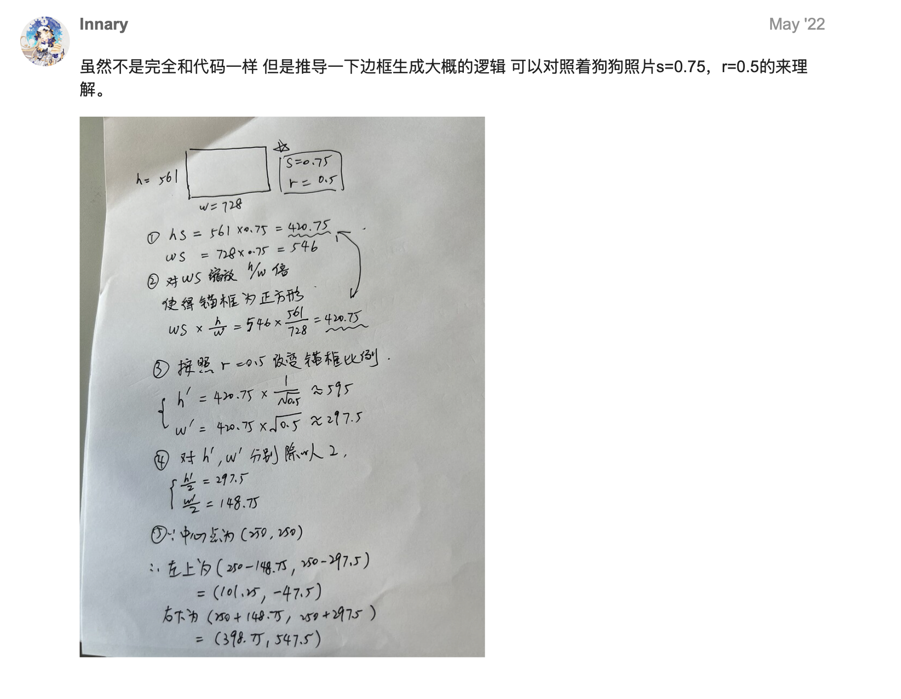
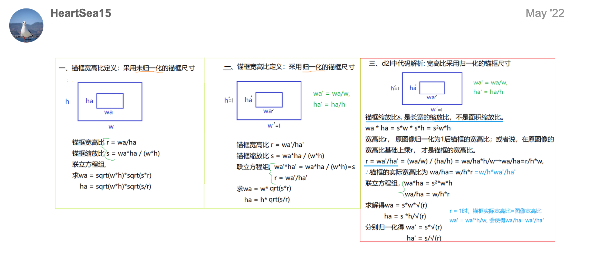
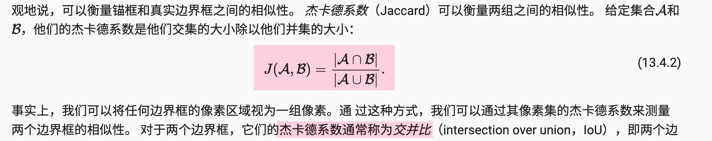
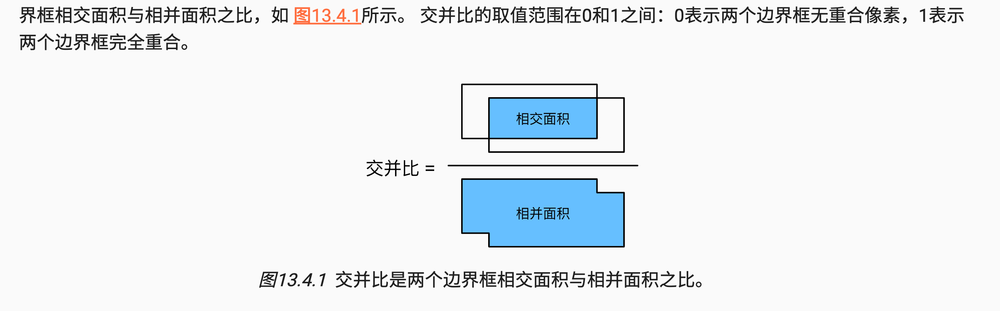
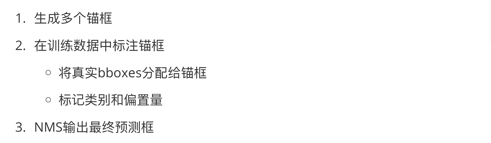

# [李沐](https://zh-v2.d2l.ai/chapter_computer-vision/bounding-box.html) 目标检测部分

## k1 边界框

### **是什么？**

文字：bounding box

图示：


### **怎么实现？**

1. 两角表示法：由矩形左上角的以及右下角的x和y坐标决定
1. 中心宽度表示法：边界框中心的(x,y)轴坐标以及框的宽度和高度

pytorch中常用的格式：

boxes：

- x1, y1, x2, y2 （shape=n×4）
- cx, cy, w, h（shape=n×4）

n表示框的数量，不止一个框

### 代码实现

含测试代码

```python
import numpy as np

#@save
def box_corner_to_center(boxes):
    """从（左上，右下）转换到（中间，宽度，高度）"""
    x1, y1, x2, y2 = boxes[:, 0], boxes[:, 1], boxes[:, 2], boxes[:, 3]
    cx = (x1 + x2) / 2
    cy = (y1 + y2) / 2
    w = x2 - x1
    h = y2 - y1
    boxes = np.stack((cx, cy, w, h), axis=-1)
    return boxes

#@save
def box_center_to_corner(boxes):
    """从（中间，宽度，高度）转换到（左上，右下）"""
    cx, cy, w, h = boxes[:, 0], boxes[:, 1], boxes[:, 2], boxes[:, 3]
    x1 = cx - 0.5 * w
    y1 = cy - 0.5 * h
    x2 = cx + 0.5 * w
    y2 = cy + 0.5 * h
    boxes = np.stack((x1, y1, x2, y2), axis=-1)
    return boxes

# bbox是边界框的英文缩写
dog_bbox, cat_bbox = [60.0, 45.0, 378.0, 516.0], [400.0, 112.0, 655.0, 493.0]

boxes = np.array((dog_bbox, cat_bbox))
box_center_to_corner(box_corner_to_center(boxes)) == boxes
```

OUT：

```python
array([[ True,  True,  True,  True],      
       [ True,  True,  True,  True]])
```

这里想强调的一点：

我们用的电脑屏幕和pytorch中，默认的原点在左上角

图像中坐标的原点是图像的左上角，向右的方向为x轴的正方向，向下的方向为y轴的正方向。


## K2 锚框

### 锚框是什么？

- anchor box
- 以每个像素为中心，生成多个缩放比和宽高比（aspect ratio）不同的边界框
- 应用：基于锚框的目标检测模型
- 是一种 **区域采样方法**

图示：


### 生成多个锚框

**这里要解决的问题：给定输入图像高度h、宽度w，缩放比s，宽高比r，问题锚框的宽度和高度？**

> 缩放比$s$：对输入图像进行缩放，输入图像的宽度和高度分别缩放s倍，得到锚框的宽度和高度
>
> 宽高比$r$
>
> ~~① 指的是锚框的宽和高之比~~
>
> ② $r$是对于输入图像宽高比的放缩，例如输入图像的宽高比是$w/h$，添加r后变成了$(w/h)*r$，得到锚框的宽高比$(w/h)*r$
>
> > 其实我觉得这个r可以理解为输入图像宽高比的缩放比率，只不是这个比率 $r>0$即可，因为可以在原始图像宽高比的基础上放大宽高比 或者 减少宽高比
>
> 总结：
>
> s：scale
>
> r：aspect ratio
>
> 从原始图像到确定锚框，需要知道锚框的......

----

**书上：** 


要搞清楚的点：

- [x] 缩放比s的意义
- [x] 宽高比r的意义
- [x] 锚框的宽度和高度怎么来？
- [x] 什么叫做原始图像归一化为正方形？

> 因为锚框的生成是在单位像素内进行的，参照系变了
>

首先[解释(from 讨论区)](https://fkjkkll.github.io/2021/11/23/%E7%9B%AE%E6%A0%87%E6%A3%80%E6%B5%8BSSD/)这里锚框的宽度和高度：


----

<span id='001'>**书上：** </span>


问题：要生成多个锚框

解决：设置多个$s$和$r$即可，然后考虑每个可能的s与r的组合，==但是实践中往往只考虑s1和r1的所有组合==

### 代码实现

- [ ] todo：为什么需要半宽、半高，后面都是什么意思？锚框生成的步骤是怎么样的？


```python
# 除以2来获得半高和半宽
anchor_manipulations = torch.stack((-w, -h, w, h)).T.repeat(
                                    in_height * in_width, 1) / 2

# 每个中心点都将有“boxes_per_pixel”个锚框，
# 所以生成含所有锚框中心的网格，重复了“boxes_per_pixel”次
out_grid = torch.stack([shift_x, shift_y, shift_x, shift_y],
            dim=1).repeat_interleave(boxes_per_pixel, dim=0)
output = out_grid + anchor_manipulations
```


- [x] in_height, in_width = data.shape[-2:]

data format：b c h w

- [x] device, num_sizes, num_ratios = data.device, len(sizes), len(ratios)

num_sizes表示scale、num_ratios表示aspect ratio

- [x] [boxes_per_pixel = (num_sizes + num_ratios - 1)](#001)

- [x] center_h = (torch.arange(in_height, device=device) + offset_h) * steps_h 乘 steps_h？

- 因为原点在左上角，所以是锚框中心点分别加offset_h、offset_w
- 对每个像素点生成锚框，每个像素点都有生成 num_sizes+num_ratios-1的锚框
- 所以对于单个像素点来说，参考点变了，全部变成了单位坐标下的度量，所以乘以 steps_h 和 steps_w
- steps_h = 1/原始高度 &  steps_w = 1/原始宽度

- [x] torch.meshgrid？

> shift_y, shift_x = torch.meshgrid(center_h, center_w, indexing='ij')
>
> shift_y, shift_x = shift_y.reshape(-1), shift_x.reshape(-1)

#### **torch.meshgrid()**

- 输入：一组一维张量
- 输出：一个多维网格坐标
- deal：每个输出张量的形状与输入张量的形状相同，但每个输出张量的值是沿着相应维度的网格坐标。

举例：

```python
import torch

# 定义一维张量
x = torch.tensor([1, 9])
y = torch.tensor([4, 5,7,10])

# 生成网格坐标
grid_x, grid_y = torch.meshgrid(x, y, indexing='ij')

print("grid_x:")
print(grid_x)
print("grid_y:")
print(grid_y)
```

Out:

```
grid_x:
tensor([[1, 1, 1, 1],
        [9, 9, 9, 9]])
grid_y:
tensor([[ 4,  5,  7, 10],
        [ 4,  5,  7, 10]])
```

解释为什么的这样的输出：

> - 结果解读：
>
> grid_x 和 grid_y 对应位置的元素构成一对坐标，所以可以看到 grid_x 和 grid_y 形状是相同的
>
> 具体来说就是，x的所有取值和y的所有取值，能构成多少对坐标
>
> x={1,9}，y={4, 5,7,10}
>
> 所以 x 和 y 的所有坐标的集合：
>
> (1,4)(1,5)(1,7)(1,10)
>
> (9,4)(9,5)(9,7)(9,10)
>
> 然后把所有的x取出来，得到grid_x：
>
> [1,1,1,1]
>
> [9,9,9,9]
>
> 同理，由y得到grid_y：
>
> [4,5,7,10]
>
> [4,5,7,10]

#### 全部代码

```python
import torch

def multibox_prior(data, sizes, ratios):
    """生成以每个像素为中心具有不同形状的锚框"""
    in_height, in_width = data.shape[-2:] # b c h w
    device, num_sizes, num_ratios = data.device, len(sizes), len(ratios)
    boxes_per_pixel = (num_sizes + num_ratios - 1)
    # boxes_per_pixel = num_sizes * num_ratios
    size_tensor = torch.tensor(sizes, device=device) # sizes：scale input h & w 分别缩放 size
    ratio_tensor = torch.tensor(ratios, device=device) # ratio：aspect ratio

    # 为了将锚点移动到像素的中心，需要设置偏移量。
    # 因为一个像素的高为1且宽为1，我们选择偏移我们的中心0.5
    offset_h, offset_w = 0.5, 0.5
    steps_h = 1.0 / in_height  # 在y轴上缩放步长
    steps_w = 1.0 / in_width  # 在x轴上缩放步长

    # 生成锚框的所有中心点
    # 因为原点在左上角，所以是锚框中心点分别加offset_h、offset_w
    center_h = (torch.arange(in_height, device=device) + offset_h) * steps_h
    center_w = (torch.arange(in_width, device=device) + offset_w) * steps_w
    # 对每个像素点生成锚框，每个像素点都有生成 num_sizes+num_ratios-1的锚框，所以对于单个像素点来说
    # 参考点变了，全部变成了单位坐标下的度量，所以除以 steps_h 和 steps_w
    shift_y, shift_x = torch.meshgrid(center_h, center_w, indexing='ij')
    shift_y, shift_x = shift_y.reshape(-1), shift_x.reshape(-1)

    # 生成“boxes_per_pixel”个高和宽，
    # 之后用于创建锚框的四角坐标(xmin,xmax,ymin,ymax)
    w = torch.cat((size_tensor * torch.sqrt(ratio_tensor[0]),
                   sizes[0] * torch.sqrt(ratio_tensor[1:])))\
                   * in_height / in_width  # 处理矩形输入
    h = torch.cat((size_tensor / torch.sqrt(ratio_tensor[0]),
                   sizes[0] / torch.sqrt(ratio_tensor[1:])))
    # 除以2来获得半高和半宽
    anchor_manipulations = torch.stack((-w, -h, w, h)).T.repeat(
                                        in_height * in_width, 1) / 2

    # 每个中心点都将有“boxes_per_pixel”个锚框，
    # 所以生成含所有锚框中心的网格，重复了“boxes_per_pixel”次
    out_grid = torch.stack([shift_x, shift_y, shift_x, shift_y],
                dim=1).repeat_interleave(boxes_per_pixel, dim=0)
    output = out_grid + anchor_manipulations
    return output.unsqueeze(0)

h = 561
w = 728
X = torch.rand(size=(1, 3, h, w)) # 随机生成输入图像 b c h w
Y = multibox_prior(X, sizes=[0.75, 0.5, 0.25], ratios=[1, 2, 0.5])
Y.shape
```

#### torch.meshgrid & reshape

```python
import torch

in_height, in_width = 3, 3
device = torch.device('cpu')
offset_h, offset_w = 0.5, 0.5
steps_h = 1.0 / in_height
steps_w = 1.0 / in_width

center_h = (torch.arange(in_height, device=device) + offset_h) * steps_h
center_w = (torch.arange(in_width, device=device) + offset_w) * steps_w
shift_y, shift_x = torch.meshgrid(center_h, center_w, indexing='ij')

print("shift_y (before reshape):")
print(shift_y)
print("shift_x (before reshape):")
print(shift_x)

shift_y, shift_x = shift_y.reshape(-1), shift_x.reshape(-1)

print("shift_y (after reshape):")
print(shift_y)
print("shift_x (after reshape):")
print(shift_x)
```

输出：

```
shift_y (before reshape):
tensor([[0.1667, 0.1667, 0.1667],
        [0.5000, 0.5000, 0.5000],
        [0.8333, 0.8333, 0.8333]])
shift_x (before reshape):
tensor([[0.1667, 0.5000, 0.8333],
        [0.1667, 0.5000, 0.8333],
        [0.1667, 0.5000, 0.8333]])
shift_y (after reshape):
tensor([0.1667, 0.1667, 0.1667, 0.5000, 0.5000, 0.5000, 0.8333, 0.8333, 0.8333])
shift_x (after reshape):
tensor([0.1667, 0.5000, 0.8333, 0.1667, 0.5000, 0.8333, 0.1667, 0.5000, 0.8333])
```

Test 

```python
torch.arange(in_height, device=device) + offset_h
```

输出：tensor([0.5000, 1.5000, 2.5000])

```python
center_h = (torch.arange(in_height, device=device) + offset_h) * steps_h
center_h	
```

输出：tensor([0.1667, 0.5000, 0.8333])

- [x] [创建锚框的四角坐标](https://discuss.d2l.ai/t/topic/2946/8?filter=summary)(xmin,xmax,ymin,ymax)

> ```python
> '''
>     h = 561
> 
>     w = 728
> 
>     X = torch.rand(size=(1, 3, h, w)) # 随机生成输入图像 b c h w
> 
>     Y = multibox_prior(X, sizes=[0.75, 0.5, 0.25], ratios=[1, 2, 0.5])
> '''
> 
> w = torch.cat((size_tensor * torch.sqrt(ratio_tensor[0]),
>                 sizes[0] * torch.sqrt(ratio_tensor[1:])))\
>                 * in_height / in_width  # 处理矩形输入
> h = torch.cat((size_tensor / torch.sqrt(ratio_tensor[0]),
>                 sizes[0] / torch.sqrt(ratio_tensor[1:])))
> 
> # print(size_tensor)  tensor([0.7500, 0.5000, 0.2500])
> # print(ratio_tensor[0])  tensor(1.)
> # print(size_tensor * torch.sqrt(ratio_tensor[0])) tensor([0.7500, 0.5000, 0.2500])
> 
> # print(sizes[0]) 0.75
> # print(ratio_tensor[1:]) tensor([2.0000, 0.5000])
> # print(sizes[0] * torch.sqrt(ratio_tensor[1:]))  tensor([1.0607, 0.5303])
> 
> # print(torch.cat((size_tensor * torch.sqrt(ratio_tensor[0]),
> #                sizes[0] * torch.sqrt(ratio_tensor[1:]))))
> # tensor([0.7500, 0.5000, 0.2500, 1.0607, 0.5303])
> ```

#### 公式的整体逻辑是什么？

下次再看：输入什么东西？解决什么问题？

- [x] todo


- 解释1

- 解释2


全部来自评论区

算了，搞不懂 `* in_height / in_width`，这步很迷惑，大概的意思就是处理输入图像是矩形的情况，但算了，实际处理时，大部分输入图像都是 方形的，比值=1，其余的，遇到了再看吧。

me：也许常识是：输入图像宽高比=1，锚框要生成各种形状的，而不能仅仅局限于方形；

我的理解：如果输入图像是矩阵（非方形）的话，但是每个像素点的参照系还是方形的，且是单位方形，左上角为原点，那么 从原来的宽和高 去缩放 到单位像素点，就需要这个东西。还是从[例子](https://discuss.d2l.ai/t/topic/2946/35?filter=summary)出发：



还是不明白，算了。

==解释1==

$w = s\times \sqrt{r}$

$h = \frac{s}{ \sqrt{r}}$


[想强调一点](https://fkjkkll.github.io/2021/11/23/%E7%9B%AE%E6%A0%87%E6%A3%80%E6%B5%8BSSD/)：实际在我们进行目标检测时，特征图长和宽都是相同的，比如 (19, 19)、(7, 7)，所以 `in_height / in_width` 恒等于 1，因此对于实际的使用并不会带来副作用。

==解释2：==



主要看 `三、d2l代码解析`

- [x] 解释最后一句，`分别归一化` 是什么意思 ？ `移项`


#### 细节：为什么索引是这样？？

- [x] solved

> w = torch.cat((size_tensor * torch.sqrt(ratio_tensor[0]),
>                 sizes[0] * torch.sqrt(ratio_tensor[1:]))) *in_height / in_width  # 处理矩形输入

 sizes=[0.75, 0.5, 0.25], ratios=[1, 2, 0.5]

解释这里的索引，之前已经说过了 只考虑 sizes和ratios 的第一元素 的组合：

(0.75,1)(0.75,2)(0.75,0.5)

~~(0.75,1)~~   (0.5,1)(0.25,1)  去重、删掉一个

> 锚框要生成不同宽高比的，ratio表示方形，一般在设置宽高比的时候，ratio的第一个元素一般都是1，但是锚框的覆盖范围不能仅仅是方形，这一点的实现是通过scale的第一个元素与ratio的各个元素组合实现的

∴ 代码的实现逻辑如下（解释索引为什么是那样的）

`size_tensor * torch.sqrt(ratio_tensor[0])` ： (0.75,1) (0.5,1)(0.25,1)

`sizes[0] * torch.sqrt(ratio_tensor[1:])` ：(0.75,2)(0.75,0.5)


- [ ] ......


## K3 交并比

- 什么是交并比
- 为什么需要交并比
- 怎么实现交并比

### 什么是交并比

像素集的杰卡德系数=交并比



- [x] 图解：



### 为什么需要交并比？

① 使用交并比来衡量锚框和真实边界框之间、以及不同锚框之间的相似度

② 某个锚框“较好地”覆盖了图像中的狗。 如果已知目标的真实边界框，那么这里的“好”该如何如何量化呢？就是交并比

### 怎么实现交并比？


!!! tip 
    一定要注意原点在左上角，所以：
    
    ```python
    inter_upperlefts = torch.max(boxes1[:, None, :2], boxes2[:, :2])
    inter_lowerrights = torch.min(boxes1[:, None, 2:], boxes2[:, 2:])
    ```       
    
    左上取最大、右下角取最小值


- [ ]  `.clamp` 什么意思？

` inters = (inter_lowerrights - inter_upperlefts).clamp(min=0)`


```python
#@save
def box_iou(boxes1, boxes2):
    """计算两个锚框或边界框列表中成对的交并比"""
    box_area = lambda boxes: ((boxes[:, 2] - boxes[:, 0]) *
                              (boxes[:, 3] - boxes[:, 1]))
    # boxes1,boxes2,areas1,areas2的形状:
    # boxes1：(boxes1的数量,4),
    # boxes2：(boxes2的数量,4),
    # areas1：(boxes1的数量,),
    # areas2：(boxes2的数量,)
    areas1 = box_area(boxes1)
    areas2 = box_area(boxes2)
    # inter_upperlefts,inter_lowerrights,inters的形状:
    # (boxes1的数量,boxes2的数量,2)
    inter_upperlefts = torch.max(boxes1[:, None, :2], boxes2[:, :2])
    inter_lowerrights = torch.min(boxes1[:, None, 2:], boxes2[:, 2:])
    inters = (inter_lowerrights - inter_upperlefts).clamp(min=0)
    # inter_areasandunion_areas的形状:(boxes1的数量,boxes2的数量)
    inter_areas = inters[:, :, 0] * inters[:, :, 1]
    union_areas = areas1[:, None] + areas2 - inter_areas
    return inter_areas / union_areas
```

- [ ] ...

## 目标检测的步骤


