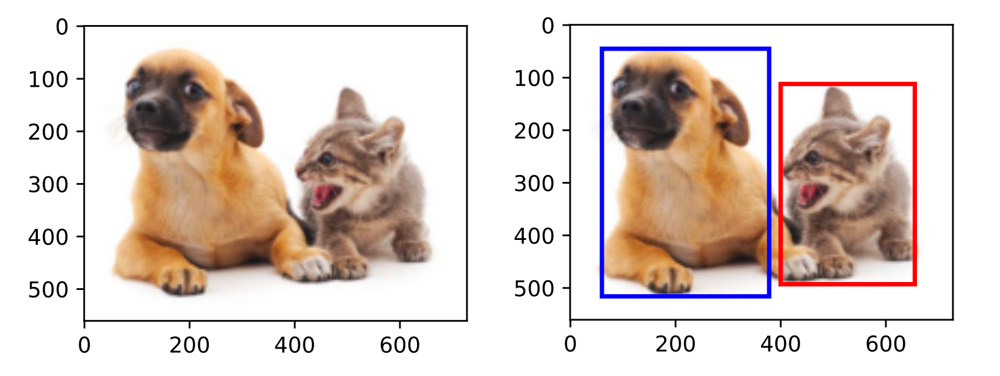
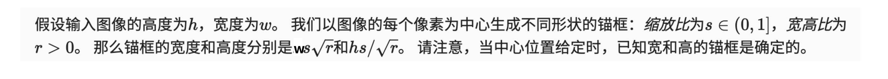
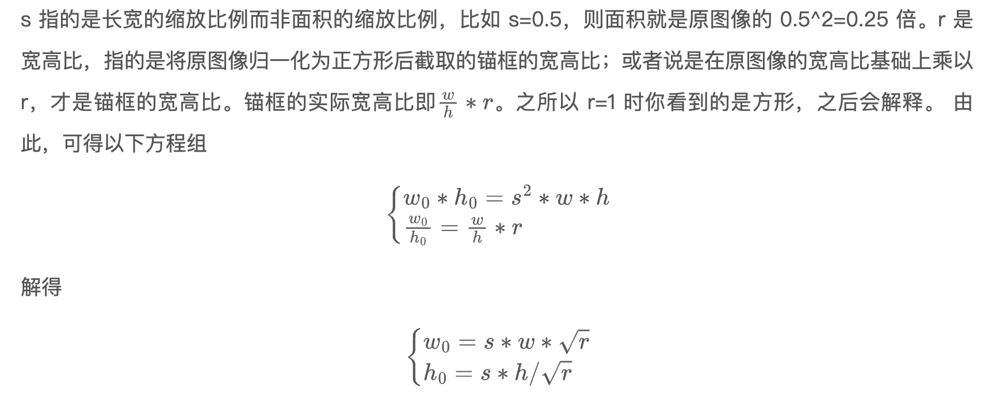

# [李沐](https://zh-v2.d2l.ai/chapter_computer-vision/bounding-box.html) 目标检测部分

## k1 边界框

### **是什么？**

文字：bounding box

图示：



### **怎么实现？**

1. 两角表示法：由矩形左上角的以及右下角的x和y坐标决定
1. 中心宽度表示法：边界框中心的(x,y)轴坐标以及框的宽度和高度

pytorch中常用的格式：

boxes：

- x1, y1, x2, y2 （shape=n×4）
- cx, cy, w, h（shape=n×4）

n表示框的数量，不止一个框

### 代码实现

含测试代码

```python
import numpy as np

#@save
def box_corner_to_center(boxes):
    """从（左上，右下）转换到（中间，宽度，高度）"""
    x1, y1, x2, y2 = boxes[:, 0], boxes[:, 1], boxes[:, 2], boxes[:, 3]
    cx = (x1 + x2) / 2
    cy = (y1 + y2) / 2
    w = x2 - x1
    h = y2 - y1
    boxes = np.stack((cx, cy, w, h), axis=-1)
    return boxes

#@save
def box_center_to_corner(boxes):
    """从（中间，宽度，高度）转换到（左上，右下）"""
    cx, cy, w, h = boxes[:, 0], boxes[:, 1], boxes[:, 2], boxes[:, 3]
    x1 = cx - 0.5 * w
    y1 = cy - 0.5 * h
    x2 = cx + 0.5 * w
    y2 = cy + 0.5 * h
    boxes = np.stack((x1, y1, x2, y2), axis=-1)
    return boxes

# bbox是边界框的英文缩写
dog_bbox, cat_bbox = [60.0, 45.0, 378.0, 516.0], [400.0, 112.0, 655.0, 493.0]

boxes = np.array((dog_bbox, cat_bbox))
box_center_to_corner(box_corner_to_center(boxes)) == boxes
```

OUT：

```python
array([[ True,  True,  True,  True],      
       [ True,  True,  True,  True]])
```

这里想强调的一点：

我们用的电脑屏幕和pytorch中，默认的原点在左上角

图像中坐标的原点是图像的左上角，向右的方向为x轴的正方向，向下的方向为y轴的正方向。


## K2 锚框

### 锚框是什么？

- anchor box
- 以每个像素为中心，生成多个缩放比和宽高比（aspect ratio）不同的边界框
- 应用：基于锚框的目标检测模型
- 是一种 **区域采样方法**

图示：


### 生成多个锚框

**这里要解决的问题：给定输入图像高度h、宽度w，缩放比s，宽高比r，问题锚框的宽度和高度？**

> 缩放比$s$：对输入图像进行缩放，输入图像的宽度和高度分别缩放s倍，得到锚框的宽度和高度
>
> 宽高比$r$
>
> ~~① 指的是锚框的宽和高之比~~
>
> ② $r$是对于输入图像宽高比的放缩，例如输入图像的宽高比是$w/h$，添加r后变成了$(w/h)*r$，得到锚框的宽高比$(w/h)*r$
>
> > 其实我觉得这个r可以理解为输入图像宽高比的缩放比率，只不是这个比率 $r>0$即可，因为可以在原始图像宽高比的基础上放大宽高比 或者 减少宽高比
>
> 总结：
>
> s：scale
>
> r：aspect ratio
>
> 从原始图像到确定锚框，需要知道锚框的......

----

**书上：** 



要搞清楚的点：

- [x] 缩放比s的意义
- [x] 宽高比r的意义
- [x] 锚框的宽度和高度怎么来？
- [ ] 什么叫做原始图像归一化为正方形？


首先[解释(from 讨论区)](https://fkjkkll.github.io/2021/11/23/%E7%9B%AE%E6%A0%87%E6%A3%80%E6%B5%8BSSD/)这里锚框的宽度和高度：



----

<span id='001'>**书上：** </span>


问题：要生成多个锚框

解决：设置多个$s$和$r$即可，然后考虑每个可能的s与r的组合，==但是实践中往往只考虑s1和r1的所有组合==

### 代码实现

- [x] in_height, in_width = data.shape[-2:]

data format：b c h w

- [x] device, num_sizes, num_ratios = data.device, len(sizes), len(ratios)

num_sizes表示scale、num_ratios表示aspect ratio

- [x] [boxes_per_pixel = (num_sizes + num_ratios - 1)](#001)

- [x] center_h = (torch.arange(in_height, device=device) + offset_h) * steps_h 乘 steps_h？

- 因为原点在左上角，所以是锚框中心点分别加offset_h、offset_w
- 对每个像素点生成锚框，每个像素点都有生成 num_sizes+num_ratios-1的锚框
- 所以对于单个像素点来说，参考点变了，全部变成了单位坐标下的度量，所以乘以 steps_h 和 steps_w
- steps_h = 1/原始高度 &  steps_w = 1/原始宽度

- [ ] torch.meshgrid？

> shift_y, shift_x = torch.meshgrid(center_h, center_w, indexing='ij')
>
> shift_y, shift_x = shift_y.reshape(-1), shift_x.reshape(-1)


含测试代码

```python
def multibox_prior(data, sizes, ratios):
    """生成以每个像素为中心具有不同形状的锚框"""
    in_height, in_width = data.shape[-2:]
    device, num_sizes, num_ratios = data.device, len(sizes), len(ratios)
    boxes_per_pixel = (num_sizes + num_ratios - 1)
    size_tensor = torch.tensor(sizes, device=device)
    ratio_tensor = torch.tensor(ratios, device=device)

    # 为了将锚点移动到像素的中心，需要设置偏移量。
    # 因为一个像素的高为1且宽为1，我们选择偏移我们的中心0.5
    offset_h, offset_w = 0.5, 0.5
    steps_h = 1.0 / in_height  # 在y轴上缩放步长
    steps_w = 1.0 / in_width  # 在x轴上缩放步长

    # 生成锚框的所有中心点
    center_h = (torch.arange(in_height, device=device) + offset_h) * steps_h
    center_w = (torch.arange(in_width, device=device) + offset_w) * steps_w
    shift_y, shift_x = torch.meshgrid(center_h, center_w, indexing='ij')
    shift_y, shift_x = shift_y.reshape(-1), shift_x.reshape(-1)

    # 生成“boxes_per_pixel”个高和宽，
    # 之后用于创建锚框的四角坐标(xmin,xmax,ymin,ymax)
    w = torch.cat((size_tensor * torch.sqrt(ratio_tensor[0]),
                   sizes[0] * torch.sqrt(ratio_tensor[1:])))\
                   * in_height / in_width  # 处理矩形输入
    h = torch.cat((size_tensor / torch.sqrt(ratio_tensor[0]),
                   sizes[0] / torch.sqrt(ratio_tensor[1:])))
    # 除以2来获得半高和半宽
    anchor_manipulations = torch.stack((-w, -h, w, h)).T.repeat(
                                        in_height * in_width, 1) / 2

    # 每个中心点都将有“boxes_per_pixel”个锚框，
    # 所以生成含所有锚框中心的网格，重复了“boxes_per_pixel”次
    out_grid = torch.stack([shift_x, shift_y, shift_x, shift_y],
                dim=1).repeat_interleave(boxes_per_pixel, dim=0)
    output = out_grid + anchor_manipulations
    return output.unsqueeze(0)
```

