# GAN

[视频链接](https://www.bilibili.com/video/BV1VT4y1e796?spm_id_from=333.788.videopod.sections&vd_source=ddd7d236ab3e9b123c4086c415f4939e)


文生图模型


交互式的demo

text2image的模型 或者叫 caption2image：可以怎么构造这样一个模型呢？

前提：算力够、数据够，有大量的图像文本对

文本输入到bert中，提取文本特征，通过Transformer模型生成图像patch，然后把patch拼起来构成一张图片，假设采用 这样的模型，LOSS该怎么设计？

最常用的loss，比如L1 loss，L2 loss，归一化到0~1之间，将预测的图像像素点值跟真实的target像素点值作差，用差的绝对值 或者平方作为loss 

另外一种用法：把生成的照片用在另外的下游任务中，比如识别任务中，判断照片是生成的照片还是识别的照片，这种网络的思想就是 <u>GAN 生成对抗网络</u>  （topic）


DALLE的用的是 diffusion process，Diffusion process 主要用随机噪声生成目标分布，数学公式比较复杂，速度有待提升，生成图片的质量跟迭代次数有关，迭代步骤越大，生成质量越好。


GAN思想：生成的照片放到识别网络中，判断照片来自真实的还是生成的

论文导读 & 代码实现

2024年的论文

引用量目前4万多、残差网络引用量10万多、一半的关系，因为GAN网络主要在生成网络中使用，对于识别分类任务，GAN不太适用，而残差网络的应用范围更广泛

## 摘要

> We propose a new framework for estimating generative models via an adversarial process, in which we simultaneously train two models: 
>
> 提出了新的模型，通过对抗过程估计生成模型
>
> a generative model G that captures the data distribution, 
>
> 生成模型G捕捉数据分布
>
> and a discriminative model D that estimates the probability that a sample came from the training data rather than G. 
>
> 判别模型D估计样本来自来自训练数据还是生成器G
>
> The training procedure for G is to maximize the probability of D making a mistake.
>
> This framework corresponds to a minimax two-player game.
>
> 该框架对应极大极小两人博弈
>
> In the space of arbitrary functions G and D, a unique solution exists, with G recovering the training data distribution and D equal to $\frac{1}{2}$ everywhere.
>
> 在任意函数G和D的空间中，存在唯一解，G恢复训练数据分布，D处处等于 $\frac{1}{2}$
>
> D此时无法区分数据是来自真实的数据还是真实的数据
>
> In the case where G and D are defined by multilayer perceptrons, the entire system can be trained with backpropagation.
>
> G和D都是由全连接层构成的
>
> There is no need for any Markov chains or unrolled approximate inference networks during either training or generation of samples.
>
> Experiments demonstrate the potential of the framework through qualitative and quantitative evaluation of the generated samples.

## Intro

一个比喻：（原文第二段）


对抗网络是一个框架，具体地方法是可以自己填充的

## 模型方法 Adversarial nets


**符号说明：**

生成器的分布： $p_g$  生成器学习 $x$ 的分布

原始数据：$x$

输入噪声变量：$p_z(z)$

数据空间的映射：$G(z;\theta_g)$

> 模型开始的先验分布是 $p_z(z)$,通过 $G(z;\theta_g)$，学习到  $p_g$， $p_g$ 表示了 $x$ 的分布
>
> $G(z;\theta_g)$ 变量是 $z$，参数是 $\theta_g$ 
>
> 输入噪声变量 $z$，$z$来自$p_z$

G 是由 参数为 $\theta_g$ 的多层感知机表示的可微函数

多层感知器 $D(x;\theta_d)$  输出一个标量；表示一个概率，判断数据来自生成器还是判别器

> D 的输入是 $x$，参数是 $\theta_d$，输出是一个标量，反映数据...

训练 D 最大化 给训练样本和来自 $G$ 的样本分配正确标签的概率

> D的目的是能够正确分类 训练样本 和 G的样本概率

训练 G 最小化 $log(1-D(G(z)))$

> $log$单调递增，括号里面 $1-D(G(z))$ 最小，所以 $D(G(z))$  最大
>
> $D(G(z))$ 最大表示 生成器所生成的样本 输入到判别器的时候，判别器将它判别成 $1$
>
> 也就是说 生成器生成的样本，判别器将它判别成来自真实样本，等于1，这时候生成器的目标就已经达成了，从G生成的数据，判别器认为是真实的数据

 

价值函数 $V(G,D)$

解释价值函数:

$\min_G \max_G V(D,G)$  

> min是对G而言，$max$对$D$而言
>
> ① 对$D$而言 我们让$V$达到最大，要让$V$达到最大，也就是  $logD(x)$ 达到最大，同时$log 1-D(G(z))$  达到最大，因此对于判别器而言，我们希望判别器 能够把来自于训练集的样本 把它分类成真实的，来自生成器的样本 分类成假的，这个对于判别器的训练目标
>
> ② 生成器的训练目标，minG，也就是说 对于生成器而言，后面两个达到最小，由于第一项$logD(x)$与g无关，所以第一项不用看，在训练集中 第一项 相当于一个常数 不重要。主要看第二项，第二项达到最小的话，也就是说 希望$DG(z)$达到最大，也就是说 训练G的目标 就是希望 $D(G(z))$ 达到最大，也就是说 从生成器生成出来的样本 送入到判别器中 我们希望判别器这时候 给出的分类结果 分类成 真实的样本；当达到这样的结果时，说明G训练的结果是很好的

$\mathbb{E}_{{x \sim p_{data}(x)}}$  x服从p data(x)，也就是训练集，x也就是训练集中的样本

$\mathbb{E}_{{x \sim p_{data}(x)}}[logD(x)]$ 训练集中的样本送入到判别器中，也就是概率取一个$log$，也就是对数似然

$\mathbb{E}_{{z \sim p_{z}(z)}}$ 第二部分$z$服从 $p_z(z)$，$z$就是初始的随机的噪声，$z$送入到生成器之中 得到$G(z)$

$\mathbb{E}_{{x \sim p_{z}(z)}}[log(1-D(G(z)))]$     $G(z)$就是生成器的输出，$G(z)$输入到$D$之中得到一个概率，然后把1-概率，$1-DG$，就是表示 判别器把 $G(z)$ 分类成 假样本的概率


（1）生成对抗网络基于mini batch的随机梯度下降的算法；超参数k；

（2）k？一般文章而言，可以先训练k步的判别器，然后再训练一步生成器，这里取k=1，表示每训练一步判别器，就训练一步生成器，然后再训练一步判别器，再训练一步生成器，交替进行，k是一个超参数，一般来说k=1；也有一些任务，先训练生成器，训练一段时间，再开始交替训练生成器和判别器

（3）看算法的迭代流程，两个for训练；第一个for循环，循环epoch，第二个for循环，循环dataset 或者 dataloader 进行遍历


（4）首先第一步，第一个for循环，先训练k步的判别器， k可以取1，在训练判别器时，首先从噪声分布中，随机采样m个样本，构成一个minibatch，m个样本分别构成z1到zm，从先验分布 $p_g(z)$ 采样而来，$p_g(z)$可以是一个正态分布；这就是第一步先采样输入

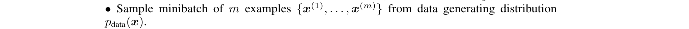

（5）第二步，采样真实的数据分布，采样m个样本，从训练集中采样m个样本

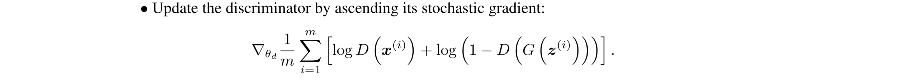

（6）基于梯度上升 ascending 公式，更新判别器 ；目标函数是 $logD+log(1-DG)$

对于判别器而言，判别的标量有两个，第一个以x作为输入，从训练集中拿出的样本，送到判别器中，得到一个概率值，这时的概率值叫做 $D(x)$，第二个从生成器中，拿到输出，叫做$G(z)$，$G(z)$送入到$D$中，得到另外一个判别的概率，$1-判别概率$，进行一个 $log$ 运算，得到第二项，外面的求和是对整个minibatch，每个样本都这样做，再除以$m$，在样本维度取一个平均值，以这个作为 $target$，此时的 $\nabla$  是作用到 $\theta_D$ 的

也就是说 对于这个目标函数 只会对 判别器的参数 求梯度，求完梯度以后，再用梯度上升算法，来更新判别器的参数，以上是第一步更新判别器

如果 $k>1$，需要不断的循环，连续的更新判别器，更新k步，更新完判别器以后，更新生成器部分：


（1）生成器部分，第一步，同样取m个噪声样本，构成一个minibatch，同样的从一个先验分布中取，强调一点：


（2）第二步，采用梯度下降算法(descending)，更新生成器，此时的目标函数，也就是最小化函数是 $log(1-DG)$ ，只需要把生成器生成的 $G$，送入到判别器之中，得到$D$，$DG$就是判别器预测的概率，$1-概率$取log，得到 $log(1-DG)$，然后对每个样本的损失求和，再除以m，取平均，这是梯度只对生成器的参数计算，在基于梯度下降算法更新 生成器的参数，这时不需要更新判别器的参数

上面的式子，只更新判别器的参数，不需要更新生成器的参数

下面的式子，只更新生成器的参数，不需要更新判别器的参数

以上是GNA的一个step，不断的重复，交替更新，直到$D(x)$和$D(G)$都是0.5，此时判别器已经无法再区分 数据是来自真实数据 还是生成器生成的假样本

> 原文4.1证明，这样的损失函数是否能让 G和D 同时找到最优的值 或者 最优的结构？

## 4.1 证明


考虑任意给定的生成器G，最优的判别器D是怎么样的

定理1，G固定，最优的判别器D：

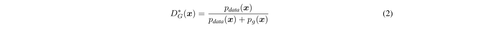

*号  表示最优

D_G，表示 G 是固定的，D是变化的

x服从真实data的概率、x服从生成器g的概率


证明，对于任意生成G，判别器D的训练标准，就是要最大化价值函数V，价值函数之前用期望值表示的，期望可以写成积分的形式，第一个积分 $p_{data}(x)D(x)$，对$x$进行积分，第二个积分$p_zlog(1-Dg)$，对$z$进行积分，


将第二个积分，换一下积分符号  z → x，然后合并

（有个问题，为什么 $\int_z p_z(z) (1-D(g(z)))dz$    → $\int_x p_x(x) (1-D(g(x)))dx $   这里 $p_x(x)$变成 $p_g(x)$）

当写成这样以后：


对于这样一个函数，对于任意a，b，属于实数，并且 a,b 不等于0，此时关于 y 的函数，$alogy+blog(1-y)$ 这里 $a=p_{data}(x)$ 、 $b=p_g(x)$  在  $\frac{a}{a+b}$ 达到最大值，也就是 $\frac{p_{data}(x)}{p_{data}(x)+p_g(x)}$ 达到最大值

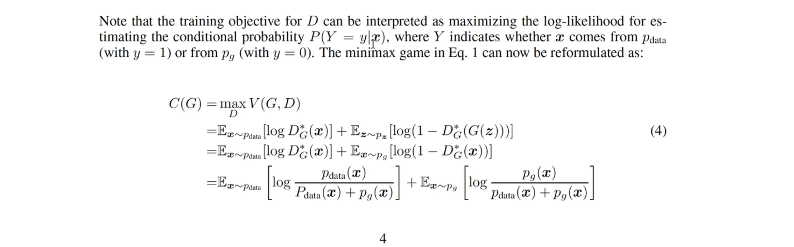

注意 训练 D的目标 可以解释成 在最大化 P(Y=y|x)的对数似然

- $x$就是给定一个输入，输入到判别器中的样本
- $P(Y=y)$   $Y$表示一个概率，表示$x$ 来自生成器的概率，还是$data$（真实数据）的概率

公式1 可以重新写成 $C(G)$，

$C(G) = \max_{D}V(G,D)$

就是把价值函数 重新写成 生成器的函数，也就是 $V(G,D)$在找到 最优的 D 取最大值


重点解释第二行，把 $G(z)$换成$x$，$z \sim p_z$ ，也就是 $x \sim p_g$

也就是 $p_z$ 可以用 $x$ 的分布表示

然后我们把找到的 $D^*_G(x)$ 代入，得到第三行的价值函数

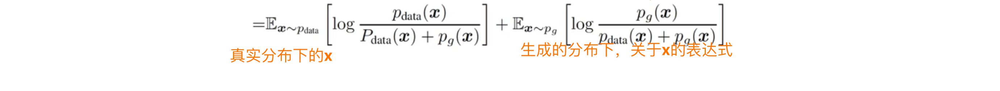

- [x] 上面我看明白了

继续看，后面还有证明


开始：

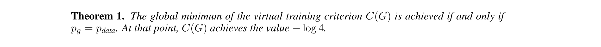

训练标准$C$ 的全局最小值，仅仅在 $p_g = p_{data}$ 时，达到，并且最小值 是 $-log4$

公式4 已经得到 $C(G)$ 的表达式


接下来 我们就研究 C(G)的最小值，在什么情况下取到，并且最小值是什么。看证明：


（1）假设 $p_g=p_{data}$时，也就是生成分布和真实分布一模一样时，此时最优的 D刚好等于 $\frac{1}{2}$

看原文的公式(2)


（2）因此，我们把公式(4)最后得到的式子，全部换成 $\frac{1}{2}$

此时：

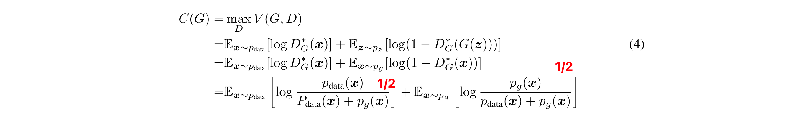


也就是说，当我们假设 $p_g = p_{data}$ 时，得到 $C(G)=-log4$，

得到这些东西以后，后面怎么做呢？

我们把公式(4)，减去一个 $-log4$： (ps：最后又把 $-log4$ 加回来了)

$\mathbb{E}_{\boldsymbol{x}\sim p_\mathrm{data}}\left[\log\frac{p_\mathrm{data}(\boldsymbol{x})}{P_\mathrm{data}(\boldsymbol{x})+p_g(\boldsymbol{x})}\right]+\mathbb{E}_{\boldsymbol{x}\sim p_g}\left[\log\frac{p_g(\boldsymbol{x})}{p_\mathrm{data}(\boldsymbol{x})+p_g(\boldsymbol{x})}\right] -（-log4）$


得到：

$\mathbb{E}_{\boldsymbol{x}\sim p_\mathrm{data}}\left[\log\frac{p_\mathrm{data}(\boldsymbol{x})}{P_\mathrm{data}(\boldsymbol{x})+p_g(\boldsymbol{x})}\right]+\mathbb{E}_{\boldsymbol{x}\sim p_g}\left[\log\frac{p_g(\boldsymbol{x})}{p_\mathrm{data}(\boldsymbol{x})+p_g(\boldsymbol{x})}\right] + log4$


= $\mathbb{E}_{\boldsymbol{x}\sim p_\mathrm{data}}\left[\log\frac{p_\mathrm{data}(\boldsymbol{x})}{P_\mathrm{data}(\boldsymbol{x})+p_g(\boldsymbol{x})}\right]+\mathbb{E}_{\boldsymbol{x}\sim p_g}\left[\log\frac{p_g(\boldsymbol{x})}{p_\mathrm{data}(\boldsymbol{x})+p_g(\boldsymbol{x})}\right] + log2 + log2$

=  $\mathbb{E}_{\boldsymbol{x}\sim p_\mathrm{data}}\left[\log\frac{2 p_\mathrm{data}(\boldsymbol{x})}{P_\mathrm{data}(\boldsymbol{x})+p_g(\boldsymbol{x})}\right]+\mathbb{E}_{\boldsymbol{x}\sim p_g}\left[\log\frac{2 p_g(\boldsymbol{x})}{p_\mathrm{data}(\boldsymbol{x})+p_g(\boldsymbol{x})}\right]$

= $\mathbb{E}_{\boldsymbol{x}\sim p_\mathrm{data}}\left[\log\frac{ p_\mathrm{data}(\boldsymbol{x})}{\frac{P_\mathrm{data}(\boldsymbol{x})+p_g(\boldsymbol{x})}{2}}\right]+\mathbb{E}_{\boldsymbol{x}\sim p_g}\left[\log\frac{p_g(\boldsymbol{x})}{\frac{p_\mathrm{data}(\boldsymbol{x})+p_g(\boldsymbol{x})}{2}}\right]$

借助 KL散度 公式：


分布P和分布Q的KL散度公式 就是 $log(\frac{P(x)}{Q(x)})$ 关于P(x) 的期望

= $KL(p_{data}(x) || \frac{p_{data}(x)+p_g(x)}{2})$ +  $KL(p_{g}(x) || \frac{p_{data}(x)+p_g(x)}{2})$

关于公式（5）的得到，是为了C(G)，我们最开始$-(-log4)，$为了保证公式总体不变，所以最后在 $+(-log4)$ ：

得到完整的  公式(5)


- [x] 以上 公式(5)的证明，看懂了

解读公式5，首先 $KL散步大于0$，恒成立，所以我们看出化简出来的式子，最小值是 $-log4$

最小值何时取到，就是$KL散度=0$ 也就是

① $p_{data}(x) = \frac{p_{data}(x)+p_g(x)}{2}$

②  $p_{g}(x) = \frac{p_{data}(x)+p_g(x)}{2}$

同时成立，不就是 $p_{data}=p_{g}$

我们 用詹森-香农散度，继续化简，得到公式6

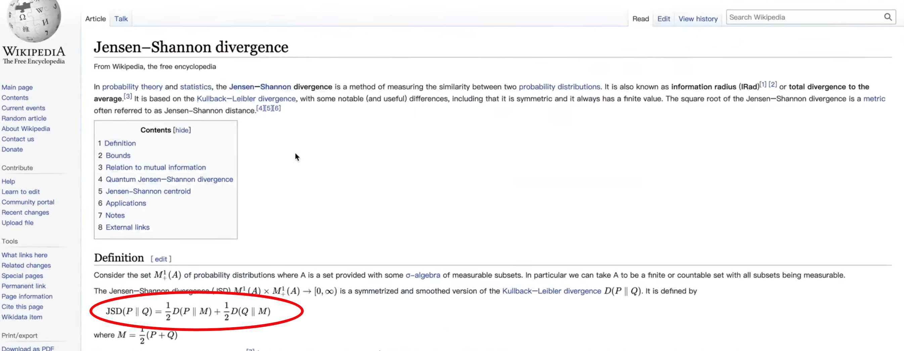

JSD(P||Q)=$二分之一的分布M和分布P的KL散度+$$二分之一的分布M与分布Q的KL散度$

其中$M=二分之一的分布P加分布Q$

基于 詹森香农散度的公式，把公式(5)化简成 公式(6)

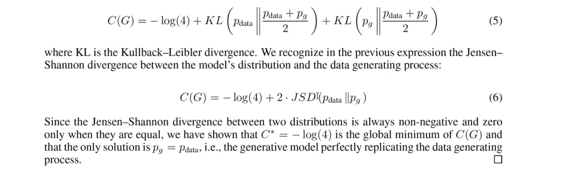

同理，$JSD$也是一个 大于等于0 的一个值，并且仅在 $p_{data}=p_g$时取0

- [x] 以上 公式(6)的证明，懂了

以上说明，$p_{data}=p_g$，也就是生成器生成的分布，刚好等于 真实数据的分布时，我们 C(G) 会取最小值 $-log4$，也就是 $G$的优化达到了最优

本文实验手写数字识别，通过GAN网络，手写照片的分布，随机生成高斯变量送入到生成器中，生成器生成一张手写数字的照片，是一种无监督的学习方法


## 代码实现

全部代码：

```python

```

首先代码的大框架，首先生成生成器的类，然后生成判别器的类，然后进行训练：

```python
'''基于MINIST实现对抗生成网络（GAN）'''

import torch
import torch.nn as nn

class Generator(nn.Module):
    pass
class Decrimination(nn.Module):
    pass
# training
```

我们举例子，以生成手写数字照片为例：

首先 怎么导入 minist数据集，谷歌搜索： torch vision mnist 第二个，MNIST


看到官方api：


首先需要的参数：

- root：数据存储路径
- train：是否train模式
- dowload：是否下载
- transform：PIL image格式的转换成 浮点型的

通过这样的class 得到MINST数据集

首先，查看minist数据集长什么样：

```python
import torchvision
dataset = torchvision.datasets.MNIST("minist_data",train=True,download=True)
print(len(dataset)) # 60000
```

> 把下载的minist数据集存到 `minist_data` 文件夹下，采用训练模式，本地没有所以设置为True

一共有6000个样本

看一下每个样本长什么样（打印前5个）：

```python
import torchvision
dataset = torchvision.datasets.MNIST("minist_data",train=True,download=True)
for i in range(5):
    print(dataset[i])
# (<PIL.Image.Image image mode=L size=28x28 at 0x1030AD100>, 5)
# (<PIL.Image.Image image mode=L size=28x28 at 0x1030AD100>, 0)
# (<PIL.Image.Image image mode=L size=28x28 at 0x1030AD100>, 4)
# (<PIL.Image.Image image mode=L size=28x28 at 0x1030AD100>, 1)
# (<PIL.Image.Image image mode=L size=28x28 at 0x1030AD100>, 9)
```

前5个每一个都是image的对象，大小是28×28的，前面是 $x$ 后面是 标签，数据格式是 PIL image

如果我们打印shape的话，会报错

```python
import torchvision
dataset = torchvision.datasets.MNIST("minist_data",train=True,download=True)
for i in range(5):
    print(dataset[i][0].shape)
# AttributeError: 'Image' object has no attribute 'shape'
```

这时，需要调用transform  


可以看到例子：

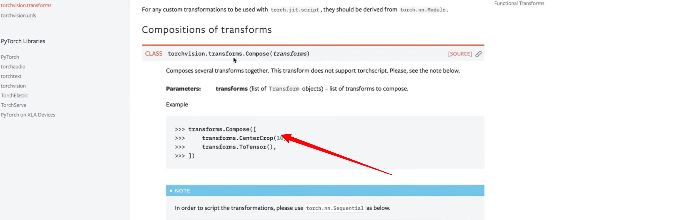

使用transforms.Compose()传入

我们只需要调整一下大小，传入28


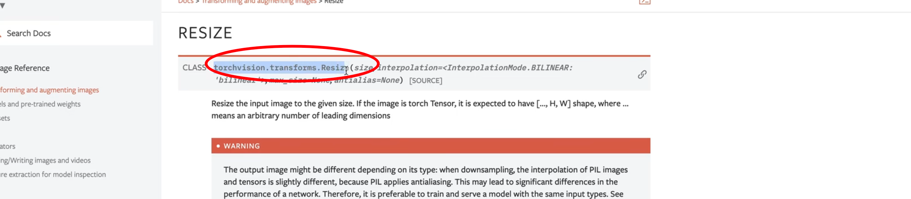

接着，把PIL image格式转化成 浮点数 格式


ToTensor API


将PIL image格式 或者 numpy 数组 转换成tensor格式，并且可以转化到 0~1之间的浮点数

再次打印 shape：

```python
import torchvision
dataset = torchvision.datasets.MNIST("minist_data",
                                     train=True,
                                     download=True,
                                     transform=torchvision.transforms.Compose(
                                         [torchvision.transforms.Resize(28),
                                         torchvision.transforms.ToTensor()]
                                     ))
for i in range(5):
    print(dataset[i][0].shape)
# torch.Size([1, 28, 28])
# torch.Size([1, 28, 28])
# torch.Size([1, 28, 28])
# torch.Size([1, 28, 28])
# torch.Size([1, 28, 28])
```

每个样本 都是 1×28×28；1表示通道数，minist通道数=1；以上看到了样本长什么样，可以帮助Generator生成照片

接下来，继续看Generator函数，先写init，再写forward，init定义模块，forward将init的模块串联起来，生成照片

```python
class Generator(nn.Module):
    def __init__(self):
        pass
    def forward(self):
        pass
```

实例化父类，继承自nn.Module，继承父类的构造方法

```python
super(Generator,self).__init__()
```

forward接收z，高斯随机变量，z的shape=batchsize×1×28×28,1是channel、H、W=28、28

```python
    def forward(self,z):
        # shape of z:batchsize,1,28,28
```

init函数，使用nn.Sequential()，定义网络层，定义第一个线性层nn.Linear(in_dim,64)，64是随便定义的，in_dim是给的，线性层后面接着激活层nn.ReLU()，查看官网api，默认inplace=False，我们改成True，然后重复几遍，线性层、激活层...


```python
image_size = [1,28,28]

class Generator(nn.Module):
    def __init__(self,in_dim):
        super(Generator,self).__init__()
        self.model = nn.Sequential(
            nn.Linear(in_dim,64),
            nn.ReLU(inplace=True),
            nn.Linear(64,128),
            nn.ReLU(inplace=True),
            nn.Linear(128,256),
            nn.ReLU(inplace=True),   
            nn.Linear(256,512),
            nn.ReLU(inplace=True),   
            nn.Linear(512,1024),
            nn.ReLU(inplace=True), 
            nn.Linear(1024,torch.prod(image_size,dtype=torch.int32)),
            nn.Tanh(),                                                        
        )
```

先不断的升维升维升维，最后降维 1024→ torch.prod(image_size)，最后使用激活函数Tanh，将元素变成-1到1

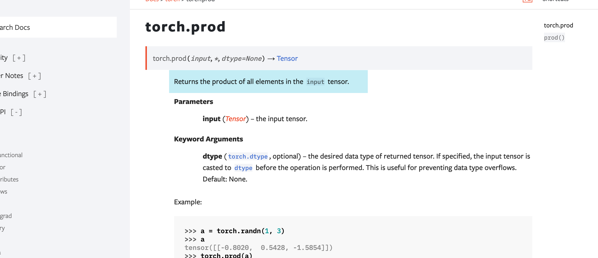

torch.prod 返回输入张量 元素的连乘积

然后看forward函数，将z传入到init定义的self.model()

```python
    def forward(self,z):
        # shape of z:batchsize,1*28*28
        output = self.model(z)
```

将输出的output转换为图片格式，调用reshape，第一个维度仍然用，z.shpe[0]，后面的维度就用image_size，image_size加星号，就能把列表传进去

```python
   def forward(self,z):
        # shape of z:batchsize,1*28*28
        output = self.model(z)
        image = output.reshape(z.shape[0],*image_size)
        pass
```

将image返回，以上实现了一个简单的生成器。

```python
class Generator(nn.Module):
    def __init__(self,in_dim):
        super(Generator,self).__init__()
        self.model = nn.Sequential(
            nn.Linear(in_dim,64),
            nn.ReLU(inplace=True),
            nn.Linear(64,128),
            nn.ReLU(inplace=True),
            nn.Linear(128,256),
            nn.ReLU(inplace=True),   
            nn.Linear(256,512),
            nn.ReLU(inplace=True),   
            nn.Linear(512,1024),
            nn.ReLU(inplace=True), 
            nn.Linear(1024,torch.prod(image_size,dtype=torch.int32)),
            nn.Tanh(),                                                        
        )

    def forward(self,z):
        # shape of z:batchsize,1*28*28
        output = self.model(z)
        image = output.reshape(z.shape[0],*image_size)
        return image
```

接下来实现判别器

判别器接收的是一张图片作为输入，生成器接收的是随机噪声作为输入

```python
class Decrimination(nn.Module):
    def __init__(self):
        super(Decrimination,self).__init__()
        self.model = nn.Sequential(
            nn.Linear(in_dim,1024),
            nn.ReLU(inplace=True),
            nn.Linear(1024,512),
            nn.ReLU(inplace=True),
            nn.Linear(512,256),
            nn.ReLU(inplace=True),   
            nn.Linear(256,128),
            nn.ReLU(inplace=True),   
            nn.Linear(128,1),
            nn.Sigmoid(),            
        )
        pass
    def forward(self):
        pass
```

判别器的init同样写一个model，判别器的nn.Linear的维度可以反过来写，上面是一步步的增大维度，对于判别器而言，一开始可以是大维度，然后慢慢的降维度，最后输出预测的标量，最后将128映射到1，最后输出概率，就不是Tanh，而是Sigmoid

判别器接收一张照片作为输入，输出是Sigmoid函数 输出的概率值

forward函数 接收的image格式 batchsize×1×28×28，对image进行reshape，reshape的第一维是image.shape[0]，CHW统一放到最后一维

```python
prob = self.model(image.reshape(image.shape[0],-1))
```

以上得到了概率prob，最后返回即可，以上实现了判别器（in_dim 那里有错误）

```python
class Decrimination(nn.Module):
    def __init__(self):
        super(Decrimination,self).__init__()
        self.model = nn.Sequential(
            nn.Linear(in_dim,1024),
            nn.ReLU(inplace=True),
            nn.Linear(1024,512),
            nn.ReLU(inplace=True),
            nn.Linear(512,256),
            nn.ReLU(inplace=True),   
            nn.Linear(256,128),
            nn.ReLU(inplace=True),   
            nn.Linear(128,1),
            nn.Sigmoid(),            
        )    
    def forward(self,image):
        # shape of image:[batchsize,1,28,28]
        prob = self.model(image.reshape(image.shape[0],-1))
        return prob
```

判别器以图片作为输入，输出概率

接下来进行训练部分，第一部分，构造数据集，dataset已经写好了，接下来送入到dataloader中，忘记用法就查api


看接收的输入


- dataset
- batch_size
- shuffle

dataloader的作用就是把dataset的数据变成一个个batch，后面进行批训练

```python
from torch.utils.data import DataLoader
dataloader = DataLoader(dataset,batch_size=32,shuffle=True)
```

接下来开始优化器，需要两个优化器，对生成器的参数进行优化和对判别器的参数进行优化


生成器的优化器Adam，查看Adam需要的参数：

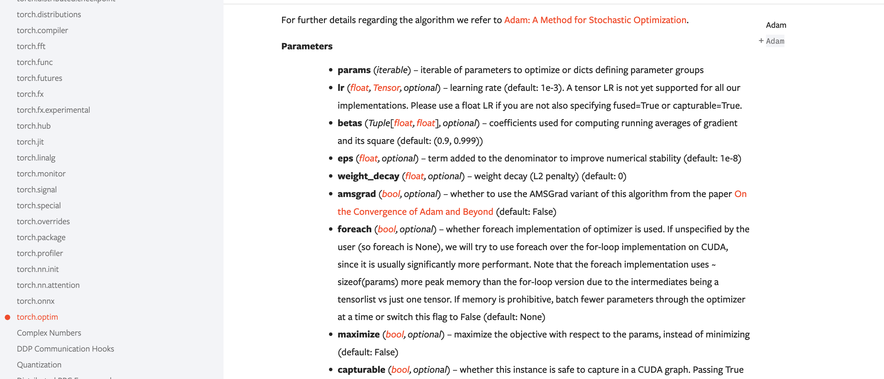

- params：第一个是可迭代的训练参数，就是把模型的parameters调用一下就可以了，得到可迭代的训练参数

```python
g_optimizer = torch.optim.Adam(params,lr=0.0001)
```

因此 我们需要实例化Generator,传入params

第一个线性层修改一下，少传个参数：

```python
class Generator(nn.Module):
    def __init__(self):
        super(Generator,self).__init__()
        self.model = nn.Sequential(
            nn.Linear(torch.prod(image_size,dtype=torch.int32),64),
```

接下来实例化一个Generator

```python
generator = Generator()
```

然后，Adam优化器的参数，就是generator.parameters()，只对生成器的参数进行优化

```python
g_optimizer = torch.optim.Adam(generator.parameters(),lr=0.0001)
```

同样实例化 判别器，同时优化判别器的参数

```python
generator = Generator()
discriminator = Decriminator()

g_optimizer = torch.optim.Adam(generator.parameters(),lr=0.0001)
d_optimizer = torch.optim.Adam(discriminator.parameters(),lr=0.0001)
```

生成器参数 和 判别器参数 完全隔离，优化也分别优化

接下来 定义loss_fn，逻辑回归，判断照片来自真实的 还是 假的，loss function 是BCELOSS 二次的交叉熵


BCE接收的参数：

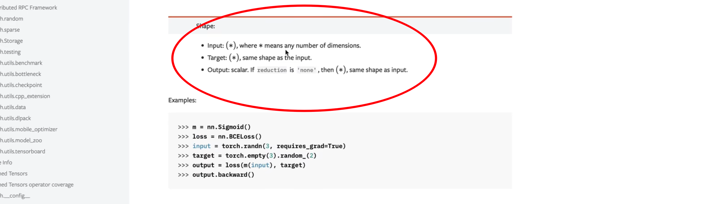

- input可以是任意的维度
- output也是任意的维度，output默认情况是一个标量，如果把reduction设置为"none"的话，形状就会和输入一样
- target也是任意的维度
- 下面给出例子

> 实例化一个loss function
>
> input是一个长度为3的向量
>
> target也是一个长度为3的向量
>
> 然后跟一个loss计算 得到一个标量
>
> 调用是很简单的，就调用一个nn.BCELoss()即可

- BCELoss的公式

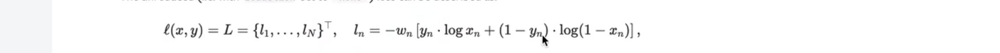

> 值得注意的是，这里 $x_n=1$  或者 $x_n=0$  $log$ 不会崩溃，因为pytorch内部保证了数值稳定性
>
> 
>
> 最后一段，对loss function进行了截断，截断到-100为止，避免了负无穷大 崩溃的问题

```python
loss_fn = nn.BCELoss()
```

以上完成了所有定义的部分：

```python
# Training

dataset = torchvision.datasets.MNIST("minist_data",
                                     train=True,
                                     download=True,
                                     transform=torchvision.transforms.Compose(
                                         [torchvision.transforms.Resize(28),
                                         torchvision.transforms.ToTensor()]
                                     ))

dataloader = DataLoader(dataset,batch_size=32,shuffle=True)

generator = Generator()
discriminator = Decriminator()

g_optimizer = torch.optim.Adam(generator.parameters(),lr=0.0001)
d_optimizer = torch.optim.Adam(discriminator.parameters(),lr=0.0001)

loss_fn = nn.BCELoss()
```

接下来 开始训练 就是论文中所描述的 两个 for循环

第一个for循环 对 epoch进行循环，表示训练多少个周期

```python
num_epoch = 100
for epoch in range(num_epoch):
```

第二个for循环 对dataloader进行一个枚举的遍历，采用enmerate(dataloader)，返回两个，第一个是index，第二个位置上是sample 或者说 mini_batch，mini_batch 不仅包含 $x$ 还包含 $y$，因此 我们要对mini_batch 进行解析一下

```python
    for i,mini_batch in enumerate(dataloader):
        gt_image,_ = mini_batch
```

labels不要了 ，因为这里进行的是无监督的生成任务，这里的image就是真实的图片，所以命名gt_image，ground truth，表示真实的照片

接下来，首先随机生成一个z，z服从正态分布，形状是 $batch\_size×latent\_dim$，

```python
batch_size = 32
latent_dim = 64
for epoch in range(num_epoch):
    for i,mini_batch in enumerate(dataloader):
        gt_image,_ = mini_batch
        z = torch.randn(batch_size,latent_dim)
```

> 关于latent_dim？
>
> z的维度是batch size×latent dim
>
> z的维度在最开始的定义中，写成的是：
>
> 
>
> 就是假设 跟 图片一样的维度，但是，也可以假设是 latent_dim，一般在生成模型中，都是latent dim包括在VAE中，都是latent dim
>
> 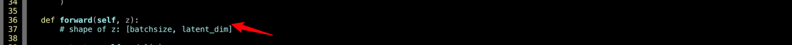
>
> z是 生成器的输入
>
> 就是说z的维度，可以是任意的
>
> 因此 我们需要 定义一个latent_dim 
>
> 将latent_dim 设置为64，此时z的大小是 batch size×latent dim

然后把 $z$ 喂入到generator之中，得到prod_image，预测出来的照片

```python
prod_images = generator(z)
```

得到预测的照片，维度是4维的

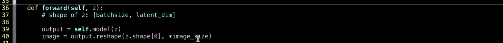

batch size×通道×高度×宽度，跟Discriminator的输入是一样的

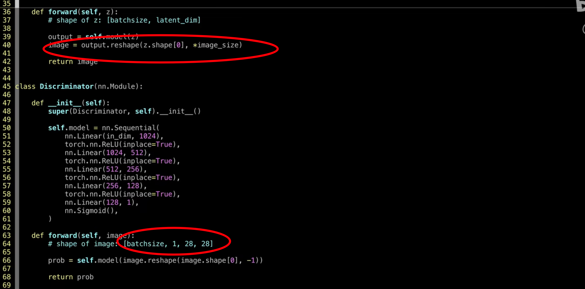

所以 可以把得到的预测照片 送入到 discriminator之中，得到判别的概率


就是原文中的D(G(z))

```python
pred_images = generator(z)
```

接下来 把 生成器 生成的照片 送入到 判别器之中，得到一个概率，然后把目标也送入进去，送入到BCELoss function之中，就可以得到g_loss 

```python
g_loss = loss_fn( discriminator(pred_images) , target )
```

接下来，反向传播，更新参数

```python
        g_loss.backward()
        g_optimizer.step()
```

最开始的时候，需要把 梯度置 0

```python
        g_optimizer.zero_grad()
        g_loss = loss_fn(discriminator(pred_images),target)
        g_loss.backward()
        g_optimizer.step()
```

但是 target还没有定义，写成1还是 写成0？目标是对生成器进行优化，所以希望 判别器把 生成器生成的图片 优化成真实图片，所以写成预测为1，即定义target = 1，形状就是 batch_size×1
