# [BERT从零详细解读](https://www.bilibili.com/video/BV1Ey4y1874y?spm_id_from=333.788.videopod.episodes&vd_source=ddd7d236ab3e9b123c4086c415f4939e)

目录：

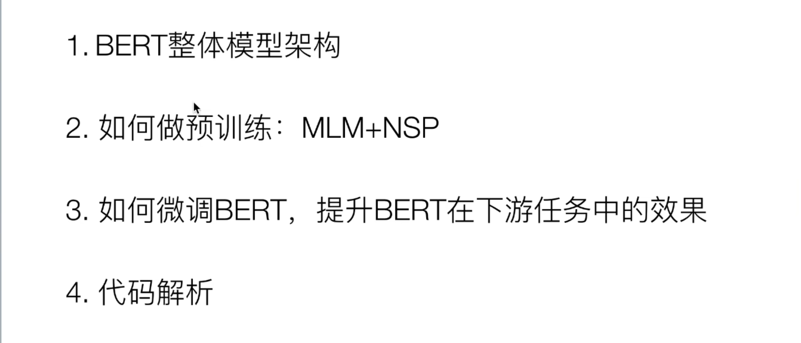

## 1 Bert的整体架构

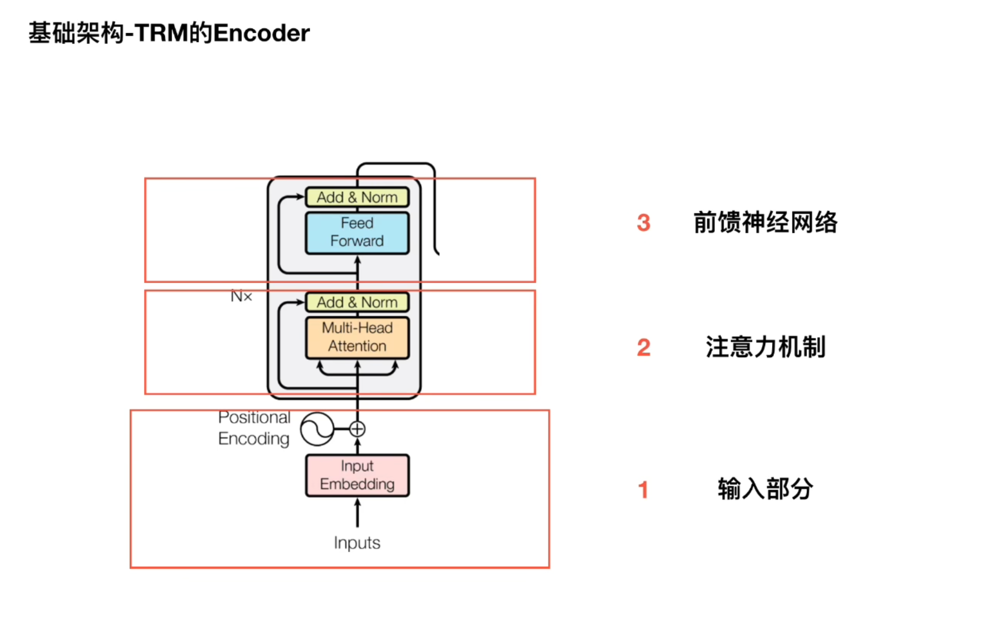

- Bert的基础结构是Transformer Encoder的部分
- Encoder可以分为三个部分：输入部分 + 多头注意力机制 + 前馈神经网络部分
- Bert使用的是多个Transformer Encoder 堆叠在一起的，其中Bert base使用的是12层的Encoder，Bert large使用的是24层的Encoder

- 图中展示的是 12层的 Encoder 堆叠在一起的Bert base

- 容易混淆的点：

  > 这里是12层的Encoder堆叠在一起组成的Bert，而不是12层的Transformer堆叠在一起，一定要区分Encoder和Transformer
  >
  > Transformer在原论文中是6个Encoder堆叠在一起变成编码端，6个decoder堆叠在一起变成解码端
  >
  > 

- 如图是一个Encoder，对于Bert的Encoder部分，重点关注输入部分

- 对于Transformer来说，输入部分包括两部分：

  > - 一部分是embedding，就是做词的词向量，比如使用随机初始化 或者 word2vector
  > - 第二部分：Position Encoding，在Transformer中使用的是Position encoding 位置编码，使用的是三角函数，正余弦函数

- 对于Bert来说，分为三个部分：

  > - 第一部分是 token embedding
  >
  > - 第二部分是segment embedding
  >
  > - 第三部分是Positional embedding
  >
  >   区分Transformer的Position encoding和Bert的Position embedding

### 1.1 详细看Bert的输入部分

- Bert 的输入部分由三部分组成，分别是token embedding、segment embedding和Position embedding

- 首先粉色的一行是输入，重点关注两个部分

  > **第一部分是正常词汇：**
  >
  > 
  >
  > 这些词是Bert分词器之后的词汇
  >
  > **第二部分是特殊词汇：**
  >
  > [CLS]
  >
  > [SEP]
  >
  > **两种特殊符号**
  >
  > 这两种特殊符号的存在是因为 Bert的预训练中 有一个是 NSP任务，next sentence prediction，判断两个句子之间的关系，具体地东西后面讲解
  >
  > **[SEP]**
  >
  > NSP任务是处理两个句子之间的关系，因为处理的是两个句子，所以需要一个特殊符号，告诉模型，在[SEP]符号之前的是一个句子，在[SEP]符号之后的是一个句子
  >
  > 以上是[SEP]的作用
  >
  > **[CLS]**
  >
  > 接着NSP任务是一个二分类任务，就是句子之间是什么关系的二分类任务，那么怎么实现二分类任务？所以在句子前面加了一个[CLS]的特殊符号，在训练的时候，将[CLS]的特殊向量接一个二分类器做一个二分类任务，是[CLS]的作用
  >
  > **关于[CLS]的扩展内容：**
  >
  > [CLS]的常见误解：很多人认为[CLS]这个特殊向量表示一个句子或者整两个句子的语义信息
  >
  > > 这种说法是不正确的
  > >
  > > 在预训练结束以后，[CLS]这个向量的输出向量，并不能说代表整个句子的语义信息
  >
  > [CLS]这个向量用在了NSP任务中，NSP任务是一个二分类任务，和编码整个句子的语义信息任务 是不一样的，所以在用 [CLS] 这个向量 来无监督的做文本相似度 任务的时候 效果非常差
  >
  > 可以看下面这张图
  >
  > 
  >
  > [CLS]向量 并不能代表整个句子的语义信息
  >
  > 预训练模型直接拿sentence embedding效果甚至不如word embedding，cls的embedding效果最差
  >
  > 为什么做无监督的文本相似度，cls的输出向量效果很差，有专门的讨论
  >
  > 现在的问题是 cls embedding是否能做无监督的文本相似度？也有研究

- 接下来看黄色的部分：token embedding

token embedding很简单，就是对input中的所有词汇（包括正常词汇和特殊词汇）做正常的embedding，比如随机初始化

- 第二部分，绿色部分：segment embedding

也是由于处理的是两个句子，所以需要对两个句子进行区分，比如第一个句子全部用0来表示，包括[CLS]到[SEP]

后面的句子全部用1来表示，分别表示了两个句子

- 第三部分是Position embeddings，也就是Bert的输入部分和Transformer的输入部分很大的不同点

  Transformer中使用的是正余弦函数，这里使用的是随机初始化，让模型自己学习，比如第一个位置设置为0，第二个部分设置为1，第三个部分设置为2等等等，一直到511，512表示句子的最大长度，索引的最大值是512

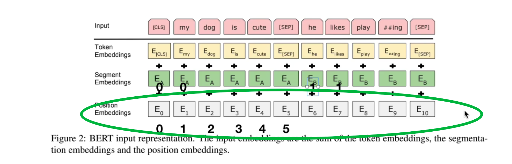

模型自己学习 每个位置的embedding是什么样的

> tips
>
> encoding：位置编码，常数位置编码
>
> embedding：位置嵌入，需要自己学习位置表示

关于为什么使用embedding而不是encoding，也有很多讨论

## 2 如何做预训练：MLM+NSP

如何对Bert进行预训练？

预训练Bert主要涉及两个任务：

- MLM任务：masked language model表示掩码语言模型
- NSP任务：判断两个句子之间的关系

### 2.1 MLM任务

首先明确Bert在预训练时 使用的是大量的无标注的语料库，随处可见的无标注文本，所以在预训练任务设计的时候，一定要考虑无监督来做，因为是没有标签的，对于无监督的目标函数来说，有两种目标函数 比较受到重视：

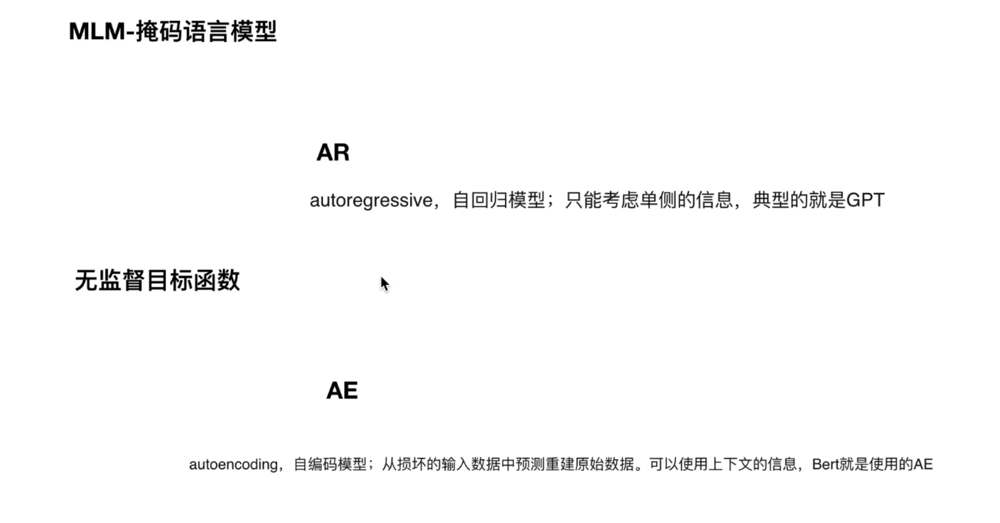

第一种是AR模型，也就是Auto Regressive，自回归模型，特点是只能考虑到单侧信息，典型应用是GPT

另一种目标函数就是AE模型，Autoencoding，自编码模型，特点是从损坏的输入数据中重建原始数据，可以使用到上下文的信息

- [x] 文字描述
- [x] 例子（数学例子、实际例子）
- [ ] 代码

以 `我爱吃饭` 进行举例

**AR模型**

假设原始输入语料 是 `我爱吃饭`，那么AR模型在做的时候，不会对 `我爱吃饭` 本身这句话进行操作，AR模型的优化目标是 $P(我爱吃饭)$  = P(我) 【''我''出现的概率】× P(爱|我)【在"我"出现的条件下，"爱"出现的概率】 × P(吃|我爱)【 "我爱" 出现的条件下 "吃" 出现的概率】 × P(饭|我爱吃)【在 "我爱吃"的条件下，"饭"出现的概率】

AR模型的优化目标 存在前后的依赖关系，可以看到AR模型只用到了单侧信息，也就是顺序过来的，也就是从左到右的单侧信息，接下来看 AE模型

**AE模型**

AE模型是对句子做一个 mask

mask本意 面具 的意思，简单来说就是用 面具 掩盖句子中的 某些 或者某几个 单词

比如 mask之后 是 ：我爱mask饭，我们知道mask的位置是 "吃"

我们的优化目标就是 P(我爱吃饭|我爱mask饭)   "我爱mask饭" 条件下，出现的是 "我爱吃饭" 出现的概率

=  P(mask = 吃|我爱饭)  "我爱饭"的条件下，mask="吃" 的概率

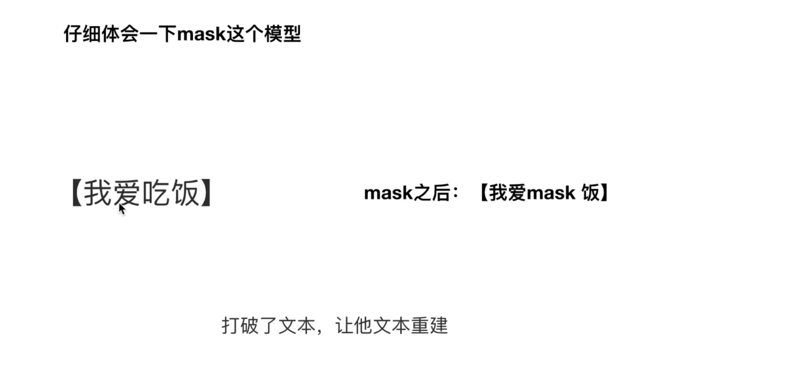

- 仔细体会这个 AE的优化目标，本质是在打破文本原有的信息，原本是"我爱吃饭"，我们把 "吃" 这个字 掩盖掉，让模型不知道，然后在 训练的时候 让 文本重建

- 在做 模型重建的时候，让模型 自己 从前后的词中，学习各种信息，使得模型能够 从前后的信息中无限接近的预测中 原本的词汇
- 通俗点就是说："我爱"会告诉模型 后面大概率跟着动词词组，比如 "我爱放风筝"，"我爱上学"等等等，"饭" 会告诉模型前面大概率是个 {动词}，这就是模型从文本中努力学到的规律，学到这些规律以后，模型就会把文本重建出来，变为 "吃"
- 接下来讨论 mask 模型的缺点

> 
>
> 比如说 我们mask掉两个单字"吃"、"饭"
>
> 此时优化目标变为 $P(我爱吃饭|我爱\mathrm{mask \quad mask})$ 就是 "我爱maskmask"条件下，"我爱吃饭"的概率，这个式子$= P(吃|我爱)P(饭|我爱)$ 通过这个优化目标，可以看出 这个优化目标认为 "吃" 和 "饭 "是相互独立的，也就是说 AE模型 认为 mask和mask之间 是相互独立的，但其实mask之间，比如这个例子中，mask就不是相互独立的
>
> 以上说明了 mask 模型的缺点

- Bert在预训练的时候，第一个任务就是MLM，就是用到了mask策略，需要注意的是，mask的概率问题，具体怎么做的？ $\downarrow$

随机mask 15%的单词，也就是100个单词里面，挑出 15个单词来mask，但是15个单词又不是全部都真的来mask，而是10%替换成其他单词，10%原封不动，80%替换成真正的mask，关于这个概率为什么是这样的，想学自己搜，理解就好

#### 2.1.1代码实现mask

- 首先 随机 mask掉 15%的单词，对应 `mask_indices`
- 接下来811划分，也就是 8份 替换成 mask，1份原封不动，1份替换成其他
- 对应到代码，就是 `random.randowm()<0.8` 就 mask掉 这个词汇，替换成 "[mask]" 这个单词
- 剩下的 20% 中的，50%，也就是两者相乘，就是总体中的 10% 保持不变，剩余的 10% 随机抽取一个单词
- 但从代码来看，这个随机抽取的过程，也有可能抽取到 自己本身，也就是 它由别的单词替换完以后，又抽取到这个 替换后的词，也就是没有变（？

### 2.2  NSP任务

接下来 第二个任务 NSP任务

- 理解NSP任务 的关键一点是理解 样本的构造模式
- NSP任务 在做 input embedding的时候，要区分，有两个特殊符号，[CLS]和[SEP]
- 接下来看 样本的构造模式：

> - 第一个正样本是 从训练语料中，取出两个连续的段落
>
> > 理解：
> >
> > 取出两个连续的段落：说明两个段落来自同一篇文档，一个文档是一个主题，就是说 同一个主题下 两个连续的段落，顺序也没有颠倒，作为正样本
>
> - 负样本，从不同文档中随机创建一对段落 作为负样本，区别就在 负样本是从不同的文档中抽取、随机创建一对段落，也就是不同的主题，随便创建

- 缺点是：主题预测和连贯性预测合并为一个单项任务

> - 主题预测 就是 判断两个样本 是否来自同一篇文档
>
> - 连贯性预测就是 判断两个段落 是不是顺序关系
>
>   > - 主题预测是比较简单的，所以整个任务在预测的时候，就很简单
>   >
>   > - 也就是说 相比于连贯性预测，主题预测非常容易学习
>   >
>   > - 这也是后续很多任务 验证 NSP任务 没有效果的原因，是因为 存在主题预测这一个单任务，让整个预测任务简单了
>   >
>   > - 而后续的改进，比如 ALBert，直接就抛弃掉了 主题预测，而是去做类似连贯性预测的任务，就是预测 句子顺序
>   >
>   > - 对于albert来说，正样本和负样本都是来自于同一篇文档
>   >
>   >   > - 正样本就是 同一篇文档中，两个句子 顺序的句子
>   >   > - 负样本 就是 两个句子 颠倒过来
>   >   > - 但是 正样本 和 负样本 都是来自同一文档

## 3  如何微调Bert，提升Bert在下游任务中的效果

接下来看，如何在下游任务 微调bert

主要分为四种：

1. （a）文本分类，表示句子的分类任务，是句子对的分类任务
2. （b）单个句子的分类任务
3. （c）问答
4. （d）序列标注任务

最常用的：文本分类、序列标注、文本匹配

- 以 序列标注 为例：把所有的 token 输出 进行一个softmax，判读 属于 实体 中的哪一个
- 对于单个样本的 文本分类 就是 使用 [CLS] 的输出，做一个微调，做一个二分类 或者 多分类，本质属于 文本匹配的任务
- 文本匹配 就是把两个句子拼接起来，判断句子是否相似，用[CLS]输出，"0"表示不相似，"1"表示相似

现在讨论 ：

因为 在实际应用中 很少自己从头开始训练一个bert，更多的是，利用已经训练好的bert，然后在自己的任务中微调

现在更一般的做法是：

- 先获取 谷歌中文 或者 其他公司的 bert
- 然后基于自己的任务数据 进行微调

要追求更好的性能，有很多的trick可以做，👇🏻

###  第一个trick

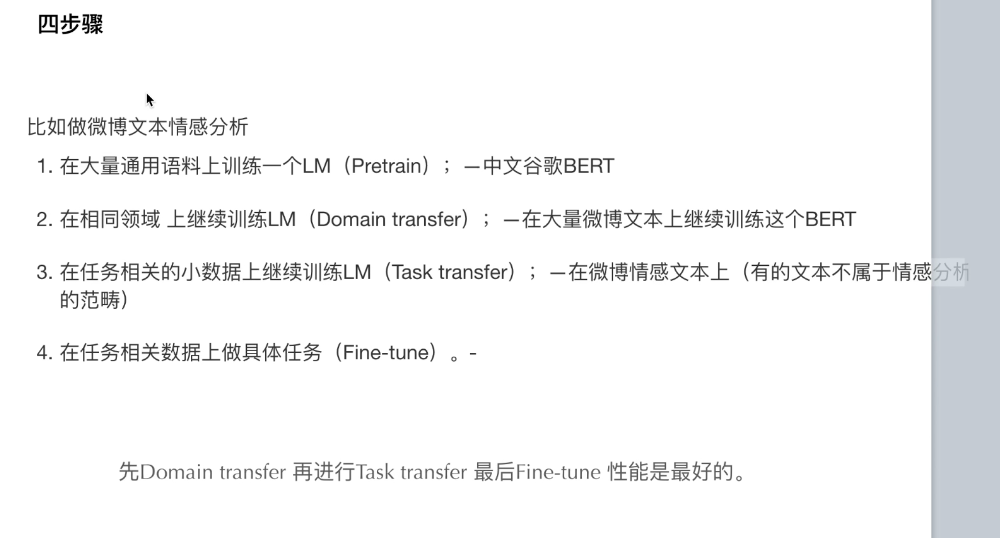

把 两个步骤 分为 4个步骤，比如现在做 微博情感分析

- 首先在大量通用语料做一个预训练模型，这一步不用自己做，通常用一个中文谷歌的bert就可以
- 第二部分，就是在相同领域的文本上，继续训练language model，也叫做 领域的自适应 或者说 领域迁移，也就是在大量的微博文本上继续训练这个bert
- 第三个就是在任务相关的小数据上继续训练language model，就是第二步中大量的微博文本中，有很多不属于 微博情感分析的数据，使得文本更聚焦于 与微博情感分析更相关的数据，继续训练language model
- 第四个步骤，在具体的微博情感分析任务，比如比赛给的数据集进行 fine tune
- 一般的经验就是先做领域的，然后再做任务的，最后微调性能是最好的
- 相当于把上面的两个步骤，扩展成4个步骤，效果一般可以提到 3-4个点左右

### 3.2 第二个trick

第二个部分

在大量的微博文本上训练bert，也相当于训练bert

**也有trick**，两个关于mask的👇🏻

- 第一个，动态mask，bert在训练的时候使用的是固定的mask，就是把文本mask之后，存在本地，然后每次训练的时候，都是使用同一个文件，就是每次训练的时候使用的都是同一个mask标记，以 "我爱吃饭" 举例，每次训练都是mask掉 "吃"，这是不太好的；所以动态mask就是 每次epoch训练之前，然后再对数据进行mask，相对于每个epoch来说，mask的单词是不一样的，而不是一直使用同一个文件
- 第二个 n-gram mask

### 3.3第三个trick

参数的设计

## 4 Bert代码实战

----

来自：

[数学家是我理想](https://www.bilibili.com/video/BV11p4y1i7AN/?spm_id_from=333.337.search-card.all.click&vd_source=ddd7d236ab3e9b123c4086c415f4939e)

## 5 [bert原理](https://wmathor.com/index.php/archives/1456/)

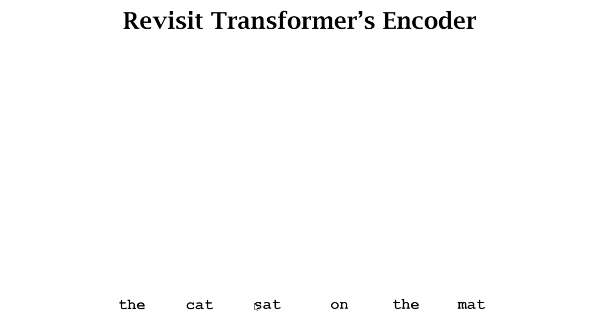

### 5.1 文字描述

首先，bert用的是的Transformer Encoder的部分

接收的输入是 `the cat sat on the mat`

输入到网络中，首先做一个embedding

embedding在Transformer中接收两个东西= word embedding+Position embedding（encoding）

通过embedding之后，得到每个词对应的输出

接着把每个词的输出，送入到Transformer Encoder中：

Encoder中包含一个残差连接、自注意力机制、LayerNorm，再经过FFN 前馈全连接网络

接着堆叠这个EncoderLayer的结构（继续残差连接....）堆叠6层

Bert，首先随机掩盖一些词：

比如 第二个词 mask掉

网络输出 预测的概率，使得预测的概率无限接近 cat的独热编码向量

以上是bert可以解决的第一个任务

第二个任务：预测下一个句子

预测两个句子是否是连续句子

或者判断"it was developed by newton and leibniz"是不是 "calculus is a branch of math"的下一个句子

输出应该是 true或者是false

那具体怎么做呢？

首先在句子的开头加入 [CLS] token，在两个句子的中间加入 [SEP]

然后经过 两个 Encoder 得到两个输出

然后我们把 [CLS] token的 对应的 C进行一个 二分类 任务

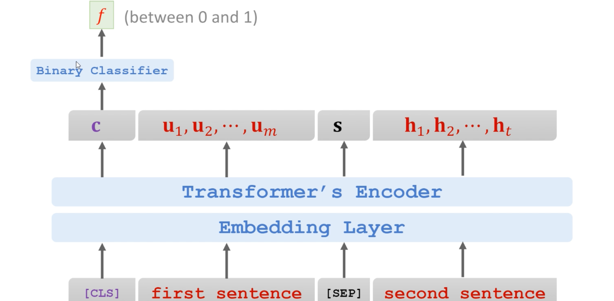

通过nn.Linear映射为一个两维的?向量，比如0或者1

问题：为什么不用 first sentence的第一个词 比如 calculus 对应的 $u_1$ 进行二分类呢？或者 $u_2$ 呢？

[回答](https://wmathor.com/index.php/archives/1456/)

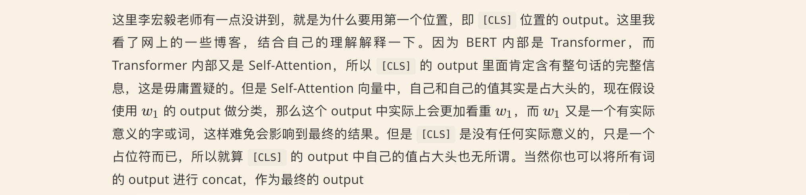

自注意力机制 自己对自己的关注最大，如果模型更关注有意义的词会影响模型的结果，所以[CLS]相当于占位符，包含所有信息

接下来计算 loss，然后backward即可

### 5.2 bert的具体方法结合两种任务

比如说 有两句话：

- 在每一句话当中，进行mask，然后把两句话拼起来
- 是一个多任务的学习方法
- 首先判断是否为连续的两句话，`true or false`
- 并且计算 mask的位置是什么词
- 所以bert模型有很多loss，比如分类是不是连续的两句话 是一个loss，有多个mask就有多个loss，把所有的loss，全部加起来，求和

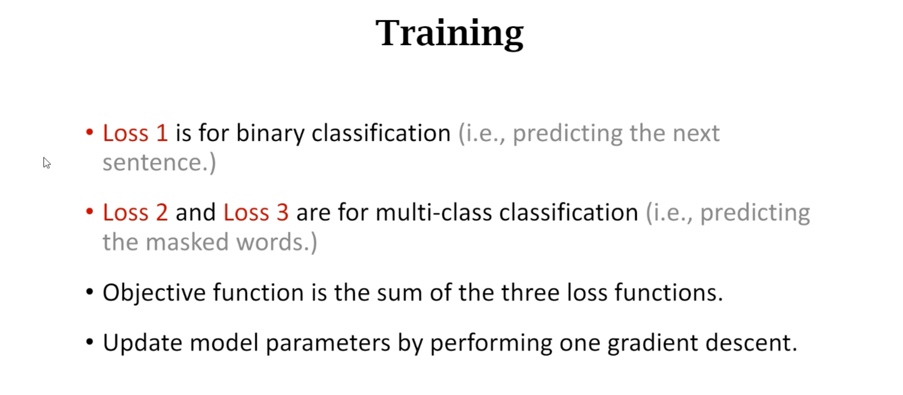

- 求和之后，在进行backward，就是 `sum of the three loss functions`

以上是bert的整个过程

### 5.3 MLM实际例子

接下来细节：

**首先预测哪个词？**

假如有100个词，我们选出15个词

在这15个词当中：

1. 每个词有80%的概率 会被改为 mask，比如  "my dog is hairy" 改成 "my dog is [MASK]"
2. 每个词 还有10%的概率，会被替换成任意一个其他的 token，比如 "my dog is hairy"改成 "my dog is apple"（思考为什么这样做？后面会说）
3. 每个词 还有 10%的概率 原封不动，"my dog is hairy" 还是 "my dog is hairy"

> 第1点和第2点很好理解，那为什么提出第3点呢？
>
> 这是很巧妙的地方，希望模型 输出的 hairy  还是 hairy，这样做的好处在于防止过拟合，让模型真正理解这个句子，因为"my dog is hairy "可能会预测出别的输出，比如"my dog is jack"、"my dog is merry"，就不是 "hairy" 的意思 ，丢失原始的语义

关于第2点：

一句话：为了防止模型过于相信 当前的词，而是希望模型去观察上下文

以上是bert的第一个任务 MLM：掩盖一些词，进行预测

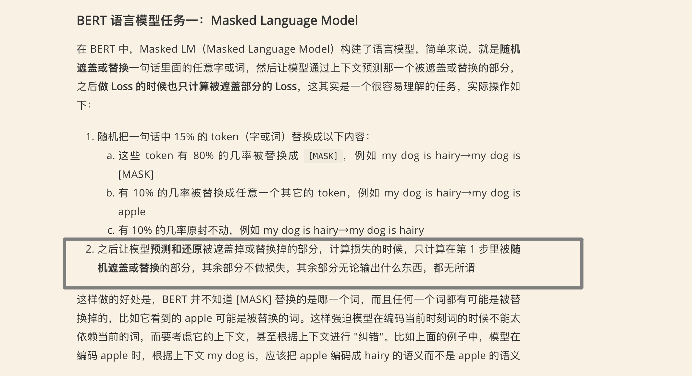

#### 5.3.1 NSP实际例子

首先对输入句子

1. 加入 特殊字符[SEP]（seperate）[CLS]（class）
2. bert有 三个embedding、Transformer有2个embedding（1个embedding+1个encoding），有两点不同

> （1）bert多了一个 segment embedding，作用是 判断句子属于第一句还是第二句，就是很简单的，比如$E_A$全是第一句的，那就全部写成 0，$E_B$ 是第二句，那就全部写成1
>
> 
>
> （2）第二点不同，positional embedding在bert中是可训练的，类似 `nn.embedding` ，在Transformer中是三角函数表示的常数位置编码
>
> 最后将三个embedding相加，得到embedding layer的输出

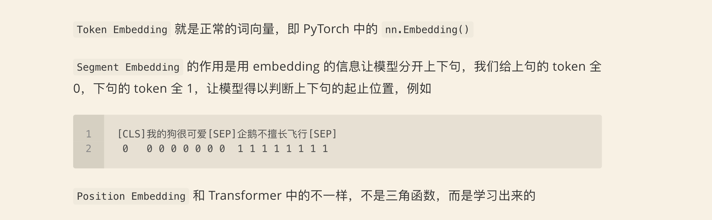

#### 5.3.2 Multi-Task Learning

#### 5.3.3 微调适应下游任务

如何使用 bert fine tune应用到别的任务上

##### 第一种任务：分类问题

情感分析、文本分类

首先[CLS]标志，接着把句子或者文章放到后面 $w_1、w_2、w_3$

bert这里的参数可以是frozen冻住的，或者fine_tune 微调的

[CLS] 的输出 经过 一个线性分类器，线性分类器 是从头开始学习的，得到一个class输出

##### 第二种任务:slot filling

slot filling?

比如有一个句子 "arrive Taipei on November 2nd" ，标注："Taipei" 是" 地点"、"November" 是" 时间" 

就是把句子中的每一个词 进行一个分类，比如 "on" 是 "other" 类别，"Taipei" 是" 地点"类别

每个词 都进行一个线性分类器，得到一个输出

##### 第三种任务：自然语言推理

自然语言推理

就是给定一个前提，给定一个假设

希望bert推理出 true、false、unknown（不知道）

例子：

给出前提：地球围绕太阳转

假设：明天我们要考试

两者之间没有任何关系，像这种情况下，就要判别假设是对的吗？其实是不知道，所以输出 unknown

因此这个属于三分类的问题

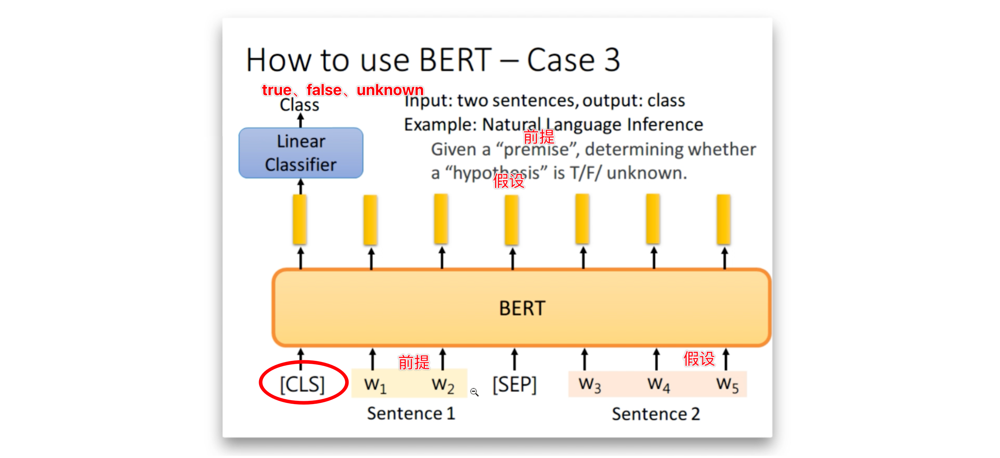

- 前提 和 假设 通过 [SEP]分隔开
- [CLS]  token 拿出来 通过线性分类器 预测，得到输出 true、false、unknown

##### 第四种任务：问答

问答

比如 现在有一篇文章，现在有一个问题，要回答这个问题

首先，假设 问题的答案一定是原文中出现的词 或者 连续的句子

比如这个问题的答案，是原文的第17个词到第17个词（s表示开始，e表示结束）

具体来说：

先把question这个句子 放到前面，[SEP]分隔两个句子，document放到后面

最前面 加入 [CLS]

通过bert，对document中 每个词的输出 黄色的向量 乘以一个 橙色的向量，橙色的向量 就是 nn.Linear，进行一个dot product，然后经过一个softmax ，得到概率值，其中最大值概率为0.5，对应 第二个词，也就是说 问题的答案从文章的第二个词作为开始，那结束呢？

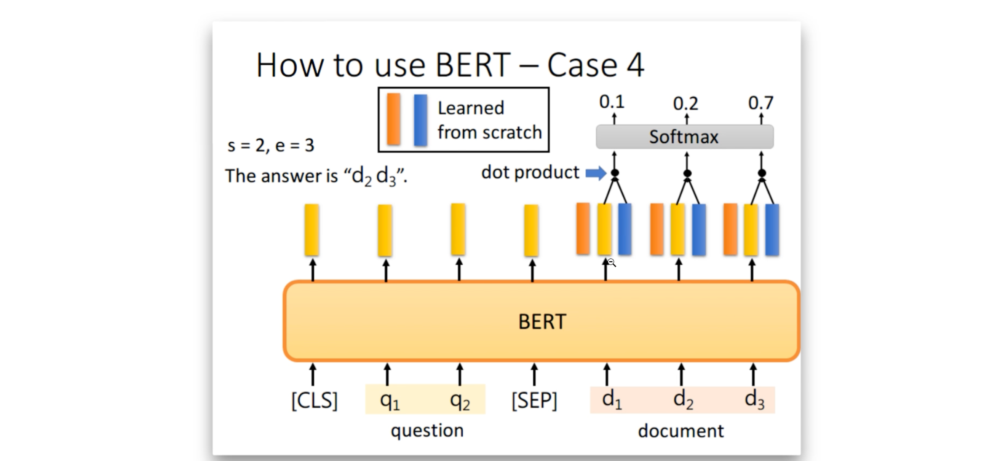

结束就是 蓝色的向量 乘以 黄色的向量 进行 dot product，然后通过softmax，得到概率最大值=0.7，对应第三个词，就认为e = d第三个词

也就是说答案 从 第二个词 到 第三个词

还有一个问题：s>e?

举个例子：文档是 孟子孔子中国历史，问题：神州五号什么时候发射。这时就是没有答案的。

### 5.4 代码实战

[Rereference1](https://neptune.ai/blog/how-to-code-bert-using-pytorch-tutorial)

[Reference2](https://wmathor.com/index.php/archives/1457/)

