# DDPM

Probabilistic Diffusion Model

[What are Diffusion Models?](https://lilianweng.github.io/posts/2021-07-11-diffusion-models/#forward-diffusion-process)

[Probabilistic Diffusion Model概率扩散模型理论与完整PyTorch代码详细解读](https://www.bilibili.com/video/BV1b541197HX?spm_id_from=333.788.videopod.sections&vd_source=ddd7d236ab3e9b123c4086c415f4939e)

[怎么理解今年 CV 比较火的扩散模型（DDPM）？](https://www.zhihu.com/question/545764550/answer/2670611518)

[Diffusion Model学习笔记(1)——DDPM](https://zhuanlan.zhihu.com/p/601641045)

参考文献：

（1）2015年 ： 基于非平衡热力学进行深度无监督学习

深度无监督学习就是生成照片

（2）2020年：去噪概率模型

- 扩散模型开始流行实行2020年的这篇论文，2021年、2022年开始有大量论文出现
- 目前：DDPM 2020年这篇论文的引用量已经220万，2015年论文的引用量也有200多万

- 扩散模型是一种生成式模型：GAN的任务、VAE的任务、FLOW的任务都可以用Diffusion Model

## 	1 汇总生成模型

（1）第一类生成模型：Seq2Seq模型，自回归的解码模型

（2）第二类生成模型：基于GAN的模型，没有显式的对目标分布进行建模，只是将生成的数据放到下游的判别器中，以对抗的方式使得生成器达到理想的目标分布

（3）第三类生成模型：[FLOW模型](https://www.bilibili.com/video/BV1dS4y1c7xB?spm_id_from=333.788.videopod.sections&vd_source=ddd7d236ab3e9b123c4086c415f4939e)：FLOW模型的数学原理比较严谨，是一个完全可逆的过程，为了让FLOW模型变得可解，需要设计一些巧妙结构，使得对数似然完全可解，也是因为设计的巧妙的结构，限制了FLOW的性能

（4）第四类生成模型：VAE

（5）第五类生成模型：Diffusion：其中VAE和Diffusion模型其实有点像

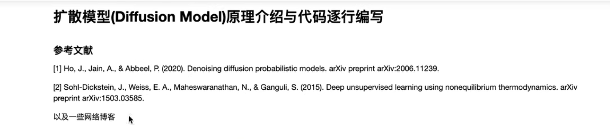

## 2 前置数学知识

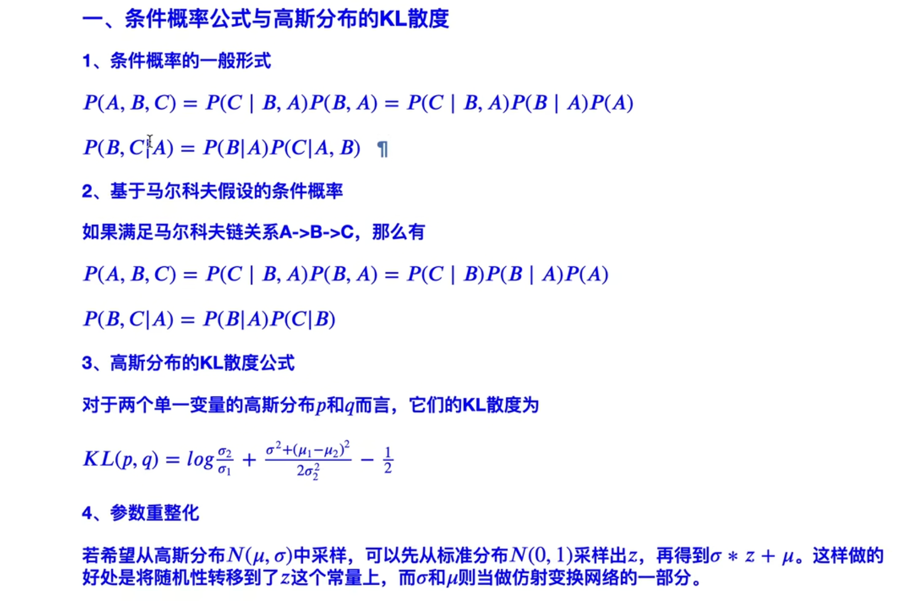

### **一、条件概率公式与高斯分布的KL散度**

<u>1、条件概率的一般公式</u>

- [x] （1）P(A,B,C)=P(A)P(B|A)P(C|A,B)

- [x] （2）P(B,C|A) = P(B|A)P(C|A,B)

<u>2、基于马尔科夫假设的条件概率</u>

> 什么叫 马尔科夫假设？
>
> 当前时刻的输出 只与 上一时刻有关，跟过去以及更远的无关

如我们现在有马尔科夫链：A→B→C，则上面的（1）、（2）可以进行简化：

P(A,B,C)可以写成：P(A,B)P(C|A,B) 继续写成：P(A)P(B|A)P(C|A,B)

因为 A是B的上一时刻，所以保留 P(B|A)

因为A距离C比较远，不再是C的上一时刻，所以 P(C|A,B)写成P(C|B)

所以在满足马尔科夫假设的情况下，条件概率写成：

- [x] （3）P(A,B,C)=P(A)P(B|A)P(C|B)

同理简化P(B,C|A)，得到：

- [x] （4）P(B,C|A) = P(B|A)P(C|B)

<u>3、两个高斯分布的KL散度公式</u> 

> 明白VAE的话，KL散度公式会很清楚
>
> 
>
> 对于两个单一变量的高斯分布p和q来说，均值是 $\mu_1$ 和 $\mu_2$ ，方差是 $\sigma_1^2$、$\sigma_2^2$
>
> 则它们的KL散度公式：
>
> $KL(p,q)=log\frac{\sigma_2}{\sigma_1} + \frac{\sigma^2+(\mu_1-\mu_2)^2}{2\sigma^2_2}-\frac{1}{2}$

<u>4、参数重整化的技巧</u>

> 什么是参数重整化？
>
> 假设希望从 均值为 $\mu$、方差为 $\sigma^2$ 的高斯分布 $N(\mu,\sigma^2)$ 中采样，如果直接采样的话，会造成什么问题呢？
>
> 如果 $\mu$ 和  $\sigma$ 是通过神经网络预测出来的话，直接去采样$N(\mu,\sigma)$，就会导致与 $\mu$ 和$\sigma$ 参数断开了，梯度无法传回去了，因为采样的过程是不可导的；所以为了让采样出来的样本跟 $\mu$ 和 $\sigma$ 之间，仍然可以梯度可传播的，仍然是可导的，我们就可以把这个采样过程 等价于 首先从 $N(0,1)$ 的标准分布中，采样出 z，把 z 当成是一个常数，再把z乘以原来分布的 $\sigma$ 和 $\mu$ ，保证了梯度可以回传
>
> 这样做的好处是，这样的采样过程转移到了 z上，   **z可以看做是 网络的输入**    ，或者当成一个常数，采样值 $y=\sigma z+\mu$，$y$与 $\sigma$ 和 $y$与 $\mu$ 之间是完全可导的
>
> 如果不这样做的话，$y$对$\mu$ 和 $y$对 $\sigma$ 的导数是算不出来的
>
> 以上称为参数重整化

> 目的就是希望 采样出来的值，跟 $\mu$ 和 $\sigma$ 之间 梯度是可导的
>
> 这就是参数重整化的技巧，这个技巧在VAE和Diffusion中大量使用
>
> 以上是回顾，接下来讲解什么是VAE以及多层VAE

### 二、**VAE与多层VAE回顾**

#### 1 单层VAE&置信下界

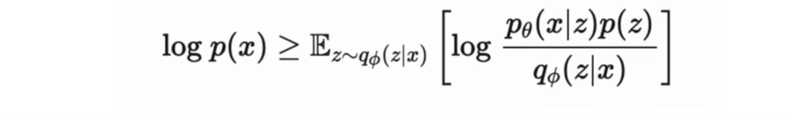

VAE的原理：

> 首先单层VAE
>
> VAE认为x由某一个隐变量z生成

隐变量z如何得到呢？

> 在训练的时候，通过$q_{\phi}(z|x)$ 从x中生成z，在推理的时候，从z预测x

以上就是单层VAE

公式：

用公式 概括目标数据分布：

（1）p(x)可以写成联合概率分布，对z这个变量进行积分，得到边缘分布：

$p(x) = \int_zp_{\theta}(x|z)p(z)$

写成一个 $条件概率$ 和 $p(z)$ 相乘的形式

（2）对（1）乘以后验概率分布的形式，后验是希望从x去预测z这个隐变量，上下分别乘以 $q_{\phi} $  z  given  x 就是$q_{\phi}(z|x)$ ：

$p(x)= \int q_{\phi}(z|x) \frac{p_{\theta}(x|z)p(z)}{q_{\phi}(z|x)}$

这个式子相当于  $\frac{p_{\theta}(x|z)p(z)}{q_{\phi}(z|x)}$  在 $q_{\phi}$ 分布下的期望

（3）对（2）左右两边同时取$log$，得到$logp(x)$

右边写成期望的形式：

$logp(x)$  就是一个对数似然

$logp(x) = log \mathbb{E}_{z \sim q_{\phi}(z|x)}[\frac{p_{\theta}(x|z)p(z)}{q_{\phi(z|x)}}]$

（4）根据詹森不等式，log移到期望里面，得到：

 $logp(x)  \ge  \mathbb{E}_{z \sim q_{\phi}(z|x)}[log \frac{p_{\theta}(x|z)p(z)}{q_{\phi(z|x)}}]$ 

经过以上的推导，得到目标数据分布的下界，训练网络的目的是最大化 $logp(x)$，最大化对数似然，最大化 $logp(x)$ 不好求，就可以 最大化  $\mathbb{E}_{z \sim q_{\phi}(z|x)}[log \frac{p_{\theta}(x|z)p(z)}{q_{\phi(z|x)}}]$ 

因为    $logp(x)  \ge  \mathbb{E}_{z \sim q_{\phi}(z|x)}[log \frac{p_{\theta}(x|z)p(z)}{q_{\phi(z|x)}}]$    这个不等式永远成立

<u>接下来，思考，怎么最大化 $\mathbb{E}_{z \sim q_{\phi}(z|x)}[log \frac{p_{\theta}(x|z)p(z)}{q_{\phi(z|x)}}]$</u> ？

看成两部分

第一部分：$log p_{\theta}(x|z)$

看成是预测网络，基于预测出来的隐变量z预测x，这一部分好求，与目标数据的分布作差即可

第二部分：$log\frac{p(z)}{q_{\phi}(z|x)}$

这部分分子、分母求倒数，变成$-log\frac{q_{\phi}(z|x)}{p(z)}$

又 因为在 $q_{\phi}$ 分布下的期望 $\mathbb{E}_{z \sim q_{\phi}(z|x)}$ ，所以这个式子变成 $q_{\phi}$ 与 $p_z$ 之间的KL散度

于是下界变成：

$\mathbb{E}_{z \sim q_{\phi}(z|x)}[log \frac{p_{\theta}(x|z)p(z)}{q_{\phi(z|x)}}]$

$= log p_{\theta}(x|z) - KL散度(q_{\phi} 与 p)$

$p$ 一般情况下可以假设服从高斯分布

 因此，$q_{\phi}$  可以预测高斯分布

由于两个高斯分布之间的KL散度是可解的，所以整个VAE的目标函数，也是可以写出来的，以上是单层VAE的原理

<u>接下来，多层VAE</u>

#### 2 多层VAE及置信下界

多层VAE

假设这里的x 不是由一个隐变量 生成的，而是由 2个生成

一开始的隐变量称为 $z_2$ ，通过 $z_2$ 生成 $z_1$，再通过 $z_1$  生成 $x$

这样的生成过程叫做多层VAE

(1)此时的目标分布 $p(x)$ ，可以写成一个联合概率分布，然后把 $z_1$ 、$z_2$  积掉，得到 $p(x)$：

$p(x) = \int_{z_1}\int_{z_2}p_{\theta}(x,z_1,z_2)dz_1dz_2$

(2)分子分母 同时乘以 后验分布：

$p(x) = \int_{z_1}\int_{z_2}q_{\phi}(z_1,z_2|x)\frac{p_{\theta}(x,z_1,z_2)}{q_{\phi}(z_1,z_2|x)}dz_1dz_2$

(3)继续将(2)写成期望的形式：$p(x) = \mathbb{E}_{z_1,z_2\sim q_{\phi}(z_1,z_2|x)}[\frac{p_{\theta}(x,z_1,z_2)}{q_{\phi}(z_1,z_2|x)}]$

(4) 同样对(3)两边取一个对数，利用詹森不等式，得到$log(p(x))$ 的下界：

(5)对(4)，借助之前说过的公式，在马尔科夫假设的条件下，可以写成：

(6)将(5)代入(4)，得到

以上是多层VAE的目标函数

训练的时候，有两次 首先从 $x$中推理出$z$，然后从$z$中，推理出$x$

这个过程跟Diffusion很像

### 三、Diffusion图示

（1）

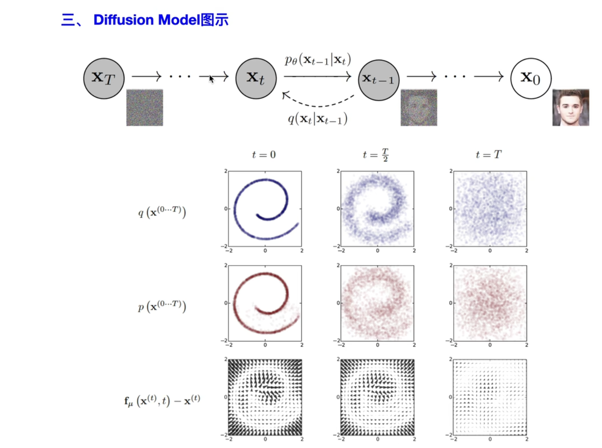

（2）讲解了Diffusion是怎么一回事

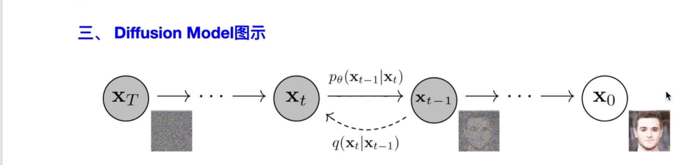

Diffusion从目标分布 $x_0$ 中加噪，去生成，得到最终的一个分布 $x_T$ ，用的时候从最终分布 $x_T$ ，逐步逐步的得到目标分布  $x_0$

所以Diffusion的目标函数跟多层VAE的目标函数是很像的

思考，多层VAE & Diffusion之间有什么关联？

Diffusion分为两个过程

符号说明：目标分布（记为 $x_0$），噪声分布 $x_T$

第一个过程：扩散过程

- 从 $x_0$  到 $x_T$ 熵增过程，从有序到无序
- 想象 把一个水滴 倒入到 一个池塘或者河流之中，慢慢的扩散，最后没有了原来的分布
- 扩散过程 就是原始的过程中 不断的加噪，直到最后变成了 各项独立的高斯分布

生成的时候，是希望从一个噪声分布中，逐步预测出目标分布，这个过程叫做 逆扩散过程

第二个过程：逆扩散过程

逆扩散过程，就是基于一个噪声，能够把目标分布推导出来，从目标分布中，采样新的样本，生成新的图像

DIffusion要做的就是，有一堆目标分布（比如有一堆这个人的照片），我们希望能够把逆扩散过程，也就是从$x_T$ 到 $x_0$ 的原理搞出来，或者说公式预测出来，然后随机的生成噪声分布，从而能够预测出新的这个人的照片，以上就是Diffusion Model做的事情

补充两个条件概率分布：

- $p_{\theta}(x_{t-1}|x_t)$ ： 表示逆扩散过程中的条件概率分布
-  $q(x_t|x_{t-1})$ ：表示扩散过程中的条件概率分布

而我们在进行推理的时候，只用到逆扩散过程

接下来用图表示这个过程：

（3）

t=0时，就是标准的目标分布，就是规则的图形，接着我们逐步的加噪，加到一半的时候，发现图形变得很模糊，加到最终的时候，分布已经完全失去了原貌，基本已经变成了各项独立的高斯分布：

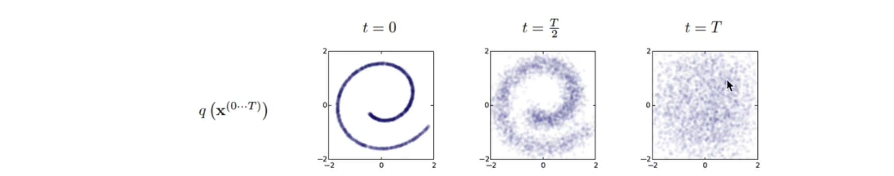

逆扩散的过程也是同样，一开始的时候，生成一堆高斯分布的噪声，然后基于模型不断的迭代，迭代到t=0的时候，也就是 T时刻的迭代，生成新的样本，新的样本的分布跟原来数据是一样的，从同一个分布中，采样出来的新的样本，以上是逆扩散过程：

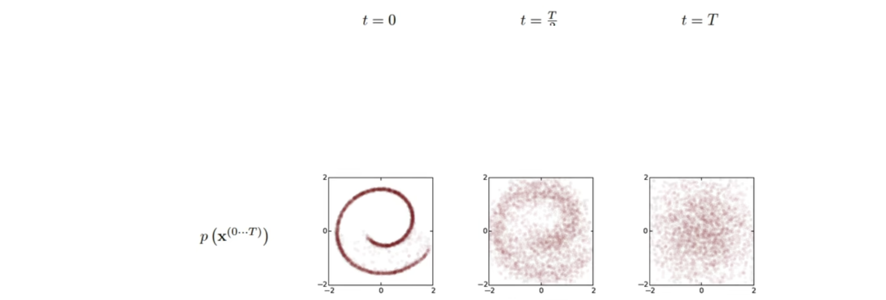

扩散过程和逆扩散过程的差称为漂移量：

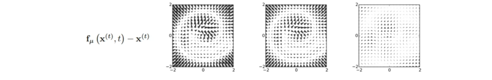

以上是扩散模型的大致过程

 以上是图示，下面是正式的推导过程

### 四、扩散过程

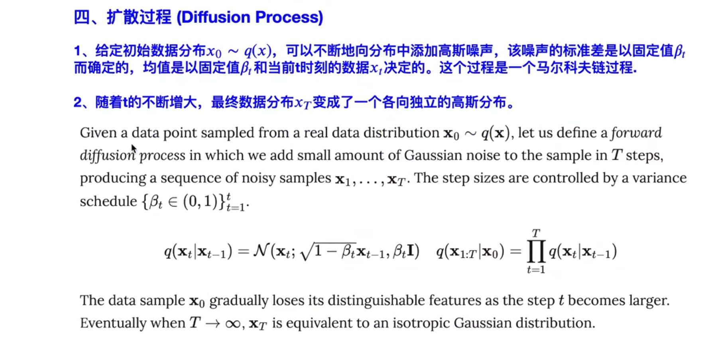

首先明白，扩散过程分为两个过程：

(1)正向的扩散过程，从 $x_0$ 到 $x_T$

(2)反向的逆扩散过程，从 $x_T$ 到 $x_0$（也可以叫重建过程） 从噪声中 重建目标分布

1、首先看扩散过程：给定初始数据分布，通俗一点就是训练集服从分布 $x_0 \sim q(x)$，接着不断的向分布中添加噪声，这里的均值和标准差都是不含参数的，再次强调，扩散过程的正向过程是不含参数的，就是往 $x_0$ 中 添加高斯噪声的时候，每一步的均值的方差都是确定的，就比如学习率，虽然每一步都在变化，但是是确定的，而不是网络预测的，并且这个过程也是马尔科夫链的过程，即当前时刻只与上一时刻相关，与过去更远的时刻无关，这就是第一点，不断的往原始分布中，去添加高斯噪声，但这个添加不是简单的加法，而是仿射变换的过程，等下会基于参数重整化生成每一时刻新的数据分布

2、第二点，随着 t的不断增大，我们最终的数据分布会变成 各项独立的高斯分布，为什么会这样？下面开始推导：

在扩散模型中，有定义 $q(x_t|x_{t-1})$：从 $x_0$ 去预测 $x_1$ ，或者说 $x_1$ 预测 $x_2$ 的话，是一个条件概率分布，并且这个条件概率分布是一个高斯分布，这个高斯分布的均值是 $\sqrt{1-\beta_t}x_{t-1}$，方差是 $\beta_tI$ ，也就是说 每次加噪的高斯分布，只由当前时刻的 $x$ 和一个确定值 $\beta_t$ 有关，是完全不含可训练参数的，以上就是扩散过程，是不含参的，也就是说 按照公式：

迭代的话，可以计算 t=任意时刻的，$x_t$ 的分布，然后就可以采样出值

还有一个迭代式，给定 $x_0$ 求出 $x_{1:T}$ 的联合分布，就是多个条件概率相乘的结果，是一个 马尔科夫过程，以上是一个联合分布

问题：怎么算出 $x_t$ 呢？

答：用之前参数重整化的技巧，因为$x_t$服从的分布有：$x_t|x_{t-1} \sim \mathcal{N}(\sqrt{1-\beta_t}x_{t-1},\beta_tI)$，可以从一个正态分布中 生成一个 z，然后把 z乘以 根号下 $\beta_t$，再加上 $\sqrt{1-\beta_t}x_{t-1}$：

$\sigma z + \mu = \sqrt{\beta_t}z+\sqrt{1-\beta_t}x_{t-1}$，

这就是 $x_t$ 的一个采样值，经过不断的迭代，得到 $x_{t+1}$ 的采样值，最终得到 $x_T$ 的采样值

问题：大T是怎样确定的，以及 $\beta_t$ 怎么设置？

答： $\beta_t$ 在原论文中是 出于 $0\sim 1$之间的小数，并且随着时间的推移，$\beta_t$ 是越来越大的

也就是 $\beta_1 < \beta_2<...<\beta_T$   把  $\beta_t$ 设置成就像学习率一样设置成不断变化的，不过学习率是不断降低的，这里的 $\beta_t$ 是在不断变大的

以上通过迭代的方法计算 $x_t$ 的采样值

<u>接下来 说明 当 $T=什么$ 的时候，$x_T$ 接近于一个各项独立的高斯分布</u>

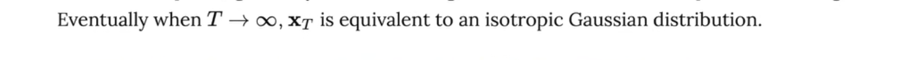

任意时刻的 $q(x_t)$ ，可以不用 完全一样的 基于上面的公式，每一步的采样迭代出来：

而是可以完全的基于 $x_0$  和 $\beta_t$ 计算出来，也就是给出 $x_0$ 初始的数据分布和 $\beta_t$ 一个变换值，就可以算出任意时刻的 $q(x_t)$ ，就不用一步步迭代了

具体的计算步骤：

（1） $x_t = \sqrt{\alpha_t}x_{t-1}+\sqrt{1-\alpha_t}z_{t-1}$

首先，$x_t$  用参数重整化的技巧 写成 $\sqrt{\alpha_t}x_{t-1}+标准差$

> $\sigma z + \mu = \sqrt{\beta_t}z+\sqrt{1-\beta_t}x_{t-1}$
>

这里的 $\alpha_t = 1-\beta_t$

可以看到原文都写了

也就是 $x_t = \sqrt{\alpha_t}x_{t-1}+\sqrt{1-\alpha_t}z_{t-1}$

`均值 + 标准差 × 随机生成的正态分布的量`

以上就是 参数重整化技巧

$z_t$ 是从 $N(0,1)$ 中采样出来的 随机值

（2）

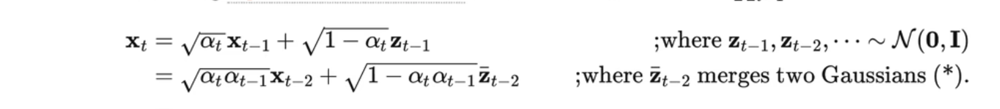

$x_t = \sqrt{\alpha_t}x_{t-1}+\sqrt{1-\alpha_t}z_{t-1}$

$=\sqrt{\alpha_t}(\sqrt{\alpha_{t-1}}x_{t-2}+\sqrt{1-\alpha_{t-1}}z_{t-2})+\sqrt{1-\alpha_t}z_{t-1} $

$=\sqrt{\alpha_t\alpha_{t-1}}x_{t-2}+\sqrt{\alpha_t}\sqrt{1-\alpha_{t-1}}z_{t-2}+\sqrt{1-\alpha_t}z_{t-1} $

> $\sqrt{\alpha_t}\sqrt{1-\alpha_{t-1}}z_{t-2}+\sqrt{1-\alpha_t}z_{t-1}$
>
> 可以参数重整化为 只包含一个 随机变量z的形式，理由：
>
> 
>
> 若给出 $X \sim N(\mu_1,\sigma_1)$    $Y\sim N(\mu_2,\sigma_2)$
>
> 则 $aX+bY \sim N(a\mu_1+b\mu_2,a^2\sigma_1^2+b^2\sigma_2^2)$
>
> 所以 
>
> $\sqrt{\alpha_t}\sqrt{1-\alpha_{t-1}}z_{t-2}+\sqrt{1-\alpha_t}z_{t-1} \sim N(0,\alpha_t-\alpha_t\alpha_{t-1}+1-\alpha_t)=N(0,1-\alpha_{t-1}\alpha_t)$
>
> （$z_{t-1}、z_{t-2} \sim N(0,1)$）
>
> 所以 
>
> $\sqrt{\alpha_t}\sqrt{1-\alpha_{t-1}}z_{t-2}+\sqrt{1-\alpha_t}z_{t-1}$ 可以重整化为 $\sqrt{1-\alpha_t\alpha_{t-1}}\bar z_{t-2}$

以上推出  第二步

（3）

一次类推，得到

- z仍然是 N(0,1) 中采样出来的
- $x_t = \sqrt{\bar{\alpha_t}}x_0 + \sqrt{1-\bar\alpha_t}z$
-  $\bar \alpha_t$ 表示连乘
- $\bar{z_{t-2}}$ 表示 融合两个高斯分布

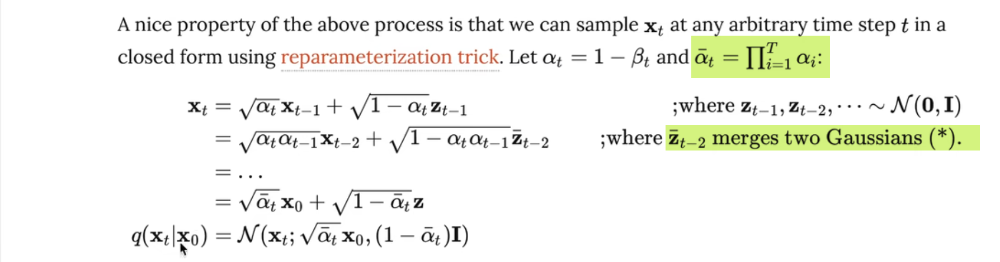

（4）

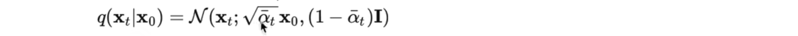

由公式可知，当给定 $x_0$ 的时候，$q(x_t|x_0)$ 的分布其实就是 以 $\sqrt {\bar\alpha_t} x_0$ 为均值，以 $\sqrt{1-\bar \alpha_t }$为方差的高斯分布，这也就是说 在给定 $x_0$ 和 $\beta_t$ 的条件下，可以求出 $q(x_t|x_0)$

（前面我们假设了 $\alpha_t = 1-\beta_t$，所以 $\beta_t$ 已经 就相当于 $\alpha_t$已知，自然的 $\bar \alpha_t$ 已知）

$q(x_t|x_0)=\mathcal{N}(x_t;\sqrt{\bar \alpha_t}x_0,(1-\bar \alpha_t)I)$

也就是 可以以  $\mathcal{N}(x_t;\sqrt{\bar \alpha_t}x_0,(1-\bar \alpha_t)I)$ 这个高斯分布进行采样，而不需要逐步迭代

✅

✅

两种 采样方法

以上就可以确定，T，也就是当加多少步噪声的时候，我们的 $q(x_t|x_0)$ 真的变成一个各项 同性 的 高斯分布了（等价于 各项独立），因为 $\alpha_t$ 是已知的，是我们自己设置的 类似 学习率的常数，因此就能算出来 当 $t=多少$的时候， $\sqrt{\bar \alpha_t}$ 接近于0，$(1-\bar \alpha_t)$ 接近于1，此时 $q(x_t|x_0)$ 就接近于 标准正态分布。以上说明了如何确定 t在什么时候，能够使得 $q(x_t|x_0)$ 接近于 $N(0,1)$

<u>**小小的总结一下：**</u>

(1) 扩散过程是一个完全不含参的扩散过程

(2) 迭代次数 以及 $q(x_t)$ 的计算

只要给定初始分布，任意时刻的 $q(x_t)$ 都可以把采样值 算出来

其中 计算 $q(x_t)$ 不一定是 通过迭代：

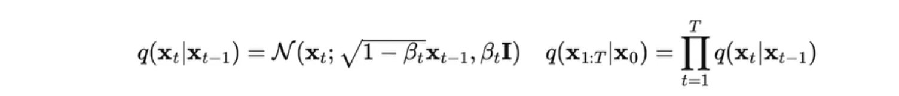

也可以通过直接的计算出来：

这个式子使用的时候需要 预先的知道 $\alpha_t$ 也就是 $\beta_t$

<u>(3)与VAE的区别：</u>

第一点：

VAE从$x$到$z$，首先 不是一个 无参数的 过程，而是 通过 后验网络 预测出来的，其次 VAE的$z$并不是完全的跟$x$无关，Diffusion 经过扩散以后的 $x_t$ 是一个基本各项独立的 高斯分布，基本与 原始的 $x_0$ 无关了

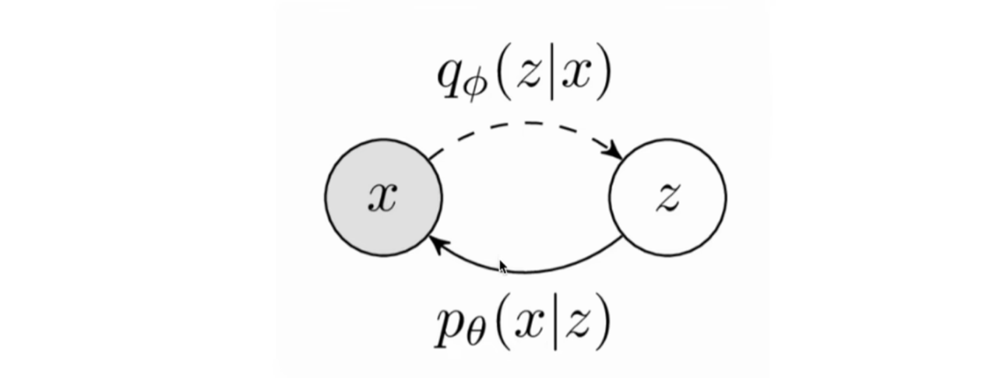

第二点：

$VAE$中，$x$跟$z$的维度不一定是一样的，但是在扩散模型中，从 $x_0$ 到 $x_1$ 到....到 $x_t$ 维度始终是一样的，也就是最后的 $x_T$ 的维度 和 $x_0$ 的维度是一样的，是没有变化的

(4)

$\beta_t$ 怎么样设置？

原文；当分布越来越接近噪声的时候，可以让 $\beta_t$ 更大一点，就是一开始的时候，不要加的太大，一开始的时候  $\beta_t$ 加的的小一点（$\beta_t$ 是控制什么的？），到后面可以越来越大

反过来，从 $x_T$ 生成 $x_0$ ，在一开始的阶段变化并不明显，始终是混乱的一团，但是在最后几步的时候，变化特别明显，最后几步可以很快的显示原始数据分布

接下来，逆过程，也叫 逆扩散过程 或者 重建过程：reverse process

### 五、逆扩散过程

- 扩散过程是对原始数据一步步加噪，使其彻底变成一个高斯分布
- 逆扩散过程：从高斯分布中，恢复原始数据（这也是 DIffusion model的目的：给我们一堆训练集，希望模型能够从噪声预测出训练集的分布，进而生成新的样本）
- 在 加噪的过程中， $\beta_t$ 是比较小的，始终是 0\~1 之间 很小的数，每次加的高斯噪声很小，既然每次加的高斯噪声很小，可以有理由假设 逆过程（从  $x_T$ 逐步恢复 $x_0$ 的过程 ），也可以假设是一个高斯分布，即 $p_{\theta}(x_{t-1}|x_t)$ 也是服从高斯分布
- 但是，我们无法直接拟合  $p_{\theta}(x_{t-1}|x_t)$ 这个高斯分布，如果我们要逐步拟合 $p_{\theta}(x_{t-1}|x_t)$ ，首先需要生成一堆 $x_t$ ，然后逐步做 GMM 的拟合，拟合出 $x_{t-1}$ 之后，还要拟合 $x_{t-2}$ 等等，需要遍历整个数据集 比较麻烦，现在需要构建一个网络，来进行这个估计
- 强调：逆扩散过程仍然是一个马尔科夫链过程：

> 
>
> 现假设 有网络$\theta$，可以构建出条件概率 $p_{\theta}(x_{t-1}|x_t)$ ，假设该条件概率均值为 $\mu_{\theta}$  这个均值与 $x_t$  和 $t$ 有关的，也就是这个网络，以 $x_t$ 和 $t$ 作为输入，这个条件概率的方差 也是含参的 $\sum_{\theta}$ ，也是由 $x_t$ 和 $t$ 共同作为输入的，同样也可以把整个联合概率分布 写成 $p(x_T)$ × 一连串的 条件概率相乘

- 以上是 逆扩散过程，就是从 $x_T$ 逐渐恢复 $x_0$
- 那 $\mu_{\theta}$和 $\sum_{\theta}$ 应该恢复成多少呢？（后面会讨论）

### 六、扩散中的后验条件概率

该部分教案：

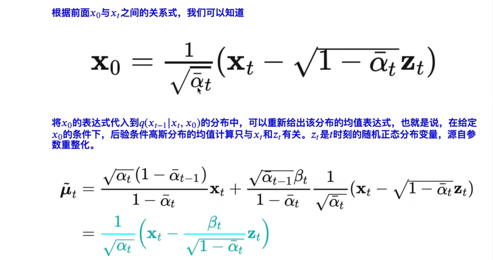

该部分讲解：

这是一个新性质，扩散过程中可以写出后验扩散条件概率

q 是扩散过程中的条件概率分布

如果要写 $q(x_{t-1}|x_t,x_0)$ 的话，这个式子可以用一个公式进行表达

这个就是扩散过程中后验的条件概率：也就是给定 $x_0$ 和 $x_t$，我们就可以计算出 $x_{t-1}$

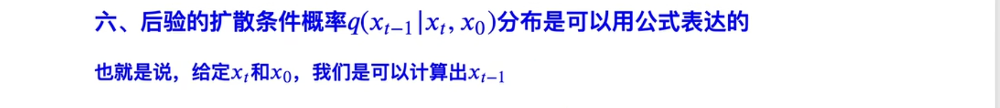

强调：这里是需要给定 $x_0$  的，而不能在给定 $x_{t}$ 就能计算出 $x_{t-1}$ 如果这样的话，也就不需要这个扩散网络了，所以一定是后验的，给定 $x_0$  的情况下，可以算出 $x_{t-1}$  的，给定 $x_t$  和 $x_0$  的情况下，计算出 $x_{t-1}$  的，具体地计算方法就是基于 条件概率 $q$ ，公式：$q(x_{t-1}|x_t,x_0)$

现在假设在 $x_t$    $x_0$ 给定的条件下， $x_{t-1}$ 服从 高斯分布，均值为 $\tilde{\mu}$  ，方差为 $\tilde{\beta_t}$

基于贝叶斯公式：

 **（1）推导第一个等号**

$q(x_{t-1}|x_t,x_0) = q(x_t|x_{t-1,x_0})\frac{q(x_{t-1}|x_0)}{q(x_t|x_0)}$

①

$=\frac{q(x_{t-1},x_t|x_0)}{q(x_t|x_0)}$

$=\frac{q(x_{t-1}|x_0)q(x_t|x_{t-1},x_0)}{q(x_t|x_0)}$

②

$=\frac{q(x_{t-1},x_t,x_0)}{q(x_t,x_0)}$

$=\frac{q(x_0)q(x_{t-1}|x_0)q(x_t|x_{t-1},x_0)}{q(x_t,x_0)}$

$=\frac{q(x_{t-1}|x_0)q(x_t|x_{t-1},x_0)}{\frac{q(x_t,x_0)}{q(x_0)}}$

$=\frac{q(x_{t-1}|x_0)q(x_t|x_{t-1},x_0)}{q(x_t|x_0)}$

证毕

**（2）推导第一个正比于**

$q(x_t|x_{t-1},x_0)$  由马尔科夫假设，$x_t$  与 $x_0$  无关

∴  $q(x_t|x_{t-1},x_0) = q(x_t|x_{t-1})$

由：

所以：$q(x_t|x_{t-1}) = \mathcal{N}(x_t;\sqrt{1-\beta_t}x_{t-1},\beta_tI)$  均值= $\sqrt{1-\beta_t}x_{t-1}$  

$方差 = \beta_tI$

记 $1-\beta_t=\alpha_t$

则

$q(x_t|x_{t-1})\propto \exp(-\frac{(x_t-\sqrt{\alpha_t}x_{t-1})^2}{2\beta_t})$ 

证毕

**（3）推导第二个正比于号**

由：

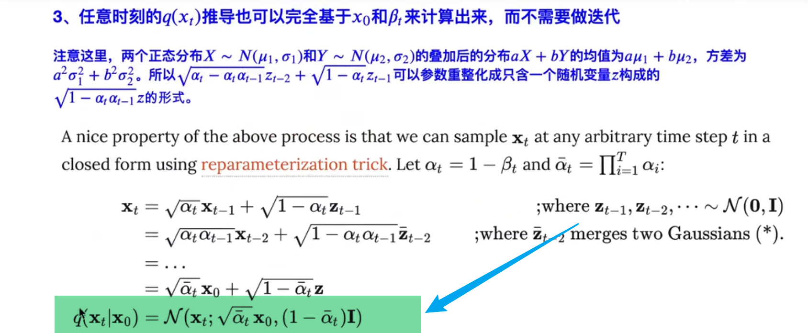

所以 $\frac{q(x_{t-1}|x_0)}{q(x_t|x_0)}$

$q(x_{t-1}|x_0) \sim \mathcal{N}(x_{t-1};\sqrt{\bar{\alpha}_{t-1}}x_0,(1-\bar{\alpha}_{t-1})I)$

$q(x_{t}|x_0) \sim \mathcal{N}(x_{t};\sqrt{\bar{\alpha}_{t}}x_0,(1-\bar{\alpha_{t}})I)$

所以：

$\frac{q(x_{t-1}|x_0)}{q(x_t|x_0)} \propto \exp(-\frac{1}{2}(\frac{(x_{t-1}-\sqrt{\bar{\alpha}_{t-1}}x_0)^2}{1-\bar{\alpha}_{t-1}}-\frac{(x_t-\sqrt{\bar{\alpha}_{t}}x_0)^2}{1-\bar{\alpha_{t}}}))$

**（4）合并正比号**

$q(x_t|x_{t-1})\propto \exp(-\frac{(x_t-\sqrt{\alpha_t}x_{t-1})^2}{2\beta_t})$

$\frac{q(x_{t-1}|x_0)}{q(x_t|x_0)} \propto \exp(-\frac{1}{2}(\frac{(x_{t-1}-\sqrt{\bar{\alpha}_{t-1}}x_0)^2}{1-\bar{\alpha}_{t-1}}-\frac{(x_t-\sqrt{\bar{\alpha}_{t}}x_0)^2}{1-\bar{\alpha_{t}}}))$

$q(x_{t-1}|x_t,x_0) = \frac{q(x_{t-1}|x_0)}{q(x_t|x_0)}$

$\propto \exp(-\frac{1}{2}(\frac{(x_t-\sqrt{\alpha_t}x_{t-1})^2}{\beta_t}+\frac{(x_{t-1}-\sqrt{\bar{\alpha}_{t-1}}x_0)^2}{1-\bar{\alpha}_{t-1}}-\frac{(x_t-\sqrt{\bar{\alpha}_{t}}x_0)^2}{1-\bar{\alpha_{t}}}))$

(忽略系数、只保留指数部分)

化简，以 $x_{t-1}$  为基准进行合并，只摘出 $x_{t-1}^2$  和 $x_{t-1}$ ，其余的 $x_t$  和 $x_0$ 全部归到 $C(x_t,x_0)$ ：

最后完成全部的推导  

解释 $C(x_t,x_0)$ ：

**（5）根据高斯分布的标准形式，得到均值和方差：**

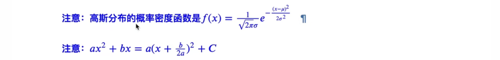

由 $ax^2+bx=a(x+\frac{b}{2a})^2+C$

可以知道 $均值 = -\frac{b}{2a}$

$方差 = \frac{1}{a}$

所以

均值 $\tilde{\mu}$  和 方差  $\tilde\beta_t$    可求

> 经过以上步骤，完成全部这一部分的推导：
>
> 

接下来，继续：

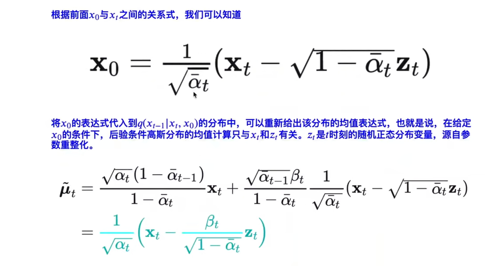

（1）由参数重整化：

移项 可导 $x_0$ 和 $x_t$

$x_0 = \frac{1}{\sqrt{\bar{\alpha}_t}}(x_t-\sqrt{1-\bar{\alpha}_t} z_t)$

(2)

  

最开始的均值表达式：

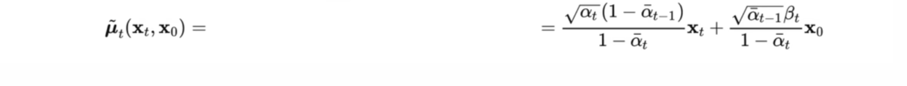

把 $x_0$ 代入

最终得到 $\tilde{\mu}_t = \frac{1}{\alpha_t}(x_t-\frac{\beta_t}{\sqrt{1-\bar{\alpha}_t}}z_t)$

只与 $x_t$ 和 $z_t$ 有关，$z_t$ 表示  $t$时刻 从 正态分布中 的采样值

（3）

经过以上，写出了扩散过程中，后验的条件概率分布的均值和方差都写出来了

方差：

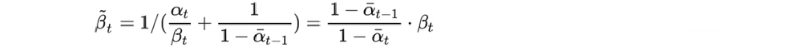

只与 $\alpha$  和 $\beta$ 有关

均值：

与 $x_t$  和 $z_t$  有关

第七部分 ，推导扩散模型，目标数据的似然函数，推导出似然函数，就可以优化网络

### 七、对数似然下界推导

内容：

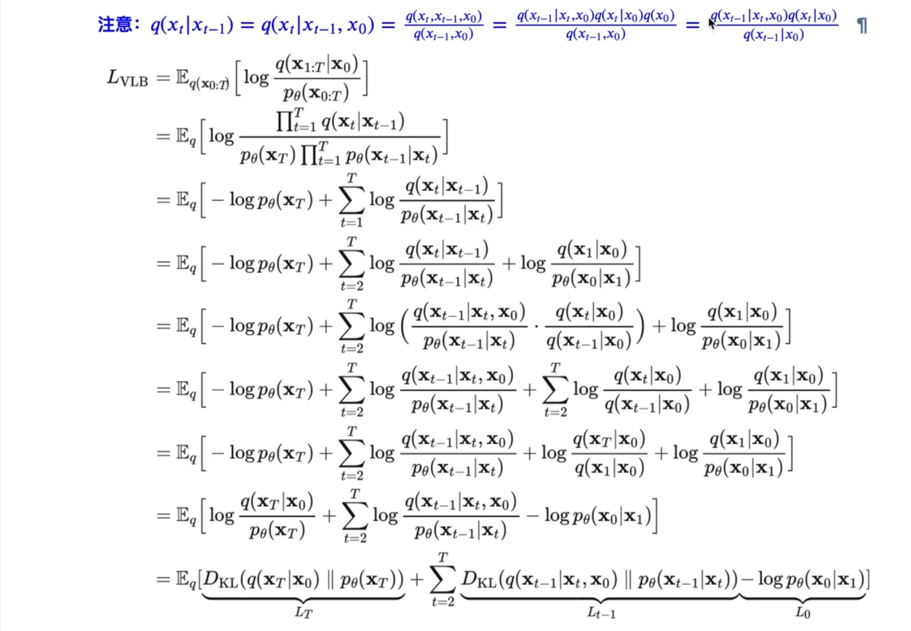

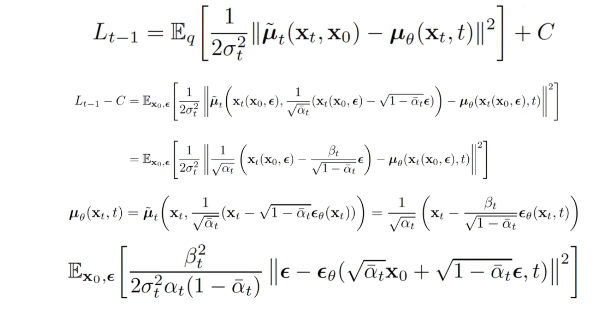

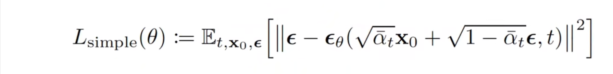

讲解：

（1）

$-logp_{\theta}(x_0) \leq  -logp_{\theta}(x_0) + KL散度$

$KL散度 \geq 0$

所以有 

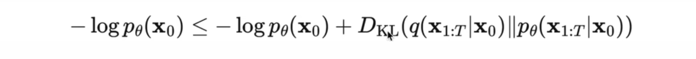

$-logp_{\theta}(x_0) + DL_{KL}$ 是它 $-logp_{\theta}(x_0)$ 的上界

所以 优化 $-logp_{\theta}(x_0) + DL_{KL}$  相当于 优化 $-logp_{\theta}(x_0)$ 

也就是  $-logp_{\theta}(x_0) + DL_{KL}$ 达到最小，就是 $-logp_{\theta}(x_0)$  达到最小

称为 负对数似然 $-logp_{\theta}(x_0)$

> 先验知识：
>
> **KL散度公式：**
>
> 
>
>    $D(p||q) = H(p,q)-H(p) = \sum p_i\log\frac{1}{q_i}-p_i\log\frac{1}{p_i}=\sum p_i\log\frac{p_i}{q_i} = \mathbb{E}_{x \sim p}(log\frac{p}{q})$
>
> 
>
> 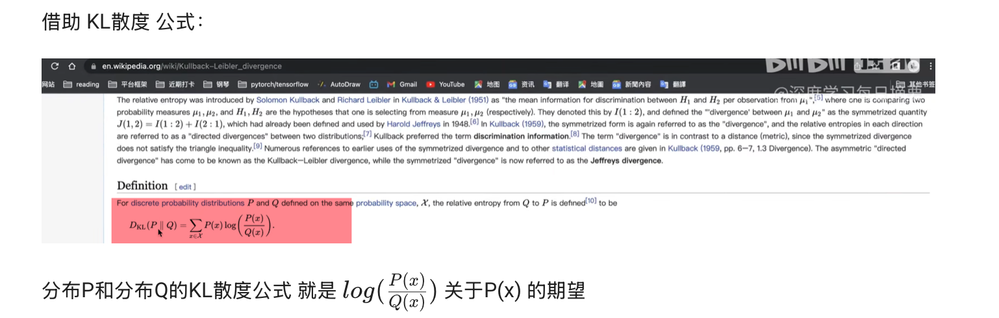
>

继续推公式：

第（1）个 小于等于号：

K1：为 一个 负的 对数似然 凑项

K2：KL散度 大于等于 0 恒成立

第（2）个等于号：

K1：

$KL散度= D(p||q) = H(p,q)-H(p) = \sum p_i\log\frac{1}{q_i}-p_i\log\frac{1}{p_i}=\sum p_i\log\frac{p_i}{q_i} = \mathbb{E}_{x \sim p}(log\frac{p}{q})$

K2：

$-logp_{\theta}(x_0) \leq -logp_{\theta}(x_0) + D_{KL}(q(x_{1:T}|x_0)||p_{\theta}(x_{1:T}|x_0))$

（1）拆出KL散度：$D_{KL}(q(x_{1:T}|x_0)||p_{\theta}(x_{1:T}|x_0))$

$= \mathbb{E}_{x_{1:T} \sim q(x_{1:T}|x_0)}[\log \frac{q(x_{1:T}|x_0)}{p_{\theta}(x_{1:T}|x_0)}]$

（2）

拆出条件概率：$p_{\theta}(x_{1:T}|x_0)$

$=\frac{p_{\theta}(x_{0:T})}{p_{\theta}(x_0)}$

第二个 等于号也 证明出来了

- 后面的等于号 就比较好说了，顺着写
- 关于 第（3）个等于号，有一个细节，因为 $\mathbb{E}_q logp_{\theta}(x_0)$ 中 $p_{\theta}(x_0)$ 与 $q$ 无关，所以可以直接拿出来，并且与前面 消项

继续看

在 推导出 

$-logp_{\theta}(x_0) \leq \mathbb{E}_{{x_{1:T} \sim q(x_{1:T}|x_0)}}[log\frac{q(x_{1:T}|x_0)}{p_{\theta}(x_{0:T})}]$

以后，左右两边 对于$q(x)$ 求期望时，从 $x_0$ 开始：

换句话说：对$q(x_0)$ 求期望

 $-logp_{\theta}(x_0) \leq \mathbb{E}_{{x_{1:T} \sim q(x_{1:T}|x_0)}}[log\frac{q(x_{1:T}|x_0)}{p_{\theta}(x_{0:T})}]$ $\iff$ $-logp_{\theta}(x_0) \leq \mathbb{E}_{ q(x_{1:T})}[log\frac{q(x_{1:T}|x_0)}{p_{\theta}(x_{0:T})}]$

(在于 下标的变化)

∴ $-\mathbb{E}_{q(x_0)}logp_{\theta}(x_0) \leq \mathbb{E}_{{q(x_{0:T})}}[log\frac{q(x_{1:T}|x_0)}{p_{\theta}(x_{0:T})}]$

反过来 就是 讲义上写的了

$\mathbb{E}_{{q(x_{0:T})}}[log\frac{q(x_{1:T}|x_0)}{p_{\theta}(x_{0:T})}]  \geq -\mathbb{E}_{q(x_0)}logp_{\theta}(x_0)$

注意到   $-\mathbb{E}_{q(x_0)}logp_{\theta}(x_0)$  这个东西是交叉熵

所以现在我们最小化  交叉熵 $-\mathbb{E}_{q(x_0)}logp_{\theta}(x_0)$ 就是最小化 交叉熵的上界：$\mathbb{E}_{{q(x_{0:T})}}[log\frac{q(x_{1:T}|x_0)}{p_{\theta}(x_{0:T})}]$ 

总之：$\mathbb{E}_{{q(x_{0:T})}}[log\frac{q(x_{1:T}|x_0)}{p_{\theta}(x_{0:T})}]$  这个式子 就是Loss的上界，最小化了这个上界，就是最小化了Loss，接下来进一步化简上界：$\mathbb{E}_{{q(x_{0:T})}}[log\frac{q(x_{1:T}|x_0)}{p_{\theta}(x_{0:T})}]$

上界记为 VLB（why？）

首先：

$L_{VLB} = \mathbb{E}_{{q(x_{0:T})}}[log\frac{q(x_{1:T}|x_0)}{p_{\theta}(x_{0:T})}]$

接着，把分子分母写成很多条件概率相乘的形式

$=\mathbb{E}\frac{\prod q}{\prod p}$

首先，看分子，分子是

### 八、DIffusion Probabilistic Model 算法代码

扩散与逆扩散过程伪代码

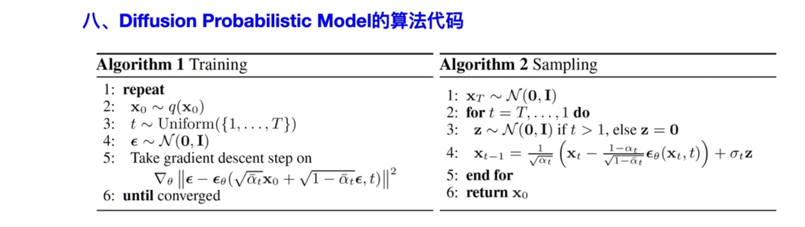

pytorch实现无监督图像生成
