# VDM

ref：[【公式推导】还在头疼Diffusion模型公式吗？Diffusion理论公式喂饭式超详细逐步推导来了！](https://www.bilibili.com/video/BV1Ax4y1v7CY?spm_id_from=333.788.recommend_more_video.1&vd_source=ddd7d236ab3e9b123c4086c415f4939e)

[《Understanding Diffusion Models: A Unified Perspective》](https://arxiv.org/abs/2208.11970)：https://arxiv.org/abs/2208.11970 

[《Denoising Diffusion Probabilistic Models》](https://arxiv.org/abs/2006.11239):https://arxiv.org/abs/2006.11239

- [x] 

- [ ] 

## 1 VAE

### 	1.1 极大似然模型

目的是使得模型学得数据集的分布

给定数据集 $x_D$，通过模型学得 $\phi$参数，得到模型 $p_{\phi}(x_D)$，训练模型最大化 $p_{\phi}(x_D)$，使得 $p_{\phi}(x_D)$ 能够拟合样本 $x'$

得到模型 $p_{\phi}(x_D)$ 以后，还能够进行采样，采样出来的样本可能不在数据集里面，但是采样出来的样本是符合概率分布的值

###  1.2 VAE

- [x] 重点在于理解：VAE就是建立 真实图片 $x$ 与 隐变量高斯分布$z$ 之间的转换，工具是 Encoder和decoder

首先，生成模型必须要有能够采样的能力，而不能只能固定生成一些样本

所以，首先要有一个分布供我采样，有了分布才能采样，VAE就借助了一个非常简单的分布，就是标准高斯分布，用公式表达：以0为均值，$I$ 为方差的一个分布，注意是多维的  $N \sim N(z;\mathrm{0},\mathrm{I})$

VAE的结构首先分为两个部分：Encoder+decoder

<u>文字表达：</u>

**Encoder： **把一些图像通过Encoder变成一些embedding，一般是维度比较低的embedding

**decoder： **decoder被维度比较低的embedding生成一些维度比较高的图片

<u>数学表达：</u>

Encoder：$q(z|x)$ 给定图片 $x$ 能够拿到 $z$，$z$表示标准高斯分布的一个样本

Decoder：$p(x|z)$ 给定标准高斯分布的一个值，通过decoder生成一张图片$x$

VAE的Encoder和decoder就是在 $x$和$z$之间建立起联系

为什么这么做的原因：

> 因为让模型直接学习 $x$的分布比较难，$x$可能并不是常见的分布，所以没有办法采样，但如果把$x$与一个标准高斯分布联系起来，那么每在标准高斯分布上采样一个值，接着通过decoder就能映射成在$x$也就是pixel这个像素空间上，生成一张图片，这样就会有很多样本产生，因为标准高斯分布可以采样出无穷无尽个样本

也就是这句话：

z 表示隐变量，一般采用高斯分布，且一般是多维的，理论上讲可以是任意一个能够进行方便采样的分布，只是因为高斯部分比较简洁，推导也比较简单，所以一般采用高斯分布作为隐变量。

一句话，VAE就是建立 真实图片 $x$ 与 隐变量高斯分布$z$ 之间的转换

### 	1.3 VAE的数学原理

首先，VAE的优化目标，学习到的分布 $p_{\phi}(x)$ 趋近于 真实分布 $p(x)$

首先明确优化目标：  $p_{\phi}(x) \rightarrow p(x)$

那具体怎么实现目标呢？思想就类似于辅助线 & 中间变量，这里借助的中间变量就是 $z$

首先，真实分布 $p(x)$ 一般用对数估计，表示成 $logp(x)$ ，且有下界 $\mathbb{E}_{q_{\phi}(z|x)}[log \frac{p(x,z)}{q_{\phi}(z|x)}]$

以上步骤都很简单，没啥好说的，值得注意的是琴生不等式，也就是把log内移

理解琴生不等式：

文字描述：任意两点的期望 ＞ 期望的函数值

图示：任意两点的连线，永远在曲线上方

函数值的期望 ＞ 期望的函数值（对于凸函数来说：期望>函数值）

而log函数是个凹函数，反过来的，也就是 弦 在 曲线的 下方（也就是 函数值 > 期望）借助脑袋中的图像理解

不用死记硬背，去想图像，画个图即可，也就是看明白了公式，这个公式证明出来有什么用？

### 	1.4	为什么说 优化VAE《==》最大化ELBO？

$ELBO= \mathbb{E}_{q_{\phi}(z|x)}[log \frac{p(x,z)}{q_{\phi}(z|x)}]$

再解释一下：给定数据集 $x$，那么$p(x)$确定，也就是$logp(x)$确定

Encoder的优化目标 $q_{\phi}(z|x)=p(z|x)$  《====》 KL散度=0

那和又是固定的，所以拟合未知但是确定的p(x)，变成了最大化 ELBO

VAE的目的就是学到真实$x$的分布$p(x)$，但是又不好直接学到，所以借助辅助变量z，通过Encoder和decoder间接学到$x$的分布，又推出了下界，下界就是$ELBO$，但是$logP(x)=ELBO+KL散度$，$KL散度$是Encoder的目标，等于$0$最好就是 $q(z|x)$无限接近$p(z|x)$

### 	1.5 拆解ELBO

使用链式法则的原因是因为，我们用的是中间变量$z$

将 ELBO拆成了 `ELBO=重建项-先验匹配项`

$=\mathbb{E}_{q_{\phi}}(z|x)[logp_{\theta}(x|z)]-D_{KL}(q_{\phi}(z|x)||p(z))$

- [x] 首先，为什么叫重建项？

$p(x|z)$ 也就是已知$z$学习$x$，就是$decoder$

decoder的目的就是重建图像$x$，所以叫重建项

- [x] 为什么叫先验匹配项？  $D_{KL}(q_{\phi}(z|x)||p(z))$

$q_{\phi}(z|x)$  $x$到$z$的分布，就是$Encoder$

也就是让Encoder学到的分布接近于$z$，$z$ 是什么？$z$就是我们采样的高斯分布，也就是$p(z)$

我们要让 我们的Encoder编码，把$x$映射到$z$空间上，$z$能满足指定的分布，也就是prior matching

$z$就是prior，也就是Encoder以后的$z$，$z$满足我们自己选的高斯分布，也就是把 我们的 $x$映射到$z$，$z$满足我们自己选的高斯分布，真是因为我们编码后的$z$满足高斯分布，后续我们才可以抛开Encoder，后续直接在decoder上进行采样得到高斯分布值，然后通过decoder得到$x$

> 一句非常重要的话：
>
> Encoder把x映射成z，并且这个z无限接近高斯分布
>
> 所以后需才可以直接丢掉Encoder，直接采样x映射的高斯分布z，直接采样，然后重建x

也就是保证VAE能做生成任务的前提：`把真实分布映射到 高斯分布上`

- [x] 优化VAE，就是优化ELBO，ELBO有两项：重建项+KL散度项

所以，最大化ELBO，就是最大化重建项，也就是最小化先验匹配项

接下来解释，最大化重建项是什么意思？最小化先验匹配项又是什么意思？

- [x] 最大化重建项怎么理解：  $\mathbb{E}_{q_{\phi}}(z|x)[logp_{\theta}(x|z)]$

最大化重建项也是模型decoder出来的$x$，和真实的$x$ 越相近越好，也就是重建误差越小越好，也就是重建出来的概率越大越好，也就是 $p_{\theta}(x|z) \rightarrow 1$ ，也就是  $logp_{\theta}(x|z) \rightarrow 0$

- [x] 最小化 先验匹配项 $D_{KL}(q_{\phi}(z|x)||p(z))$

$q_{\phi}(z|x)$  通过Encoder映射到隐空间之后，尽量满足分布，越接近越好，也就是`最小化KL散度→0`

这项KL散度，相当于训练Encoder的loss，这项loss降到最小，也就是Encoder学到最好

如果`这一项＝0`，也就是完全把真实世界的$x$映射到了标准的正态分布，此时Encoder是学习的非常完美的

也就是`KL=0`

- [x] ADD：如果把后面项去掉，就是只留下 重建项，就变成的AE（AutoEncoder）模型，AutoEncoder没有生成能力，因为没有把原始数据映射到高斯分布上，也就是在生成的时候，没有办法进行采样，也就是没有办法通过decoder得到图像，（没有了采样，就没有了生成）

AE模型没有了采样能力，decoder出来的东西也就不是多样的，不是一个全新的，此时$z$的分布，就是AutoEncoder的z分布是未知的，因为我们没有把$x$强制的归于某个分布，也就是$z$是未知的，此时是没有办法进行有效采样的，也就没有办法生成更多的图片

### 	1.6 VAE的结构

- [x] 描述图片

首先有一张训练集图片x，通过Encoder，Encoder就是会把训练的x映射到z上面，z所在的是一个隐空间，隐空间怎么表达呢？因为我们就是要把x映射到正态分布空间上，正态分布是通过均值和方差描述的，也就是会得到一个均值向量 $\mu_{\phi}(x)$ 和一个方差向量  $\sigma^2_{\phi}(x)$ ，因为我们使用的是标准高斯分布，所以我们优化的目标就是 $\mu_{\phi}(x) → 0$ 和 $\sigma^2_{\phi}(x) → \mathrm{1}$ `全0向量` 和 `全1向量`

上面描述的过程 也就是 公式中的 先验匹配项，也就是第二项

接下来：

我们得到了尽可能得`全0向量` $\mu_{\phi}(x)$  、`全1向量` $\sigma^2_{\phi}(x)$ ，

$z'$是根据Encoder得到的 $\mu$ 和$\sigma$ 重参数化得到的 $z'$

正式采样的时候，不需要Encoder，而是直接从 "标准"正态分布$z'$采样出来的，然后通过decoder得到一张新的图片

> 注意：
>
> Encoder出来的$z$，就是$z'$是希望尽可能为标准正态分布的

### 	1.7 参数重整化

- [x] 为什么？重参数化技巧

如果不进行参数重整化的话，$z'$是根据均值和方差采样出来的，但是我们的均值 $\mu_{\phi}(x)$ 和方差 $\sigma^2_{\phi}(x)$ 里面都是包含参数的`《====》`也就是我们采样的随机噪声里面是包含参数的`《=====》` 随机过程中包含了待优化的参数 $\phi$ 此时，对参数的 $\phi$ 是不可导的`《=====》` 因为这是一个随机过程，随机过程中包含参数，怎么求这个参数的导数呢？`《=====》`鉴于此，引入了重参数化技巧。让这个过程变得可导

- [x] 什么是？重参数化技巧

首先，重参数化技巧是在一个标准正态分布里面，先随机取一个值，也就是 $\epsilon \sim N(\epsilon;0,I)$

也就是采样出来的 `单位噪声 × 方差 + 均值`  等价于 从  $\mu_{\phi}(x)$  和 $\sigma^2_{\phi}(x)$ 中直接采样

也就是说这样采样出来的参数，均值也等于 $\mu_{\phi}(x)$ ，方差也等于 $\sigma^2_{\phi}(x)$

- [x] `单位噪声 × 方差 + 均值`  等价于 从  $\mu_{\phi}(x)$  和 $\sigma^2_{\phi}(x)$ 中直接采样 ||好处是是什么？

首先，我们的随机过程是在一个没有参数的噪声中采样的，也就是说这个随机过程是不包含参数的，那后面对参数 $\phi$ 优化的时候，就可以直接求导了，因为这个参数是 剥离出这个随机过程的，以上就是重参数化的过程；

总之重参数化过程 保证了 采样的分布没有变，然后又让所有参数是可导的，而没有在一个随机的过程中，这样模型才能训练，也就是重参数化技巧的好处

### 	1.8 VAE模型小结

首先是 模型的整体架构，并包含了 重参数化技巧

第二点，优化VAE 等价于 优化 ELBO，更具体来说就是 最大化 ELBO

第三点，继续拆解ELBO，ELBO包含两部分（1）重建项（2）先验匹配项

（1）重建项：反映的是decoder从隐变量重建图片的能力

（2）先验匹配项：反映的是Encoder将图片映射到指定隐变量分布的能力，也就是把图片映射到标准正态分布的能力

第四点，重参数化技巧的好处

第五点，生成的时候就不需要Encoder了，每次只需要在Encoder出来的变量采样一个z，这样就可以通过decoder生成一张新的图片了，以上是一个VAE的过程

## 	2 MHVAE的推导

中文：马尔科夫链的级联的VAE（级联马尔科夫链VAE）

- 实际上就是把很多VAE堆叠起来，而且每一个状态值依赖前一个和它相邻的前一个状态，而与之前的更长更远的状态是无关的，也就是马尔科夫链
- 公式推导的变化：

（1）公式推导的原理是一模一样的

（2）区别在于，之前单个VAE只需要一个辅助变量$z$，现在级联马尔科夫VAE，有多个辅助变量$z$，所以从$z→z_{1:T}$

## 	3 VDM理论推导

中文翻译：Variational Diffusion Models 变分扩散模型

区分：（ **Denoising Diffusion Probabilistic Models**，DDPM）去噪概率扩散模型

从 级联马尔科夫VAE $MHVAE$  →  $VDM$

MHVAE+3个限制条件 就会变成 VDM

<u>限制1：数据$x$和所有的隐变量$z_t$维度相同</u>

之前的VAE，$x$和$z$的维度可以是不同，且一般也是不同的

但如果是 $VDM$的话，映射的维度就是相同的，也就是$x$和所有的隐变量$z$的维度都是相同的

<u>限制2：所以Encoder的过程是不需要学习的</u>

也就是从 $z_1 → z_2$ 、从 $z_2$ 到 $z_3$ 、从 $z_3$到$z_4$ 、从$z_{t-1}$到$z_t$ 是不需要学习的，是人为预定义好的，是一个高斯分布的，也就是说 每下一个状态 都是以 上一个状态为均值的高斯分布  $q(z_t|z_{t-1})$，这个均值和方差都可以定义好，当然也可以设置为需要学习的，但是论文中设置的是先预定义好的

<u>限制3：最后的 $z_t$是满足标准的高斯分布的</u>

类比VAE最后也是要拟合一个标准 高斯分布

但 VAE中的Encoder过程是学习到的，学习目标就是将原始图像 $x$ 变成一个标准高斯分布 $z$

但现在是人工定义的Encoder的过程，这就要求我们自己定义的这个过程 满足 $z_t$ 为标准高斯分布

也就是Encoder映射$x$到$z_t$的过程本来是通过学习使其能够映射到一个标准高斯分布，而现在是通过认为定义让它去映射到一个高斯分布，所以要求，我们定义的高斯分布$q$，一定要使得最后的 $z_t$ 是标准高斯分布，也就满足了之前VAE推导的过程

`总结：MHVAE+3个限制=VDM`

### 	3.1 限制是怎么加的？

- 限制1和限制2，要求维度相同，实际上主要在限制2，限制1要求维度相同，限制1是限制2的前提，因为如果限制1都不满足，也就是维度都不相同的话，那么是没有办法直接以前一状态（乘以某个系数）为均值的，因为维度都不相同，是不可以直接以前一状态为均值的，因此，首先第一点，限制1和限制2要一起看
- 因此，具体地做法是：人为的定义一个高斯分布，做Encoder，在文章中的定义是：

$q(x_{t}|x_{t-1}) \sim N(x_t;\sqrt{\alpha_t}x_{t-1},(1-\alpha_t)t)$

读：已知 $x_{t-1}$  的前提下，$x_t$ 服从 均值为  $\sqrt{\alpha_t}x_{t-1}$ 方差为 $(1-\alpha_t)t$  的高斯分布

**<u>为什么是这样定义的呢？怎么理解？</u>**

- 首先，$\sqrt{\alpha_t}x_{t-1} → 0、(1-\alpha_t)t → 1$  也就是说 $\alpha_t → 0$
- 其次，要知道 原始图片随着t的增大，所含的信息浓度就会降低，因为一直在×  $\sqrt{\alpha_t}$ ，并且  $\alpha_t ＜ 1$ 
- 所以，也就是说，如果初始值是 $x_0$ 的话， 随着 $t$ 越大，$x_t$ 所包含的信息就会越少，噪声就会越多，因为Encoder就是在每一步都会加一些噪声，所以噪声会越来越大，最后加了很多步，直到 $x_t$，基本上近似趋近于 一个 高斯分布。当然 不可能 完全 等于 一个 高斯分布，只需要近似接近即可 高斯分布即可

> 这里的信息指的是确定性信息，随着t变大，确定性信息越少

-  $\alpha$是什么呢？ $\alpha$  是一个超参数，是人为定义的，类似于学习率，可以人为定义一个公式，与t有关的公式，或者通过学习得到，总之定义出来的 $\alpha_t$要满足 $x_t$  无限接近于 高斯分布，一般是认为定义公式，当一个超参数
- 限制3，最后一个时刻 $x_t$要满足高斯分布，数学表达就是 $p(x_t)\sim N(x_T;\mathrm{0,I})$

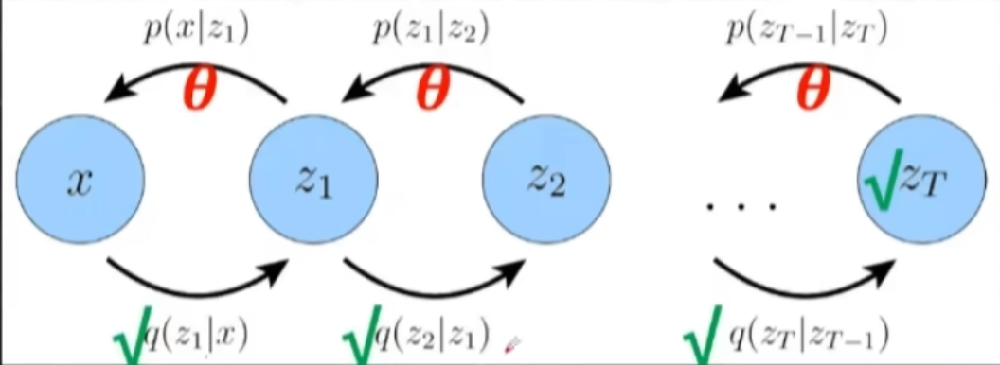

- 以上是VDM的图示
- 如果只是MHVAE的话，每一个p和q都是要学习的，现在VDM的话，只有p是要学习的，通过 $\theta$ 来拟合，但是 $q$ （q表示从上一个状态到下一个状态）每一个状态都是已知的（递推已知），都是人为定义的，包括 $z_t$  也是已知的，并且满足 标准高斯分布，因此 VDM要学习的只是 上面一部分 p 过程，降低模型学习难度

### 	3.2 VDM的ELBO推导

- VAE → MHVAE → VDM 推导都是很类似的，区别就是一些符号的细节

- 具体来说，之前用x 表示第一个状态，现在用 $x_0$ 表示第一个状态
- 之前用 $z_{1:T}$ 表示一些隐变量，现在VDM中维度都一样，所以直接作用 $x_{1:T}$ 来表示 $z_{1:T}$ 
- 也就是 红字标出的 $x$ 替换成 $x_0$，$z_t$ 换成 $x_t$
- 经过以上符号的替换，可以看到 $VDM$ 中，是没有 $z$ 这个变量了，全是 $x_0$ 到 $x_T$了，推导就是一模一样的，就是把符号变一下
- 最后可以证明出来 $ELBO$

### 	3.3  ELBO的拆解

继续沿用之前的研究步骤，拆解VDM的ELBO，观察与VAE的拆解有什么不同

$VAE的ELBO拆解=重建项-KL散度（先验匹配项）$

- 马尔科夫性质：**只** 与前一个状态有关
- p过程是后向 decoder过程，所以是以 $x_t$ 为条件
- q过程是前向 Encoder过程，所以是以 $x_{t-1}$ 为条件

继续推导：

- 着重理解 什么叫 删掉无关变量

就看绿框部分 `删掉无关变量` 这一行

对什么求期望？对 $x_t$求期望，同时也需要知道 $x_{t+1}$ 和 $x_{t-1}$ 的状态下，对 $x_t$ 求期望，所涉及的变量 就是 $x_{t-1}$ 、$x_{t+1}$

而前面的分布是 $q(x_{1:T}|x_0)$ 有很多无关变量，因此可以直接划掉，只保留 与 $x_{t}、x_{t-1}、x_{t+1}$有关的部分

因为我们只关心 要求期望里面 有关 变量的 分布即可，与  那些无关 变量的分布是 没有关系的

因此，我们要做的就是把 括号里面 无关的变量删掉，实际上就是什么分布求期望，与什么变量有关，就保留分布中的变量即可

蓝色框同理

期望里面只与 $x_T$ 和 $x_{T-1}$有关，期望下标就只保留 $x_{T}$ 和 $x_{T-1}$ 有关的分布即可，删掉无关变量即无关的分布

**<u>最后一步的推导，先看蓝色框部分：</u>**

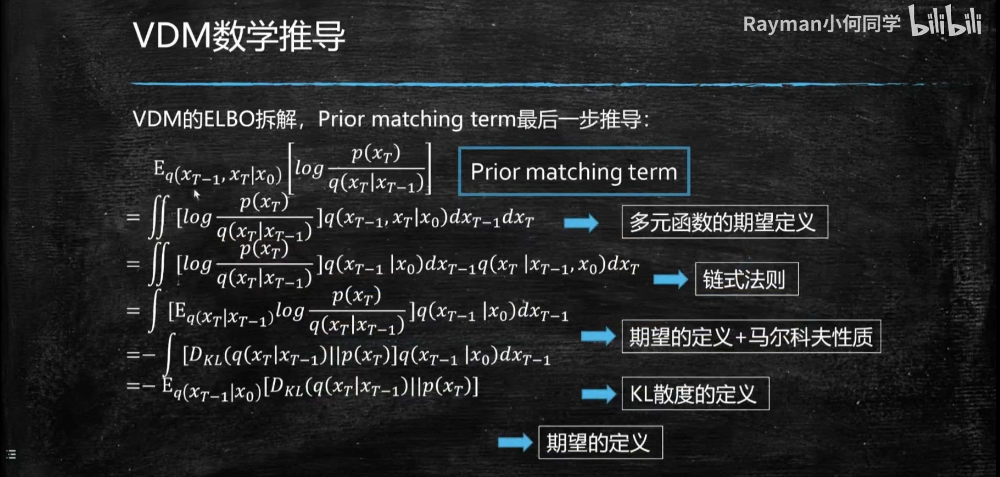

- 首先求期望，并且是对两个变量求期望，所以用多元函数期望的定义
- 由马尔科夫性质：$q(x_T|x_{T-1},x_0)$  可以划掉 $x_0$ 变成 $q(x_T|x_{T-1})$ ，但是 $q(x_{T-1}|x_0)$划不掉
- 拽出 $x_T$，$dx_{T}$ 积分号，要积分的分布，和要积分的函数，构成一个期望

- 接着 就变成了一个 KL散度 $KL(A||B)=\int P(A)\log\frac{P(A)}{P(B)}?$这公式真记不住

Okay,蓝色框推导完了

推导绿色框

- 一个积分变量+一个积分号 → 1元期望
- 2个积分变量+2个积分号 → 2元期望
- 有一步：由马尔科夫性质 $q(x_t|x_{t-1},x_{t+1},x_0)$ 只留下 $q(x_t|x_{t-1})$

- $dx$ 读成积分符号

ELBO拆解的证明，现在看每一项具体地含义

### 	3.4 ELBO拆解出来的含义

**首先，第一项：$\mathbb{E}_{q(x_1|x_0)}[\log p_{\theta}(x_0|x_1)]$**

重建项

- 把$x_0$看做之前 VAE的$x$ 
- $x_1$ 看做之前的 $z$

就是之前的decoderye也就是（重建项，reconstruction term）

接着，第二项：$\mathbb{E}_{q(x_{T-1}|x_0)}[D_{KL}(q(x_T|x_{T-1})||p(x_T))]$

- $x_{T-1}$ 看成 $x$
- $x_T$ 看成之前的 $z$

也就是先验匹配项，Encoder，（prior matching term）

这两项与VAE中一模一样，多了最后一项：

最后，第三项 $\sum_{t=1}^{T-1} \mathbb{E}_{q(x_{t-1},x_{t+1 }|x_0)}[D_{KL}(q(x_t|x_{t-1})||p_{\theta}(x_t|x_{t+1}))]$

- 叫做 consistency term
- 第三项前面是有一个 求和符号的，而前面两项是没有求和符号的，前面两项都是只有一项，这里有求和号，并且有 $T-1$ 项
- 因为有这个求和项，所以第三项在整个 loss function 里面，占得权重是比较大的
- 所以在优化 Diffusion 时，第三项，consistency term 是占主导的项

### 	3.5 ELBO 拆解项图示

- 借用 MHVAE 的图，来可视化
- 首先，reconstruction term 表示从 x1 到 x0 的分布，在图上就是：

- 其次，prior matching term，箭头来说就是最后一项，表示 $x_{T-1}$ 到 $x_T$的分布：

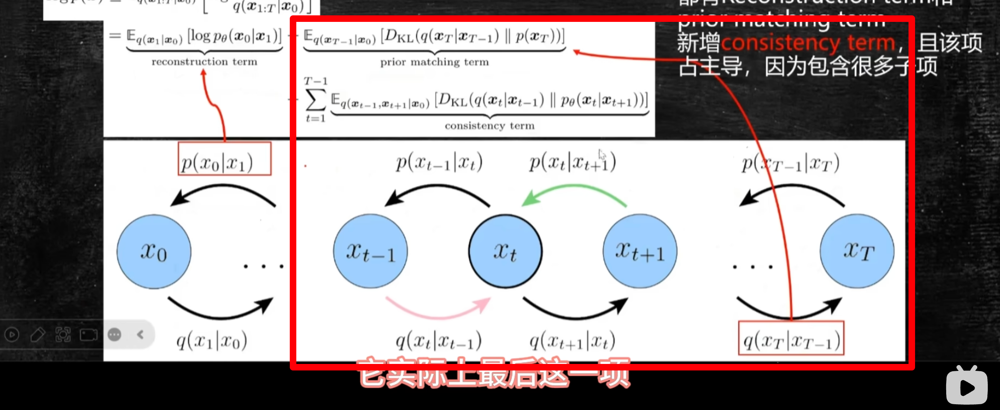

- 而最后的 consistency term 就是剩下的所有箭头

具体来说，

- $q(x_t|x_{t-1})$ 就是粉红色的箭头
- 对 $p_{\theta}(x_t|x_{t+1})$ 的 KL 散度
- 而，$p_{\theta}(x_t|x_{t+1})$ 就是绿色的箭头
- 表示的是 两个箭头得到的 $x_t$ 之间的 `KL 散度`
- 然后，这两组箭头看做一个整体，向右或者向左移，因为一共有大 T 个状态，所以整体上就是 $T-1$ 个求和

以上是三个 loss 在 MHVAE 中直观地表达

### 	3.6 consistency term：去噪方向预估

说明第三项  

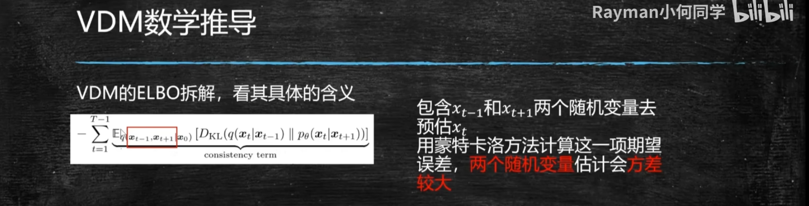

$consistency\_term  = \sum_{t=1}^{T-1} \mathbb{E}_{q(x_{t-1},x_{t+1}|x_0)}[D_{KL}(q(x_t|x_{t-1})||p_{\theta}(x_t|x_{t+1}))]$

> 这个表达是有问题的。
>
> 这个 consistency term 是一个求和项，有很多项
>
> 且在模型优化过程中占主导
>
> 但是这一项里面有问题，具体来说，这一项是通过两个随机变量得到的
>
> 也就是说 $x_t$ 是通过两个随机变量 $x_{t-1}$ 和 $x_{t+1}$ 来预估
>
> $\mathbb{E}_{q(x_{t-1},x_{t+1}|x_0)}$ 求期望是对两个变量 $x_{t-1}$和 $x_{t+1}$，对两个多元变量对应的多元分布求得期望
>
> 又因为，要通过 $x_{t-1}$ 和 $x_{t+1}$ 来预估 $x_t$
>
> 而在实际训练过程中并不是直接求得期望的，而是通过蒙特卡洛的方法，蒙特卡洛就是用很多样例的平均等于期望，在计算这项期望的时候，因为有两个随机变量估计 $x_t$，此时得到的 $x_t$ 的方差是比较大的
>
> 因为两个变量本身是有方差的，用两个具有方差的变量去预估另一个变量，方差是会累积的，就会导致这个 loss（第三项，consistency term）不太准了

- [x] 接下来，讨论能不能降低这个方差

具体来说，就是把 2 个随机变量变成 1 个

分析思路：既然都是要求 $x_t$ ，思考把 $x_{t-1}$ 到 $x_t$ <u>变成</u> $x_{t+1}$ 到 $x_t$，记住贝叶斯公式

仔细看 ppt 上的贝叶斯公式，在不看 $x_0$的情况下，余下的部分就是标准的贝叶斯公式

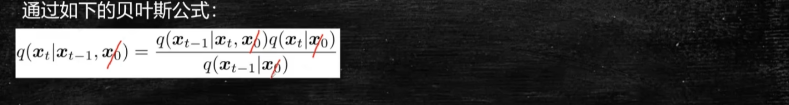

- [x] 接下来讨论，如何通过贝叶斯公式，把第三项变成只有一个随机变量，来预估 $x_t$

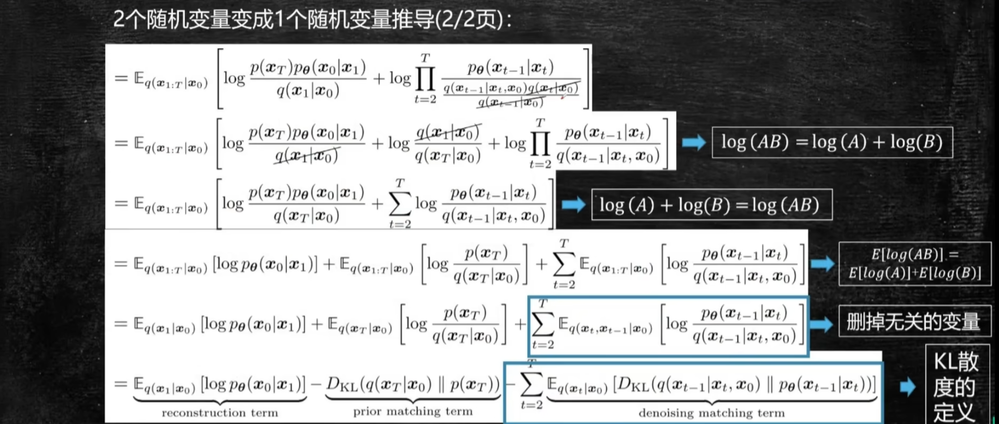

（1）看第一个划掉的，拿出来：

$\log \prod_{t=2}^T\frac{1}{\frac{q(x_t|x_0)}{q(x_{t-1}|x_0)}}$

$=\log \prod_{t=2}^{T}\frac{q(x_{t-1}|x_0)}{q(x_t|x_0)}$

$=\sum_{t=2}^T (\log q(x_{t-1}|x_0) - \log q(x_t|x_0))$

$=\sum_{t=2}^T \log q(x_{t-1}|x_0) - \sum_{t=2}^T \log q(x_t|x_0)$

$=\sum_{t=1}^{T-1} \log q(x_{t}|x_0) - \sum_{t=2}^T \log q(x_t|x_0)$

$=\log q(x_1|x_0) - \log q(x_T|x_0)$

$=\log \frac{q(x_1|x_0)}{q(x_T|x_0)}$

（2）`denoising matching term` 的推导

- 这个过程和前面 prior matching term 的推导是一样的
- 具体来说：要求期望，用定义展开，变成积分的形式
- 因为是对两个变量的分布求期望，所以是两个积分符号 $dx_t$ 和 $dx_{t-1}$，表示对两个变量求积分
- 接着链式法则，拆 $q(x_t,x_{t-1}|x_0)$ 拆成 $=q(x_t|x_0)q(x_{t-1}|x_t,x_0)$
- 链接法则以后，合并，出现一个期望：

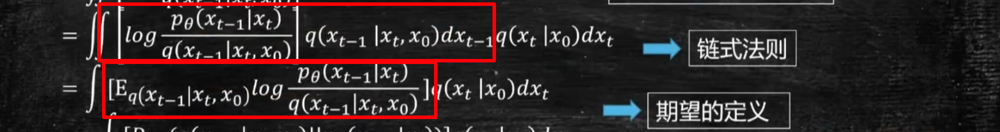

也就是 KL 散度（注意是负的）

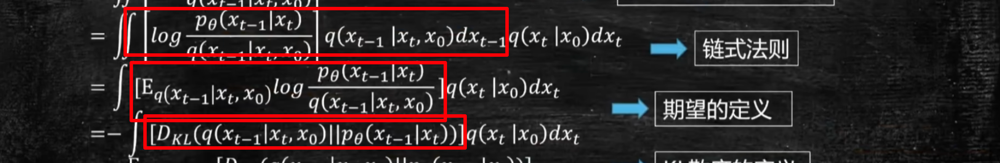

- 最后就是对 KL 散度求期望，得到最后：

`分布、函数、积分号、积分符号都有 → 期望`

- [x] KL 散度的文字描述：

> 一个分布除以另一个分布的 log，然后对分子的分布求一个期望

- [x] 期望的描述

> 有一个 $dx_t$，又有 $x_t$的分布，又有积分号 $\int$，这三项提出来就是对 $q(x_t)$ 求期望，剩下的部分照抄

### 	3.7 VDM 的E LBO 拆解2

最后得到的表达式：

- 观察第三项，此时对于 $x_{t-1}$不需要既知道前一个状态又知道后一个状态，如果要预估 $x_{t-1}$，只需要知道 $x_t$ 即可
- 这样就把之前需要两个变量预估第三项（denosing matching term）表达式 变成了 一个变量 就是 由 $x_t$ 得到 $x_{t-1}$ ，因此减小了这项误差
- 值得注意的是，之前第三项叫做 `consistency term`，理解就是一致性，前向过程和后向过程得到 $x_t$ ，也就是 前向和后向的一致性，所以叫做 `consistency term`
- 而现在，是一个方向的，就是去噪的方向，也就是从 $x_t$ 到 $x_0$的方向，所以把这项命名成 `denoising matching term`
- 其实是一个东西，只是通过推导，使用一个方向的预估，可以使得 方差变小，预估更准确

### 	3.8 VDM 的 ELBO 拆解&VAE 的ELBO 拆解

对比 VAE 的 ELBO 拆解

（1）VAE 的 ELBO 拆解

（2）VDM 的 ELBO 拆解

① 可以看到前两项是一样的，都有 reconstruction term 和 prior matching term

② 相比于 VAE，VDM 多了最后两项，denoising matching term，而且对于这个求和项，如果 $T=1$ 的话，这项就是等于 $0$ 的，因为 $t$ 是从 $2$ 开始的，所以 $T=1$，这项就是没有的

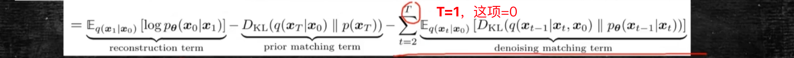

此时 `VAE 的 ELBO 拆解=VDM 的 ELBO 拆解`

当然啦，要注意符号的对应呦~

 $VDM ：x_0 → VAE：x$

$VDM ：x_1 → VAE：z$

这也说明了，VAE 和 VDM（Diffusion model）底层的 loss 表达是一致的，理论基础的一脉相承的

### 	3.9 VDM 的 ELBO 优化

（1）第一项：reconstruction term  $\mathbb{E}_{\log p_{\theta}(x_0|x_1)}[\log p_{\theta}(x_0|x_1)]$

只有 1 项，并不是优化的重点

（2）第二项：prior matching term  $D_{KL}(q(x_T|x_0)||p(x_T))$

$q(x_T|x_0)$  因为从 $x_0$ 到 $x_T$ 是我们人为定义的，是没有任何模型参数的

$p(x_T)$ 是定义的一个高斯正态分布

因此，这个 KL 散度是已知的，没有任何参数可以优化的

（3）重点优化第三项，有求和号  （去噪项）

$\sum_{t=2}^{T}\mathbb{E}_{q(x_t|x_0)}[D_{KL}(q(x_{t-1}|x_t,x_0)||p_{\theta}(x_{t-1}|x_t))]$

- 首先需要知道 $q(x_{t-1}|x_t,x_0)$ 的分布是什么样的，需要知道它的真实分布，然后才能去拟合，通过 $x_t$ 预测 $x_{t-1}$
- VDM 这个模型就是要根据 $x_t$ 得到 $x_{t-1}$

> 其实 q 是加噪过程，p 是从 $x_0$ 到 $x_T$ 的，但是经过转换这里的 q 从 $x_t$ 到 $x_0$

### 	3.10 $q(x_{t-1}|x_t,x_0)$ 的 ground truth

思路：已知 $q(x_t|x_{t-1})$ 的分布是已知的，现在要求 $q(x_{t-1}|x_t)$ 的分布，方法就是借助贝叶斯公式

- ppt 上写的，可以先不用看 $x_0$，余下的部分就是标准的贝叶斯公式
- 重参数化技巧：$x_t = 均值 + 标准差×标准高斯分布$
- 观察贝叶斯公式：

> $q(x_{t-1}|x_t,x_0) = \frac{q(x_t|x_{t-1},x_0)q(x_{t-1}|x_0)}{q(x_t|x_0}$
>
> - for  $q(x_t|x_{t-1},x_0)$ 是满足与 $x_{t-1}$有关的高斯分布，也就是可以通过 $x_{t-1}$ 可以得到 $x_t$
>
> - （for $q(x_t|x_0)$）现在要通过 $x_0$ 得到 $x_{t-1}$ 和 $x_t$，方法：借助重参数化公式，递推，具体的步骤：
>
> 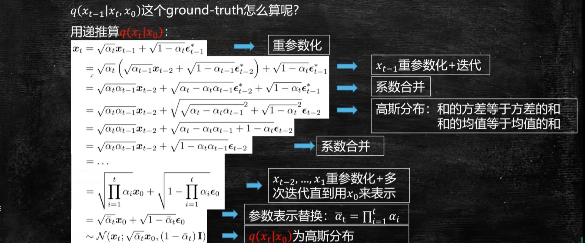
>
> 说明
>
> （1）不管是 $\epsilon_{t-1}^*$、$\epsilon_{t-2}^*$、$\epsilon_{t-2}$ $\sim N(0,1)$ ，都是标准高斯分布的随机噪声，只是表示符号不同
>
> （2）重点说下：
>
> 
>
> 这里用的知识点：两个高斯分布的和 还是 高斯分布，且均值和方差的公式有
>
> $a\epsilon_{t-2}^*+b\epsilon_{t-1}^* \sim N(0,a^2+b^2)$
>
> 还有，$任意正态分布 = \sigma N(0,1) + \mu$
>
> 所以有上图
>
> (3)最后递推得到：$x_t = \sqrt{\bar \alpha_t}x_0 + \sqrt{1-\bar \alpha_t} \epsilon_0$
>
> 其中，$x_0$为已知，$\epsilon_0 \sim N(0,1)$
>
> 以上得到了 $q(x_t|x_0)$  也就是已知 $x_0$  得到 $x_t$
>
> - for $q(x_{t-1}|x_0)$  只需要把 上面得到 $q(x_t|x_0)$相关的，t 都换成 $t-1$ 即可
>
> 如图：
>
> 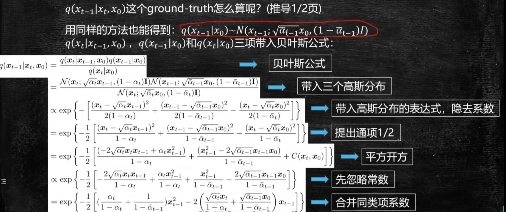
>
> -  以上，就得到了三项的表达式
> - 接下来，把得到的表达式，代入到公式中，也就是两个分布相乘 除以 另外两个分布
> - 省略系数
> - 把 $x_{t-1}$视为未知数，合并同类项，因为要求的就是 $x_{t-1}$的分布。别忘了是在利用贝叶斯公式 求 $q(x_{t-1}|x_t)$
>
> 
>
> 合并 x_{t-1} 的平方项、一次项、常数项，得到最后的表达式
>
> - 忽略常数项 或者 系数 都是加了 `正比` 符号
>
> 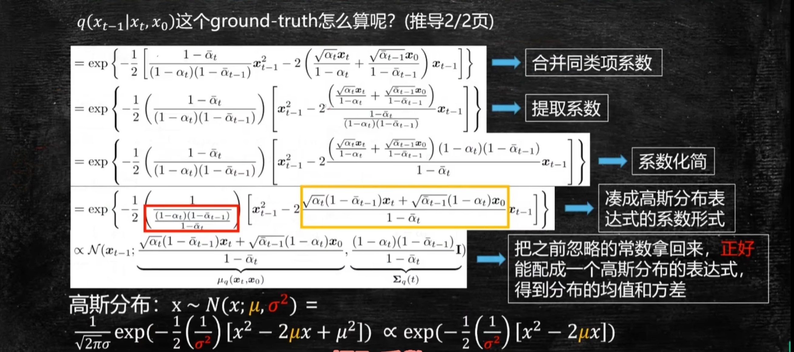
>
> 注意看箭头指向&对应关系：
>
> 
>
> 得到了 以红框为方差，黄框为均值的 高斯分布，也就是推出了 $q(x_t|x_{t-1})$
>
> 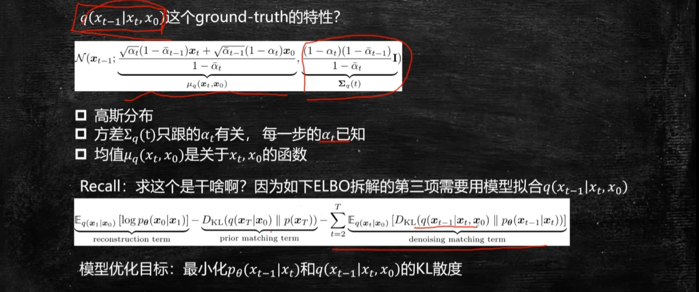

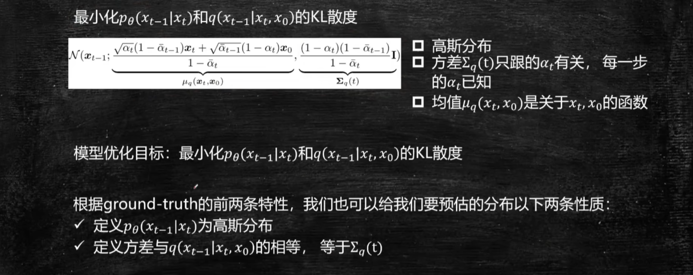

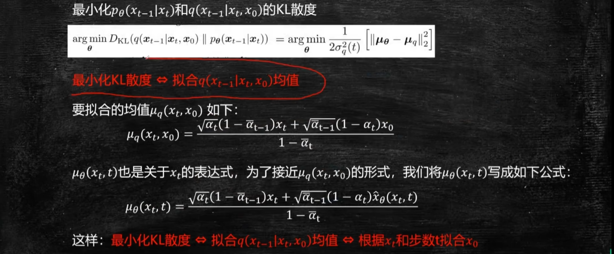

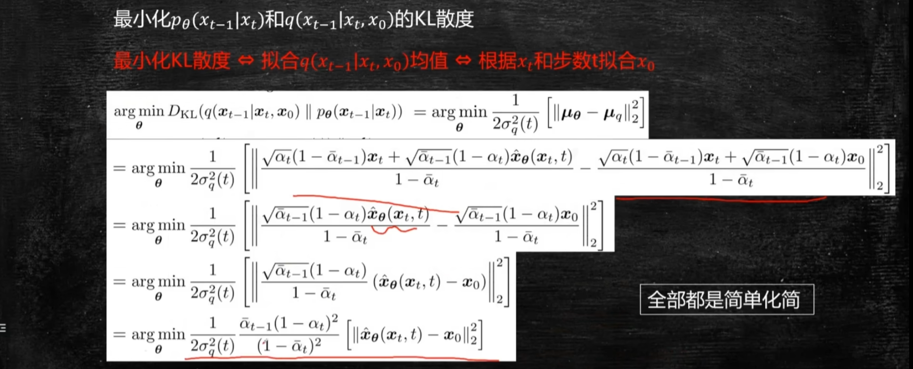

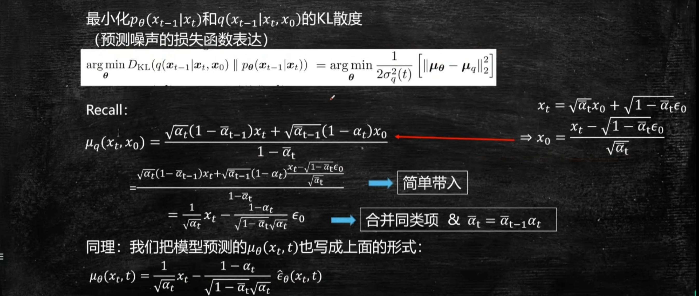

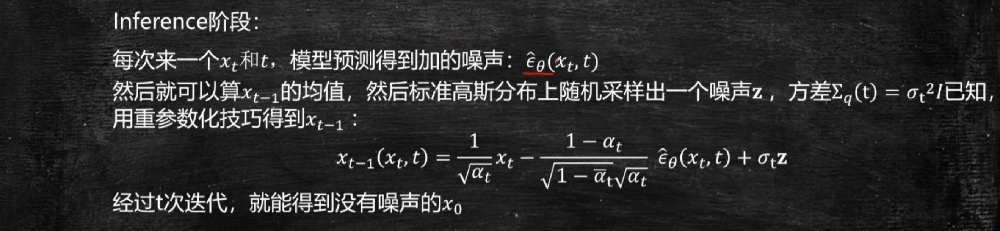

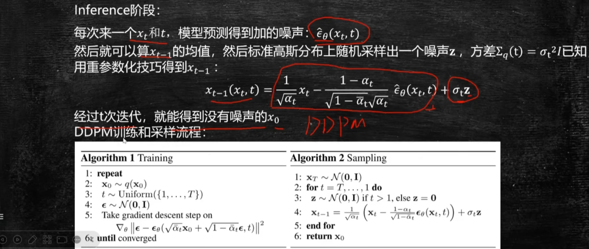

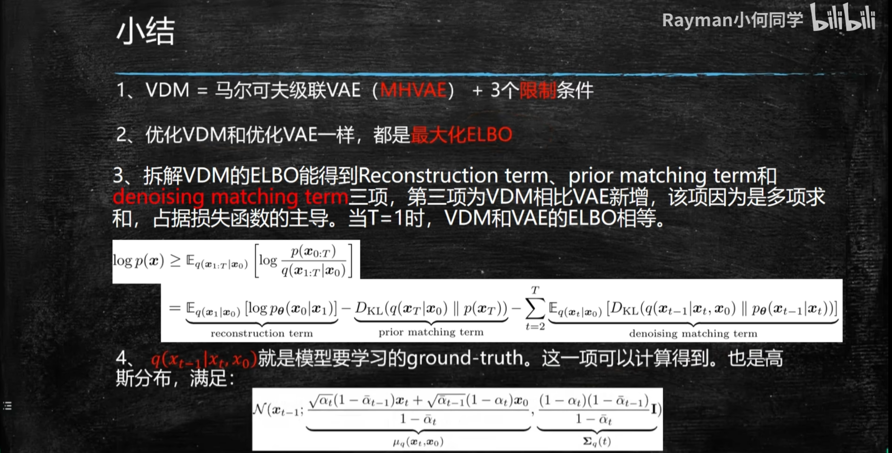

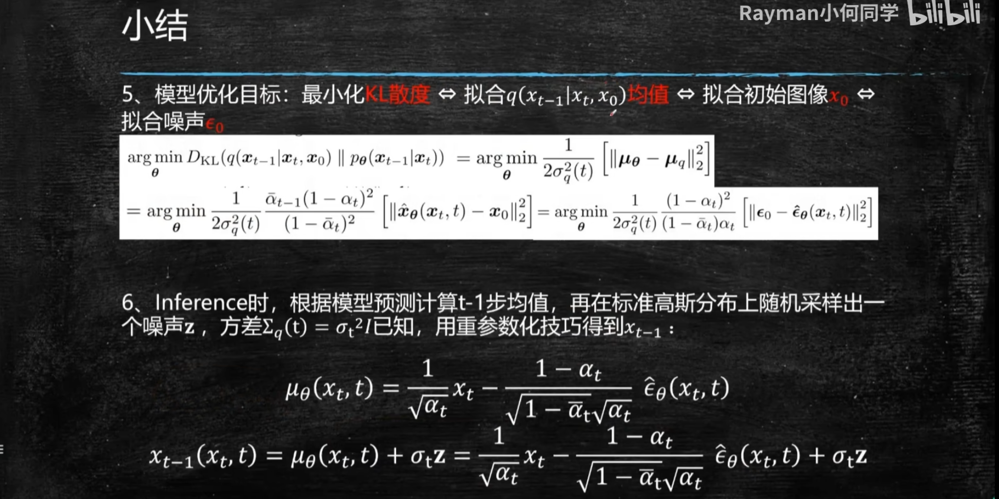

用的基础知识：

- 期望的定义
- KL 散度的公式
- 贝叶斯公式

