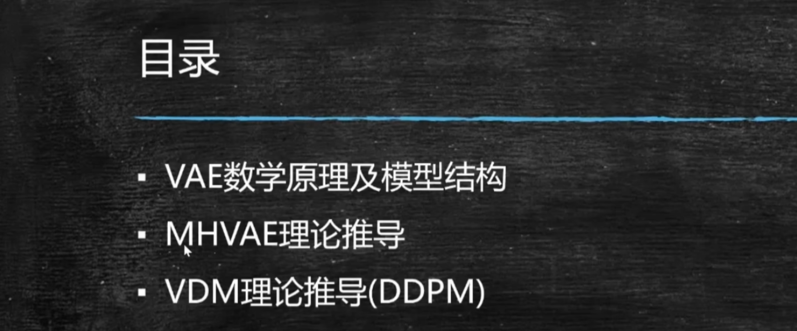
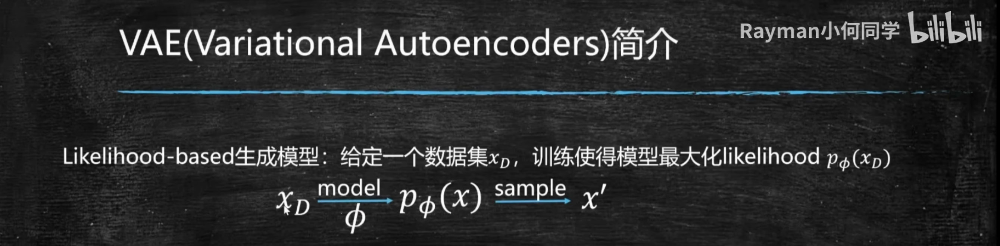
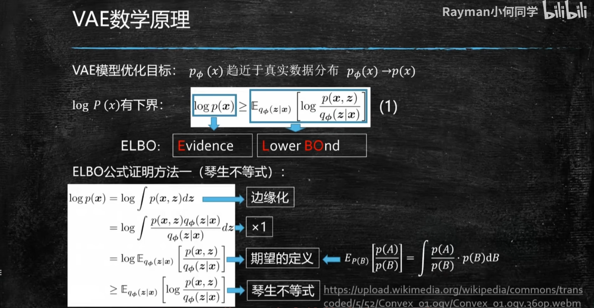
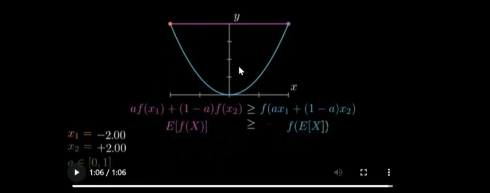
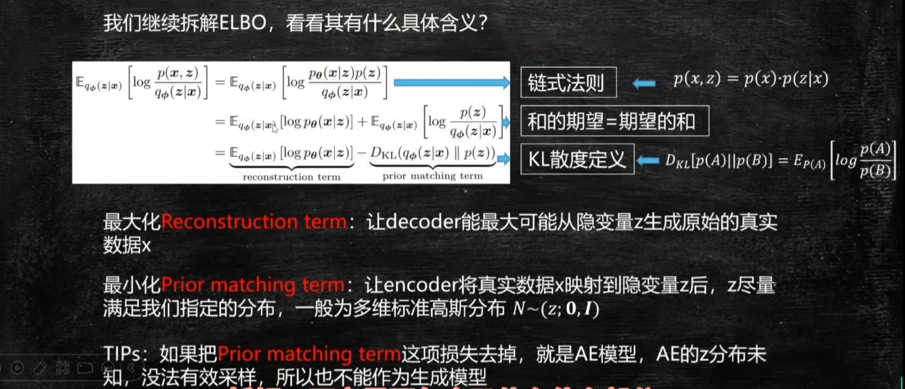
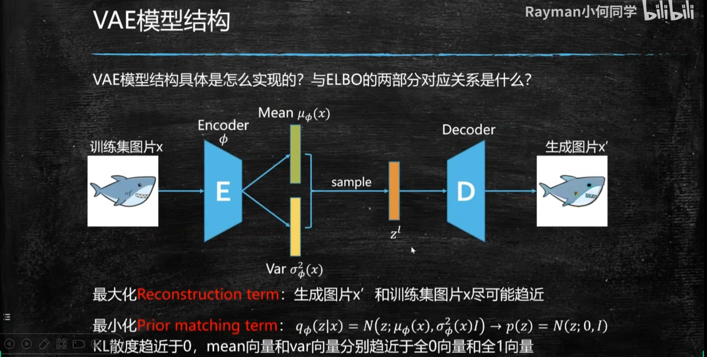
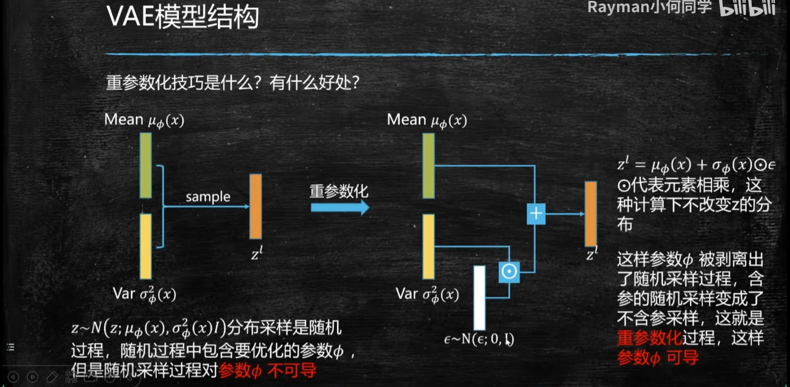
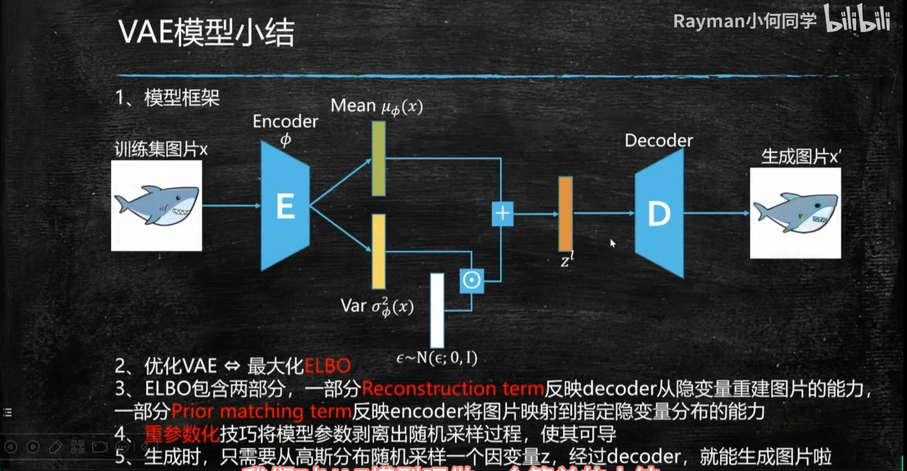
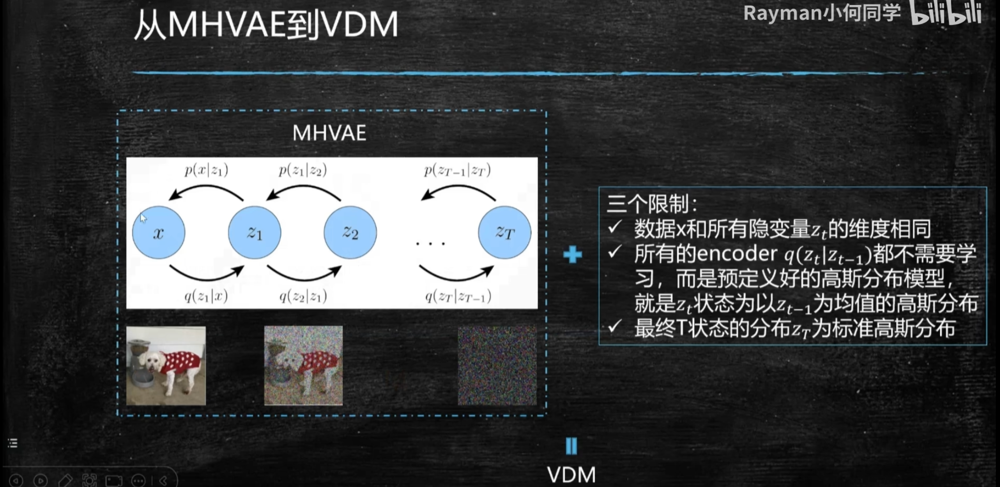

# Diffusion理论公式

ref：[【公式推导】还在头疼Diffusion模型公式吗？Diffusion理论公式喂饭式超详细逐步推导来了！](https://www.bilibili.com/video/BV1Ax4y1v7CY?spm_id_from=333.788.recommend_more_video.1&vd_source=ddd7d236ab3e9b123c4086c415f4939e)

[《Understanding Diffusion Models: A Unified Perspective》](https://arxiv.org/abs/2208.11970)：https://arxiv.org/abs/2208.11970 

[《Denoising Diffusion Probabilistic Models》](https://arxiv.org/abs/2006.11239):https://arxiv.org/abs/2006.11239

- [x] 

- [ ] 

## 1 VAE

### 	1.1 极大似然模型

目的是使得模型学得数据集的分布

给定数据集 $x_D$，通过模型学得 $\phi$参数，得到模型 $p_{\phi}(x_D)$，训练模型最大化 $p_{\phi}(x_D)$，使得 $p_{\phi}(x_D)$ 能够拟合样本 $x'$

得到模型 $p_{\phi}(x_D)$ 以后，还能够进行采样，采样出来的样本可能不在数据集里面，但是采样出来的样本是符合概率分布的值

###  1.2 VAE

- [x] 重点在于理解：VAE就是建立 真实图片 $x$ 与 隐变量高斯分布$z$ 之间的转换，工具是 Encoder和decoder

首先，生成模型必须要有能够采样的能力，而不能只能固定生成一些样本

所以，首先要有一个分布供我采样，有了分布才能采样，VAE就借助了一个非常简单的分布，就是标准高斯分布，用公式表达：以0为均值，$I$ 为方差的一个分布，注意是多维的  $N \sim N(z;\mathrm{0},\mathrm{I})$

VAE的结构首先分为两个部分：Encoder+decoder

<u>文字表达：</u>

**Encoder： **把一些图像通过Encoder变成一些embedding，一般是维度比较低的embedding

**decoder： **decoder被维度比较低的embedding生成一些维度比较高的图片

<u>数学表达：</u>

Encoder：$q(z|x)$ 给定图片 $x$ 能够拿到 $z$，$z$表示标准高斯分布的一个样本

Decoder：$p(x|z)$ 给定标准高斯分布的一个值，通过decoder生成一张图片$x$

VAE的Encoder和decoder就是在 $x$和$z$之间建立起联系

为什么这么做的原因：

> 因为让模型直接学习 $x$的分布比较难，$x$可能并不是常见的分布，所以没有办法采样，但如果把$x$与一个标准高斯分布联系起来，那么每在标准高斯分布上采样一个值，接着通过decoder就能映射成在$x$也就是pixel这个像素空间上，生成一张图片，这样就会有很多样本产生，因为标准高斯分布可以采样出无穷无尽个样本

也就是这句话：

z 表示隐变量，一般采用高斯分布，且一般是多维的，理论上讲可以是任意一个能够进行方便采样的分布，只是因为高斯部分比较简洁，推导也比较简单，所以一般采用高斯分布作为隐变量。

一句话，VAE就是建立 真实图片 $x$ 与 隐变量高斯分布$z$ 之间的转换

### 	1.3 VAE的数学原理

首先，VAE的优化目标，学习到的分布 $p_{\phi}(x)$ 趋近于 真实分布 $p(x)$

首先明确优化目标：  $p_{\phi}(x) \rightarrow p(x)$

那具体怎么实现目标呢？思想就类似于辅助线 & 中间变量，这里借助的中间变量就是 $z$

首先，真实分布 $p(x)$ 一般用对数估计，表示成 $logp(x)$ ，且有下界 $\mathbb{E}_{q_{\phi}(z|x)}[log \frac{p(x,z)}{q_{\phi}(z|x)}]$

以上步骤都很简单，没啥好说的，值得注意的是琴生不等式，也就是把log内移

理解琴生不等式：

文字描述：任意两点的期望 ＞ 期望的函数值

图示：任意两点的连线，永远在曲线上方

函数值的期望 ＞ 期望的函数值（对于凸函数来说：期望>函数值）

而log函数是个凹函数，反过来的，也就是 弦 在 曲线的 下方（也就是 函数值 > 期望）借助脑袋中的图像理解

不用死记硬背，去想图像，画个图即可，也就是看明白了公式，这个公式证明出来有什么用？

### 	1.4	为什么说 优化VAE《==》最大化ELBO？

$ELBO= \mathbb{E}_{q_{\phi}(z|x)}[log \frac{p(x,z)}{q_{\phi}(z|x)}]$

再解释一下：给定数据集 $x$，那么$p(x)$确定，也就是$logp(x)$确定

Encoder的优化目标 $q_{\phi}(z|x)=p(z|x)$  《====》 KL散度=0

那和又是固定的，所以拟合未知但是确定的p(x)，变成了最大化 ELBO

VAE的目的就是学到真实$x$的分布$p(x)$，但是又不好直接学到，所以借助辅助变量z，通过Encoder和decoder间接学到$x$的分布，又推出了下界，下界就是$ELBO$，但是$logP(x)=ELBO+KL散度$，$KL散度$是Encoder的目标，等于$0$最好就是 $q(z|x)$无限接近$p(z|x)$

### 	1.5 拆解ELBO

使用链式法则的原因是因为，我们用的是中间变量$z$

将 ELBO拆成了 `ELBO=重建项-先验匹配项`

$=\mathbb{E}_{q_{\phi}}(z|x)[logp_{\theta}(x|z)]-D_{KL}(q_{\phi}(z|x)||p(z))$

- [x] 首先，为什么叫重建项？

$p(x|z)$ 也就是已知$z$学习$x$，就是$decoder$

decoder的目的就是重建图像$x$，所以叫重建项

- [x] 为什么叫先验匹配项？  $D_{KL}(q_{\phi}(z|x)||p(z))$

$q_{\phi}(z|x)$  $x$到$z$的分布，就是$Encoder$

也就是让Encoder学到的分布接近于$z$，$z$ 是什么？$z$就是我们采样的高斯分布，也就是$p(z)$

我们要让 我们的Encoder编码，把$x$映射到$z$空间上，$z$能满足指定的分布，也就是prior matching

$z$就是prior，也就是Encoder以后的$z$，$z$满足我们自己选的高斯分布，也就是把 我们的 $x$映射到$z$，$z$满足我们自己选的高斯分布，真是因为我们编码后的$z$满足高斯分布，后续我们才可以抛开Encoder，后续直接在decoder上进行采样得到高斯分布值，然后通过decoder得到$x$

> 一句非常重要的话：
>
> Encoder把x映射成z，并且这个z无限接近高斯分布
>
> 所以后需才可以直接丢掉Encoder，直接采样x映射的高斯分布z，直接采样，然后重建x

也就是保证VAE能做生成任务的前提：`把真实分布映射到 高斯分布上`

- [x] 优化VAE，就是优化ELBO，ELBO有两项：重建项+KL散度项

所以，最大化ELBO，就是最大化重建项，也就是最小化先验匹配项

接下来解释，最大化重建项是什么意思？最小化先验匹配项又是什么意思？

- [x] 最大化重建项怎么理解：  $\mathbb{E}_{q_{\phi}}(z|x)[logp_{\theta}(x|z)]$

最大化重建项也是模型decoder出来的$x$，和真实的$x$ 越相近越好，也就是重建误差越小越好，也就是重建出来的概率越大越好，也就是 $p_{\theta}(x|z) \rightarrow 1$ ，也就是  $logp_{\theta}(x|z) \rightarrow 0$

- [x] 最小化 先验匹配项 $D_{KL}(q_{\phi}(z|x)||p(z))$

$q_{\phi}(z|x)$  通过Encoder映射到隐空间之后，尽量满足分布，越接近越好，也就是`最小化KL散度→0`

这项KL散度，相当于训练Encoder的loss，这项loss降到最小，也就是Encoder学到最好

如果`这一项＝0`，也就是完全把真实世界的$x$映射到了标准的正态分布，此时Encoder是学习的非常完美的

也就是`KL=0`

- [x] ADD：如果把后面项去掉，就是只留下 重建项，就变成的AE（AutoEncoder）模型，AutoEncoder没有生成能力，因为没有把原始数据映射到高斯分布上，也就是在生成的时候，没有办法进行采样，也就是没有办法通过decoder得到图像，（没有了采样，就没有了生成）

AE模型没有了采样能力，decoder出来的东西也就不是多样的，不是一个全新的，此时$z$的分布，就是AutoEncoder的z分布是未知的，因为我们没有把$x$强制的归于某个分布，也就是$z$是未知的，此时是没有办法进行有效采样的，也就没有办法生成更多的图片

### 	1.6 VAE的结构

- [x] 描述图片

首先有一张训练集图片x，通过Encoder，Encoder就是会把训练的x映射到z上面，z所在的是一个隐空间，隐空间怎么表达呢？因为我们就是要把x映射到正态分布空间上，正态分布是通过均值和方差描述的，也就是会得到一个均值向量 $\mu_{\phi}(x)$ 和一个方差向量  $\sigma^2_{\phi}(x)$ ，因为我们使用的是标准高斯分布，所以我们优化的目标就是 $\mu_{\phi}(x) → 0$ 和 $\sigma^2_{\phi}(x) → \mathrm{1}$ `全0向量` 和 `全1向量`

上面描述的过程 也就是 公式中的 先验匹配项，也就是第二项

接下来：

我们得到了尽可能得`全0向量` $\mu_{\phi}(x)$  、`全1向量` $\sigma^2_{\phi}(x)$ ，

$z'$是根据Encoder得到的 $\mu$ 和$\sigma$ 重参数化得到的 $z'$

正式采样的时候，不需要Encoder，而是直接从 "标准"正态分布$z'$采样出来的，然后通过decoder得到一张新的图片

> 注意：
>
> Encoder出来的$z$，就是$z'$是希望尽可能为标准正态分布的

### 	1.7 参数重整化

- [x] 为什么？重参数化技巧

如果不进行参数重整化的话，$z'$是根据均值和方差采样出来的，但是我们的均值 $\mu_{\phi}(x)$ 和方差 $\sigma^2_{\phi}(x)$ 里面都是包含参数的`《====》`也就是我们采样的随机噪声里面是包含参数的`《=====》` 随机过程中包含了待优化的参数 $\phi$ 此时，对参数的 $\phi$ 是不可导的`《=====》` 因为这是一个随机过程，随机过程中包含参数，怎么求这个参数的导数呢？`《=====》`鉴于此，引入了重参数化技巧。让这个过程变得可导

- [x] 什么是？重参数化技巧

首先，重参数化技巧是在一个标准正态分布里面，先随机取一个值，也就是 $\epsilon \sim N(\epsilon;0,I)$

也就是采样出来的 `单位噪声 × 方差 + 均值`  等价于 从  $\mu_{\phi}(x)$  和 $\sigma^2_{\phi}(x)$ 中直接采样

也就是说这样采样出来的参数，均值也等于 $\mu_{\phi}(x)$ ，方差也等于 $\sigma^2_{\phi}(x)$

- [x] `单位噪声 × 方差 + 均值`  等价于 从  $\mu_{\phi}(x)$  和 $\sigma^2_{\phi}(x)$ 中直接采样 ||好处是是什么？

首先，我们的随机过程是在一个没有参数的噪声中采样的，也就是说这个随机过程是不包含参数的，那后面对参数 $\phi$ 优化的时候，就可以直接求导了，因为这个参数是 剥离出这个随机过程的，以上就是重参数化的过程；

总之重参数化过程 保证了 采样的分布没有变，然后又让所有参数是可导的，而没有在一个随机的过程中，这样模型才能训练，也就是重参数化技巧的好处

### 	1.8 VAE模型小结

首先是 模型的整体架构，并包含了 重参数化技巧

第二点，优化VAE 等价于 优化 ELBO，更具体来说就是 最大化 ELBO

第三点，继续拆解ELBO，ELBO包含两部分（1）重建项（2）先验匹配项

（1）重建项：反映的是decoder从隐变量重建图片的能力

（2）先验匹配项：反映的是Encoder将图片映射到指定隐变量分布的能力，也就是把图片映射到标准正态分布的能力

第四点，重参数化技巧的好处

第五点，生成的时候就不需要Encoder了，每次只需要在Encoder出来的变量采样一个z，这样就可以通过decoder生成一张新的图片了，以上是一个VAE的过程

## 	2 MHVAE的推导

中文：马尔科夫链的级联的VAE（级联马尔科夫链VAE）

- 实际上就是把很多VAE堆叠起来，而且每一个状态值依赖前一个和它相邻的前一个状态，而与之前的更长更远的状态是无关的，也就是马尔科夫链
- 公式推导的变化：

（1）公式推导的原理是一模一样的

（2）区别在于，之前单个VAE只需要一个辅助变量$z$，现在级联马尔科夫VAE，有多个辅助变量$z$，所以从$z→z_{1:T}$

## 	3 VDM理论推导

中文翻译：Variational Diffusion Models 变分扩散模型

区分：（ **Denoising Diffusion Probabilistic Models**，DDPM）去噪概率扩散模型

从 级联马尔科夫VAE $MHVAE$  →  $VDM$

MHVAE+3个限制条件 就会变成 VDM

<u>限制1：数据$x$和所有的隐变量$z_t$维度相同</u>

之前的VAE，$x$和$z$的维度可以是不同，且一般也是不同的

但如果是 $VDM$的话，映射的维度就是相同的，也就是$x$和所有的隐变量$z$的维度都是相同的

<u>限制2：所以Encoder的过程是不需要学习的</u>

也就是从 $z_1 → z_2$ 、从 $z_2$ 到 $z_3$ 、从 $z_3$到$z_4$ 、从$z_{t-1}$到$z_t$ 是不需要学习的，是人为预定义好的，是一个高斯分布的，也就是说 每下一个状态 都是以 上一个状态为均值的高斯分布  $q(z_t|z_{t-1})$，这个均值和方差都可以定义好，当然也可以设置为需要学习的，但是论文中设置的是先预定义好的

<u>限制3：最后的 $z_t$是满足标准的高斯分布的</u>

类比VAE最后也是要拟合一个标准 高斯分布

但 VAE中的Encoder过程是学习到的，学习目标就是将原始图像 $x$ 变成一个标准高斯分布 $z$

但现在是人工定义的Encoder的过程，这就要求我们自己定义的这个过程 满足 $z_t$ 为标准高斯分布

也就是Encoder映射$x$到$z_t$的过程本来是通过学习使其能够映射到一个标准高斯分布，而现在是通过认为定义让它去映射到一个高斯分布，所以要求，我们定义的高斯分布$q$，一定要使得最后的 $z_t$ 是标准高斯分布，也就满足了之前VAE推导的过程

`总结：MHVAE+3个限制=VDM`

### 	3.1 限制是怎么加的？

