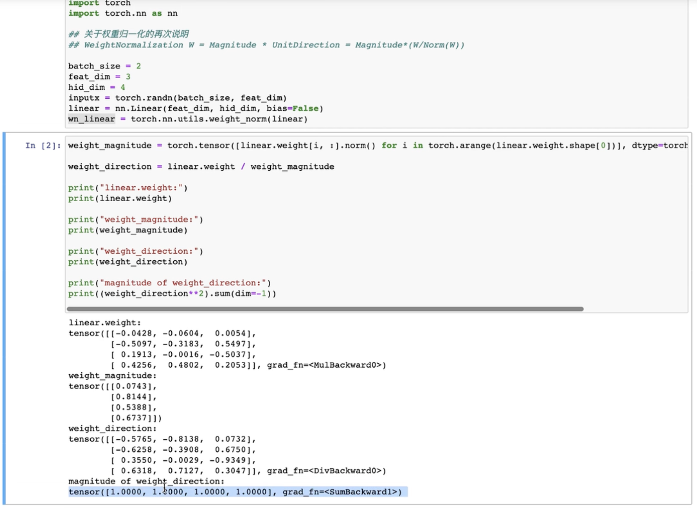

# [快速复现PyTorch的Weight Normalization](https://www.bilibili.com/video/BV1NZ4y117VT?spm_id_from=333.788.videopod.sections&vd_source=ddd7d236ab3e9b123c4086c415f4939e)

## 	1 官方api解读


权重归一化的api

生成式网络比如GAN，使用权重归一化使得网络训练更加稳定

权重归一化的api在`torch.nn.utils`下的一个函数，不是class

这个函数的传入参数：

- module：pytorch中很多class都是nn.module的子类，所以只需要传入module的对象即可，如：nn.Linear、nn.ReLu、nn.Conv、nn.RNN
- name：一般不会改
- dim：也一般是默认的

权重归一化的论文：


标题：权重归一化：简单的参数重整化方法：加速深度神经网络的训练

今天讲解：权重归一化主要做了什么事

---

WeightNorm对module进行一层包裹

例如 把一个nn.Linear放入WeightNorm中，WeightNorm仍然返回的是一个module，这个返回的module包含两个参数：Weight_g 和 Weight_v

> 本来的Linear层，只有一个参数w，忽略bias，放入WeightNorm中处理，返回一个新的module，新的module有两个参数：Weight_g 和 Weight_v
>
> Weight_g 和 Weight_v就是WeightNorm公式中的g和v
>
> $w = g\frac{v}{||v||}$


看公式

相当于把原来的module中的 权重w 分解了，所以与其叫权重归一化，也可以叫权重分解

相当于把原来module中的w分解成两项：

- g：g表示w的幅度，相当于w每阶向量的二阶模、范数
- $\frac{v}{||v||}$：单位向量，方向除以模长得到方向向量

也就是说本来 module只有一个参数 w，现在变成两个参数，分别是 g 和 v ，也就是此时进行梯度下降更新参数时，不是对 w 进行更新了，而是对 g 和 v 进行更新（好处自己去看论文）

## 	2 代码实现

### 	2.1 两个实例演示

1. Linear层
2. 一维Conv的例子

以上 两个例子 解释 WeightNorm官方api做了什么事

```python
import torch
import torch.nn as nn

# 关于权重归一化的再次说明
# WeightNorm W = Magnitude * UnitDirection = Magnitude * (W/Norm(W))

# step1:define constant
batch_size = 2
feat_dim = 3
hid_dim = 4
inputx = torch.randn(batch_size,feat_dim)
linear = nn.Linear(feat_dim,hid_dim,bias=False)
wn_linear = torch.nn.utils.weight_norm(linear)

# step2:Linear Layer:calculate g and v
weight_magnitude = torch.tensor([linear.weight[i:,].norm() for i in torch.arange(linear.weight.shape[0])],dtype =torch.float32).unsqueeze(-1)
weight_direction = linear.weight / weight_magnitude

print("linear.weight:",linear.weight)
print("weight_magnitude:",weight_magnitude)
print("weight_direction:",weight_direction)
print("magnitude of weight_direction:",(weight_direction**2).sum(dim=-1))


'''
linear.weight: tensor([[-0.2701, -0.0754,  0.3812],
        [-0.1806,  0.1814,  0.4922],
        [-0.2900, -0.5321, -0.4400],
        [-0.5492,  0.0195, -0.5189]], grad_fn=<WeightNormInterfaceBackward0>)
weight_magnitude: tensor([[1.2899],
        [1.2000],
        [1.0640],
        [0.7558]])
weight_direction: tensor([[-0.2094, -0.0584,  0.2956],
        [-0.1505,  0.1512,  0.4102],
        [-0.2726, -0.5001, -0.4135],
        [-0.7267,  0.0259, -0.6865]], grad_fn=<DivBackward0>)
magnitude of weight_direction: tensor([0.1346, 0.2138, 0.4954, 1.0000], grad_fn=<SumBackward1>)
'''
```

### 	2.2 注释	

```python
import torch
import torch.nn as nn

# 关于权重归一化的再次说明
# WeightNorm W = Magnitude * UnitDirection = Magnitude * (W/Norm(W))

# step1:define constant
batch_size = 2
feat_dim = 3
hid_dim = 4
inputx = torch.randn(batch_size,feat_dim) # 2×3
linear = nn.Linear(feat_dim,hid_dim,bias=False) # linear.weight=4×3
wn_linear = torch.nn.utils.weight_norm(linear)

# step2:Linear Layer:calculate g and v
weight_magnitude = torch.tensor([linear.weight[i:,].norm() 
                                 for i in torch.arange(linear.weight.shape[0])],
                                dtype =torch.float32).unsqueeze(-1)
# weight_magnitude：4×1
weight_direction = linear.weight / weight_magnitude
# weight_direction：4×3
print("linear.weight:",linear.weight) # linear.weight=4×3
print("weight_magnitude:",weight_magnitude) # weight_magnitude：4×1
print("weight_direction:",weight_direction) # weight_direction：4×3
print("magnitude of weight_direction:",(weight_direction**2).sum(dim=-1))


'''
linear.weight: tensor([[-0.2701, -0.0754,  0.3812],
        [-0.1806,  0.1814,  0.4922],
        [-0.2900, -0.5321, -0.4400],
        [-0.5492,  0.0195, -0.5189]], grad_fn=<WeightNormInterfaceBackward0>)
weight_magnitude: tensor([[1.2899],
        [1.2000],
        [1.0640],
        [0.7558]])
weight_direction: tensor([[-0.2094, -0.0584,  0.2956],
        [-0.1505,  0.1512,  0.4102],
        [-0.2726, -0.5001, -0.4135],
        [-0.7267,  0.0259, -0.6865]], grad_fn=<DivBackward0>)
magnitude of weight_direction: tensor([0.1346, 0.2138, 0.4954, 1.0000], grad_fn=<SumBackward1>)
'''
```

### 	2.3 详解

#### （1）定义常量

```python
import torch
import torch.nn as nn

# 关于权重归一化的再次说明
# WeightNorm W = Magnitude * UnitDirection = Magnitude * (W/Norm(W))

batch_size = 2
feat_dim = 3
hid_dim = 4
inputx = torch.randn(batch_size,feat_dim)
linear = nn.Linear(feat_dim,hid_dim,bias=False)
wn_linear = torch.nn.utils.weight_norm(linear)
```

- [x] feat_dim：数据维度
- [x] hid_dim：隐含层维度，指的是线性层的维度，线性层的隐含层或者Conv的输出通道数
- [x] `inputx = torch.randn(batch_size,feat_dim)`

torch.randn初始化inputx，是一个二维张量，第一维度是 batch_size ，第二维度是 输入数据的特征维度

- [x] `linear = nn.Linear(feat_dim,hid_dim,bias=False)`

实例化一个linear层，linear层的api：

- 第一个参数 输入数据的特征维度
- 第二个参数 隐含层的特征维度
- bias设置False，给关掉

- [x] `wn_linear = torch.nn.utils.weight_norm(linear)`

接下来，把linear作为一个参数，传入 torch 的 weight norm函数中，得到新的模块 weightnorm linear：`wn_linear `，仍然是一个module

#### 	（2）探讨 `linear` 和 `wn_linear` 两个module的关系（计算g&v）

根据公式，可以算出 g 和 $\frac{v}{||v||}$，接下来研究怎么算这两个向量：

```python
weight_magnitude = torch.tensor([linear.weight[i:,].norm() 
                                 for i in torch.arange(linear.weight.shape[0])],
                                dtype =torch.float32).unsqueeze(-1)

weight_direction = linear.weight / weight_magnitude

print("linear.weight:",linear.weight)
print("weight_magnitude:",weight_magnitude)
print("weight_direction:",weight_direction)
print("magnitude of weight_direction:",(weight_direction**2).sum(dim=-1))
```

- 首先 计算 g，g表示幅度

```python
weight_magnitude = torch.tensor([linear.weight[i:,].norm() 
                                 for i in torch.arange(linear.weight.shape[0])],
                                dtype =torch.float32).unsqueeze(-1)
```

> 幅度指的是 跟输入的每一个sample 进行内积的向量的幅度
>
> 首先拿出linear层的权重矩阵，`linear.weight`
>
> 然后 找到每一个 跟sample进行内积的 向量，也就是 weight的每一行 `linear.weight[i:,]`
>
> 对 `linear.weight[i:,]` 的每一行进行遍历，计算norm：`linear.weight[i:,].norm()`
>
> `.norm()` 是 torch中的函数，计算L2范数，调用norm() 函数以后，得到每一行的范数
>
> `.unsqueeze(-1)` 扩一维

计算出 linear层，原来权重矩阵的 幅度值

```python
weight_magnitude: tensor([[1.2899],
        [1.2000],
        [1.0640],
        [0.7558]])
```

权重矩阵是 4行的，每一行都能计算幅度值

??? question "inputx = 2×3，为什么 linear.weight=4×3?"

- 计算单位向量

```python
weight_direction = linear.weight / weight_magnitude
```

- 单位向量 就是 v 除以 v的模
- v其实就是w，所以在计算w的时候，就是把原来的权重矩阵 `linear.weight` 除以 我们刚刚算出来的 幅度值 `weight_magnitude`
- 每一个权重向量 除以 向量的模，得到 `weight_direction`

- `weight_direction` 跟 weight 矩阵的形状是一样的，这个矩阵叫做单位向量矩阵，每一行都是单位向量
- 那为什么 是 单位向量矩阵呢？验证：

```python
print("magnitude of weight_direction:",(weight_direction**2).sum(dim=-1))
```

- 把 `weight_direction` 首先，每个元素取平方，然后再对每一行求和

这里有问题：up主结果为1，我的结果不会是1，但结果应该是1



也不知道哪里出问题了，总之我的有问题，所以称之为 单位向量

- 叫做 单位向量的原因是 weight每一行的平方和 都是1

- 也就是说 每一行向量长度都是 1，也就是单位向量，反映的是 每个向量的方向的，并且用 长度为1 的向量 反映方向

- 上面已经算出来了 原来 linear层 的权重的幅度和方向：

```python
weight_magnitude = torch.tensor([linear.weight[i:,].norm() for i in torch.arange(linear.weight.shape[0])],dtype =torch.float32).unsqueeze(-1)
weight_direction = linear.weight / weight_magnitude
```

