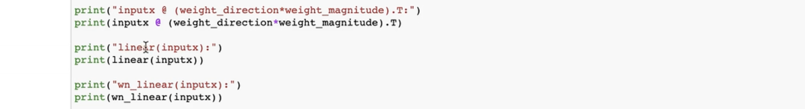

# WeightNorm

[快速复现PyTorch的Weight Normalization](https://www.bilibili.com/video/BV1NZ4y117VT?spm_id_from=333.788.videopod.sections&vd_source=ddd7d236ab3e9b123c4086c415f4939e)

## 	1 官方api解读


权重归一化的api

生成式网络比如GAN，使用权重归一化使得网络训练更加稳定

权重归一化的api在`torch.nn.utils`下的一个函数，不是class

这个函数的传入参数：

- module：pytorch中很多class都是nn.module的子类，所以只需要传入module的对象即可，如：nn.Linear、nn.ReLu、nn.Conv、nn.RNN
- name：一般不会改
- dim：也一般是默认的

权重归一化的论文：


标题：权重归一化：简单的参数重整化方法：加速深度神经网络的训练

今天讲解：权重归一化主要做了什么事

---

WeightNorm对module进行一层包裹

例如 把一个nn.Linear放入WeightNorm中，WeightNorm仍然返回的是一个module，这个返回的module包含两个参数：Weight_g 和 Weight_v

> 本来的Linear层，只有一个参数w，忽略bias，放入WeightNorm中处理，返回一个新的module，新的module有两个参数：Weight_g 和 Weight_v
>
> Weight_g 和 Weight_v就是WeightNorm公式中的g和v
>
> $w = g\frac{v}{||v||}$


看公式

相当于把原来的module中的 权重w 分解了，所以与其叫权重归一化，也可以叫权重分解

相当于把原来module中的w分解成两项：

- g：g表示w的幅度，相当于w每阶向量的二阶模、范数
- $\frac{v}{||v||}$：单位向量，方向除以模长得到方向向量

也就是说本来 module只有一个参数 w，现在变成两个参数，分别是 g 和 v ，也就是此时进行梯度下降更新参数时，不是对 w 进行更新了，而是对 g 和 v 进行更新（好处自己去看论文）

## 	2 代码实现

### 	2.1 两个实例演示

1. Linear层
2. 一维Conv的例子

以上 两个例子 解释 WeightNorm官方api做了什么事

```python
import torch
import torch.nn as nn

# 关于权重归一化的再次说明
# WeightNorm W = Magnitude * UnitDirection = Magnitude * (W/Norm(W))

# step1:define constant
batch_size = 2
feat_dim = 3
hid_dim = 4
inputx = torch.randn(batch_size,feat_dim)
linear = nn.Linear(feat_dim,hid_dim,bias=False)
wn_linear = torch.nn.utils.weight_norm(linear)

# step2:Linear Layer:calculate g and v
weight_magnitude = torch.tensor([linear.weight[i:,].norm() for i in torch.arange(linear.weight.shape[0])],dtype =torch.float32).unsqueeze(-1)
weight_direction = linear.weight / weight_magnitude

print("linear.weight:",linear.weight)
print("weight_magnitude:",weight_magnitude)
print("weight_direction:",weight_direction)
print("magnitude of weight_direction:",(weight_direction**2).sum(dim=-1))


'''
linear.weight: tensor([[-0.2701, -0.0754,  0.3812],
        [-0.1806,  0.1814,  0.4922],
        [-0.2900, -0.5321, -0.4400],
        [-0.5492,  0.0195, -0.5189]], grad_fn=<WeightNormInterfaceBackward0>)
weight_magnitude: tensor([[1.2899],
        [1.2000],
        [1.0640],
        [0.7558]])
weight_direction: tensor([[-0.2094, -0.0584,  0.2956],
        [-0.1505,  0.1512,  0.4102],
        [-0.2726, -0.5001, -0.4135],
        [-0.7267,  0.0259, -0.6865]], grad_fn=<DivBackward0>)
magnitude of weight_direction: tensor([0.1346, 0.2138, 0.4954, 1.0000], grad_fn=<SumBackward1>)
'''
```

### 	2.2 注释	

```python
import torch
import torch.nn as nn

# 关于权重归一化的再次说明
# WeightNorm W = Magnitude * UnitDirection = Magnitude * (W/Norm(W))

# step1:define constant
batch_size = 2
feat_dim = 3
hid_dim = 4
inputx = torch.randn(batch_size,feat_dim) # 2×3
linear = nn.Linear(feat_dim,hid_dim,bias=False) # linear.weight=4×3
wn_linear = torch.nn.utils.weight_norm(linear)

# step2:Linear Layer:calculate g and v
weight_magnitude = torch.tensor([linear.weight[i:,].norm() 
                                 for i in torch.arange(linear.weight.shape[0])],
                                dtype =torch.float32).unsqueeze(-1)
# weight_magnitude：4×1
weight_direction = linear.weight / weight_magnitude
# weight_direction：4×3
print("linear.weight:",linear.weight) # linear.weight=4×3
print("weight_magnitude:",weight_magnitude) # weight_magnitude：4×1
print("weight_direction:",weight_direction) # weight_direction：4×3
print("magnitude of weight_direction:",(weight_direction**2).sum(dim=-1))


'''
linear.weight: tensor([[-0.2701, -0.0754,  0.3812],
        [-0.1806,  0.1814,  0.4922],
        [-0.2900, -0.5321, -0.4400],
        [-0.5492,  0.0195, -0.5189]], grad_fn=<WeightNormInterfaceBackward0>)
weight_magnitude: tensor([[1.2899],
        [1.2000],
        [1.0640],
        [0.7558]])
weight_direction: tensor([[-0.2094, -0.0584,  0.2956],
        [-0.1505,  0.1512,  0.4102],
        [-0.2726, -0.5001, -0.4135],
        [-0.7267,  0.0259, -0.6865]], grad_fn=<DivBackward0>)
magnitude of weight_direction: tensor([0.1346, 0.2138, 0.4954, 1.0000], grad_fn=<SumBackward1>)
'''
```

### 	2.3 详解

#### （1）定义常量

```python
import torch
import torch.nn as nn

# 关于权重归一化的再次说明
# WeightNorm W = Magnitude * UnitDirection = Magnitude * (W/Norm(W))

batch_size = 2
feat_dim = 3
hid_dim = 4
inputx = torch.randn(batch_size,feat_dim)
linear = nn.Linear(feat_dim,hid_dim,bias=False)
wn_linear = torch.nn.utils.weight_norm(linear)
```

- [x] feat_dim：数据维度
- [x] hid_dim：隐含层维度，指的是线性层的维度，线性层的隐含层或者Conv的输出通道数
- [x] `inputx = torch.randn(batch_size,feat_dim)`

torch.randn初始化inputx，是一个二维张量，第一维度是 batch_size ，第二维度是 输入数据的特征维度

- [x] `linear = nn.Linear(feat_dim,hid_dim,bias=False)`

实例化一个linear层，linear层的api：

- 第一个参数 输入数据的特征维度
- 第二个参数 隐含层的特征维度
- bias设置False，给关掉

- [x] `wn_linear = torch.nn.utils.weight_norm(linear)`

接下来，把linear作为一个参数，传入 torch 的 weight norm函数中，得到新的模块 weightnorm linear：`wn_linear `，仍然是一个module

#### 	（2）探讨 `linear` 和 `wn_linear` 两个module的关系（计算g&v）

根据公式，可以算出 g 和 $\frac{v}{||v||}$，接下来研究怎么算这两个向量：

```python
weight_magnitude = torch.tensor([linear.weight[i:,].norm() 
                                 for i in torch.arange(linear.weight.shape[0])],
                                dtype =torch.float32).unsqueeze(-1)

weight_direction = linear.weight / weight_magnitude

print("linear.weight:",linear.weight)
print("weight_magnitude:",weight_magnitude)
print("weight_direction:",weight_direction)
print("magnitude of weight_direction:",(weight_direction**2).sum(dim=-1))
```

- 首先 计算 g，g表示幅度

```python
weight_magnitude = torch.tensor([linear.weight[i:,].norm() 
                                 for i in torch.arange(linear.weight.shape[0])],
                                dtype =torch.float32).unsqueeze(-1)
```

> 幅度指的是 跟输入的每一个sample 进行内积的向量的幅度
>
> 首先拿出linear层的权重矩阵，`linear.weight`
>
> 然后 找到每一个 跟sample进行内积的 向量，也就是 weight的每一行 `linear.weight[i:,]`
>
> 对 `linear.weight[i:,]` 的每一行进行遍历，计算norm：`linear.weight[i:,].norm()`
>
> `.norm()` 是 torch中的函数，计算L2范数，调用norm() 函数以后，得到每一行的范数
>
> `.unsqueeze(-1)` 扩一维

计算出 linear层，原来权重矩阵的 幅度值

```python
weight_magnitude: tensor([[1.2899],
        [1.2000],
        [1.0640],
        [0.7558]])
```

权重矩阵是 4行的，每一行都能计算幅度值

??? question "inputx = 2×3，为什么 linear.weight=4×3?"

- 计算单位向量

```python
weight_direction = linear.weight / weight_magnitude
```

- 单位向量 就是 v 除以 v的模
- v其实就是w，所以在计算w的时候，就是把原来的权重矩阵 `linear.weight` 除以 我们刚刚算出来的 幅度值 `weight_magnitude`
- 每一个权重向量 除以 向量的模，得到 `weight_direction`

- `weight_direction` 跟 weight 矩阵的形状是一样的，这个矩阵叫做单位向量矩阵，每一行都是单位向量
- 那为什么 是 单位向量矩阵呢？验证：

```python
print("magnitude of weight_direction:",(weight_direction**2).sum(dim=-1))
```

- 把 `weight_direction` 首先，每个元素取平方，然后再对每一行求和

这里有问题：up主结果为1，我的结果不会是1，但结果应该是1


也不知道哪里出问题了，总之我的有问题，所以称之为 单位向量

- 叫做 单位向量的原因是 weight每一行的平方和 都是1

- 也就是说 每一行向量长度都是 1，也就是单位向量，反映的是 每个向量的方向的，并且用 长度为1 的向量 反映方向

- 上面已经算出来了 原来 linear层 的权重的幅度和方向：

```python
weight_magnitude = torch.tensor([linear.weight[i:,].norm() for i in torch.arange(linear.weight.shape[0])],dtype =torch.float32).unsqueeze(-1)
weight_direction = linear.weight / weight_magnitude
```

下面将方向与幅度相乘：

```python
print("weight_direction * weight_magnitude:")
print(weight_direction * weight_magnitude)

print("inputx @ (weight_direction * weight_magnitude).T:")
print(inputx @ (weight_direction * weight_magnitude).T)

print("linear(inputx):")
print(linear(inputx))

print("wn_linear(inputx):")
print(wn_linear(inputx))
```

```
weight_direction * weight_magnitude:
tensor([[ 0.0999, -0.1095,  0.0053],
        [ 0.4107, -0.1039, -0.5627],
        [-0.0347, -0.1121,  0.0211],
        [ 0.1116,  0.0381, -0.0633]], grad_fn=<MulBackward0>)
inputx @ (weight_direction * weight_magnitude).T:
tensor([[-0.2544, -0.1274, -0.3263,  0.1558],
        [-0.0517,  1.6473, -0.2235,  0.3099]], grad_fn=<MmBackward0>)
linear(inputx):
tensor([[-0.2544, -0.1274, -0.3263,  0.1558],
        [-0.0517,  1.6473, -0.2235,  0.3099]], grad_fn=<MmBackward0>)
wn_linear(inputx):
tensor([[-0.2544, -0.1274, -0.3263,  0.1558],
        [-0.0517,  1.6473, -0.2235,  0.3099]], grad_fn=<MmBackward0>)
```

（1）方向与幅度相乘，得到：

```python
print("weight_direction * weight_magnitude:")
print(weight_direction * weight_magnitude)
```

```
# weight_direction * weight_magnitude:
# tensor([[ 0.4900, -0.5379,  0.5541],
#         [-0.5104,  0.3061,  0.4884],
#         [-0.0247, -0.0822,  0.2893],
#         [-0.1487, -0.4578, -0.4388]], grad_fn=<MulBackward0>)
```

观察，linear.weight的结果和 方向与幅度相乘 得到的乘积  结果相同

可以把 lienar.weight 的结果 分解为 幅度和方向的乘积

（2）把inputx分别放入linear层和weight_linear层、inputx与weight_direction 方向和幅度 weight_magnitude做矩阵乘法：

```python
print("inputx @ (weight_direction * weight_magnitude).T:")
print(inputx @ (weight_direction * weight_magnitude).T)
print("linear(inputx):")
print(linear(inputx))
print("wn_linear(inputx):")
print(wn_linear(inputx))
```

打印结果：

```
inputx @ (weight_direction * weight_magnitude).T:
tensor([[-0.2544, -0.1274, -0.3263,  0.1558],
        [-0.0517,  1.6473, -0.2235,  0.3099]], grad_fn=<MmBackward0>)
linear(inputx):
tensor([[-0.2544, -0.1274, -0.3263,  0.1558],
        [-0.0517,  1.6473, -0.2235,  0.3099]], grad_fn=<MmBackward0>)
wn_linear(inputx):
tensor([[-0.2544, -0.1274, -0.3263,  0.1558],
        [-0.0517,  1.6473, -0.2235,  0.3099]], grad_fn=<MmBackward0>)
```

发现 三个结果都是一样的

- wn_linear 这个新生成的层并不会改变模块的输出值，之前linear的输出是什么，加了WeightNorm输出依旧不变
- 区别：（1）原始linear层的参数只有weight（2）weightNorm之后的层有g和v

**查看wn_lienar的参数**

```python
print("paramter of wn_linear:")
for n,p in wn_linear.named_parameters():
    print(n,p)
```

输出：

```
weight_g Parameter containing:
tensor([[0.1483],
        [0.7043],
        [0.1192],
        [0.1339]], requires_grad=True)
weight_v Parameter containing:
tensor([[ 0.0999, -0.1095,  0.0053],
        [ 0.4107, -0.1039, -0.5627],
        [-0.0347, -0.1121,  0.0211],
        [ 0.1116,  0.0381, -0.0633]], requires_grad=True)
```

解释输出结果：

wn_linear只有两个输出结果：

- weight g：linear权重的幅度
- weight v：weight的方向归一化

```python
print("paramter of wn_linear:")
for n,p in wn_linear.named_parameters():
    print(n,p)

print("lienar.weight")
print(linear.weight)
```

输出：

```
paramter of wn_linear:
weight_g Parameter containing:
tensor([[0.1483],
        [0.7043],
        [0.1192],
        [0.1339]], requires_grad=True)
weight_v Parameter containing:
tensor([[ 0.0999, -0.1095,  0.0053],
        [ 0.4107, -0.1039, -0.5627],
        [-0.0347, -0.1121,  0.0211],
        [ 0.1116,  0.0381, -0.0633]], requires_grad=True)
lienar.weight
tensor([[ 0.0999, -0.1095,  0.0053],
        [ 0.4107, -0.1039, -0.5627],
        [-0.0347, -0.1121,  0.0211],
        [ 0.1116,  0.0381, -0.0633]], grad_fn=<WeightNormInterfaceBackward0>)
```

值得注意的是：

weight_v 和 lienar.weight的结果是相等的，其实weight_v 就是linear.weight但是公式中 对 weight_v进行了归一化 并乘以 幅度，所以 linear.weight可以拆成幅度向量和方向向量，如果不对weight_v 进行变换，那等式两边就不会相等的

$$ w = g \frac{v}{||v||}$$

v就是w，对v做变换，使得等式两边相等

```python
print("construct weight of linear:")
print(wn_linear.weight_g*(wn_linear.weight_v)/torch.tensor([wn_linear.weight_v[i,:].norm() for i in torch.arange(wn_linear.weight_v.shape[-1])]))
```

输出：

```
construct weight of linear:
tensor([[ 0.0999, -0.0231,  0.0066],
        [ 1.9504, -0.1039, -3.3245],
        [-0.0279, -0.0190,  0.0211],
        [ 0.1008,  0.0072, -0.0711]], grad_fn=<DivBackward0>)
```

这个结果和 weight_v 以及linear.weight的结果都是相等的

### 2.4 linear层演示代码 

所有linear层的代码：

```python
import torch
import torch.nn as nn

# 关于权重归一化的再次说明
# WeightNorm W = Magnitude * UnitDirection = Magnitude * (W/Norm(W))

# step1:define constant
batch_size = 2
feat_dim = 3
hid_dim = 4
inputx = torch.randn(batch_size,feat_dim)

# x：2×3 3映射到4维 w^T 4×3 w 3×4 torch中存的就是 4×3的 直接进行 w（4 3）变成 2×4
linear = nn.Linear(feat_dim,hid_dim,bias=False)
wn_linear = torch.nn.utils.weight_norm(linear)
```

```python
# step2:Linear Layer:calculate g and v
weight_magnitude = torch.tensor([linear.weight[i:,].norm() for i in torch.arange(linear.weight.shape[0])],dtype =torch.float32).unsqueeze(-1)
weight_direction = linear.weight / weight_magnitude
print(weight_direction)
# print("inputx:",inputx.shape) # inputx: torch.Size([2, 3])
# print("linear.weight:",linear.weight.shape) # linear.weight: torch.Size([4, 3])
# print("linear(inputx)",linear(inputx).shape)  # linear(inputx) torch.Size([2, 4])

# print("weight_magnitude:",weight_magnitude.shape)  # torch.Size([4, 1])
# print("weight_direction:",weight_direction.shape)  # weight_direction: torch.Size([4, 3])
print("magnitude of weight_direction:",(weight_direction**2).sum(dim=-1))
```
唯一有的一个问题：magnitude of weight_direction结果不是1

```
tensor([[ 0.1347, -0.1476,  0.0071],
        [ 0.5651, -0.1429, -0.7742],
        [-0.1938, -0.6252,  0.1177],
        [ 0.8338,  0.2848, -0.4729]], grad_fn=<DivBackward0>)
magnitude of weight_direction: tensor([0.0400, 0.9392, 0.4423, 1.0000], grad_fn=<SumBackward1>)

```

```python
print("weight_direction * weight_magnitude:")
print(weight_direction * weight_magnitude)

print("inputx @ (weight_direction * weight_magnitude).T:")
print(inputx @ (weight_direction * weight_magnitude).T)

print("linear(inputx):")
print(linear(inputx))

print("wn_linear(inputx):")
print(wn_linear(inputx))
```

输出：

```
weight_direction * weight_magnitude:
tensor([[ 0.0999, -0.1095,  0.0053],
        [ 0.4107, -0.1039, -0.5627],
        [-0.0347, -0.1121,  0.0211],
        [ 0.1116,  0.0381, -0.0633]], grad_fn=<MulBackward0>)
inputx @ (weight_direction * weight_magnitude).T:
tensor([[-0.2544, -0.1274, -0.3263,  0.1558],
        [-0.0517,  1.6473, -0.2235,  0.3099]], grad_fn=<MmBackward0>)
linear(inputx):
tensor([[-0.2544, -0.1274, -0.3263,  0.1558],
        [-0.0517,  1.6473, -0.2235,  0.3099]], grad_fn=<MmBackward0>)
wn_linear(inputx):
tensor([[-0.2544, -0.1274, -0.3263,  0.1558],
        [-0.0517,  1.6473, -0.2235,  0.3099]], grad_fn=<MmBackward0>)
```

```python
print("paramter of wn_linear:")
for n,p in wn_linear.named_parameters():
    print(n,p)

print("lienar.weight")
print(linear.weight)
```

输出：

```
paramter of wn_linear:
weight_g Parameter containing:
tensor([[0.1483],
        [0.7043],
        [0.1192],
        [0.1339]], requires_grad=True)
weight_v Parameter containing:
tensor([[ 0.0999, -0.1095,  0.0053],
        [ 0.4107, -0.1039, -0.5627],
        [-0.0347, -0.1121,  0.0211],
        [ 0.1116,  0.0381, -0.0633]], requires_grad=True)
lienar.weight
tensor([[ 0.0999, -0.1095,  0.0053],
        [ 0.4107, -0.1039, -0.5627],
        [-0.0347, -0.1121,  0.0211],
        [ 0.1116,  0.0381, -0.0633]], grad_fn=<WeightNormInterfaceBackward0>)
```

```python
print("construct weight of linear:")
print(wn_linear.weight_g*(wn_linear.weight_v)/torch.tensor([wn_linear.weight_v[i,:].norm() for i in torch.arange(wn_linear.weight_v.shape[-1])]))
```

```python
construct weight of linear:
tensor([[ 0.0999, -0.0231,  0.0066],
        [ 1.9504, -0.1039, -3.3245],
        [-0.0279, -0.0190,  0.0211],
        [ 0.1008,  0.0072, -0.0711]], grad_fn=<DivBackward0>)
```


-----

### 2.5 conv层的代码

(全部代码)

```
conv1d = nn.Conv1d(feat_dim,hid_dim,kernel_size=1,bias=False) # input:[B,C,T],weight:[oc,ic,1]
wn_conv1d = torch.nn.utils.weight_norm(conv1d)
```


```python
covn1d_weight_magnitude = torch.tensor([conv1d.weight[i,:,:].norm() 
                                        for i in torch.arange(conv1d.weight.shape[0])],dtype=torch.float32).reshape(
                                            conv1d.weight.shape[0],1,1
                                        ).tile(1,feat_dim,1)

covn1d_weight_direction = conv1d.weight / covn1d_weight_magnitude

print("parameters of wn_conv1d:")
for n,p in wn_conv1d.named_parameters():
    print(n,p,p.shape)
```

输出：

```
parameters of wn_conv1d:
weight_g Parameter containing:
tensor([[[0.4729]],

        [[0.7834]],

        [[0.5456]],

        [[0.5718]]], requires_grad=True) torch.Size([4, 1, 1])
weight_v Parameter containing:
tensor([[[ 0.0987],
         [-0.1757],
         [ 0.4279]],

        [[ 0.4962],
         [-0.4026],
         [ 0.4533]],

        [[ 0.4717],
         [-0.1782],
         [-0.2082]],
         

        [[-0.5708],
         [ 0.0271],
         [-0.0208]]], requires_grad=True) torch.Size([4, 3, 1])         
```


```python
print("construct weight of conv1d:")
print(wn_conv1d.weight_g * (wn_conv1d.weight_v / torch.tensor(
    [wn_conv1d.weight_v[i,:,:].norm() 
     for i in torch.arange(wn_conv1d.weight_v.shape[0])],
                            dtype=torch.float32).unsqueeze(-1).unsqueeze(-1)))
```

输出：

```
construct weight of conv1d:
tensor([[[ 0.0987],
         [-0.1757],
         [ 0.4279]],

        [[ 0.4962],
         [-0.4026],
         [ 0.4533]],

        [[ 0.4717],
         [-0.1782],
         [-0.2082]],

        [[-0.5708],
         [ 0.0271],
         [-0.0208]]], grad_fn=<MulBackward0>)
```


```python
print("conv1d.weight:")
print(conv1d.weight)

print("covn1d_weight_magnitude:")
print(covn1d_weight_magnitude)

print("covn1d_weight_direction:")
print(covn1d_weight_direction)
```

输出：

```
conv1d.weight:
tensor([[[ 0.0987],
         [-0.1757],
         [ 0.4279]],

        [[ 0.4962],
         [-0.4026],
         [ 0.4533]],

        [[ 0.4717],
         [-0.1782],
         [-0.2082]],

        [[-0.5708],
         [ 0.0271],
         [-0.0208]]], grad_fn=<WeightNormInterfaceBackward0>)
covn1d_weight_magnitude:
tensor([[[0.4729],
         [0.4729],
         [0.4729]],

        [[0.7834],
         [0.7834],
         [0.7834]],

        [[0.5456],
         [0.5456],
         [0.5456]],
        [[0.5718],
         [0.5718],
         [0.5718]]])
covn1d_weight_direction:
tensor([[[ 0.2086],
         [-0.3715],
         [ 0.9047]],

        [[ 0.6334],
         [-0.5139],
         [ 0.5785]],

        [[ 0.8647],
         [-0.3267],
         [-0.3816]],

        [[-0.9982],
         [ 0.0475],
         [-0.0364]]], grad_fn=<DivBackward0>)         
```

解读：

（1）实例化一个 1×1 的卷积层

```python
conv1d = nn.Conv1d(feat_dim,hid_dim,kernel_size=1,bias=False)
# input:[B,C,T],weight:[oc,ic,1]
wn_conv1d = torch.nn.utils.weight_norm(conv1d)
```

-  1×1 的卷积层 类似 MLP
- 输入通道数 设置为 feat_dim，输出通道数是  hid_dim，kernel_size设为1，不要bias
- 1×1的卷积层，输入的数据格式：batchsize × channel×length
- 权重的维度是 output channel×input channel ×kernel size，这里kernel size=1
- 把一维卷积 conv1d 作为 module，送入到weight Norm函数中，得到WeightNorm包裹后的convolution：wn_conv1d（即加了权重归一化的模块）

（2）计算 covn1d_weight_magnitude

```python
covn1d_weight_magnitude = torch.tensor([conv1d.weight[i,:,:].norm() 
                                        for i in torch.arange(conv1d.weight.shape[0])],dtype=torch.float32).reshape(
                                            conv1d.weight.shape[0],1,1
                                        ).tile(1,feat_dim,1)

covn1d_weight_direction = conv1d.weight / covn1d_weight_magnitude

print("parameters of wn_conv1d:")
for n,p in wn_conv1d.named_parameters():
    print(n,p,p.shape)
```

- conv1d.weight拿出卷积层的权重，计算权重矩阵的幅度，权重是一个三维矩阵，格式是weight:[oc,ic,1]，对每一行计算模，每一行是一个二阶张量，每一个二阶张量 跟 input 进行乘法操作，所以我们对每一行 计算范数，然后拼起来，然后进行扩维，得到幅度 covn1d_weight_magnitude
- 单位向量 同样是 weight 除以 幅度，得到单位向量，也就是方向向量

（3）打印幅度、单位向量、原来的权重，以及wn_conv1d中的两个参数：

```python
print("parameters of wn_conv1d:")
for n,p in wn_conv1d.named_parameters():
    print(n,p,p.shape)
    
    
print("construct weight of conv1d:")
print(wn_conv1d.weight_g * (wn_conv1d.weight_v / torch.tensor(
    [wn_conv1d.weight_v[i,:,:].norm() 
     for i in torch.arange(wn_conv1d.weight_v.shape[0])],
                            dtype=torch.float32).unsqueeze(-1).unsqueeze(-1)))

print("conv1d.weight:")
print(conv1d.weight)

print("covn1d_weight_magnitude:")
print(covn1d_weight_magnitude)

print("covn1d_weight_direction:")
print(covn1d_weight_direction)
```

① wn_conv1d中的两个参数：有weight_g  和 weight_v

weight_g  卷积的权重的幅度

weight_v  就是卷积的权重

区分：

weight_v 就是权重

除以v的范数 才是方向

除以v的范数 再乘以 幅度 还是权重 还是 weight_v

② 

把 幅度 与单位向量 相乘

幅度：wn_conv1d.weight_g

单位向量：

```
wn_conv1d.weight_v / torch.tensor(
    [wn_conv1d.weight_v[i,:,:].norm() 
     for i in torch.arange(wn_conv1d.weight_v.shape[0])],
                            dtype=torch.float32)
```

本质是 weight向量 除以 weight 向量的模，得到单位方向向量，或者叫 单位长度的方向向量

幅度 × 单位长度的方向向量 得到  `construct weight of conv1d`

值得注意的是：`construct weight of conv1d` 与 `weight_v` 与 `conv1d.weight` 是一样的，就是卷积的权重

③ 对比  `weight_v`     `construct weight of conv1d`     `conv1d.weight`  都是一样的

在一维卷积中 也是一样的，加了权重归一化，就是把幅度与 权重的单位长度的方向向量 解耦开来，打印权重的幅度 和 权重的单位长度的方向向量

```python
print("covn1d_weight_magnitude:")
print(covn1d_weight_magnitude)

print("covn1d_weight_direction:")
print(covn1d_weight_direction)
```

以上的WeightNorm的原理，最重要的就是 公式：


（1）如果不加 WeightNorm，只需要优化一个参数，加了WeightNorm之后，需要优化两个参数，把loss同时对g求梯度，对v求一个梯度

（2）并且WeightNorm并没有带来额外的参数，并没有带来实质意义上的额外参数，对比BatchNorm会需要计算额外的统计量，而WeightNorm并没有增加额外的参数

（3）经过以上的实验，可以看到做了WeightNorm之后，输出值是没有变化的，比如：



展示了三种计算，

① inputx跟方向向量相乘

②inputx放入linear层

③inputx放入WeightNorm linear层

输出值都是一样的，权重归一化不会改变模块的输出值，只是改变了参数内部的乘法操作的模式，相当于矩阵分解的过程

所以权重归一化 也可以 理解为权重分解

把权重的幅度 跟 单位长度的 方向向量 解耦开来，在pytorch中通过torch.nn.utils.weight_norm的函数，把一个module包裹起来，返回一个新的module，新的module参数是两个，一个是weight_g 一个是 weight_v

weight_g 是原来权重的幅度，weight_v 就是原来的权重

问题：为什么要除以 v的模？

答：因为除以 v的模，得到单位长度的方向向量，再跟幅度相乘，得到原来的权重，如果不除以模的话，所有两边是不会相等的


