# GAN 变体

[cGAN及LSGAN的原理与PyTorch手写逐行讲解](https://www.bilibili.com/video/BV1444y1G7y2?spm_id_from=333.788.player.switch&vd_source=ddd7d236ab3e9b123c4086c415f4939e)

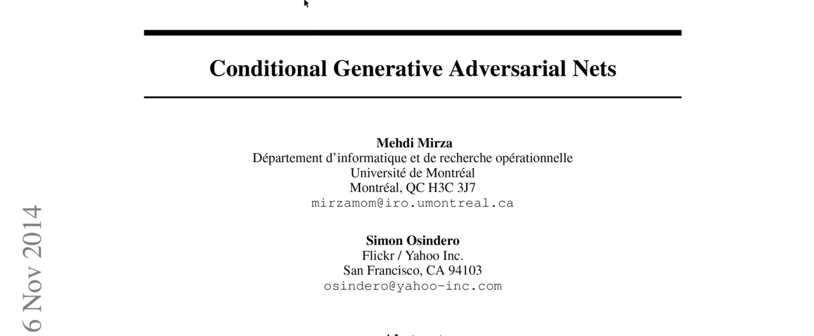

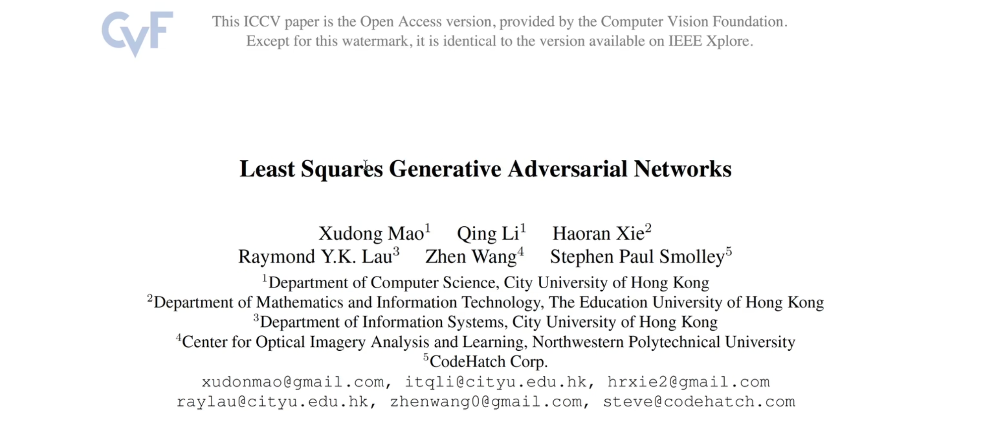

- 条件GAN
- 最小平方GAN or  最小二乘GAN

topic：原理 & 代码实现

minist数据集：6w张手写数字图片

GAN基于minist数据集进行无监督的图片生成任务

## 1 Recall

GAN的代码实现逻辑，首先构建Generator，Generator以一个隐变量，从高斯分布生成的随机隐变量z，作为输入，然后把z放入到很多层DNN中，DNN最后生成图片大小的生成图片，然后通过激活函数约束到一定的值域内，通过nn.Sigmoid() 或者 nn.tanh()都可以：


经过 生成器，生成一张图片

基于 随机高斯变量z，生成一张照片，z的维度可以设置一个latent_dim，比如96，并且令batchsize=64，此时每一次训练的大小 就是 64×96的二维张量

以上是生成器，接下来看判别器：


判别器的作用：

（1）准确的区分出 什么是真实样本 什么是 预测样本

（2）给出信号，使得生成器 更好的生成 更加逼近真实的样本

判别器以 图片作为输入，接着由 一系列的  nn层，谱归一化 是后面加的，最后输出一个标量值，标量值 通过nn.Sigmoid() 输出的，原始的GAN使用的是 二分类 交叉熵 的损失函数，所以使用的是nn.Sigmoid


构建 dataset，dataloader

dataset使用的torchvision的库，对数据集进行下载

解释 torchvision.transforms.Compose中   torchvision.transformsNormalize 为什么使用的 均值=0.5，方差=0.5，如果我们去计算minist数据集均值和方差 的话，均值 大概等于 0.1，标准差约等于0.3，而这里使用的均值和方差为0.5，是因为本来是使用ToTensor的语句，已经把图片的值域约束到了0\~1之间，0~1之间 减去 0.5，变成-0.5到0.5之间，-0.5到0.5再除以0.5，变成-1到1之间，所以这行的语句并不是归一到正态分布，而是把值域从0\~1变化到-1\~1之间，这是写代码的小技巧：在transforms中的组合里面，怎么把上一步的0\~1的浮点数怎么变成-1\~1之间的值域，可以通过均值和标准差归一化实现，此时我们设置均值=0.5，标准差=0.5，从原来的0\~1范围内，变成-1\~1范围内，变换到-1\~1范围内。变成-1\~1范围内，就可以在Generator中，使用tanh函数预测最终的像素值

最终tanh函数虽然输出的是-1\~1，但是我们在保存照片的时候，可以通过增加一个Normalize=True，就可以使得图片从-1\~1，再次变成0 \~1之间

在训练时，


计算g的时候，把预测的照片 送入到判别器中，把全1的标签，作为当前的标签，来得到loss值，来更新Generator

对于判别器而言，有两个loss，


`real_loss` 和 `fake_loss` 

`real_loss` 把真实的照片送入到判别器中，标签是全1 的

`fake_loss`  把预测的照片 送入到判别器中，标签是全0 的

我们希望判别器是能够区分真实照片和预测照片的


之后，依次更新 生成器和判别器即可

以上是原始GAN，通过二分类的、交叉熵loss来作为判别器的loss function

## 2 条件GAN


- 条件GAN
- 应用很广泛
- 引用次数 4k 多次

### 2.1 cGAN的创新点

- 为什么会有 条件GAN？

> 首先讨论原始GAN的生成有什么问题？
>
> 
>
> 原始GAN的图片生成过程，可以看原文的算法1
>
> （1）看判别器的输入，无论是真实的样本，还是预测的样本，输入都只有一个，$x^{(i)}$ 或者 $G(z{(i)})$，只是把照片送入到判别器之中
>
> 
>
> ，但是在minist数据库中，照片有10个类别，0\~9，10个手写字识别，10类的时候，仅仅输入一个随机的高斯变量z的话，没有输入任何其他的信息，并且希望生成器能够生成当前样本，当前从minibatch中，取得的是0，希望在z的指导下，生成0的照片，如果当前真实照片拿到的是1，我们指望随机变量z，生成为1的照片，这样也是可以的，但是有点难，就是给的信息量太少了，z就是一个随机的高斯变量，不确定性很大，因此有助于我们预测目标照片的信息就很少，这时，思考，我们还可以提供什么量呢？我们可以提供一个c，一个condition，也就是说当我们的G的输入，接收的输入不仅仅是z，而是以随机高斯变量z和条件c一起作为输入的时候，c就是condition条件，可以是标签，比如我们当前预测手写字1的照片，就可以将1 的 class信息传入到G之中，这时候G的输入不仅是z还有类别标签1，当做条件c，这时生成器能更好的知道 要生成的 图片是 1，不是2也不是3，可以使得生成器有目标的生成，以上就是cGAN的点

原始GAN公式：


以 $x$ 或者 $G(z)$ 作为输入，也就是原始GAN中以照片作为输入

现在引入$y$


$y$表示 条件信息

比如在MNIST数据集中，$y$可以表示每张照片的标签信息，比如当前手写数字照片是1的话，那这个标签就算是1，如果当前生成手写数字照片是2的话，那么这个标签就是2，也就是把$y$的信息，也作为生成器的输入，此时可以更好地学习目标照片的生成，因为我们指定当前生成器生成"1"的照片，于是我们提供标签等于1，这个信息；如果当前指定生成"2"的照片，我们就传入 "y=2" 的信息 传入网络，以上就是cGAN的论文 提出的改进点，创新思想比较简单，但是应用却很广泛

后面的应用中，基本上都是条件GAN的，而不是完全的一个高斯变量作为生成器的输入信号

### 2.2 网络结构


图：

- 上：生成器
- 下：判别器

**（1）生成器**

生成器的输入除标准的z以外，还有绿色部分，绿色部分就是条件信息

条件信息可以是连续的变量，也可以是离散的变量

比如说 手写字生成任务中，提供的条件信息就是 每一次 手写字的照片，里面数字的类别，提供的一个class信息，且这个class信息是一个one hot的变量，如果把one hot变量直接传入进去，会比较稀疏，最标准的做法，就是按照之前的word embedding一样，把class信息转化成一个 class embedding，然后再跟z拼起来，然后再输入到网络之中，这是标准的作法。（class $\rightarrow$ class embedding）

**（2）判别器**

类似的，在判别器之中，也可以加入条件信息，怎么理解？

判别器每次接收的照片，类别不太一样，比如上次接收照片的是"1"，判别器根据自己的判断，判断1是真的还是假的，第二次给判别器一张"2"的照片，又去判断2是真的还是假的，如果不告诉判别器这张 "1" 的照片 是 1，"2" 的照片是2，两张照片属于不同类别的话，判别器可能很难去判断。但是如果告诉了判别器两张照片是不同类别的话，告诉判别器当前 照片 属于 1 这个类别，判别器判断当前照片是不是真的是1，第二次给判别器 2 这张照片，然后判断当前照片是不是真的是2，所以在判别器当中 也可以引入class信息，引入条件，在minist手写字体识别任务中，判别器的输入可以通过 one hot的class label转换成 class embedding，然后跟图像拼起来，或者把class embedding经过几层DNN再拼起来

以上是cGAN核心的点

## 3 条件GAN 代码实现

```python
import  torch
import torchvision
import torch.nn as nn
import numpy as np
import os

image_size = [1,28,28]
latent_dim = 96
label_emb_dim = 32
batch_size = 64
use_gpu = torch.cuda.is_available()
save_dir = "cgan_images"
os.makedirs(save_dir,exist_ok=True)

class Generator(nn.Moudle):
    def __init__(self):
        super(Generator,self).__init__()

        self.embedding = nn.Embedding(10,label_emb_dim)
        self.model = nn.Sequential(
            nn.Linear(latent_dim+label_emb_dim,128),
            torch.nn.BatchNorm1d(128),
            torch.nn.GELU(),

            nn.Linear(128,256),
            torch.nn.BatchNorm1d(256),
            torch.nn.GELU(),
            nn.Linear(256,512),
            torch.nn.BatchNorm1d(512),
            torch.nn.GELU(),
            nn.Linear(512,1024),
            torch.nn.BatchNorm1d(1024),
            torch.nn.GELU(),
            nn.Linear(1024,np.prod(image_size,dtype=np.int32)),
            nn.Sigmoid(),
        )
    def forward(self,z,labels):
        # shape of z:[batchszie,latent_dim]
        label_embedding = self.embedding(labels)
        z = torch.cat([z,label_embedding],axis=-1)

        output = self.model(z)
        image = output.reshape(z.shape[0],*image_size)

        return image

class Discriminator(nn.Module):
    def __init__(self):
        super(Discriminator,self).__init__()

        self.embedding = nn.Embedding(10,label_emb_dim)
        self.model = nn.Sequential(
            nn.Linear(np.prod(image_size,dtype=np.int32)+label_emb_dim,512),
            torch.nn.GELU(),
            torch.nn.utils.spectral_norm(nn.Linear(512,256)),
            torch.nn.GELU(),
            torch.nn.utils.spectral_norm(nn.Linear(256,128)),
            torch.nn.GELU(),
            torch.nn.utils.spectral_norm(nn.Linear(128,64)),
            torch.nn.GELU(),
            torch.nn.utils.spectral_norm(nn.Linear(64,32)),
            torch.nn.GELU(),
            torch.nn.utils.spectral_norm(nn.Linear(32,1)),
            nn.Sigmoid(),
        )
    def forward(self,image,labels):
        # shape of image:[batchsize,1,28,28]

        label_embedding = self.embedding(labels)
        prob = self.model(torch.cat([image.reshape(image.shape[0],-1),label_embedding],axis=-1))
        return prob


# Training
dataset = torchvision.datasets.MNIST("mnist_data", train=True, download=True,
                                     transform=torchvision.transforms.Compose(
                                         [
                                             torchvision.transforms.Resize(28),
                                             torchvision.transforms.ToTensor(),
                                             #  torchvision.transforms.Normalize([0.5], [0.5]),
                                         ]
                                                                             )
                                     )
dataloader = torch.utils.data.DataLoader(dataset, batch_size=batch_size, shuffle=True, drop_last=True)

generator = Generator()
discriminator = Discriminator()


g_optimizer = torch.optim.Adam(generator.parameters(), lr=0.0003, betas=(0.4, 0.8), weight_decay=0.0001)
d_optimizer = torch.optim.Adam(discriminator.parameters(), lr=0.0003, betas=(0.4, 0.8), weight_decay=0.0001)

loss_fn = nn.BCELoss()
labels_one = torch.ones(batch_size, 1)
labels_zero = torch.zeros(batch_size, 1)

if use_gpu:
    print("use gpu for training")
    generator = generator.cuda()
    discriminator = discriminator.cuda()
    loss_fn = loss_fn.cuda()
    labels_one = labels_one.to("cuda")
    labels_zero = labels_zero.to("cuda")

num_epoch = 200
for epoch in range(num_epoch):
    for i, mini_batch in enumerate(dataloader):
        gt_images, labels = mini_batch


        z = torch.randn(batch_size, latent_dim)

        if use_gpu:
            gt_images = gt_images.to("cuda")
            z = z.to("cuda")

        pred_images = generator(z,labels)
        g_optimizer.zero_grad()

        recons_loss = torch.abs(pred_images-gt_images).mean()

        g_loss = recons_loss*0.05 + loss_fn(discriminator(pred_images,labels), labels_one)

        g_loss.backward()
        g_optimizer.step()

        d_optimizer.zero_grad()

        real_loss = loss_fn(discriminator(gt_images,labels), labels_one)
        fake_loss = loss_fn(discriminator(pred_images.detach(),labels), labels_zero)
        d_loss = (real_loss + fake_loss)

        # 观察real_loss与fake_loss，同时下降同时达到最小值，并且差不多大，说明D已经稳定了

        d_loss.backward()
        d_optimizer.step()

        if i % 50 == 0:
            print(f"step:{len(dataloader)*epoch+i}, recons_loss:{recons_loss.item()}, g_loss:{g_loss.item()}, d_loss:{d_loss.item()}, real_loss:{real_loss.item()}, fake_loss:{fake_loss.item()}")

        if i % 800 == 0:
            image = pred_images[:16].data
            torchvision.utils.save_image(image, f"{save_dir}/image_{len(dataloader)*epoch+i}.png", nrow=4)
```

### 3.1 生成器代码解读

```python
class Generator(nn.Moudle):
    def __init__(self):
        super(Generator,self).__init__()

        self.embedding = nn.Embedding(10,label_emb_dim)
        self.model = nn.Sequential(
            nn.Linear(latent_dim+label_emb_dim,128),
            torch.nn.BatchNorm1d(128),
            torch.nn.GELU(),

            nn.Linear(128,256),
            torch.nn.BatchNorm1d(256),
            torch.nn.GELU(),
            nn.Linear(256,512),
            torch.nn.BatchNorm1d(512),
            torch.nn.GELU(),
            nn.Linear(512,1024),
            torch.nn.BatchNorm1d(1024),
            torch.nn.GELU(),
            nn.Linear(1024,np.prod(image_size,dtype=np.int32)),
            nn.Sigmoid(),
        )
    def forward(self,z,labels):
        # shape of z:[batchszie,latent_dim]
        label_embedding = self.embedding(labels)
        z = torch.cat([z,label_embedding],axis=-1)

        output = self.model(z)
        image = output.reshape(z.shape[0],*image_size)

        return image
```

cGAN进行手写字生成任务

- 生成器的forward函数中，加入labels信息
- labels表示希望生成器要生成指定的目标，而不是随便生成的，比如有10个类别，0\~9个不同类别的照片，通过指定label，比如指定1就生成1的图像，指定2就生成2的照片，这就是条件信息，通过labels传入，labels就是离散的标签变量，既然是离散的

```python
    def forward(self,z,labels):
        # shape of z:[batchszie,latent_dim]
        label_embedding = self.embedding(labels)
        z = torch.cat([z,label_embedding],axis=-1)

        output = self.model(z)
        image = output.reshape(z.shape[0],*image_size)

        return image
```

（1）第一步，通过embedding table把label传入到embedding table去找到对应的embedding vector，得到label embedding，这是第一步，把离散的label 类别信息 转化成连续的 浮点向量，

（2）第二步，得到embedding向量之后，把这个向量最简单的是，跟z拼起来，当然这个效果不一定最好，可以常识不同的特征构造方法

以上步骤得到了新的z，这个z包含了条件信息的量，这时把z继续送入到之前的生成器主干网络中，由DNN和非线性激活函数构成的主干网络之中，的都最后的image

以上在生成器之中，引入了 条件信息，这里的改变：

- `self.embedding = nn.Embedding(10,label_emb_dim)`  init中 添加了embedding的量，实例化是10行，因为有10类手写数字，第二维 `label_emb_dim` 也就是 `label_embedding` 的维度，设置为32，在forward函数中，需要把 labels 作为参数，作为一部分输入传入  `self.model`

### 3.2 判别器代码解读

```python
class Discriminator(nn.Module):
    def __init__(self):
        super(Discriminator,self).__init__()

        self.embedding = nn.Embedding(10,label_emb_dim)
        self.model = nn.Sequential(
            nn.Linear(np.prod(image_size,dtype=np.int32)+label_emb_dim,512),
            torch.nn.GELU(),
            torch.nn.utils.spectral_norm(nn.Linear(512,256)),
            torch.nn.GELU(),
            torch.nn.utils.spectral_norm(nn.Linear(256,128)),
            torch.nn.GELU(),
            torch.nn.utils.spectral_norm(nn.Linear(128,64)),
            torch.nn.GELU(),
            torch.nn.utils.spectral_norm(nn.Linear(64,32)),
            torch.nn.GELU(),
            torch.nn.utils.spectral_norm(nn.Linear(32,1)),
            nn.Sigmoid(),
        )
    def forward(self,image,labels):
        # shape of image:[batchsize,1,28,28]

        label_embedding = self.embedding(labels)
        prob = self.model(torch.cat([image.reshape(image.shape[0],-1),label_embedding],axis=-1))
        return prob
```

- 判别器的 `forward` 函数中，也需要传入labels告诉判别器当前类别是 类别1 还是类别2 ，帮助判别器更好的做出判断
- 修改1：首先 `def forward(self,image,labels)`  forward函数中加入 labels
- 修改2： `label_embedding = self.embedding(labels)` 离散变量转化成连续变量，通过embedding table得到`label embedding`的向量
- 修改3：接着把 `label embedding`的向量 ，跟 image 进行拼接 ：

`torch.cat([image.reshape(image.shape[0],-1),label_embedding],axis=-1)`

这是最简单的处理，如果效果不好，可以尝试更改，借鉴其他的网络的做法 把 `label embedding` 引入网络， 作为主干网络的输入，最后得到 0\~1之间的概率值：`nn.Sigmoid()`

### 	3.3 train函数的修改

（1）`pred_images = generator(z,labels)`

在训练网络的时候需要把 `labels`也传入网络

`labels`怎么来的呢？ `gt_images, labels = mini_batch` 对`mini_batch`解析出来的

（2）` g_loss = recons_loss*0.05 + loss_fn(discriminator(pred_images,labels), labels_one)`

把预测的照片传入到  discriminator 中，同样也需要带上 条件信息labels

也就是说需要对生成器和判别器都需要加入condition信息

（3）在计算 real loss和fake loss时，都需要把labels传入discriminator之中

```python
        real_loss = loss_fn(discriminator(gt_images,labels), labels_one)
        fake_loss = loss_fn(discriminator(pred_images.detach(),labels), labels_zero)
```

以上，所有条件GAN的代码实现

## 4 最小平方GAN

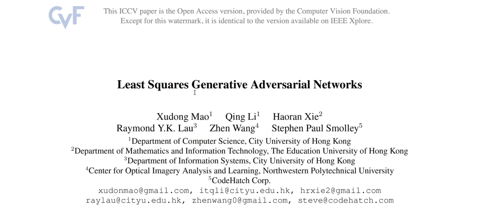

- 最小平方GAN or 最小二乘GAN or LSGAN
- cGAN：条件GAN
- LSGAN：最小平方GAN
- 引用量：3k左右，很高
- 现在用的GAN已经很少是原始GAN，不用二分类交叉熵的损失函数，现在很多损失函数都是用的LSGAN的损失函数，类似回归任务而不是分类任务

### 	4.1 摘要


- 基于GAN的无监督学习大获成功
- 标准的GAN把判别器当成分类器，采用sigmoid的交叉熵损失函数，但是sigmoid损失函数会导致梯度消失的问题
- 为了克服梯度消失的问题，本文提出LSGAN
- LSGAN采用最小平方误差函数，对于判别器而言采用最小平方误差函数
- 当采用 最小平方误差损失函数时，相当于优化 `皮尔逊开方散度`  ： $\mathrm{Pearson  \  \mathcal{X}^2 \  divergence} $ 
- 在GAN的论文中，同样也是在优化一个散度：

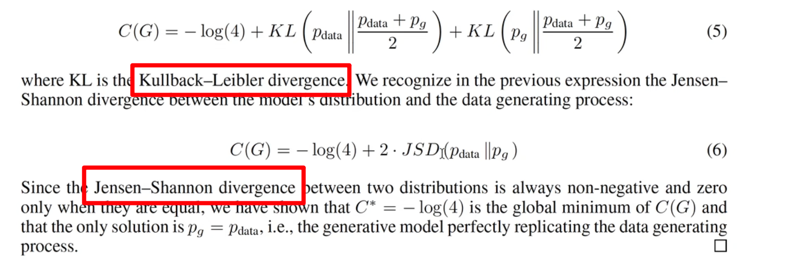

① KL散度

② 詹森-香农 散度

- LSGAN相比原始GAN的两个优点：

（1）LSGAN可以产生更高质量的图片

（2）LSGAN在训练过程中更加稳定

### 	4.2 本文的贡献

本文的三个贡献点（原文Intro最后一段）

（1）

- 提出了LSGAN，采用最小平方的误差函数，在原始GAN中采用的二分类交叉熵误差函数（BCE、基于Sigmoid、二分类产生0  \~1的概率） 

- 在最小化 LSGAN目标函数的时候，相当于在最小化 皮尔逊开方散度（有推导）

（2）

经过数据集上实验对比，LSGAN能产生更加逼真的照片

（3）

将LSGAN应用到中文的手写字生成上，发现LSGAN也能产生可懂的中文汉字

### 	4.3 原文3 Method


- 回顾GAN的公式
- 展示LSGAN的公式
- 介绍两个LSGAN的模型

#### 	3.1 GAN的学习过程

GAN的学习过程学习一个 判别器$D$和一个生成器$G$，这两个是同时训练的；

**生成器G**

$G$的目标是学到数据$x$的分布$p_g$

$G$从一个均匀分布 或者 高斯分布中，采样一个输入变量 $z$，被采样的分布记为 $p_z(z)$

通过生成器$G$，将输入变量$z$，通过可微（differentiable netwark）的网络 映射到一个新的空间上，记作 $G(z;\theta_g)$ ，也就是说 通过 $生成器生成的数据 \sim p_G$

**判别器D**

判别器D是一个分类器

判别器D的目标是准确的识别出一张照片是来自训练集还是来自生成器所生成的数据

**标准GAN的目标函数**


- 是一个 minmax的公式
- GAN需要同时优化两个网络：G&D

（1）当优化$D$的时候，希望$V$达到最大 $\mathrm{max_d}$

等价于当$x$服从$p_{data}$分布的时候，$logD(x)$达到最大，同时当$z$服从$p_z$分布的时候，希望$log1-D(G(z))$也达到最大，这是当优化$D$的时候

（2）当优化$G$的时候，是一个$\mathrm{min_G}$函数，希望这个函数达到最小

当优化$G$的时候，希望$V$达到最小，首先忽略第一项，因为第一项不包含$G$，只看第二项，当优化G的时候，当$z$服从$p_z$分布的时候，希望 $log(1-D(G(z)))$ 达到最小

以上是标准GAN，minmax

$\mathbb{E}$ 表示期望值，期望值的意思是需要考虑到整个分布，通过小批次训练不断逼近期望值

#### 	3.2 LSGAN

<u>**梯度消失问题**</u>

- 当把判别器当做分类器的时候，标准的GAN采用基于Sigmoid的交叉熵误差函数
- 当更新生成器的时候，标准的GAN会导致梯度消失的问题，为了弥补这个问题，提出LSGAN

可视化 梯度消失问题：

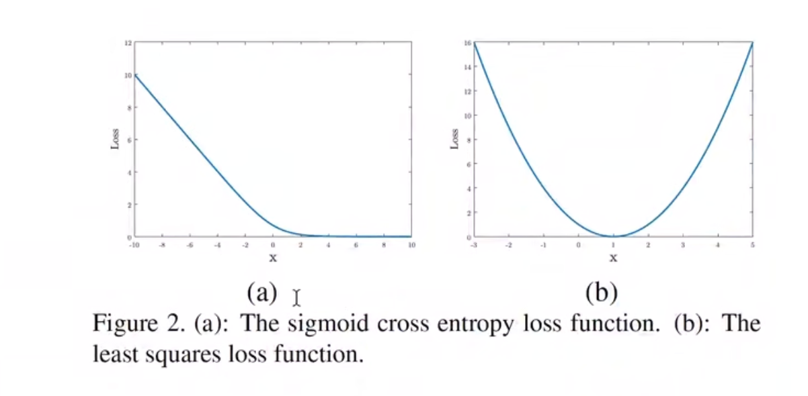

(a)sigmoid的交叉熵误差函数图，从loss曲线可以看到，当x>2时，loss的斜率开始接近于0，而且不怎么变化，也就是说当x逐渐变大时，loss接近于饱和，梯度一直处在0的位置上，这并不利于参数的更新

演示这个图像是怎么来的：

```python
import torch
import torch.nn as nn
import matplotlib.pyplot as plt

logits = torch.linspace(-10,10,2000)
loss = []
loss_fn = nn.BCELoss()
for lgs in logits:
    loss.append(loss_fn(torch.sigmoid(lgs),torch.ones_like(lgs)))

plt.plot(logits,loss)
plt.show()
```

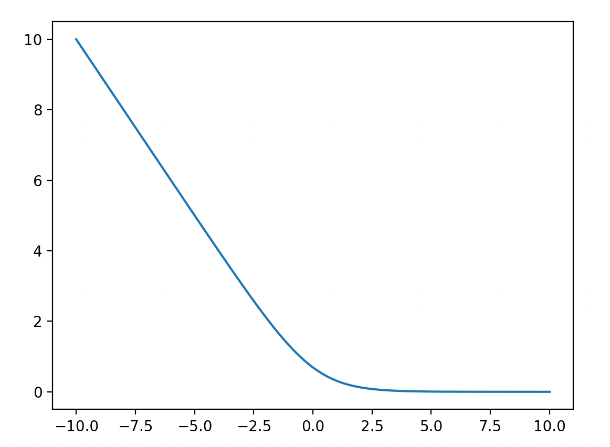

- 刻度不一样，形状和原文是一样的
- sigmoid ce的图像：表示sigmoid交叉熵的图像
- logits从-10变化到10，loss从10变化到0，但是0是大概到2的时候，就已经到0了，当logits从2到10的时候，可以认为 logits就是不变了，梯度就消失了
- x轴是 预测概率 logits，y轴是对应的loss，把真实标签设置为1 的loss

① `logits = torch.linspace(-10,10,2000)`

首先随机生成logits，进入判别器之前，生成器预测的值

linspace生成-10到10之间，2000个点的logits

② 

```python
loss = []
loss_fn = nn.BCELoss()
for lgs in logits:
    loss.append(loss_fn(torch.sigmoid(lgs),torch.ones_like(lgs)))
```

生成loss函数，实例化loss function，nn.BCELoss()

计算每一个logits，对应的BCELoss是什么

对logits进行遍历得到lgs，把lgs传入到sigmoid之中，得到预测概率值

接下来将 预测概率值 `torch.sigmoid(lgs)` 和真实值 `torch.ones_like(lgs)` 传入到 BCELoss实例化的 `loss_fn` 得到loss，将loss添加到列表中，得到每一个lgs对应的loss

③

可视化

以logits作为x轴，loss作为y轴 **plt**.**plot**(logits,loss)

**plt**.**show**() 可视化

以上通过图像，直观地给出了原始GAN遇到的梯度消失的问题

**<u>LSGAN</u>**


- 为了弥补梯度消失的问题，提出了LSGAN
- 假设用判别器 a,b的编码方案，来作为真实标签和虚假标签，也就是是说把fake data的标签定义为a，real data的标签定义为b，此时得到LSGAN的目标函数：

$\mathrm{min}_DV_{LSGAN}(D) = \frac{1}{2}\mathbb{E}_{x\sim {p_{data}}}[(D(x)-b)^2] + \frac{1}{2}\mathbb{E}_{z\sim {p_z(z)}}[(D(G(z))-a)^2]$

$\min_GV_{LSGAN}(G) = \frac{1}{2}\mathbb{E}_{z\sim{p_z(z)}}[(D(G(z))-c)^2]$

（1）优化D，分为两步，real loss（真实数据对应的loss）和fake loss（生成器生成的虚假数据对应的loss）

- real loss输入的是x（真实数据），希望模型预测出来的标签是b

（先设置a、b、c的符号表示，关于abc具体地设置，等下会说）

- 把生成器的输出 G(z) 输入到判别器中，希望预测的标签是a

以上是优化判别器

（2）优化生成器G，用的标签是c

（3）

这里没有log函数，用的是交叉熵函数

把判别器用回归的值表示，优化的是判别器与标签值，所以叫最小平方GAN

从标准GAN过渡到最小平方GAN，就是将原来的二分类分类任务转化成一个回归任务，并且判别器是设置的不同的回归标签，优化的是最小平方差，叫做最小平方GAN

前面有一个 $\frac{1}{2}$ 是为了求导以后，2× $\frac{1}{2}$ 约掉

（4）再次强调 LSGAN的目标函数

<u>在LSGAN中，优化D的目标函数是</u> 

$\mathrm{min}_DV_{LSGAN}(D) = \frac{1}{2}\mathbb{E}_{x\sim {p_{data}}}[(D(x)-b)^2] + \frac{1}{2}\mathbb{E}_{z\sim {p_z(z)}}[(D(G(z))-a)^2]$

$\frac{1}{2}$ 的 当 $x$服从 $p_{data}$ 的分布的时候，$D(x)-b 的平方$ 的期望 加上 $\frac{1}{2}$ 的 当z 服从 $p_z$ 的时候，$D(G(z))-a的平方$ 的期望 

<u>优化生成器G的时候</u>

$\min_GV_{LSGAN}(G) = \frac{1}{2}\mathbb{E}_{z\sim{p_z(z)}}[(D(G(z))-c)^2]$

优化的是 $\frac{1}{2}$ 的 当z服从 $p_{z(z)}$ 分布的时候，$D(G(z)) - c 平方$的期望

通过 优化两个期望，来优化判别器和生成器

以上是LSGAN的定义

#### 	3.3 LSGAN 的推导

优化 LSGAN 等价于 优化 皮尔逊开方散度

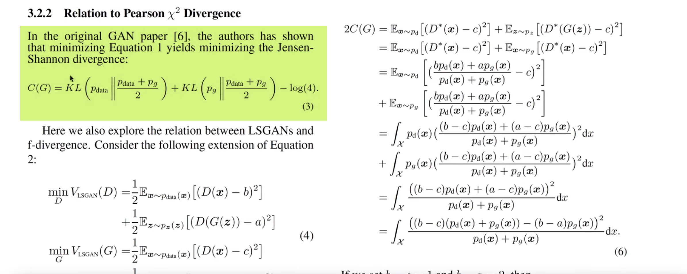

- 在原始GAN中，优化 价值函数 等价于 优化 詹森-香农散度

  LSGAN：

  

  （1）首先 对于 $\min_G$  加上一个   $\frac{1}{2}\mathbb{E}_{x\sim {p_{data}}}[(D(x)-c)^2]$

  得到：

  $\mathrm{min}_GV_{LSGAN}(G) = \frac{1}{2}\mathbb{E}_{x\sim {p_{data}}}[(D(x)-c)^2] + \frac{1}{2}\mathbb{E}_{z\sim {p_z(z)}}[(D(G(z))-c)^2]$

  因此生成器和判别器都写成了两部分：

  $\mathrm{min}_DV_{LSGAN}(D) = \frac{1}{2}\mathbb{E}_{x\sim {p_{data}(x)}}[(D(x)-b)^2] + \frac{1}{2}\mathbb{E}_{z\sim {p_z(z)}}[(D(G(z))-a)^2]$

  $\mathrm{min}_GV_{LSGAN}(G) = \frac{1}{2}\mathbb{E}_{x\sim {p_{data}(x)}}[(D(x)-c)^2] + \frac{1}{2}\mathbb{E}_{z\sim {p_z(z)}}[(D(G(z))-c)^2]$

  <u>第一部分</u>：当 $x\sim p_{data}(x)$ 分布（real真实分布）的时候，$D(x)$跟标签b或者标签c的平方差

  <u>第二部分</u>：当 $x\sim p_z(z)$ 分布（fake生成分布）的时候，$D(G(x))$跟标签a或者标签c的平方差

原文：


也提到了，对于 $V_{LSGAN}(G)$ 中添加一项 $\mathbb{E}_{x \sim p_{data}(x)}[(D(x)-c)^2]$ 并不改变最优值，因为添加的一项并不包含 参数G

但是添加一项，会方便推导

再次公式：

$\mathrm{min}_DV_{LSGAN}(D) = \frac{1}{2}\mathbb{E}_{x\sim {p_{data}(x)}}[(D(x)-b)^2] + \frac{1}{2}\mathbb{E}_{z\sim {p_z(z)}}[(D(G(z))-a)^2]$

$\mathrm{min}_GV_{LSGAN}(G) = \frac{1}{2}\mathbb{E}_{x\sim {p_{data}(x)}}[(D(x)-c)^2] + \frac{1}{2}\mathbb{E}_{z\sim {p_z(z)}}[(D(G(z))-c)^2]$


当对于固定的G，推导出最优判别器D，具体的推导过程，换元 令 $x = G(z)$ ：

$z \sim p_{z}(z))  \rightarrow  x \sim p_{g}$

因此

$\mathrm{min}_DV_{LSGAN}(D) = \frac{1}{2}\mathbb{E}_{x\sim {p_{data}(x)}}[(D(x)-b)^2] + \frac{1}{2}\mathbb{E}_{z\sim {p_z(z)}}[(D(G(z))-a)^2]$

推导出：

期望写成积分

$\min_DV_{LSGAN}(D) $

$= \frac{1}{2}\mathbb{E}_{x\sim {p_{data}(x)}}[(D(x)-b)^2] + \frac{1}{2}\mathbb{E}_{z\sim {p_z(z)}}[(D(G(z))-a)^2]$

$= \int_x p_{data}(x)(D(x)-b)^2dx + \int_z p_z(z)(D(G(z))-a)^2dz $

$= \int_x p_{data}(x)(D(x)-b)^2dx +  p_g(x)(D(x)-a)^2dx $

积分号里面，展开，是一个二次方项，关于$D(x)$的一元二次方程：

$p_{data} (D^2(x)-2bD(x)+b^2) + p_g((D^2(x)-2aD(x)+a^2))$

$= (p_{data}+p_g)D^2(x)-2(ap_g+bp_{data})D(x)+(b^2p_{data}+a^2p_g)$

最小值 $D^*(x)=-\frac{b}{2a}=-\frac{-2(ap_g+bp_{data})}{2(p_{data}+p_g)}=\frac{ap_g+bp_{data}}{p_{data}+p_g}=\frac{ap_g(x)+bp_{data}(x)}{p_{data}(x)+p_g(x)}$ 

也就是 固定生成器，得到最优的判别器：

$D^*(x)= \frac{ap_g(x)+bp_{data}(x)}{p_{data}(x)+p_g(x)}$

> （以上推导 模仿原始GAN：
>
> 
>
> ）

接下来，


用 $p_d$ 表示 $p_{data}$

然后把 公式4 的 $V_{LSGAN}(G)$  [写成](https://arxiv.org/pdf/1611.04076)：

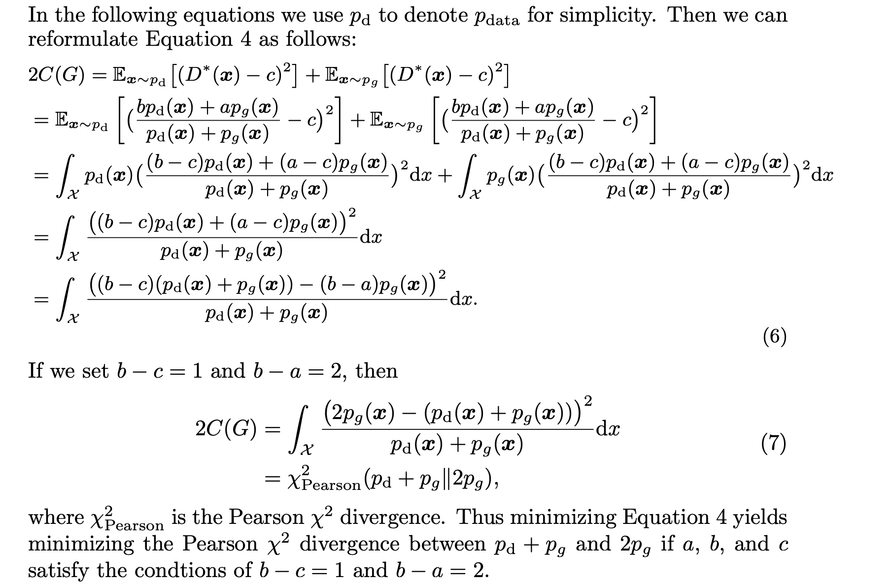

上面 我们优化完了 判别器，处理的是第一个式子：

$\mathrm{min}_DV_{LSGAN}(D) = \frac{1}{2}\mathbb{E}_{x\sim {p_{data}(x)}}[(D(x)-b)^2] + \frac{1}{2}\mathbb{E}_{z\sim {p_z(z)}}[(D(G(z))-a)^2]$

接下来 优化生成器，第二个式子：

$\mathrm{min}_GV_{LSGAN}(G) = \frac{1}{2}\mathbb{E}_{x\sim {p_{data}(x)}}[(D(x)-c)^2] + \frac{1}{2}\mathbb{E}_{z\sim {p_z(z)}}[(D(G(z))-c)^2]$

（1）首先，按照论文所说，$p_{data}$ 写成 $p_d$

还有几点注意：

- $V_{LSGAN}$ 改写成 $C(G)$  表示 代价 是一个意思
- 等式左右两边同时$×2$
- $D(x)$ 全部替换为 $D^*(x)$

$∴$

$2C(G) = \mathbb{E}_{x \sim p_d}[(D^*(x)-c)^2]+\mathbb{E}_{x \sim p_z}(D^*(G(z))-c)^2$

$z$换元成 $G(z)$

$x服从p_z$ 换元成 $x服从p_g$ 

$= \mathbb{E}_{x \sim p_d}[(D^*(x)-c)^2]+\mathbb{E}_{x \sim p_g}(D^*(x)-c)^2$

接下来 代入 $D^*(x)=\frac{ap_g(x)+bp_{data}(x)}{p_{data}(x)+p_g(x)}$

$= \mathbb{E}_{x \sim p_d}[(\frac{ap_g(x)+bp_{data}(x)}{p_{data}(x)+p_g(x)}-c)^2]+\mathbb{E}_{x \sim p_g}(\frac{ap_g(x)+bp_{data}(x)}{p_{data}(x)+p_g(x)}-c)^2$

接下来 将 期望改写成积分的形式：

$= \int_x(\frac{ap_g(x)+bp_{data}(x)}{p_{data}(x)+p_g(x)}-c)^2 p_d(x)dx+\int_x(\frac{ap_g(x)+bp_{data}(x)}{p_{data}(x)+p_g(x)}-c)^2p_g(x)dx$

c通项 合并  以 $p_g$  $p_{data}$ 为基准($p_{data}$和$p_d$ 是一个东西，不同记号，后面就统一)

$= \int_x(\frac{ap_g(x)+bp_{data}(x)}{p_{data}(x)+p_g(x)}-c)^2 p_d(x)dx+\int_x(\frac{ap_g(x)+bp_{data}(x)}{p_{data}(x)+p_g(x)}-c)^2p_g(x)dx$

$= \int_x(\frac{ap_g(x)+bp_{data}(x)}{p_{data}(x)+p_g(x)}-c\frac{p_g(x)+p_{data}(x)}{p_{data}(x)+p_g(x)})^2 p_d(x)+(\frac{ap_g(x)+bp_{data}(x)}{p_{data}(x)+p_g(x)}-c\frac{p_g(x)+p_{data}(x)}{p_{data}(x)+p_g(x)})^2p_g(x)dx$


$= \int_x p_d (\frac{(a-c)p_g+(b-c)p_d}{p_{d}+p_g})^2+p_g(\frac{(a-c)p_g+(b-c)p_d}{p_d+p_g})^2dx$

平方项 相等，合并 ，同时和分母消去一个 $(p_d + p_g)$

$=\int_x  \frac{((a-c)p_g + (b-c)p_d)^2}{p_d+p_g} dx$

分母是一次项，分子是二次项，对分子平方里面做变换，对$p_g$ 做 $-b+b$ 的操作：

$=\int_x  \frac{((a-b+b-c)p_g + (b-c)p_d)^2}{p_d+p_g} dx$

$=\int_x  \frac{((b-c)(p_d+p_g)-(b-a)p_g)^2}{p_d+p_g} dx$

写成 这个形式以后，令 $b-c=1，b-a=2$，刚好是皮尔逊开方散度的公式：

$2C(G) = \int_x \frac{((p_d+p_g)-2p_g)^2}{p_d+p_g}dx$

平方里面，改变 项的次序：

$2C(G) = \int_x \frac{(2p_g-(p_d+p_g))^2}{p_d+p_g}dx$

$=\mathcal{X}^2_{Pearson}(p_d+p_g||2p_g)$


表示 $2p_g$ 与 $p_d + p_g$ 两个分布之间的 皮尔逊开方散度公式，也就是说 当我们在优化 公式


当我们在优化公式(4)的时候，相当于在优化公式(7)：$2p_g$ 和 $p_d + p_g$两个分布的 皮尔逊开方散度

需要满足的条件

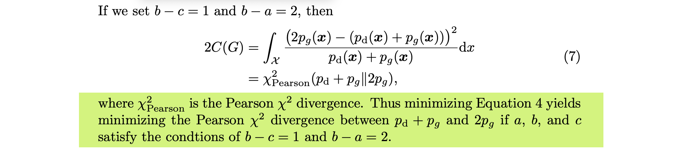

- b-c=1（标签b 减去 标签c 的值=1）
- b-a=1（标签b 减去 标签a的值=2）

散度 一般 大于等于 0，也就是 $p_g + p_d =2p_g$ 散度达到最小，等价于 $p_g = p_d$ ，也就是$生成器的数据分布=训练集真实的数据分布$，也就是此时 生成器G 达到最优

#### 	3.4 实际的参数设置

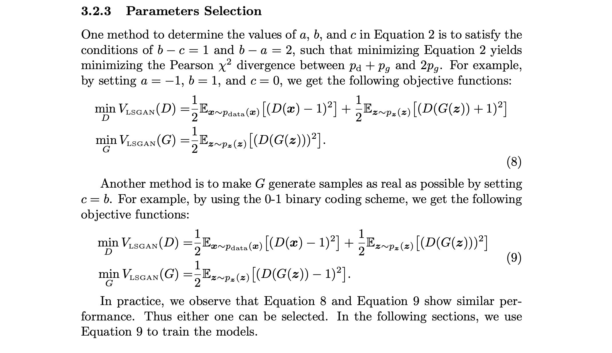

- 确定 方程2 中a、b、c三个值，需要满足条件 $b-c=1$，并且 $b-a=2$ ，此时 相当于优化 $2p_g$ 和 $p_d+p_g$  两个分布 的皮尔逊开方散度


- 比如设置 $a=-1、b=1、c=0$，此时目标函数 写成 公式8的形式

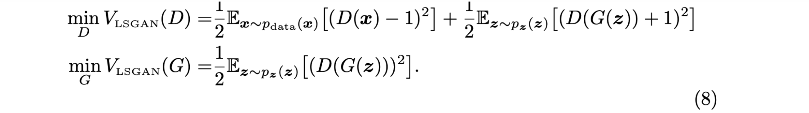

此时 相当于优化皮尔逊开方散度

- 另外一种方式


让生成器尽可能跟真实样本一样，也就是令$c=b$

如公式9所示，采用01编码：

（1）优化生成器的时候，令$真实值=1$ 等价于 D(x)=1，把D(G(z))也尽可能接近真实样本，所以标签也等于1；

（2）同时在 优化判别器的时候，令$D(G(Z))=0、D(x)=1$

以上 公式（8 ）和公式（9），都是LSGAN目标函数的写法：


虽然公式（8）和公式（9）实验效果是相似的，在实际使用中，公式（9）的写法更常见，在原本的实验中，也是使用的公式（9）训练模型

以上是LSGAN的原理

## 5 最小平方GAN代码实现

代码修改：

原始GAN用的BCELoss，LSGAN把BCELoss改了，用MSELoss，具体到公式（9），就是遇到真实样本用标签1，遇到生成器生成的样本，判别器优化$D(G(z))$的目标是0

ls_cgan_minist.py

在cgan的基础上进行修改，只需要修改损失函数即可

```python
""" 基于MNIST 实现对抗生成网络 (GAN) """

import torch
import torchvision
import torch.nn as nn
import numpy as np

image_size = [1, 28, 28]
latent_dim = 96
batch_size = 64
use_gpu = torch.cuda.is_available()

class Generator(nn.Module):

    def __init__(self):
        super(Generator, self).__init__()

        self.model = nn.Sequential(
            nn.Linear(latent_dim, 128),
            torch.nn.BatchNorm1d(128),
            torch.nn.GELU(),

            nn.Linear(128, 256),
            torch.nn.BatchNorm1d(256),
            torch.nn.GELU(),
            nn.Linear(256, 512),
            torch.nn.BatchNorm1d(512),
            torch.nn.GELU(),
            nn.Linear(512, 1024),
            torch.nn.BatchNorm1d(1024),
            torch.nn.GELU(),
            nn.Linear(1024, np.prod(image_size, dtype=np.int32)),
            #  nn.Tanh(),
            nn.Sigmoid(),
        )

    def forward(self, z):
        # shape of z: [batchsize, latent_dim]

        output = self.model(z)
        image = output.reshape(z.shape[0], *image_size)

        return image


class Discriminator(nn.Module):

    def __init__(self):
        super(Discriminator, self).__init__()

        self.model = nn.Sequential(
            nn.Linear(np.prod(image_size, dtype=np.int32), 512),
            torch.nn.GELU(),
            nn.Linear(512, 256),
            torch.nn.GELU(),
            nn.Linear(256, 128),
            torch.nn.GELU(),
            nn.Linear(128, 64),
            torch.nn.GELU(),
            nn.Linear(64, 32),
            torch.nn.GELU(),
            nn.Linear(32, 1),
            nn.Sigmoid(),
        )

    def forward(self, image):
        # shape of image: [batchsize, 1, 28, 28]

        prob = self.model(image.reshape(image.shape[0], -1))

        return prob

# Training
dataset = torchvision.datasets.MNIST("mnist_data", train=True, download=True,
                                     transform=torchvision.transforms.Compose(
                                         [
                                             torchvision.transforms.Resize(28),
                                             torchvision.transforms.ToTensor(),
                                             #  torchvision.transforms.Normalize([0.5], [0.5]),
                                         ]
                                                                             )
                                     )
dataloader = torch.utils.data.DataLoader(dataset, batch_size=batch_size, shuffle=True, drop_last=True)

generator = Generator()
discriminator = Discriminator()


g_optimizer = torch.optim.Adam(generator.parameters(), lr=0.0003, betas=(0.4, 0.8), weight_decay=0.0001)
d_optimizer = torch.optim.Adam(discriminator.parameters(), lr=0.0003, betas=(0.4, 0.8), weight_decay=0.0001)

# loss_fn = nn.BCELoss()
loss_fn = nn.MSELoss()

labels_one = torch.ones(batch_size, 1)
labels_zero = torch.zeros(batch_size, 1)

if use_gpu:
    print("use gpu for training")
    generator = generator.cuda()
    discriminator = discriminator.cuda()
    loss_fn = loss_fn.cuda()
    labels_one = labels_one.to("cuda")
    labels_zero = labels_zero.to("cuda")

num_epoch = 200
for epoch in range(num_epoch):
    for i, mini_batch in enumerate(dataloader):
        gt_images, _ = mini_batch


        z = torch.randn(batch_size, latent_dim)

        if use_gpu:
            gt_images = gt_images.to("cuda")
            z = z.to("cuda")

        pred_images = generator(z)
        g_optimizer.zero_grad()

        recons_loss = torch.abs(pred_images-gt_images).mean()

        g_loss = recons_loss*0.05 + loss_fn(discriminator(pred_images), labels_one)

        g_loss.backward()
        g_optimizer.step()

        d_optimizer.zero_grad()

        real_loss = loss_fn(discriminator(gt_images), labels_one)
        fake_loss = loss_fn(discriminator(pred_images.detach()), labels_zero)
        d_loss = (real_loss + fake_loss)

        # 观察real_loss与fake_loss，同时下降同时达到最小值，并且差不多大，说明D已经稳定了

        d_loss.backward()
        d_optimizer.step()

        if i % 50 == 0:
            print(f"step:{len(dataloader)*epoch+i}, recons_loss:{recons_loss.item()}, g_loss:{g_loss.item()}, d_loss:{d_loss.item()}, real_loss:{real_loss.item()}, fake_loss:{fake_loss.item()}")

        if i % 400 == 0:
            image = pred_images[:16].data
            torchvision.utils.save_image(image, f"image_{len(dataloader)*epoch+i}.png", nrow=4)
```

直接看loss function，由BCELoss换成MSELoss()


- loss function从BCELoss修改成MSELoss
- 具体到优化生成器的时候，传入的也是 labels_one


只不过是把从前的分类任务变成了回归任务

- 同样在计算判别器的 real loss和fake loss的时候，


在计算 real loss的时候，也是传入全1 的 浮点型

在计算fake loss的时候，传入的是全0的浮点型

也就是把从前的两个分类loss BCELoss，改成两个 平方差的 回归loss
