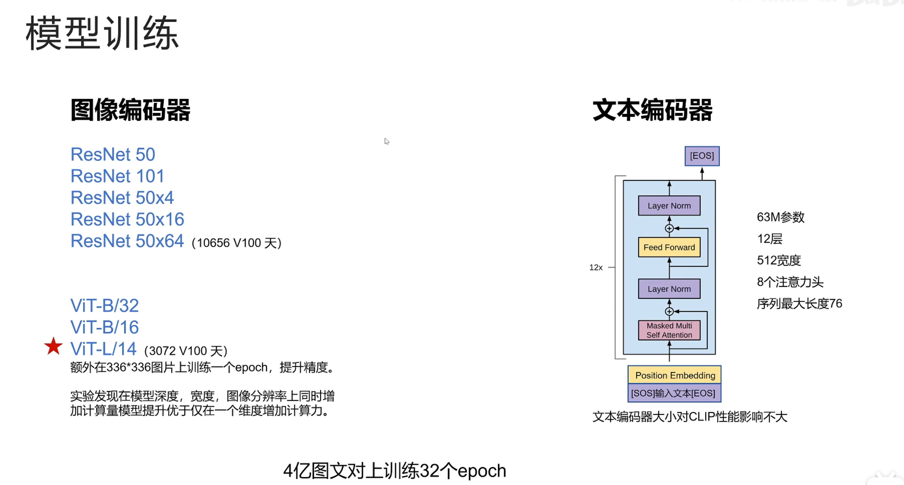
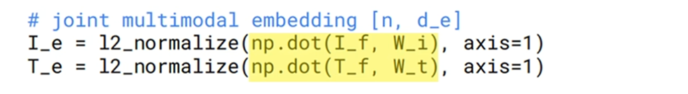

# CLIP

## 动机

之前的图片分类网络都只能对固定类别进行分类，不论是 ImageNet 的 1000 类，CIFAR10 的 10 类，还是CIFAR100 的 100 类，带来的问题有两个：

（1）训练好的模型能对固定类别进行分类，不能迁移到其他类别

（2）固定好的类别需要根据类别来标注数据，费时费力

由此引发思考：有没有视觉模型不用对数据进行标注就可以训练，并且可以对任意类别进行预测，不用事先固定分类的类别？

## 启发

在作者提出 CLIP 模型的同时，自然语言处理领域因为 Transformer 架构的提出发生了翻天覆地的变化

Encoder的部分成就了 Bert；decoder 部分成就了 GPT

首先看 Bert 模型，预测任务有两个，但都是自监督的，不需要人工标注数据

（1）第 1 个任务是训练带掩码的语言模型，就是把一句话里面的部分词遮住，让模型根据上下文预测被遮住的词

（2）第 2 个任务是给出两句话，让模型判断两句话是否在原文中是连续的

这两个代理任务，一个训练了模型对词语的理解能力，一个训练了模型对整个句子的理解能力，于是得到了一个非常好的自然语言理解预训练模型

**（Bert 模型）**

Bert 解决了训练数据的标注问题，但是没有解决在下游任务上依然需要微调的问题，不论是单词级别的命名实体识别还是句子级别的情绪识别，都还是需要加一层线性分类头进行微调

**（GPT 模型）**

以 GPT3 为例，它的训练数据也不需要人工标注，任务就是文字接龙，根据前文预测下一个字

同时也解决了模型迁移的问题，GPT3 通过 prompt 可以完成各种任务包括翻译、情绪识别、命名实体识别等

只要把任务通过 prompt 告诉 GPT3，它就能完成对应的任务，而不需要在下游任务上进行迁移学习

GPT3 是 OpenAI 的工作，CLIP 也是 OpenAI 提出的，所以自然就想到是否能用自监督学习解决数据需要标注的问题，同时利用 Prompt 来实现下游任务需要迁移学习的问题

### 关于自监督学习

自监督学习 & 杨立昆蛋糕图

**解读 杨立昆蛋糕图**

如果把模型学到的东西比作 1 个蛋糕的话：

- 强化学习可以学到的东西就是蛋糕上的樱桃，非常少
- 监督学习能够学到的东西就是蛋糕外层的糖霜
- 而自监督学习能够学到的东西才是这个蛋糕的本质

**怎么理解 杨立昆蛋糕图？**

- 强化学习的模型监督信号只有单一的奖励制，信息非常少
- 监督学习模型的监督信号是人造的类别信息
- 而自监督学习监督信号就是真实的输入

> 比如 GPT3 模型用的大量真实文本训练，预测的就是真实的文本，也就使得 GPT3 取得了很好的效果

## 数据

OpenAI 作为大公司，在训练 CLIP 时，收集了4 亿个文本图片对，其中光文本的量就和训练 GPT2 的文本相当

如图是文本对的例子

如果传统的分类模型，第一张图片可能被打上草地的标签，监督信号就只有"草地"，第二张图片图片就被打上"房间"的标签

接下来，看实际的文本是如何描述第一张图的"湿漉漉的银杏洒满草坪......"，第二张图的文字"小猫，蜷缩在床上......"

可以明显看到"草地"、"房间"这样的标签相比实际收集到的文本含有更多的信息量，对图片的描述也更加细节，也就是说有更多的监督信号

如果能充分利用这些监督信号，一定可以训练出更好的模型

## 论文题目

看 CLIP 原论文的题目：利用自然语言的监督信号学习一个可迁移的视觉模型

这里的可迁移指的是在下游任务时不需要再训练模型，哪怕是分类头也不再需要。

**思考：那如何利用自然语言的监督信号呢？**

## 训练任务

刚开始OpenAI 想到的是通过图片来预测文本，可是训练时发现训练速度太慢了，为什么呢？

因为根据一张图片生成文本本来就是一个很难的任务，对于同一张图片可以有无数种正确的答案

> 比如左图描述可以是
>
> （1）湿漉漉的银杏洒满草坪，宣告着秋天的结束
>
> （2）路边的绿色草地上有很多黄色叶子
>
> （3）深秋的路边满是落叶

所以作者就改为了右图中的 `图片和文本的配对任务`

可以明显看到图文配对的任务相对简单，模型也更容易训练，CLIP 做图片和文本配对也非常简单直接

## 模型训练

文本通过 `Text Encoder` 

图片通过 `Image Encoder`

然后分别得到文本的向量表示和图片的向量表示，再分别通过一个线性投射层，投射到一个共同的多模态向量空间中，在这个向量空间中，尽量拉近配对文本和图片的向量，而让不配对的文本和图片向量距离尽可能的远

这里的文本 Encoder 和图片 Encoder 用什么模型都可以，只要能把图片和文本变成向量即可

作者实验时，对于图像编码器尝试了 ResNet50、ResNet101、以及对 ResNet50 的深度宽度进行扩展的 ResNet50×4、ResNet50×16、ResNet50×64

×4 的意思是 ResNet50×4 的计算代价是 ResNet50 的 4 倍

同时作者也尝试了 ViT模型，ViT-B/32、ViT-B/16、ViT-L/14

B：Base、L：Large、`32 16 14`：图片 patch 的大小

patch 越小，图片序列越长，计算代价越大，其中 ResNet 里最大的模型是 ResNet50×64，训练了 1(w)0656 个 V100 天，而 ViT-L/14 只用了 3072 个 V100 天

而且  ViT-L/14  是效果最好的，这也证明了在训练亿级别的图片时，ViT 模型更节省算力，效果也更好

最后作者还在  ViT-L/14   这个模型上，在高分辨率下 $336*336$的图片上额外训练了一个 epoch，来提升性能

另外作者发现，如果想通过扩大模型来提升精度最好是在模型的深度、宽度、图像的分辨率上等同时增加，这样收益最大，而不是把所有的计算量都增加在其中一项上

对于文本编码器，作者采用了类似 GPT 的结构，每个 token 都只能看到自己前面的 token

输入文本前边会加一个 SOS token，表示 start of sentence，文本后边会增加一个 EOS token，表示 end of sentence

然后拿最后一层 EOS 位置 token 的输出来作为整个句子的 embedding，因为只有EOS token 可以看到整个序列的其他 token 来总结整个句子的意思

需要注意的是，虽然这里模型结构类似于 GPT，但是这里是作为编码器使用的，只提取最后一个 EOS token 的输出作为整个句子的编码，文本编码器只有 6300 万的参数

作者发现文本编码器的大小对于 CLIP 模型的性能影响不大，所以并没有尝试不同大小的文本编码器，训练的 batchsize 为3(w)2(k)768，一个非常大的 batchsize，而且从左边图上也可以看到 随着视觉编码器模型计算量的增大，CLIP 模型的错误率是稳步减小的

而且因为训练数据有 4 亿个图文对，数据量足够大，所以图片编码器和文本编码器都没有进行预训练，直接从随机初始化开始训练，图片也没有做过多的图像增强，唯一做的就是随机裁剪，整个 CLIP 实现非常简单

## 模型训练伪代码

i 代表 batch 的 n 个图片数据

t 代表 1 个 batch 的 n 个文本数据

- 图片数据经过图片编码器，文本数据经过文本编码器，分别得到原始的图像向量表示和文本向量表示 

- 接着通过各自的线性映射层映射到共同的多模态向量空间 

线性映射层是通过两个点积实现的

- 然后进行 L2 归一化，方便后面直接通过点积，来计算余弦相似度
- 下面 通过两个点积计算，得到任意两个图片和文本的相似度

- 后面 $*np.\exp(t)$ 的部分，是温度系数，一般训练对比模型时，都会有一个 $>0$ 的，可以调节的超参数，温度系数 t ，但是 CLIP 中直接把温度系数作为一个可以学习的参数

> 为了防止温度系数为负数，所以对 t 进行 指数运算
>
> 温度系数 作为 可调节的超参数时，一般都是用 logits 的值除以温度系数
>
> 温度系数的作用就是调节分布的陡峭程度
>
> 温度越高，logits 通过 softmax 后，差别会被平滑
>
> 温度越低，logits 通过 softmax 后，差别会更加陡峭
>
> 但是因为这里 t 是可学习的参数，用乘法和除法都是一样的，让模型自己去学习

- 下一步，生成 label，可以看右边的图，和 batch 的第一个图片对应的是 batch 里的第一个文本
- 第 2 个图片对应的是第 2 个文本，也就是 label 都是在对角线上的元素，所以这里用了 `np.arrang`，来生成 label
- 然后，计算每个图片与所有文本之间相似度的交叉熵损失，是在行维度
- 接着，计算每个文本与所有图片之间相似度的交叉熵损失，是在列维度上
- 最后，总的损失等于两个损失的平均值

## 模型推理

**训练好的模型如何进行推理？**

以 ImageNet 里的 1k 个类别为例，可以先生成 1k 句话，分别是：

- （看图）A photo of a plane
- A photo of a car
- A photo of a dog
- .......
- A photo of a bird

如此，得到 1k 句话，并对这 1k 句话，通过文本 Encoder 进行编码，然后进行线性映射层，得到 1k 个代表不同类别的文本向量

准备好这 1k 个向量之后，就可以对图片进行预测

假设给定一张图片，通过图像编码器 和 线性映射层后，得到图片的向量表示，和之前得到的 1k 个类别的文本向量计算余弦相似度，哪个相似度最大，就对应哪个类别

## Prompt Enginerring & Ensembling

**为什么要把类别名嵌入到句子中再做文本 编码呢？**

论文的作者也做了实验，和直接用类别名做编码向量相比，把类别名嵌入到一个类似于"这是什么什么什么的照片"这样的简单句子中，在 ImageNet 上的精度可以提升 1.3%

如果是针对特定的数据集比如对于宠物分类的数据集，可以在编码时在句子中明确的说明"这是一个什么什么宠物的照片"，把"宠物"这个信息编码到文本向量中，可以进一步提升 clip 模型的精度

另外作者还提到一种提升精度的办法，就是做 Prompt ensembling，它的做法是生成多个 Prompt 的模版，把一个类别分别嵌入到多个模版，最后用多个模版生成的类别的文本向量分别和图片向量计算相似度，将多个向量相似度的值进行平均作为最终该图片和类别的相似度

右图表明，通过 Prompt engineering 和 ensembling 之后模型精度可以提升 5 个点

## [实验效果](https://www.bilibili.com/video/BV1pYmDYgEDW?spm_id_from=333.788.player.switch&vd_source=ddd7d236ab3e9b123c4086c415f4939e)

**第 1 个图**

CLIP在自己4 亿个图文对上训练后，不在其他数据集上做任何训练，直接进行 zero-shot 的预测

ResNet50 是在 ImageNet 上进行预训练，在这些数据集上冻结模型参数，只训练一个分类头的结果，这明显对 ResNet50 更占优势，因为可以在这些数据上进行微调

而 CLIP 是完全不训练，只是通过 Prompt 来提示类别进行分类，结果在大部分数据集上还是 CLIP 领先

**第 2 张图**

zero-shot CLIP 领先，作者就想如果给 CLIP 中的图片 Encoder 也加上分类头，做 few shot 的微调会发生什么？

实验发现不论是在每个类别给 1 个例子、2 个例子、还是给 16个例子都是 CLIP 领先，特别需要注意的是，只用 CLIP 里图片 Encoder+分类头 在每个类别 只给 4 个样本进行微调的效果，还是不如直接用 Prompt zero shot 的 CLIP 效果好

zero shot 和 few shot 都是 CLIP 领先

**<u>第 3 张图</u>** 

作者思考如果用下游所有的数据来微调分类头，结果发现还是 CLIP 领先

在 ImageNet 上训练的 ResNet101 对 ImageNet 里"香蕉"识别的准确率 和 zero-shot 的 CLIP 是一样的，都是 76.2%

但是如果换了其他数据集，比如卡通的、素描的数据集等在 ImageNet 上训练的 ResNet 性能马上下降，而 zero-shot CLIP 识别准确率比较稳健，展示了强大的泛化性能

因为 CLIP 通过文本理解了什么是香蕉，CLIP 从文本里学到了香蕉的形状、大小、颜色、结构等细节信息，而不是只找到了 1 个捷径

## 对比学习

对比学习是一种无监督学习，不需要定义具体地类别，只需要给出哪些样本是相同的，哪些是不同的

比如 CLIP 中定义只有对应的图文对是相同的，不对应的图文对是不同的，对比学习通过定义代理任务来学习样本的特征表示，学到的特征让相同的样本特征尽可能的相似，不同的样本特征差距尽可能的大，最终得到的模型就是一个特征编码器

对比学习一般采用 InfoNCE 作为损失函数

## CLIP 模型的优点

**CLIP 模型的好处有哪些？**

 

第一，利用了丰富的语义来作为监督信号，让模型可以学习图片中很多细节语义特征，做到真正的理解图片，能更好的泛化

第二，是多模态的模型，连通了图片和文本，可以通过文本来查询图片

第三，摆脱了图片分类必须是固定的类别，创新的提出了利用 Prompt 来分类的方法，做到可以对任意类别进行分类

之前将 CLIP 的图片分类是先生成不同类别的文本向量，然后来了图片通过图片向量查找最相似的文本类别向量

## 应用

以上是 CLIP 的一个例子

同样是用 CLIP，可以先把视频中所有的关键帧图片生成图片向量，然后输入一个句子，生成句子向量，查找相似度最高的图片，比如

（1）查找文本为"穿着蓝色上衣骑自行车的人"，可以检索到右图显示的监督画面

（2）查找文本为"一个印有 JCN 的卡车"，可以检索到左上图

（3）查找文本为"一个白色的宝马车"，可以检索到左下图。

CLIP彻底打通了文本和图片，可以通过图片查找文本，也可以通过文本查找图片，之前虽然也研究者做过类似的工作，但是不论数据集、模型结构等，都不如 CLIP
