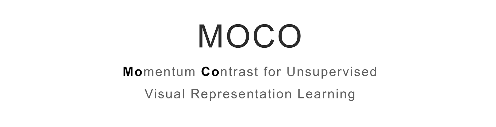
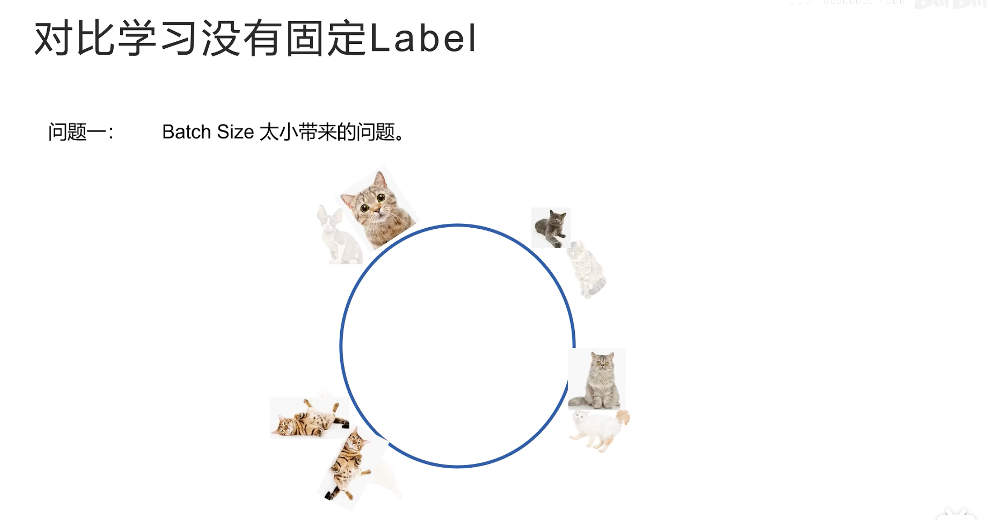
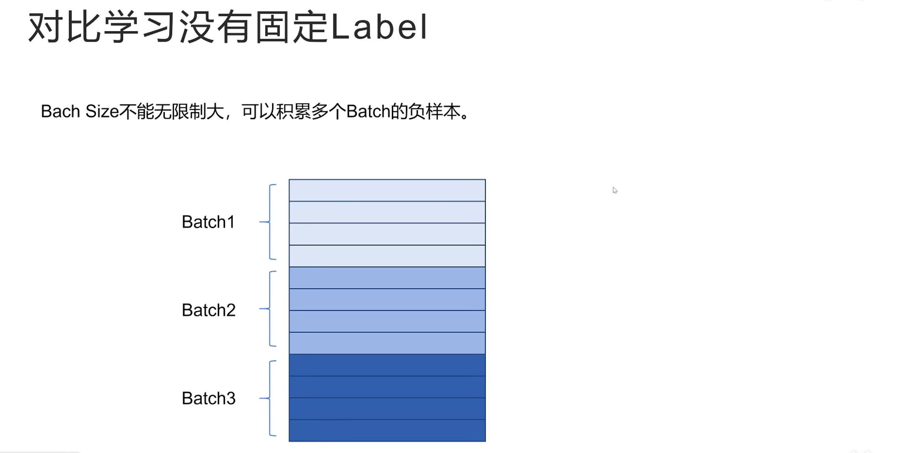
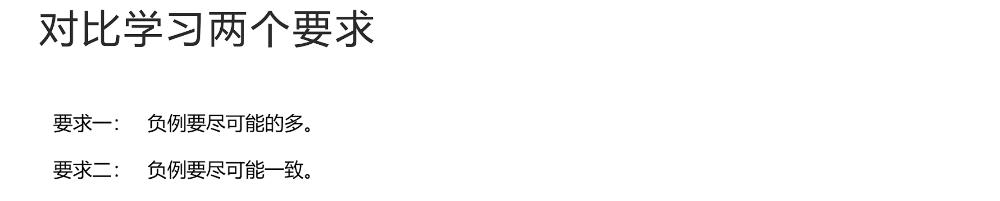
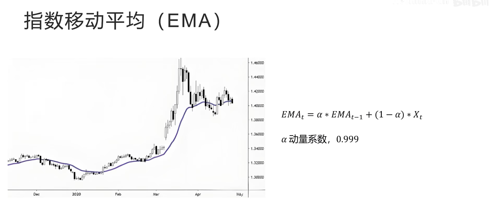
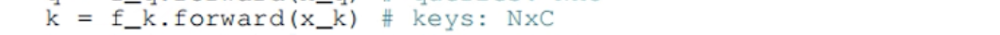
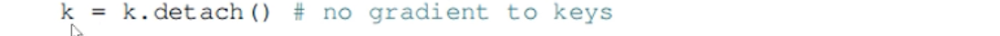

# MOCO

<u>why MOCO?</u>

MOCO算法是一个对比学习算法，因为 MOCO 算法的思想对很多后来的算法，包括多模态算法都有影响，so....

Momentum Contrast for Unsupervised Visual Representation Learning,MOCO

动量对比、无监督视觉表示学习

## 对比学习是什么？

> 如果要养一只猫，但是你之前完全不了解猫的品种，去了宠物店之后，老板正在忙，让你自己先看看你喜欢什么样的猫，老板告诉你不同品种的猫被关在不同笼子里，你不知道每个笼子里猫的具体品种，但是你知道同一个笼子里的猫是同一个品种，不同笼子里的猫是不同的品种，你就仔细观察这些猫有什么不同，逐渐你发现它们毛发的长短、颜色、花纹、脸型等等特征的不同，经过几分钟的观察后，你就可以根据自己学习的这些特征来区分两只猫是不是同一个品种了，但此时你还是不知道每个品种的名字。

以上进行的就是对比学习

对比学习通过正负样本对互相对比来学习样本的特征，抽取到了描述猫的重要特征，包括毛发长短、颜色、花纹、脸型等

此时，如果老板忙完了，每个品种分别拿一只猫告诉你猫的品种名称，你就马上能把你学到的猫的特征映射到猫的品种名称上，从而可以对猫的品种进行分类

 通过书面的定义，注意

###  对比学习为什么是无监督的

（1）为什么说 对比学习是无监督学习？不是还需要人准备正负样本对吗？

因为正负样本对有很多方法可以简单的自动生成，不用人手工标注，所以是无监督学习

再对图像的对比学习中，可以通过实例判别，来生成正负样本对，假如我们有4 张图片，首先通过图像增强比如对图像进行拉伸、旋转生成一个新的图片，这个新生成的图片描述的语义并没有发生改变，所以是正样本对

而原始图片和其他图片之间就是负样本对

再比如在文本的对比学习里，有很多句话，每一句话和其他话都可以认为是不同的，它们是负样本对，那么如何构造正样本对呢？

也就是怎么构造两句不同的话但是描述的意思是一样的呢？可以通过翻译增强的方法来构造，也就是先把一句话翻译为其它语言，再翻译回来，这样就够造成了表述不同但意思相同的两句话

比如图中例子

"请你务必悬崖勒马"经过翻译为英文，再翻译回中文后就变成了"请在为时已晚之前停止"，这样就可以程序化的构造正样本对，而无需手工构造或者标注

最后，如何在多模态对比学习

假如收集到了很多图文对，那么每个图文对就是一个正样本对，而每个图片和其他图片对应的文本就构成了负样本对，对比学习和监督学习相比难点是什么？

### 对比学习的难点

监督学习有固定的 label，模型不断的调整自己的参数让自己的输出越来越接近label，但是对比学习模型要为每个样本生成特征向量，要求正样本对的特征向量距离近，负样本对的特征向量距离远

对比学习对比两个样本向量都是模型生成的，而模型在训练过程中，一直在调整参数，每次调整后对于原来同一个样本生成的特征也会变化，所以对比学习没有固定的 label 可以学习，一切都是在变化中调整的

### 对比学习没有固定的 label

对比学习没有固定的 label 带来的问题是，如果 batchsize 太小会造成学习困难

如图是一个 batch，有1个正样本对，3 个负样本对，通过这个 batch 的训练模型可以很好的区分正负样本对

假设向量空间是图形的

每个样本的向量被分配到了合适的位置上

下一个 batch 的数据又来了：

模型在这个 batch 上可以很好的把正负样本对进行区分，把每个样本生成的特征向量分布在这个向量空间上，但是此时模型看不到上一个 batch 的样本，模型分配的向量位置可能和上一个 batch 分配的向量位置重合，让原本不是正样本对的两个样本距离很近，如果每次都可以拿所有的样本进行训练就好了，但是显存又是有限的，这样做是不现实的

还有一种办法就是在内存中记录之前 batch 生成向量，这些之前生成的向量不记录梯度，计算 loss 时不进行后向传播，只是用来让模型更好的分配向量位置，这样这些向量就不会额外占用显存

但又会有另一个问题，就是模型随着训练在一直变化，每个 batch 生成样本特征向量的模型是不同的，不能拿过去模型生成的向量来调整现在的模型，所以对比学习想要效果好，就要同时满足两个条件

### 对比学习两个要求

第一个，负例要尽可能多，这样就能让模型把不同的样本在特征空间内尽可能的区分开来

第二个，负例要尽可能的一致，也就是最好是由同一个模型生成的，如果不是同一个模型生成的，也不要差别太大，不然训练就没有意义

MOCO 同时满足上面两个条件，从而在视觉对比方面取得成功

##  MOCO 思想

MOCO 论文名的中文翻译：基于动量对比的无监督视觉表示学习

动量指的是指数移动平均EMA

## 指数移动平均

指数移动平均在股票分析中经常用到，股票价格每天波动很大，有没有一个可以反应股票长期趋势的指标呢？指数移动平均线就是一个描述股票长期趋势的指标，它不会随着股票价格每天波动太大

EMA 的计算公式：

$EMA_t= \alpha * EMA_{t-1} + (1-\alpha)*x_t$

在$t$ 时刻的值 $=$ 动量系数 $\alpha$ * 上一时刻的值 $EMA_{t-1}$ + $(1-\alpha)$ * 当前时刻的观察值

比如在本例中，当前时刻的观察值是 当天股票的价格

$\alpha$ 一般都是一个接近于 1 的值

仔细观察公式会发现，当前时刻的值大部分都是取决于上一个时刻的自己的值，只有很小很小一部分取自当前的观察值，也就是 指数移动平均 受自身的影响大，受外界的影响小，所以在 MOCO 中很稳定，在 MOCO 中动量系数为 0.999

## MOCO 的做法

MOCO 把图像对比学习看成一个字典检索问题

每次有一个样本，称为 query

字典中有一个正样本，其它都是负样本，分别为 $k_0$、$k_1$ 、$k_2$  ......

对比学习的任务就是根据 query从一大堆 k 中找到唯一的正样本的 k

MOCO 中有一个队列存着大量的负样本的 k

每个 batch 都会给负样本队列中增加负样本的 k

前面介绍每个 batch模型训练后会发生变化，生成的负样本向量和之前 batch 生成的不一致，导致训练效果不好

MOCO 的做法是分成两个模型，一个是 query 模型，一个是 k 模型，query 模型是实际训练的模型，每个 batch 根据对比 loss 利用优化器更新自己的模型参数

而 k模型，也叫做动量模型，是从 query 模型初始化的，每个 batch 不更新自己的模型参数，而是利用 query 模型：指数移动平均来更新自己的参数

公式 ： $\theta_k^t = 0.999*\theta_k^{t-1}+0.001*\theta_q^t$ 

公式给出了模型更新的过程，每个 batch 后，k 模型的参数 $\theta_k^t$ =0.999×上一个时刻自己的参数 $\theta_k^{t-1}$ +0.001×query 模型这个 batch 更新后的参数 $\theta_q^t$ 

因为 MOCO 队列里大量负样本的特征向量都是通过动量模型生成的，动量模型是通过指数移动平均来更新的，跟随了 query 模型参数变化的趋势，又保证了 batch 之间变化不至于太大，所以队列里保存的负样本向量对于对比学习来说就是又多又一致，可以很好的进行对比学习

## InfoNCE 

MOCO 中对比学习的 LOSS采用的是 InfoNCE：

$Loss_q = -\log \frac{\exp(q\cdot k_+)}{\sum_{i=0}^K \exp(q \cdot k_i)}$

首先，LOSS 中 log 的真数部分 $ \frac{\exp(q\cdot k_+)}{\sum_{i=0}^K \exp(q \cdot k_i)} $

是一个 softmax

分子是 query 向量和正样本向量的 cosine 相似度的一次方，因为这两个向量都归一化过，所以 点乘 就是 cosine 相似度

分母部分 是一个正样本和队列中所有负样本与 query 向量之间的 cosine 相似度的一次方的累加

最后进行 负的 log 计算，实际上就是一个交叉熵损失，可以看做是从 k 个负样本和 1 个正样本一共 k+1 个样本中，分类为正样本的交叉熵损失

实际在计算损失时，对于每个 cosine 相似度还要除以一个温度系数 $\tau$ ：

$Loss_q = -\log \frac{\exp(q\cdot k_+/\tau)}{\sum_{i=0}^K \exp(q \cdot k_i/\tau)}$

温度系数 $\tau$ 越大，经过 softmax 之后，各种类别的概率差别就越小

温度系数 $\tau$ 越小，经过 softmax 之后，各种类别的概率差别就越大

（why？$\downarrow$ ）

比如图中 $X=1、Y=2、Z=3$ 这三个值进行 softmax 计算，当 $\tau=1$时 就是一个标准的 softmax，这三个值经过 softmax 的概率分布如图：

如果调低温度值，比如 $\tau=0.5$ ，可以看到经过 softmax 之后，概率差别被拉大

如果调高温度为 2，它们之间的概率差别就会缩小：

## MOCO 伪代码

- $f_q$ 、$f_k$ 分别代表 query 和 k 网络

- 首先用query 网络的参数，初始化 k 网络

- 接着加载一个样本 x ，对 x 分别进行两个不同的图像增强操作，生成 $x_q$ 和 $x_k$

这是正样本对

- 然后，$x_q$通过 query 网络，生成 $q$

- $x_k$通过 k 网络，生成 key

- k 从计算图断开，不计算梯度

- 计算 query 向量和正样本的 cosine 相似度

- 接着计算 query 向量和队列中，所有负样本的 cosine 相似度

- 把正样本相似度放在第 1 个位置，和其他所有的负样本相似度拼接在一起

- 因为正样本相似度在第 0 个位置，所以 label 就为 0

- 然后计算交叉熵损失

这里除以温度系数 $\tau$ (t)

- 然后进行后向传播，更新 query 网络的参数

- 接着动量更新 k 网络的参数

- 把新生成的负样本特征加入到队列中，将最早生成的一个负样本从队列中移出

