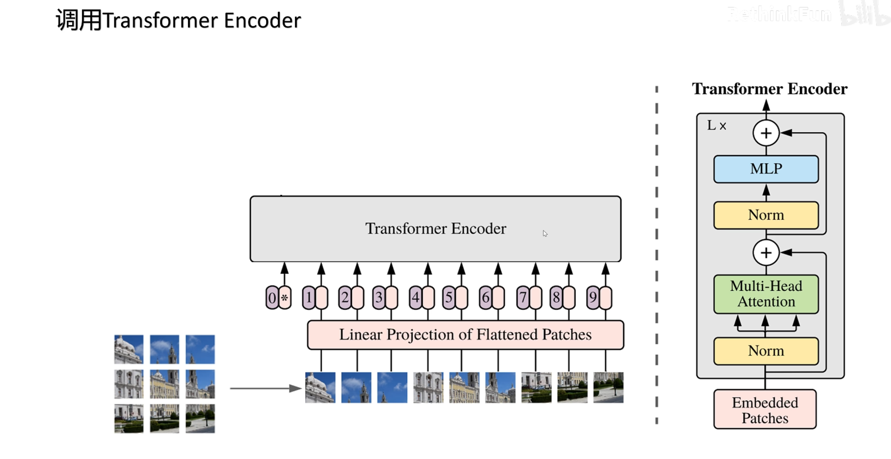
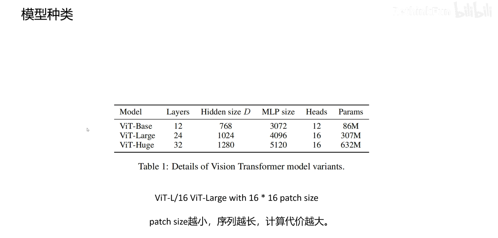
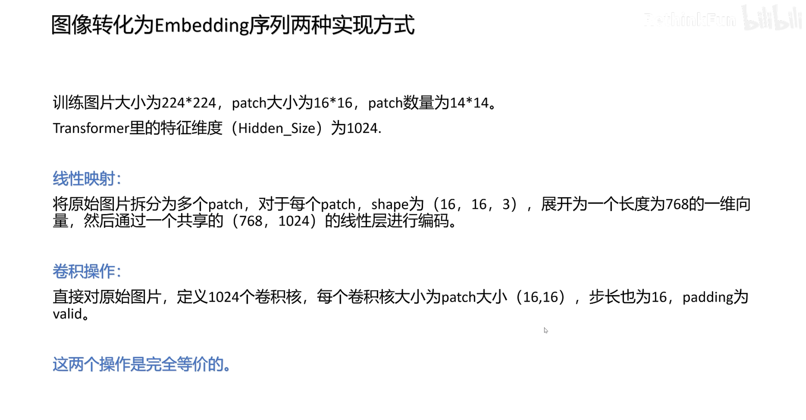
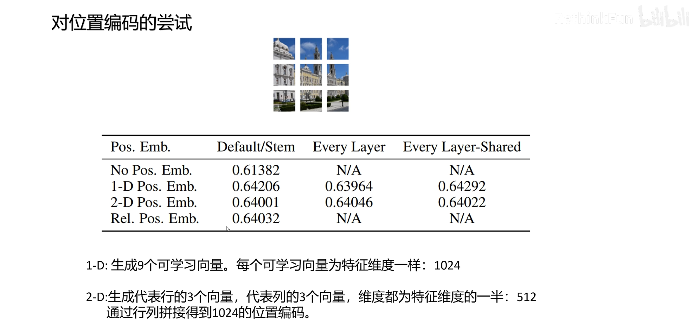

# ViT

一句话：纯 Transformer 解决计算机视觉问题

并且在不同规模的数据集下与 CNN 进行对比，探讨 Transformer 的优势

## ViT 的结论

- ViT 证明了 Transformer 模型的通用性

## Transformer 架构的评价：

> 训练效率高，可以通过注意力提取复杂语义，可以支持多种模态，并且结构简单，可以自由扩展模型大小，即使使用千亿级别的参数规模的模型依然没有出现性能饱和，ViT 为多模态大模型铺平了道路，Transformer 架构的统一，也让基于 Transformer 架构的工程优化，可以直接应用于计算机视觉和多模态领域

想法是：

> 对 Transformer 模型不做任何的修改 来完成对图像的分类任务，如果模型不能改变，那就改变图片数据，让图片数据变得像文本，所以 ViT 论文的题目：一张图像=16×16 的词

## **ViT 是如何将图片转换成文本的呢？**

> 将图片划分成固定大小的 patch，论文中输入图片 224×224，如果 patch 大小为 14×14，则可以分为 16×16 的序列，不按照单个像素划分的原因是会导致序列长度过长，计算复杂度太高
>
> > （1）一个像素只有 RGB 3个值，语义信息太少，用一个长度几百上千的向量只做一个像素的 embedding，浪费计算资源，所以选择一个 patch 作为一个语义单元，对应文本中的一个 token
> >
> > （2）相邻像素语义相似

## **图像 patch 如何文本中对应的 embedding 向量呢？**

> 将`patch`的`长×宽×通道数`的多维矩阵表示展平，然后通过一个共享的线性层投射到 Transformer 模型里的特征维度，比如 1024，这样就完成了把一个图片转换成一个向量序列的转换，图像切片相当于文本里面的分词，线性投射层相当于 embedding 层，接下来需要考虑位置编码。

## **ViT 中的位置编码**

> ViT 中为每个位置加上 1 个可学习的位置编码，比如图中有 9 个不同的可学习的位置编码，因为 ViT 做的任务是要对图片进行分类，参考自然语言处理里的 Bert 模型的做法，在最前面加上一个可学习的用来分类的 token，并且有自己可学习的位置编码，因为后续采用的Transformer 的 Encoder 架构，每个 token 无论是在序列里的什么位置都可以看到所有的其他 token，所以即使把这个 token 固定到第 1 个位置上，也可以汇集所有图像 patch 的信息，网络结构采用的也是 Transformer 中的 Encoder

## **ViT 采用的是 Transformer Encoder 架构** 

传统的大模型采用的是 decoder，因为大模型一般是做生成任务的

而图片分类是做信息提取的，所以用类似 Bert 的架构，采用 Encoder 的模块，最后通过第一个位置的分类 token 的信息，加上一个简单的 MLP头进行图片的分类

类似于 Bert，ViT 也训练了不同大小的模型，分为 Base、Large、Huge，分别有不同的层数、hidden size、MLP size和注意力头

对于 ViT 模型的表示，一般会用类似于 ViT-L /16来进行表示，表示这是一个 ViT Large 模型，其中 patch 的大小为 16×16

patch越小，一张图片分出来的 patch 就越多，输入到 Transformer 中的序列就越长，计算复杂度就越高，模型效果也越好

## **实验效果**

作者选择了当时在不同数据集上表现最好的分类模型：ResNet 和 EfficientNet 进行比较，可以看到在 JFT 数据集上进行预训练，然后在不同的数据集上进行测试，ViT-H/14 模型几乎都取得了最好的成绩

特别需要注意的是最后一行，在 `GPU V3 的核数×训练天数` 表示的计算代价上，ViT 模型具有非常大的优势，所以说在大规模图像数据集上，训练 ViT 模型更有优势

## 实现细节

### 实现细节：图像转换成 embedding 的两种方式（看图）

线性：

input $224*224*3$  

patch $16 * 16 * 3 = 768$

`#num` $14*14=$196个 patch

$196*768 → 196 * 1024$

卷积：

input $224*224*3$  

kernel $16 * 16 * 3 $

`#kernel ` = 1024

output $1024*14*14$

flatten feature map $1024*14*14 → 1024 * 196$ 

- 卷积操作相比线性映射省去了 patch 切分的操作
- 卷积输出：` 1024×输出特征图大小 `  （`图 卷 图→ 图 → flatten`）

### 实现细节：位置编码的选择

作者原文关于位置编码所做的实验：

（1）不加位置编码

（2）1 维位置编码

（3）2 维位置编码

（4）相对位置编码

比如 图中将图片切分为 9 个 patch

对于 1 维位置编码而言，就是生成 9 个可学习的位置编码，每个位置编码的长度都和特征维度一样，为 1024

对于 2 维位置编码，生成 3 个表示行的可学习的位置编码，3 个表示列的可学习的位置编码， **长度都为特征长度的一半 512** ，通过行列特征的拼接来构成 1 个二维位置编码，比如对于第 2 行第 1 列的 patch，它的位置编码就是取第 2个行位置编码拼接上第 1 列位置编码构成的

通过实验发现，不加位置编码效果最差，而其余的位置编码由表可知，效果是差不多的

**思考：为什么不加位置编码效果也还可以（0.61382），并没有差太多？**

这是因为图片被切成了 patch，patch 内部是含有位置信息的，就像上面的图片，它的 patch即使被打乱了位置也可以看出来是1 个建筑的图片

### **位置编码的进一步研究**

在原文中，作者对位置编码进行了进一步的研究

通过 1 维位置编码也是能够学习到 2 维信息的，比如这里这个位置编码的相关性的图，可以看到和每个 patch位置编码最相关的还是自己附近的以及自己所在行列的 patch

另外作者研究发现随着 Encoder 层的增加，每个注意力头关注的平均像素距离可以看到不同于卷积神经网络，在网络浅层有的头关注近距离的像素，但是也有很多头已经关注到了远距离的像素，随着模型层数的加深，模型越来越关注远距离的全局信息了

### **对于模型结构的尝试**

关于模型结构的尝试，作者选择了三种结构进行对比

一种是原始的卷积神经网络，比如 ResNet

一种是只用 Transformer 的 ViT

最后一种 卷积神经网络和 Transformer 的混合模型

### **介绍混合模型的模型架构**

首先由卷积神经网络来提取特征，最后在提取的特征每个空间位置就是一个图像的 patch，然后再做线性映射进入 Transformer Encoder

图中，圆形表示 ViT，方形表示 ResNet，加号表示混合模型

可以看到，在相同的预训练代价下，刚开始混合模型有优势，但是随着计算代价的增大，也就是模型的增大，最终 ViT 模型的效果还是略好于混合模型，所以证明了 Transformer 架构在视觉领域完全可以取代卷积神经网络

### **对于图片分类通常也有两种做法**

一种是 通过在序列第一个位置增加一个分类token 来提取图像的全局信息

一种 不额外增加 token，就用所有图像 patch 最后一层输出的全局平均池化来做全局信息

作者做了比较，两个效果是类似的

### **训练数据集大小对模型的影响**

图片中方块表示的是不同大小的 ResNet 在不同规模数据集上的表现，圆形表示的是不同大小的 ViT 在不同规模数据集上的表现，可以看到在小规模数据集上 ResNet 表现好于 ViT

而随着数据集规模的增大，ViT 的效果 是好于 ResNet 的，所以通过这个图可以知道，在百万级别的数据集上 ResNet 好于 ViT，千万级别的数据上 ResNet 和 ViT 差不多，亿级别的数据上，ResNet 不如 ViT

### **⭐️为什么在小的数据集上的训练 ViT不如 ResNet？**

> 这是由归纳偏置引起的
>
> 什么是归纳偏置？
>
> 
>
> > 归纳偏置就是在训练模型时人为引入的先验知识给模型，这些知识是人给的，不是模型从数据中学来的，比如卷积操作中，每一层都有两个归纳偏置：（1）局部性（2）平移不变性
> >
> > **卷积核为什么只作用在一张图片的局部呢？**
> >
> > 因为图片相关信息都集中在局部
> >
> > **卷积核为什么在图片上进行平移？**
> >
> > 因为物体不论是在图片上的什么位置，物体的特征是不变的
> >
> > 以上两点先验知识都给了模型，所以模型学习起来相对简单
>
> 这个归纳偏置，在卷积神经网络的每一层都起作用，但是 ViT 采用的 Transformer架构，引入的归纳偏置比较少，就是在切分 patch 时引入了局部性，因为把原始图片划分成了 patch，而不是随机取一些像素，还有就是对所有的 patch，都用同样的线性层进行 embedding，这里相当于引入了平移不变性
>
> 但是 ViT 只是在切分 patch 和对 patch 进行编码时引入了归纳偏置，后面的注意力计算是完全没有引入归纳偏置的，所以导致了 ViT 在小规模数据集上学习比 ResNet 要慢一些

### **自监督学习**

最后，ViT 的作者还尝试了让图片进行自监督学习，因为有标记的数据总是少数的，想让模型取得大规模的数据集取得突破性的进展，一定要是自监督学习，就像 Bert 的成功和 GPT 的成功

作者在尝试自监督学习时，借鉴了 Bert 的做法，具体操作：

将 50%的图像 patch 进行标记，在这些标记的 patch 中 80%将 embedding 替换成可学习的 mask 标签，10%的 embedding 替换为其他的 patch embedding，10%的 embedding 保持不变，最终让利用标记的这些 patch 的输出预测原始图片的像素值

为了简化问题，将原来 RGB $255*255*255$ 一共 1658 万多种颜色简化到 RGB 分别对应 8 个值  $8*8*8$ 一共 256 种颜色

最终的效果非常不错

ViT 打开了 Transformer 架构处理计算机视觉和多模态数据的大门，让多模态通用人工智能成为可能
