# SwinTransformer 学习笔记
[TOC]

[【12.1 Swin-Transformer网络结构详解-哔哩哔哩】]( https://b23.tv/wIUDsVU)

==第一次学的时候，所有的swin全都写成了swim，呆，又双叒叕丢人显眼了，笑）==

## SwinTransformer效果有多好

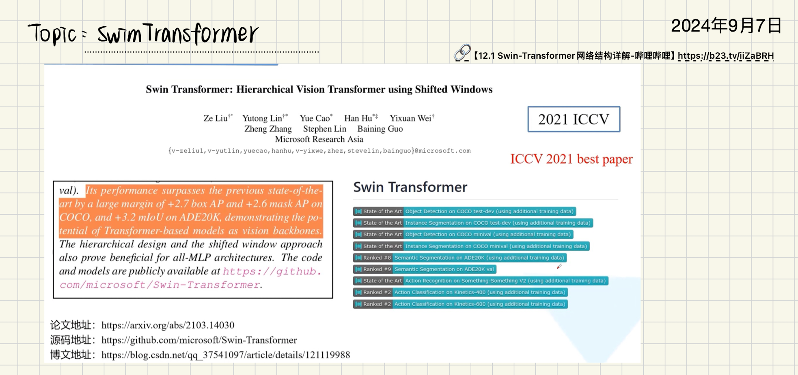

2021年3月发表

COCO数据集 目标检测下的模型排名 都有SwinTransformer的影子

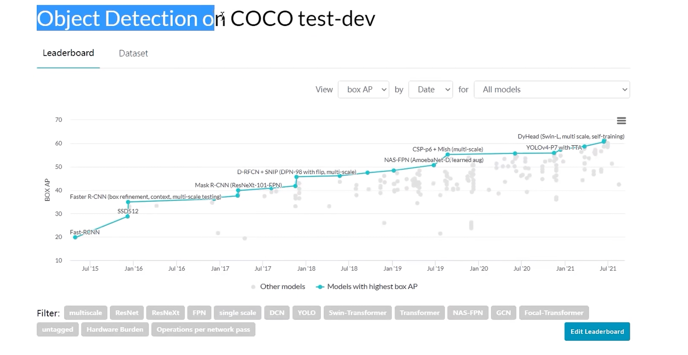

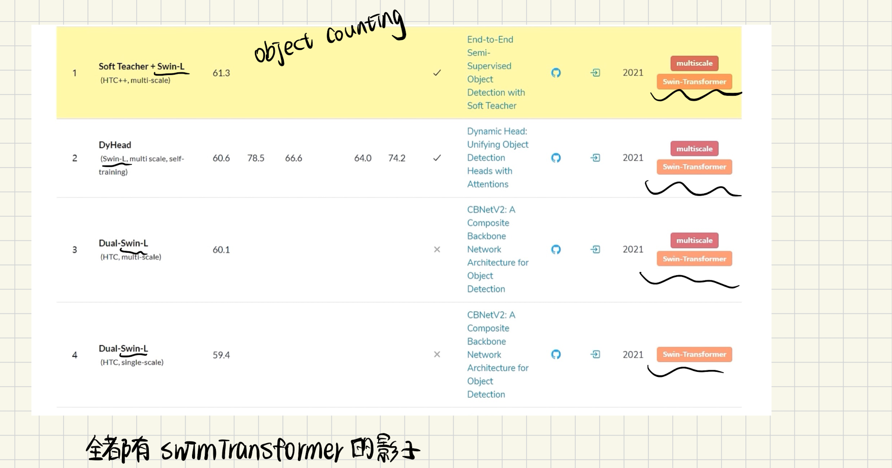

## 内容目录

完全不记得，我居然学过这些，也算是 复习了-.-

第四点、第五点不好理解

## 对比SwinTransformer&ViT

两点不同：

第一点：

（a）swintransformer的feature map具有层次性，类似CNN，随着层的加深，feature map的高和宽越来越小，分别是4倍下采样、8倍下采样和16倍下采样，因为层次性的特征图，所以对于目标检测，分割任务有更大的优势

(b)ViT  一直是16倍的下采样率

第二点：

SwinTransformer使用一个一个窗口的形式把feature map分开了，窗口与窗口之间 不重叠

ViT中，窗口是一个整体，没有分割

**看最后一列**

## 网络整体框架

## 什么是patch partition?

是取原始图像的像素值，然后展平，我觉得这里有点问题，$4×4×3 \rightarrow 16×3$ 应该是2×2的window？

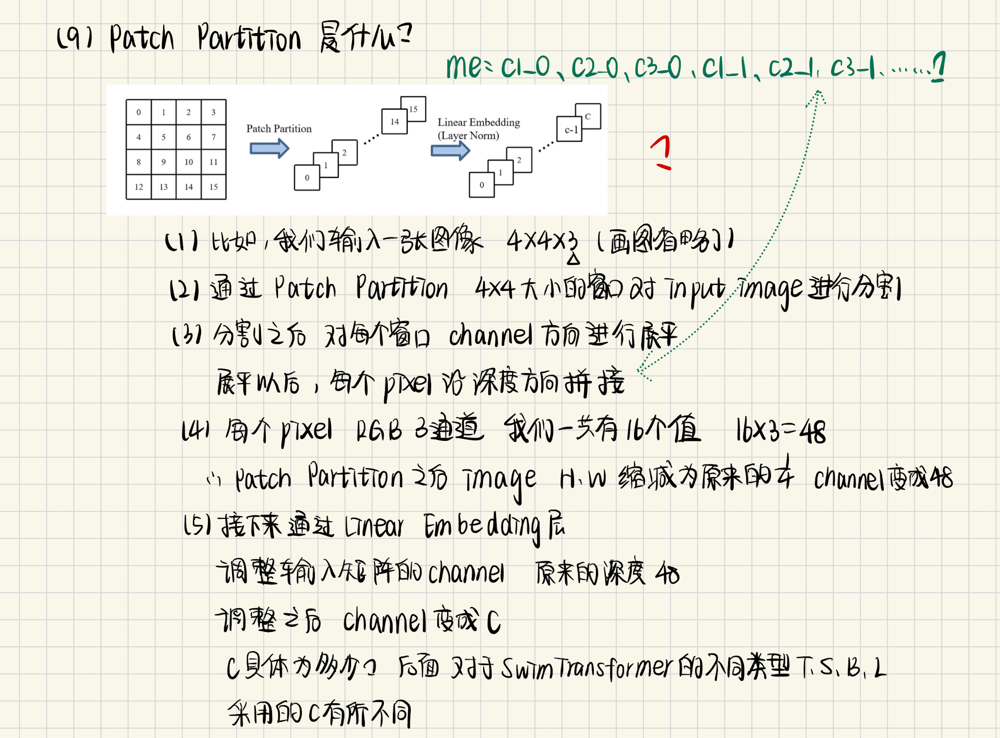

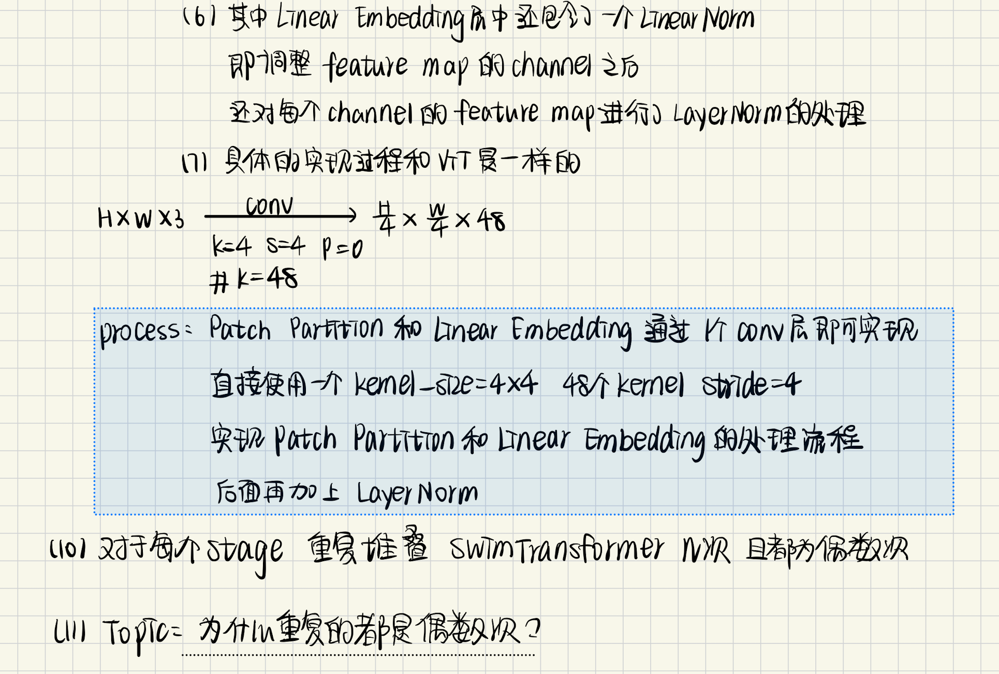

为什么这里是48个kernel？

## 为什么SwinTransformer block都是偶数次？

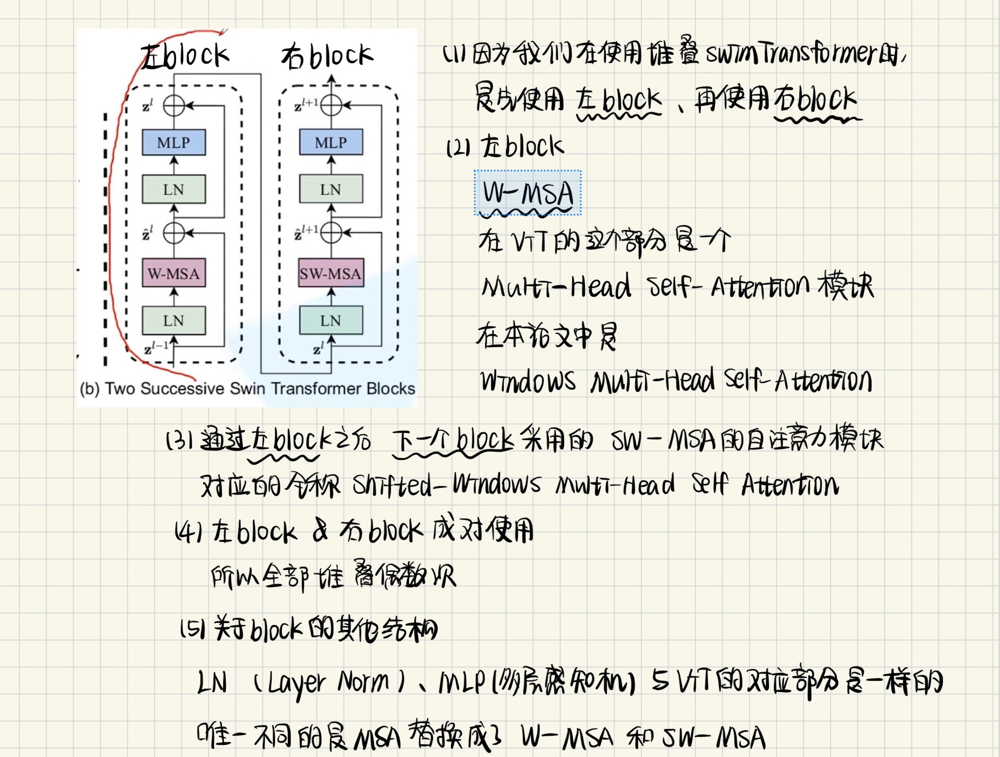

## Patch merging？

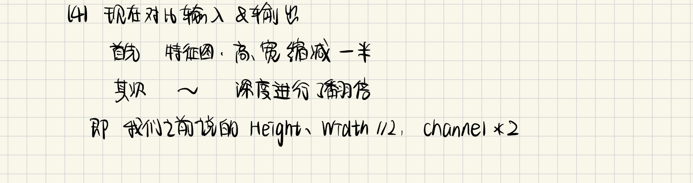

## W-MSA？

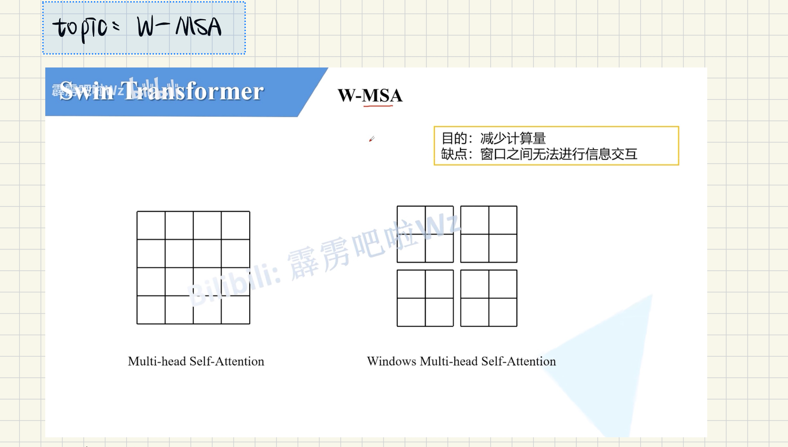

缺点：window之间没有信息交互，那么感受野就会变小，也就是没有办法看到全局的视野，最终预测结果会不好

## MSA和W-MSA计算量的讨论

普通的多头注意力机制 和 带窗的多头注意力机制

以下来自：[up主的博文](https://blog.csdn.net/qq_37541097/article/details/121119988?ops_request_misc=%257B%2522request%255Fid%2522%253A%2522A8B9FF3A-7205-477C-A0F8-A05E242F5D09%2522%252C%2522scm%2522%253A%252220140713.130102334.pc%255Fblog.%2522%257D&request_id=A8B9FF3A-7205-477C-A0F8-A05E242F5D09&biz_id=0&utm_medium=distribute.pc_search_result.none-task-blog-2~blog~first_rank_ecpm_v1~rank_v31_ecpm-3-121119988-null-null.nonecase&utm_term=%E8%AE%A1%E7%AE%97%E9%87%8F&spm=1018.2226.3001.4450)

补充矩阵乘法当中   FLOPS计算方式：

如果矩阵A是a×b的，矩阵B是b×c的，那么矩阵相乘以后的flops计算量是 a×b×c的

[单头注意力机制和多头注意力机制的计算量flops](https://blog.csdn.net/qq_37541097/article/details/117691873?ops_request_misc=%257B%2522request%255Fid%2522%253A%2522A8B9FF3A-7205-477C-A0F8-A05E242F5D09%2522%252C%2522scm%2522%253A%252220140713.130102334.pc%255Fblog.%2522%257D&request_id=A8B9FF3A-7205-477C-A0F8-A05E242F5D09&biz_id=0&utm_medium=distribute.pc_search_result.none-task-blog-2~blog~first_rank_ecpm_v1~rank_v31_ecpm-1-117691873-null-null.nonecase&utm_term=%E8%AE%A1%E7%AE%97%E9%87%8F&spm=1018.2226.3001.4450)

所以使用多头注意力机制，最后还要使用 $W^O$的计算量

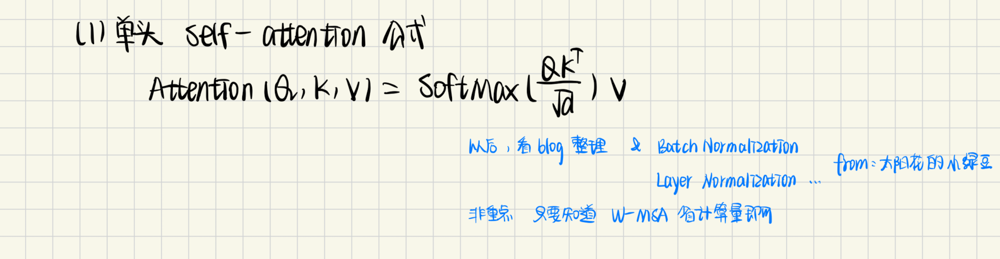

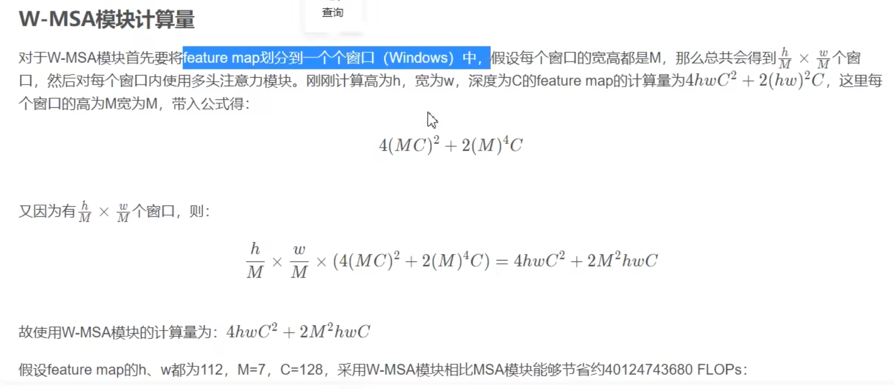

## shifted window multihead self attention模块

### 为什么需要 shift window multihead self attention？

为了解决window与window之间没有信息交互的问题

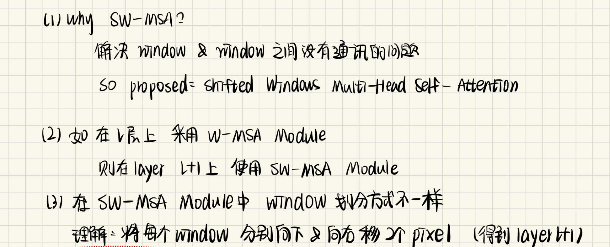

### 怎么理解shift ？

下面图，黄色框 向下、向右移动

### 怎么理解shift以后的信息交互？

### shift之后，计算自注意力会出现的新问题？

### 解决窗口变多且不一样大计算 自注意力的问题

原文中给的解释，不好看懂，up主给出了自己的解决方式

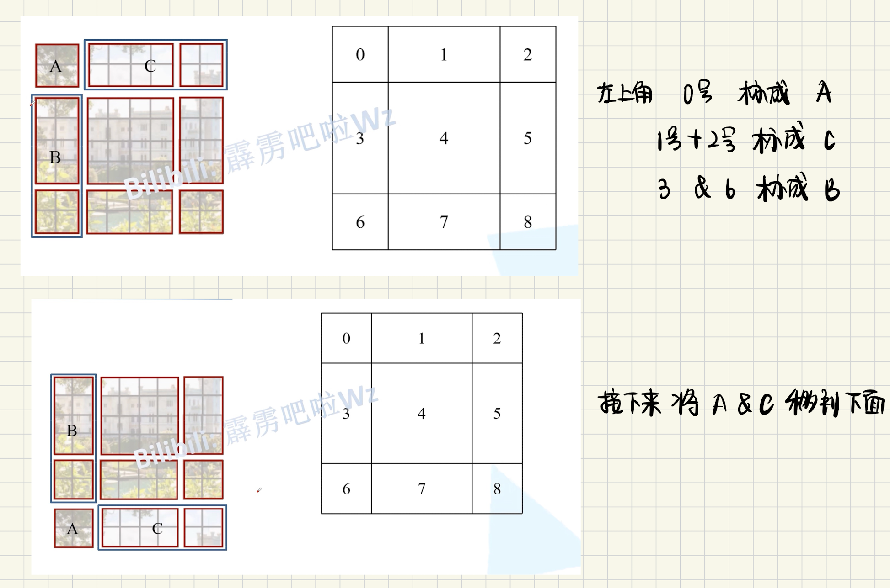

### shift window和mask

### 区域3和区域5 的mask

## 继续讨论 SW-MSA

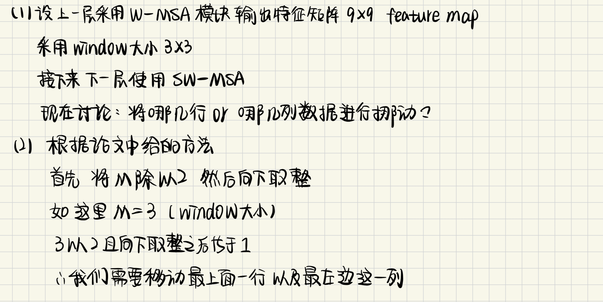

**移动的规律，先把上面移动到下面，再把左边移动到右边**

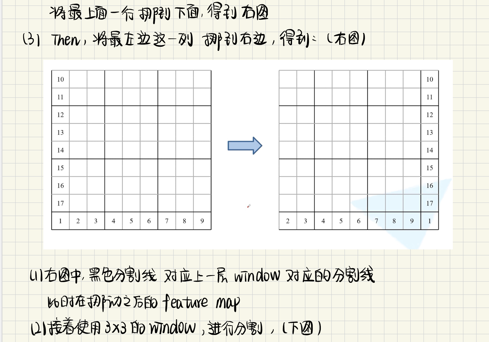

**注意看 这里黄色 每个window都能融合四个window的信息**

**对于紫色的区域并不是连续的，需要使用mask-msa**

区分好 哪里是连续的 哪里不是连续的

记得看代码怎么实现，up主也讲了

## 相对位置偏移？relative position bias

### 什么是相对位置偏置？

**区分 相对位置索引和相对位置偏置**

### 二元坐标怎么转化成一元坐标

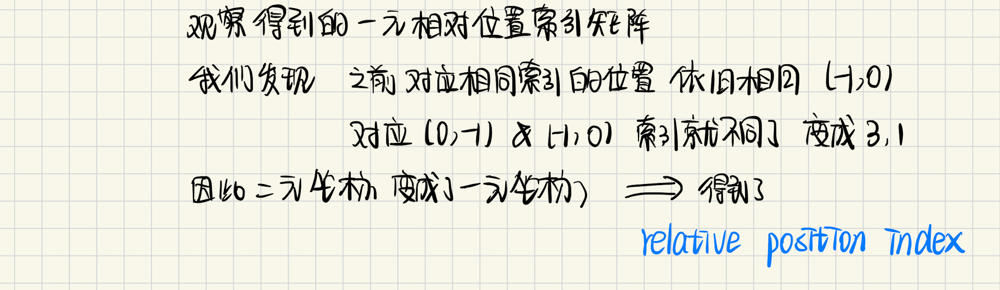

### 从相对位置索引到相对位置偏移

我们要训练的参数是 relative Position bias table

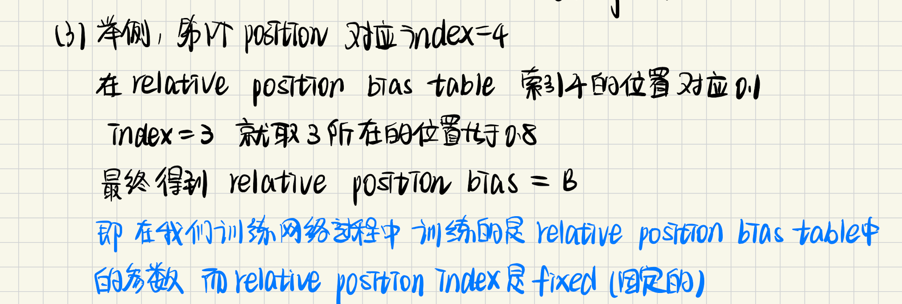

## 模型详细配置参数

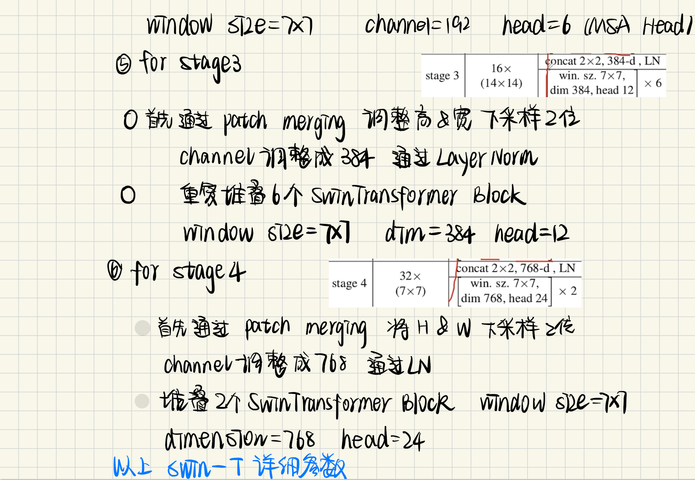

