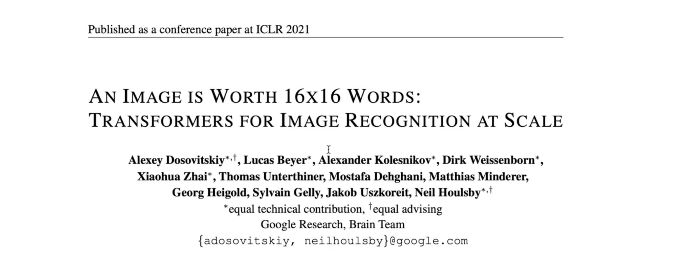
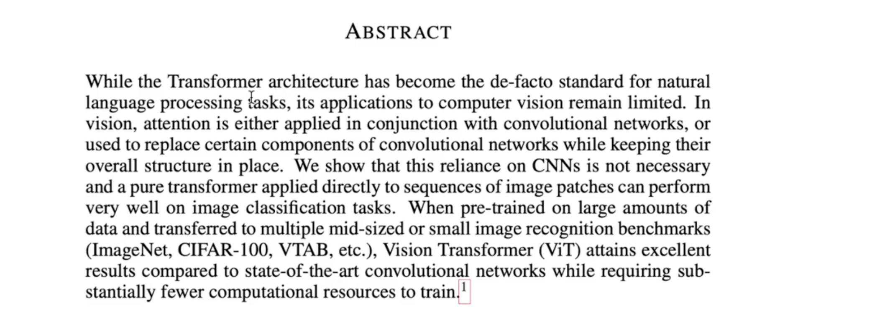
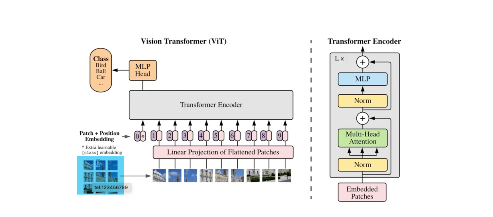
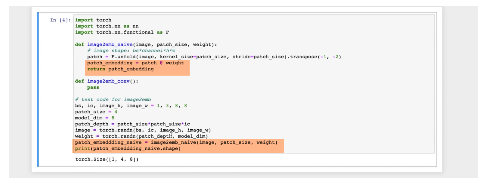
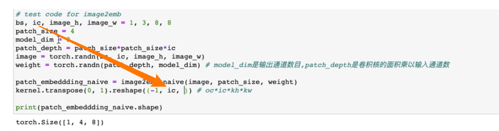
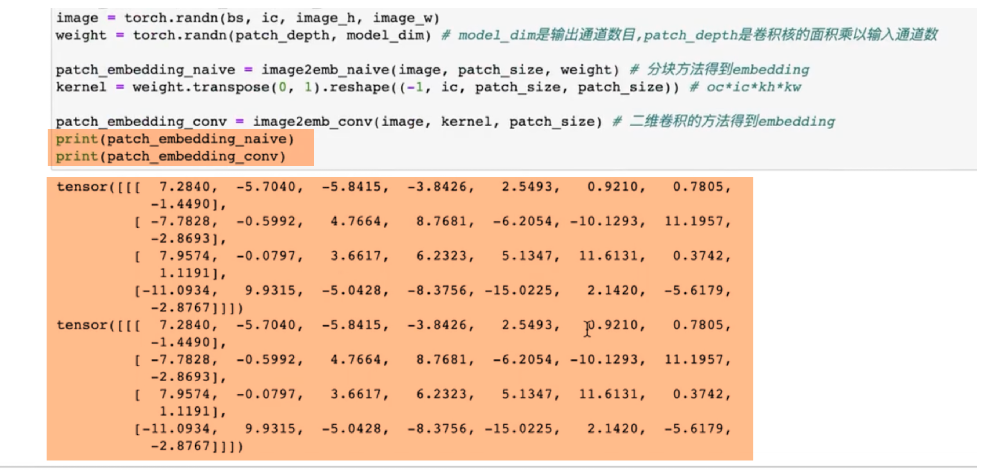
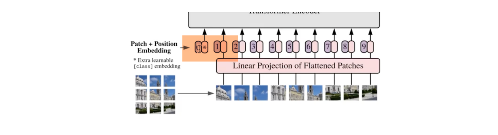
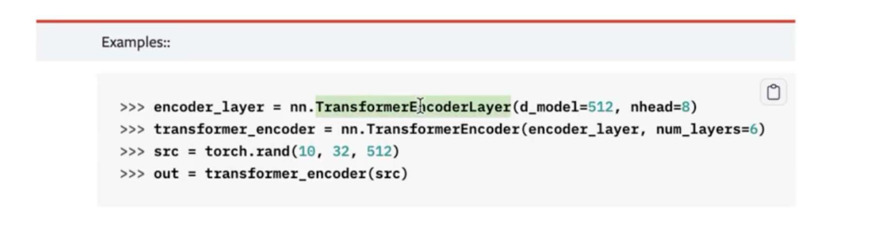

# vision Transformer的原理与难点源码实现

- [ ] 霹雳吧啦z

[【28、Vision Transformer(ViT)模型原理及PyTorch逐行实现-哔哩哔哩】]( https://b23.tv/2vhsYYz)

## 1 怎么从Transformer应用到图像识别     

### 1.1 encoder

首先从Transformer开始，首先Transformer是一个sequence to sequence 的框架，它包含 encoder和decoder两个部分，无论是encoder 还是 decoder，核心的建模模块 是由multihead self Attention和feed forward Neural network 这两个部分 构成的。


#### 1.1.1 MHSA做的是 空间融合；FNN 做的是 通道融合

那具体来看，encoder 部分 就是将我们的源序列送入到 multihead self Attention和FNN 这两个模块里，这两个模块构成一层，那么encoder呢，一般有6层，这样的6层 堆叠起来，那我们需要注意一下 这两个模块的作用是不一样的[重点]，**那首先 multihead self Attention做的事 是对各个位置上的 embedding 进行一个融合，所以我们可以理解为 它做的是 空间融合部分，而FNN呢，是position-wise的，也就是说 对每个位置上单独进行 仿射变换，那我们可以理解为FNN 做的是 通道融合，**所以FNN和MHA 干的是 两个 不同的角度；

MHSA做的是 空间融合；FNN 做的是 通道融合；两个的作用是不一样的；

###  1.2 decoder


然后decoder部分 也是一个类似的结构，并且 encoder和decoder 是通过 cross-Attention 进行一个交互，来相互传递信息的

### 1.3 归纳偏置


这样的结构 就构成了一个Transformer，相比于传统的CNN RNN的区别在于，Transformer 没有局部建模的假设，也没有时间依赖性的假设，是一种全局的假设，对序列计算一个表征，但是它引入了 一个归纳偏置：position embedding，就是说 还是注入了位置信息；

#### 1.3.1 Transformer在nlp中，为什么会比CNN RNN效果要好呢

换个角度来说，Transformer在nlp中，为什么会比CNN RNN效果要好呢？就是因为Transformer，所引入的归纳偏置 是比较少的，如果真的要算归纳偏置的话，那么就是引入了 position embedding，而其它位置就可以说 没有引入 先验假设和 归纳偏置的；

对于这样一个模型，它学习上界 是比较好的；也就是说 它的performance是比较高的，唯一的缺陷就说 数据量的要求和引入的归纳偏置 是成 反比的，换句话说 就是我们引入了越多的归纳偏置，也就是说 我们人为地注入了 人类的经验性 知识 就可以帮助这个模型 更好的去学习；

一旦归纳偏置 引入的比较少，我们就期望这个模型从大量的数据中，归纳出 模型自己的 经验来做 这个任务。所以Transformer的优点是，上限很高，缺点就是 对数据量的要求比较高；

再次 强调 归纳偏置。归纳偏置就是 我们人类 用归纳法 所总结出的经验，然后我们把经验 代入到 模型的构建之中，那什么是归纳？就是 发现 很多事物 之间的 共性。

举例子，猫会叫、狗会叫、鸭会叫、鸡会叫，那我们 总结出 动物都会叫，这个就是一个 归纳法；

相对的 还有一个方法 是 演绎法；演绎法 比方说，下雨天要带伞，明天要下雨，所以明天需要带伞。这个就是演绎法。这是归纳和演绎的区别。

这里所说的归纳偏置，就是将人类所总结的经验，代入到 我们设计的模型的 过程之中。

上面是讲的Transformer模型的结构 以及 优缺点。回答了 如何评价Transformer的问题

以上：

- 归纳偏置  & 数据量
- MHSA & FFN

###     1.4 Transformer的使用类型


Transformer的变体有，只使用Transformer的encoder，比如说我们常说的bert，bert为什么叫 双向的呢？就是在bert中 预训练 是采用的两个loss 一个是MLM，还有一个是NSP，就是它是去预测的被掩码的位置上的，没有和GPT一样，用的自回归的方式 进行语言建模，是只使用encoder的方式。

好处是速度很快，不需要做 自回归的 递推。另外一种 使用 场景是 decoder only，比如GPT系列，传统的自回归的 语言建模，包括自回归生成 以及一些 流式的任务，一般 我们只会用到 Transformer decoder的部分，这是第二种场景；

那第三种场景呢，就是Transformer原始论文的场景，就是像机器翻译、语言识别等，就是从一个序列空间 到 另外一个序列空间的转换，我们就会用到完整的Transformer的encoder和decoder这样一个结构；这三种使用场景 都很常用。并且呢 各自有各自的特点。想学自己看论文。

今天讲的vision Transformer是encoder only的结构，再次强调ViT只用到了 encoder only的部分，于是我们就不用考虑自回归、下三角的掩码矩阵等等；

##    2 vit 框架

并且vit又是一个分类任务，更简单了，最后只需要预测一个概率，就可以了。相比于生成任务 是要简单很多的。

首先 vit的框架：


vit的思想 就是想把 Transformer模型应用到 图像识别任务上，但是直接将Transformer 应用到图像识别任务上，面临的困难就是：Transformer在nlp当中 是以字为单位，就是一句话中 word的数量还是比较少的；但是如果我们 直接将Transformer 应用到一张图片上的话，那图片的基本单位 就是一个个像素点，然后每个图像的像素点 是非常非常多的，少则几百，大则 几千 几万 都有。所以我们把Transformer 直接应用到图像点上的话，第一个就是说 计算量 非常大，第二个 就是对图像而言，它的单个像素点不像在一个句子中  单个字所包含的信息量。在一句话中，单个字 所包含的信息量 还是 非常丰富的。

但是对一张图像当中的 某个像素点 并不包含 什么信息量；对于图像来说 信息量还是主要聚焦在 一小块区域中；就是说 很多个像素点 所构成的区域 构成的信息量 才会比较丰富；

如果单独看一个像素点的话 可能没有什么信息量；

以上是 图像 相比于 文本句子的区别，

所以为了将Transformer应用到 图像领域中 从这两个角度出发 就不能把 Transformer 从像素点层面 一个个个去算 自注意力。那么一个很简单 很直接的想法 就是把 很多个像素点 组成一个块，然后把图像分成很多个块，然后呢 把一个个图像块 去当做一个token，然后送入到Transformer中，这是一个很直接的想法。这个是输入特征部分。

### 	2.1 patch的构建

对于这个块 有两种角度 理解。


第一种角度，通过DNN的角度理解，也就是说 首先把 图片 切割成 很多个块，也就是image to patch的过程。然后 我们再对 很多个patch 经过一个仿射变换，得到一个新的向量，叫做embedding，也就是 patch to embedding，这是从DNN的角度理解


那另外一个角度，我们也可以理解为 我们把 图片 得到 embedding的过程 ，也可以理解为卷积网络，也就是说 我们会用一个二维的卷积 在图像上 应用一个卷积，并且说卷积 kernel size等于stride的，然后我们再把得到的卷积图拉直一下，就得到我们一个个的token embedding

这是我们从 两种角度 去看 image to embedding的过程

### 	2.2  CLS token


接下来 为了去做分类任务，vit是借鉴了bert中的一个 class token的占位符，关于这个class token，大家也有不同的争议，比如为什么要有一个 class token，以及class token 既然 充当了 query的作用，那为什么 其他 位置上的 量 又可以对它去计算一个 注意力的权重，总之 这里有很多争议。但是bert论文中 也做了对比，用了class token的效果 是比 直接Pooling的效果 要好的。

### 	2.3 Position embedding


另外 在vit中 同样引入了 position embedding，这里对比了好几种 embedding，最后使用了 可训练的一维embedding，效果会比较好一点

### 	2.4 Transformer encoder


另外，vit是主要用了Transformer encoder的一个模块， 并没有使用到 decoder，是比较简单的。

### 	2.5 classification head


最后 我们通过class token这个位置上的  状态量 拿出来，然后就可以去做 分类任务。这就是vit的一个全局的结构。接下来 我们来看 具体论文

## 	3 原论文



论文的标题：一图胜16×16的字，改编自 一图胜千言；

**<u>AN IMAGE IS WORTH 16×16 WORDS</u>**

标题的意思就是说 如果把 一个图像的每个像素点看成 一个单词的话 其实我们可以把16×16 像素点 当成一张图 就够了 。我们不需要把16×16个像素点 拿出来 单独进行建模；而是可以把它们 直接看成一个整体。再变成一个embedding 进行建模，这样的效果会更好。

<u>**TRANSFORMERS FOR IMAGE RECOGNITION AT SCALE**</u>

下面一行 就是说 Transformer 应用到 图像识别，所以在本文中 主要是把transformer应用到 图像识别，cv领域 总共 有三大任务：识别、检测、分割；本文中 只讲到了 识别。后面还有论文把transformer用到cv，不仅会讲到image recognition还会讲到 检测和分割

###  	3.1 摘要

首先 摘要部分：



尽管transformer已经成为nlp任务的标配；但是它在cv这个领域的潜力还没有被挖掘

那么在计算机视觉中，注意力机制要么应用到卷积网络中，要么直接替代卷积网络的某一部分；

在本文中，作者展示了CNN不是必须的，我们可以把简单的transformer模型直接应用到图像块上，就可以在图像分类任务上 表现得很好；但是这个很好是有成本的；当我们首先将这个vit模型在大量的数据上 做预训练，然后再把它迁移到 中等大小 或者 小的数据集上，vit就可以取得 相比于卷积网络 一样 甚至 更好的效果。

跟之前讲的transformer有异曲同工之妙，因为transformer的归纳偏置 是比较少的。就是说并没有把我们人类总结的一些经验 注入到transformer模型之中，所以单纯让transformer依赖数据去学习到这些经验 是一个比较漫长的过程，所以我们必须需要大量的数据量 大量的数据集 才可以让transformer vit取得比较好的效果，完全是 数据驱动的；

### 	3.2 模型图

introduction直接跳过，直接看模型图：


vit的结构就是 图1所示；首先看decription；

首先把图片分成很多个固定大小的 块。然后在用线性网络 将这些块 形成一个嵌入表征，然后再在表征上 加入位置编码；然后再把这一系列的向量 送入到标准的transformer encoder之中，模型就用这么一句话 描述完了。然后为了去做 分类任务，就是像bert中一样，增加了一个 额外的classification token位置，就是对序列 新增了一个位置；

可以理解为 这个位置 就是起一个 query的作用。就是它会去收集 使得这个模型 能做好 分类任务的信息。最后呢 我们将最后一层的 位置信息 拿出来 做一个线性映射，映射到 类别的概率分布上，然后就可以了。这个模型是比较简单的 如果非常了解transformer模型的话。vit是没有难度的（代码 演示实例）

接下来 看左图，右图看过 很多遍了


- 首先将一副图片 分成很多个 块；需要注意的是 每个块的大小是不变的；图像的大小 可能会变化 但是 每个块的大小 是不会 发生变化的

- 在同一个模型中 块的大小 不会发生变化；

- 换句话说，如果图片大一点，那反应在 序列长度上 长一点；
- 将一个图片分成很多块，像卷积中 平移的顺序一样，先左到右，把图片拉直，拉成一个序列的形状；
- 然后再把 每个块的像素，像素点的值 归一化；就是说之前就已经 做好 归一化了 归一化到0-1之间。
- 然后再把块里的 值 通过线性变换 映射到 模型的维度，或者说 我们得到了patch embedding；
- 有了patch embedding以后，为了做分类任务，需要在序列的开头 增加一个 可训练的embedding，这个embedding是随机初始化的 embedding。那这样 就构成了 一个长度+1的序列。
- 然后我们再增加position embedding，就是位置编码，那这样 加完 后的 序列表征 就可以直接 送入到 transformer encoder中，然后我们在encoder 最后一层中，取出 新加的 也就是多余位置上的 输出状态 经过一个MLP，得到类别的概率分布，就可以用交叉熵 去算出 分类loss，就完成了 一个vit模型的搭建；

## 	4 代码实现

接下来 代码 实现这个过程，实现的重点：

### 	4.1 切分 patch

- Image2embedding

  也就是说 实现的重点 在transformer之前的部分；因为transformer encoder的代码 pytorch 已经包装起来了。而且 之前 也已经详细讲过

<u>所有的所有 都是为了 代码 嗯 别忘了 开始的目的</u>

特点：实现 功能为主 ，不是跑模型；围绕例子 实现 过程；

首先 导入库：

```python
import torch
import torch.nn as nn
import torch.nn.functional as F
```

,来看一下，首先第一部分 要做什么，我们需要将 一幅 图片变成embedding，第一步我们要做这个事情，我们可以首先 定义一个函数

```python
def image2emb():
  pass
```


之前在 思维导图里 讲了 这个 image2emb这个过程 可以从两个角度 去理解，一个角度 是DNN的角度，我们把image手动 切成 一个个块，再把每个块 变成 embedding

第二个角度就是说 直接从 二维卷积的 角度去理解，就是 直接对图片做 二维卷积 ，然后把卷积后的结果 拉直一下，构成embedding

所以vit结构 第一层 其实就是一个卷积；那 写两个函数 实现它

第一个函数 叫navie,很直接的实现；

第二个函数取名为conv，我们以卷积的角度，来实现


```python
import torch
import torch.nn as nn
import torch.nn.functional as F

def image2emb_navie():
    pass

def image2emb_conv():
    pass
```

#### 	4.1.1 naive版本：torch.unfold()

```python
import torch
import torch.nn as nn
import torch.nn.functional as F

def image2emb_navie(image,patch_size,weight):
    # image shape:bs  × channel × height × width
    patch = F.unfold(image,kernel_size=patch_size,stride=patch_size).transpose(-1,-2)
    patch_embedding = patch @ weight
    return patch_embedding
def image2emb_conv():
    pass

# test code for image2emb
bs,ic,image_h,image_w = 1,3,8,8
patch_size = 4
model_dim = 8

patch_depth = patch_size * patch_size * ic
image = torch.randn(bs,ic,image_h,image_w)
weight = torch.randn(patch_depth,model_dim)

patch_embedding_naive = image2emb_navie(image,patch_size,weight)
print(patch_embedding_naive.shape)
```

注释：

```python
import torch
import torch.nn as nn
import torch.nn.functional as F

def image2emb_navie(image,patch_size,weight):
    # image shape:bs  × channel × height × width = 1,3,8,8
    patch = F.unfold(image,kernel_size=patch_size,stride=patch_size).transpose(-1,-2)
    # patchshape = torch.Size([1, 48, 4])   patch_size = 4
    # 1：batchsize
    # 48 = 3*4*4（卷积覆盖的input region）
    # 4：1,3,8,8的输入图片用 1344的卷积核卷积，得到4个input region
    # transpose(-1,-2) → 1,4,48  
    patch_embedding = patch @ weight
    # 1,4,48 @ 48,8 = 4 × 8
    return patch_embedding
def image2emb_conv():
    pass

# test code for image2emb
bs,ic,image_h,image_w = 1,3,8,8
patch_size = 4
model_dim = 8

patch_depth = patch_size * patch_size * ic
image = torch.randn(bs,ic,image_h,image_w)
weight = torch.randn(patch_depth,model_dim)

patch_embedding_naive = image2emb_navie(image,patch_size,weight)
print(patch_embedding_naive.shape)
```

-----

以下是代码的怎么写出来的详解，可跳：

首先 我们来实现 navie的版本

那么既然是 image2embedding，我们需要的第一个参数 就是image的张量，第二个参数 就是 块的大小，首先将image分成很多很多的块，每个块 肯定是 方形的 边长是多少，那我们 传入的是就是 `patch_size` 也就是 块的边长，那还有就是 我们既然要得到embedding，首先得到块，块里面的所有像素点，我们会对它做一个 线性变换，线性变换的话 需要一个weight，这个 变换的权重矩阵

```python
import torch
import torch.nn as nn
import torch.nn.functional as F

def image2emb_navie(image,patch_size,wieght):
    pass

def image2emb_conv():
    pass
```

这里的image size一般是跟 卷积中类似，它的格式 就是 batch size×channel×height×width，这个是image的shape，在二维卷积中 也是这样格式

```python
import torch
import torch.nn as nn
import torch.nn.functional as F

def image2emb_navie(image,patch_size,weight):
    # image shape:bs  × channel × height × width
    pass
def image2emb_navie():
    pass
```

首先第一步 我们要对 图像分块，那这个图片分块 其实就是 类似之前卷积讲过的



我们有两种角度 理解卷积，第一种 角度 是把每次 滑动相乘的区域 拎出来，其实就是image2patch，只是 这里的stride 刚好 等于 kernel size

另外一种角度 就是我们对kernel 进行 填充，把kernel 填充成 跟 input feature map一样大小的，然后 推出了 转置卷积

所以这里 就是 第一种角度，我们可以通过image2patch，将每一步 卷积的区域 拿出来 构成一个个patch，那这里 不写for 循环 拿patch

之前 也讲过 在pytorch 中，有一个api叫做`pytorch nn functional unfold`这个api


这个api做的事情，就是拿出卷积的区域


，简单来讲 就是 拿出 卷积的区域，你看它需要的参数 也非常的卷积


有input、kernel size、dilation，padding、stride

其实就是说 根据input 卷积的参数 就能将 每一次 滑动的 区域的输入 单独的 拿出来

这里 就是 image2patch的过程

这里 我们直接去调用

那也就是说 刚好有这些参数，就可以直接去调用

我们已经 import 简写成F了，所以就写F.unfold,input其实就是 image，刚好是满足这个格式的，第二个参数 就是kernel size参数，kernel size 其实就是 patch size，第三个呢 其实就是dilation，dilation这里我们不需要考虑，因为 我们并没有 空洞，padding也不用考虑，也没有做填充，最后一个stride我们需要考虑，我们的stride并不是1，因为 我们这里的图像分块 是没有交叠的，结构图中可以看到 ，每个块与块之间 是没有交叠的，这就是一种特殊的卷积 stride=kernel size，通过F.unfold函数 就能把 图像分块，结果定义为patch

```python
    patch = F.unfold(image,kernel_size=patch_size,stride=patch_size)
```


```python
import torch
import torch.nn as nn
import torch.nn.functional as F

def image2emb_navie(image,patch_size,weight):
    # image shape:bs  × channel × height × width
    patch = F.unfold(image,kernel_size=patch_size,stride=patch_size)
    pass
def image2emb_navie():
    pass
```

这个 就是 调用pytorch F.unfold这个函数 将图片 进行分块，原理就是 将图片看成 kernel size=stride的卷积就好了，然后就可以把每一次 每一步 输入的区域 单独拿出来，放到patch中

当然 这个patch是什么形状呢？我们可以先来 测试一下，需要先 测试一下 这个函数 来看一下 patch的形状。

为了 测试 我们需要 先 定义一些常量，比如说 我们需要定义 batch size、input channel、图片的高度 以及 图片的宽度

假设 我们设置batch size=1，channel=3，宽度和高度写个8和8

同时我们还需要 定义 patch size，这里 我们可以定义4，也就是说 我们是4×4为一个 patch

那还有 我们需要得到 一个 embedding，所以我们还需要有一个 patch embedding dim，其实就是transformer中的 model dim，我们可以 定义为8

```python
# test code for image2emb
bs,ic,image_h,image_w = 1,3,8,8
patch_size = 4
model_dim = 8
```

在定义好了这些量以后，我们可以来测试这些函数了

首先 我们需要生成 图片

```python
image = torch.randn(bs,ic,image_h,image_w)
```

还需要 weight，weight怎么样定义呢？

weight 其实就是 patch2embedding过程的乘法矩阵，也就是说 我们将patch的大小 映射成model dim这个大小，所以weight 是一个 二维的张量

张量的第一个形状，先暂时设为None，第二个形状 其实 就是 model dim，是一个 这样的 乘法矩阵 

```python
weight = torch.randn(None,model_dim)
```

那第一个维度呢？第一个维度 其实就是 patch的大小，按照论文的意思 patch的大小 是什么呢？patch的大小 其实就是patch的边长，边长的平方刚好是 面积，然后再乘以 通道数目，也就是说 如果图片 有 三个通道的话，每个patch 其实是 包含 三个 通道的，所以这里 我们需要算出一个量

patch_depth 也就是 patch的深度，它应该就是 patch size再乘以 patch size再乘以 ic 输入的通道数目，那这里 我们就可以把 weight的矩阵 给写出来，也就是 patch_depth

```python
patch_depth = patch_size * patch_size * ic
weight = torch.randn(patch_depth,model_dim)
```

```python
import torch
import torch.nn as nn
import torch.nn.functional as F

def image2emb_navie(image,patch_size,weight):
    # image shape:bs  × channel × height × width
    patch = F.unfold(image,kernel_size=patch_size,stride=patch_size)
    pass
def image2emb_navie():
    pass

# test code for image2emb
bs,ic,image_h,image_w = 1,3,8,8
patch_size = 4
model_dim = 8

patch_depth = patch_size * patch_size * ic
image = torch.randn(bs,ic,image_h,image_w)
weight = torch.randn(patch_depth,model_dim)
```

这就是 weight 矩阵，有了weight 有了image，patch_size 我们就可以 调用这个函数image2emb_navie

然后 我们首先打印一下 里面的patch的形状

```python
import torch
import torch.nn as nn
import torch.nn.functional as F

def image2emb_navie(image,patch_size,weight):
    # image shape:bs  × channel × height × width
    patch = F.unfold(image,kernel_size=patch_size,stride=patch_size)
    print(patch.shape)
def image2emb_conv():
    pass

# test code for image2emb
bs,ic,image_h,image_w = 1,3,8,8
patch_size = 4
model_dim = 8

patch_depth = patch_size * patch_size * ic
image = torch.randn(bs,ic,image_h,image_w)
weight = torch.randn(patch_depth,model_dim)

image2emb_navie(image,patch_size,weight)
```

输出：torch.Size([1, 48, 4])

结果解读：patch的形状是1×48×4 知道为什么 是 这3个数字吗

首先 4很好理解 因为 图像是 8×8的 这样一个 面积，然后 patch size是4×4，那一个8×8的图片，以4×4为一个块的话，刚好是 4块；就构成了4块；

这里的4 其实就是 块的数目，就是 图片 分块以后 块的数目

然后 48怎么来的呢？48其实就是  patch size×patch size ×input channel 就是 4×4×3=48,把每个卷积都拉直了，为了更便于理解 我们可以增加一个transpose，就是把最后一维和倒数第二维 交换一下，再运行


1是batch size；4是patch的数目；48是每个patch所包含的像素点的数目

得到patch以后，打印weight形状


weight形状 刚好是48×8，所以我们把patch跟weight 进行一个矩阵相乘，就可以得到patch embedding，用@符号，然后返回patch embedding，然后把得到patch embedding naive，然后打印patch embedding naive的形状



这样 就完成了 第一个函数的测试 把这个3×8×8的图片，变成了 embedding的形式，embedding的大小是4×8；也就是一张图片被分成了4块 并且每一块 变成了长度为8的向量，来表示这个块

以上是所有naive的实现步骤

```python
import torch
import torch.nn as nn
import torch.nn.functional as F

def image2emb_navie(image,patch_size,weight):
    # image shape:bs  × channel × height × width
    patch = F.unfold(image,kernel_size=patch_size,stride=patch_size).transpose(-1,-2)
    patch_embedding = patch @ weight
    return patch_embedding
def image2emb_conv():
    pass

# test code for image2emb
bs,ic,image_h,image_w = 1,3,8,8
patch_size = 4
model_dim = 8

patch_depth = patch_size * patch_size * ic
image = torch.randn(bs,ic,image_h,image_w)
weight = torch.randn(patch_depth,model_dim)

patch_embedding_naive = image2emb_navie(image,patch_size,weight)
print(patch_embedding_naive.shape)
```

----

#### 	4.1.2 conv版本：flatten output

```python
import torch
import torch.nn as nn
import torch.nn.functional as F

# step1 convert image to embedding vector sequence
def image2emb_navie(image,patch_size,weight):
    # image shape:bs  × channel × height × width
    patch = F.unfold(image,kernel_size=patch_size,stride=patch_size).transpose(-1,-2)
    patch_embedding = patch @ weight
    return patch_embedding
def image2emb_conv(image,kernel,stride):
    conv_output = F.conv2d(image,kernel,stride=stride) # bs*oc*oh*ow
    bs,oc,oh,ow = conv_output.shape
    patch_embedding = conv_output.reshape((bs,oc,oh*ow)).transpose(-1,-2)

    return patch_embedding

# test code for image2emb
bs,ic,image_h,image_w = 1,3,8,8
patch_size = 4
model_dim = 8

patch_depth = patch_size * patch_size * ic
image = torch.randn(bs,ic,image_h,image_w)
weight = torch.randn(patch_depth,model_dim) # model_dim是输出通道数目，patch depth是卷积核的面积乘以输入通道数

# 分块方法得到embedding
patch_embedding_naive = image2emb_navie(image,patch_size,weight)
kernel = weight.transpose(0,1).reshape((-1,ic,patch_size,patch_size))

# 二维卷积方法得到embedding
patch_embedding_conv = image2emb_conv(image,kernel,patch_size)

print(patch_embedding_naive)
print(patch_embedding_conv)
```

注释：

```python
import torch
import torch.nn as nn
import torch.nn.functional as F

# step1 convert image to embedding vector sequence
def image2emb_navie(image,patch_size,weight):
    # image shape:bs  × channel × height × width = 1,3,8,8
    patch = F.unfold(image,kernel_size=patch_size,stride=patch_size).transpose(-1,-2)
    # patchshape = torch.Size([1, 48, 4])   patch_size = 4
    # 1：batchsize
    # 48 = 3*4*4（卷积覆盖的input region）
    # 4：1,3,8,8的输入图片用 1344的卷积核卷积，得到4个input region
    # transpose(-1,-2) → 1,4,48  
    patch_embedding = patch @ weight
    # 1,4,48 @ 48,8 = 1× 4 × 8
    return patch_embedding

def image2emb_conv(image,kernel,stride):
    # image = bs,ic,image_h,image_w = 1,3,8,8 
	# kernel = 8 × 3 × 4 × 4
	# stride = patch_size = 4 
    conv_output = F.conv2d(image,kernel,stride=stride) # bs*oc*oh*ow
    # (h-k+2p+s)/s = (8-4+4)/4  = 2
    # conv_output = 8 × 1 × 2 × 2
    bs,oc,oh,ow = conv_output.shape
    patch_embedding = conv_output.reshape((bs,oc,oh*ow)).transpose(-1,-2)
 	# conv_output = 1 × 8 × 2 × 2
    # reshape ： 1 × 8 × 4
    # transpose(-1,-2)  1 × 4 × 8
    #（输入图片 划分成 4个patch，每个patch由原来的 48个像素表示，降维成8维表示）
    return patch_embedding

# test code for image2emb
bs,ic,image_h,image_w = 1,3,8,8
patch_size = 4
model_dim = 8

patch_depth = patch_size * patch_size * ic
image = torch.randn(bs,ic,image_h,image_w)
weight = torch.randn(patch_depth,model_dim) # model_dim是输出通道数目，patch depth是卷积核的面积乘以输入通道数

# 分块方法得到embedding
patch_embedding_naive = image2emb_navie(image,patch_size,weight)

# conv版本：
kernel = weight.transpose(0,1).reshape((-1,ic,patch_size,patch_size))
# weight = 48 × 8
# transpose(0,1) : 8 × 48
# reshape :8 × 3 × 4 × 4

# 二维卷积方法得到embedding
patch_embedding_conv = image2emb_conv(image,kernel,patch_size)
# image = bs,ic,image_h,image_w = 1,3,8,8 
# kernel = 8 × 3 × 4 × 4
# patch_size = 4

print(patch_embedding_naive)
print(patch_embedding_conv)
```


----

代码详解：

接下来 用卷积实现 conv的版本

既然是卷积 就需要对传入的参数改一下，第一个参数 还是 image，第二个参数是kernel，第三个参数 需要 stride，这样我们定义好了 卷积的三要素 

首先定义F.conv2d第一个参数 image，第二个参数 kernel，stride步长设置为stride，这样得到了conv_output,这样做了一个卷积，等下 会讲解 这个得到的和是什么

```python
def image2emb_conv(image,kernel,stride):
    conv_output = F.conv2d(image,kernel,stride=stride)
    pass
```

这样操作的话  卷积输出的大小是什么呢？

卷积输出的大小是 batch_size×output channel×output height×output width  

最终 我们要得到 patch embedding，其实我们卷积后的宽度和高度，我们会把它拉成一个序列，看框架图：


就是说 将 output feature map拉直，拉直的就是output height×output width的部分，也就是说 可以对conv output进行一个reshape，reshape成bs×oc×（oh×ow）再transpose一下，把序列长度这一维 放到中间，这样得到 patch embedding，最后 返回 patch embedding

这个过程，首先将 image2embedding的过程 首先看出二维卷积，卷积的结果是一个batch size×通道数再✖️高度✖️宽度，因为我们这里模仿nlp中 把图片变成序列，于是我们可以把特征图 高度和宽度浓缩成一起，就是拉直的意思，然后再把通道数和嵌入位置 交换一下维度，通道数 就是 patch size，oh×ow就是sequence的长度


```python
def image2emb_conv(image,kernel,stride):
    conv_output = F.conv2d(image,kernel,stride=stride) # bs*oc*oh*ow
    bs,oc,oh,ow = conv_output.shape
    patch_embedding = conv_output.reshape((bs,oc,oh*ow)).transpose(-1,-2)

    return patch_embedding
```

接下来最关键的就是 定义好kernel，那kernel怎么定义呢？kernel就是weight，只不过要把形状变一变。


首先 上面这个weight的形状是 patch depth×model dim，其实可以怎么理解呢？model dim就变成了oc，所以model dim就是输出通道数目 

patch depth就是卷积核的面积×输入通道数

kernel的形状按照二维卷积的形式，oc×ic×kh×kw 输出通道数、输入通道数、kernel卷积核的高度和宽度，所以把kernel  reshape成oc×ic×kh×kw 这种形状；

首先将kernel转置一下，通道数放到最前`kernel.transpose(0,1)`

然后再reshape一下，那reshape成什么形状呢？按照`oc×ic×kh×kw `的数据格式，



oc不知道大小，用-1表示，ic前面定义了，接下来kh×kw，kh、kw就是patch size，这里有个笔误


kernel=weight.transpose

weight的形状：`patch_depth × model_dim`、`patch depth=patch size×patch size×ic`、`model dim=oc`

所以我们的做法 首先交换0、1维度 把输出通道数放到前面，然后做reshape操作，然后把kernel代入函数当中，做image2emb，首先传入的是image，然后是kernel，然后这里的stride就是patch size，结果传给`patch embedding conv`


其中，patch embedding naive是分块方法得到patch embedding

patch embedding conv是二维卷积的方法得到patch embedding

#### 	4.1.3 验证结果一样

打印查看结果 结果基本上是一样的



#### 	4.1.4 patch 构建的全部代码

```python
import torch
import torch.nn as nn
import torch.nn.functional as F

# step1 convert image to embedding vector sequence
def image2emb_navie(image,patch_size,weight):
    # image shape:bs  × channel × height × width
    patch = F.unfold(image,kernel_size=patch_size,stride=patch_size).transpose(-1,-2)
    patch_embedding = patch @ weight
    return patch_embedding
def image2emb_conv(image,kernel,stride):
    conv_output = F.conv2d(image,kernel,stride=stride) # bs*oc*oh*ow
    bs,oc,oh,ow = conv_output.shape
    patch_embedding = conv_output.reshape((bs,oc,oh*ow)).transpose(-1,-2)

    return patch_embedding

# test code for image2emb
bs,ic,image_h,image_w = 1,3,8,8
patch_size = 4
model_dim = 8

patch_depth = patch_size * patch_size * ic
image = torch.randn(bs,ic,image_h,image_w)
weight = torch.randn(patch_depth,model_dim) # model_dim是输出通道数目，patch depth是卷积核的面积乘以输入通道数

# 分块方法得到embedding
patch_embedding_naive = image2emb_navie(image,patch_size,weight)
kernel = weight.transpose(0,1).reshape((-1,ic,patch_size,patch_size))

# 二维卷积方法得到embedding
patch_embedding_conv = image2emb_conv(image,kernel,patch_size)


print(patch_embedding_naive)
print(patch_embedding_conv)
```

总结：这两种方法其实是一种方法，如果按照原文的意思，可以理解为原文首先是分成块，用一个矩阵进行相乘，我们可以把这个过程看成二维卷积的过程；就是说把矩阵转置成kernel的形状，然后以kernel size等于stride的卷积 来对二维图形进行卷积，卷积过后，把卷积输出的特征图，通道看成embedding的大小，卷积特征图的高度和宽度的二维形式拉直，拉成一维序列长度，印证了我们的角度，从CNN的角度理解，做一个二维卷积，再把输出的特征图拉直，就可以得到一维的embedding序列


以上是第一步 由图片得到embedding：convert image to embedding vector sequence


### 	4.2 CLS token

```python
# step2 prepend CLS token embedding
# patch_embedding_conv = 1 × 4 × 8
# cls_token_embedding = 1 × 1 × 8

cls_token_embedding = torch.randn(bs,1,model_dim,requires_grad=True)
# token_embedding
# 第一个位置 是 cls token，cls token的嵌入维度是 8
# 所以 dim = 1
token_embedding = torch.cat([cls_token_embedding,patch_embedding_conv],dim=1)
```

第二步加上个 cls  token；classification token，这是模仿bert模型中，



需要在序列开始 加入一个可学习的 embedding，可以理解为 query，up主也有疑问，既然是query 为什么要加可学习的embedding为什么也可以加position embedding，为什么其他位置也可以对它计算注意力机制  ；总之这里面还有很多难以解决的问题

根据原文的意思，CLS是随机初始化的，我们可以用一个随机初始化的张量：`cls_token_embeddding torch.randn()`形状是 batch size，长度显然是1，大小是model dim，需要增加一个参数`requires_grad=True`因为是可训练的


以上增加了cls_token_embedding


接下来将 naive或者conv给拼起来，调用torch.cat函数进行拼接，把cls embedding放在第一个位置，patch embedding放在第二个位置上，接下来考虑在哪个维度上进行拼接 ，这个dim传0还是1还是2，因为有三个维度，因为我们在位置上拼接，不是batch size不是通道，而是在位置上拼接，所以dimension传入1，也就是中间的维度，这样我们得到了token embedding

token embedding=patch embedding+cls token，也就是我们增加的分类字符


### 	4.3 Position embedding

```python
# step3 add position embedding
positon_embedding_table = torch.randn(max_num_token,model_dim,requires_grad=True)
seq_len = token_embedding.shape[1]
positon_embedding = torch.tile(positon_embedding_table[:seq_len],[token_embedding.shape[0],1,1])
token_embedding += positon_embedding
```

注释：

```python
# step3 add position embedding
# max_num_token = 16
# model_dim = 8
# positon_embedding_table = 16,8
positon_embedding_table = torch.randn(max_num_token,model_dim,requires_grad=True)

# token_embedding = 1,5,8 (bs,5个位置(1个cls token、4个单词),model_dim = 8)
# seq_len = 5
seq_len = token_embedding.shape[1]

positon_embedding = torch.tile(positon_embedding_table[:seq_len],[token_embedding.shape[0],1,1])
# positon_embedding_table[:seq_len] = positon_embedding_table[:5] 取前5个8维
# [:5] 表示 对 第一维 索引
# positon_embedding_table[:seq_len] = 5,8
# [token_embedding.shape[0],1,1] = [1,1,1]
# positon_embedding = 1,5,8
token_embedding += positon_embedding
# token_embedding = 1,5,8
```

接下来 我们还需要增加position embedding

文章中 作者对比了很多种position emebedding，效果都差不多，最终采用的是一个 随机的 可学习的 emebedding

首先 定义一个 embedding table，关于 embedding table，之前讲过很多次，首先table的形状，是单词的数目×嵌入的维度；位置的数目×模型维度，所以我们还需要定义一个量 max_num_token,就是token的最大数目 max_num_token=16,同样设置 requires grad=True 是一个可训练的


在设置好了 position embedding table以后，可以将table取出来，table取出来，就可以依赖于序列的长度，所以首先 我们得到sequence length,应该就是得到token embedding

```python
seq_len = token_embedding.shape[1]
```

其实在图像中，同一个数据集，图像大小一般是固定的，就是说一般是相同的，就说在图像中，所以对于mask比nlp中 就会少一点；但今天还是不讲mask了，今天忽略mask。

首先得到sequence length，就可以根据sequence length，从position embedding table中取出位置编码，取出前sequence length个，取出来以后 还是一个二维的张量，我们还需要对其进行一个复制，复制成一个三维的，主要还是复制成 batch size这个数目, 就是token_embedding.shape[0],复制这么多份，因为这里是batch这个格式，那后面这个位置 或者说通道 都不用复制，这样得到 position embedding，


最后position embedding 再和 token embedding相加；


这样实现了position embedding加入到token embedding之中，完成了第三步

### 	4.4  Transformer Encoder

```python
# step4 Pass embedding to Transformer Encoder
# d_model = model_dim = 8
encoder_layer = nn.TransformerEncoderLayer(d_model=model_dim,nhead=8)
transformer_encoder = nn.TransformerEncoder(encoder_layer,num_layers=6)
# token_embedding = 1,5,8(可以理解为 5个词，每个词 嵌入 8个维度)
encoder_output = transformer_encoder(token_embedding)
```

接下来 第四步，按照论文中的图，第四步比较简单了，直接将embedding送到transformer encoder，这部分比较简单


我们需要来看一下 pytorch的transformer encoder的api


，而不去写 一个具体的代码


这里pytorch已经把transformer 完整的实现了分为encoder、decoder、encoderLayer、decoderLayer之类的；我们可以看到例子



首先 实例化一个 encoderLayer,encoderLayer实际上就是MHA+FFN构成的；然后再把layer这个对象，送到 encoder中，并且定义好 num_layers,得到encoder对象；

第四步 把 embedding送入到 transformer中，

复制例子，把d_model=512改成 d_model=model_dim

```python
encoder_layer = nn.TransformerEncoderLayer(d_model=model_dim,n_head=8)
```

把 encoder layer送入到 encoder中，实例化一个 nn.TransformerEncoder,都仿照例子，第一个参数是encoder_layer,第二个参数是 num_layers,这样就得到了 transformer_encoder

```python
transformer_encoder = nn.TransformerEncoder(encoder_layer,num_layers=6)
```

transformer_encoder直接以 token_embedding作为输入就好了,忽略 mask,得到 encoder output

```python
encoder_output = transformer_encoder(token_embedding)
```

### 	4.5 classification head

```python
# step5 do classification
cls_token_output = encoder_output[:,0,:]
linear_layer = nn.Linear(model_dim,num_classes)
logits = linear_layer(cls_token_output)
loss_fn = nn.CrossEntropyLoss()
loss = loss_fn(logits,label)
print(loss)
```

第五步，


取出 class token这个位置上的 特征输出，然后把它映射到类别上面，得到概率分布，跟标签 计算 交叉熵，进行模型的 训练

```python
# step5 do classification
```

首先 将第一个位置的 状态 取出来，定义 cls_token_output,因为 encoder output是 三维的，那么 第一维是batch size不用管；第二维是位置 写个0，表示第一个；第三维是 通道数目 也不用管

```python
cls_token_output = encoder_output[:,0,:]
```

这样得到了 第一个位置上 的 encoder 的输出；我们将其 映射到类别上；所以 我们需要 再定义一个 常量 叫num_classes，这是类别数目

```python
num_classes = 10
```

再实例化 一个nn.Linear()层，也就是pytorch中的nn.Linear()层，输入的通道数 是 model_dim,因为 transformer的输出就是 model_dim  就是大小，输出的特征数 就是 num_classes;这是为了 分类之前 对 encoder output 做一个 映射，得到 linear_layer

```python
linear_layer = nn.Linear(model_dim,num_classes)
```

然后这个 linear_layer进行 调用一下，以class token output 作为输入，这样得到 logits，

```python
logits = linear_layer(cls_token_output)
```

logits是没有过softmax的，接下来 因为 在 loss function中是会调用softmax的

现在 我们实例化一个 loss function，nn.CrossEntropyLoss()这个函数用得比较多 不用查了

```
 loss_fn = nn.CrossEntropyLoss()
```

当然 这个 loss_fn，是以logits和Label作为 输入

```python
loss_fn(logits,label)
```

得到loss

```python
loss = loss_fn(logits,label)
```

接下来 定义  Label 这个标签，Label 是一个整型的标签，torch.randint()生成0——10以内的张量，大小是 batch size这个维度，这样 我们生成了Label

```python
label = torch.randint(10,(bs,))
```

这样 我们 生成了 label，我们把 label，传入到loss function中，计算 loss，最后打印loss，接下来 测试

## 总结

```python
import torch
import torch.nn as nn
import torch.nn.functional as F

def image2emb_navie(image,patch_size,weight):
    # image shape:bs  × channel × height × width
    patch = F.unfold(image,kernel_size=patch_size,stride=patch_size).transpose(-1,-2)
    patch_embedding = patch @ weight
    return patch_embedding
def image2emb_conv(image,kernel,stride):
    conv_output = F.conv2d(image,kernel,stride=stride) # bs*oc*oh*ow
    bs,oc,oh,ow = conv_output.shape
    patch_embedding = conv_output.reshape((bs,oc,oh*ow)).transpose(-1,-2)

    return patch_embedding

# test code for image2emb
bs,ic,image_h,image_w = 1,3,8,8
patch_size = 4
model_dim = 8
max_num_token = 16
num_classes = 10
label = torch.randint(10,(bs,))

patch_depth = patch_size * patch_size * ic
image = torch.randn(bs,ic,image_h,image_w)
weight = torch.randn(patch_depth,model_dim) # model_dim是输出通道数目，patch depth是卷积核的面积乘以输入通道数

patch_embedding_naive = image2emb_navie(image,patch_size,weight)  # 分块方法得到embedding
kernel = weight.transpose(0,1).reshape((-1,ic,patch_size,patch_size))   # oc*ic*kh*kw

patch_embedding_conv = image2emb_conv(image,kernel,patch_size) # 二维卷积方法得到embedding

# print(patch_embedding_naive)
# print(patch_embedding_conv)

# step2 prepend CLS token embedding
cls_token_embedding = torch.randn(bs,1,model_dim,requires_grad=True)
token_embedding = torch.cat([cls_token_embedding,patch_embedding_conv],dim=1)

# step3 add position embedding
positon_embedding_table = torch.randn(max_num_token,model_dim,requires_grad=True)
seq_len = token_embedding.shape[1]
positon_embedding = torch.tile(positon_embedding_table[:seq_len],[token_embedding.shape[0],1,1])
token_embedding += positon_embedding

# step4 Pass embedding to Transformer Encoder
encoder_layer = nn.TransformerEncoderLayer(d_model=model_dim,nhead=8)
transformer_encoder = nn.TransformerEncoder(encoder_layer,num_layers=6)
encoder_output = transformer_encoder(token_embedding)

# step5 do classification
cls_token_output = encoder_output[:,0,:]
linear_layer = nn.Linear(model_dim,num_classes)
logits = linear_layer(cls_token_output)
loss_fn = nn.CrossEntropyLoss()
loss = loss_fn(logits,label)
print(loss)
```

以上实现了 整个 vit，从输入 到 loss，全部实现了；其中image2embedding的过程用两种方式实现了

这两种方式，是在 开始的时候 展开，还是在 卷积过后 再展开，两个不同的角度；

然后需要在序列之前 加入cls token；

第三步 对token embedding 加入 position embedding；按照论文的意思就是增加一个 可训练的embedding

第四步 将 embedding传入到encoder中

第五步 就是class token 那个位置上的output，做一个变换，得到 要分类的概率分布，最后通过 交叉熵，来算出 分类 loss；

总体上就是 这样的过程；所以vit模型 不管是 模型上 还是 代码实现 上 都比较简单；想法也很简单 但是，训练成本很高，需要很多 图片数据 进行预训练，才能取得 跟CNN一样的效果；之后也有很多工作 将 transformer应用到 检测、分割领域 ；现在 只是 讲了 识别的领域；vit作者也提到了 目前只是用到了 识别领域，后面比较火的 swintransformer，一方面降低vit模型的计算量，另一方面 vit更加模仿了CNN的结构，来去 不断对 patch 这个维度 进行降维，然后也会对patch 的 weight 进行变动，swintransformer不仅在 图像识别上，在检测上 在 分割上 都取得了 比较好的效果。
