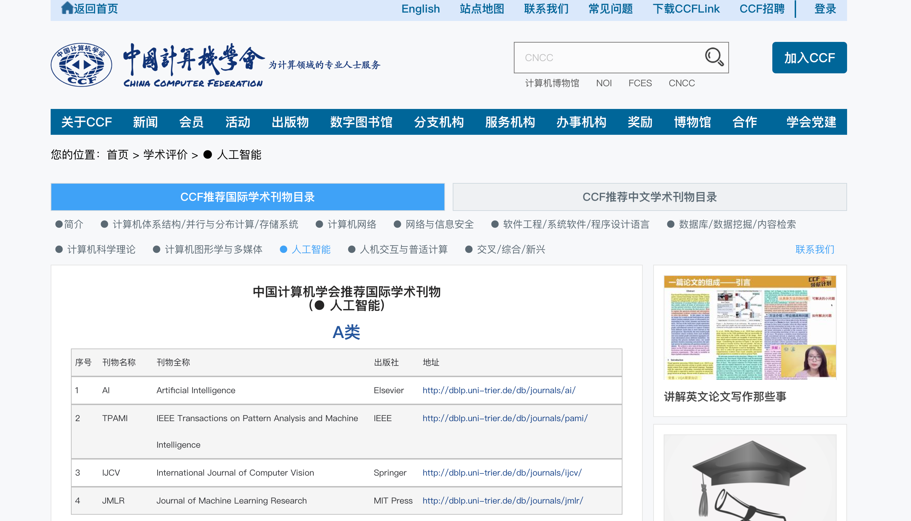
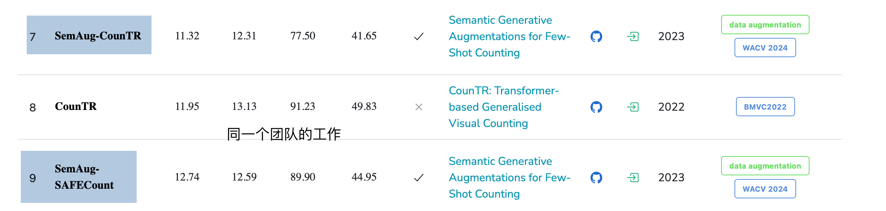

# 索引页
## TODO

- [ ] 整理读过的文献

- [ ] [DINO 检测&计数](https://yinguobing.com/separable-convolution/#fn2)

  

----

## 互联网资源

- [CCF期刊分区查询](https://www.ccf.org.cn/Academic_Evaluation/AI/)

- [Object Counting on FSC147 in paper with code](https://paperswithcode.com/sota/object-counting-on-fsc147)

    

- [郑之杰 目标计数(Object Counting)](https://0809zheng.github.io/2023/05/01/counting.html) 

------

!!! tips
	阅读逻辑：
	

	1. 摘要、引言-贡献、结论（有些会给出未来研究方向）  
	2. introdution相当于 研究背景及意义 给出 motivation  
	3. related work 会给出研究现状  
	4. method 部分 关注小标题  
	5. experiment 都做了什么实验 ：泛化（数据集、任务）、对比（方法）、消融 （模块）

<u>一点有趣的发现：</u>

GeCo作者：27 Sep 2024 · [Jer Pelhan](https://paperswithcode.com/author/jer-pelhan), [Alan Lukežič](https://paperswithcode.com/author/alan-lukezic-1), [Vitjan Zavrtanik](https://paperswithcode.com/author/vitjan-zavrtanik), [Matej Kristan](https://paperswithcode.com/author/matej-kristan)

LOCA作者： [ICCV 2023 ](https://paperswithcode.com/conference/iccv-2023-1) · [Nikola Djukic](https://paperswithcode.com/author/nikola-djukic), [Alan Lukezic](https://paperswithcode.com/author/alan-lukezic), [Vitjan Zavrtanik](https://paperswithcode.com/author/vitjan-zavrtanik), [Matej Kristan](https://paperswithcode.com/author/matej-kristan) 

DAVE作者：25 Apr 2024 · [Jer Pelhan](https://paperswithcode.com/author/jer-pelhan), [Alan Lukežič](https://paperswithcode.com/author/alan-lukezic-1), [Vitjan Zavrtanik](https://paperswithcode.com/author/vitjan-zavrtanik), [Matej Kristan](https://paperswithcode.com/author/matej-kristan) （仓库的共同作者之一：CounTR）（Jer：DAVE & GeCo）

CounTR作者：29 Aug 2022 · [Chang Liu](https://paperswithcode.com/author/chang-liu), [Yujie Zhong](https://paperswithcode.com/author/yujie-zhong), [Andrew Zisserman](https://paperswithcode.com/author/andrew-zisserman), [Weidi Xie](https://paperswithcode.com/author/weidi-xie)  SHJT

semAug counTR作者：26 Oct 2023 · [Perla Doubinsky](https://paperswithcode.com/author/perla-doubinsky), [Nicolas Audebert](https://paperswithcode.com/author/nicolas-audebert), [Michel Crucianu](https://paperswithcode.com/author/michel-crucianu), [Hervé Le Borgne](https://paperswithcode.com/author/herve-le-borgne-1) ·

SemAug-SAFECount：26 Oct 2023 · [Perla Doubinsky](https://paperswithcode.com/author/perla-doubinsky), [Nicolas Audebert](https://paperswithcode.com/author/nicolas-audebert), [Michel Crucianu](https://paperswithcode.com/author/michel-crucianu), [Hervé Le Borgne](https://paperswithcode.com/author/herve-le-borgne-1) ·

22 Jan 2022 · [Zhiyuan You](https://paperswithcode.com/author/zhiyuan-you), [Kai Yang](https://paperswithcode.com/author/kai-yang), [Wenhan Luo](https://paperswithcode.com/author/wenhan-luo), [Xin Lu](https://paperswithcode.com/author/xin-lu), [Lei Cui](https://paperswithcode.com/author/lei-cui), [Xinyi Le](https://paperswithcode.com/author/xinyi-le) （Tsinghua、SHJT）

## 1

- multi-scale feature fusion module
- Transformer →ViT→SwinTransformer
- GAN→diffusion（text to image）
- multimodle：clip（text and image）；user interaction
- SPDCN 修改了 损失函数 ；根据示例尺寸的不同 调整损失函数的形式

## 2

- 计数方法  rank8 CounTR
- 类无关计数 rank8 CounTR
- 数据生成 rank7 SemAug CounTR

## 文献综述

1. FamNet

2. SAFECount

3. GMN

4. BMNet

5. CounTR

6. CountGD

   
