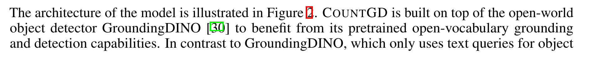
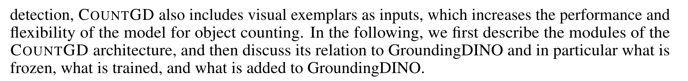
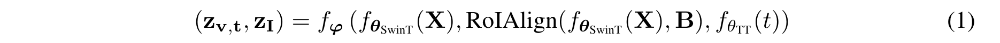
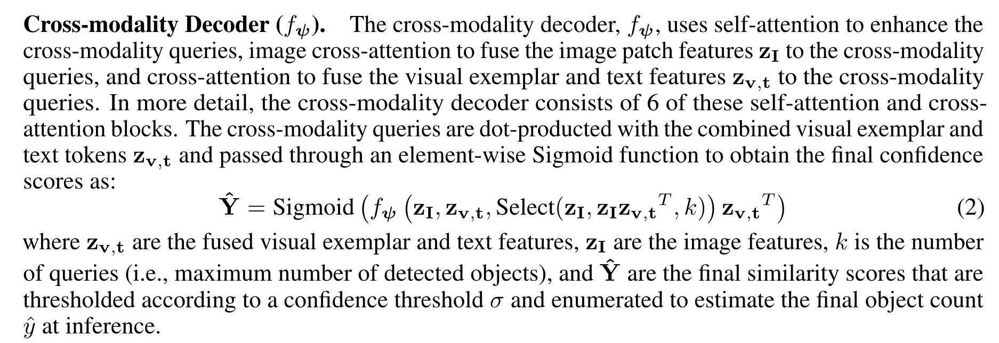

## 多模态特征开放世界目标计数

2024年7月5日 发表

5 Jul 2024 · Niki Amini-Naieni, Tengda Han, Andrew Zisserman · 

##  CountGD: Multi-Modal Open-World Counting

[原文链接](https://arxiv.org/pdf/2407.04619v1)

为了解决什么问题，提出了什么样的解决方法。

文本描述和视觉信号，一起进行计数，文本描述比如会过滤颜色，位置等；

一句话总结本文：Here, we describe COUNTGD, a single-stage model for open-world object counting that accepts either visual exemplars or text or both together as prompts to specify the object to count.

在这里，我们描述了COUNTGD，一个开放世界物体计数的单阶段模型，它接受视觉样本或文本或两者共同作为提示来指定要计数的物体。

!!! note
	COUNTGD的几个关键词，开放世界的物体计数，单阶段模型，视觉信号和文本信号

文本特征哪里来呢？

- 对于FSC147数据集，For text descriptions, we use the singular forms of the class names in `FSC-147-D [1]` with any prefixes such as “the" removed. For example, **we change “the donuts in the donut tray" in FSC-147-D to “donut" by removing the prefix “the,"** extracting the class name “donuts," and then singularizing it to “donut."  托盘中的甜甜圈 $\rightarrow$ 甜甜圈
- CARPK：We use the class name “car" as the text description.

## 摘要

The goal of this paper is to improve the generality and accuracy of open-vocabulary object counting in images. 

为了提高准确性和泛化性，计数现实词表中的一切物体

To improve the generality, we repurpose an open vocabulary detection foundation model (GroundingDINO) for the counting task, and also extend its capabilities by introducing modules to enable specifying the target object to count by visual exemplars. 

为了提高泛化性，重新设计基于开放词表的检测模型：GroundingDINO

增加模块，通过样例框指定计数目标

In turn, these new capabilities – being able to specify the target object by multi-modalites (text and exemplars) – lead to an improvement in counting accuracy. 

通过多模态信息，指定计数目标，提高计数的准确性

 we introduce the first open-world counting model, COUNTGD, where the prompt can be specified by a text description or visual exemplars or both; 

本文提出的模型：COUNTGD，可以利用多模态信息：文本、视觉样例、或者两个都

## 引言-贡献

In summary, we make the following **three contributions**: 

**First,** we introduce COUNTGD, the first openworld object counting model that accepts either text or visual exemplars or both simultaneously, in a single-stage architecture; 

单一结构，同时接收文本信号和视觉信号进行计数

**Second,** we evaluate the model on multiple standard counting benchmarks, including FSC-147 [39], CARPK [18] and CountBench [36], and show that COUNTGD significantly improves on the state-of-the-art performance by specifying the target object using both exemplars and text. It also meets or improves on the state-of-the-art for text-only approaches when trained and evaluated using text-only; 

本文所用数据集：FSC-147 [39], CARPK [18] and CountBench [36]

**Third,** we investigate how the text can be used to refine the visual information provided by the exemplar, for example by filtering on color or relative position in the image, to specify a sub-set of the objects to count.

文本是如何细化由样例提供的视觉信息的，比如：通过对图像中的颜色或相对位置进行过滤，来指定要计数的对象的子集

 **In addition** we make two minor improvements to the inference stage: one that addresses the problem of double counting due to self-similarity, and the other to handle the problem of a very high count.

推理阶段的两个改进：

- 由于自相似性的重复计数问题
- 极度密集场景的计数问题

> 目标计数的两大问题：
>
> 物体堆叠导致的重复计数
>
> 密集场景的计数问题
>

??? question  "难道不是同一个问题？"

## Conclusion & Future Work

We have extended the generality of open-world counting by introducing a model that can accept visual exemplars or text descriptions or both as prompts to specify the target object to count. 

第一点我们进行了开放世界的语义物体计数问题，接收文本描述和示例框信息或者共同

> me：开放世界的语义物体计数、文本描述和视觉示例框
>
> 文本描述是对示例框物体的选择引入额外的监督信号，短语限制

The complementarity of these prompts in turn leads to improved counting performance. 

未来的三个研究方向：

There are three research directions that naturally follow on from this work: 

(i) the performance could probably be further improved by **training on larger scale datasets**, for example using synthetic data as demonstrated recently for counting [24]; 

第一个研究方向：扩展输入数据的丰富性，比如合成数据，呜呜呜呜，跟我想的一样 

(ii) a larger training set would enable a thorough investigation of freezing more of the GroundingDINO model when adding our new visual exemplar modules; and finally, 

更大的训练数据集，对GroundingDINO模型进行更彻底的实验

(iii) the model does not currently predict the errors of its counting. We discuss this point in the Limitations in the Appendix.

!!! note 

	countGD；开放世界的语义物体计数问题；泛化性准确性；text and exemplar

## Related Work

Prior work on object counting has developed along three axes: 目标计数的三个研究维度

(1) the density map versus detection axis, 基于回归的 & 基于检测的

(2) the class-specific versus open-world (also referred to as “class-agnostic") axis, and 特定类别计数 & 开放世界物体计数（类别不敏感计数）

(3) the visual exemplar versus text axis.  基于视觉信号的计数 和 基于文本的计数

The pattern is that detection, open-world, and text-based methods tend to offer more capabilities and be **more general** than their analogues along each axis. 

基于检测、开放世界、文本的方法，泛化性更好

On the other hand, density map, class-specific, and visual exemplar-based methods tend to be more accurate at the counting tasks they apply to. 

基于回归密度图、特定类别、视觉样例框的准确性更好

COUNTGD integrates the third axis – the visual exemplar versus text axis – to achieve more general and accurate counting overall. Below, we discuss where prior work falls along each axis and where COUNTGD stands.

COUNTGD整合了第三个维度，既用文本，又用示例框
!!! note
	我们这个counGD整合了第三个维度，既有视觉信号又有文本信号，再次强调，文本信号泛化性好、视觉信号准确性好，因此既有视觉信号又有文本信号的泛化性和准确性都很好。接下来讨论先前的工作在每个维度的发展以及COUNTGD

### Density Map versus Detection-based Object Counting (Axis 1). 

维度一：基于密度和基于检测

**Density Map versus Detection-based Object Counting (Axis 1).** 

In the past, counting techniques that regress and sum density maps [2, 3, 6, 25, 26, 33, 42], instead of detecting and enumerating bounding boxes [5, 8, 18, 35], have proven more accurate in cluttered and dense scenes. 在先前的工作中，已经证明了，基于密度的物体计数方法在密集场景下的计数适用性

For example, density map-based approaches like CounTX [1], LOCA [10], and CounTR [29] achieve lower counting errors than detection-based approaches such as Mask-RCNN [16] and RetinaNet [27] on standard counting benchmarks. 

举例说明，基于密度比基于检测的发展优势。

Concurrent to our work, DAVE [37], integrates density map regression with object detection to construct a more accurate and explainable two-stage counting system. Like DAVE, COUNTGD outputs explicit object locations.

与我们的工作相一致，DAVE [ 37 ]将密度图回归与目标检测结合起来，构建了一个更精确和可解释的两阶段计数系统。与DAVE一样，COUNTGD输出明确的对象位置。

!!! note 
	DAVE密度图回归和物体检测，输出目标的位置
	两阶段，准确性&泛化性

However, COUNTGD is a single-stage approach that achieves better counting accuracy than DAVE and other density map-based techniques.

然而，COUNTGD是一种单阶段的方法，其计数精度优于DAVE和其他基于密度图的技术。
!!! note 
	嗯，DAVE两阶段，我一阶段，而且是 text&exemplar

Therefore,while density map-based approaches tend to be more accurate than detectors in highly populated scenes, recent detection-based techniques, including COUNTGD, are beginning to achieve better accuracy than density map-based alternatives.

虽然基于密度图的方法在人口稠密的场景中往往比检测器更准确，但最近的基于检测的技术，包括COUNTGD，已经开始取得比基于密度图的方法更好的准确性。
!!! note
	虽然基于密度的很好，但最近基于检测的发展不甘示弱
	COUNTGD 就是基于检测的计数
??? question "为什么叫CountGD？"

### 维度二：特定类别 对比 开放世界物体计数

Class-specific versus Open-world Object Counting (Axis 2). 

Object counting methods first developed as class-specific techniques [3, 4, 34, 42], solving the counting problem for only one category of object, but recent methods have generalized these approaches to open-world settings, where counting arbitrary objects is possible. 就是说，最开始发展的对特定类别的计数，后来演变成对任意物体的计数问题

Class-specific methods have been developed to count cars [22], humans [4], and cells [13]. In contrast, open-world methods can count instances from all three categories [32]. 

举例具体说明

Because class-specific techniques are more specialized than open-world approaches, they tend to be more accurate at counting instances from the class they were designed for. 

就是说，针对特定类别的物体计数准确性确实很好

Recent advancements in **Vision-Language Foundation Models (VLMs)** such as **CLIP [38] and GroundingDINO [30]** trained on web-scale image-text pairs produce semantically rich visual and textual features. 

视觉-语言基础模型( Vision-Language Foundation Models，VLMs )的最新进展，如CLIP [ 38 ]和GroundingDINO [ 30 ]，在网络规模的图像-文本对上进行训练，产生了语义丰富的视觉和文本特征。
!!! note
	emm在这么大规模的数据集上训练，最后就是得到丰富的视觉特征和文本特征

These features generalize to a wide range of open-world downstream tasks. Building on top of these pre-trained VLMs, recent open-world methods [1, 7, 10, 21, 29, 40, 45] have begun to surpass class-specific approaches in counting accuracy. COUNTGD, like these recent approaches, is an open-world object counter that achieves competitive performance in comparison to class-specific alternatives.

这些特征泛化到了广泛的开放世界下游任务中。在这些预训练的VLMs的基础上，最近的开放世界方法[ 1、7、10、21、29、40、45]已经开始超越特定类别的方法在计数精度上。与这些最近的方法一样，COUNTGD是一个开放世界的对象计数器，与特定类的替代品相比，它具有竞争性的性能。

!!! note
	获得语义更加丰富的特征，可以更好的泛化到下游任务。	

### 角度三：视觉特征和文本特征

Counting with Visual Exemplars versus Counting with Text (Axis 3).

Most open-world object counters approach the problem by using visual exemplars to select the objects in the input image [10, 14, 28, 29, 32, 35, 39, 40, 44, 45], but very recent work [1, 7, 19, 21, 43] has attempted to replace the visual exemplars with text, enabling new capabilities at the cost of reduced accuracy. The stateof-the-art text-based approaches, such as GroundingREC [7], CounTX [1], CLIP-Count [19], and VLCounter [21] are built on top of vision-language foundation models pretrained on large quantities of data to relate images to textual inputs and map them to a joint embedding space. 

大多数开放世界对象计数器通过使用视觉样本来选择输入图像[ 10、14、28、29、32、35、39、40、44、45]中的对象来解决问题，但最近的工作[ 1、7、19、21、43]尝试用文本代替视觉样本，以降低准确性为代价来实现新的功能。目前最先进的基于文本的方法，如GroundingREC [ 7 ]，CounTX [ 1 ]，CLIP-Count [ 19 ]和VLCounter [ 21 ]，都是建立在基于大量数据预训练的视觉语言基础模型之上，将图像与文本输入相关联，并将其映射到一个联合嵌入空间。

!!! note	
	之前的计数方法都是通过示例框选择输入图像的目标；最近的工作开始使用文本，还记得吧，文本信号泛化性好，视觉信号准确性好，因此当使用文本信号时，是牺牲了准确性。然后就说，基于文本的预测方法

This allows these foundation models to understand general concepts learned during extensive pretraining and provides a mechanism for users to specify extrinsic object properties through text. However, text-based approaches perform significantly worse than state-of-the-art visual exemplar-based approaches such as LOCA [10], CounTR [29], and few-shot DAVE [37]. For example, while both GroundingREC and COUNTGD use the pretrained GroundingDINO [30] vision-language foundation model, unlike GroundingREC, COUNTGD allows the user to input both visual exemplars and text instead of just text. This enables COUNTGD to achieve superior counting accuracy in comparison to GroundingREC.

这使得这些基础模型能够理解在广泛的预训练中学习到的一般概念，并为用户提供了一种通过文本指定外部对象属性的机制。然而，基于文本的方法的性能明显差于最先进的基于视觉样本的方法，如LOCA [ 10 ]，CounTR [ 29 ]和小样本DAVE [ 37 ]。例如，GroundingREC和COUNTGD都使用了预训练的GroundingDINO [ 30 ]视觉语言基础模型，但与GroundingREC不同的是，COUNTGD允许用户同时输入视觉示例和文本，而不仅仅是文本。这使得COUNTGD相比GroundingREC具有更高的计数精度。

!!! note
	你知道的吧，在视觉文本模型中，可以学到一般概念，所以泛化性更好。但还是那句话，准确性不够。这里还说了与CountGD工作很相似的模型GroundingREC，但是输入信号不一样，相似在于都是基于预训练的GroundingDINO。不相似在于输入信号不一样的

Notably, DAVE [37] is a visual exemplar-based approach that also enables textual prompts, but differs from COUNTGD in three important ways:COUNTGD 与DAVE的三个显著不同

 (1) it does not address the case when both text and visual exemplars are available while COUNTGD does,视觉信号和文本信号都来

 (2) its comparison between text features and image features is not learned as it is by COUNTGD with attention, and     COUNTGD有注意力机制学习文本特征和图像特征

 (3) it is a two-stage approach, while COUNTGD solves the problem in a single stage, without relying on another visual exemplar-based counting model. DAVE两阶段检测方法

值得注意的是，DAVE [ 37 ]是一种基于视觉样例的方法，也可以实现文本提示，但与COUNTGD有3个重要的区别：( 1 )它没有解决COUNTGD同时提供文本和视觉样例的情况；( 2 )它没有像COUNTGD那样在有注意力的情况下学习文本特征和图像特征之间的比较；( 3 )它是一个两阶段的方法，而COUNTGD在一个阶段中解决问题，而不依赖于另一个基于视觉样例的计数模型。

!!! note
	这篇论文的改进论文是DAVE，目标都是一样的，motivation：提高准确率 & 召回率

### Relation of Counting to other areas. 与其它领域工作的关系

>  跟开山之作的相关工作叙述有点像

Our work is related to few-shot image classification [41] and image detection [12, 20] methods.   小样本图像分类和检测

These works require a few query images of novel objects, and then compare the test image with these image examples to determine its semantic content (for image classification), or to spatially localize instances (for object detection). 

我们的工作与小样本图像分类[ 41 ]和图像检测[ 12、20]方法相关。这些工作需要一些新颖对象的查询图像，然后将测试图像与这些图像示例进行比较，以确定其语义内容(对图像进行分类)，或者对实例(针对目标检测)进行空间定位。

Like these methods, COUNTGD enables us to specify the object to count with visual exemplars (i.e., “query images") but also allows for textual inputs, and then compares the test image with the multi-modal specifications to get the final count. Furthermore, we focus on the counting problem, a challenging task for object detectors.

与这些方法一样，COUNTGD允许我们用可视化示例(即"查询图像")指定要计数的对象，但也允许文本输入，然后将测试图像与多模态规范进行比较，得到最终的计数。此外，我们关注计数问题，这是目标检测器的一个具有挑战性的任务。

> 基于检测的方法、完成计数任务，其实现在用基于检测的算法来进行计数任务是比较少的
>

## 3 Counting with Visual Exemplars & Text

Here, we describe COUNTGD, a single-stage model for open-world object counting that accepts either visual exemplars or text or both together as prompts to specify the object to count.

- a single-stage model
- 接收的输入：visual exemplars or text or both together

### 3.1 Overview

**符号说明**

接收指定物体的信号：

- 视觉信号：$B=\{b_1,......,b_N\}$
- 文本信号：$t$
- both：$\{B,t\}$

查询图片：$X\in \mathbb{R}^{H×W×3}$

$\hat{y}=f(X,B,t)$

计数模型记为：f，输出计数数量 $\hat{y}$

图2：模型结构图 

GD 指的是  GroundingDINO的首字母缩写

COUNTGD：是基于GroundingDINO的

GroundingDINO：基于真实世界的开放词表建立的目标检测器

与GroundingDINO不同的是：

- GroundingDINO只接收文本指定查询对象、COUNTGD也可以接受视觉信号

首先 介绍COUNTGD，然后介绍COUNTGD与GroundingDINO的关系，特别是GroundingDINO哪里是被冻结的，哪里是被训练的，以及哪里是被添加到GroundingDINO的

组件说明：

- 推理阶段：At inference the object to be counted can be specified by visual exemplars or text prompts or both.指定计数物体的方法
- 输入图像的处理：$f_{\theta_{SwinT}}$ 提取不同尺度的信息
- $RoIAlign$获得 visual exemplar token
- text token的获得：$f_{\theta_{TT}}$
- 特征增强模块 $f_{\phi}$ ：自注意力模块提取 视觉信号和文本信号，交叉注意力模块融合视觉信号和文本信号，产生特征 $z_{v,t}$ 、图像特征 $z_I$
- 产生跨模态特征： 余弦相似度最高的 $k$ 个图像特征 $z_I$ 和 视觉信号和文本信号的 融合特征 $z_{v,t}$ 传入 跨模态解码器 $f_{\psi}$
- 计算 跨模态解码器 $ f_{\psi}$ 的输出 和 $z_{v,t}$  得到 $\hat{Y}$
- 最终的检测输出： $z_{v,t} ＞ \sigma$ 获得最大相似度的输出
- 整个的模型框架 都是在 GroundingDINO 框架的基础上上改进的，另外添加的部分 用蓝色表示

图3：视觉特征提取模块

（a）对于输入图像，标准的SwinTransformer模型提取视觉特征的 多空间特征

（b）对于有样例框的输入特征图，将多个视觉特征样例框上采样到输入图像的大小，拼接这些特征图，通过1×1卷积，投影到256个通道；最后应用 带有边界框坐标的  RoIAlign 获得 样例框的视觉特征

### 3.2 COUNTGD Architecture Components

图像编码器 $f_{\theta_{SwinT}}$

- 处理两个输入信号：输入图像 $X$ 和 视觉样例框 $B$
- 使用的SwinTransformer的版本 Swin-B
- （输入图像X的建模）如图3(a) 所示，对于输入图像 $X$ 提取3个不同空间尺度的 特征
  > - 三不同大小的统建特征图 通过1×1的卷积核 投影到256维，产生图像token
  > - 不同尺度的图像块对应长度为256的特征向量，作为特征增强模块 $f_{\phi}$的输入
- （样例框 B的建模）如图3(b)，对于视觉样例框 B，复用 输入图像 $X$ 的 空间特征图 $f_{\theta_{SwinT}}(X)$
- 使用 ROI pooling（对齐的感兴趣区域池化?），与视觉示例B指定的像素坐标
- 产生的视觉特征 和 图像和文本token 一样的大小：256维度

文本编码器

- 对于文本编码器 $f_{\theta_{TT}}$，使用基于bert的文本Transformer

- 预训练的数据集：检测和短语定位数据，有图像编码器 $f_{\theta_{SwinT}}$

- 文本编码器将输入对象描述 $t$ 投影到最多256个 token

- 编码后的文本 特征向量是256维的（256个token）

- 图像编码器 $f_{{\theta}_{SwinT}}$ 从输入图像中 提取 $n$ 个 图像块 特征

  > - 当有 $p$ 个 视觉示例 可用时，视觉编码器产生 p 个视觉示例特征
  > - 当bert分词器在文本t中有q个token，文本编码器产生q 个标记

- 最后，获得 特征增强模块的 输入 $f_{\phi}$ 有 ① n个图像token   ②p个视觉样例框token   ③q个文本token

  使用注意力模块融合这三个源的信息

!!!note
	文本特征：
  	clip   bert

特征增强模块 $f_{\phi}$

- 由6个块组成
- 自注意力机制 融合 视觉样例框特征和 文本token
- 交叉注意力模块 融合 合并后的特征和 图像块标记
- 每个模块包括 视觉示例 和 文本标记 连接后的自注意力、图像块 标记之间的可变形自注意力，以及融合后的 视觉示例和文本标记 与图像块标记之间 的图像到文本的交叉注意力 和 文本到图像的交叉注意力
- 这些模块使得COUNTGD能够学习将输入图像、视觉示例和文本查询的信息综合起来
- 特征增强模块 $f_{\phi}$ 输出两组特征，分别表示为  $z_{v,t}$  和 $z_I$

- 融合图像块token、文本token、样例框token

语言和视觉样例框引导的查询选择

- k个图像块 token $z_I$ 和文本 标记 $z_{v,t}$ 具有最高的相似度，这个操作表示 $Select(z_I,z_Iz_v^T,k)$ 
- 其中 $z_Iz_{v,t}^T \in \mathbb{R}^{n ×(p+q)}$  表示 n个图像块 token 和 p+q个视觉样例框和文本 token
- 正如 GroundingDINO，k设置为900
- 具有更高相似度的900个图像token作为跨模态查询 输入到 跨模态解码器 $f_{\phi}$

跨模态解码器 $f_{\psi}$

- 跨模态解码器 $f_{\psi}$ 使用自注意力增强跨模态查询
- 图像交叉注意力将图像块特征 $z_I$ 融合到 跨模态查询中
- 使用交叉注意力将视觉示例和文本特征 $z_{v,t}$ 融合到跨模态查询中
- 跨模态解码器由6个这样的自注意力和交叉注意力模块组成
- 跨模态查询与融合后的视觉示例和文本标记 $z_{v,t}$ 进行点积，并通过逐元素的Sigmoid函数处理，以获得最终的置信度分数，如下所示：

- $z_{v,t}$是融合的视觉示例和文本特征
- $z_I$ 是查询（即检测到的对象的最大数量）
-  $\hat{Y}$ 最终相似度分数
- 分数根据置信度阈值 $\sigma$ 进行阈值处理，并在推理时 用于估计最终的对象计数 $\hat{y}$

设计选择与GroundingDINO的关系

我们选择GroundingDINO[30]而不是其他视觉语言模型（VLMs），是因为其在视觉定位数据上的预训练，使其与其他VLMs（如CLIP[17]）相比具有更细粒度的特征。

为了扩展GroundingDINO以接受视觉示例，我们将其视为文本标记。因为视觉示例和文本都指定了对象，我们认为视觉示例可以被GroundingDINO像文本标记一样对待，并将其整合到训练和推理过程中。在将视觉示例视为短语中的附加文本标记时，我们在对应于视觉示例的短语和视觉示例之间添加自注意力，而不是将它们分开。这使得COUNTGD能够学习融合视觉示例和文本标记，以形成对要计数对象的更具信息性的规范。同样，GroundingDINO的特征增强器和跨模态解码器中图像和文本特征之间的交叉注意力在COUNTGD中变为图像与融合后的视觉示例和文本特征之间的交叉注意力。在GroundingDINO中的语言引导查询选择在COUNTGD中变为语言和视觉示例引导的查询选择。通过这种方式，COUNTGD自然地扩展了GroundingDINO，使其能够输入文本和视觉示例来描述对象。

在GroundingDINO中，图像编码器 $f_{\theta_{\text{SwinT}}}$ 与文本编码器 $f_{\theta_{\text{TT}}}$ 一起在丰富的检测和短语定位数据上进行了预训练，为其提供了丰富的区域和文本感知特征。由于我们希望建立在这个预训练的联合视觉-语言嵌入之上，我们保持图像编码器  $f_{\theta_{\text{SwinT}}}$ 和文本编码器 $f_{\theta_{\text{TT}}}$ 不变。
