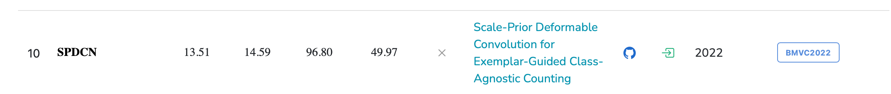

[原文链接](https://paperswithcode.com/paper/scale-prior-deformable-convolution-for)

[源码链接](https://github.com/Elin24/SPDCN-CAC)

引用：2022年的文献

```latex
@inproceedings{Lin_2022_BMVC,
author    = {Wei Lin and Kunlin Yang and Xinzhu Ma and Junyu Gao and Lingbo Liu and Shinan Liu and Jun Hou and Shuai Yi and Antoni Chan},
title     = {Scale-Prior Deformable Convolution for Exemplar-Guided Class-Agnostic Counting},
booktitle = {33rd British Machine Vision Conference 2022, {BMVC} 2022, London, UK, November 21-24, 2022},
publisher = {{BMVA} Press},
year      = {2022},
url       = {https://bmvc2022.mpi-inf.mpg.de/0313.pdf}
}
```

标题：Scale-Prior Deformable Convolution for Exemplar-Guided Class-Agnostic Counting  基于示例的，尺度先验可变卷积，类无关计数（突然想起来，各种卷积，空洞卷积、转置卷积、分组卷积）

作者：[Conference 2022 ](https://paperswithcode.com/conference/conference-2022-12) · [Wei Lin](https://paperswithcode.com/author/wei-lin-1), [Kunlin Yang](https://paperswithcode.com/author/kunlin-yang), [Xinzhu Ma](https://paperswithcode.com/author/xinzhu-ma), [Junyu Gao](https://paperswithcode.com/author/junyu-gao), [Lingbo Liu](https://paperswithcode.com/author/lingbo-liu), [Shinan Liu](https://paperswithcode.com/author/shinan-liu), [Jun Hou](https://paperswithcode.com/author/jun-hou), [Shuai Yi](https://paperswithcode.com/author/shuai-yi), [Antoni B. Chan](https://paperswithcode.com/author/antoni-b-chan)    香港大学


期刊：BMVC2022；CCF-C类

本文 为了解决.......提出了...........

## 摘要

CAC任务进展不错(这是22年的文章，现在做的都是CAC的)

> Class-agnostic counting has recently emerged as a more practical counting task, which aims to predict the number and distribution of any exemplar objects, instead of counting specific categories like pedestrians or cars. 

现有的方法

- 设计合适的相似性匹配规则 在示例和查询图像之间
- 忽略了提取特征的鲁棒性

> However, recent methods are developed by designing suitable similarity matching rules between exemplars and query images, but ignoring the robustness of extracted features. 

为了 提取特征的鲁棒性，提出  尺度先验可变卷积，整合示例信息

> To address this issue, we propose a scale-prior deformable convolution by integrating exemplars’ information, e.g., scale, into the counting network backbone.（效果）As a result, the proposed counting network can extract semantic features of objects similar to the given exemplars and effectively filter irrelevant backgrounds. 提出的计数网络可以提取 给定示例相似目标的 语义特征 并且 过滤掉 不相关的背景信息

传统的L2损失和泛化损失 对于CAC 计数问题 不合适；因为对于不同目标的尺度变化是比较大的

> Besides, we find that traditional L2 and generalized loss are not suitable for class-agnostic counting due to the variety of object scales in different samples. 

为了解决 传统的L2损失对于示例尺度多变的问题，提出了尺度敏感的泛化损失解决这个问题

> Here we propose a scale-sensitive generalized loss to tackle this problem. 

我们提出的损失函数 能做什么？

- 根据给定示例的大小 调整损失函数的形式→预测值和真实值的差异更加明显

> It can adjust the cost function formulation according to the given exemplars, making the difference between prediction and ground truth more prominent. 

结果

> Extensive experiments show that our model obtains remarkable improvement and achieves state-of-the-art performance on a public class-agnostic counting benchmark. the source code is available at https://github.com/Elin24/SPDCN-CAC.

### 总结摘要

1. 为了 提取特征的鲁棒性，提出  尺度先验可变卷积，整合示例信息
2. 为了解决 传统的L2损失对于示例尺度多变的问题，提出了尺度敏感的泛化损失解决这个问题

## 引入——贡献

To summarize, the key contributions of this paper are:

- To address class-agnostic counting, we propose a scale-prior deformable network to better extract exemplar-related features, followed by a segmentation-then-counting stage to count objects. 

> 为了解决CAC，我们提出了尺度优先可变卷积 更好的提取与样例框有关的特征；跟着一个先分割后计数的阶段来数目标

- We propose a scale-sensitive generalized loss to make the model training adaptive to objects of different sizes, boosting the performance and generalization of trained models. 

> 提出了 尺度敏感的泛化损失，使得模型更好的适用 不同尺寸的物体；增强模型的泛化性和性能

- （结果）Extensive experiments and visualizations demonstrate these two designs work well, and outstanding performance is obtained when our model is tested on benchmarks.（有实验、有可视化）

### 总结

- 尺度优先可变卷积 提取样例框特征；
- 尺度敏感的泛化损失

## 结论

**第一个提出**

In this paper, we explore exemplar-guided class-agnostic counting. 

> 这篇文章 雀氏主要研究的样例框指导的CAC计数问题
>
> 尺度优先的可变卷积是为了 整合样例框信息，使得提取到的特征更具有稳健性

To take advantage of scale information provided by exemplars, scale-prior deformable convolution is proposed to adjust the receptive fields according to the given exemplars. 

> 为了更好地利用尺度信息，尺度优先的可变卷积 被提出 更好的适应 给定示例的感受野

（结果）Experimental results show that this operation decreases counting errors dramatically and gives a more accurate density distribution. 

**第二个提出**

We also propose scale-sensitive generalized loss to adapt the cost function according to exemplars, so that different training samples with different object scales have their own distance function for optimal transport.

> 同样提出 尺度敏感的泛化损失 适应损失函数，因为示例是尺度变化的
>
> 不同的训练样本有不同的尺度变化

（结果） This new loss further helps our model perform better than previous models on the class-agnostic counting benchmark.

!!! note
	写作逻辑：    
	(1)提出方法    
	(2)说明你结果  

## 引入

Introduction

### P1 从特定类别说起

!!! info
	P1 

	（1）从特定类别的目标计数开始说，应该是文章比较早，所以对于为什么要求CAC计数的背景和动机说的很具体
	
	（2）引入部分 都是从sepcific说起

> In recent years, remarkable progress has been achieved in counting tasks. However, most methods only work in a category-specific manner, like counting crowd [34] or vehicles [20], and thus they fail to meet the requirements of some real-world applications.  特定类别的计数：人群计数&车辆计数；不能满足实际应用的需要；

CAC的实际应用场景

> （1）For example, there exist demands for counting goods in various categories in supermarkets or warehouses [7]; 超市或者仓库中 商品计数
>
> （2） in agriculture, predicting the crop yield of different fruits/vegetables is required [14, 37]; 农业中，不同果蔬作物产量预测
>
> （3）and some may want to know the number of different trees [3, 21]. 不同树数量预测

**<u>但是，引出下一段</u>**   However, with traditional counting methods, a separate counting model is needed for each object class, which limits its practical applications.

!!! info

### 	P2  CAC问题的说明，从定义、损失到模型概述  

	这里的模型概述跟以前的不大一样，是说模型方法以后 就会指出问题

CAC问题的定义

> To tackle the above problem, this paper considers class-agnostic counting, in which counting models predict the number and distribution of objects indicated by a few object exemplars in a set of query images. 

CAC的损失是如何定义的

> During training, both images and exemplars are input to the counting model, and then the loss is calculated between the predicted density maps and human-annotated dot maps [23]. 

现在的CAC挺好的，但还有改进的空间

> Although existing class-agnostic counting methods have achieved good performance, there is still much room for improvement.

CAC文献概述

第一个CAC引用：GMN

> For example, GMN [16] resizes the given exemplars to a fixed size and then calculates the distance between the exemplar’s feature and local regions of the query image to localize the object of interest. One problem in this process is that exemplar features will lose the scale information provided by the exemplar’s size.  问题在于：损失了示例的尺寸信息

第二个CAC引用：BMNet [26] 

> Although BMNet [26] adds a scale embedding to its network to tackle this problem, its function is not intuitive. BMNet解决通过 尺度嵌入 解决GMN的问题；但是并不直观

### P3 引出尺度优先可变卷积

上面提出问题，接下来解决问题，为了更好的利用尺度信息，提出尺度优先可变卷积，提取特定尺寸的目标特征

> To take advantage of scale information, we design a Scale-Prior Deformable Convolution Network (SPDCN) to extract features of objects with specific size. 

具体怎么实现的

> SPDCN embeds the scale information into the deformable convolution, so that its receptive field is adjusted automatically and extracts features corresponding to the scale of the given exemplars. 
>
> SPDCN把尺度信息嵌入到可变卷积中，这样感受野就能自适应的调整；并且提取给定示例尺度特征
>
> This design significantly boosts the counting performance because objects in the same category typically have similar scale in an image, whereas different object categories may have vastly different scales. 
>
> 这种设计能显著提高计数性能，因为相同类别的目标在同一张图片上的尺寸是相同的；然而不同类别的目标物体尺寸变化是很大的
>
> With the extracted features, SPDCN then computes the similarity between exemplars and query images to segment out regions containing the counted objects. After that, the generated similarity map and features are sent to a decoder to estimate the density map.
>
> 然后，利用提取的特征，SPDCN计算示例图像和查询图像之间的相似度，以分割出包含被统计对象的区域。之后，将生成的相似度图和特征送入解码器来估计密度图。
>

SPDCN 主要处理的就是样例框尺寸变化比较大的问题，这里用的词：分割

### P4  指出 我们提出的损失函数 scale-sensitive generalized loss

> We apply the generalized loss [31] to train SPDCN. However, we find that the vanilla generalized loss is unsuitable for class-agnostic counting because its cost function assumes all objects (people) are the same size, whereas in class-agnostic counting, different object categories have different scales. To tackle this problem, we propose a scale-sensitive generalized loss, in which the cost function is adjusted adaptively based on the object scale. Experiments show that the performance is further improved with our adaptive loss function.

P5 贡献 想看点左侧目录跳转


!!! info
	引入部分的写作逻辑

	1. 特定类别的目标计数   
	2. CAC计数   
	3. 引出可变卷积    
	4. 引出 尺度敏感的损失    
	5. 贡献   

## 相关工作

!!! info
	分成的三部分：

	Class-Agnostic Counting. 类别不敏感计数
	
	Deformable Convolution. 可变卷积
	
	Generalized Loss. 泛化损失

### 第一段：从sepcific → CAC

**Class-Agnostic Counting.** 

特定类别计数

> Previous counting tasks mainly aim at counting objects in a specific category. 
>
> The most popular task is crowd counting [17, 19, 29, 31, 32, 34, 35]. Vehicle [11, 20], cell [8, 9] and animal [24] counting also attract researchers’ attention, and are applied in various aspects like vehicular management [33], medical research [4], wildlife conservation [1], and so on.

 **However,** only a few methods have considered class-agnostic object counting, and relevant datasets are rare. 

CAC计数

FamNet

> FamNet [23] defines class-agnostic counting as predicting the number of given objects represented by only a few exemplars in the same image and constructs the first dataset called FSC-147 [23]. Its baseline model is designed based on self-similarities matching [25]. One problem is that the scale of exemplars is modeled by the kernel size, which is normally too large to compute, so FamNet freezes the parameters in the extractor to overcome this problem. 

GMN

> Another similar work is the generic matching network (GMN) [16], which encodes the semantic feature of exemplars to an embedding, and then uses a matching network to model the relation between the exemplar embedding and the image’s feature maps. However, GMN does not consider the scale problem because the size of the embedding vector is fixed. 

BMNet

> BMNet [26] considers the scale problem and adds scale embedding into its model, but it is not intuitive. 

Our SPDCN

> Compared with these previous works, our proposed SPDCN embeds scale information into the deformable convolution so that the extracted feature can match the exemplar more accurately, yielding improved performance.

### 第二段 可变卷积的相关工作  

**Deformable Convolution.** 

因为本文用到了可变卷积，所以介绍了可变卷积的相关工作

> Deformable convolution [2, 38] was proposed for modeling geometric transformations dynamically, and has been applied to video super-resolution [30], font generation [36] and other computer vision tasks. 可变卷积用来干啥的：动态建模几何变换，已经应用于视频超分辨率[ 30 ]、字体生成[ 36 ]等计算机视觉任务（没了解过 可变卷积


> Compared to the previous works, we introduce scale-prior deformable convolution to class-agnostic counting, where the receptive fields of the counting network are adjusted according to the given exemplars.与之前的工作相比，我们将尺度先验可变形卷积引入到类别无关计数中，其中计数网络的感受野根据给定的样本进行调整。

### 第三段 关于损失的额相关工作

**Generalized Loss.** 

（之前人的工作）

> The generalized loss [31] is designed based on the unbalanced optimal transport (UOT) problem. [31] prove that both L2 loss and Bayesian loss [18] are special cases of the generalized loss. 

（作者的工作）

> In contrast to [31], which uses a fixed cost function assuming all objects are similar sizes, we propose a scale-sensitive generalized loss for class-agnostic counting, where different object categories have different sizes. Experimental results show that class-agnostic counting models perform better with the scale-sensitive generalized loss, compared to the original version.

- 我们没有采用固定不变的损失函数、为相似尺寸的所有目标
- 我们提出尺度敏感的 泛化损失，不同类的目标 有 不同的尺寸，所以损失函数也不一样
- 结果