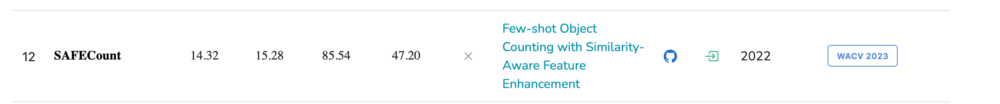

today：241119 TUE

[原文链接](https://arxiv.org/pdf/2201.08959v5)

[源码链接](https://github.com/zhiyuanyou/SAFECount)

axriv日期：2022年9月11日

作者：清华大学、上海交通大学

会议：

WACV 

WACV（IEEE Winter Conference on Applications of Computer Vision） *IEEE冬季计算机视觉应用会议*  会议（重要会议）

22 Jan 2022 · [Zhiyuan You](https://paperswithcode.com/author/zhiyuan-you), [Kai Yang](https://paperswithcode.com/author/kai-yang), [Wenhan Luo](https://paperswithcode.com/author/wenhan-luo), [Xin Lu](https://paperswithcode.com/author/xin-lu), [Lei Cui](https://paperswithcode.com/author/lei-cui), [Xinyi Le](https://paperswithcode.com/author/xinyi-le) 

> 三年前的文章

Title：Few-shot Object Counting with Similarity-Aware Feature Enhancement

基于相似性感知特征增强的少样本计数

## 摘要

（问题定义）This work studies the problem of few-shot object counting, which counts the number of exemplar objects (i.e., described by one or several support images) occurring in the query image. 

（指出问题）The major challenge lies in that **the target objects can be densely packed** in the query image, making it hard to recognize every single one.

（解决问题） To tackle the obstacle, we propose a novel learning block, equipped with a similarity comparison module and a feature enhancement module. 

提出相似性比较模块和特征增强模块 解决 目标堆叠的现象

（具体来说）Concretely, given a support image and a query image, we first derive a score map by comparing their projected features at every spatial position. 

具体来说，给定一幅支持图像和一幅查询图像，我们首先通过比较它们在每个空间位置上的投影特征得到一个得分图。

The score maps regarding all support images are collected together and normalized across both the exemplar dimension and the spatial dimensions, producing a reliable similarity map. 

所有支持图像的得分图被收集在一起，并在样本维度和空间维度上进行归一化，从而产生可靠的相似度图。

We then enhance the query feature with the support features by employing the developed point-wise similarities as the weighting coefficients. 

然后，我们通过使用点相似性作为加权系数，用支持特征来增强查询特征。

Such a design encourages the model to inspect the query image by focusing more on the regions akin to the support images, leading to much clearer boundaries between different objects. 

这样的设计鼓励模型对查询图像进行检查，更多地关注与支持图像相似的区域，使得不同对象之间的边界更加清晰。

（结果）Extensive experiments on various benchmarks and training setups suggest that we surpass the state-of-the-art methods by a sufficiently large margin. For instance, on a recent large-scale FSC-147 dataset, we surpass the state-of-the-art method by improving the mean absolute error from 22.08 to 14.32 (35%↑). Code has been released here.

## intro-contribution

In this work, we propose a **S** imilarity-**A** ware **F** eature  **E**  nhancement block for object Counting (SAFECount). 

相似性感知特征增强模块

As discussed above, feature is more informative while similarity better captures the support-query relationship. Our novel block adequately integrates both of the advantages by exploiting similarity as a guidance to enhance the features for regression. Intuitively, the enhanced feature not only carries the rich semantics extracted from the image, but also gets aware of which regions within the query image are similar to the exemplar object. Specifically, we come up with a **similarity comparison module (SCM)** and a **feature enhancement module (FEM)**, as illustrated in Fig. 2c. On one hand, different from the naive feature comparison in Fig. 2b, our SCM learns a feature projection, then performs a comparison on the projected features to derive a score map. This design helps select from features the information that is most appropriate for object counting. After the comparison, we derive a reliable similarity map by collecting the score maps with respect to all support images (i.e., few-shot) and normalizing them along both the exemplar dimension and the spatial dimensions. On the other hand, the FEM takes the point-wise similarities as the weighting coefficients, and fuses the support features into the query feature. Such a fusion is able to make the enhanced query feature focus more on the regions akin to the exemplar object defined by support images, facilitating more precise counting.

## Conclusion

## intro

### P1 specific object class  CSC计数

Object counting [3, 4], which aims at investigating how many times a certain object occurs in the query image, has received growing attention due to its practical usage [8, 13, 19, 51]. Most existing studies assume that the object to count at the test stage is covered by the training data [1, 10, 11, 19, 31, 50, 51]. As a result, each learned model can only handle a specific object class, greatly limiting its application.

### P2  FSC计数 定义

To alleviate the generalization problem, few-shot object counting (FSC) is recently introduced [24]. Instead of predefining a common object that is shared by all training images, FSC allows users to customize the object of their own interests with a few support images, as shown in Fig. 1. In this way, we can use a single model to unify the counting of various objects, and even adapt the model to novel classes (i.e., unseen in the training phase) without any retraining.

### P3  FSC方法概述

A popular solution to FSC is to first represent both the exemplar object (i.e. the support image) and the query image with expressive features, and then pinpoint the candidates via analyzing the feature correlation [20, 24, 46].  FSC的一个流行的解决方案是首先将示例对象(即支撑图像)和查询图像都表示为具有表达性的特征，然后通过分析特征相关性[ 20、24、46 ]来确定候选对象。

Active attempts roughly fall into two folds. One is feature based [20], as shown in Fig. 2a, where the pooled support feature is concatenated onto the query feature, followed by a regress head to recognize whether the two features are close enough. 

尝试大致分为两种。一种是基于特征的方法[ 20 ]，如图2a所示，其中池化的支持特征被连接到查询特征上，然后是一个回归头来识别两个特征是否足够接近。

空间信息由于池化没有了

**However**, the spatial information of the support image is omitted by pooling, leaving the feature comparison unreliable. 

The other is similarity-based [24,46], as shown in Fig. 2b, where a similarity map is developed from raw features as the regression object. Nevertheless, the similarity is far less informative than feature, making it hard to identify clear boundaries between objects (see Fig. 5). Accordingly, the counting performance heavily deteriorates when the target objects are densely packed in the query image, like the shoal of fish in Fig. 1.

另一种是基于相似性的[ 24、46 ]，如图2b所示，其中相似性图是由原始特征作为回归对象开发的。然而，相似度的信息量远不如特征，这使得(见图5)的对象之间很难识别出清晰的边界。因此，当目标物体在查询图像中密集排列时，计数性能严重恶化，如图1中的鱼群。

### P4贡献

P5：FSC147数据集 & CARPK数据集

## related work

分为三个部分

- 特定物体计数
- FSC 小样本计数
- 小样本学习

### 第一部分：CSC 计数

> CAC计数 & CSC计数 计数物体
>
> FSC计数 & ZSC计数  **计数方法** density-based；detection-based

==描述现状== Class-specific object counting counts objects of a specific class, such as people [19, 31, 50, 51], animals [1], cars [10], among which crowd counting has been widely explored. For this purpose, traditional methods [14, 33, 38] count the number of people occurring in an image through person detection. 

==出现问题== However, object detection is not particularly designed for the counting task and hence shows unsatisfying performance when the crowd is thick. 

==解决问题== **To address this issue**, recent work [37] employs a deep model to predict the density map from the crowd image, where the sum over the density map gives the counting result [15]. Based on this thought, **many attempts** have been made to handle more complicated cases [2, 18, 23, 27–29, 42, 44, 47, 48, 51]. **Some recent studies** [31, 36] propose effective loss functions that help predict the position of each person precisely. 

==出现问题== However, all of these methods can only count objects regarding a particular class (e.g., person), making them hard to generalize. 

==解决问题== There are also some approaches targeting counting objects of multiple classes [13, 21, 32, 43]. In particular, **Stahl et al. [32]** propose to divide the query image into regions and regress the counting results with the inclusion-exclusion principle. **Laradji et al. [13]** formulate counting as a segmentation problem for better localization. **Michel et al. [21]** detect target objects and regress multi-class density maps simultaneously. **Xu et al. [43]** mitigate the mutual interference across various classes by proposing categoryattention module. 

还是不能数没在训练集见过的 Nevertheless, they still can not handle the object classes beyond the training data.

### 第二部分 FSC计数

Few-shot object counting (FSC) has recently been proposed [20, 24, 46] and presents a much stronger generalization ability. Instead of pre-knowing the type of object to count, FSC allows users to describe the exemplar object of their own interests with one or several support images. This setting makes the model highly flexible in that it does not require the test object to be covered by the training samples. 

In other words, a well-learned model could easily make inferences on novel classes (i.e., unseen in the training phase) as long as the support images are provided. To help the model dynamically get adapted to an arbitrary class, a great choice is to compare the object and the query image in feature space [20, 24, 46]. 

**GMN [20]** pools the support feature, and concatenates the pooling result onto the query feature, then learns a regression head for pointwise feature comparison. However, the comparison built on concatenation is not as reliable as the similarity [46]. 

Instead, **CFOCNet [46]** first performs feature comparison with dot production, and then regresses the density map from the similarity map derived before. 

**FamNet [24]** further improves the reliability of the similarity map through multi-scale augmentation and test-time adaptation. But similarities are far less informative than features, hence regressing from the similarity map fails to identify clear boundaries between the densely packed objects. In this work, we propose a similarity-aware feature enhancement block, which integrates the advantages of both features and similarities.