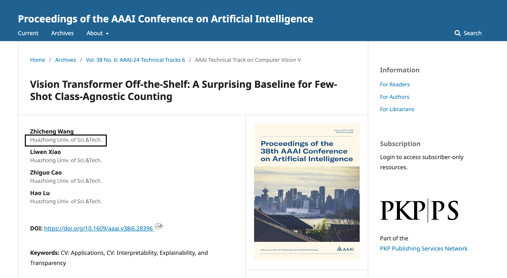
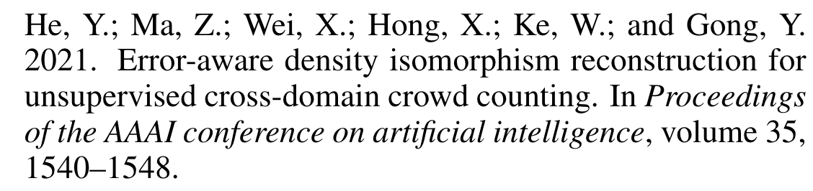
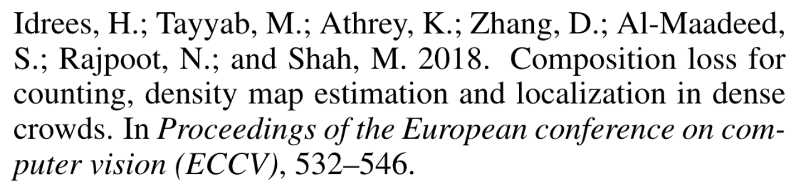
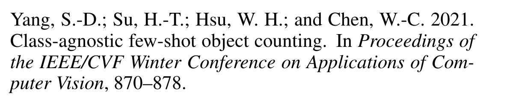

!!! info 
	本文概括   
	1.基于ViT 同时进行提取和匹配，decoupled view  （解决了以前：先提取后匹配的模式）   
	2.纵横比感知的尺度嵌入 和 数量级嵌入   
	3.数据集：FSC147 & CARPK  


引用：

```
@inproceedings{wang2024vision,
  title={Vision transformer off-the-shelf: A surprising baseline for few-shot class-agnostic counting},
  author={Wang, Zhicheng and Xiao, Liwen and Cao, Zhiguo and Lu, Hao},
  booktitle={Proceedings of the AAAI Conference on Artificial Intelligence},
  year={2024}
}
```

[原文链接](https://arxiv.org/pdf/2305.04440v2)

[源码链接](https://github.com/Xu3XiWang/CACViT-AAAI24)

arxiv日期：2024年3月4日

today： 241117

[正式发表页面](https://underline.io/lecture/93103-vision-transformer-off-the-shelf-a-surprising-baseline-for-few-shot-class-agnostic-counting) 提供视频讲解


作者：华中科技大学



标题：Vision Transformer Off-the-Shelf: A Surprising Baseline for Few-Shot Class-Agnostic Counting

基于现有的ViT架构：FSC计数方法


作者

- 教育部图像处理和智能控制重点实验室
- 华中科技大学 人工智能与自动化学院

## Abstract

Class-agnostic counting (CAC) aims to count objects of interest from a query image given few exemplars. 

问题定义：FSC few shot counting

CAC：class-agnostic counting

<u>合起来自己造个就是：FSCAC few-shot class-agnostic counting小样本类无关计数方法研究</u>

This task is typically addressed by extracting the features of query image and exemplars respectively and then matching their feature similarity, leading to an ==extract-then-match== paradigm.

图片特征  和 样例框特征  分别提取 然后进行匹配

**<u>指出研究现状：先提取再匹配  extract-then-match paradigm</u>**

 In this work, we show that CAC can be simplified in an ==extract-and-match manner==, particularly using a vision transformer (ViT) where feature extraction and similarity matching are executed simultaneously within the self-attention. 

ViT中的自注意力机制，同时进行特征提取和匹配

We reveal the rationale of such simplification from a **decoupled view** of the self-attention. The resulting model, termed **CACViT**, simplifies the CAC pipeline into a single pretrained plain ViT. 

Further, to compensate the loss of the scale and the order-of-magnitude information due to resizing and normalization in plain ViT, we present two effective strategies for scale and magnitude embedding.

为了弥补缺失的信息：尺度嵌入 & 数量级嵌入

Extensive experiments on the FSC147 and the CARPK datasets show that CACViT significantly outperforms state-of-the-art CAC approaches in both effectiveness (23.60% error reduction) and generalization, which suggests CACViT provides a concise and strong baseline for CAC. Code will be available.

本文的数据集： the FSC147 and the CARPK datasets

!!! note

	本文的创新点：1+2
	
	1:CACViT:同时进行特征提取出和匹配，利用ViT架构，decoupled view
	
	2:尺度嵌入、数量级嵌入

## Introduction contribution

In a nutshell, our contributions are three-fold: 

- A novel extract-and-match paradigm: we show that simultaneous feature extraction and matching can be made possible in CAC; 同时进行特征提取和匹配
- CACViT: a simple and strong ViT-based baseline, sets the new state-of-the-art on the FSC-147 benchmark; 基于ViT
- We introduce two effective strategies to embed scale, aspect ratio, and order of magnitude information tailored to CACViT. 基于纵横比感知的尺度嵌入、数量级嵌入

## Conclusions

In this work, we propose a simple yet efficient ViT-based model CACViT for CAC. 基于ViT架构，解决CAC问题，取名：CACViT

Specifically, we show that the ViT is naturally suitable for the CAC task from a decoupled view. 解耦视角下，解读ViT

And we propose a ViT-based extract-and-match paradigm for CAC. 基于ViT同时进行提取&匹配

Then we introduce aspect-ratio-aware scale embedding and magnitude embedding to compensate for the information loss. 纵横比感知的尺度嵌入和数量级嵌入，弥补丢失的信息

Our CACViT achieves stat-of-the-art results on FSC147, and we also verify the generality on CARPK.

数据集：FSC147&CARPK

## Introduction

**P1** **目标计数，最开始针对特定领域**

Object counting aims to estimate the number of objects from a query image. Most prior object counting approaches target a specific domain, e.g., crowd (Zhang et al. 2015; Shu et al. 2022; Zou et al. 2021), plant (Lu et al. 2017; Madec et al. 2019), and car (Onoro-Rubio and L ́ opez-Sastre 2016). 

They often require numerous class-specific training data to learn a good model (Wang et al. 2020). 

**过渡到类无关计数方法**

In contrast, Class-Agnostic Counting (CAC), whose goal is to estimate the **counting value of arbitrary categories given only few exemplars 给定示例框计数任意类别**, has recently received much attention due to its potential to generalize to unseen scenes and reduced reliance on class-specific training data (Lu, Xie, and Zisserman 2019; Ranjan et al. 2021; Shi et al. 2022; Liu et al. 2022).

**P2**  **说的是  extract-then-match paradigm**

CAC is first introduced by Lu et al. (Lu, Xie, and Zisserman 2019), which is by default formulated as a template matching problem, leading to an extract-then-match paradigm. 

CAC任务最早引入： Lu et al. (Lu, Xie, and Zisserman 2019)，定义为模板匹配问题，先提取后匹配的模式

Previous models (Ranjan et al. 2021; Shi et al. 2022; Lin et al. 2022) use shared CNN for query images and exemplars feature extraction, as the bottom-up feature extraction approach of the CNN can adapt to images of entirely different sizes. CNN自底向上的特征提取方式可以适应大小完全不同的图像。

**（CounTR）**  Witnessing the ability of marking the responses on the attention map by cross-attention mechanism, some models such as CounTR (Liu et al. 2022) employs cross-attention to match the features of query image and exemplars.However, in CounTR the query feature and exemplar feature are embedded separately by a ViT and a CNN, and the matching part is achieved by an extra cross-attention stage. This strategy introduces much redundancy and task-specific designs, which is not in line with the trend of task-agnostic foundation models.

一些模型如CounTR ( Liu et al 2022)等利用交叉注意力机制在注意力图上标记响应的能力来匹配查询图像和示例的特征。然而，在CounTR中，查询特征和样例特征分别由一个ViT和一个CNN嵌入，匹配部分由额外的交叉注意力阶段实现。这种策略引入了大量的冗余和任务相关的设计，不符合任务无关基础模型的发展趋势。

**P3 ViT的发展**

Recently, the computer vision community has witnessed great success with plain ViT in large multi-modal architectures (Touvron et al. 2023; Yu et al. 2022). Soon much work emerges for better adaptation of ViT on downstream vision tasks, such as object detection (Li et al. 2022; Lin et al. 2023), pose estimation (Xu et al. 2022, 2023) and image matting (Yao et al. 2023). As a template matching task, CAC is essentially suitable for using ViT with its attention mechanism; however, there is little focus on the adaptation of ViT on CAC task.

**P4 引出ViT和CAC的关系**

In this work, we share insights that the attention mechanism in plain ViT has the ability to extract the features for both the query image and the exemplars and perform feature matching for them. By grouping the query and exemplar tokens into concatenation and feeding them to a plain ViT, the self-attention process in ViT can be divide into two groups of self-attention, and two groups of cross-attention. The former self-attentions are to extract features for the query image and the exemplars, while the latter cross-attentions contains the matching process between the query image and the exemplars. Therefore, without multiple feature extractors or extra post-matching, it produces a novel extract-andmatch paradigm. Compared with prior arts, the extra attention from the query feature to the exemplars would further provide additional class information to the query image in this paradigm, enabling better perception of objects.Based on this idea, we propose a framework for CAC that mainly contains a single pretrained ViT, which verifies the feasibility of plain ViT for CAC task.

P5

For better adaptation of ViT to the specific CAC task, we introduce more insights closely related to CAC task in our model design. Specifically, we observe that certain restrictions or functions such as resizing and softmax normalization within this architecture can result in the loss of scale information and the order of magnitude of counting values. First, the exemplars must be resized to fit the ViT input, which introduces size ambiguity during matching. Prior CNN-based models (Shi et al. 2022) attempt to compensate for the scale information with scale embedding for exemplars; however, they neglect the information of aspect ratios, which is crucial for classes with abnormal ratios. This is largely overlooked in the existing literature. Second, the attention map with softmax function can represent the relative distribution of objects in the query image and therefore weakens the awareness of the model to the number of objects. We address this by restoring the magnitude order in the normalized attention map. Both the proposed scale embedding and magnitude embedding are easy to implement. By infusing the scale and the magnitude information into the plain ViT architecture, we acquire a surprisingly simple yet highly effective ViT baseline for CAC. The resulting model, termed CACViT, fully leverages the self-attention mechanism in ViT while also being tuned to mitigate the defects of this architecture in this task.

P6

Experiments on the public benchmark FSC147 (Ranjan et al. 2021) show that CACVit outperforms the previous best approaches by large margins, with relative error reductions of 19.04% and 23.60% on the validation and test sets, respectively, in terms of mean absolute error. Its cross-dataset generalization is also demonstrated on a car counting dataset CARPK (Hsieh, Lin, and Hsu 2017). We also provide extensive ablation studies to justify our propositions.

P7 贡献

## Related Work

P1 

The task of CAC is composed of two main components: feature extraction and feature matching. We first review each component in previous counting models, then discuss jointly feature extraction and matching in the other fields.

!!! note  国内的研究现状的分三方面论述
	Feature Extraction in Class-Agnostic Counting. CAC 的特征提取  
	Feature Matching in Class-Agnostic Counting CAC中的特征匹配问题  
	Jointly Feature Extraction and Matching. 同时进行提取 & 匹配 


<u>P2 CAC问题中的特征提取</u>

**Feature Extraction in Class-Agnostic Counting.**

 The investigation of feature extraction in counting first began with class-specific counting (Abousamra et al. 2021; Cao et al. 2018; He et al. 2021; Idrees et al. 2018; Laradji et al. 2018; Cheng et al. 2022). In **class-specific counting**, most works are designed to address the challenges posed by quantity variance and scale variance. (特定类别)

> Abousamra et al. 2021; 
>
> 
>
> Cao et al. 2018;
>
> 
>
>  He et al. 2021;
>
> 
>
>  Idrees et al. 2018; 
>
> 
>
> Laradji et al. 2018;
>
> 
>
> Cheng et al. 2022
>
> 
>
> 都是一些 我没了解过的参考文献，笑)

For **class-agnostic counting（类无关）**, the core of feature extraction include unified matching space apart from challenges as above. To obtain a unified matching space, most previous work (Ranjan et al. 2021; Shi et al. 2022; You et al. 2023) uses the shared CNN-based feature extractors for query images and exemplars. CounTR (Liu et al. 2022), which first introduces the ViT for feature extraction in CAC, uses different feature extractors for the query images (a ViT) and exemplars (a CNN). Hence, a two-stage training scheme is used for unifying the feature space.

> Ranjan et al. 2021;  **FamNet FSC147数据集、CAC任务的第一篇嘛？anyway经典文献了属于**
>
> 
>
> Shi et al. 2022;   BMNet
>
> 
>
> You et al. 2023
>
> 
>
> CounTR (Liu et al. 2022) 老熟人惹倒是
>
> 

<u>P3 CAC问题中的特征匹配</u>

**Feature Matching in Class-Agnostic Counting.**

Compared with feature extraction, matching strategies in CAC have garnered more attention. （特征匹配实际上有更多的关注度）

The key points of the matching include the following two:  匹配问题中主要关注的两个方面

1) robustness to appearance variance, and  对于外观的多变 依然保持稳健性  
2) ability to characterize quantity levels.  对于数量变化的稳健性

In the early attempt, naive inner product (Ranjan et al. 2021; Yang et al. 2021) is used, which is not robust to the appearance variance of objects to be counted. 

> **Ranjan et al. 2021  FamNet** 
>
> 
>
> Yang et al. 2021  
>
> 
>

**Shi et al. (Shi et al. 2022)** developed a bilinear matching network **(BMNet)** that expands the fixed inner product to a learnable bilinear similarity metric, which improves the robustness compared with the inner product. 

The recent ViT-based model **CounTR (Liu et al. 2022)** uses cross-attention for matching, which seems a natural choice for a transformer-based solution at first glance. **However**, we show that, in our plain ViT model CACViT, we can perform feature matching at the same time of extracting features by self-attention.

> CounTR
>
> CACViT

P4

**Jointly Feature Extraction and Matching.** 

For template matching and multi-modal tasks, feature extraction and matching are two main components. In tracking and detection tasks, MixFormer network (Chen et al. 2022) and FCT network (Han et al. 2022) were proposed to enhance the correlation between the target object and the image, thereby obtaining enhanced features for localization head.

 In multimodal tasks, ViLT (Kim, Son, and Kim 2021) strengthens the interaction between text and image during the feature extraction stage, resulting in efficient multi-modal features that benefit the performance of downstream tasks.  多模态

To the best of our knowledge, we are the first to simultaneously consider feature extraction and matching in CAC, and we provide a decoupled analysis of the feasibility of this paradigm in the CAC, thereby streamlining the workflow of CAC task.我们是第一个同时进行特征提取&匹配的|241117

## Class-Agnostic Counting Vision Transformer

Todo
