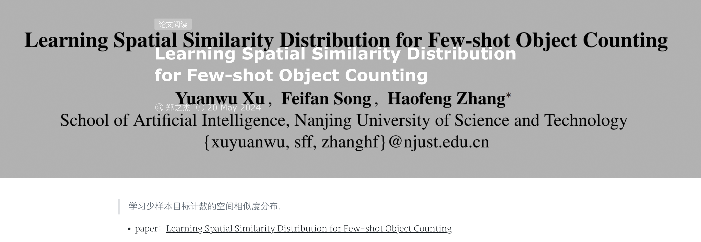

[原文链接](https://arxiv.org/pdf/2405.11770v1)

[源码链接](https://github.com/CBalance/SSD)

arxiv日期：2024年5月20日


作者：南京理工大学人工智能学院

引用

```
@inproceedings{ijcai2024p167,
title = {Learning Spatial Similarity Distribution for Few-shot Object Counting},
author = {Xu, Yuanwu and Song, Feifan and Zhang, Haofeng},
booktitle = {Proceedings of the Thirty-Third International Joint Conference on Artificial Intelligence, {IJCAI-24}},
publisher = {International Joint Conferences on Artificial Intelligence Organization},
pages = {1507--1515},
year = {2024},
doi = {10.24963/ijcai.2024/167},
url = {https://doi.org/10.24963/ijcai.2024/167},
}
```

📝 [学习少样本目标计数的空间相似度分布.](https://0809zheng.github.io/2024/05/20/ssd.html)



[中文解释：](https://hub.baai.ac.cn/paper/19a8a36e-d2a4-4db3-abb8-2d5d705ea6bb)


> 不是我想仔细研究的方向，pass