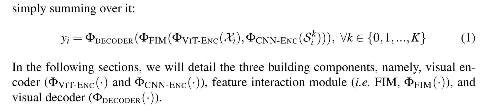
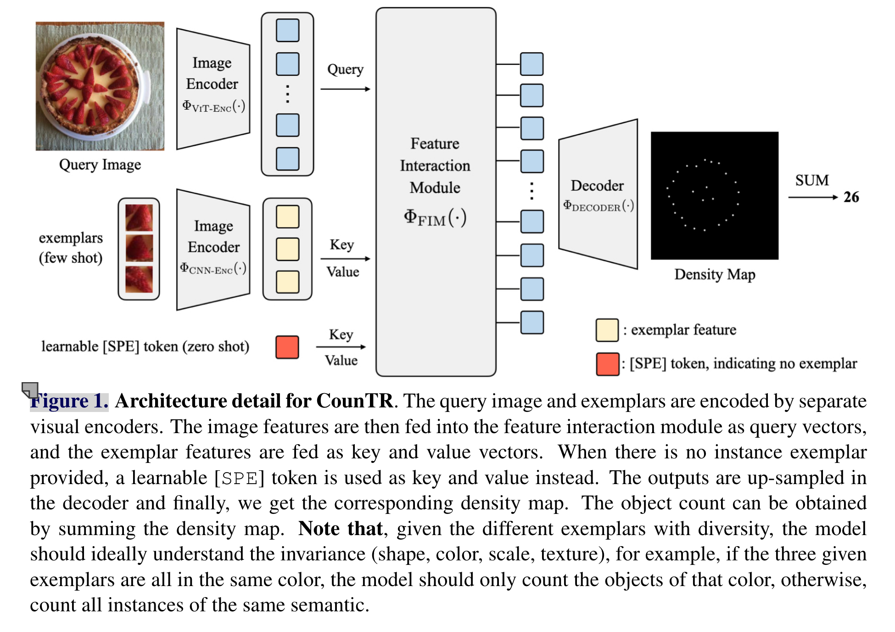
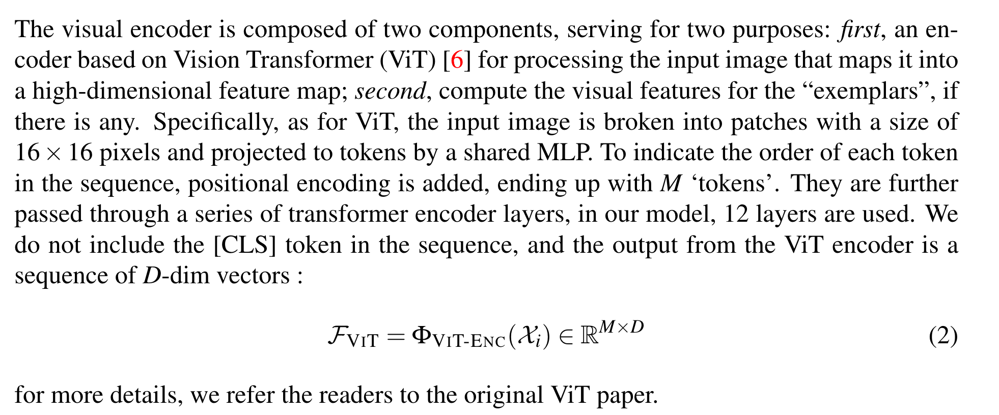
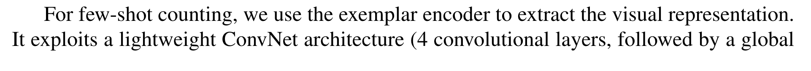
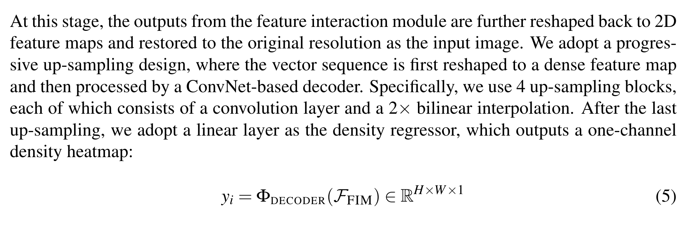
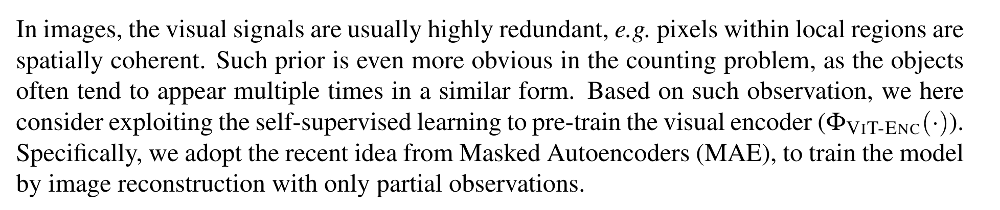
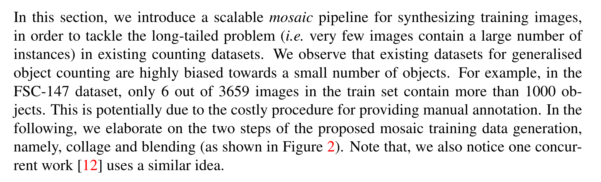
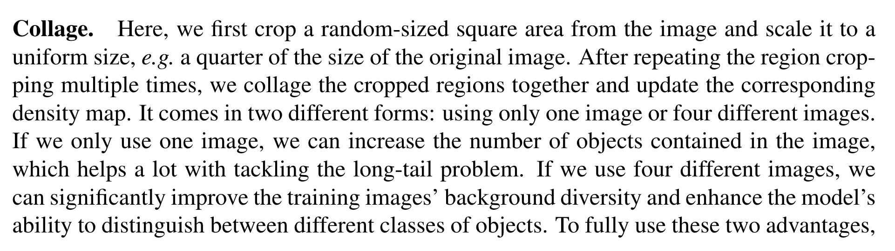
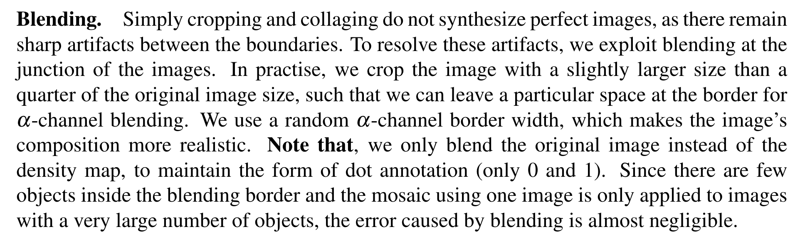
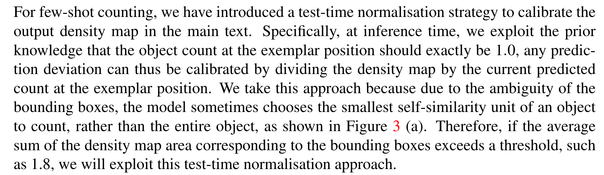

[原文链接](https://arxiv.org/pdf/2208.13721v3)

[源码链接](https://github.com/Verg-Avesta/CounTR)

期刊：BMVC


- 发表时间：BMVC2022 【British Machine Vision Conference】
- 作者：上海交通大学；VGG 视觉几何组 英国哈佛大学
- arxiv日期：2023年2月2日（先发表、后挂的arxiv）

- 引用：

```
@inproceedings{liu2022countr,
  author = {Chang, Liu and Yujie, Zhong and Andrew, Zisserman and Weidi, Xie},
  title = {CounTR: Transformer-based Generalised Visual Counting},
  booktitle={British Machine Vision Conference (BMVC)},
  year = {2022}
}
```

- 文章标题：CounTR: Transformer-based Generalised Visual Counting

基于Transformer的通用、泛化视觉计数

- 本文发现什么问题，解决什么问题？


## ❤ 全文概括

设计模块】（唠唠叨叨说了三遍；摘要说、贡献说、结论说）：

- CountTR；

- 两阶段训练【why？】；

- 合成训练图像【input的创新】；

- 结果sota

【解决什么问题? 】：这篇文章好像更关注目标计数的泛化性。

核心的一句话：

⭐️ the generalised visual object counting problem of counting the number of objects from arbitrary semantic categories using arbitrary number of “exemplars”

⭐️ Any shot counting

## 摘要

本文核心：

- 通用视觉物体计数

- 对于任意类别、给定任意示例

In this paper, we consider the problem of generalised visual object counting, with the goal of developing a computational model for counting the number of objects from arbitrary semantic categories, using arbitrary number of “exemplars”, i.e. zero-shot or few shot counting. 

四个贡献：

To this end, we make the following **four contributions:**

1.  We introduce a novel transformer-based architecture for generalised visual object counting, termed as Counting TRansformer (CounTR), which explicitly captures the similarity between image patches or with given “exemplars” using the attention mechanism; 
2.  We adopt a two-stage training regime, that first pre-trains the model with self-supervised learning, and followed by supervised fine-tuning; 
3. We propose a simple, scalable pipeline for synthesizing training images with a large number of instances or that from different semantic categories, explicitly forcing the model to make use of the given “exemplars”; 
4. We conduct thorough ablation studies on the large-scale counting benchmark, e.g. FSC147, and demonstrate state-of-the-art performance on both zero and few-shot settings. Project page: https://verg-avesta.github.io/CounTR_Webpage/.

本文缺陷：后面的CACViT对比这篇论文

**两阶段 extract-then-match  → 单一阶段，同时 extract-and-match**

四个贡献：

1. 基于Transformer的视觉计数架构，通过注意力机制，捕捉图像块和示例的相似性
2. 两阶段训练：
   1. 第一阶段：自监督学习的预训练模型
   2. 第二阶段：监督、微调
3. 提出了一个简单的、可伸缩的、能够合成训练图像的，大量实例、来自不同的语义类别、使得模型充分利用给定示例
4. 消融实验

对！就是这篇论文，四张图片拼接进行图像合成！把这篇论文和[SemAug CounTR](https://dearrongerr.github.io/Rongerr.github.io/literature/ObejectCounting/rank9%20SemAug_SAFECount/)区分；

- 都是合成图像，本文用的是裁剪、拼接、混合、缩放
- 语义增强的SemAug CounTR用的是：Stable duffusion


翻译一下这里的文字：合成训练图像的处理流程

(1) 代表裁剪和缩放

(2) 代表拼贴和混合

在接下来的部分中，我们将裁剪、缩放和拼贴合并为拼贴阶段。Type A 使用四张不同的图像来提高背景多样性，而 Type B 只使用一张图像来增加图像中包含的物体数量。白色高光区域是经过高斯滤波后的点注释密度图，用于可视化。

### 总结摘要

- 考虑的问题：视觉目标计数的泛化性

- 目的是为了设计一个模型：给定任意数量的示例框，计数 任意的语义物体   

  我们的模型既适用于0-shot情形 也适合 few-shot情形

- 4个贡献：

  1. 设计一个新的Transformer架构 → 捕捉图像patch 与 示例框之间的相似性

  2. 采用两阶段进行训练

     	第一步：自监督学习预训练模型
     	第二步：监督学习进行微调

  3. 设计了一个pipeline，用于合成训练图像

     1. 【什么样的训练图像？】

        	有大量实例
        	 来自不同的语义类别

     2. 【为什么这么做？】

        1. 强迫模型使用 给定的示例框

           > 【示例框为什么加引号？】

  4. 【结果】在FSC147数据集上做消融实验，在0-shot  & 1-shot上都达到了SOTA

- 代码公开、自己做了个网页：[https://verg-avesta.github.io/CounTR_Webpage/](https://verg-avesta.github.io/CounTR_Webpage/)

## <span id="jump">引入-贡献</span>

（原文）To summarise, in this paper, we make four contributions: 

First, we introduce an architecture for generalised visual object counting based on transformer, termed as CounTR (pronounced as counter). It exploits the attention mechanisms to explicitly capture the similarity between image patches, or with the few-shot instance “exemplars” provided by the end user; 

Second, we adopt a two-stage training regime (self-supervised pre-training, followed by supervised fine-tuning) and show its effectiveness for the task of visual counting; 

Third, we propose a simple yet scalable pipeline for synthesizing training images with a large number of instances, and demonstrate that it can significantly improve the performance on images containing a large number of object instances; 

Fourth, we conduct thorough ablation studies on the large-scale counting benchmark, e.g. FSC-147 [24], and demonstrate state-of-the-art performance on both zero-shot and few-shot settings, improving the previous best approach by over 18.3% on the mean absolute error of the test set.

#### 总结 引入-贡献

我们的模型有4个贡献：

1. 【新的网络架构】CounTR : 基于Transformer；关注可见物体的泛化 计数能力，这表明：

   1. 注意力机制能清楚地捕捉到image patches之间的相似性
   2. 或者 few-shot任务中，给定示例框之间的相似性

2. 【两阶段训练】采用两阶段训练过程，具体来说就是

   1. 自监督学习进行预训练
   2. 监督学习进行微调

   并验证了这个方法 对于视觉计数任务的有效性

3. 【合成图片】还提出了一个简单 并且尺度可变的 pipeline 来合成有大量实例的 训练图片；并表明 它能显著提高 模型  图像在有大量计数对象的情况下的 计数性能

4. 【结果】我们在大规模计数benchmark下，进行了整个消融实验，比如FSC147数据集

   1. 我们的结果：0-shot、1-shot 都是sota
   2. 具体来说：MAE； test set ；之前最好的方法 提升超18.3%

## 结论

原文：

In this work, we aim at the generalised visual object counting problem of counting the number of objects from arbitrary semantic categories using arbitrary number of “exemplars”. We propose a novel transformer-based architecture for it, termed as CounTR. It is first pretrained with self-supervised learning, and followed by supervised fine-tuning. We also propose a simple, scalable pipeline for synthesizing training images that can explicitly force the model to make use of the given “exemplars”. Our model achieves state-of-the-art performance on both zero-shot and few-shot settings.

**【再次重申本文的研究target】**

摘要和结论都在强调

我们的模型致力于：一般化的视觉物体计数问题

具体来说就是：  **使用任意数量的样例 计数 任意语义类别的对象数量**

因此，

我们设计了一个 新的 基于Transformer的架构 叫 CountTR，

CountTR =》 两阶段训练 = 自监督学习 预训练  + 监督学习 微调

pipeline：合成训练图像  =》是的模型能够利用给定的 样例

0-shot、few-shot 都是 sota

### 随手记

scalable：可伸缩的

pipeline：整个数据处理和模型训练的流程、端到端的工作流程，涵盖了从原始数据到最终结果的全过程

pipeline是整个流程的概述

backbone是模型中的关键特征提取部分

benchmark是用于评估模型性能的标准测试和指标

mosaic training data generation, namely, collage and blending

## 引入

**<u>第一段：小于5的能快速计数，数量增多计数能力急剧下降</u>**

Despite all the exceptional abilities, the human visual system is particularly weak in counting objects in the image. In fact, given a visual scene with a collection of objects, one can only make a rapid, accurate, and confident judgment if the number of items is below five, with an ability termed as subitizing [16]. While for scenes with an increasing number of objects, the accuracy and confidence of the judgments tend to decrease dramatically. Until at some point, counting can only be accomplished by calculating estimates or enumerating the instances, which incurs low accuracy or tremendous time cost.

第二段：我们文章的目标 通用视觉物体计数系统

In this paper, our goal is to develop a **generalised visual object counting system**, that augments humans’ ability for recognising the number of objects in a visual scene. .......

To this end, we propose a novel architecture that transforms the input image (with the few-shot annotations if any) into a density map, and the final count can be obtained by simply summing over the density map.

第三段：

Specifically, we take inspiration from Lu et al. [19] that self-similarity is a strong prior in visual object counting, and introduce a transformer-based architecture where the self-similarity prior can be explicitly captured by the built-in attention mechanisms, both among the input image patches and with the few-shot annotations (if any).

视觉物体的自相似性；Transformer的注意力机制能捕捉图像块和示例的自相似性

We propose a two-stage training scheme, with the transformer-based image encoder being firstly pre-trained with self-supervision via masked image modeling [11], followed by supervised fine-tuning for the task at hand.

两阶段训练模式；

基于Transformer的图像编码器首先通过掩码图像建模进行自监督预训练

然后对手头的任务进行有监督的微调。

We demonstrate that self-supervised pre-training can effectively learn the visual representation for counting, thus significantly improving the performance. 

我们证明了自监督的预训练能有效学习计数的视觉表示、并提高性能

Additionally, to tackle the long-tailed challenge in existing generalised visual object counting datasets, where the majority of images only contain a small number of objects, we propose a simple, yet scalable pipeline for synthesizing training images with a large number of instances, as a consequence, establishing reliable data sources for model training, to condition the user provided instance exemplars.（句子是真长）

⭐️ 为了解决 现有通用视觉目标计数数据集的 一直存在的问题，那就是 大多数训练图像只包含一小部分数量的物体，我们提出了简单的、可伸缩的架构，用于合成含有大量实例的训练图片→建立了可靠的数据集 用于模型训练

[第四段：贡献](#jump)

## 相关工作

相关工作就两段：

- 视觉物体计数
- 类无关目标计数

**第一段：Visual object counting**. 

首先指出，目标计数问题的方法分成两类：基于检测的和基于回归的

> In the literature, object counting approaches can generally be cast into two categories: detection-based counting [3, 5, 13] or regression-based counting [1, 2, 4, 15, 17, 20, 29]. 

基于检测的......

> The former relies on a visual object detector that can localize object instances in an image. This method, however, requires training individual detectors for different objects, and the detection problem remains challenging if only a small number of annotations are given. 

基于回归的......将图像映射成标量，或者将图像映射成密度图

> The latter avoids solving the hard detection problem, instead, methods are designed to learn either a mapping from global image features to a scalar (number of objects), or a mapping from dense image features to a density map, achieving better results on counting overlapping instances. 

但是指出问题，先前的计数方法不管是基于检测的还是基于回归的，都只能计数特定类别的物体，所以引出第二段，类无关计数

> However, previous methods from both lines (detection, regression) have only been able to count objects of one particular class (e.g. cars, cells).

**第二段 Class-agnostic object counting.** 

给出问题定义

> Recently, class-agnostic few-shot counting [19, 24, 30] has witnessed a rise in research interest in the community. Unlike the class-specific models that could only count objects of specific classes like cars, cells, or people, class-agnostic counting aims to count the objects in an image based on a few given “exemplar” instances,thus is also termed as **few-shot counting**. 

目标：训练阶段，挖掘不同类别目标的共性

Generally speaking, class-agnostic few-shot counting models need to mine the commonalities between the counts of different classes of objects during training. 

**文献 GMN**

In [19], the authors propose a generic matching network (GMN), which regresses the density map by computing the similarity between the CNN features from image and exemplar shots; 

**FamNet**  

FamNet [24] utilizes feature correlation for prediction and uses adaptation loss to update the model’s parameters at test time; 

**SAFECount**

SAFECount [30] uses the support feature to enhance the query feature, making the extracted features more refined and then regresses to obtain density maps; 

**[12]**

In a very recent work [12], the authors exploit a pre-trained DINO [21] model and a lightweight regression head to count without exemplars. 


**本文：基于Transformer的，CounTR**

In this paper, we also use transformer-based architecture, however, train it from scratch, and augment it with the ability to count the objects with any shot.

## 3 Methods


本文主要考虑 泛化物体计数

计数图片中任意类别的物体，使用任意数量的样例框，样例框的数量从0~few

### Overview


符号说明：

- $\mathcal{D_{train}}={(\mathcal{X_1,S_1,y_1}),...,(\mathcal{X_N,S_N,y_N})}$

  - 输入图片： $\mathcal{X_i} \in \mathbb{R}^{H \times W \times3}$
  - 样例框符号说明：
    -  $\mathcal{S_i} = \{b_i\}^K$ exemplar 示例框
    -  $b_i^k \in \mathbb{R}^4$  
    - $K \in \{0,1,2,3....\}$

  - $y_i \in \mathbb{R}^{H \times W \times 1}$

- $\mathcal{D_{test}}={(\mathcal{X_{N+1},S_{N+1}}),...,(\mathcal{X_M,S_M})}$

- disjoint


- 基于Transformer的计数模型，所以叫CounTR
- Transformer中的注意力机制能够显式地比较任何其他空间位置和"样例"之间的视觉特征，这些特征是由最终用户在小样本场景中提供的
- 3.2节 介绍了一种两阶段的训练机制，即首先通过掩码图像重建( MAE )进行自监督预训练，然后在下游计数任务上进行微调。这是第一个展示自监督预训练对通用视觉对象计数的有效性的工作
- 3.3节  提出了一种新颖的、可扩展的图像合成架构；以解决现有物体计数数据集中长尾分布(也就是说,具有大量实例的图像往往是不频繁的)的挑战
- 3.4节 将介绍测试时间正规化方法，包括测试时间正规化和测试时间裁剪(?)

## 3.1 Architecture




- 视觉特征编码器  $\Phi_{VIT-ENC}(\cdot)$ 、$\Phi_{CNN-ENC}(\cdot)$
- 特征交互模块
- 解码器



- 图像特征：query
- 示例框特征：key & value

- 没有示例框，就有个可学习的token作为key & value

#### 3.1.1 Visual Encoder



视觉编码器包括两个部分

- 基于ViT的编码器，处理输入图像特征，映射为高维特征图
- 计算示例框的视觉特征
- 对于ViT来说，输入图片划分成16×16的patches
- 12层，使用了位置编码，没有cls token

- ViT的输出是一个d维向量




CNN提取示例框特征

### 3.1.2 Feature Interaction Module


- 特征交互模块 融合信息
- 由一系列解码器组成
- 图像特征作为query、样本特征 经过两个不同的线性层 处理，得到 key 和 value
- FIM的输出 和 $\mathcal{F_{VIT}}$ 的输出保持相同的维度

总结一下，公式：


### 3.1.3 Decoder



- 特征交互模块的输出结果被进一步重塑回二维特征图，并恢复到原始分辨率作为输入图像

- 采用渐进式上采样设计，首先将向量序列重塑为稠密的特征图，然后通过基于ConvNet的解码器进行处理。

  > 具体来说，使用了4个上采样块，每个上采样块由一个卷积层和一个2 ×双线性插值组成。在最后一次上采样之后，采用线性层作为密度回归器，输出单通道的密度热图

## 3.2 Two-stage Training Scheme



指出问题：视觉信号是高度冗余的，物体通常以相同的形式多次出现

因此采用自监督学习方法预训练视觉编码器 $\Phi_{VIT-ENC}(\cdot)$

采用Masked自编码器( MAE )的思想，通过仅使用部分观测值的图像重建来训练模型。


合成训练图像

第一步，裁剪 & 缩放

第二步 ，拼接 & 混合

融合才叫、缩放、拼接

A类使用4幅不同的图像来提高背景多样性，B类只使用一幅图像来增加一幅图像中包含的物体数量。白色高光是高斯滤波后用于可视化的点标注密度图。


自监督预训练 掩码自编码器

首先将图像划分为规则的非重叠块，并且只采样块( 50 %)的子集作为ViT编码器的输入。

计算得到的特征进一步通过一个轻量级解码器传递，该解码器由若干个转换器解码器层组成，其中可学习的掩码token和位置编码的组合被用作Query，仅从观察到的patch重建输入图像。

训练损失简单定义为重建图像与输入图像在像素空间的均方误差( MSE )。


 有监督的微调

- 使用预训练的ViT的初始权重，初始化图像编码器
- 并对我们提出的通用物体计数架构进行微调
- 模型的输入：原始图像 $\mathcal{X}_i$ + $K$ 个示例框 $\mathcal{S}_i =\{b_i\}$
- 输出密度图 $\hat{y}_i \in \mathbb{R}^{H×W×1}$
- 图像 $C_i \in \mathbb{R}$ 中显著物体的统计数量 通过对 离散密度图  $y_i$ 求和得到
- 我们使用每个像素的均方误差 计数估计密度图 $\hat{y_i}$ 和真实 密度图  $y_i$ 差异
- 真实密度图的生成：基于点注释

## 3.3 Scalable Mosaicing



缩放拼接框架、合成训练图像、处理长尾效应

现有的数据集 目标物体的数量较少

- 在FSC - 147数据集中，在训练集中的3659张图像中，仅有6张图像包含超过1000个物体。这可能是由于提供人工注释的昂贵程序造成的
- 接下来，介绍提出的 合成训练数据生成的两个步骤




**拼接**

首先从图像中裁剪一个随机大小的正方形区域，并将其缩放，例如原始图像大小的四分之一。在多次重复区域裁剪后，我们将裁剪的区域拼贴在一起并更新相应的密度图。它有两种不同的形式：只使用一张图像或使用四张不同的图像。

如果我们只使用一张图像，我们可以增加图像中包含的对象数量，这在解决长尾问题上非常有帮助。如果我们使用四张不同的图像，我们可以显著提高训练图像的背景多样性，并增强模型区分不同类别对象的能力。为了充分利用这两个优势，我们制定了以下设置。如果图像中包含的对象数量超过某个阈值，我们使用相同的图像进行拼贴；如果没有，我们使用四张不同的图像。请注意，如果使用了四张不同的图像，我们只能使用少量样本（few-shot）设置进行推理，否则模型将不知道要计数哪个对象。如果我们使用相同的图像，拼贴后的图像可以用来训练少量样本设置和零样本（zero-shot）设置。


图3. 测试时归一化过程的可视化。在测试时归一化中，如果密度图中示例位置的平均总和超过1.8，则密度图的总和将除以这个平均值以成为最终预测。在测试时裁剪中，如果至少有一个示例的边长小于10像素，图像将被裁剪成9个部分，模型将分别处理这9个图像。最终预测将是这9个图像结果的总和。



**混合**

混合。简单地裁剪和拼接并不能合成完美的图像，因为边界之间仍然存在明显的人工痕迹。为了解决这些人工痕迹，我们利用图像连接处的混合技术。在实践中，我们裁剪的图像尺寸略大于原始图像尺寸的四分之一，这样我们可以在边界留出特定的空间用于α通道混合。我们使用随机的α通道边界宽度，这使得图像的合成更加真实。请注意，我们只混合原始图像而不是密度图，以保持点注释的形式（只有0和1）。由于混合边界内的对象很少，且使用一张图像制作的马赛克仅适用于对象数量非常多的图像，因此混合引起的误差几乎可以忽略不计。

## 3.4 Test-time Normalisation



对于少量样本计数，我们在正文中引入了一种测试时的归一化策略来校准输出密度图。具体来说，在推理时，我们利用先验知识，即示例位置的对象计数应该恰好是1.0，因此任何预测偏差都可以通过将密度图除以示例位置当前预测的计数来校准。我们采取这种方法是因为由于边界框的歧义，模型有时选择对象的最小自相似单元进行计数，而不是整个对象，如图3（a）所示。因此，如果对应于边界框的密度图区域的平均总和超过一个阈值，例如1.8，我们将利用这种测试时的归一化方法。


此外，对于包含微小物体的图像（一个示例的边长小于10像素），我们采用滑动窗口预测方法，将图像等分为九个部分，并将其缩放回原始大小，以便我们的模型分别处理。物体的总数是这九个图像的单独计数结果的总和。

