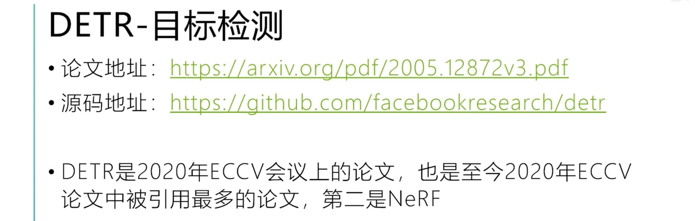
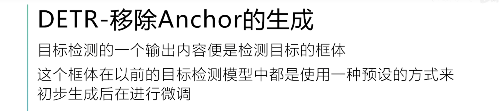
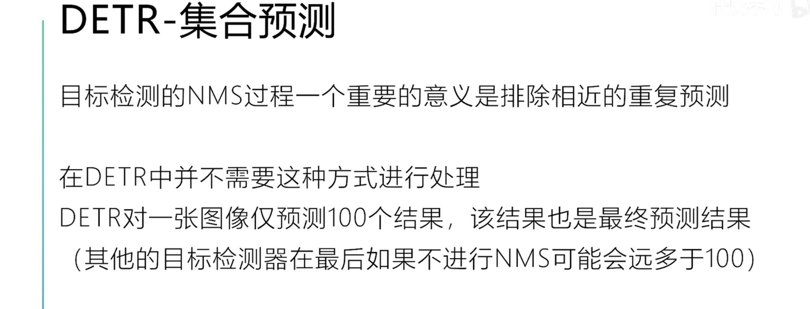
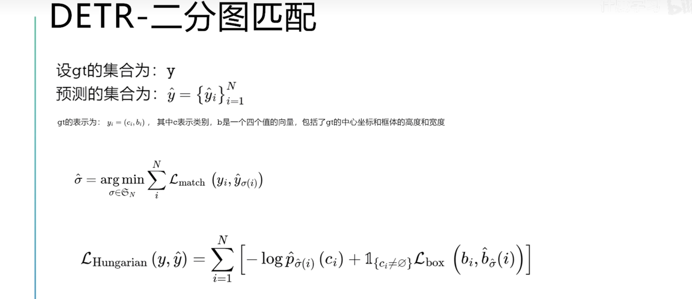
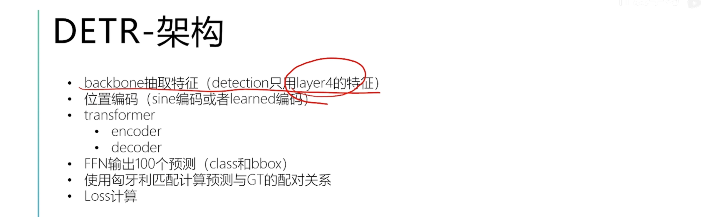
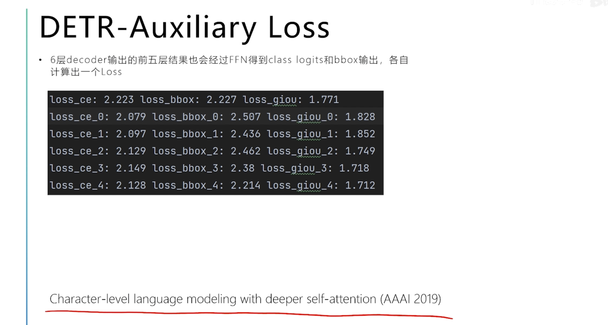
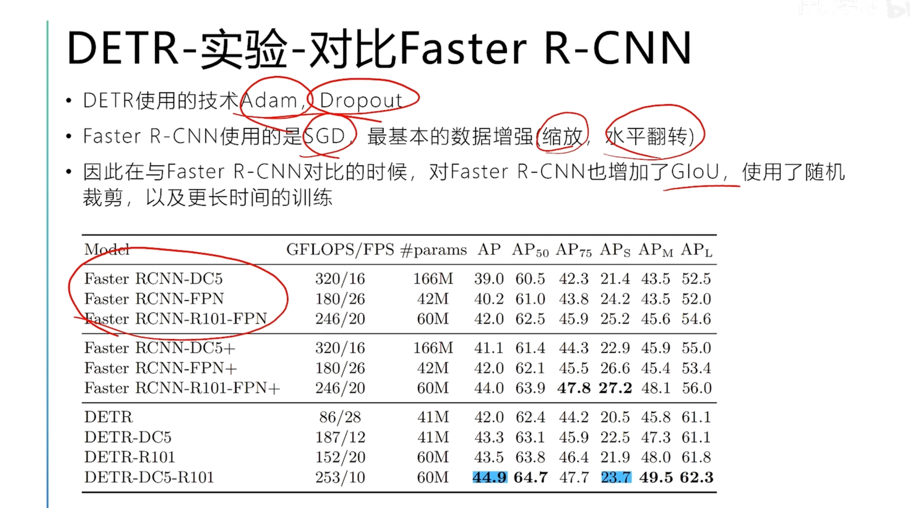
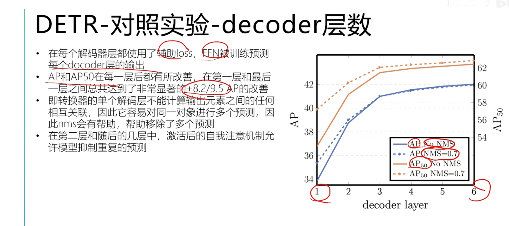
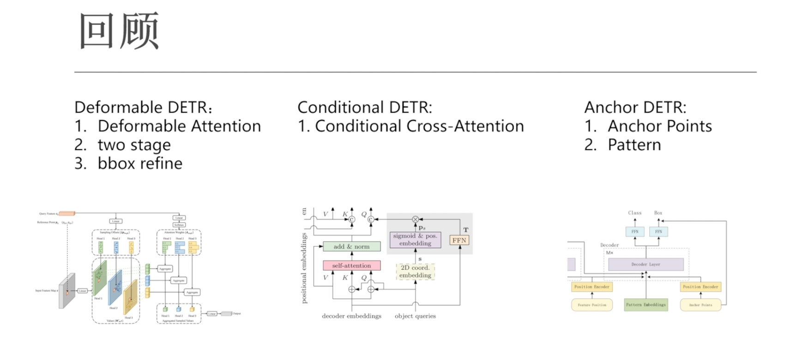
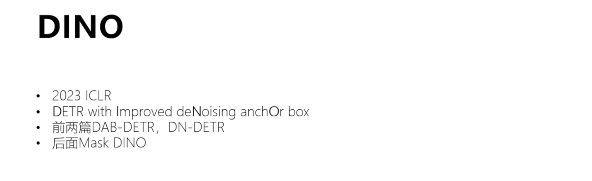

#  [DETR论文系列](https://www.bilibili.com/video/BV1sK41167w5?spm_id_from=333.788.videopod.sections&vd_source=ddd7d236ab3e9b123c4086c415f4939e)

[TOC]

## DETR论文

rpn阶段、roi阶段两次sample正负样本的数量

首先在rpn阶段，首先生成不同比例的宽高，以及在不同比例的特征图的比例上生成

需要定义anchor的宽高比、数量

fast RCNN需要在rpn阶段、roi阶段进行两次NMS的计算，消除相同位置重复区域的预测

DETR移除了Anchor的生成，在fast rcnn中，需要在第一阶段生成预设的数量以及宽高比，一些anchor，这些anchor在后续的第二阶段，在网络的输出中进行微调，DETR完全摒弃了这种方式

DETR属于集合预测的模型

目标检测NMS的过程就是排除掉在一些相近的位置上对于同一个类别重复的预测

在DETR中，是没有了这个过程，网络所给出的输出在定义中就是100个结果，这100个结果也是最终的网络预测的结果，包括图片中隐式类的结果，或者某些预测结果是没有目标的，这个预测值100指的是在所有可能的预测结果中的最大值，一般来说一张图片也不会定义100个gt，在其他的目标检测中，在最后一个阶段输出的网络结果的目标框，在没有进行NMS之前，这个数量是多过于100的

DETR的两个核心内容：

一个是Transformer的结果，从标题中就可以看出；第二个是指的二分图匹配

首先介绍二分图匹配

二分图就是定义了两个集合，在每一个集合，在各自的集合内，每一个点没有连接，在两个集合间，有边进行连接；二分图匹配与匈牙利算法，就是如何计算两个集合得到最优分配的问题

辅助损失

但是对于小目标的结果不太好，可能Transformer不太适合小目标

### DETR是什么？

## Deformable DETR 可变形

## Conditional DETR 有条件的DETR

## Anchor DETR

## DAB-DETR

##  DN-DETR 去噪DETR

## DINO

## Lite DETR

## Focus DETR

##  H-DETR

